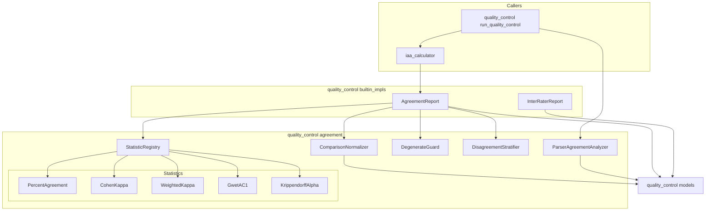
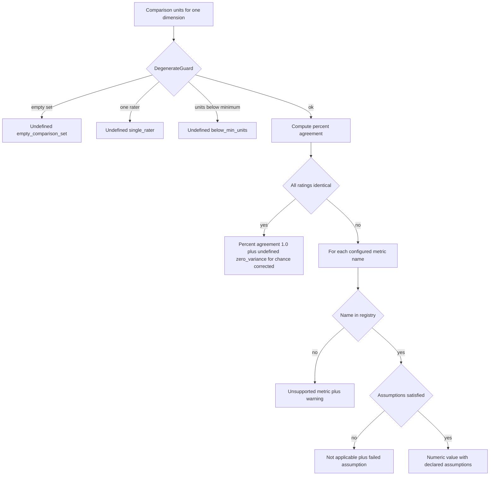
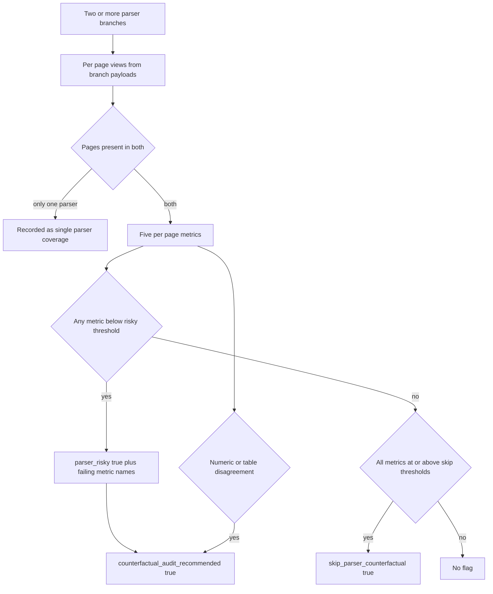
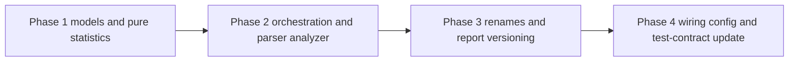

# Design Document — agreement-statistics

## Overview

This feature replaces EviTrace's mislabelled "agreement" numbers with named, statistically-defined agreement statistics, and adds the parser-agreement metrics and parser-risk flags that downstream routing needs. It delivers a pure-Python agreement package inside `src/quality_control/` that turns two raters' per-field outputs into comparison units, computes percent agreement plus four chance-corrected statistics (Cohen's kappa, weighted kappa, Gwet's AC1, Krippendorff's alpha) with declared assumptions and explicit undefined results, stratifies disagreement across five dimensions, and computes per-page parser agreement with configurable risk thresholds.

Users are clinical researchers and evidence-synthesis reviewers who read the per-PDF quality-control artifact, plus the downstream specs (`evidence-routing`, `multiagent-extraction`, `evaluation-harness`) that consume the flags and numbers this feature publishes.

Impact: the inter-rater agreement stage of the QC pipeline stops being a stub. `InterRaterReport`'s pass/fail ratio is renamed to status concordance and demoted from the default IAA implementation; `adjudicator._compute_agreement_score` and `checks/extractor_agreement.agreement_rate` are renamed to describe what they measure with numeric behavior unchanged; `ctx.metrics_hierarchy` gains two new top-level keys so agreement results reach disk for the first time.

### Goals

- Satisfy `xtrace-toolkit` R-QC-3: every published reliability figure carries a statistic name, its assumptions, and either a value on its own defined range or an explicit undefined reason.
- Make degenerate cases (empty set, single rater, zero variance, too few units) loud rather than silently favourable.
- Publish per-page parser agreement, the parser-risky flag, the skip-counterfactual signal, and the counterfactual-audit-recommended flag as data, with the thresholds that produced them.
- Resolve roadmap Open Question 4 with concrete, configurable default thresholds and a recorded rationale.
- Keep every change inside `src/quality_control/` (plus its config defaults), respecting the rule that `quality_control` imports nothing from `agents`, `pipeline`, or `pdf_extractor`.

### Non-Goals

- Producing the second independent extraction that makes per-field two-rater comparison possible (`multiagent-extraction`).
- Acting on any flag: stricter verification, re-extraction, counterfactual audit, human review, or escalation (`evidence-routing`, `multiagent-extraction`).
- Changing which branch adjudication selects or how reconciliation merges. The 0.15-weighted branch-scoring term is renamed only; its value and weight are untouched.
- Deterministic single-parser QC metrics and the parser QC report artifact (`provenance-audit-export`).
- Confidence intervals or significance tests for any statistic. Point estimates with declared assumptions only.
- Any reporting or review user interface.

## Boundary Commitments

### This Spec Owns

- The `ComparisonUnit` model and the normalization rules that build it from two raters' per-field outputs (Requirement 1).
- The `RaterFieldOutput` input contract that upstream extractors populate — defined here, stabilized here.
- The catalogue of agreement statistics, their names, declared assumptions, applicability rules, and undefined reason codes (Requirements 2–7).
- The pure-Python implementations of percent agreement, Cohen's kappa, weighted kappa, Gwet's AC1, and Krippendorff's alpha.
- The disagreement stratification model across field, field group, document, parser risk, and criticality (Requirement 8).
- Per-page parser agreement metrics, the parser-risky flag, the skip-parser-counterfactual signal, and the counterfactual-audit-recommended flag, together with their default thresholds (Requirements 9–10).
- The **list-shaped** publication of parser agreement: one result per analyzed branch pair, plus the designation of a primary pair from configuration, which is what downstream risk consumption reads by default.
- The honest naming of the three existing ratios and the versioning of the reports that carry them (Requirement 11).
- The shape of `metrics_hierarchy["inter_rater_agreement"]` and `metrics_hierarchy["parser_agreement"]`, and the `quality_control.iaa_calculator.*` / `quality_control.parser_agreement.*` configuration surface (Requirement 12).
- The **public agreement entry point** `compute_agreement(units, config) -> dict`, re-exported from `src/quality_control/__init__.py`. It is a documented, pure, side-effect-free function that **any** caller may use — it is not private to the QC pipeline and not reachable only through `_pdf_iaa_fn`. Named consumers: this spec's own IAA stage, `multiagent-extraction` (agent-versus-agent units), and `evaluation-harness` (human-reference-versus-system units for its Requirement 2.3 / metric 6.2). See the Public Surface note under `iaa_calculator`.

### Out of Boundary

- Generating the second rater's field outputs. This design consumes `RaterFieldOutput` records; it never produces them.
- Any consumption of the flags it publishes. No component in this design changes routing, verification depth, extraction, or review state.
- The adapter that turns the published per-pair list into a page-indexed mapping for risk consumption. That belongs to `evidence-routing` and is built there; this design publishes the list and names the primary pair, and does nothing further.
- Deterministic evidence validity checks and their outcomes (Requirement 13). This design reads nothing from them and writes nothing to them.
- Adjudication and reconciliation semantics. `BranchQualityScore.composite` keeps its exact arithmetic.
- Sentence segmentation, heading detection, table detection, and OCR. Page-level views arrive pre-normalized from the caller; the analyzer never re-derives them.
- Confidence intervals, bootstrapping, or statistical inference beyond point estimates.

### Allowed Dependencies

- `src/quality_control/models.py` for all shared dataclasses (this design adds to it; it does not create a second model module).
- The Python standard library only. No new third-party dependency is introduced; the four formulas are implemented directly.
- The existing `_extract_branch_payload` normalization already present in `src/quality_control/quality_control.py` supplies page text and blocks to the parser-agreement analyzer through the caller, by injection.
- `src/utils/config_utils.py` `_QC_DEFAULTS` and `configs/config.yaml` for configuration defaults.
- Forbidden, unchanged: `quality_control` must not import `agents`, `pipeline`, or `pdf_extractor`; nothing under `quality_control/checks/` may import `text_processing` or any heavy optional dependency at module level.

### Revalidation Triggers

- Any change to the `RaterFieldOutput` field set or to `AgreementDimension` membership — `multiagent-extraction` populates it.
- Any change to the `PageAgreementRecord` shape or to the names of the three page flags — `evidence-routing` consumes them.
- Any change to the `metrics_hierarchy` key names `inter_rater_agreement` or `parser_agreement`, or to the serialized dict shape under them — artifact consumers and `provenance-audit-export` read them.
- **Any change to the `strata` list published under `metrics_hierarchy["inter_rater_agreement"]`, or to the `DisagreementStratum` field set (`axis`, `key`, `dimension`, `unit_count`, `disagreement_rate`, `statistics`, `availability`), or to the `axis` vocabulary — in particular the `field_group` axis value — `multiagent-extraction` must re-validate.** Its `AgreementView` reads per-field-group agreement from `strata` filtered to `axis == "field_group"` and `dimension == "value"`; per-group results exist nowhere else, because `statistics` is keyed by dimension, not by field group. Renaming an axis, dropping a stratum, or moving per-group results out of `strata` breaks that consumer silently.
- **Any change to the `compute_agreement(units, config) -> dict` signature, its purity guarantee, or its returned dict shape — `evaluation-harness` must re-validate.** It is that spec's only reachable entry point into this computation (see the public-surface note below).
- **Any change to the published parser-agreement result being a list of per-pair results, to the per-pair record's fields, or to how the primary pair is designated — `evidence-routing` must re-validate.** It owns the list-to-page-indexed-mapping adapter on its side.
- Any change to the default risk thresholds in Requirement 10.2/10.3 — these are the recorded resolution of roadmap Open Question 4; changing them re-opens it.
- Adding a statistic name to the registry, or changing an existing statistic's declared assumptions.

## Architecture

### Existing Architecture Analysis

The QC pipeline is a four-stage sequence over a mutable `QCBundle`: `rater_fn` → `iaa_fn` → `adjudicator_fn` → `reconciler_fn` (`quality_control.py::run_pipeline`). The PDF-specific stage closures are built in `run_quality_control`. Three facts shape this design:

1. **The IAA stage is hard-wired.** `_pdf_iaa_fn` constructs `InterRaterReport()` directly. Unlike `text_processor`, the `InterRaterMetrics` ABC has no fully-qualified-class-path loader. One must be added (Requirement 12.5), following the existing `_load_text_processor` pattern.
2. **`InterRaterMetrics.compute(reports: list[QualityMetrics]) -> None` cannot carry per-field data.** `QualityMetrics` describes a parser branch, not a field extraction. The brief's sketch of "one `InterRaterMetrics` subclass per statistic" does not fit that signature. Resolution: statistics live behind their own narrow `AgreementStatistic` ABC over rating vectors; a single `InterRaterMetrics` subclass (`AgreementReport`) orchestrates them and receives comparison units through its constructor, leaving the shipped ABC signature untouched.
3. **`ctx.iaa_metrics` reaches no artifact.** `artifact_generation/extraction_artifact.py::unified_to_artifact` serializes `metrics_hierarchy` but not `iaa_metrics` or `decision`. Publishing through `metrics_hierarchy` therefore requires no change outside `quality_control` — but two existing tests assert `metrics_hierarchy` holds *exactly* three keys and must be updated (see Migration Strategy).

Technical debt addressed: the dead `iaa_calculator.investigate()` stub gains a real computation path while keeping its pinned return keys; `InterRaterReport`, currently untested, gains coverage.

### Architecture Pattern & Boundary Map

Selected pattern: a layered pure-core package (`quality_control/agreement/`) with strategy objects at the statistic layer and injection at every boundary that would otherwise require a forbidden import. Statistics are pure functions over rating vectors, which makes them directly testable against published worked examples with no fixtures beyond a rating table.



**Architecture Integration**

- Domain boundaries: normalization, statistic computation, degeneracy detection, stratification, and parser comparison are five separate responsibilities with no shared mutable state. Each is independently testable and independently implementable.
- Existing patterns preserved: strategy-by-ABC (`InterRaterMetrics`), fully-qualified-class-path loading via `importlib` (mirroring `_load_text_processor`), injection of anything that would otherwise pull a forbidden import, and plain-dict publication into `metrics_hierarchy`.
- New components rationale: `agreement/` exists because none of the five responsibilities has a home today and `quality_control.py` is already 805 lines. `AgreementReport` exists because the shipped `InterRaterMetrics` signature cannot carry per-field data and must not be changed.
- Dependency direction inside the feature (each layer imports only leftward): `models` → `agreement/statistics` → `agreement/{comparison, degenerate, stratification, parser_agreement}` → `builtin_impls/agreement_report` → `iaa_calculator` → `quality_control.py`.
- Steering compliance: all shared dataclasses go in `models.py`; concrete ABC implementations go in `builtin_impls/`; no heavy optional dependency is introduced; no new top-level YAML key is required.

### Technology Stack

| Layer | Choice / Version | Role in Feature | Notes |
|-------|------------------|-----------------|-------|
| Language / Runtime | Python 3.12.x | All computation | Existing project pin |
| Statistics | Standard library only (`math`, `fractions` where exactness matters) | Four agreement formulas implemented directly | Build-not-adopt; see research.md |
| Data modelling | `dataclasses` | All new models in `models.py` | Matches existing QC convention |
| Component loading | `importlib` | Fully-qualified class path for the IAA implementation | Mirrors `_load_text_processor` |
| Configuration | YAML via `src/utils/config_utils.py` | Metric selection and thresholds | Nested under existing `quality_control` key |
| Testing | pytest + Hypothesis | Worked-example fixtures and property tests | Existing conventions |

## File Structure Plan

### Directory Structure

```
src/quality_control/
├── agreement/                       # NEW package — all agreement computation
│   ├── __init__.py                  # public exports for the package
│   ├── comparison.py                # ComparisonNormalizer: RaterFieldOutput pairs -> ComparisonUnit
│   ├── degenerate.py                # DegenerateGuard: applicability + undefined reason codes
│   ├── registry.py                  # StatisticRegistry: metric name -> AgreementStatistic
│   ├── stratification.py            # DisagreementStratifier: five-dimension breakdown
│   ├── page_views.py                # PageViewBuilder: branch payload -> per-page PageView
│   ├── parser_agreement.py          # ParserAgreementAnalyzer: per-page metrics + flags
│   └── statistics/
│       ├── __init__.py
│       ├── base.py                  # AgreementStatistic ABC + shared marginal/contingency helpers
│       ├── percent_agreement.py     # PercentAgreement
│       ├── cohen_kappa.py           # CohenKappa and WeightedKappa (shared contingency table)
│       ├── gwet_ac1.py              # GwetAC1
│       └── krippendorff_alpha.py    # KrippendorffAlpha (coincidence matrix)
└── builtin_impls/
    └── agreement_report.py          # NEW — AgreementReport(InterRaterMetrics), the new default
```

### Modified Files

- `src/quality_control/models.py` — adds `AgreementDimension`, `MeasurementLevel`, `UndefinedReason`, the `RATING_MISSING` / `RATING_NOT_REPORTED` sentinels, `RaterFieldOutput`, `ComparisonUnit`, `RatingSample`, `StatisticResult`, `DisagreementStratum`, `PageView` (including its `headings_available` / `tables_available` flags), `PageAgreementRecord` (including its `unavailable_signals` list), `ParserAgreementThresholds`, `ParserAgreementResult` (per branch pair), and `ParserAgreementReport` (the published list container with its primary-pair designation). The full definitions are in the Logical Data Model below. No existing model changes.
- `src/quality_control/builtin_impls/inter_rater_report.py` — `pairwise` becomes the deprecated read-only alias of a new `status_concordance` field; docstring stops calling it agreement (Requirement 11.1).
- `src/quality_control/builtin_impls/__init__.py` — exports `AgreementReport`, owned by the task that creates it; and its export docstring line describing `InterRaterReport` as the "default inter-rater agreement report (pairwise pass/fail)" is rewritten to name it status concordance, owned by the task that renames that report.
- `src/quality_control/__init__.py` — re-exports `AgreementReport` and the `agreement` package entry points, and the public agreement surface any external caller needs: `compute_agreement`, `ComparisonNormalizer`, `ComparisonUnit`, and `RaterFieldOutput`. Owned by the task that creates `AgreementReport`, except `compute_agreement`, which is owned by the task that adds it to `iaa_calculator`.
- `src/quality_control/iaa_calculator.py` — adds `load_inter_rater_metrics(config)` (importlib loader) and `compute_agreement(units, config) -> dict`; `investigate()` keeps its pinned return keys and now resolves configured metric names through the registry instead of emitting `None`. Parser agreement is *not* routed through this module — it is published separately by the pipeline wiring, so `compute_agreement` takes no page views.
- `src/quality_control/quality_control.py` — `_pdf_iaa_fn` builds the configured `InterRaterMetrics` implementation and writes `metrics_hierarchy["inter_rater_agreement"]`; a new parser-agreement step writes `metrics_hierarchy["parser_agreement"]`. Additionally, `_extract_tei_payload` stamps each block it emits with an optional `block_type` of `heading`, `table`, `figure`, or `paragraph` — it already visits `<head>` and `<figure>` elements separately and currently discards that distinction. Tables are distinguished from other figures by the TEI `type` attribute (`<figure type="table">`), not by a separate element. The change is safe because block dicts are **not schema-governed at all**: `configs/structure_schema.json` declares `Candidate.payload` as unconstrained (`"payload": {}`) and never describes block structure, and no existing reader inspects the new key. This task is a boundary crossing — it edits `quality_control.py` as well as creating the page-view builder — and is marked as such in the task plan.
- `src/quality_control/adjudicator.py` — `_compute_agreement_score` → `_compute_lexical_overlap_fraction`; `BranchQualityScore.agreement_score` → `lexical_overlap_fraction`; the 0.15 weight and all arithmetic unchanged (Requirement 11.2).
- `src/quality_control/checks/extractor_agreement.py` — `agreement_rate` → `sentence_match_rate`; report gains `report_version` and a `status` key on the enabled path (Requirement 11.3, 11.5).
- `src/utils/config_utils.py` — `_QC_DEFAULTS` gains the new `iaa_calculator` keys and a `parser_agreement` block. No `_ALL_KNOWN_TOP_LEVEL_KEYS` change: both live under the existing `quality_control` key.
- `configs/config.yaml` — adds the `quality_control.iaa_calculator` and `quality_control.parser_agreement` blocks, which are absent today.
- `tests/src/quality_control/test_qc_pipeline_integration.py` — the two assertions that `metrics_hierarchy` holds exactly three keys (`:113` unit test and `:485` Hypothesis property test) are updated to the new five-key set.
- `tests/src/quality_control/test_qc_checks_extractor_agreement.py` — the assertions naming `agreement_rate` and the nine-key report contract are updated to the renamed key and the versioned report shape.

## System Flows

### Statistic computation and degeneracy gating



The guard runs before any statistic so that no formula ever divides by zero, and so that percent agreement can still be reported when chance-corrected statistics cannot be. Zero variance is deliberately separated from the empty and single-rater cases because it is the one where a naive implementation returns a plausible-looking `1.0`.

### Parser agreement and page flags



A page can be neither risky nor skip-eligible; that middle band is deliberate — it means "compare normally", and it is why the two threshold sets are configured independently rather than as one cut point.

## Requirements Traceability

| Requirement | Summary | Components | Interfaces | Flows |
|-------------|---------|------------|------------|-------|
| 1.1–1.7 | Comparison normalization | ComparisonNormalizer, models | `normalize(pairs) -> list[ComparisonUnit]` | — |
| 2.1–2.4 | Percent agreement named honestly | PercentAgreement, AgreementReport | `AgreementStatistic.compute` | Statistic gating |
| 3.1–3.6 | Names, assumptions, metric selection | StatisticRegistry, AgreementStatistic, AgreementReport | `resolve(names)`, `declared_assumptions` | Statistic gating |
| 4.1–4.6 | Cohen's and weighted kappa | CohenKappa, WeightedKappa | `AgreementStatistic.compute` | Statistic gating |
| 5.1–5.5 | Prevalence-robust agreement | GwetAC1, DegenerateGuard | `AgreementStatistic.compute`, prevalence caution | Statistic gating |
| 6.1–6.5 | Krippendorff's alpha | KrippendorffAlpha | `AgreementStatistic.compute` | Statistic gating |
| 7.1–7.6 | Degenerate cases | DegenerateGuard, StatisticResult | `evaluate(units) -> UndefinedReason \| None` | Statistic gating |
| 8.1–8.6 | Disagreement stratification | DisagreementStratifier | `stratify(units) -> list[DisagreementStratum]` | — |
| 9.1–9.7 | Parser agreement metrics | ParserAgreementAnalyzer | `analyze(views_a, views_b)` | Parser agreement |
| 9.8, 9.9 | Unavailable heading/table signals | PageViewBuilder, TEI block tagging | `PageView` availability flags | Parser agreement |
| 10.1–10.7 | Parser-risky pages and thresholds | ParserAgreementAnalyzer | `PageAgreementRecord` flags | Parser agreement |
| 10.8 | Undefined signals never drive a flag | ParserAgreementAnalyzer | `unavailable_signals` | Parser agreement |
| 11.1–11.5 | Renaming the mislabels | InterRaterReport, adjudicator, ExtractorAgreementCheck | `status_concordance`, `lexical_overlap_fraction`, `sentence_match_rate` | — |
| 12.1–12.5 | Publication and configuration | quality_control wiring, iaa_calculator loader, config defaults | `metrics_hierarchy` keys, `load_inter_rater_metrics` | — |
| 13.1–13.4 | Agreement stays observational | AgreementReport, ParserAgreementAnalyzer, quality_control wiring | read-only contract | — |

## Components and Interfaces

| Component | Domain/Layer | Intent | Req Coverage | Key Dependencies (P0/P1) | Contracts |
|-----------|--------------|--------|--------------|--------------------------|-----------|
| ComparisonNormalizer | Agreement core | Turn rater output pairs into comparison units | 1 | models (P0) | Service |
| AgreementStatistic (ABC) | Agreement core | Uniform statistic contract with declared assumptions | 3 | models (P0) | Service |
| PercentAgreement | Statistics | Observed agreement proportion | 2 | base (P0) | Service |
| CohenKappa / WeightedKappa | Statistics | Chance-corrected agreement, nominal and ordinal | 4 | base (P0) | Service |
| GwetAC1 | Statistics | Prevalence-robust chance correction | 5 | base (P0) | Service |
| KrippendorffAlpha | Statistics | General-case alpha with missing ratings | 6 | base (P0) | Service |
| StatisticRegistry | Agreement core | Metric name resolution and unsupported-name handling | 3 | statistics (P0) | Service |
| DegenerateGuard | Agreement core | Detect and name insufficient-data conditions | 7 | models (P0) | Service |
| DisagreementStratifier | Agreement core | Five-dimension disagreement breakdown | 8 | models (P0) | Service |
| PageViewBuilder | Agreement core | Branch payload to per-page views with signal availability | 9.2, 9.8, 9.9 | models (P0) | Service |
| ParserAgreementAnalyzer | Agreement core | Per-page parser metrics and risk flags | 9, 10 | PageViewBuilder, models (P0) | Service |
| AgreementReport | Builtin impls | Default `InterRaterMetrics`; orchestrates and serializes | 2, 3, 7, 8, 12, 13 | registry, guard, stratifier (P0) | Service, State |
| InterRaterReport | Builtin impls | Status concordance under an honest name | 11 | models (P0) | State |
| iaa_calculator | QC stage | Implementation loading and stage entry point | 3, 12 | AgreementReport (P0) | Service |
| QC pipeline wiring | QC stage | Build stage closures, publish into metrics_hierarchy | 12, 13 | all of the above (P0) | Service |

### Agreement Core

#### ComparisonNormalizer

| Field | Detail |
|-------|--------|
| Intent | Convert two raters' per-field outputs into rating vectors comparable on five dimensions |
| Requirements | 1.1, 1.2, 1.3, 1.4, 1.5, 1.6, 1.7 |

**Responsibilities & Constraints**
- Owns the mapping from `RaterFieldOutput` to per-dimension ratings and the record of which normalization rules fired.
- Symmetric by construction: the same rule set is applied to both raters and no argument is designated primary (1.5).
- A not-reported output produces the sentinel rating `NOT_REPORTED`, never a missing rating (1.3). A rater with no output at all produces `MISSING`, and the unit is retained (1.4).
- Assigns each dimension a fixed measurement level: value nominal, evidence nominal, confidence ordinal, support status nominal, not-reported binary (1.6).
- Value normalization is deterministic and lossy by design (case folding, whitespace collapse, unit-free numeric canonicalization); every applied rule is named in `normalization_rules` so the comparison is auditable (1.7).

**Dependencies**
- Inbound: AgreementReport — supplies rater output pairs (P0)
- Outbound: `quality_control.models` — `RaterFieldOutput`, `ComparisonUnit` (P0)

**Contracts**: Service [x]

##### Service Interface
```python
class ComparisonNormalizer:
    def __init__(self, dimensions: tuple[str, ...] = ALL_DIMENSIONS) -> None: ...

    def normalize(
        self,
        outputs: list[RaterFieldOutput],
    ) -> list[ComparisonUnit]:
        """Group outputs by (document_id, field_id) and emit one unit per group."""
```
- Preconditions: every `RaterFieldOutput` carries a non-empty `rater` and `field_id`.
- Postconditions: one `ComparisonUnit` per distinct `(document_id, field_id)`; every configured dimension present in `ratings`; `MISSING` used only for absent rater output.
- Invariants: `normalize` is pure and order-independent with respect to rater sequence; swapping two raters permutes `ratings` values without changing any downstream statistic.

**Implementation Notes**
- Integration: the only producer of `ComparisonUnit`; nothing else may construct one from raw extraction output.
- Validation: rejects duplicate `(rater, document_id, field_id)` triples with a `ValueError` naming the collision.
- Risks: over-aggressive value normalization inflates agreement. Mitigation is that every rule is named in the unit and covered by a dedicated test.

#### AgreementStatistic (ABC) and StatisticRegistry

| Field | Detail |
|-------|--------|
| Intent | One uniform, self-describing contract per statistic, resolved by configured name |
| Requirements | 3.1, 3.2, 3.3, 3.4, 3.5, 3.6 |

**Responsibilities & Constraints**
- Each statistic declares its canonical name, the measurement levels it accepts, and its rater-count range; the registry never infers these (3.1).
- `applies_to` is a precondition check separate from `compute`; when it fails, the registry emits a not-applicable `StatisticResult` naming the failed assumption and no numeric value (3.2).
- An empty configured metric list yields percent agreement only (3.3). An unknown name yields an `UNSUPPORTED_METRIC` result plus a `WARNING` log naming it, and never aborts the remaining metrics (3.4).
- Every statistic is deterministic and side-effect free (3.5), and returns its value on its natural range including negative values (3.6).

**Dependencies**
- Inbound: AgreementReport (P0)
- Outbound: `quality_control.models` — `StatisticResult`, `ComparisonUnit` (P0)

**Contracts**: Service [x]

##### Service Interface
```python
class AgreementStatistic(ABC):
    name: str
    accepts_levels: frozenset[str]
    min_raters: int
    max_raters: int | None

    def declared_assumptions(self) -> dict[str, object]: ...

    def applies_to(self, sample: RatingSample) -> str | None:
        """Return None when applicable, else the name of the failed assumption."""

    @abstractmethod
    def compute(self, sample: RatingSample) -> StatisticResult: ...


class StatisticRegistry:
    def __init__(self, statistics: dict[str, AgreementStatistic]) -> None: ...
    def resolve(self, names: list[str]) -> tuple[list[AgreementStatistic], list[str]]:
        """Return (resolved statistics, unsupported names)."""
```
- Preconditions: `RatingSample` carries the ratings for exactly one dimension plus that dimension's measurement level.
- Postconditions: `compute` is called only after `applies_to` returned `None` and the degenerate guard passed.
- Invariants: registry lookup is case-insensitive on the metric name; the same name always resolves to the same statistic instance behaviour.

**Implementation Notes**
- Integration: the registry is the single place metric names are known; configuration validation reuses it rather than duplicating a name list.
- Validation: registered names are asserted unique at construction.
- Risks: none material; the indirection is justified by five implementations behind one contract.

#### Statistic implementations

All five share the contract above. Formulas are fixed here so that implementers do not re-derive them; worked-example validation is specified in Testing Strategy.

| Statistic | Name | Formula | Assumptions |
|-----------|------|---------|-------------|
| Percent agreement | `percent_agreement` | `p_o = (units where all present ratings are identical) / n` | Any level, 2+ raters |
| Cohen's kappa | `cohen_kappa` | `k = (p_o - p_e) / (1 - p_e)` with `p_e = sum_k p_1k * p_2k` over marginal proportions | Nominal or binary, exactly 2 raters |
| Weighted kappa | `weighted_kappa` | `k_w = 1 - (sum_ij w_ij O_ij) / (sum_ij w_ij E_ij)`; linear `w_ij = abs(i-j)/(K-1)`, quadratic `w_ij = (i-j)^2/(K-1)^2` | Ordinal, exactly 2 raters, ordered category list required |
| Gwet's AC1 | `gwet_ac1` | `AC1 = (p_o - p_e) / (1 - p_e)` with `p_e = (1/(K-1)) * sum_k pi_k * (1 - pi_k)` and `pi_k = (p_1k + p_2k)/2` | Nominal or binary, exactly 2 raters |
| Krippendorff's alpha | `krippendorff_alpha` | `alpha = 1 - D_o/D_e`; `D_o = (1/n) sum_ck o_ck delta2(c,k)`; `D_e = (1/(n(n-1))) sum_ck n_c n_k delta2(c,k)`; each unit with `m_u >= 2` ratings contributes `1/(m_u - 1)` per ordered pair to `o_ck`; `n` counts **pairable** values only | Nominal or ordinal, 2+ raters, tolerates missing ratings |

Two implementation traps are called out explicitly because both produce plausible wrong numbers with no error raised:

- **Weighted kappa weight direction.** This design uses **disagreement** weights (diagonal zero) paired with the `1 - (weighted observed)/(weighted expected)` form. The alternative convention uses agreement weights (diagonal one) with `(po_w - pe_w)/(1 - pe_w)`. Mixing them is silent: on the `vcd::SexualFun` fixture the correct linear value is 0.237381 and the mixed-convention value is −0.167067. The implementation asserts its weight matrix diagonal is zero.
- **Krippendorff's `n`.** `n` is the count of *pairable* values — values in units carrying two or more ratings — not the count of present values. In the canonical fixture, 48 cells hold 41 present values but only 40 pairable ones, because one unit has a single rating. Using 41, or using `n^2` in place of `n(n-1)` in `D_e`, both yield a wrong alpha that only shows up at small n. The 0.743421 fixture catches both.

Specific behaviours fixed by this design:

- **Cohen's / weighted kappa (Requirement 4).** Units where either rater's rating is `MISSING` are excluded pairwise, and the excluded count plus the exclusion basis are reported in `StatisticResult.details` (4.6). With more than two raters, `applies_to` fails on `rater_count` and the result is not-applicable (4.4). Weighted kappa requires an explicit ordered category list; the default weighting scheme is **linear**, and the scheme in force is reported in `declared_assumptions` (4.2, 4.3).
- **Gwet's AC1 (Requirement 5).** Computed for binary dimensions alongside, never instead of, the kappa-family value (5.2). When the observed prevalence of either category exceeds the configured imbalance threshold (default 0.85), the sample is marked prevalence-imbalanced with the observed prevalence recorded (5.3), and every kappa-family result over that sample carries a `prevalence_caution` entry in `details` (5.4).
- **Krippendorff's alpha (Requirement 6).** Built from the coincidence matrix so that units rated by only a subset of raters contribute rather than being dropped; `details` reports the units and ratings actually used (6.2). Nominal difference `delta_ck = 0 if c == k else 1`; ordinal difference `delta_ck = (sum of n_g for g between c and k, minus (n_c + n_k)/2) ** 2`. The difference function in force is reported (6.3). Fewer than two units carrying two or more ratings yields `UndefinedReason.INSUFFICIENT_DATA` (6.5).

#### DegenerateGuard

| Field | Detail |
|-------|--------|
| Intent | Name the insufficient-data condition before any formula runs |
| Requirements | 7.1, 7.2, 7.3, 7.4, 7.5, 7.6 |

**Responsibilities & Constraints**
- Sole owner of `UndefinedReason`. No statistic implementation invents its own reason code.
- Evaluation order is fixed and total: empty set → single rater → below minimum units → zero variance. The first match wins and is reported (7.6).
- Zero variance is special-cased so that percent agreement is still reported as `1.0` while every chance-corrected statistic is undefined with reason `ZERO_VARIANCE` (7.3).
- The guard never returns a substitute numeric value, and `StatisticResult.value` is `None` whenever `undefined_reason` is set (7.5).

**Contracts**: Service [x]

##### Service Interface
```python
class DegenerateGuard:
    def __init__(self, min_units: int = 10) -> None: ...
    def evaluate(self, sample: RatingSample) -> UndefinedReason | None: ...
    def is_zero_variance(self, sample: RatingSample) -> bool: ...
```
- Preconditions: `sample` is already restricted to a single dimension.
- Postconditions: a returned reason is accompanied by the observed unit count in the caller's `StatisticResult.details` (7.4).

#### DisagreementStratifier

| Field | Detail |
|-------|--------|
| Intent | Break disagreement out by field, group, document, parser risk, and criticality |
| Requirements | 8.1, 8.2, 8.3, 8.4, 8.5, 8.6 |

**Responsibilities & Constraints**
- Produces one `DisagreementStratum` per (dimension name, stratum key) pair, each carrying its unit count, disagreement rate, and the statistics computed over that stratum.
- Unavailable criticality yields stratum key `undefined` with `availability="criticality_unavailable"` — never a default criticality (8.3).
- Unavailable parser-risk association yields stratum key `undefined` with `availability="no_location_association"` — never `not_risky` (8.4).
- Under-populated strata are emitted with their count and undefined statistics rather than dropped (8.5).
- Every stratum names the agreement dimension its disagreement was measured on (8.6).

**Contracts**: Service [x]

##### Service Interface
```python
class DisagreementStratifier:
    def __init__(self, registry: StatisticRegistry, guard: DegenerateGuard) -> None: ...
    def stratify(
        self,
        units: list[ComparisonUnit],
        dimensions: tuple[str, ...],
    ) -> list[DisagreementStratum]: ...
```
- Invariants: the union of unit counts across strata of one dimension equals the total unit count for every stratification axis.

#### PageViewBuilder

| Field | Detail |
|-------|--------|
| Intent | Turn one branch payload into per-page views carrying text, headings, and table counts |
| Requirements | 9.2, 9.8, 9.9 |

**Responsibilities & Constraints**
- The only component that knows how to read a branch payload's block dicts. It buckets blocks by `page_index`, joins their text, and derives heading and table signals from each block's optional `block_type` tag.
- When a branch's blocks carry no `block_type` at all — which is the case today for pdfplumber, PyMuPDF, and PaddleOCR payloads — the builder sets `headings_available=False` / `tables_available=False` on that page view rather than emitting an empty heading list, so the analyzer can distinguish "no headings on this page" from "this parser cannot tell me" (9.8).
- Derives nothing itself: no heading heuristic, no table detection, no font analysis. Its only source is what the payload already carries, which is what keeps the `pdf_extractor` import out.
- Paired with the additive `block_type` tagging in `_extract_tei_payload`, GROBID branches supply both signals, so heading and table agreement become computable for a GROBID-versus-other comparison rather than permanently undefined (9.9). **The table signal is partial, by construction of the existing extraction**: GROBID marks tables as `<figure type="table">`, and the current figure loop appends a block only when a `<figDesc>` caption is present, so the derived count is really a *captioned* table-figure count and a caption-less table contributes no block and therefore no signal. This is a known under-count, not a defect introduced here; it makes table-detection agreement conservative in the direction of missing a disagreement rather than inventing one. Widening it would mean changing what the extraction emits, which is out of boundary for this spec.

**Dependencies**
- Inbound: QC pipeline wiring (P0)
- Outbound: `quality_control.models` — `PageView` (P0)

**Contracts**: Service [x]

##### Service Interface
```python
class PageViewBuilder:
    def build(
        self,
        parser: str,
        document_id: str,
        blocks: list[dict],
    ) -> list[PageView]: ...
```
- Preconditions: `blocks` is the third element of `_extract_branch_payload(branch.payload)`.
- Postconditions: one `PageView` per page index present in `blocks`; availability flags reflect whether any block on that page carried a `block_type`.

#### ParserAgreementAnalyzer

| Field | Detail |
|-------|--------|
| Intent | Compute per-page parser agreement and publish the three page flags |
| Requirements | 9.1–9.8, 10.1–10.8, 13.1, 13.3 |

**Responsibilities & Constraints**
- Consumes `PageView` objects from `PageViewBuilder`. It performs no sentence segmentation, heading detection, or table detection of its own — those arrive already derived, which keeps the forbidden `pdf_extractor` import out (9.2).
- When either side's page view reports a signal unavailable, the corresponding metric is `None` (undefined). An undefined metric never marks a page risky and never counts toward skip eligibility; the unavailable signal name is recorded on the page record (9.8, 10.8). This means a comparison between two untagged parsers can be risky on token, numeric, or text-presence grounds but can never be granted the skip signal — the conservative direction.
- Metric definitions, fixed here: **token overlap** is the Dice coefficient over normalized word multisets; **numeric-token overlap** is the Dice coefficient over numeric-token multisets, where a numeric token matches an optionally-signed integer, decimal, percentage, or scientific-notation literal; **table-detection agreement** is 1.0 when both views agree on table presence, else 0.0; **section-heading agreement** is the Dice coefficient over normalized heading string sets; **text-presence agreement** is 1.0 when both views agree on text presence, else 0.0.
- Both sides empty for a Dice-based metric yields `None` (undefined), never `1.0`.
- A single parser source yields `UndefinedReason.SINGLE_SOURCE` for the whole document (9.5). Pages covered by one parser only are reported separately from shared-page metrics (9.6).
- Publishes flags as data only; it triggers nothing (10.6, 13.3).

**Dependencies**
- Inbound: `quality_control.run_quality_control` — supplies `PageView` lists (P0)
- Outbound: `quality_control.models` — `PageView`, `PageAgreementRecord` (P0)

**Contracts**: Service [x]

##### Service Interface
```python
class ParserAgreementAnalyzer:
    def __init__(
        self,
        thresholds: ParserAgreementThresholds,
        *,
        primary_pair: tuple[str, str] | None = None,
        parser_preference: tuple[str, ...] = DEFAULT_PARSER_PREFERENCE,
    ) -> None: ...

    def analyze(
        self,
        views_a: list[PageView],
        views_b: list[PageView],
    ) -> ParserAgreementResult:
        """One ordered pair of branches -> one per-pair result."""

    def analyze_pairs(
        self,
        views_by_parser: dict[str, list[PageView]],
    ) -> ParserAgreementReport:
        """Every unordered pair of branches -> the published list-shaped report."""
```
- Preconditions: for `analyze`, both lists carry the same `document_id`; `PageView.parser` is non-empty and the two lists come from different parsers. For `analyze_pairs`, every value carries the same `document_id` and the keys are distinct parser identities.
- Postconditions: every shared page yields exactly one `PageAgreementRecord` naming both parser identities (9.7) and the thresholds in force (10.5).
- Postconditions: `analyze_pairs` emits exactly one `ParserAgreementResult` per unordered pair — `n` branches yield `n*(n-1)/2` entries — each carrying its own `parser_a`/`parser_b`, `pages`, and `single_parser_pages`. No pair is dropped, merged, or overwritten by another.
- Postconditions: `pairs` is sorted by `(parser_a, parser_b)`; `primary_pair` and `primary_pair_basis` are resolved by the rules in the Logical Data Model; with fewer than two branches the report is `undefined` with reason `single_source`, `pairs` is empty, and `primary_pair is None` (9.5).
- Invariants: `parser_risky` and `skip_parser_counterfactual` are never both true for the same page.
- Invariant: the analyzer builds no index over `pairs` and no cross-pair rollup — designating the primary pair is the whole of its multi-pair responsibility; the page-indexed mapping is `evidence-routing`'s.

##### Resolution of roadmap Open Question 4

The counterfactual-audit threshold is set here, as configurable defaults, with rationale:

| Signal | Risky below | Skip at or above | Rationale |
|--------|-------------|------------------|-----------|
| Token overlap | 0.80 | 0.95 | Benign tokenization and hyphenation differences routinely cost a few percent; 0.80 is well below that noise floor, while 0.95 is tight enough that remaining differences are cosmetic |
| Numeric-token overlap | 0.95 | 1.00 | A single wrong number corrupts an effect size irrecoverably and cannot be caught downstream by prose review, so numeric tokens get a near-exact bar |
| Table detection | any disagreement | full agreement | Table presence disagreement means one parser lost structured content wholesale |
| Section heading | — | full agreement | Heading loss changes section attribution, which changes evidence ranking; it is a skip-blocker but not on its own a risk trigger |
| Text presence | any disagreement | full agreement | One parser producing no text for a page is the strongest possible parser failure signal |

`counterfactual_audit_recommended` is set when a page is parser-risky, and additionally whenever numeric-token or table-detection disagreement is present even on a page that is otherwise above the risky thresholds (10.4) — because those two carry unrecoverable downstream cost. All values are configurable; the effective values are recorded on every record (10.5).

### Builtin Implementations

#### AgreementReport

| Field | Detail |
|-------|--------|
| Intent | Default `InterRaterMetrics` implementation; orchestrates the agreement core and serializes the result |
| Requirements | 2.1–2.4, 3.1–3.6, 7.1–7.6, 8.1–8.6, 12.1, 13.1, 13.3, 13.4 |

**Responsibilities & Constraints**
- Receives comparison units through its constructor because the shipped `compute(reports)` signature cannot carry them; `compute(reports)` additionally records branch status concordance so the object remains a drop-in for `InterRaterReport`.
- Reports percent agreement alongside every chance-corrected statistic and never in place of one (2.2).
- Produces `as_dict()` returning plain JSON-serializable dicts, since `metrics_hierarchy` is written to disk with `json.dump(default=str)` and dataclasses would stringify unusably.
- Writes nothing outside itself: it does not touch branch status, `ctx.decision`, or `ctx.unified` (13.3).

**Contracts**: Service [x] / State [x]

##### Service Interface
```python
@dataclass
class AgreementReport(InterRaterMetrics):
    units: list[ComparisonUnit] = field(default_factory=list)
    config: dict = field(default_factory=dict)
    statistics: dict[str, list[StatisticResult]] = field(default_factory=dict)
    strata: list[DisagreementStratum] = field(default_factory=list)
    status_concordance: dict[str, float] = field(default_factory=dict)

    def compute(self, reports: list[QualityMetrics]) -> None: ...
    def as_dict(self) -> dict: ...
```
- Preconditions: `config` is the full pipeline config dict; missing `quality_control.iaa_calculator` keys fall back to documented defaults.
- Postconditions: `statistics` holds one entry per dimension, each a list of `StatisticResult` covering percent agreement plus every configured metric, including unsupported and not-applicable entries.
- Invariants: `compute` is idempotent for a given `(units, reports, config)`.

##### State Management
- State model: populated once by `compute`, then read-only.
- Persistence: serialized through `as_dict()` into `metrics_hierarchy["inter_rater_agreement"]`; never persisted independently.

#### InterRaterReport (modified)

| Field | Detail |
|-------|--------|
| Intent | Keep the shipped pass/fail comparison available under a truthful name |
| Requirements | 11.1, 11.4, 11.5 |

**Responsibilities & Constraints**
- `status_concordance: dict[str, float]` becomes the field; `pairwise` becomes a read-only property returning it, retained for the previously shipped call shape with unchanged meaning (11.5).
- Class and module docstrings stop describing the value as agreement and describe it as pass/fail status concordance (11.1, 11.4).
- Remains a valid `InterRaterMetrics` implementation and remains exported, but is no longer the pipeline default.

**Contracts**: State [x]

##### State Management
- State model: `status_concordance` keyed `f"{name_a}_vs_{name_b}"` with value `1.0`/`0.0`, identical arithmetic to today.
- Consistency: `report.pairwise is report.status_concordance` holds for any instance.

### QC Stage Integration

#### iaa_calculator (modified)

| Field | Detail |
|-------|--------|
| Intent | Load the configured IAA implementation and provide the stage entry point |
| Requirements | 3.3, 3.4, 12.3, 12.5 |

**Responsibilities & Constraints**
- Adds `load_inter_rater_metrics(config)` using the `_load_text_processor` importlib pattern: split the fully-qualified path, import, `getattr`, and raise `ImportError` naming the configured path on failure (12.5).
- Adds `compute_agreement(units, config)` which builds the configured implementation and returns its `as_dict()`. **This is a public entry point, not a pipeline-internal helper** — see the Public Surface note below.
- `investigate()` retains its five positional parameters and all eight return keys including `decision == "deferred_to_adjudicator"`, because `tests/test_migration_artifact_scrub_preservation.py` pins them. Its `agreement_metrics` values change from `None` to registry-resolved `StatisticResult` dicts, so unknown names such as the test's `metric_a` resolve to an `UNSUPPORTED_METRIC` entry rather than `None` (3.4).
- Its stale docstring reference to `config["quality_control"]["investigator"]` is corrected to the path the code actually reads.

**Contracts**: Service [x]

##### Service Interface
```python
def load_inter_rater_metrics(config: dict) -> InterRaterMetrics: ...
def compute_agreement(units: list[ComparisonUnit], config: dict) -> dict: ...
def investigate(primary_observation, secondary_observation,
                primary_artifact, secondary_artifact, config) -> dict: ...
```

##### Public Surface: `compute_agreement`

`compute_agreement(units, config) -> dict` is this spec's **documented public agreement entry point**, re-exported from `src/quality_control/__init__.py` together with `ComparisonUnit`, `RaterFieldOutput`, and `ComparisonNormalizer`. It is deliberately not private to `_pdf_iaa_fn`, because the computation itself is independent of where the two raters came from.

- **Contract**: pure and side-effect free. Given the same `(units, config)` it returns the same dict. It performs no I/O, mutates no argument, reads no global state, touches no `QCBundle`, no branch status, no `ctx.decision`, and no `ctx.unified`, and writes to no `metrics_hierarchy` — publication is the caller's job.
- **Returns** the `metrics_hierarchy["inter_rater_agreement"]` shape documented under Data Contracts & Integration (`report_version`, `status`, `status_concordance`, `percent_agreement`, `statistics`, `strata`, `unsupported_metrics`), as plain JSON-serializable dicts.
- **Rater-source agnostic**: `units` are `ComparisonUnit` records built by `ComparisonNormalizer` from `RaterFieldOutput` pairs. Nothing in the computation knows or cares whether the two raters are two extraction agents, an agent and a human reference, or two runs of the same agent. `RaterFieldOutput.rater` is a free-form identifier.
- **Named consumers**:
  - `multiagent-extraction` — two agent raters, called through the QC IAA stage.
  - `evaluation-harness` — human-reference-versus-system agreement (its Requirement 2.3 / metric 6.2). It builds `RaterFieldOutput` records with one rater identifying the human reference set and one identifying the system output, normalizes them, and calls `compute_agreement` directly. Without this entry point those metrics would be permanently `unavailable`, since the computation would exist only inside `_pdf_iaa_fn` over units supplied by `multiagent-extraction`.
- **Dependency direction is unaffected**: `compute_agreement` imports only `quality_control.models`, the `agreement` package, and the standard library. It imports nothing from `agents`, `pipeline`, `pdf_extractor`, or `evaluation`, so a caller in any of those packages depends *inward* on `quality_control` and breaks no rule in `tests/test_dependency_directions.py`. Consumers must add `quality_control` to their own dependency allowlists; this spec adds nothing to its own.
- **Stability**: the signature and the returned dict shape are a published contract. Changing either fires the revalidation trigger recorded above.

#### QC pipeline wiring (`quality_control.py`)

| Field | Detail |
|-------|--------|
| Intent | Build the IAA stage from configuration and publish both new result sets |
| Requirements | 12.1, 12.2, 12.4, 13.2, 13.4 |

**Responsibilities & Constraints**
- `_pdf_iaa_fn` calls `load_inter_rater_metrics(cfg)` instead of constructing `InterRaterReport()`, calls `compute(reports)`, and writes `as_dict()` into `metrics_hierarchy["inter_rater_agreement"]`.
- A new parser-agreement step runs after the rater stage: it builds one `PageView` list per branch from `_extract_branch_payload(branch.payload)` output, hands the whole `{parser: views}` mapping to `analyze_pairs`, and writes the resulting **list-shaped** `ParserAgreementReport` into `metrics_hierarchy["parser_agreement"]` — one entry under `pairs` for every branch pair, plus the resolved `primary_pair`. Three branches therefore publish three pair results, not one. Enabled by `quality_control.parser_agreement.enabled`; when disabled it writes a `{"status": "skipped", "pairs": []}` record so the key is always present and its absence never has to be guessed.
- With no metrics configured and parser agreement disabled, the pipeline completes with both keys reporting not-computed and no failure (12.4).
- Comparison units are absent in the single-agent pipeline as shipped; the IAA stage therefore reports the per-field statistics as undefined with reason `NO_COMPARISON_DATA` until `multiagent-extraction` supplies a second rater. Branch status concordance and parser agreement are computed regardless.

**Implementation Notes**
- Integration: this is the only place the agreement package is wired into a running pipeline.
- Validation: unknown metric names, unloadable implementations, and analyzer errors are logged and degraded to recorded not-computed results; they never abort the QC run.
- Risks: adding `metrics_hierarchy` keys breaks two existing assertions — see Migration Strategy.

## Data Models

### Domain Model

- **`RaterFieldOutput`** — one rater's answer for one field of one document. The input contract this spec stabilizes for `multiagent-extraction`.
- **`ComparisonUnit`** — the aggregate root of agreement computation: one document/field pair, its raters' ratings on each dimension, its stratification keys, and the normalization rules applied.
- **`StatisticResult`** — a value object: either a numeric value with declared assumptions, or `None` with an `UndefinedReason`. Never both, never neither.
- **`DisagreementStratum`** — an aggregate of units sharing a stratum key on one axis, with its own statistics.
- **`PageView`** / **`PageAgreementRecord`** — the parser-comparison pair: normalized input view and per-page result with flags.

Invariants: `StatisticResult.value is None` if and only if `undefined_reason is not None`. A `ComparisonUnit` always carries a rating for every configured dimension, using the `MISSING` or `NOT_REPORTED` sentinels rather than omission.

### Logical Data Model

```python
# All added to src/quality_control/models.py

class AgreementDimension:
    VALUE = "value"
    EVIDENCE = "evidence"
    CONFIDENCE = "confidence"
    SUPPORT_STATUS = "support_status"
    NOT_REPORTED = "not_reported"

class MeasurementLevel:
    NOMINAL = "nominal"
    ORDINAL = "ordinal"
    BINARY = "binary"

class UndefinedReason:
    EMPTY_COMPARISON_SET = "empty_comparison_set"
    SINGLE_RATER = "single_rater"
    ZERO_VARIANCE = "zero_variance"
    BELOW_MIN_UNITS = "below_min_units"
    INSUFFICIENT_DATA = "insufficient_data"
    UNSUPPORTED_METRIC = "unsupported_metric"
    ASSUMPTION_NOT_MET = "assumption_not_met"
    NO_COMPARISON_DATA = "no_comparison_data"
    SINGLE_SOURCE = "single_source"

RATING_MISSING = "__missing__"
RATING_NOT_REPORTED = "__not_reported__"

@dataclass
class RaterFieldOutput:
    rater: str
    document_id: str
    field_id: str
    field_group: str = ""
    value: Any = None
    evidence_ids: list = field(default_factory=list)
    confidence: str | None = None
    support_status: str | None = None
    not_reported: bool = False
    page_index: int | None = None
    criticality: str | None = None

@dataclass
class ComparisonUnit:
    document_id: str
    field_id: str
    field_group: str
    raters: list[str]
    ratings: dict[str, dict[str, str]]        # dimension -> rater -> rating token
    levels: dict[str, str]                    # dimension -> MeasurementLevel
    criticality: str | None = None
    page_index: int | None = None
    parser_risk: str | None = None            # "risky" | "not_risky" | None
    normalization_rules: dict = field(default_factory=dict)

@dataclass
class RatingSample:
    """One dimension's ratings sliced out of a set of comparison units."""
    dimension: str
    level: str                                 # MeasurementLevel
    raters: list[str]
    ratings: list = field(default_factory=list)   # per unit: dict[rater, rating token]
    categories: list = field(default_factory=list)  # ordered for ordinal dimensions

@dataclass
class StatisticResult:
    statistic: str
    dimension: str
    value: float | None
    undefined_reason: str | None
    assumptions: dict = field(default_factory=dict)
    unit_count: int = 0
    details: dict = field(default_factory=dict)

@dataclass
class DisagreementStratum:
    axis: str                                  # "field" | "field_group" | "document" | "parser_risk" | "criticality"
    key: str
    dimension: str
    unit_count: int
    disagreement_rate: float | None
    statistics: list = field(default_factory=list)
    availability: str | None = None

@dataclass
class PageView:
    parser: str
    document_id: str
    page_index: int
    text: str = ""
    headings: list = field(default_factory=list)
    table_count: int = 0
    headings_available: bool = False
    tables_available: bool = False

@dataclass
class PageAgreementRecord:
    document_id: str
    page_index: int
    parser_a: str
    parser_b: str
    token_overlap: float | None
    numeric_token_overlap: float | None
    table_detection_agreement: float | None
    section_heading_agreement: float | None
    text_presence_agreement: float | None
    parser_risky: bool = False
    skip_parser_counterfactual: bool = False
    counterfactual_audit_recommended: bool = False
    failing_metrics: list = field(default_factory=list)
    thresholds_in_effect: dict = field(default_factory=dict)
    numeric_examples: list = field(default_factory=list)
    unavailable_signals: list = field(default_factory=list)   # e.g. ["headings", "tables"]

@dataclass
class ParserAgreementThresholds:
    token_overlap_risky: float = 0.80
    numeric_token_overlap_risky: float = 0.95
    table_disagreement_is_risky: bool = True
    text_presence_disagreement_is_risky: bool = True
    token_overlap_skip: float = 0.95
    numeric_token_overlap_skip: float = 1.0
    require_table_agreement_to_skip: bool = True
    require_heading_agreement_to_skip: bool = True
    require_text_presence_agreement_to_skip: bool = True
    max_examples: int = 10

    def as_dict(self) -> dict: ...

@dataclass
class ParserAgreementResult:
    """Result for exactly ONE ordered pair of parser branches."""
    document_id: str
    parser_a: str                              # pair identity, carried at result level
    parser_b: str
    status: str                                # "computed" | "skipped" | "undefined"
    undefined_reason: str | None = None
    pages: list = field(default_factory=list)          # PageAgreementRecord
    single_parser_pages: list = field(default_factory=list)
    thresholds_in_effect: dict = field(default_factory=dict)

@dataclass
class ParserAgreementReport:
    """The published container: one entry per analyzed branch pair."""
    document_id: str
    status: str                                # "computed" | "skipped" | "undefined"
    undefined_reason: str | None = None
    pairs: list = field(default_factory=list)          # ParserAgreementResult, one per branch pair
    primary_pair: tuple | None = None          # (parser_a, parser_b) of the designated primary pair
    primary_pair_basis: str = ""               # "configured" | "derived_ordering" | "unavailable"
    available_pairs: list = field(default_factory=list)  # [(parser_a, parser_b), ...], sorted
    thresholds_in_effect: dict = field(default_factory=dict)
```

`RatingSample`, `ParserAgreementThresholds`, `ParserAgreementResult`, and `ParserAgreementReport` live in `models.py` alongside the rest: `RatingSample` crosses the statistics, registry, and guard boundaries, and the parser types cross the analyzer and pipeline-wiring boundaries, so none of them is private to a single module.

**Why a list rather than a single result.** The wiring analyzes *each pair* of branches, and a run with three branches (for example GROBID, pdfplumber, and PyMuPDF) yields three pairs. A single `ParserAgreementResult` — one `document_id`, one `pages` list, one `parser_a`/`parser_b` per page record — has nowhere to put the second and third pair, so the published shape is a list of per-pair results. Downstream risk consumption **merges every published pair** (see `evidence-routing`'s `ParserRiskView.from_publication`, which combines them most-severe); `primary_pair` is a recorded designation for audit and reporting, **not a selection filter**. No pair is silently discarded.

**Primary-pair designation.** `quality_control.parser_agreement.primary_pair` names the two parser identities, in order. Resolution rules:

- When the configured pair is present among the analyzed pairs, it is the primary pair and `primary_pair_basis == "configured"`.
- When it is absent or unset, the primary pair is the first pair in the deterministic ordering `quality_control.parser_agreement.parser_preference` (default `["grobid", "pdfplumber", "pymupdf", "paddleocr"]`) whose two parsers were both analyzed, and `primary_pair_basis == "derived_ordering"`. A configured pair that names parsers not present is a `WARNING` naming both, then this fallback.
- When fewer than two branches were analyzed, `primary_pair is None`, `primary_pair_basis == "unavailable"`, and `status`/`undefined_reason` carry `single_source` — never a fabricated pair.
- The pair is designated once per document and recorded on the report, so a consumer never re-derives it.

**Consumption boundary.** The list-to-page-indexed-mapping adapter that risk consumers need is owned by `evidence-routing` and is **not** built here. This spec publishes the list, the per-pair records, and the primary-pair designation; it provides no index, no merge across pairs, and no per-page rollup over pairs.

### Data Contracts & Integration

Published shape under `ctx.metrics_hierarchy` (plain dicts, JSON-serializable):

```
metrics_hierarchy["inter_rater_agreement"] = {
    "report_version": 1,
    "status": "computed" | "not_computed",
    "status_concordance": {"<a>_vs_<b>": 1.0 | 0.0},
    "percent_agreement": {"<dimension>": {...StatisticResult...}},
    "statistics": {"<dimension>": [ {...StatisticResult...}, ... ]},
    "strata": [ {...DisagreementStratum...}, ... ],
    "unsupported_metrics": ["..."],
}

metrics_hierarchy["parser_agreement"] = {
    "report_version": 1,
    "status": "computed" | "skipped" | "undefined",
    "undefined_reason": null | "single_source",
    "primary_pair": ["grobid", "pdfplumber"] | null,
    "primary_pair_basis": "configured" | "derived_ordering" | "unavailable",
    "available_pairs": [["grobid", "pdfplumber"], ["grobid", "pymupdf"], ["pdfplumber", "pymupdf"]],
    "pairs": [                                  # ONE entry per analyzed branch pair
        {
            "parser_a": "grobid",
            "parser_b": "pdfplumber",
            "status": "computed" | "skipped" | "undefined",
            "undefined_reason": null | "single_source",
            "pages": [ {...PageAgreementRecord...}, ... ],
            "single_parser_pages": [ {"parser": "...", "page_index": 0}, ... ],
            "thresholds_in_effect": {...},
        },
        ...
    ],
    "thresholds_in_effect": {...},
}
```

`pairs` is ordered deterministically by `(parser_a, parser_b)` so the artifact is byte-stable across runs. The primary pair is identified by name in `primary_pair`, not by position, so reordering the list never changes which pair a consumer reads.

Configuration surface, nested under the existing `quality_control` key so `_ALL_KNOWN_TOP_LEVEL_KEYS` is unchanged:

```yaml
quality_control:
  iaa_calculator:
    class: "quality_control.builtin_impls.agreement_report.AgreementReport"
    agreement_metrics: []          # existing key; e.g. ["cohen_kappa", "krippendorff_alpha"]
    thresholds: {}                 # existing key, retained
    weighted_kappa_weights: "linear"       # "linear" | "quadratic"
    krippendorff_difference: "nominal"     # "nominal" | "ordinal"
    prevalence_imbalance_threshold: 0.85
    min_units: 10
  parser_agreement:
    enabled: false
    max_examples: 10
    primary_pair: []                           # e.g. ["grobid", "pdfplumber"]; empty -> derived from parser_preference
    parser_preference: ["grobid", "pdfplumber", "pymupdf", "paddleocr"]
    risky:
      token_overlap: 0.80
      numeric_token_overlap: 0.95
      table_detection: true        # any disagreement is risky
      text_presence: true
    skip_counterfactual:
      token_overlap: 0.95
      numeric_token_overlap: 1.0
      require_table_agreement: true
      require_heading_agreement: true
      require_text_presence_agreement: true
```

Backward compatibility: `agreement_metrics` and `thresholds` keep their existing names and defaults, so an existing config loads unchanged. `quality_control.parser_agreement.enabled` defaults to `false`, so no existing run changes behaviour until it is turned on.

## Error Handling

### Error Strategy

Agreement computation is observational. Every failure degrades to a recorded, named non-result and the QC run continues; nothing in this feature may abort a pipeline run or change a pass/fail outcome (Requirement 13).

### Error Categories and Responses

**Input errors** — duplicate `(rater, document_id, field_id)` triples raise `ValueError` from `ComparisonNormalizer` naming the collision, because a duplicate means the caller's data is wrong and silently picking one rating would corrupt every downstream statistic. This is the single fail-fast path in the feature.

**Configuration errors** — an unknown metric name yields an `UNSUPPORTED_METRIC` result plus a `WARNING` naming it (3.4). An unloadable IAA class path raises `ImportError` naming the configured path from `load_inter_rater_metrics`, matching `_load_text_processor`'s behaviour (12.5); the pipeline stage catches it, logs an `ERROR`, and falls back to recording `status: "not_computed"` with the error text.

**Insufficient data** — never an exception. Empty sets, single raters, zero variance, and under-populated samples produce `StatisticResult` entries with `value=None` and a reason code (Requirement 7).

**Parser analyzer errors** — a malformed or missing `PageView` for a page is skipped with a `WARNING` naming the document and page; remaining pages are still analyzed. A single parser source is a recorded undefined result, not an error (9.5).

### Monitoring

All logging goes through the existing `src/utils/logging_utils.py` logger. `INFO` records the metric names computed, the unit count, and the number of pages flagged risky per document. `WARNING` records unsupported metric names, skipped pages, and undefined statistics with their reason codes. No `print` calls.

## Testing Strategy

### Unit Tests

- **Worked-example fixtures per statistic** (the direct test of 4.5, 5.5, and 6.4). Each statistic gets a fixture carrying the published input table, the published expected value, an explicit tolerance, and a mandatory citation. The specific fixtures, all independently verified during discovery (full tables and citations in `research.md`), are:

  | Statistic | Fixture | Expected |
  |-----------|---------|----------|
  | Cohen's kappa | `vcd::SexualFun` 4x4, n=91 | 0.129330 |
  | Weighted kappa, linear | `vcd::SexualFun` 4x4 | 0.237381 |
  | Weighted kappa, quadratic | `irrCAC::cont3x3abstractors` 3x3, n=100 | 0.892157 |
  | Weighted kappa, quadratic | Warrens paradox pair W1 and W2 | exactly 0.000000 for both |
  | Gwet's AC1 | Gwet 2008 `[[118,5],[2,0]]` | 0.940776 |
  | Gwet's AC2, quadratic | Warrens W1 / W2 | 0.152276 / 0.693878 |
  | Krippendorff's alpha, nominal | canonical 4 observers x 12 units, 7 missing | 0.743421 |
  | Krippendorff's alpha, ordinal | same canonical table | 0.815388 |
  | All four together | Gwet 2014 3x3, n=100 | kappa 0.676471, AC1 0.867570, alpha 0.676900, percent agreement 0.890000 |

  The four-statistic cross-validated fixture is the single best regression test in the set: one input exercises every implementation and every value is published.
- **The weight-direction trap.** Feeding disagreement weights into the agreement-weighted formula on `vcd::SexualFun` yields −0.167067 instead of 0.237381 — a plausible-looking wrong number with no error raised. A test asserts this value is never produced, and the weighted-kappa implementation asserts its weight matrix has the expected diagonal.
- **The kappa paradox case.** Gwet 2008 `[[118,5],[2,0]]`: percent agreement 0.944, Cohen's kappa −0.023392, Gwet's AC1 0.940776. Asserts all three values, the `prevalence_imbalanced` marking, and the `prevalence_caution` entry attached to the kappa result (5.3, 5.4). Also asserts the negative kappa survives unclamped (3.6).
- **Degenerate matrix.** Parametrized over empty set, single rater, all-agree, and below-minimum samples; asserts `value is None`, the exact `undefined_reason`, and that percent agreement is still `1.0` in the all-agree case while chance-corrected statistics are `ZERO_VARIANCE` (7.1–7.6). Two verified degenerate specifics are pinned: `[[10,0],[0,0]]` makes Cohen's kappa `0/0` undefined while Gwet's AC1 is legitimately `1.0`, and `[[6,0],[4,0]]` (one rater constant) forces kappa to exactly `0.0` regardless of observed agreement — the latter is a property of the statistic, not a data signal, and must not be reported as a reliability finding.
- **Normalization symmetry and sentinels.** Asserts that swapping the two raters leaves every statistic unchanged (1.5), that a not-reported output produces `RATING_NOT_REPORTED` and not `RATING_MISSING` (1.3), that a one-sided field is retained (1.4), and that every applied rule appears in `normalization_rules` (1.7).
- **Parser metric definitions.** Per-metric tests over hand-built `PageView` pairs: identical pages give 1.0 everywhere; a page where one parser yields no text gives a text-presence disagreement naming the empty parser (9.3); a differing numeric token is retained as an example up to the configured limit (9.4); both-empty Dice inputs give `None`, not 1.0.

### Property-Based Tests (Hypothesis)

- Percent agreement is always in `[0, 1]`, and equals 1.0 exactly when every unit's ratings are identical.
- Every chance-corrected statistic is bounded above by 1.0 and is never clamped at 0.0 from below (3.6).
- `StatisticResult.value is None` if and only if `undefined_reason is not None`, over arbitrary generated samples.
- All statistics are invariant under permutation of comparison-unit order and under relabelling of rater names.
- For a two-rater nominal sample, Krippendorff's alpha and Cohen's kappa agree to within a small tolerance as unit count grows — the standard cross-check between the two implementations.
- Stratification is exhaustive: summed stratum unit counts equal the total unit count on every axis (8.1, 8.2).
- `parser_risky` and `skip_parser_counterfactual` are never simultaneously true for a page (10.1, 10.3).

### Integration Tests

- `run_quality_control` with parser agreement enabled produces `metrics_hierarchy["parser_agreement"]` with one `pairs` entry per branch pair and, within each, one record per shared page, and the result survives `json.dumps` (12.2). With three branches the published `pairs` list holds three entries and none is dropped.
- Primary-pair resolution: a configured pair present among the analyzed pairs is designated with basis `configured`; a configured pair naming an absent parser logs a `WARNING` and falls back to the preference ordering with basis `derived_ordering`; a single branch yields `primary_pair is None`, basis `unavailable`, and status `undefined` with reason `single_source`.
- `compute_agreement(units, config)` called directly — outside `run_quality_control` and outside any `QCBundle` — returns the documented dict for units whose two raters are an external reference and a system output, proving the entry point is reachable by `evaluation-harness`; a purity test asserts two calls with the same arguments return equal dicts and that the input `units` list is not mutated.
- `run_quality_control` with no metrics configured and parser agreement disabled completes successfully with both new keys present and reporting not-computed/skipped (12.4).
- A configured alternative `quality_control.iaa_calculator.class` is loaded and used; a bogus path produces an `ERROR` naming the path and a recorded not-computed result rather than a crashed run (12.5).
- The updated `metrics_hierarchy` key-set assertions pass with exactly five keys.

### Regression and Boundary Tests

- `tests/test_dependency_directions.py` must still pass — run after every task that adds an import.
- A rename-guard test asserts no name under `src/quality_control/` labels a chance-uncorrected ratio as agreement. **Banned**: the identifiers `agreement_score` and `_compute_agreement_score`, the report key `agreement_rate`, and any docstring describing the pairwise pass/fail comparison as agreement — including the package export docstring in `builtin_impls/__init__.py`, which currently reads "Default inter-rater agreement report (pairwise pass/fail)" and is rewritten by the task that renames the report. **Permitted exceptions, each surviving by deliberate decision**: the `ExtractorAgreementCheck` class name and the `checks/extractor_agreement.py` module name (they compare extractors; only the ratio inside was the false claim); the retained `quality_control.iaa_calculator.agreement_metrics` config key (kept for backward compatibility); the `metrics_hierarchy["semantic_verification"]["extractor_agreement"]` key that carries that check's report; and `AlignmentRecord.agreement` in `models.py`, whose values are the categorical labels `full` / `partial` / `divergent` / `one_engine_only` — a classification, not a chance-uncorrected ratio, and therefore not a mislabel. The guard must encode this allowlist explicitly so it neither fails on them nor silently permits a new offender (11.4).
- A behaviour-preservation test asserts `BranchQualityScore.composite` returns identical values before and after the rename for a fixed set of inputs (11.2).
- `tests/test_migration_artifact_scrub_preservation.py` must still pass unmodified — it pins `investigate()`'s keys and `decision` value.
- An observational-invariance test asserts that varying agreement inputs never changes branch `status`, `ctx.decision`, or `ctx.unified` (13.1, 13.3).

## Migration Strategy



- **Phase 1** is additive and invisible: new models plus five pure statistic implementations. No existing behaviour changes; the full suite must stay green.
- **Phase 2** adds normalization, registry, guard, stratifier, analyzer, and `AgreementReport`. Still not wired; still invisible.
- **Phase 3** performs the three renames. `BranchQualityScore.composite` arithmetic is asserted unchanged. `InterRaterReport.pairwise` stays readable via the alias property. `ExtractorAgreementCheck` gains `report_version: 2` and `sentence_match_rate`, dropping `agreement_rate`; the report is versioned rather than the old key repurposed, which is the option Requirement 11.5 permits.
- **Phase 4** wires the stage and updates the two `metrics_hierarchy` key-set assertions in `tests/src/quality_control/test_qc_pipeline_integration.py` (a unit test at `:113` and a Hypothesis property test at `:485`) from three keys to five.
- **Two existing test contracts are deliberately broken**, and each must be updated in the same task that breaks it so the suite is never left red: (a) the `metrics_hierarchy` three-key assertions above, updated by the parser-agreement wiring task; (b) the `agreement_rate` and nine-key assertions in `tests/src/quality_control/test_qc_checks_extractor_agreement.py`, including a Hypothesis property test of the ratio formula, updated by the extractor-agreement rename task. Both are spec-authorized; no other existing test contract changes.
- **Rollback trigger**: any change in `BranchQualityScore.composite` output, any change in a manifest status value, or any dependency-direction test failure. Each phase is independently revertible because phases 1–2 have no callers.
- **Steering sync** (outside the task graph, tracked in the changelog): `.kiro/steering/config.md` gains the two new config blocks, and `.kiro/steering/testing.md` §"QC Migration Test Contracts" is updated from three `metrics_hierarchy` keys to five.

## Performance & Scalability

Agreement computation is `O(units × dimensions)` for percent agreement and the kappa family, and `O(units × raters² )` for the Krippendorff coincidence matrix — negligible against the existing per-PDF extraction cost. Parser agreement is `O(pages × tokens)` with one pass per page and no cross-page work. The only real cost risk is retaining example tokens and unmatched sentences in the published dict; `max_examples` (default 10) caps every example list, matching the existing `ExtractorAgreementCheck` convention.

## Supporting References

- Formula definitions, published worked examples, citations, and the build-versus-adopt analysis for the four statistics are recorded in `research.md`.
- The resolution of roadmap Open Question 4, including rejected threshold options, is recorded in `research.md` under Design Decisions and summarized in the ParserAgreementAnalyzer section above.
