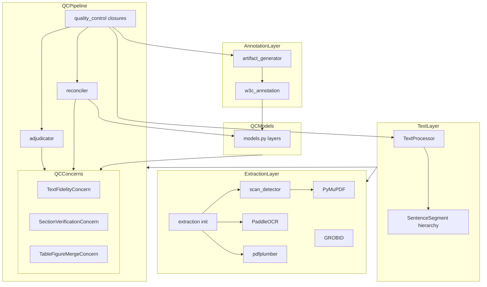
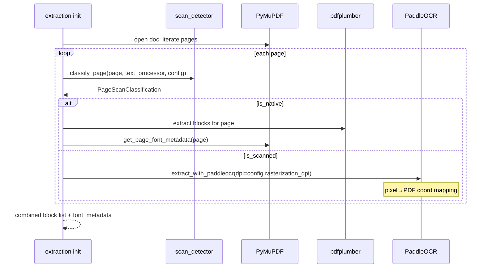
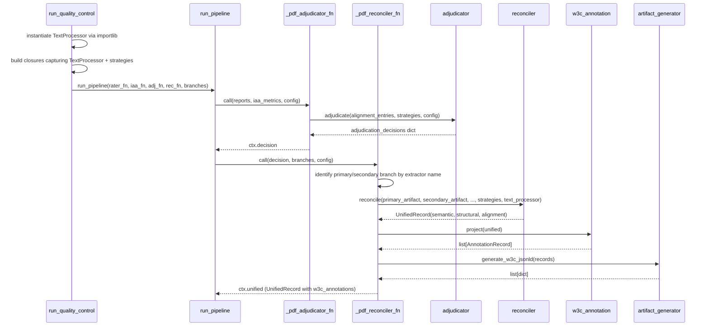

# Technical Design: architecture-migration

## Overview

This design covers the migration of EviTrace from its current flat, waterfall-cascade, symmetric-QC architecture to the three-axis target architecture specified in §2.1–§2.7.

**Axis A — Data model**: `UnifiedRecord` gains typed `SemanticLayer`, `StructuralLayer`, and `AlignmentMap` layers. W3C JSON-LD annotation output is added as a first-class pipeline artifact.

**Axis B — Extraction routing**: The four-tier waterfall cascade is replaced by a per-page `ScanDetector` that routes each page to the correct complementary backend. Standalone Tesseract is removed.

**Axis C — QC pipeline**: The reconciler and adjudicator become fully domain-agnostic via concern-strategy injection. Sentence segmentation is replaced by a pluggable `TextProcessor`/`SentenceSegment` system.

---

## Goals and Non-Goals

**Goals**: Requirements 1–10 in `requirements.md`.

**Non-goals** (explicitly excluded):
- Active adjudication fallback patching (runtime block-source swapping)
- GROBID invocation on scanned/OCR pages (architecture wired, not activated)
- NLP model downloads in CI (all backends mocked in tests)
- Character-level bounding box extraction from pdfplumber
- LLM-based adjudication
- W3C JSON-LD schema round-trip validation
- Additional text-processing backends beyond the specified built-in set

---

## Boundary Commitments

### This spec owns

- `utils/text_processor.py` — all text transformation interfaces and built-in backend implementations
- `pdf_extractor/extraction/scan_detector.py` — per-page scan classification logic
- `quality_control/models.py` additions — `SemanticLayer`, `StructuralLayer`, `AlignmentMapEntry`, `AlignmentMap`
- `quality_control/concerns/` package — `TextFidelityConcern`, `SectionVerificationConcern`, `TableFigureMergeConcern`
- `quality_control/reconciler.py` refactor — concern routing, `AlignmentMap` assembly, `UnifiedRecord` construction
- `quality_control/adjudicator.py` refactor — concern-strategy delegation (decoupled from reconciler)
- `quality_control/quality_control.py` changes — `TextProcessor` wiring, `_split_sentences` removal, concern strategy injection into `_pdf_reconciler_fn`
- `pdf_extractor/extraction/__init__.py` — scan-detector-driven routing replacing waterfall
- `pdf_extractor/extraction/PaddleOCR.py` — DPI parameter and pixel-to-PDF coordinate mapping
- `pdf_extractor/extraction/PyMuPDF.py` — `get_page_font_metadata(page)` single-page function
- `pdf_extractor/processing/sentence_processor.py` — `text_processor` parameter replacing `_RE_SENTENCE_SPLIT`
- `pdf_extractor/annotation/` package — `w3c_annotation.py` data model and `artifact_generator.py` serializer
- `pdf_extractor/extraction/schemas.py` extension — `PaddleOCRBlockDict` TypedDict
- Config extension — `_QC_DEFAULTS` additions and `config/config.yaml` new keys
- Deletion of `pdf_extractor/extraction/Tesseract.py`

### Out of boundary

- `pdf_extractor/pdf_extractor.py` pipeline orchestration beyond updating the `process_sentences` call signature
- `agents/` — LLM extraction layer; no changes required
- `pipeline/` — orchestration layer; no changes required
- `quality_control/models.py` existing dataclasses — backward-compatible only; no fields removed
- `QCContext.metrics_hierarchy` dict shape — unchanged per non-goals
- `pdf_extractor/extraction/GROBID.py` — GROBID extraction logic; no changes (output is consumed as-is)

### Allowed Dependencies

| Consumer | May import from |
|---|---|
| `text_processor.py` | stdlib, optional NLP libs (lazy) |
| `scan_detector.py` | `utils.text_processor`, `fitz` (PyMuPDF), `pdf_extractor.extraction.schemas` |
| `quality_control/concerns/` | `quality_control.models`, `utils.text_processor` |
| `quality_control/reconciler.py` | `quality_control.models`, `quality_control.concerns`, `utils.text_processor` |
| `quality_control/adjudicator.py` | `quality_control.models`, `quality_control.concerns` |
| `quality_control/quality_control.py` | all QC modules, `utils.text_processor`, `pdf_extractor.annotation` |
| `pdf_extractor/annotation/w3c_annotation.py` | `quality_control.models` |
| `pdf_extractor/annotation/artifact_generator.py` | `pdf_extractor.annotation.w3c_annotation` |

`reconciler.py` and `adjudicator.py` must **not** import from each other.

### Revalidation Triggers

Changes to any of the following require re-running `/kiro-validate-impl architecture-migration`:
- `BranchOutput.extractor` string values (extractor name contracts)
- `BlockDict` or `PaddleOCRBlockDict` TypedDict fields
- `QCContext` structure
- `UnifiedRecord` field names or types

---

## Architecture

### Dependency Direction

```
schemas (types)
  └─► text_processor (utils)
        └─► scan_detector
              └─► extraction backends (PaddleOCR, PyMuPDF, pdfplumber, GROBID)
                    └─► extraction/__init__.py

models (QC types)
  └─► concerns (strategies)
        └─► reconciler / adjudicator
              └─► quality_control.py (closures)
                    └─► run_pipeline (domain-agnostic core)

models
  └─► w3c_annotation (projection)
        └─► artifact_generator (serialization)
              └─► quality_control.py (closures)
```

Each layer imports only from layers above it in this chain. `reconciler.py` and `adjudicator.py` are siblings; neither imports the other.

### Component Map



---

## System Flows

### Flow 1: Per-Page Extraction Routing



### Flow 2: QC Pipeline with Concern-Strategy Injection



---

## File Structure Plan

### Files to Delete

| File | Reason |
|---|---|
| `pdf_extractor/extraction/Tesseract.py` | Standalone Tesseract removed; PaddleOCR is the designated OCR backend (Req 4) |

### Files to Create

| File | Responsibility |
|---|---|
| `utils/text_processor.py` | `TextProcessor` class + `SentenceSegment` hierarchy (5 built-in backends). Owns all text transformation interfaces. (Req 5) |
| `pdf_extractor/extraction/scan_detector.py` | `classify_page()` pure function + `PageScanClassification` dataclass. Five-stage per-page detection with provenance. (Req 2) |
| `quality_control/concerns/__init__.py` | Exports `TextFidelityConcern`, `SectionVerificationConcern`, `TableFigureMergeConcern`, `MissingContributionError`, and their defaults |
| `quality_control/concerns/text_fidelity.py` | `TextFidelityConcern` — text fidelity reconciliation and adjudication strategy (Req 7.3) |
| `quality_control/concerns/section_verification.py` | `SectionVerificationConcern` — section heading confidence strategy (Req 7.3) |
| `quality_control/concerns/table_figure_merge.py` | `TableFigureMergeConcern` + `MissingContributionError` — table/figure merge strategy (Req 7.3) |
| `pdf_extractor/annotation/__init__.py` | Package init exporting `project`, `generate_w3c_jsonld`, `AnnotationRecord` |
| `pdf_extractor/annotation/w3c_annotation.py` | `AnnotationRecord` dataclass + `project()` — pure data model projection (Req 8.1) |
| `pdf_extractor/annotation/artifact_generator.py` | `generate_w3c_jsonld()` — sole W3C JSON-LD serializer (Req 8.2) |

### Files to Modify

| File | Change Summary |
|---|---|
| `pdf_extractor/extraction/schemas.py` | Add `PaddleOCRBlockDict(BlockDict, total=False)` + `make_ocr_block()` factory (Req 3.2) |
| `pdf_extractor/extraction/__init__.py` | Replace waterfall + Tesseract import with scan-detector routing (Req 3.1, 3.2, 3.3, 4) |
| `pdf_extractor/extraction/PaddleOCR.py` | Add `dpi` parameter; pixel→PDF coordinate mapping; return `PaddleOCRBlockDict` (Req 3.2) |
| `pdf_extractor/extraction/PyMuPDF.py` | Add `get_page_font_metadata(page) → list[FontMetaDict]` single-page function (Req 3.1) |
| `pdf_extractor/processing/sentence_processor.py` | Add `text_processor` param to `process_sentences()`; remove `_RE_SENTENCE_SPLIT` (Req 5.1) |
| `pdf_extractor/pdf_extractor.py` | Update `process_sentences()` call to pass `text_processor` instance |
| `quality_control/models.py` | Add `SemanticLayer`, `StructuralLayer`, `AlignmentMapEntry`, `AlignmentMap`; extend `UnifiedRecord` (Req 1) |
| `quality_control/reconciler.py` | Replace winner-takes-all with concern routing; assemble `AlignmentMap`; return `UnifiedRecord` with layers (Req 7.1) |
| `quality_control/adjudicator.py` | Remove symmetric logic + reconciler call; add `_adjudicate_concern()` delegating to strategies (Req 7.2) |
| `quality_control/quality_control.py` | Remove `_split_sentences`; inject `TextProcessor`; wire concern strategies into `_pdf_reconciler_fn`; add annotation chain (Req 5.1, 6.1, 6.2, 7.1) |
| `quality_control/__init__.py` | Export `SemanticLayer`, `StructuralLayer`, `AlignmentMap`, `AlignmentMapEntry` |
| `utils/config_utils.py` | Extend `_QC_DEFAULTS` with `text_processor` and new QC sub-keys (Req 9) |
| `config/config.yaml` | Add `text_processor` block and new `quality_control` sub-keys (Req 9) |

---

## Components & Interfaces

### Component Summary

| Component | File | Requirements | Intent |
|---|---|---|---|
| `TextProcessor` | `utils/text_processor.py` | 5.1–5.5 | Config-driven text transformation hub |
| `SentenceSegment` hierarchy | `utils/text_processor.py` | 5.1, 5.5 | Pluggable sentence boundary detection |
| `scan_detector` | `pdf_extractor/extraction/scan_detector.py` | 2.1–2.3 | Stateless five-stage page classifier |
| `PaddleOCRBlockDict` | `pdf_extractor/extraction/schemas.py` | 3.2 | Extended block type with OCR metadata |
| `SemanticLayer` / `StructuralLayer` / `AlignmentMap` | `quality_control/models.py` | 1.1–1.3 | Typed data layers on `UnifiedRecord` |
| `TextFidelityConcern` | `quality_control/concerns/text_fidelity.py` | 7.3 | Asymmetric text comparison strategy |
| `SectionVerificationConcern` | `quality_control/concerns/section_verification.py` | 7.3 | Section heading confidence strategy |
| `TableFigureMergeConcern` | `quality_control/concerns/table_figure_merge.py` | 7.3 | Table/figure merge + absence guard |
| `reconciler` | `quality_control/reconciler.py` | 7.1, 1 | Concern routing + `UnifiedRecord` assembly |
| `adjudicator` | `quality_control/adjudicator.py` | 7.2 | Concern-level adjudication delegation |
| `w3c_annotation` | `pdf_extractor/annotation/w3c_annotation.py` | 8.1 | Pure data model projection |
| `artifact_generator` | `pdf_extractor/annotation/artifact_generator.py` | 8.2 | Sole W3C JSON-LD serializer |

---

### TextProcessor (`utils/text_processor.py`)

**Interface**:

```python
class TextProcessor:
    def __init__(self, config: dict | None = None) -> None: ...
    def normalize(self, text: str) -> str: ...
    def tokenize_sentences(self, text: str) -> list[str]: ...
    def tokenize_words(self, text: str) -> list[str]: ...
    def compare(self, a: str, b: str) -> float: ...        # [0.0, 1.0]
    def clean_ocr(self, text: str) -> str: ...
    def extract_keywords(self, text: str) -> list[str]: ...
```

`__init__` resolves three components from config at construction time:
- `_segmenter: SentenceSegment` — selected by `config["sentence_tokenizer"]["backend"]`
- `_word_tokenizer` — selected by `config["word_tokenizer"]["backend"]`
- `_normalizer` — selected by `config["normalizer"]["backend"]`

If `backend` is unrecognised, raises `ValueError` listing valid options. If a dependency package is missing, `tokenize_sentences` / `tokenize_words` raise `ImportError` with the exact install command on first call (lazy load).

**`SentenceSegment` hierarchy**:

```python
class SentenceSegment(TextProcessor):
    """Abstract base. Inherits TextProcessor interface; overrides tokenize_sentences."""
    def tokenize_sentences(self, text: str) -> list[str]: raise NotImplementedError

class ScispaCySentenceSegment(SentenceSegment): ...   # default; lazy-loads en_core_sci_lg
class WtpSplitSentenceSegment(SentenceSegment): ...
class NLTKPunktSentenceSegment(SentenceSegment): ...
class SpacySentencizerSegment(SentenceSegment): ...
class StanzaSentenceSegment(SentenceSegment): ...
```

`SentenceSegment` extends `TextProcessor` so that any concrete segment implementation can be used as `text_processor.class` — the loader in `run_quality_control` creates one instance via `importlib` and passes it wherever a `TextProcessor` is needed.

**Loader pattern** (in `quality_control.py`):

```python
def _load_text_processor(config: dict) -> TextProcessor:
    class_path = config.get("text_processor", {}).get(
        "class", "utils.text_processor.TextProcessor"
    )
    module_path, class_name = class_path.rsplit(".", 1)
    cls = getattr(importlib.import_module(module_path), class_name)
    return cls(config=config.get("text_processor", {}))
```

One instance per pipeline run; passed into all closures that need it.

---

### `scan_detector` (`pdf_extractor/extraction/scan_detector.py`)

**Interface**:

```python
@dataclass
class PageScanClassification:
    page_index: int
    is_native: bool
    triggered_stages: list[int]
    stage_values: dict[str, float]  # {"word_count": 12, "alpha_ratio": 0.42, ...}

def classify_page(
    page,                         # fitz.Page
    text_processor: TextProcessor,
    config: dict,
) -> PageScanClassification: ...
```

Stage evaluation order: 1 → 2 → 3 → 4 → 5. Stage 1 is a fast exit; if it fires, `triggered_stages = [1]` and stages 2–5 are skipped. `is_native = True` only when `triggered_stages` is empty. `stage_values` records the computed signal for every stage that was evaluated (not just triggered ones), to aid debugging.

`text_processor.clean_ocr()` is applied to raw page text before alpha-ratio computation in stage 3.

**No global state**. The function is stateless and has no side effects. Config keys consumed: `scan_detection.text_density_threshold`, `scan_detection.alpha_ratio_threshold`, `scan_detection.image_dominance_threshold`.

---

### `PaddleOCRBlockDict` (`pdf_extractor/extraction/schemas.py`)

**Extension**:

```python
class PaddleOCRBlockDict(BlockDict, total=False):
    rasterization_dpi: int
    ocr_confidence: float

def make_ocr_block(
    text: str,
    page_index: int,
    block_bbox: tuple,          # required for OCR blocks (not None)
    rasterization_dpi: int,
    ocr_confidence: float,
) -> PaddleOCRBlockDict: ...
```

`PaddleOCRBlockDict` inherits all required `BlockDict` fields; adds two optional fields. `validate_blocks()` is unchanged — it verifies the four required fields and ignores extras. All existing callers of `make_block()` use named arguments; adding `make_ocr_block()` as a new factory is non-breaking.

**Coordinate mapping formula** (in `PaddleOCR.py`):

```python
corners = line_info[0]   # [[x0,y0],[x1,y1],[x2,y2],[x3,y3]] pixel space
xs = [c[0] for c in corners]; ys = [c[1] for c in corners]
block_bbox = (min(xs) * (72.0/dpi), min(ys) * (72.0/dpi),
              max(xs) * (72.0/dpi), max(ys) * (72.0/dpi))
```

---

### Data Models (`quality_control/models.py`)

**New dataclasses** (added before `UnifiedRecord`):

```python
@dataclass
class SemanticLayer:
    metadata: dict = field(default_factory=dict)
    sections: list = field(default_factory=list)
    paragraphs: list = field(default_factory=list)
    sentences: list = field(default_factory=list)
    references: list = field(default_factory=list)

@dataclass
class StructuralLayer:
    pages: list = field(default_factory=list)
    blocks: list = field(default_factory=list)
    tables: list = field(default_factory=list)
    figures: list = field(default_factory=list)

@dataclass
class AlignmentMapEntry:
    source: str = "native"          # free string; not constrained to an extractor set
    ocr_derived: bool = False
    ocr_engines: list = field(default_factory=list)
    agreement: str = "full"         # "full" | "partial" | "divergent" | "one_engine_only"
    edit_distance: float = 0.0      # normalized Levenshtein [0.0, 1.0]
    preferred_reading: str = ""     # set by injected concern strategy
    confidence: float = 1.0         # [0.0, 1.0]

@dataclass
class AlignmentMap:
    paragraph_to_blocks: list = field(default_factory=list)
    sentence_to_char_range: list = field(default_factory=list)
    section_header_to_block: list = field(default_factory=list)
    reconciliation_flags: list = field(default_factory=list)  # list[AlignmentMapEntry]
```

**`UnifiedRecord` extension** (existing fields retained):

```python
@dataclass
class UnifiedRecord:
    document_id: str = ""
    content: dict = field(default_factory=dict)         # backward compat
    semantic: SemanticLayer | None = None               # NEW
    structural: StructuralLayer | None = None           # NEW
    alignment: AlignmentMap | None = None               # NEW
```

**`sentence_to_char_range` population**: The reconciler computes character offsets by searching each sentence text in `full_pdf_text` (the concatenated document string available in the GROBID/pdfplumber branch payload via `build_full_text()`). Each entry is `{"sentence": str, "start": int, "end": int, "page_index": int}`. If a sentence is not found by exact match after normalization, it is omitted from `sentence_to_char_range` and the absence is recorded in `reconciliation_flags` with `agreement = "one_engine_only"`.

---

### Concern Strategy Package (`quality_control/concerns/`)

All three strategy classes follow the same pattern: constructor injection of label strings (so the strategy encodes which argument is authoritative), plus `reconcile`/`merge` and `adjudicate` methods.

**`TextFidelityConcern`**:

```python
class TextFidelityConcern:
    def __init__(self, source_label: str = "reference") -> None: ...

    def reconcile(
        self,
        primary_artifact: str,
        reference_artifact: str,
        text_processor: TextProcessor,
    ) -> AlignmentMapEntry:
        # edit_distance = 1.0 - text_processor.compare(primary, reference)
        # preferred_reading = reference_artifact (strategy encodes ground-truth side)
        # source = self.source_label
        ...

    def adjudicate(
        self,
        alignment_entries: list[AlignmentMapEntry],
        config: dict,
    ) -> dict:  # {"preferred_source": str, "confidence": float, "rationale": str}
        ...

DEFAULT_TEXT_FIDELITY = TextFidelityConcern(source_label="pdfplumber")
```

**`SectionVerificationConcern`**:

```python
class SectionVerificationConcern:
    def reconcile(
        self,
        primary_section: dict,    # keys: heading, label, depth (extractor-agnostic)
        reference_block: dict,    # keys: bbox, font_size, bold, text
        text_processor: TextProcessor,
    ) -> float:                   # confidence [0.0, 1.0]; never modifies primary_section
        ...

    def adjudicate(self, alignment_entries: list, config: dict) -> dict: ...

DEFAULT_SECTION_VERIFICATION = SectionVerificationConcern()
```

**`TableFigureMergeConcern`**:

```python
class MissingContributionError(ValueError):
    pass

class TableFigureMergeConcern:
    def __init__(self, primary_label: str = "primary", reference_label: str = "reference") -> None: ...

    def merge(
        self,
        primary_caption_ref: dict | None,
        reference_table_spatial: dict | None,
    ) -> dict:
        # Raises MissingContributionError if either argument is None
        # Returns {"primary": ..., "reference": ..., "agreement": ..., "merged_text": ...}
        ...

    def adjudicate(self, alignment_entries: list, config: dict) -> dict: ...

DEFAULT_TABLE_FIGURE_MERGE = TableFigureMergeConcern(
    primary_label="grobid", reference_label="pdfplumber"
)
```

**Design decision**: The `primary_label` / `reference_label` strings on `TableFigureMergeConcern` and `source_label` on `TextFidelityConcern` are constructor-injected; they encode which argument role corresponds to which extractor. The reconciler and adjudicator see only the strategy object — they never access these labels.

---

### Reconciler (`quality_control/reconciler.py`)

**Refactored public interface**:

```python
def reconcile(
    primary_artifact: dict,           # extractor-agnostic; role determined by caller
    secondary_artifact: dict,
    primary_observation: dict,
    secondary_observation: dict,
    investigator_object: dict,
    adjudication_decisions: dict | None = None,
    config: dict | None = None,
    *,
    text_fidelity_strategy: TextFidelityConcern | None = None,
    section_strategy: SectionVerificationConcern | None = None,
    table_figure_strategy: TableFigureMergeConcern | None = None,
    text_processor: TextProcessor | None = None,
) -> UnifiedRecord: ...
```

**Concern routing logic**:
1. Text fidelity: for each primary paragraph matched to a secondary block by `page_index` + bbox overlap, call `text_fidelity_strategy.reconcile(primary_text, secondary_text, tp)` → collect `AlignmentMapEntry` objects.
2. Section verification: for each primary section heading with a font-size candidate in secondary, call `section_strategy.reconcile(primary_section, secondary_block, tp)` → record confidence.
3. Table/figure merge: for each primary caption reference with a secondary spatial record, call `table_figure_strategy.merge(primary_ref, secondary_spatial)` → populate `StructuralLayer.tables/figures`.
4. Assemble `AlignmentMap` from collected entries.
5. Build `SemanticLayer` from primary artifact metadata fields (title, sections, paragraphs, references).
6. Build `StructuralLayer` from secondary artifact blocks.
7. Compute `sentence_to_char_range` via string search in `full_pdf_text`.
8. Return `UnifiedRecord(document_id, content, semantic, structural, alignment)`.

Strategy defaults fall back to `DEFAULT_TEXT_FIDELITY`, `DEFAULT_SECTION_VERIFICATION`, `DEFAULT_TABLE_FIGURE_MERGE` if not provided. `text_processor` defaults to `TextProcessor()` if not provided.

**Invariant**: No string literal referencing a specific extractor name appears in this module's control flow or output construction.

---

### Adjudicator (`quality_control/adjudicator.py`)

**Refactored design**:

- **Removed**: `_compute_text_quality_score`, `_evaluate_extractor_quality`, winner-takes-all `_make_adjudication_decisions`, `import reconciler`.
- **Added**: `_adjudicate_concern(alignment_entries, strategy, config) → dict`.

**Public interface** (signature unchanged from callers' perspective):

```python
def adjudicate(
    reports: list,
    iaa_metrics,
    config: dict,
    *,
    text_fidelity_strategy=None,
    section_strategy=None,
    table_figure_strategy=None,
) -> dict:
    # 1. Extract alignment entries by concern type from reports/iaa_metrics
    # 2. For each concern, call _adjudicate_concern(entries, strategy, config)
    # 3. Assemble and return decisions dict
    # Does NOT call reconciler.reconcile()
    ...
```

**Decoupling decision (R2)**: `adjudicator.py` no longer imports or calls `reconciler`. The `run_pipeline()` call chain already calls `adjudicator_fn` then `reconciler_fn` sequentially via `ctx.decision` and `ctx.unified`. Removing line 218 from `adjudicator.py` is the only structural change needed; the `QCContext` shape is unaffected.

**Invariant**: No string literal `"grobid"` or `"pdfplumber"` appears in control flow or output-shaping logic.

---

### QC Pipeline Wiring (`quality_control/quality_control.py`)

**`_split_sentences` removal**: Delete the function (lines 138–144). All four call sites replaced with `text_processor.tokenize_sentences(text)`. The `text_processor` instance is passed into `_build_tier1_report` and into each closure via closure capture.

**`TextProcessor` instantiation**:

```python
# At top of run_quality_control, before closure definitions:
text_processor = _load_text_processor(config)
```

**Branch role identification in `_pdf_reconciler_fn`** (R5 resolution):

```python
def _pdf_reconciler_fn(decision, all_branches, cfg):
    primary = next(
        (b for b in all_branches if b.extractor == "grobid"), None
    )
    secondary = next(
        (b for b in all_branches if b.extractor in ("pymupdf", "pdfplumber")), None
    )
    # Pass role-agnostic names to reconciler:
    updated_unified = reconciler.reconcile(
        primary_artifact=primary.payload if primary else {},
        secondary_artifact=secondary.payload if secondary else {},
        ...
        text_fidelity_strategy=DEFAULT_TEXT_FIDELITY,
        section_strategy=DEFAULT_SECTION_VERIFICATION,
        table_figure_strategy=DEFAULT_TABLE_FIGURE_MERGE,
        text_processor=text_processor,
    )
    annotation_records = w3c_annotation.project(updated_unified)
    updated_unified.w3c_annotations = artifact_generator.generate_w3c_jsonld(annotation_records)
    return updated_unified
```

The extractor name lookup (`"grobid"`, `"pymupdf"`) is **in the closure** — not in the reconciler. The reconciler receives `primary_artifact` and `secondary_artifact` with no extractor identity.

**Invariant 3**: `run_pipeline()` body contains no import or reference to any PDF-specific library, extractor name, or document-structure type. All PDF logic is inside the closures defined by `run_quality_control`.

---

### W3C Annotation Layer (`pdf_extractor/annotation/`)

**`w3c_annotation.py`**:

```python
@dataclass
class AnnotationRecord:
    id: str
    body_value: str
    body_format: str
    body_language: str
    ocr_derived: bool
    ocr_engines: list[str]
    source: str
    selector_type: str          # "TextPositionSelector" | "FragmentSelector"
    selector_payload: dict      # varies by selector_type
    quote_selector: dict        # {"exact": str, "prefix": str, "suffix": str}

def project(unified: UnifiedRecord, base_uri: str = "") -> list[AnnotationRecord]:
    """Pure data projection. No JSON, no dict construction."""
    ...
```

Born-digital entries (where `AlignmentMapEntry.ocr_derived == False`) use `TextPositionSelector` with `{"start": int, "end": int}` from `AlignmentMap.sentence_to_char_range`.

Scanned entries (`ocr_derived == True`) use `FragmentSelector` with `{"page": int, "xywh": str}` derived from `StructuralLayer.blocks` PaddleOCR bboxes.

**`artifact_generator.py`**:

```python
def generate_w3c_jsonld(
    records: list[AnnotationRecord],
    base_uri: str = "",
) -> list[dict]:
    """Sole producer of W3C JSON-LD dicts. Uses uuid4 for each annotation id."""
    ...
```

This is the **only** function permitted to construct W3C JSON-LD dicts. No other module may produce these structures.

---

### Configuration Extensions

**`utils/config_utils.py` — additions to `_QC_DEFAULTS`**:

```python
"text_processor": {
    "class": "utils.text_processor.TextProcessor",
    "sentence_tokenizer": {"backend": "scispacy", "model": "en_core_sci_lg"},
    "word_tokenizer": {"backend": "spacy"},
    "normalizer": {"backend": "spacy"},
    "comparison": {"metric": "levenshtein", "threshold": 0.85},
    "ocr_cleaning": {"weird_char_threshold": 0.05},
},
# inside "quality_control":
"scan_detection": {
    "text_density_threshold": 50,
    "alpha_ratio_threshold": 0.60,
    "image_dominance_threshold": 0.85,
},
"ocr": {"rasterization_dpi": 150},
"text_fidelity": {"edit_distance_threshold": 0.10},
"section_verification": {"font_size_tolerance": 1.0},
```

The existing `_deep_merge()` function applies these defaults when keys are absent from the user's config file — no behavior change for existing configs.

---

## Testing Strategy

All test items derive directly from requirements acceptance criteria. No NLP model downloads in any test.

### New Test Files

| Test File | Requirement Coverage | Key Behaviors Verified |
|---|---|---|
| `tests/pdf_extractor/test_text_processor.py` | 5.1–5.5 | `normalize` idempotency; `tokenize_sentences` with each backend; `ImportError` with install hint; `ValueError` for unknown backend; model loaded once per instance; `compare` range; `clean_ocr` removes U+FFFD; `extract_keywords` filters stopwords |
| `tests/pdf_extractor/test_sentence_segment.py` | 5.1, 5.5 | `SentenceSegment` is subclass of `TextProcessor`; all 5 built-ins satisfy interface; custom class path via `_load_text_processor` |
| `tests/pdf_extractor/test_scan_detector.py` | 2.1–2.3 | Each stage independently triggered (mocked `fitz.Page`); stage 1 fast exit; native only when no stage fires; `stage_values` populated; mixed native/scanned document |
| `tests/pdf_extractor/test_unified_record_layers.py` | 1.1–1.4 | All four new dataclasses construct with defaults; `UnifiedRecord.content` accessible alongside new fields; `AlignmentMapEntry.source` is a free string |
| `tests/pdf_extractor/test_concern_text_fidelity.py` | 7.3 | Identical inputs → `agreement="full"`; divergent → `"divergent"`; argument-order asymmetry; `DEFAULT_TEXT_FIDELITY.source_label == "pdfplumber"` |
| `tests/pdf_extractor/test_concern_section_verification.py` | 7.3 | High confidence on match; reduced on low font size; `primary_section` unmodified after call; return type is `float` |
| `tests/pdf_extractor/test_concern_table_figure_merge.py` | 7.3 | Merged record contains both sub-fields; `None` primary → `MissingContributionError`; `None` reference → `MissingContributionError`; primary record unmodified |
| `tests/pdf_extractor/test_reconciler_concern_routing.py` | 7.1 | Each strategy called for its concern type; custom strategies respected; returned `UnifiedRecord` has non-None layers; `inspect.getsource(reconciler)` contains no `"grobid"` or `"pdfplumber"` literal |
| `tests/pdf_extractor/test_adjudicator_strategy_delegation.py` | 7.2 | `strategy.adjudicate()` called per concern; `preferred_source` set by strategy; custom strategy returning `"custom_extractor"` respected; `inspect.getsource(adjudicator)` contains no hardcoded extractor names |
| `tests/pdf_extractor/test_w3c_annotation.py` | 8.1 | `project()` returns `list[AnnotationRecord]`; born-digital → `TextPositionSelector`; scanned → `FragmentSelector` + `ocr_derived=True`; `quote_selector` present on both; no `json.dumps` in projection |
| `tests/pdf_extractor/test_artifact_generator.py` | 8.2 | Empty input → `[]`; born-digital record → dict with `TextPositionSelector`; scanned → dict with `FragmentSelector`; all five required JSON-LD keys present; `id` is valid URN |
| `tests/pdf_extractor/test_run_pipeline_domain_agnostic.py` | 6.1 | `run_pipeline` callable with mock callables; `inspect.getsource(run_pipeline)` contains no PDF-specific symbols; non-PDF payload does not raise |

### Updates to Existing Tests

| Test File | Required Change |
|---|---|
| `test_quality_control_pipeline.py` | Mock `TextProcessor.tokenize_sentences` → `["sentence one", "sentence two"]`; verify `sentence_records` in `LocalQCReport` |
| `test_quality_control_reconciler.py` | Pass mock concern strategies; verify `AlignmentMap` populated; verify no hardcoded extractor names |
| `test_quality_control_adjudicator.py` | Pass mock strategies with `adjudicate()` methods; verify `preferred_source` comes from strategy |
| `test_text_extractor_tier2.py` | Remove all imports/mocks of `extract_with_tesseract`; verify absence of Tesseract references |
| `test_text_extractor_tier1.py`, `test_text_extractor_tier3.py` | Verify no `extract_with_tesseract` import or reference |
| Any test importing `process_sentences` | Add mock `TextProcessor` as third argument |

---

## Requirements Traceability

| Requirement | Summary | Components | Notes |
|---|---|---|---|
| 1.1 | SemanticLayer produced | `models.py:SemanticLayer`, `reconciler` | Populated in reconciler from primary artifact |
| 1.2 | StructuralLayer produced | `models.py:StructuralLayer`, `reconciler` | Populated from secondary artifact blocks |
| 1.3 | AlignmentMap with provenance | `models.py:AlignmentMap/Entry`, `reconciler`, concerns | `source` is free string; computed in reconciler |
| 1.4 | `content` backward compat | `models.py:UnifiedRecord` | Existing field retained |
| 2.1 | Five-stage classification | `scan_detector.classify_page` | Dataclass captures stage list |
| 2.2 | Stage triggers | `scan_detector.classify_page` | Config-driven thresholds |
| 2.3 | Classification provenance | `PageScanClassification.stage_values` | All evaluated signals recorded |
| 3.1 | Native page routing | `extraction/__init__.py`, `PyMuPDF.get_page_font_metadata` | Both backends run; neither replaces the other |
| 3.2 | Scanned page routing | `PaddleOCR.py`, `PaddleOCRBlockDict` | DPI param + coord mapping + metadata fields |
| 3.3 | GROBID and OCR bypass | `extraction/__init__.py` | GROBID not in per-page routing; `ocr=False` skips detection |
| 4 | Tesseract removal | Delete `Tesseract.py`; remove import; update tier2 test | Three acceptance criteria verified by grep |
| 5.1 | Pluggable sentence segmentation | `TextProcessor`, `SentenceSegment` hierarchy, `sentence_processor.py` | `_load_text_processor` via importlib; model loaded once |
| 5.2 | Word seg + normalization | `TextProcessor.tokenize_words`, `normalize` | Idempotency + NFKC mode |
| 5.3 | Text comparison | `TextProcessor.compare` | `difflib.SequenceMatcher`; normalize before compare |
| 5.4 | OCR cleaning | `TextProcessor.clean_ocr` | U+FFFD and C0 control characters removed |
| 5.5 | Custom backend support | `_load_text_processor` importlib loader | Fully qualified class path accepted |
| 6.1 | Pipeline runner isolation | `quality_control.py:run_pipeline` | `inspect.getsource` test verifies no PDF symbols |
| 6.2 | QC closure encapsulation | `quality_control.py:run_quality_control` | Single `TextProcessor` instance; all PDF logic in closures |
| 7.1 | Reconciler agnosticism | `reconciler.reconcile`, concern strategies | No extractor names in module; strategy objects are opaque |
| 7.2 | Adjudicator agnosticism | `adjudicator.adjudicate`, `_adjudicate_concern` | No reconciler call; `preferred_source` from strategy only |
| 7.3 | Concern strategy behavior | `TextFidelityConcern`, `SectionVerificationConcern`, `TableFigureMergeConcern` | Asymmetry test; `MissingContributionError`; full agreement at 0.0 distance |
| 8.1 | Annotation data model | `w3c_annotation.project` | Pure projection; `TextPositionSelector` / `FragmentSelector` per page type |
| 8.2 | JSON-LD serialization | `artifact_generator.generate_w3c_jsonld` | Sole serializer; URN IDs; five required JSON-LD keys |
| 9 | Configuration | `config_utils._QC_DEFAULTS`, `config.yaml` | All new keys have defaults; `_deep_merge` handles absence |
| 10 | Test coverage | All new test files (12) + updated existing (6) | No NLP downloads; source-code invariants verified by `inspect` |
