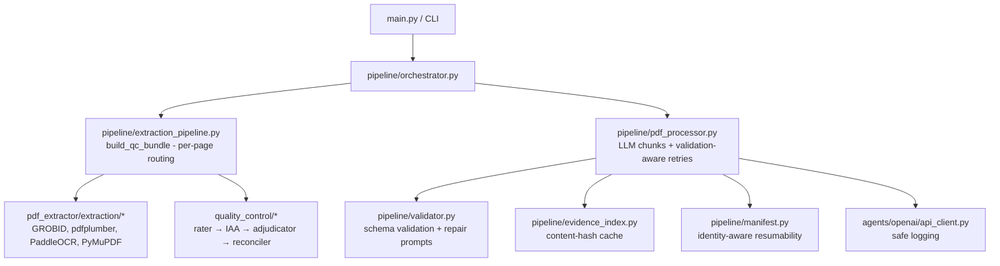

# Design Document: Audit Remediation

## Overview

This design addresses 14 gaps identified in the EviTrace Initial Audit. The changes span the extraction pipeline (`src/pipeline/`), PDF extraction backends (`src/pdf_extractor/`), quality control (`src/quality_control/`), artifact generation, and supporting utilities. The design is organized into three milestones matching the requirements prioritization:

- **P0 (Correctness Blockers)**: Schema validation, DPI wiring, per-page routing, quality-based reconciliation, validation-aware retries, content-hash caching
- **P1 (Evidence Quality)**: Publication-year resolver, normalized annotation schema, PyMuPDF text spacing
- **P2 (Runtime Reliability)**: Safe logging, deterministic dependencies, atomic writes, manifest identity, CI extraction modes

All changes respect the existing dependency direction rules, config loading patterns, and the single-source-of-truth principle for `build_qc_bundle()`.

---

## Architecture

The remediation touches five architectural layers:



### Key Design Decisions

1. **Single validator class for Final_Schema** — A new `FinalOutputValidator` in `src/pipeline/validator.py` loads `configs/final_output_schema.json` once and validates before every disk write. This mirrors the existing `StructureSchemaValidator` pattern.

2. **Per-page routing in `build_qc_bundle()`** — The current document-level routing (all-native vs all-scanned) is replaced with page-level routing that merges results in original page order. This is the most invasive change but stays within `extraction_pipeline.py`.

3. **Content-hash cache keys** — The existing stat-based `_pdf_hash()` in `evidence_index.py` is replaced with SHA-256 of file bytes, matching the GROBID TEI cache pattern already in use.

4. **Validation-aware retries** — A new `RepairRetryLoop` class wraps the existing `extract_chunk` call, intercepting `ValidationError` and constructing targeted repair prompts.

5. **Atomic writes via temp+rename** — `_save_pdf_output()` and `save_manifest()` both adopt the `write-to-tmp → os.replace()` pattern. No new dependencies required.

6. **Manifest identity hashing** — Each manifest entry gains identity fields (`pdf_content_hash`, `config_hash`, `extraction_map_hash`, `model_id`, `schema_version`). Stale entries are detected on load.

---

## Components and Interfaces

### Component 1: Final Output Schema Validator (Req 1)

**Location**: `src/pipeline/validator.py` (extend existing module)

```python
class FinalOutputValidator:
    """Validates merged field lists against configs/final_output_schema.json."""
    
    def __init__(self, schema_path: str = "configs/final_output_schema.json"):
        ...
    
    def validate(self, fields: list[dict]) -> ValidationResult:
        """Return ValidationResult with field-level error details."""
        ...
    
    def format_error(self, error: jsonschema.ValidationError) -> str:
        """Format error with field_index, field_name, and JSON path."""
        ...
```

**Schema file**: `configs/final_output_schema.json` — JSON Schema (Draft 7) defining the array of field records with required keys: `field_index`, `domain_group`, `field_name`, `extracted_value`, `evidence`, `location`, `location_metadata`, `confidence`.

**Integration point**: Called inside `_save_pdf_output()` before writing. On failure, sets manifest status to `"failed_schema_validation"` and returns without writing.

---

### Component 2: DPI Configuration Propagation (Req 2)

**Location**: `src/pipeline/extraction_pipeline.py` (modify `build_qc_bundle`)

The `rasterization_dpi` value from `qc_config["quality_control"]["ocr"]["rasterization_dpi"]` is read and passed explicitly to `extract_with_paddleocr(pdf_path, dpi=dpi_value)`.

`extract_with_paddleocr` already accepts a `dpi` parameter (default 150). The change is in the caller — `build_qc_bundle` must propagate the configured value instead of relying on the function default.

**Deprecation**: If a legacy top-level `ocr_dpi` key exists, `load_qc_config()` emits `warnings.warn(..., DeprecationWarning)` and prefers `quality_control.ocr.rasterization_dpi`.

---

### Component 3: Per-Page Extraction Routing (Req 3)

**Location**: `src/pipeline/extraction_pipeline.py` (refactor `build_qc_bundle`)

```python
@dataclass
class PageRoutingResult:
    """Routing decision for a single page."""
    page_index: int
    selected_extractor: str          # "grobid+pdfplumber" | "paddleocr+pymupdf"
    fallback_extractor: str | None
    routing_reason: str              # e.g. "all_native", "stage_1_empty_text"
    classification: PageScanClassification
```

**Algorithm**:
1. Run `scan_detector.classify_page()` for every page (already done).
2. Partition pages into native and scanned sets.
3. For native pages: extract via GROBID (full document) + pdfplumber, filter results to native page indices.
4. For scanned pages: extract via PaddleOCR + PyMuPDF, filter to scanned page indices.
5. Merge page-level results in original page order.
6. Attach `PageRoutingResult` list to `QCBundle` via `ctx.unified.content["page_routing"]`.

**Constraint**: GROBID processes the full document (it cannot process individual pages). For mixed PDFs, GROBID output is filtered to native pages only. PaddleOCR already processes page-by-page.

---

### Component 4: Quality-Based Branch Reconciliation (Req 4)

**Location**: `src/quality_control/adjudicator.py` (extend existing)

```python
@dataclass
class BranchQualityScore:
    """Composite quality score for primary-branch selection."""
    has_content: bool
    page_coverage: float        # fraction of pages with non-empty text
    section_structure: bool     # at least one section heading detected
    text_length_plausible: bool # within expected range for document type
    weird_char_ratio: float     # OCR noise indicator
    agreement_score: float      # agreement with other branches
    
    @property
    def composite(self) -> float:
        """Weighted composite score for ranking."""
        ...
```

**Selection logic**: Branches are scored, sorted by composite score descending. Failed/empty branches score 0. When `discard_failed_branches=true`, they're excluded entirely. The rationale for selecting a non-GROBID branch is recorded in `AdjudicationDecision.rationale`.

---

### Component 5: Validation-Aware LLM Retries (Req 5)

**Location**: `src/pipeline/pdf_processor.py` (new `RepairRetryLoop` class)

```python
class RepairRetryLoop:
    """Wraps extract_chunk with validation-aware repair retries."""
    
    def __init__(self, max_repair_attempts: int = 2):
        ...
    
    async def extract_with_repair(
        self,
        chunk_num: int,
        source: str,
        fields: list[dict],
        semaphore: asyncio.Semaphore,
        *,
        valid_location_ids: set[str],
        expected_indices: list[int],
        pdf_name: str,
    ) -> list[dict]:
        """Try extraction, then repair on parse/validation failure."""
        ...
    
    def _build_repair_prompt(
        self, error: ValidationError | json.JSONDecodeError, 
        expected_indices: list[int]
    ) -> str:
        """Construct targeted repair prompt with error details."""
        ...
```

**Repair prompt structure**:
- For JSON parse errors: includes the error message + required Compact_Schema format
- For schema validation errors: lists specific failures (missing keys, invalid confidence, out-of-range indexes)
- For out-of-range field indexes: specifies the valid range `[min, max]`

**Exhaustion**: After `max_repair_attempts` failures, records structured error metadata: `{"status": "failed_validation", "chunk": n, "last_error": str, "error_type": "parse"|"schema", "attempts": int}`.

---

### Component 6: Safe Logging (Req 6)

**Location**: `src/utils/logging_utils.py` (new helper) + `src/pipeline/pdf_processor.py`

```python
def log_model_response(
    logger: logging.Logger,
    response: str,
    *,
    pdf_name: str,
    chunk_num: int,
    max_chars: int = 500,
    debug_artifact_dir: str | None = None,
) -> None:
    """Log truncated response at WARNING; optionally write full response to debug artifact."""
    ...
```

**Config key**: `max_log_response_chars` (default 500) added to the `retry` section.

**Behavior**:
- Always: log truncated preview + SHA-256 hash at WARNING
- If `debug_artifact_dir` configured AND `log_level=DEBUG`: write full response to `{pdf_name}_chunk{n}_{hash[:12]}.raw.txt`
- If no artifact dir: never write full responses regardless of level

---

### Component 7: Content-Hash Evidence Caching (Req 7)

**Location**: `src/pipeline/evidence_index.py` (modify `_pdf_hash` and cache key logic)

**Change**: Replace the stat-based `_pdf_hash()` with SHA-256 of file bytes (matching `_pdf_sha256()` already in `extraction_pipeline.py`). The cache key becomes:

```python
cache_key = f"{paper_id}_{pdf_sha256}_{extraction_map_hash}"
```

Where `extraction_map_hash` is the SHA-256 of `configs/extraction_map.json` contents, computed once at module load.

**Two-level optimization** (optional): Retain stat-based check as a fast-path filter. If stat matches, verify SHA-256 before returning cached data. If stat misses, skip SHA-256 computation (guaranteed miss).

---

### Component 8: Publication-Year Resolver (Req 8)

**Location**: `src/pipeline/evidence_index.py` (new function, extend `_build_items_from_tei`)

```python
@dataclass
class YearResolution:
    """Result of multi-source year resolution."""
    year: str                    # "2015" or "nr"
    confidence: str              # "h" | "m" | "nr"
    provenance: str              # "tei_header" | "pdf_metadata" | "first_page_text" | "filename_pattern"

def resolve_publication_year(
    tei_root: ET.Element | None,
    pdf_path: Path,
    pdf_name: str,
) -> YearResolution:
    """Resolve publication year from multiple sources in priority order."""
    ...
```

**Priority chain**:
1. TEI metadata `<date when="...">` → confidence `h`, provenance `"tei_header"`
2. PDF document metadata (`/CreationDate`, `/ModDate`) → confidence `h`, provenance `"pdf_metadata"`
3. First-page bibliographic text (regex `(19|20)\d{2}` near author names) → confidence `m`, provenance `"first_page_text"`
4. Filename pattern (e.g., `Shahn_2015.pdf`) → confidence `m`, provenance `"filename_pattern"`
5. None found → `YearResolution(year="nr", confidence="nr", provenance="")`

Corroboration: If filename year matches another source, confidence upgrades to `h`.

---

### Component 9: Normalized Annotation Schema (Req 9)

**Location**: `src/pipeline/evidence_index.py` (modify `_enrich_with_addons` and heuristic functions)

```python
@dataclass
class NormalizedAnnotation:
    """Uniform annotation record for both heuristic and service-derived annotations."""
    text: str
    type: str                    # "quantity" | "dataset" | "entity"
    source: str                  # "heuristic_regex" | "grobid_quantities" | "datastet" | "entity_fishing"
    confidence: float | None     # 0.0–1.0 or None
    metadata: dict               # extra service-specific fields
```

**Migration**: Current heuristic annotations are plain strings in lists (e.g., `annotations["quantities"] = ["5mg", "10ml"]`). These become `NormalizedAnnotation` dicts. Service-derived annotations already return dicts but with varying shapes — they're normalized to the same schema with extra fields under `metadata`.

**W3C annotations**: Unchanged. The normalized schema applies only to internal pipeline annotations in `evidence_items[*].annotations`, not to `w3c_annotation.py` output.

---

### Component 10: Deterministic Dependency Management (Req 10)

**Location**: `src/text_processing/base.py` (modify `ScispaCySentenceSegment._load_model`)

**Change**: Remove the `subprocess.run([sys.executable, "-m", "pip", "install", url])` call in `_load_model()`. Replace with:

```python
raise ImportError(
    f"scispaCy model {self._model_name!r} is not installed. Install it with:\n"
    f"  pip install {url or self._model_name}\n"
    "Models must be installed before running the pipeline."
)
```

**pyproject.toml**: Add optional dependency groups:

```toml
[project.optional-dependencies]
ocr = ["paddleocr>=2.7.0", "paddlepaddle>=2.5.0", "pdf2image>=1.16.0"]
nlp = ["scispacy==0.5.5", "en-core-sci-sm @ https://..."]
semantic = ["sentence-transformers>=2.2.0", "faiss-cpu>=1.7.0"]
```

**CI guard**: A test in `tests/` AST-scans all `.py` files under `src/` for `subprocess.run` or `subprocess.call` with `pip` or `install` in arguments.

---

### Component 11: Atomic Output Writes (Req 11)

**Location**: `src/pipeline/pdf_processor.py` (`_save_pdf_output`) + `src/pipeline/manifest.py` (`save_manifest`)

```python
def _atomic_write_json(path: Path, data: Any, indent: int = 2) -> None:
    """Write JSON atomically via temp file + os.replace."""
    tmp_path = path.with_suffix(path.suffix + ".tmp")
    try:
        with open(tmp_path, "w", encoding="utf-8") as f:
            json.dump(data, f, indent=indent, ensure_ascii=False)
        os.replace(str(tmp_path), str(path))
    except BaseException:
        # Clean up temp file on any failure
        tmp_path.unlink(missing_ok=True)
        raise
```

**Resume validation**: `_load_completed_result()` wraps `json.load()` in a try/except. If parsing fails, treats the file as absent and returns `None` (triggering re-processing).

---

### Component 12: Manifest Identity and Resumability (Req 12)

**Location**: `src/pipeline/manifest.py` (extend) + `src/pipeline/pdf_processor.py`

```python
@dataclass
class ManifestIdentity:
    """Identity fields for cache invalidation."""
    pdf_content_hash: str        # SHA-256 of PDF bytes
    config_hash: str             # SHA-256 of serialized relevant config
    extraction_map_hash: str     # SHA-256 of configs/extraction_map.json
    model_id: str                # chunk_model name
    schema_version: str          # e.g. "1.0.0"
    output_path: str             # relative path to output file

def compute_identity(pdf_path: Path, config: dict) -> ManifestIdentity:
    """Compute identity fields for a PDF + config combination."""
    ...

def is_stale(entry: dict, current_identity: ManifestIdentity) -> bool:
    """Return True if any identity component has changed."""
    ...
```

**On load**: Entries with mismatched identity are logged at INFO and treated as stale (status reset). Entries pointing to missing/invalid output files are also treated as incomplete.

---

### Component 13: PyMuPDF Text Spacing Preservation (Req 13)

**Location**: `src/pdf_extractor/extraction/PyMuPDF.py` (modify span joining in `extract_with_pymupdf`)

**Algorithm**:
```python
def _should_insert_space(prev_span: SpanDict, curr_span: SpanDict) -> bool:
    """Determine if a space should be inserted between adjacent spans."""
    if not prev_span["bbox"] or not curr_span["bbox"]:
        return True  # conservative: insert space when bbox unavailable
    
    prev_x1 = prev_span["bbox"][2]  # right edge of previous span
    curr_x0 = curr_span["bbox"][0]  # left edge of current span
    gap = curr_x0 - prev_x1
    
    # Threshold: 1/4 of average character width in preceding span
    prev_text = prev_span["text"]
    if prev_text:
        prev_width = prev_span["bbox"][2] - prev_span["bbox"][0]
        avg_char_width = prev_width / len(prev_text)
        threshold = avg_char_width / 4.0
    else:
        threshold = 1.0  # fallback: 1 point
    
    return gap > threshold
```

**Integration**: Applied within the inner loop of `extract_with_pymupdf()` when joining spans within a line. Replaces the current `"".join(block_spans_text)` with gap-aware joining.

---

### Component 14: CI Extraction Mode Tests (Req 14)

**Location**: `tests/src/pipeline/test_extraction_modes.py`

Three integration tests with fully mocked external services:
1. **Native path**: Mock GROBID + pdfplumber returning valid content. Assert OCR not called.
2. **OCR path**: Mock scan_detector to flag all pages scanned. Mock PaddleOCR + PyMuPDF. Assert GROBID not called.
3. **Mixed path**: Mock scan_detector with page 1 native, page 2 scanned. Assert both native and OCR extractors invoked.

All tests use `unittest.mock.patch` for external services. No `@pytest.mark.slow` — collected by default pytest run.

---

## Data Models

### Final Output Schema (`configs/final_output_schema.json`)

```json
{
  "$schema": "http://json-schema.org/draft-07/schema#",
  "type": "array",
  "items": {
    "type": "object",
    "required": ["field_index", "domain_group", "field_name", "extracted_value", "evidence", "location", "location_metadata", "confidence"],
    "properties": {
      "field_index": {"type": "integer", "minimum": 1},
      "domain_group": {"type": "integer", "minimum": 1},
      "field_name": {"type": "string", "minLength": 1},
      "extracted_value": {"type": "string"},
      "evidence": {"type": "string"},
      "location": {"type": "array", "items": {"type": "string"}},
      "location_metadata": {
        "type": "array",
        "items": {
          "type": "object",
          "required": ["id"],
          "properties": {
            "id": {"type": "string"},
            "type": {"type": "string"},
            "section_path": {"type": ["string", "null"]},
            "page": {"type": ["integer", "null"]},
            "coords": {},
            "xpath": {"type": ["string", "null"]},
            "source_pdf": {"type": ["string", "null"]}
          }
        }
      },
      "confidence": {"type": "string", "enum": ["h", "m", "l", "nr"]}
    },
    "additionalProperties": false
  }
}
```

### Normalized Annotation Schema

```python
NormalizedAnnotation = TypedDict("NormalizedAnnotation", {
    "text": str,
    "type": str,
    "source": str,
    "confidence": float | None,
    "metadata": dict,
})
```

### Manifest Entry (Extended)

```python
ManifestEntry = TypedDict("ManifestEntry", {
    "status": str,
    "pdf_content_hash": str,
    "config_hash": str,
    "extraction_map_hash": str,
    "model_id": str,
    "schema_version": str,
    "output_path": str,
    # Optional error fields
    "error": NotRequired[str],
    "failed_chunks": NotRequired[list[int]],
})
```

### Page Routing Metadata

```python
PageRoutingEntry = TypedDict("PageRoutingEntry", {
    "page_index": int,
    "selected_extractor": str,
    "fallback_extractor": str | None,
    "routing_reason": str,
})
```

---

## Correctness Properties

*A property is a characteristic or behavior that should hold true across all valid executions of a system — essentially, a formal statement about what the system should do. Properties serve as the bridge between human-readable specifications and machine-verifiable correctness guarantees.*

### Property 1: Schema validation gates output writes

*For any* list of field dicts passed to `_save_pdf_output()`, the output file SHALL exist on disk if and only if the field list validates against the Final_Schema. When validation fails, the manifest status SHALL be `"failed_schema_validation"` and no output file SHALL be written.

**Validates: Requirements 1.1**

### Property 2: Validation errors include field identifiers

*For any* field dict that fails schema validation, the error message SHALL contain the `field_index` value and the JSON path of the invalid element. If `field_name` is present in the invalid record, it SHALL also appear in the error message.

**Validates: Requirements 1.2**

### Property 3: Location metadata cross-reference integrity

*For any* field record where `location_metadata` is non-empty, every item in `location_metadata` SHALL have an `id` field whose value either exists in the field's `location` list or equals `"unresolved"`.

**Validates: Requirements 1.3**

### Property 4: DPI propagation end-to-end

*For any* configured `quality_control.ocr.rasterization_dpi` value, when `build_qc_bundle()` invokes `extract_with_paddleocr()`, the DPI parameter received by the OCR extractor SHALL equal the configured value. The rasterization call (`pdf2image.convert_from_path`) SHALL receive this same DPI value.

**Validates: Requirements 2.1, 2.2**

### Property 5: Per-page routing correctness

*For any* PDF with a mix of native and scanned pages (as classified by `scan_detector`), native pages SHALL be routed through GROBID+pdfplumber extractors and scanned pages SHALL be routed through PaddleOCR+PyMuPDF extractors. The merged result SHALL preserve original page order. When all pages are native, OCR extractors SHALL NOT be invoked.

**Validates: Requirements 3.1, 3.3**

### Property 6: Routing metadata completeness

*For any* page processed by `build_qc_bundle()`, the routing metadata SHALL include `page_index`, `selected_extractor`, `fallback_extractor` (or null), and `routing_reason`. No routing metadata field SHALL be absent or empty-string for `page_index` or `selected_extractor`.

**Validates: Requirements 3.2**

### Property 7: Failed branches never selected as primary

*For any* set of extractor branches where at least one branch has non-empty text content, a branch that failed or returned empty text SHALL NOT be selected as the primary branch. The primary branch SHALL always be the one with the highest composite quality score among content-producing branches.

**Validates: Requirements 4.1, 4.2**

### Property 8: Discard-failed-branches exclusion

*For any* set of extractor branches with `discard_failed_branches=true`, branches with `status="fail"` or empty payload SHALL NOT appear in the candidate set used for primary-source selection.

**Validates: Requirements 4.3**

### Property 9: Repair prompt includes error context

*For any* malformed LLM response that fails JSON parsing, the repair prompt SHALL contain the parse error message and the Compact_Schema format specification. *For any* response that parses as JSON but fails schema validation, the repair prompt SHALL list the specific validation failures.

**Validates: Requirements 5.1, 5.2**

### Property 10: Successful repair yields only valid output

*For any* chunk extraction where the initial response fails but a repair retry succeeds, the final returned result SHALL contain only the repaired valid output. The original malformed response SHALL NOT appear in the returned data.

**Validates: Requirements 5.5**

### Property 11: Log truncation with hash correlation

*For any* model response that exceeds `max_log_response_chars`, the WARNING-level log message SHALL be truncated to at most `max_log_response_chars` characters AND SHALL include the SHA-256 hex digest of the full response. When no debug-artifact directory is configured, the full response SHALL NOT appear in any log output or disk file.

**Validates: Requirements 6.1, 6.2, 6.4**

### Property 12: Content-hash cache invalidation

*For any* PDF file, the evidence cache key SHALL include the SHA-256 hash of the file's byte content and the SHA-256 hash of `configs/extraction_map.json`. When a PDF's content changes (regardless of filename, file size, or modification time remaining the same), the cache SHALL return a miss.

**Validates: Requirements 7.1, 7.2, 7.5**

### Property 13: Year resolution priority and provenance

*For any* PDF processed by the publication-year resolver, when TEI metadata contains a year it SHALL be used with confidence `h`. When the year is resolved from filename pattern only (no corroboration), confidence SHALL be `m`. Every resolved year SHALL have a non-empty `provenance` field identifying the source.

**Validates: Requirements 8.2, 8.3, 8.5**

### Property 14: Annotation schema uniformity

*For any* annotation stored in `evidence_items[*].annotations`, regardless of whether it was produced by a heuristic or a service, it SHALL be a dict containing at minimum `text` (str), `type` (str), `source` (str), and optionally `confidence` (float in [0.0, 1.0] or null). Extra service metadata SHALL be stored under a `metadata` key. No annotation list SHALL contain mixed string/dict entries.

**Validates: Requirements 9.1, 9.2, 9.3, 9.4**

### Property 15: Atomic write integrity

*For any* call to `_save_pdf_output()` or `save_manifest()`, the write SHALL use a temporary file followed by `os.replace()`. If the write fails before rename, the final output path SHALL either not exist or contain the previous valid content — never a partial write.

**Validates: Requirements 11.1, 11.2, 11.4**

### Property 16: Resume validates output file integrity

*For any* manifest entry marked `"complete"` whose output file either does not exist or fails JSON parsing, the entry SHALL be treated as incomplete and the PDF SHALL be re-processed.

**Validates: Requirements 11.5, 12.3**

### Property 17: Manifest identity invalidation

*For any* manifest entry, when any identity component (`pdf_content_hash`, `config_hash`, `extraction_map_hash`, `model_id`, `schema_version`) differs from the current run's computed identity, the entry SHALL be treated as stale and the PDF SHALL be re-processed.

**Validates: Requirements 12.1, 12.2**

### Property 18: Span joining preserves word boundaries

*For any* pair of adjacent PyMuPDF spans within a line, a space SHALL be inserted between them if and only if the horizontal gap between the right edge of the first span and the left edge of the second span exceeds 1/4 of the average character width of the preceding span. Zero-gap spans SHALL be joined without a space.

**Validates: Requirements 13.1, 13.2**

---

## Error Handling

### Schema Validation Failures (Req 1)
- `FinalOutputValidator.validate()` returns a `ValidationResult` with structured errors
- On failure: manifest updated to `"failed_schema_validation"`, output file NOT written
- Error details include field_index, field_name, JSON path — sufficient for debugging without exposing full data

### GROBID/OCR Failures in Mixed Routing (Req 3)
- If GROBID fails for native pages: behavior controlled by `grobid_integration.failure_behavior`
  - `"manifest_fail"`: raise, PDF marked failed
  - `"fallback"`: use pdfplumber-only for native pages (degraded but functional)
- If PaddleOCR fails for scanned pages: log ERROR, exclude those pages from merged output, record in routing metadata

### LLM Retry Exhaustion (Req 5)
- After `max_repair_attempts` (default 2) repair retries fail: chunk recorded as failed with structured metadata
- Manifest updated to `"failed_chunks"` with the failing chunk number
- No partial results from failed chunks are included in output

### Cache Corruption (Req 7, 11)
- Corrupted evidence cache files: caught by `json.loads()` try/except, logged as WARNING, treated as cache miss
- Corrupted output files: caught by `_load_completed_result()`, treated as absent, PDF re-processed
- Corrupted manifest: if `json.load()` fails on manifest, start fresh (empty dict)

### Atomic Write Failures (Req 11)
- If temp file write fails: exception propagates, temp file cleaned up in `finally` block
- If `os.replace()` fails (permissions, cross-device): exception propagates, temp file cleaned up
- On next run: stale `.tmp` files are cleaned up before processing begins

### Missing Dependencies (Req 10)
- `ImportError` raised with clear install instructions — never silent failure
- Pipeline fails fast at model-load time, not mid-extraction

---

## Testing Strategy

### Property-Based Tests (Hypothesis)

The following properties are tested with Hypothesis (minimum 100 iterations each):

| Property | Test File | Strategy |
|---|---|---|
| P1: Schema gates writes | `tests/src/pipeline/test_final_output_validator_properties.py` | Generate random field lists (valid + invalid) |
| P2: Error includes identifiers | `tests/src/pipeline/test_final_output_validator_properties.py` | Generate invalid field dicts with known indexes |
| P3: Location metadata integrity | `tests/src/pipeline/test_final_output_validator_properties.py` | Generate field records with location/metadata |
| P4: DPI propagation | `tests/src/pipeline/test_dpi_propagation_properties.py` | Generate random DPI values (72–600) |
| P5: Per-page routing | `tests/src/pipeline/test_page_routing_properties.py` | Generate random page classification sequences |
| P6: Routing metadata completeness | `tests/src/pipeline/test_page_routing_properties.py` | Generate random routing results |
| P7: Failed branches not primary | `tests/src/quality_control/test_reconciliation_properties.py` | Generate random branch sets |
| P8: Discard-failed exclusion | `tests/src/quality_control/test_reconciliation_properties.py` | Generate branch sets with failures |
| P9: Repair prompt content | `tests/src/pipeline/test_repair_retry_properties.py` | Generate malformed JSON strings |
| P10: Repair yields valid only | `tests/src/pipeline/test_repair_retry_properties.py` | Generate (malformed, valid) pairs |
| P11: Log truncation + hash | `tests/src/utils/test_safe_logging_properties.py` | Generate random response strings |
| P12: Content-hash invalidation | `tests/src/pipeline/test_evidence_cache_properties.py` | Generate random file content pairs |
| P13: Year resolution priority | `tests/src/pipeline/test_year_resolver_properties.py` | Generate random TEI/filename combinations |
| P14: Annotation uniformity | `tests/src/pipeline/test_annotation_schema_properties.py` | Generate random annotations |
| P15: Atomic write integrity | `tests/src/pipeline/test_atomic_write_properties.py` | Generate random JSON data |
| P16: Resume validates output | `tests/src/pipeline/test_manifest_resume_properties.py` | Generate valid/corrupt output files |
| P17: Manifest identity | `tests/src/pipeline/test_manifest_identity_properties.py` | Generate identity field variations |
| P18: Span joining | `tests/src/pdf_extractor/test_pymupdf_spacing_properties.py` | Generate random span pairs with bboxes |

### PBT Library and Configuration

- **Library**: [Hypothesis](https://hypothesis.readthedocs.io/) (already available via pytest ecosystem)
- **Minimum iterations**: 100 per property (`@settings(max_examples=100)`)
- **Tag format**: Comment above each test: `# Feature: audit-remediation, Property {N}: {title}`

### Example-Based Unit Tests

| Requirement | Test File | What's Tested |
|---|---|---|
| Req 1.4 | `tests/src/pipeline/test_final_output_validator.py` | Representative compact + final docs against schemas |
| Req 2.3 | `tests/src/utils/test_quality_control_config.py` | Deprecation warning for legacy OCR key |
| Req 3.5 | `tests/src/pipeline/test_extraction_modes.py` | 3-page fixture (native, scanned, native) |
| Req 4.5 | `tests/src/quality_control/test_quality_control_adjudicator.py` | Empty GROBID + valid pdfplumber |
| Req 5.4, 5.6 | `tests/src/pipeline/test_repair_retry.py` | Exhaustion metadata + recovery test |
| Req 6.3, 6.5 | `tests/src/utils/test_safe_logging.py` | Debug artifact writing + config default |
| Req 7.4 | `tests/src/pipeline/test_evidence_cache.py` | Same-size different-content miss |
| Req 8.1, 8.6 | `tests/src/pipeline/test_year_resolver.py` | TEI year + filename pattern examples |
| Req 9.5, 9.6 | `tests/src/pipeline/test_annotation_schema.py` | W3C unchanged + two-source validation |
| Req 10.1 | `tests/src/text_processing/test_base_abc.py` | ImportError on missing model |
| Req 10.2, 10.4 | `tests/test_no_runtime_pip.py` | AST scan for subprocess+pip |
| Req 13.4, 13.5 | `tests/src/pdf_extractor/test_pymupdf_spacing.py` | "cardiovascular" + "heart failure" |
| Req 14.1–14.5 | `tests/src/pipeline/test_extraction_modes.py` | Native, OCR, mixed integration tests |

### Integration Tests

| Test | Scope |
|---|---|
| `test_extraction_modes.py` (native) | Full `build_qc_bundle` with mocked GROBID + pdfplumber |
| `test_extraction_modes.py` (OCR) | Full `build_qc_bundle` with mocked PaddleOCR + PyMuPDF |
| `test_extraction_modes.py` (mixed) | Full `build_qc_bundle` with mixed page fixture |

All integration tests mock external services (GROBID, PaddleOCR) and are NOT marked `@pytest.mark.slow`.

### Smoke Tests

| Test | What's Verified |
|---|---|
| `test_no_runtime_pip.py` | No `subprocess.run` with pip in src/ |
| `test_final_output_validator.py` | `configs/final_output_schema.json` exists and loads |
| `pyproject.toml` extras | Optional dependency groups defined |
