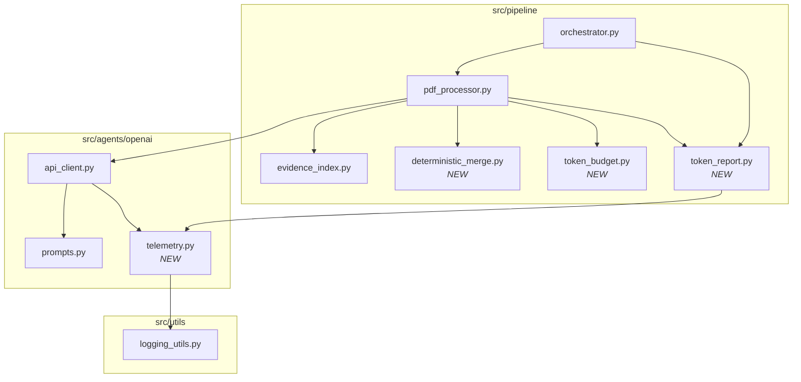

# Design Document: Token-Efficient Extraction

## Overview

This design introduces a token-efficiency layer into the EviTrace extraction pipeline. The layer operates across six concerns:

1. **Telemetry** — Per-request and per-stage token accounting with prompt fingerprinting.
2. **Prompt stability** — Byte-identical stable prefixes that maximize server-side prompt-cache hits.
3. **Evidence compaction** — Deterministic evidence serialization and deduplication to avoid redundant uncached input.
4. **Deterministic merge** — Rule-based resolution of non-conflicting chunk outputs, eliminating synthesis model calls when no genuine conflict exists.
5. **Budget enforcement** — Configurable token budgets per stage with graduated mitigation (prune → split → reject).
6. **Reporting** — A run-level JSON artifact summarizing token usage, cache rates, and cost attribution.

The design preserves the existing async pipeline architecture (`orchestrator.py` → `pdf_processor.py` → `api_client.py`) and adds new modules alongside existing ones rather than restructuring the call graph.

## Architecture



### New Modules

| Module | Location | Responsibility |
|--------|----------|----------------|
| `telemetry.py` | `src/agents/openai/` | Record per-request `TelemetryRecord`, compute prompt fingerprints, aggregate per-stage summaries, emit cache-diagnostics warnings. |
| `deterministic_merge.py` | `src/pipeline/` | Merge non-conflicting chunk outputs without LLM calls; detect conflicts requiring synthesis. |
| `token_budget.py` | `src/pipeline/` | Estimate token counts, enforce per-stage budgets, apply mitigation strategies (prune, split, reject). |
| `token_report.py` | `src/pipeline/` | Generate the run-level `token_report.json` artifact from aggregated telemetry. |

### Modified Modules

| Module | Changes |
|--------|---------|
| `src/agents/openai/api_client.py` | After each API call, emit a `TelemetryRecord` via `telemetry.py`. Pass stage label and field range metadata. |
| `src/agents/openai/prompts.py` | Ensure `get_system_prompt()` caches the string in memory (same object reference). Evidence serialization sorted by Evidence_ID. Field definitions sorted by field_index. |
| `src/pipeline/pdf_processor.py` | Insert deterministic merge before synthesis call. Apply token budget checks before dispatching prompts. Emit repair telemetry with `validation_repair` stage. |
| `src/pipeline/evidence_index.py` | Assign deterministic positional Evidence_IDs (S/T/F + zero-padded counter). Serialize in stable sort order. |
| `src/pipeline/orchestrator.py` | After `run_pipeline` completes, invoke `token_report.py` to write the report artifact. |
| `configs/config.yaml` | Add `token_budgets` section with per-stage defaults. Add `cache_diagnostics.threshold` key. |

## Components and Interfaces

### 1. Telemetry (`src/agents/openai/telemetry.py`)

```python
@dataclass
class TelemetryRecord:
    stage: str                    # "extraction_chunk" | "synthesis" | "validation_repair" | "cache_warmup" | "finalization"
    model: str
    timestamp: str                # ISO 8601 UTC
    input_tokens: int
    output_tokens: int
    cached_input_tokens: int
    uncached_input_tokens: int    # computed: input_tokens - cached_input_tokens
    total_tokens: int
    prompt_fingerprint: PromptFingerprint
    # Optional chunk metadata
    field_index_start: int | None = None
    field_index_end: int | None = None
    domain_group: str | None = None
    # Repair metadata
    repair_attempt: int | None = None
    error_type: str | None = None  # "parse" | "schema"

@dataclass
class PromptFingerprint:
    stable_prefix_hash: str       # SHA-256 truncated to 16 hex chars
    prompt_version: str           # from config prompt_cache.key_prefix (max 64 chars)

@dataclass
class StageSummary:
    stage: str
    total_input_tokens: int
    total_output_tokens: int
    total_cached_input_tokens: int
    total_uncached_input_tokens: int
    request_count: int
    mean_cache_rate: float        # 0.0–1.0

class TelemetryCollector:
    """Thread-safe collector for a single pipeline run."""
    def record(self, record: TelemetryRecord) -> None: ...
    def stage_summaries(self) -> list[StageSummary]: ...
    def all_records(self) -> list[TelemetryRecord]: ...
    def top_n_expensive(self, n: int = 5) -> list[TelemetryRecord]: ...
    def check_cache_diagnostics(self, threshold: float = 50.0) -> None: ...
    def check_prefix_drift(self) -> None: ...
```

### 2. Deterministic Merge (`src/pipeline/deterministic_merge.py`)

```python
@dataclass
class MergeResult:
    merged_fields: list[dict]     # compact format: {i, v, loc, c}
    conflicts: list[int]          # field indices requiring LLM synthesis
    skipped_synthesis: bool       # True when all fields resolved deterministically

def deterministic_merge(
    chunk_results: list[list[dict]],
    total_fields: int = 62,
) -> MergeResult:
    """Merge non-conflicting chunk outputs.

    Rules applied per field_index:
    1. All chunks agree (after whitespace normalization) → use lowest-chunk value.
    2. Only one chunk provides a value → use that value.
    3. All chunks provide null/empty → assign "nr" confidence.
    4. Values disagree → mark as conflict for LLM synthesis.

    Evidence_IDs are deduplicated (union, sorted ascending).
    Confidence labels are resolved to the highest: h > m > l > nr.
    Output is deterministic regardless of chunk execution order.
    """
    ...

def normalize_value(value: str | None) -> str | None:
    """Strip leading/trailing whitespace, collapse internal whitespace."""
    ...
```

### 3. Token Budget (`src/pipeline/token_budget.py`)

```python
@dataclass
class BudgetCheckResult:
    within_budget: bool
    estimated_tokens: int
    budget_limit: int
    stage: str
    top_sections: list[tuple[str, int]]  # (section_name, estimated_tokens)

def estimate_tokens(text: str) -> int:
    """Estimate token count using chars/4 heuristic."""
    return len(text) // 4

def check_budget(
    prompt_text: str,
    stage: str,
    budgets: dict[str, int],
) -> BudgetCheckResult:
    """Check if a prompt is within its stage budget."""
    ...

def apply_mitigation(
    prompt_parts: dict[str, str],
    stage: str,
    budget: int,
    config: dict,
) -> tuple[str, list[str]]:
    """Apply graduated mitigation: prune → split → reject.

    Returns (mitigated_prompt, warnings).
    Raises TokenBudgetExceededError if all strategies exhausted.
    """
    ...

class TokenBudgetExceededError(Exception):
    """Raised when a prompt exceeds budget after all mitigation."""
    def __init__(self, stage: str, estimated: int, budget: int, top_sections: list): ...
```

### 4. Token Report (`src/pipeline/token_report.py`)

```python
@dataclass
class TokenReport:
    total_input_tokens: int
    total_output_tokens: int
    total_cached_input_tokens: int
    total_uncached_input_tokens: int
    overall_cache_rate: float         # cached / input
    output_to_input_ratio: float      # output / input
    per_stage: list[StageSummary]
    top_5_expensive: list[dict]
    telemetry_records: list[dict]     # raw records as dicts
    delta: dict | None                # comparison with prior report, if available
    status: str                       # "complete" | "telemetry_unavailable"

def generate_token_report(
    collector: TelemetryCollector,
    output_dir: Path,
) -> TokenReport:
    """Generate and write token_report.json to the output directory."""
    ...
```

### 5. Prompt Construction Changes (`src/agents/openai/prompts.py`)

The existing `_shared_paper_prefix` function already places evidence before dynamic content. Changes:

- `get_system_prompt()` caches the loaded string as a module-level singleton (same object reference on every call).
- Evidence items within `source_package` are serialized sorted by Evidence_ID (ascending lexicographic).
- Field definitions in the extraction map are sorted by `field_index` (ascending numeric).
- Runtime metadata (timestamps, run IDs, chunk numbers, PDF file names) excluded from the stable prefix.

### 6. Evidence Index Changes (`src/pipeline/evidence_index.py`)

- Evidence_IDs use deterministic positional scheme: `S000001`, `T000001`, `F000001` (type prefix + zero-padded 6-digit counter).
- `build_paper_evidence_package()` serializes items sorted by Evidence_ID.
- Cache reuse: if `{paper_id}_{pdf_hash}.evidence.json` exists and PDF hash matches, reuse without re-parsing.

## Data Models

### TelemetryRecord (JSON serialization)

```json
{
  "stage": "extraction_chunk",
  "model": "gpt-5.5",
  "timestamp": "2025-01-15T10:30:00Z",
  "input_tokens": 8500,
  "output_tokens": 1200,
  "cached_input_tokens": 6000,
  "uncached_input_tokens": 2500,
  "total_tokens": 9700,
  "prompt_fingerprint": {
    "stable_prefix_hash": "a1b2c3d4e5f67890",
    "prompt_version": "scoping-review-v1"
  },
  "field_index_start": 3,
  "field_index_end": 22,
  "domain_group": "study_design",
  "repair_attempt": null,
  "error_type": null
}
```

### TokenReport (JSON schema)

```json
{
  "status": "complete",
  "total_input_tokens": 95000,
  "total_output_tokens": 12000,
  "total_cached_input_tokens": 72000,
  "total_uncached_input_tokens": 23000,
  "overall_cache_rate": 0.758,
  "output_to_input_ratio": 0.126,
  "per_stage": [
    {
      "stage": "extraction_chunk",
      "total_input_tokens": 68000,
      "total_output_tokens": 9000,
      "total_cached_input_tokens": 55000,
      "total_uncached_input_tokens": 13000,
      "request_count": 8,
      "mean_cache_rate": 0.809
    }
  ],
  "top_5_expensive": [],
  "telemetry_records": [],
  "delta": {
    "cache_rate_change": 0.12,
    "avg_uncached_per_request_change": -1500,
    "total_tokens_change": -8000
  }
}
```

### MergeResult

```python
@dataclass
class MergeResult:
    merged_fields: list[dict]     # [{i: 1, v: "...", loc: [...], c: "h"}, ...]
    conflicts: list[int]          # [15, 42] — field indices needing LLM
    skipped_synthesis: bool       # True if conflicts is empty
```

### Config Additions (`configs/config.yaml`)

```yaml
# Token budget enforcement
token_budgets:
  extraction_chunk: 100000
  validation_repair: 20000
  synthesis: 120000
  cache_warmup: 10000

# Cache diagnostics
cache_diagnostics:
  threshold: 50  # percentage; warn if stage cache rate falls below this
```

## Correctness Properties

*A property is a characteristic or behavior that should hold true across all valid executions of a system — essentially, a formal statement about what the system should do. Properties serve as the bridge between human-readable specifications and machine-verifiable correctness guarantees.*

### Property 1: Telemetry record completeness and uncached token invariant

*For any* valid OpenAI API response with usage data, the recorded TelemetryRecord SHALL contain all required fields and `uncached_input_tokens` SHALL equal `input_tokens - cached_input_tokens`.

**Validates: Requirements 1.1, 1.5**

### Property 2: Stage summary aggregation correctness

*For any* list of TelemetryRecords, the per-stage StageSummary SHALL have `total_input_tokens` equal to the sum of `input_tokens` across all records for that stage, and `mean_cache_rate` SHALL equal `total_cached_input_tokens / total_input_tokens` (or 0.0 when total_input_tokens is 0).

**Validates: Requirements 1.4**

### Property 3: Stable prefix byte-identity across chunk calls

*For any* paper-level evidence package and any two sets of chunk_fields, the Stable_Prefix portion of the constructed prompts SHALL be byte-identical when encoded as UTF-8.

**Validates: Requirements 2.1, 2.2, 2.6, 3.3**

### Property 4: Evidence serialization sort stability

*For any* set of evidence items, serialization SHALL emit items sorted by Evidence_ID in ascending lexicographic order, and serializing the same set multiple times SHALL produce byte-identical output.

**Validates: Requirements 2.2, 2.3, 3.3**

### Property 5: Field definitions ordered by field_index

*For any* list of field definitions included in a prompt, they SHALL appear in ascending numeric order of `field_index`.

**Validates: Requirements 2.3**

### Property 6: Evidence_ID determinism

*For any* valid TEI XML input, parsing it twice SHALL produce identical Evidence_IDs, and each ID SHALL match the pattern `^[STF]\d{6}$`.

**Validates: Requirements 3.1**

### Property 7: Evidence selection respects configured limits

*For any* evidence item set and configured limits (`max_evidence_items_per_chunk`, `max_evidence_chars_per_chunk`), the selected evidence package SHALL contain at most `max_evidence_items_per_chunk` items and at most `max_evidence_chars_per_chunk` total characters.

**Validates: Requirements 3.2**

### Property 8: Deterministic merge is order-independent (confluence)

*For any* set of chunk results, applying `deterministic_merge` with any permutation of chunk order SHALL produce identical `MergeResult` output (same `merged_fields`, same `conflicts`).

**Validates: Requirements 5.7**

### Property 9: Non-conflicting fields merge without LLM

*For any* set of chunk results where every field either has string-equivalent values (after whitespace normalization) across all providing chunks, or is provided by only a subset of chunks with no disagreement, `deterministic_merge` SHALL produce a `MergeResult` with an empty `conflicts` list and `skipped_synthesis = True`.

**Validates: Requirements 5.1, 5.5, 5.6, 4.3**

### Property 10: Evidence_ID deduplication produces sorted unique union

*For any* set of `loc` lists across chunks for the same field, the merged `loc` SHALL be the sorted unique union of all Evidence_IDs in ascending lexicographic order.

**Validates: Requirements 5.3**

### Property 11: Confidence resolution selects highest label

*For any* set of confidence labels across chunks for a field with string-equivalent values, the merged confidence SHALL be the maximum according to the ordering `h > m > l > nr`.

**Validates: Requirements 5.4**

### Property 12: Synthesis candidate limiting

*For any* conflicting field with more than 5 candidates, the synthesis input SHALL contain at most 5 candidates, and those 5 SHALL be the ones with the highest confidence labels.

**Validates: Requirements 4.7**

### Property 13: Compact synthesis snippet truncation

*For any* candidate evidence snippet, the formatted snippet in the synthesis prompt SHALL be at most 200 characters and SHALL be truncated at the nearest word boundary when the original exceeds 200 characters.

**Validates: Requirements 4.2**

### Property 14: Repair prompt is smaller than original

*For any* chunk validation failure, the constructed Repair_Prompt's estimated token count (chars/4) SHALL be strictly less than the original chunk prompt's estimated token count.

**Validates: Requirements 6.2**

### Property 15: Token estimation is chars divided by 4

*For any* string input, `estimate_tokens(text)` SHALL return `len(text) // 4`.

**Validates: Requirements 7.1**

### Property 16: Prompt fingerprint correctness

*For any* UTF-8 string used as a Stable_Prefix, the computed `stable_prefix_hash` SHALL equal the first 16 characters of the SHA-256 hex digest of that string's UTF-8 bytes.

**Validates: Requirements 8.1, 1.5**

### Property 17: Cache diagnostics warning fires below threshold

*For any* stage with at least 3 completed requests where the observed cache rate is below the configured threshold, the telemetry collector SHALL emit a cache diagnostics warning. *For any* stage at or above the threshold, no warning SHALL be emitted.

**Validates: Requirements 8.3**

### Property 18: Prefix drift detection

*For any* set of TelemetryRecords within a single run where the same stage and prompt_version produce two or more distinct `stable_prefix_hash` values, the telemetry collector SHALL emit a drift warning.

**Validates: Requirements 8.4**

### Property 19: Token report sum invariant

*For any* generated TokenReport, the sum of `total_input_tokens` across all `per_stage` entries SHALL equal the top-level `total_input_tokens`, and the same SHALL hold for `total_output_tokens`, `total_cached_input_tokens`, and `total_uncached_input_tokens`.

**Validates: Requirements 9.5, 10.2, 10.3**

### Property 20: Token report delta correctness

*For any* two TokenReports (current and prior), the delta SHALL correctly compute `cache_rate_change` as `current.overall_cache_rate - prior.overall_cache_rate`, `avg_uncached_per_request_change` as the difference in average uncached tokens per request, and `total_tokens_change` as `current.total_tokens - prior.total_tokens`.

**Validates: Requirements 10.5**

### Property 21: Evidence pruning preserves high-confidence references

*For any* evidence pruning operation, all Evidence_IDs referenced by fields with confidence label "h" SHALL remain present in the pruned evidence set.

**Validates: Requirements 9.4**

### Property 22: Budget mitigation ordering

*For any* prompt exceeding its stage Token_Budget, mitigation SHALL be attempted in strict order: (a) evidence pruning, (b) request splitting, (c) rejection — and the first strategy that brings the estimate within budget SHALL be used without attempting subsequent strategies.

**Validates: Requirements 7.2**

## Error Handling

| Scenario | Behavior |
|----------|----------|
| Missing `usage` field in API response | Log WARNING, create TelemetryRecord with zero token counts, continue processing. (Req 1.6) |
| Token budget exceeded after all mitigation | Raise `TokenBudgetExceededError` with stage, estimate, budget, and top-3 sections. Log WARNING. (Req 7.2, 7.4) |
| Invalid `token_budgets` config value (missing, non-integer, zero, negative) | Use documented default for that stage, log WARNING with stage name and invalid value. (Req 7.6) |
| Invalid `cache_diagnostics.threshold` (missing, not 0–100) | Use default 50%, log WARNING. (Req 8.6) |
| Repair exhaustion (max attempts reached) | Record chunk as failed with metadata (chunk number, last error, error type, attempt count). Continue other chunks. (Req 6.4) |
| Prior `token_report.json` unreadable or malformed | Skip delta comparison, log WARNING, write report without delta field. |
| No telemetry data available at run end | Write `token_report.json` with `status: "telemetry_unavailable"`. (Req 10.6) |
| Deterministic merge encounters unexpected data types | Log ERROR with field index and data, treat field as conflicting (fall through to synthesis). |

## Testing Strategy

### Property-Based Testing (Hypothesis)

This feature is well-suited for property-based testing because it involves pure functions with clear input/output behavior (merge logic, token estimation, fingerprint computation, serialization ordering) and universal invariants that should hold across all valid inputs.

**Library:** [Hypothesis](https://hypothesis.readthedocs.io/) (already used in the project)

**Configuration:** Minimum 100 examples per property test (`@settings(max_examples=100)`)

**Tag format:** Each property test includes a docstring comment:
```python
# Feature: token-efficient-extraction, Property N: <property_text>
```

**Test file locations:**
- `tests/src/agents/openai/test_telemetry_properties.py` — Properties 1, 2, 16, 17, 18
- `tests/src/pipeline/test_deterministic_merge_properties.py` — Properties 8, 9, 10, 11, 12
- `tests/src/pipeline/test_token_budget_properties.py` — Properties 15, 21, 22
- `tests/src/pipeline/test_token_report_properties.py` — Properties 19, 20
- `tests/src/agents/openai/test_prompts_stability_properties.py` — Properties 3, 4, 5, 6, 7, 13, 14

### Unit Tests (Example-Based)

Unit tests cover specific scenarios, edge cases, and integration points not suited for PBT:

- `tests/src/agents/openai/test_telemetry.py` — Stage labeling (Req 1.2, 1.3), system prompt caching (Req 2.7), repair telemetry labeling (Req 6.5), fingerprint inclusion (Req 8.2)
- `tests/src/pipeline/test_deterministic_merge.py` — Zero-candidate fields get "nr" (Req 4.5, 5.2), synthesis output schema (Req 4.6), synthesis prompt excludes full evidence (Req 4.1)
- `tests/src/pipeline/test_token_budget.py` — Default budget values (Req 7.5), invalid config fallback (Req 7.6), synthesis conflict-only fallback (Req 7.3), budget exceeded warning format (Req 7.4)
- `tests/src/pipeline/test_token_report.py` — File written to output dir (Req 10.1), raw + aggregated both present (Req 10.4), telemetry unavailable status (Req 10.6)
- `tests/src/pipeline/test_evidence_index_stability.py` — Cache reuse with matching hash (Req 3.5), Evidence_ID in loc field (Req 3.4), runtime metadata excluded from prefix (Req 2.4)

### Integration / Regression Tests

- `tests/src/pipeline/test_token_efficiency_regression.py` — Fixture-based tests verifying uncached tokens per request ≤ 5000 (Req 9.1), LCP ratio ≥ 90% (Req 9.2), no synthesis call when all fields non-conflicting (Req 9.3), report schema conformance (Req 9.5), failure output format (Req 9.6)

### Test Balance

- **Property tests** handle comprehensive input coverage for merge logic, aggregation math, serialization ordering, and invariant verification.
- **Unit tests** handle specific examples, edge cases (empty inputs, invalid config), and integration points (file I/O, logging output).
- **Regression tests** guard against future changes increasing token usage beyond acceptable thresholds.

