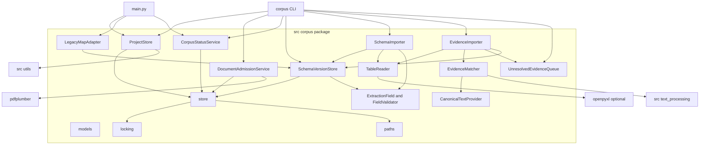
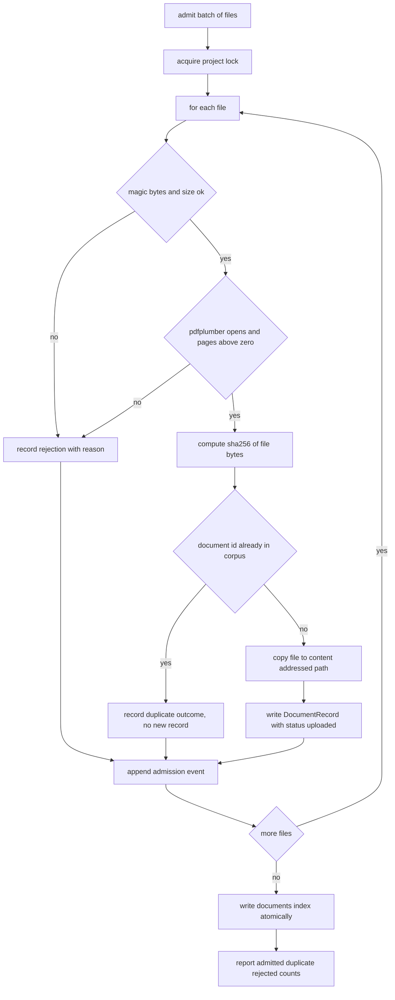
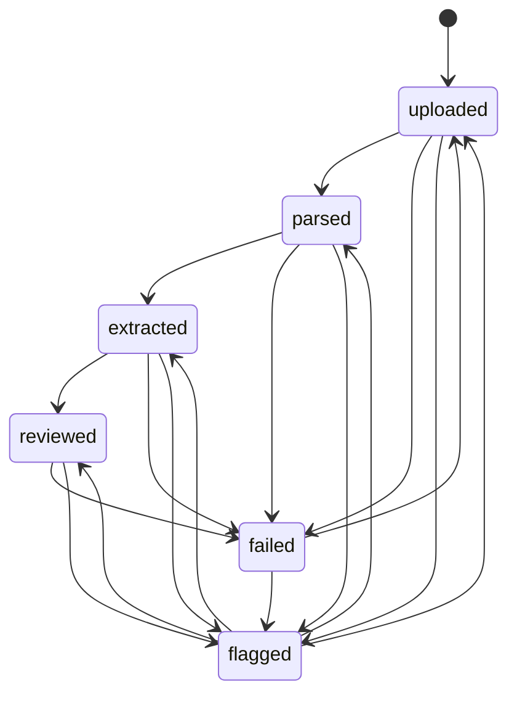
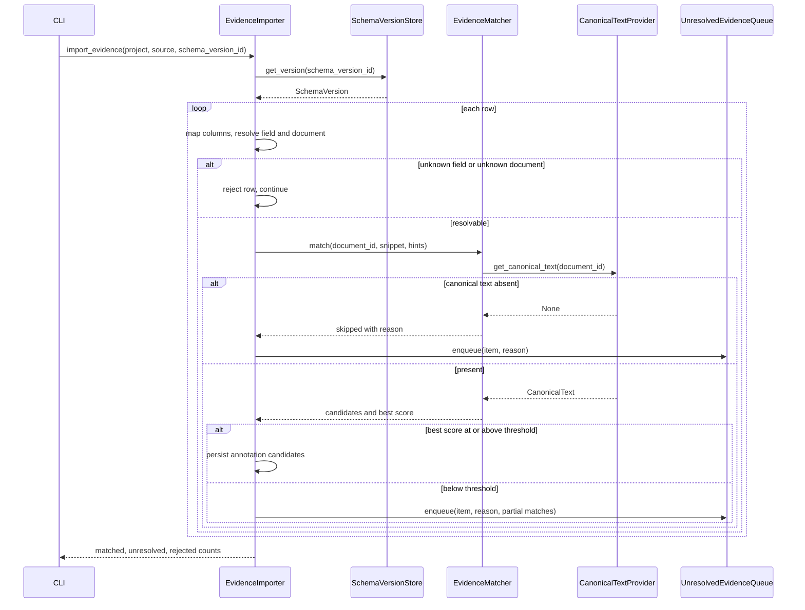
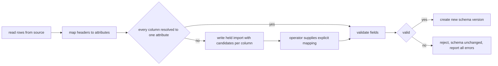
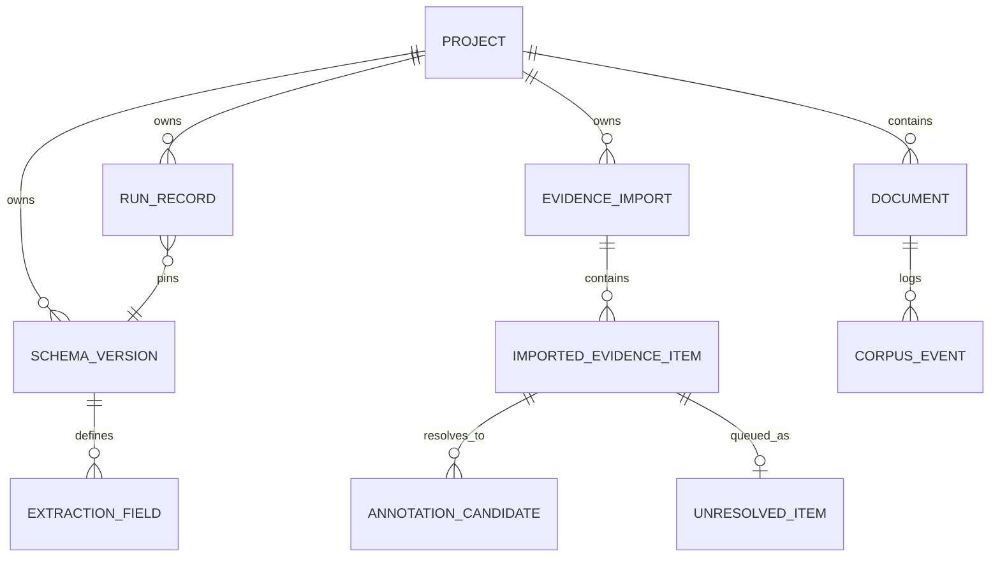
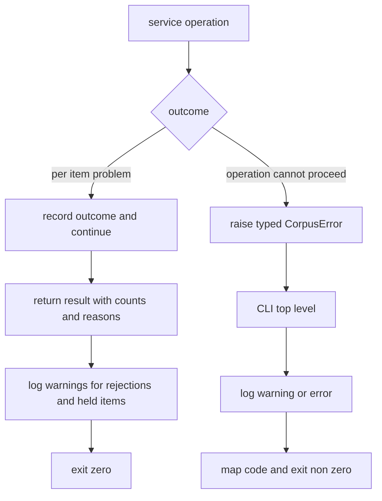

# Design Document — corpus-and-schema-builder

## Overview

**Purpose**: This feature delivers the reviewer-facing organising layer that EviTrace lacks — named projects that own a corpus, a configuration profile, and a versioned extraction schema — so that a reviewer can run more than one review from a single installation, admit documents with stable identity and up-front validation, define their own extraction fields, and bring in evidence extracted elsewhere.

**Users**: evidence-synthesis reviewers driving EviTrace from a shell, and operators running it on a server. Every capability is reachable from a command-line entry point and callable as a library; nothing here assumes a graphical environment.

**Impact**: today the pipeline reads whatever PDFs sit under the single import-time constant `PDF_DIR`, hashes a checked-in `configs/extraction_map.json`, and records per-run state in one repo-root `manifest.json`. This design adds a new `src/corpus/` package that owns a project directory tree beside those, resolves its own paths, and is wired in at the CLI boundary. The pipeline's manifest, prompt builders, extraction-map loader, and the cache-stable prompt prefix are **not modified**.

### Goals

- A project aggregate that isolates corpus, schema versions, imported evidence, and outputs, with a configuration profile overlaid on the installation config.
- Content-derived, idempotent document identity plus admission-time validation that works in the default permissive install (no PyMuPDF).
- A reviewer-facing document status vocabulary with full history and a corpus rollup, kept distinct from the pipeline's manifest vocabulary.
- A superset extraction-field model with criticality, data type, allowed values, evidence requirement, and review instructions, versioned immutably, that projects losslessly back to today's 62-field legacy shape.
- Schema and evidence import from CSV, Excel, JSON, and YAML with ambiguous columns held for explicit human mapping rather than guessed.
- Imported evidence matched to canonical document text with page and citation hints, competing candidates preserved, and an unresolved queue that never drops an item.

### Non-Goals

- LLM-assisted generation of candidate extraction fields and the approval flow around it. Deferred until an approved LLM call path exists.
- Any interactive or graphical surface, including the manual linking surface for unresolved evidence.
- Behavioural enforcement of the criticality flag or evidence requirement during routing, extraction, verification, or repair.
- Production of W3C annotation artifacts, and definition of evidence-node identity.
- Multi-user access control, reviewer identity, and parser / canonical-document production.
- Changing how `src/pipeline/extraction_map.py` or `src/agents/openai/prompts.py` consume the field list.

## Boundary Commitments

### This Spec Owns

- The **project aggregate**: project record, per-project configuration profile, project directory layout, and cross-project isolation.
- **Document admission**: content-derived document identity, admission-time PDF validation, per-document metadata, batch admission outcomes, and the append-only admission event log.
- The **reviewer-facing corpus status vocabulary**, its permitted transitions, per-document status history, and the corpus rollup.
- The **extraction-field model** and its validation rules, **immutable schema versions**, version diffing, the run-to-version pinning record, and the lossless projection to and from the legacy 62-field extraction-map shape.
- **Schema import** (CSV, Excel, JSON, YAML) including column-to-attribute mapping, the held-import state, and completion.
- **External evidence import**: row mapping, origin metadata, match attempts against canonical text, annotation **candidates**, and the unresolved evidence queue as readable data.
- The `corpus` command-line entry point and the `projects` top-level configuration key.

### Out of Boundary

- The pipeline manifest, its status vocabulary, and per-run resumability — unchanged and still authoritative for resumption.
- `src/pipeline/extraction_map.py`, `src/agents/openai/prompts.py`, and the cache-stable `_shared_paper_prefix`. This spec materializes a schema version into the legacy file shape and stops there.
- Production of canonical document text, page geometry, sentences, and tables — consumed through a provider interface, never re-derived.
- `src/artifact_generation/w3c_annotation.py` remains the sole producer of annotation artifacts. This spec emits annotation *candidates* only.
- Evidence-node identity, provenance graph structure, sensitivity classification, and any disclosure decision. A sensitivity label attribute is stored as an unset carrier.
- Enforcement of `criticality` and `evidence_requirement`; both are exposed as readable attributes only.
- Any interactive linking, editing, or review surface.

### Allowed Dependencies

- `src/utils/` — `config_utils` (installation config and the new `projects` key), `path_utils` (project-root resolution only), `logging_utils`.
- `src/text_processing/` — `LexicalMatcher`, `DefaultTextProcessor`, normalizers, for snippet matching.
- Standard library plus `PyYAML`, `jsonschema`, `pdfplumber` (all already core dependencies).
- `openpyxl` — new **optional** extra, imported inside function bodies only.
- Forbidden: `corpus` must not import `quality_control`, `agents`, `pipeline`, or `pdf_extractor`. Conversely `quality_control`, `text_processing`, `agents`, and `pdf_extractor` must not import `corpus`. Only `main.py` and, later, `src/pipeline/`, may depend on `corpus`.

### Revalidation Triggers

- Any change to the document-identity rule (currently SHA-256 of file bytes) — invalidates every stored document ID and the join to `manifest.compute_identity`.
- Any change to the corpus status vocabulary or its transition table — consumed by `reviewer-ui` and `cost-and-run-reporting`.
- Any change to the extraction-field attribute set, the `version_id` construction, or the legacy projection — consumed by `evidence-routing`, `multiagent-extraction`, and `cost-and-run-reporting`.
- Any change to the annotation-candidate shape or the unresolved-queue record shape — consumed by `reviewer-ui` (R20.6 linking surface) and `provenance-core`.
- Introducing a real dependency on `provenance-core` evidence-node identity, which today is only a reserved unset carrier field.
- Adding a required (non-optional) third-party dependency to this package.

## Architecture

### Existing Architecture Analysis

| Existing element | Constraint it imposes | How this design responds |
|---|---|---|
| `src/utils/path_utils.py` computes `PDF_DIR`, `OUTPUT_DIR`, `MANIFEST_FILE`, `EXTRACTION_MAP`, `RUN_FOLDER_NAME` at **import time** | Per-project paths cannot be delivered by rebinding these globals; the steering "no global mutation" rule forbids it anyway | `corpus.paths.ProjectPaths` resolves every project path from an explicit project root; only `PROJECT_ROOT` is read from `path_utils` |
| `_ALL_KNOWN_TOP_LEVEL_KEYS` in `config_utils.py` rejects unregistered YAML keys | A new `projects:` block breaks config loading unless registered | `projects` is added to the known-key set and read by a new `load_projects_config()` |
| `manifest.compute_identity()` already hashes PDF bytes with SHA-256 | A second identity convention would fracture the repo | The document ID **is** that hash, recomputed locally by the same rule (importing `pipeline` is forbidden) |
| Manifest statuses `pending`, `complete`, `failed_qc_pipeline`, `failed_validation`, `failed_schema_validation`, `failed_chunks`, `failed_chunk_<n>` are all live and protected by the roadmap | Corpus status cannot replace or rename them | A separate coarser vocabulary plus one mapping table applied at the integration boundary |
| `prompts.py` serializes whole field dicts into the cache-stable prefix | Any change to the field-dict shape invalidates the prompt cache | The seed schema version projects **byte-identically** to today's `extraction_map.json`; the prompt path is untouched |
| `LexicalMatcher.search()` returns top-1 only | Requirement 9.4 needs competing candidates | This package enumerates occurrences itself and uses `LexicalMatcher` for span recovery and scoring |
| `pdfplumber` is core; `fitz` is an optional AGPL extra | Admission must not require the `ocr` extra | Validation uses magic bytes, file size, and `pdfplumber` |
| `tests/test_dependency_directions.py` enforces imports by AST over a `FORBIDDEN_PAIRS` list | New package edges must be declared | Seven new pairs are added, plus an internal-direction test for `src/corpus/` |

### Architecture Pattern & Boundary Map

Selected pattern: **file-backed aggregate store with a layered service package**. The project directory is the aggregate; services are stateless over it; the CLI is the only entry point that composes them.



**Architecture integration**

- **Domain boundaries**: corpus (project, admission, status), schema (fields, versions, legacy projection, import), evidence (canonical provider, matcher, import, queue). Foundation (`models`, `paths`, `locking`, `store`) is shared by all three and depends on none of them.
- **Dependency direction inside the package** (imports flow strictly left to right, never upward):
  `errors` → `models` → `paths` → `locking` → `store` → domain services (`project`, `admission`, `status`, `schema.*`, `tables`, `evidence.*`) → `cli` → `__main__`.
  Within the domain layer, `evidence.importer` may import `schema.versions` and `evidence.matcher`; `schema.importer` may import `schema.versions`, `schema.fields`, and `tables`. No domain service imports `cli`.
- **Existing patterns preserved**: config loaded once and passed explicitly; no module-level mutation; heavy or optional dependencies imported inside function bodies; atomic temp-file + `os.replace` writes as in `manifest.save_manifest`; all logging through `utils.logging_utils.get_logger`; dataclasses for all shared models, collected in one `models.py` per the `quality_control.models` convention.
- **New components rationale**: the project aggregate, admission, versioned schema, and evidence import have no existing home; the alternative of extending `manifest.py` was rejected in `research.md` because it conflates run checkpointing with corpus identity.
- **Steering compliance**: `projects` registered in `_ALL_KNOWN_TOP_LEVEL_KEYS`; no new required runtime dependency; dependency-direction rules extended and tested; no PHI in fixtures.

### Technology Stack

| Layer | Choice / Version | Role in Feature | Notes |
|-------|------------------|-----------------|-------|
| CLI | `argparse` (stdlib), Python 3.12 | `corpus` subcommands; `--project` flag on `main.py` | Matches `main.py`'s existing `argparse` style; first `python -m` entry point in the repo |
| Services | Python 3.12 dataclasses + `typing.Protocol` | Domain model and provider seams | `from __future__ import annotations` throughout |
| Data / storage | JSON files + JSONL event log on local disk | Project record, corpus index, schema versions, evidence, queue | Atomic `os.replace`; lock directory via `os.mkdir` |
| Validation | `jsonschema` >= 4.0.0 (core dep) | Structural validation of stored records and of imported schema field objects | Already used by `quality_control.validator` |
| PDF inspection | `pdfplumber` >= 0.10.0 (core dep) | Page count and readability at admission | Avoids the AGPL `fitz` extra |
| Text matching | `src/text_processing` (`LexicalMatcher`, `DefaultTextProcessor`) | Snippet-to-canonical-text matching and graded scoring | No new fuzzy-matching dependency |
| Config / serialization | `PyYAML` >= 6.0 (core dep) | YAML schema import and the `projects` config block | — |
| Spreadsheet import | `openpyxl` >= 3.1 — **new optional extra** `imports` | `.xlsx` reading for schema and evidence import | Lazy import inside the reader function; declared in `pyproject.toml` `[project.optional-dependencies]` and commented in `requirements.txt` |

## File Structure Plan

### Directory Structure

```
src/corpus/
├── __init__.py                 # public API re-exports only
├── errors.py                   # CorpusError hierarchy + exit-code mapping
├── models.py                   # ALL shared dataclasses and enums for this package
├── paths.py                    # ProjectPaths: project directory layout resolution
├── locking.py                  # ProjectLock + atomic_write_json + append_event
├── store.py                    # JsonStore: typed read/write/append over ProjectPaths
├── project.py                  # ProjectStore: create/open/list, config profile overlay
├── admission.py                # DocumentAdmissionService: identity, validation, batch admission
├── status.py                   # CorpusStatusService: vocabulary, transitions, history, rollup
├── schema/
│   ├── __init__.py
│   ├── fields.py               # ExtractionField model + FieldValidator rules
│   ├── versions.py             # SchemaVersionStore: immutable versions, diff, run pinning
│   ├── legacy.py               # LegacyMapAdapter: seed migration + legacy projection/materialization
│   └── importer.py             # SchemaImporter: column mapping, held imports, completion
├── tables/
│   ├── __init__.py
│   └── readers.py              # TableReader: CSV/JSON/YAML rows; Excel via lazy openpyxl
├── evidence/
│   ├── __init__.py
│   ├── canonical.py            # CanonicalTextProvider protocol + FileCanonicalTextProvider
│   ├── matcher.py              # EvidenceMatcher: hint ordering, occurrence enumeration, scoring
│   ├── importer.py             # EvidenceImporter: row mapping, origin metadata, outcome counts
│   └── queue.py                # UnresolvedEvidenceQueue: enqueue, list, resolve, discard
├── cli.py                      # argparse subcommand tree; maps errors to exit codes
└── __main__.py                 # python -m corpus
```

Project directory layout created by `ProjectPaths` (one directory per project, under the configured projects root):

```
<projects_root>/<project_id>/
├── project.json                # ProjectRecord incl. configuration profile
├── corpus/
│   ├── documents.json          # document_id -> DocumentRecord
│   ├── events.jsonl            # append-only admission + status transition events
│   └── files/<document_id>.pdf # admitted copy, content-addressed
├── canonical/<document_id>.json # canonical text artifact (written by the pipeline; read-only here)
├── schema/
│   ├── versions/<version_id>.json  # immutable SchemaVersion documents
│   ├── HEAD.json                   # pointer to the current version_id
│   ├── imports/<import_id>.json    # held schema imports awaiting a mapping
│   └── materialized/<version_id>.extraction_map.json  # legacy 7-key projection
├── evidence/
│   ├── imports/<import_id>.json    # imported evidence items + origin metadata
│   ├── candidates.json             # annotation candidates keyed by evidence item id
│   └── unresolved.json             # unresolved evidence queue
├── runs/<run_id>.json          # run record pinning the schema version used
└── .lock/                      # lock directory (owner pid + timestamp inside)
```

### Modified Files

- `src/utils/config_utils.py` — register `"projects"` in `_ALL_KNOWN_TOP_LEVEL_KEYS`; add `load_projects_config(config_path: str | None = None) -> dict` returning `{"root": str, "default_project": str, "match_threshold": float, "max_candidates": int}` with defaults applied.
- `configs/config.yaml` — add the `projects:` block with commented defaults.
- `main.py` — add `--project <project_id>`; when supplied, resolve PDF paths from the project corpus instead of `--pdf-dir`, materialize the pinned schema version, write the run record, report per-document outcomes back to `CorpusStatusService` after `run_pipeline` returns, and persist each document's canonical text artifact into the project directory.
- `tests/test_dependency_directions.py` — append `("corpus", "quality_control")`, `("corpus", "agents")`, `("corpus", "pipeline")`, `("corpus", "pdf_extractor")`, `("quality_control", "corpus")`, `("text_processing", "corpus")`, `("agents", "corpus")` to `FORBIDDEN_PAIRS`, plus named tests.
- `pyproject.toml` — add the `imports = ["openpyxl>=3.1"]` optional-dependency extra.
- `requirements.txt` — add a commented optional line for `openpyxl` beside the existing optional block.

## System Flows

### Batch admission



Rejections never abort the batch (3.2); the index is written once at the end under the same lock so a partially processed batch cannot leave a torn index.

### Document status lifecycle



`flagged` is a status, so a flagged document records `prior_status`; unflagging is only permitted back to that recorded status, which is what the four outbound edges from `flagged` express. `failed --> uploaded` is re-admission after a fix. Any transition not on this diagram is rejected and leaves the current status unchanged (4.3).

### Evidence import and matching



Matching order inside `EvidenceMatcher`: hinted pages first, then the remaining document; the exact/normalised containment pass runs before the graded `SequenceMatcher` pass, and enumeration stops at the configured candidate cap.

### Held schema import



## Requirements Traceability

| Requirement | Summary | Components | Interfaces | Flows |
|-------------|---------|------------|------------|-------|
| 1.1, 1.2, 1.5, 1.6 | Create, open, and name-conflict handling for projects | `ProjectStore`, `JsonStore`, `ProjectPaths` | `create_project`, `open_project`, `list_projects` | — |
| 1.3 | Cross-project isolation | `ProjectPaths`, `JsonStore` | `ProjectPaths.for_project` | — |
| 1.4 | Configuration profile falls back to installation config | `ProjectStore`, `load_projects_config` | `ProjectStore.effective_config` | — |
| 1.7 | Default project when none specified | `ProjectStore`, `CorpusCLI` | `ProjectStore.resolve_project_id` | — |
| 2.1, 2.2 | Content-derived identity; idempotent re-admission | `DocumentAdmissionService` | `compute_document_id`, `admit_file` | Batch admission |
| 2.3, 2.7 | Recorded metadata and sensitivity carrier | `DocumentAdmissionService`, `DocumentRecord` | `admit_file` | Batch admission |
| 2.4, 2.5, 2.6 | Admission-time validation and rejection reasons | `DocumentAdmissionService` | `validate_pdf_for_admission` | Batch admission |
| 3.1, 3.2, 3.3, 3.5 | Independent per-file outcomes, partial-batch success, counts, repeat idempotence | `DocumentAdmissionService` | `admit_batch` | Batch admission |
| 3.4 | Per-document admission history | `JsonStore`, `ProjectLock` | `append_event`, `read_events` | Batch admission |
| 4.1, 4.2, 4.3 | Status vocabulary, stage-reported transitions, illegal transitions rejected | `CorpusStatusService` | `report_stage_outcome`, `transition` | Status lifecycle |
| 4.4 | Manual flag with reason | `CorpusStatusService` | `flag_document`, `unflag_document` | Status lifecycle |
| 4.5 | Corpus rollup | `CorpusStatusService` | `corpus_status` | — |
| 4.6 | Status history retained | `CorpusStatusService`, `JsonStore` | `document_history` | Status lifecycle |
| 5.1, 5.6 | Field attributes and grouping/ordering | `ExtractionField`, `FieldValidator` | `ExtractionField` dataclass | — |
| 5.2, 5.3, 5.4 | Field, duplicate, and allowed-value validation | `FieldValidator` | `validate_field`, `validate_schema` | Held schema import |
| 5.5 | Criticality and evidence requirement readable, not enforced | `ExtractionField`, `SchemaVersionStore` | `SchemaVersion.fields` | — |
| 5.7 | Schema released only if valid | `SchemaVersionStore` | `get_version_for_run` | — |
| 6.1, 6.4 | Immutable versions; in-place edits rejected | `SchemaVersionStore` | `create_version` | — |
| 6.2 | Run records the schema version used | `SchemaVersionStore`, `main.py` integration | `record_run_pin` | — |
| 6.3 | Outputs resolve against their own version | `SchemaVersionStore` | `get_version`, `resolve_run_version` | — |
| 6.5 | Version diff | `SchemaVersionStore` | `diff_versions` | — |
| 6.6 | Seed schema from the 62-field map | `LegacyMapAdapter` | `build_seed_version`, `to_legacy_entries` | — |
| 7.1, 7.3 | Column mapping applied and reported; explicit mapping completes a held import | `SchemaImporter`, `TableReader` | `import_schema`, `complete_held_import` | Held schema import |
| 7.2 | Ambiguous columns held, never guessed | `SchemaImporter` | `HeldImport` record | Held schema import |
| 7.4 | Validation gate before a new version | `SchemaImporter`, `FieldValidator`, `SchemaVersionStore` | `complete_held_import` | Held schema import |
| 7.5 | Missing optional reader reported by name | `TableReader` | `read_rows` | Held schema import |
| 7.6 | Malformed or empty source rejected, schema unchanged | `TableReader`, `SchemaImporter` | `read_rows`, `import_schema` | Held schema import |
| 8.1, 8.2, 8.3 | Evidence row mapping; unknown field and unknown document rejected per row | `EvidenceImporter`, `SchemaVersionStore` | `import_evidence` | Evidence import |
| 8.4, 8.5 | Origin metadata; never merged into system-generated evidence | `EvidenceImporter`, `ImportedEvidenceItem` | `import_evidence` | Evidence import |
| 8.6 | Outcome counts | `EvidenceImporter` | `EvidenceImportResult` | Evidence import |
| 9.1, 9.2, 9.3 | Snippet matching with hints and scored annotation candidates | `EvidenceMatcher`, `CanonicalTextProvider` | `match` | Evidence import |
| 9.4, 9.5 | Competing candidates and hint conflicts preserved | `EvidenceMatcher` | `MatchOutcome.candidates` | Evidence import |
| 9.6 | Candidates only, no annotation artifacts | `EvidenceMatcher` | `AnnotationCandidate` | — |
| 9.7 | Canonical text unavailable reported | `FileCanonicalTextProvider`, `EvidenceMatcher` | `get_canonical_text` | Evidence import |
| 10.1, 10.4, 10.5 | Enqueue on failure; retained; no duplicate entries | `UnresolvedEvidenceQueue` | `enqueue`, `discard` | Evidence import |
| 10.2 | Queue readable with full context | `UnresolvedEvidenceQueue`, `CorpusCLI` | `list_items` | — |
| 10.3 | External resolution recorded as manual | `UnresolvedEvidenceQueue` | `resolve` | — |
| 10.6 | Read-only queue, no linking surface | `UnresolvedEvidenceQueue`, `CorpusCLI` | `list_items` | — |
| 11.1, 11.2 | CLI coverage and non-zero exit on failure | `CorpusCLI`, `errors` | subcommand tree, `exit_code_for` | — |
| 11.3 | Existing directory flow unaffected without a project | `main.py` integration, `LegacyMapAdapter` | `--project` optional | — |
| 11.4 | Spreadsheet support optional | `TableReader` | `read_rows` | — |
| 11.5 | Concurrent writes cannot corrupt project state | `ProjectLock`, `JsonStore` | `ProjectLock.acquire`, `atomic_write_json` | — |
| 11.6 | Rejections, held imports, unresolved items logged | all services via `logging_utils` | `get_logger` | — |

## Components and Interfaces

| Component | Domain/Layer | Intent | Req Coverage | Key Dependencies (P0/P1) | Contracts |
|-----------|--------------|--------|--------------|--------------------------|-----------|
| `ProjectPaths` | Foundation | Resolve every path inside a project directory | 1.3 | `utils.path_utils` (P1) | Service |
| `ProjectLock` / `atomic_write_json` | Foundation | Serialize writers; make every write atomic | 11.5 | stdlib (P0) | Service, State |
| `JsonStore` | Foundation | Typed read/write of project JSON records and the JSONL event log | 3.4, 4.6, 11.5 | `ProjectPaths` (P0), `ProjectLock` (P0) | Service, State |
| `ProjectStore` | Corpus | Project lifecycle and effective configuration | 1.1, 1.2, 1.4, 1.5, 1.6, 1.7 | `JsonStore` (P0), `config_utils` (P0) | Service |
| `DocumentAdmissionService` | Corpus | Validate, identify, copy, and record admitted PDFs | 2.1-2.7, 3.1-3.5 | `pdfplumber` (P0), `JsonStore` (P0) | Service, Batch |
| `CorpusStatusService` | Corpus | Status vocabulary, transitions, history, rollup | 4.1-4.6 | `JsonStore` (P0) | Service, State |
| `ExtractionField` / `FieldValidator` | Schema | Field model and validation rules | 5.1-5.6 | `jsonschema` (P1) | Service |
| `SchemaVersionStore` | Schema | Immutable versions, diff, run pinning, validated release | 5.7, 6.1-6.5 | `JsonStore` (P0), `FieldValidator` (P0) | Service, State |
| `LegacyMapAdapter` | Schema | Seed migration and lossless legacy projection/materialization | 6.6, 11.3 | `SchemaVersionStore` (P0) | Service |
| `SchemaImporter` | Schema | Column mapping, held imports, completion into a version | 7.1-7.6 | `TableReader` (P0), `SchemaVersionStore` (P0) | Service, State |
| `TableReader` | Tables | Row extraction from CSV, Excel, JSON, YAML | 7.1, 7.5, 7.6, 8.1, 11.4 | `openpyxl` optional (P1), `PyYAML` (P0) | Service |
| `CanonicalTextProvider` | Evidence | Supply canonical text and page texts for a document | 9.1, 9.7 | project `canonical/` artifacts (P0) | Service |
| `EvidenceMatcher` | Evidence | Hint-ordered matching, competing candidates, scoring | 9.1-9.7 | `text_processing` (P0), `CanonicalTextProvider` (P0) | Service |
| `EvidenceImporter` | Evidence | Row mapping, origin metadata, outcome counts | 8.1-8.6, 10.1 | `TableReader` (P0), `EvidenceMatcher` (P0), `UnresolvedEvidenceQueue` (P0), `SchemaVersionStore` (P1) | Service, Batch |
| `UnresolvedEvidenceQueue` | Evidence | Hold, list, resolve, discard unplaceable evidence | 10.1-10.6 | `JsonStore` (P0) | Service, State |
| `CorpusCLI` | Interface | Headless entry point; error-to-exit-code mapping | 11.1, 11.2, 11.6 | all services (P0) | Service |

### Foundation

#### ProjectPaths, ProjectLock, JsonStore

| Field | Detail |
|-------|--------|
| Intent | Give every service one way to locate, lock, and durably write project state |
| Requirements | 1.3, 3.4, 4.6, 11.5 |

**Responsibilities & Constraints**
- `ProjectPaths` is the only place that knows the project directory layout; no other module joins project paths by hand.
- Every mutation goes through `atomic_write_json` (temp file in the same directory, then `os.replace`) or `append_event` (open in append mode, one JSON object per line, flush).
- `ProjectLock` guards a whole operation, not a single file: an operation that touches the documents index and the event log holds one lock for both.
- The lock is a directory created with `os.mkdir`; its `owner.json` records pid, hostname, and acquisition time. Acquisition retries with bounded backoff and then raises `ProjectLockedError`.

**Dependencies**
- Outbound: `utils.path_utils` — project-root resolution only (P1); `utils.logging_utils` (P2).

**Contracts**: Service [x] / State [x]

##### Service Interface
```python
@dataclass(frozen=True)
class ProjectPaths:
    root: Path                      # <projects_root>/<project_id>
    @classmethod
    def for_project(cls, projects_root: Path, project_id: str) -> "ProjectPaths": ...
    @property
    def project_file(self) -> Path: ...
    @property
    def documents_index(self) -> Path: ...
    @property
    def events_log(self) -> Path: ...
    def document_file(self, document_id: str) -> Path: ...
    def canonical_file(self, document_id: str) -> Path: ...
    def schema_version_file(self, version_id: str) -> Path: ...
    def materialized_map_file(self, version_id: str) -> Path: ...
    def held_import_file(self, import_id: str) -> Path: ...
    def evidence_import_file(self, import_id: str) -> Path: ...
    @property
    def candidates_file(self) -> Path: ...
    @property
    def unresolved_file(self) -> Path: ...
    def run_file(self, run_id: str) -> Path: ...
    @property
    def lock_dir(self) -> Path: ...

class ProjectLock:
    def __init__(self, paths: ProjectPaths, *, timeout_seconds: float = 10.0) -> None: ...
    def __enter__(self) -> "ProjectLock": ...          # raises ProjectLockedError on timeout
    def __exit__(self, *exc: object) -> None: ...

class JsonStore:
    def __init__(self, paths: ProjectPaths) -> None: ...
    def read_json(self, path: Path, default: JsonValue | None = None) -> JsonValue: ...
    def write_json(self, path: Path, payload: JsonValue) -> None: ...   # atomic
    def append_event(self, event: CorpusEvent) -> None: ...
    def read_events(self, *, document_id: str | None = None) -> list[CorpusEvent]: ...
```
- Preconditions: `write_json` and `append_event` are called inside a held `ProjectLock`.
- Postconditions: a reader never observes a partially written file; `read_events` returns events in append order.
- Invariants: `ProjectPaths` never escapes its `root`; a `project_id` containing a path separator or `..` is rejected at construction.

**Implementation Notes**
- Integration: mirrors the atomic-write pattern already used by `manifest.save_manifest`.
- Validation: `project_id` must match `^[A-Za-z0-9][A-Za-z0-9_-]{0,63}$`.
- Risks: a crashed process leaves a stale lock directory; the recorded owner metadata makes it diagnosable and a documented `--force-unlock` flag on the CLI removes it.

### Corpus Domain

#### ProjectStore

| Field | Detail |
|-------|--------|
| Intent | Create, open, and list projects, and compute the effective configuration for one |
| Requirements | 1.1, 1.2, 1.4, 1.5, 1.6, 1.7 |

**Responsibilities & Constraints**
- Owns `project.json` and the `projects_root` scan. It is the only component that resolves a project name to a project id.
- Computes the effective configuration as a deep merge of the installation config under the project's `config_profile` overlay. It returns the merged dictionary; it never writes it back to the installation config or to any module global.
- `resolve_project_id(None)` returns the configured default project, creating it on first use so that 1.7 holds without a setup step.

**Dependencies**
- Outbound: `JsonStore` (P0), `utils.config_utils.load_projects_config` and `load_local_config` (P0).

**Contracts**: Service [x]

##### Service Interface
```python
class ProjectStore:
    def __init__(self, projects_root: Path, installation_config: dict) -> None: ...
    def create_project(
        self, *, name: str, description: str = "", research_question: str = "",
        owner: str = "", config_profile: dict | None = None,
    ) -> ProjectRecord: ...                       # raises ProjectNameConflictError
    def open_project(self, project_id: str) -> ProjectRecord: ...   # raises ProjectNotFoundError
    def list_projects(self) -> list[ProjectRecord]: ...
    def resolve_project_id(self, project_id: str | None) -> str: ...
    def effective_config(self, project_id: str) -> dict: ...
```
- Preconditions: `projects_root` exists or is creatable.
- Postconditions: `create_project` leaves a complete `project.json` and an initialised directory tree including a seed schema version.
- Invariants: project names are unique case-insensitively; `project_id` is derived from the name by slugification plus a numeric suffix on collision, and never changes afterwards.

**Implementation Notes**
- Integration: `create_project` calls `LegacyMapAdapter.build_seed_version()` so a new project is immediately usable (6.6).
- Validation: unknown keys inside `config_profile` are rejected using the same known-key set as `load_local_config`, so a typo fails at project creation rather than mid-run.
- Risks: name-to-id slugification collisions; handled by the numeric suffix and a conflict error that names the existing project id (1.2).

#### DocumentAdmissionService

| Field | Detail |
|-------|--------|
| Intent | Turn files on disk into validated, content-identified corpus documents |
| Requirements | 2.1-2.7, 3.1-3.5 |

**Responsibilities & Constraints**
- Sole owner of the document identity rule: lowercase hex SHA-256 of the file's bytes, read in fixed-size chunks. Identical to `manifest._compute_file_sha256`'s rule, re-implemented locally because importing `pipeline` is forbidden.
- Validation order is fixed and short-circuiting: magic bytes `%PDF-` → non-zero size → `pdfplumber.open` succeeds → page count greater than zero → not password protected. Each stop produces a distinct machine-readable reason code.
- Copies the accepted file to `corpus/files/<document_id>.pdf`. Because the destination is content-addressed, a re-admission of the same bytes is a no-op copy and the existing record is kept (2.2, 3.5).
- Records `sensitivity_label: None` on every new document (2.7) and never populates it.
- Batch admission evaluates files independently, accumulates per-file outcomes, and writes the documents index once at the end under one lock.

**Dependencies**
- Outbound: `JsonStore` (P0), `ProjectLock` (P0). External: `pdfplumber` (P0).

**Contracts**: Service [x] / Batch [x]

##### Service Interface
```python
class DocumentAdmissionService:
    def __init__(self, store: JsonStore, paths: ProjectPaths) -> None: ...
    @staticmethod
    def compute_document_id(file_path: Path) -> str: ...
    def validate_for_admission(self, file_path: Path) -> PdfInspection: ...  # raises AdmissionRejected
    def admit_file(self, file_path: Path) -> AdmissionOutcome: ...
    def admit_batch(self, file_paths: Sequence[Path]) -> BatchAdmissionResult: ...
    def get_document(self, document_id: str) -> DocumentRecord: ...
    def list_documents(self) -> list[DocumentRecord]: ...
```

##### Batch Contract
- Trigger: `corpus doc add --project P <paths...>` or a library call.
- Input / validation: any sequence of filesystem paths; each is validated independently.
- Output / destination: `BatchAdmissionResult` with `admitted`, `duplicate`, `rejected` counts and a per-file `AdmissionOutcome` list; documents index and event log updated.
- Idempotency & recovery: re-running the same batch produces the same document ids and no new records. A crash mid-batch loses only the un-flushed index; the event log records what was attempted, and re-running reconciles.

**Implementation Notes**
- Integration: `pdfplumber` is a core dependency, so admission works without the `ocr` extra; `fitz` is never imported here.
- Validation: reason codes are `not_a_pdf`, `empty_file`, `unreadable_pdf`, `zero_pages`, `encrypted`, `io_error`.
- Risks: `pdfplumber` can be slow on very large PDFs; page counting reads the page tree only and does not extract text.

#### CorpusStatusService

| Field | Detail |
|-------|--------|
| Intent | Own the reviewer-facing status vocabulary, its transitions, its history, and the rollup |
| Requirements | 4.1-4.6 |

**Responsibilities & Constraints**
- The vocabulary is exactly `uploaded`, `parsed`, `extracted`, `reviewed`, `failed`, `flagged`; the permitted transitions are exactly those in the state diagram above.
- `report_stage_outcome` is the only entry point used by pipeline integration. It maps a manifest-style outcome onto a corpus status through one table; the table is total over the manifest vocabulary, including the `failed_chunk_<n>` prefix form, and an unrecognised outcome maps to `failed` with the raw outcome preserved in the event.
- Flagging records `prior_status` and a reviewer-supplied reason; unflagging is only permitted back to `prior_status`.
- Every transition, accepted or rejected, is appended to the event log; the document record keeps only the current status plus `prior_status`, and history is reconstructed from events (4.6).

**Dependencies**
- Inbound: `main.py` integration — reports pipeline outcomes (P0).
- Outbound: `JsonStore` (P0).

**Contracts**: Service [x] / State [x]

##### Service Interface
```python
class CorpusStatusService:
    ALLOWED_TRANSITIONS: ClassVar[dict[DocumentStatus, frozenset[DocumentStatus]]]
    MANIFEST_STATUS_MAP: ClassVar[dict[str, DocumentStatus]]

    def __init__(self, store: JsonStore, paths: ProjectPaths) -> None: ...
    def transition(self, document_id: str, target: DocumentStatus, *, stage: str,
                   reason: str | None = None) -> DocumentRecord: ...   # raises IllegalTransitionError
    def report_stage_outcome(self, document_id: str, *, stage: str, outcome: str) -> DocumentRecord: ...
    def flag_document(self, document_id: str, *, reason: str) -> DocumentRecord: ...
    def unflag_document(self, document_id: str) -> DocumentRecord: ...
    def document_history(self, document_id: str) -> list[StatusTransitionEvent]: ...
    def corpus_status(self) -> CorpusStatusReport: ...
```
- Preconditions: the document exists in the index.
- Postconditions: on rejection the stored status is byte-identical to its prior value and an event records the refusal.
- Invariants: exactly one current status per document at all times.

**Implementation Notes**
- Integration: `MANIFEST_STATUS_MAP` is the single sync point with the pipeline vocabulary; a test asserts totality over `{pending, complete, failed_qc_pipeline, failed_validation, failed_schema_validation, failed_chunks, failed_chunk_<n>}`.
- Risks: vocabulary drift if the pipeline adds a status; mitigated by the default-to-`failed` fallback plus a warning log naming the unmapped outcome.

### Schema Domain

#### ExtractionField and FieldValidator

| Field | Detail |
|-------|--------|
| Intent | Define what an extraction field is and reject definitions that are not usable |
| Requirements | 5.1-5.6 |

**Responsibilities & Constraints**
- `ExtractionField` is the superset model. It is the only definition of a field in the repo outside the legacy JSON file.
- `criticality` and `evidence_requirement` are stored and exposed; this component never acts on them (5.5).
- `allowed_values` is permitted only for `categorical` and `categorical_list` data types; declaring it on any other type is an error (5.4).
- Duplicate detection covers both `field_id` and case-insensitive, whitespace-normalised `field_name` (5.3).
- `group_label` and `ordinal` capture grouping and extraction ordering (5.6); ordinals are unique and dense within a version.

**Contracts**: Service [x]

##### Service Interface
```python
class DataType(StrEnum):
    TEXT = "text"; INTEGER = "integer"; NUMBER = "number"; BOOLEAN = "boolean"
    DATE = "date"; CATEGORICAL = "categorical"; CATEGORICAL_LIST = "categorical_list"

class Criticality(StrEnum):
    CRITICAL = "critical"; STANDARD = "standard"

class EvidenceRequirement(StrEnum):
    REQUIRED = "required"; OPTIONAL = "optional"; NOT_REQUIRED = "not_required"

@dataclass(frozen=True)
class ExtractionField:
    field_id: int
    field_name: str
    description: str
    data_type: DataType
    criticality: Criticality = Criticality.STANDARD
    allowed_values: tuple[str, ...] | None = None
    evidence_requirement: EvidenceRequirement = EvidenceRequirement.REQUIRED
    review_instructions: str = ""
    group_label: str = ""
    ordinal: int = 0
    examples: str = ""

class FieldValidator:
    def validate_field(self, field: ExtractionField) -> list[FieldValidationError]: ...
    def validate_schema(self, fields: Sequence[ExtractionField]) -> list[FieldValidationError]: ...
```
- Postconditions: validation returns **all** errors, never the first one (5.2, 7.4 require reporting every error).
- Invariants: a validated field list has unique `field_id`, unique normalised `field_name`, and dense unique ordinals.

#### SchemaVersionStore

| Field | Detail |
|-------|--------|
| Intent | Persist schema versions immutably, diff them, and pin them to runs |
| Requirements | 5.7, 6.1-6.5 |

**Responsibilities & Constraints**
- `version_id = f"{ordinal:04d}-{sha256(canonical_json)[:12]}"`, where `canonical_json` is the field list serialized with sorted keys and no insignificant whitespace.
- A version file is written exactly once. `create_version` refuses to overwrite an existing path; any request to mutate an existing version raises `ImmutableVersionError` (6.4).
- `HEAD.json` names the current version; prior versions remain readable forever (6.3).
- `get_version_for_run` re-validates before release and raises with the full error list rather than returning an invalid schema (5.7).
- `record_run_pin(run_id, version_id)` writes `runs/<run_id>.json`; `resolve_run_version(run_id)` reads it back (6.2, 6.3).
- `diff_versions` reports added `field_id`s, removed `field_id`s, and per-field changed attributes (6.5).

**Contracts**: Service [x] / State [x]

##### Service Interface
```python
@dataclass(frozen=True)
class SchemaVersion:
    version_id: str
    ordinal: int
    created_at: str
    parent_version_id: str | None
    note: str
    fields: tuple[ExtractionField, ...]

class SchemaVersionStore:
    def __init__(self, store: JsonStore, paths: ProjectPaths, validator: FieldValidator) -> None: ...
    def create_version(self, fields: Sequence[ExtractionField], *, note: str = "") -> SchemaVersion: ...
    def get_version(self, version_id: str) -> SchemaVersion: ...
    def head(self) -> SchemaVersion: ...
    def list_versions(self) -> list[SchemaVersionSummary]: ...
    def diff_versions(self, from_id: str, to_id: str) -> SchemaDiff: ...
    def get_version_for_run(self, version_id: str | None = None) -> SchemaVersion: ...
    def record_run_pin(self, run_id: str, version_id: str) -> None: ...
    def resolve_run_version(self, run_id: str) -> SchemaVersion: ...
```

**Implementation Notes**
- Risks: an interrupted `create_version` could leave a version file without a `HEAD` update; recovery is to re-point `HEAD` at the highest complete ordinal, which `head()` does when `HEAD.json` is missing or dangling.

#### LegacyMapAdapter

| Field | Detail |
|-------|--------|
| Intent | Bridge the new model and today's 62-field extraction map in both directions |
| Requirements | 6.6, 11.3 |

**Responsibilities & Constraints**
- `build_seed_version` reads `configs/extraction_map.json` and produces the project's version `0001`: `field_index` → `field_id` and `ordinal`; `domain_group` → `group_label`; `field_name` → `field_name`; `definition` → `description`; `reviewer_question` → `review_instructions`; `format` → `data_type` via an explicit lookup defaulting to `text`; `categories_or_examples` → `examples`.
- The migration **never** infers `allowed_values` from `categories_or_examples`, which is prose containing examples, not an enumeration. `allowed_values` stays `None`; `criticality` defaults to `standard`; `evidence_requirement` defaults to `required`.
- `to_legacy_entries` is the inverse projection producing the exact 7-key dicts in `field_index` order. For the seed version it must render byte-identically to the current `configs/extraction_map.json`.
- `materialize(version_id)` writes that projection to `schema/materialized/<version_id>.extraction_map.json` so an extraction run can be pointed at a project's schema without changing the prompt path.

**Contracts**: Service [x]

##### Service Interface
```python
class LegacyMapAdapter:
    def __init__(self, versions: SchemaVersionStore) -> None: ...
    @staticmethod
    def fields_from_legacy(entries: Sequence[dict]) -> list[ExtractionField]: ...
    @staticmethod
    def to_legacy_entries(version: SchemaVersion) -> list[dict]: ...
    def build_seed_version(self, legacy_map_path: Path) -> SchemaVersion: ...
    def materialize(self, version_id: str) -> Path: ...
```
- Invariants: `to_legacy_entries(fields_from_legacy(x)) == x` for the shipped extraction map, asserted by test.

#### SchemaImporter

| Field | Detail |
|-------|--------|
| Intent | Turn a reviewer's spreadsheet or structured file into a validated schema version, holding what it cannot resolve |
| Requirements | 7.1-7.6 |

**Responsibilities & Constraints**
- Maps source column headers to `ExtractionField` attributes using a normalised alias table (case-insensitive, whitespace and punctuation collapsed). A header that matches exactly one attribute alias is confident; zero or multiple matches make the column **ambiguous**.
- On any ambiguous or unmatched column the import is **held**: a `HeldImport` record is written listing every unresolved column with its candidate attributes and a sample of its values. No field is created and no version is written (7.2).
- `complete_held_import(import_id, mapping)` applies an explicit column-to-attribute mapping, re-runs the mapping over the stored rows, validates, and creates a version only if validation passes (7.3, 7.4).
- A malformed or row-less source is rejected before anything is written, leaving `HEAD` unchanged (7.6).

**Contracts**: Service [x] / State [x]

##### Service Interface
```python
@dataclass(frozen=True)
class ColumnMapping:
    column: str
    attribute: str | None
    candidates: tuple[str, ...]
    confident: bool

@dataclass(frozen=True)
class SchemaImportResult:
    status: Literal["completed", "held"]
    import_id: str
    version_id: str | None
    mapping: tuple[ColumnMapping, ...]
    unresolved_columns: tuple[str, ...]

class SchemaImporter:
    def __init__(self, reader: TableReader, versions: SchemaVersionStore,
                 validator: FieldValidator, store: JsonStore, paths: ProjectPaths) -> None: ...
    def import_schema(self, source: Path, *, source_format: str | None = None) -> SchemaImportResult: ...
    def list_held_imports(self) -> list[HeldImport]: ...
    def complete_held_import(self, import_id: str, mapping: Mapping[str, str]) -> SchemaImportResult: ...
```

### Tables

#### TableReader

| Field | Detail |
|-------|--------|
| Intent | Produce header-keyed rows from CSV, Excel, JSON, or YAML without making Excel mandatory |
| Requirements | 7.1, 7.5, 7.6, 8.1, 11.4 |

**Responsibilities & Constraints**
- Format is inferred from the file suffix unless given explicitly. CSV uses `csv.DictReader`; JSON accepts a top-level array of objects or an object with a single array value; YAML accepts the same shapes via `yaml.safe_load`; `.xlsx` uses `openpyxl` **imported inside the function body**.
- If `openpyxl` is absent, raise `OptionalDependencyMissingError("openpyxl", extra="imports")`, whose message names the package and the extra to install (7.5).
- An unparsable source raises `MalformedSourceError`; a source with zero data rows raises `EmptySourceError` (7.6).
- Returns rows as `list[dict[str, str]]` with original header order preserved separately, so mapping can report on columns the rows do not use.

**Contracts**: Service [x]

##### Service Interface
```python
@dataclass(frozen=True)
class TableData:
    headers: tuple[str, ...]
    rows: tuple[dict[str, str], ...]
    source_format: str

class TableReader:
    SUPPORTED_FORMATS: ClassVar[frozenset[str]] = frozenset({"csv", "xlsx", "json", "yaml"})
    def read_rows(self, source: Path, *, source_format: str | None = None) -> TableData: ...
```

**Implementation Notes**
- Integration: matches the existing lazy-import convention for `paddleocr` / `faiss` / `torch`; a test asserts that importing `corpus.tables.readers` does not put `openpyxl` in `sys.modules`.

### Evidence Domain

#### CanonicalTextProvider

| Field | Detail |
|-------|--------|
| Intent | Supply canonical document text without this package producing or re-deriving it |
| Requirements | 9.1, 9.7 |

**Responsibilities & Constraints**
- A `Protocol` with one file-backed implementation reading `canonical/<document_id>.json`, which carries `full_text`, `page_texts` (page index to text), and optional `blocks` — exactly the argument shapes `LexicalMatcher.search` expects.
- Returning `None` for a missing artifact is the sole definition of "canonical text unavailable" (9.7). The provider never falls back to opening the PDF.

**Contracts**: Service [x]

##### Service Interface
```python
@dataclass(frozen=True)
class CanonicalText:
    document_id: str
    full_text: str
    page_texts: dict[int, str]
    blocks: list[dict]

class CanonicalTextProvider(Protocol):
    def get_canonical_text(self, document_id: str) -> CanonicalText | None: ...

class FileCanonicalTextProvider:
    def __init__(self, paths: ProjectPaths) -> None: ...
    def get_canonical_text(self, document_id: str) -> CanonicalText | None: ...
```

#### EvidenceMatcher

| Field | Detail |
|-------|--------|
| Intent | Locate an imported snippet in canonical text, honour hints, and surface every competing location |
| Requirements | 9.1-9.7 |

**Responsibilities & Constraints**
- Search order: pages named by the page hint, then pages implied by a citation locator, then the remaining pages (9.2). Ordering is recorded on the outcome as `hints_used`.
- Pass 1 is normalised containment via `LexicalMatcher`; pass 2 is a graded `DefaultTextProcessor.compare` score over sliding candidate windows. Enumeration continues past the first hit up to `max_candidates` so that competing locations are visible (9.4).
- Every candidate carries `document_id`, page index, character span, `score`, `hints_used`, and `match_pass`. The best candidate is reported but never collapses the others.
- If the best candidate's page disagrees with the supplied page hint, `hint_conflict=True` is set on the candidate and both the hint and the match are retained (9.5).
- Produces `AnnotationCandidate` records only. It does not import `artifact_generation` and emits no JSON-LD (9.6).
- Below-threshold outcomes carry `best_partial_matches` so the queue can show near misses (10.1).

**Dependencies**
- Outbound: `CanonicalTextProvider` (P0). External: `text_processing.matchers.LexicalMatcher`, `text_processing.composite.DefaultTextProcessor` (P0).

**Contracts**: Service [x]

##### Service Interface
```python
@dataclass(frozen=True)
class MatchHints:
    page_number: int | None = None
    citation: str | None = None
    section: str | None = None

@dataclass(frozen=True)
class AnnotationCandidate:
    document_id: str
    page_index: int
    char_start: int
    char_end: int
    matched_text: str
    score: float
    match_pass: Literal["exact", "normalized", "graded"]
    hints_used: tuple[str, ...]
    hint_conflict: bool

@dataclass(frozen=True)
class MatchOutcome:
    status: Literal["matched", "below_threshold", "no_canonical_text", "snippet_too_short"]
    candidates: tuple[AnnotationCandidate, ...]
    best_score: float
    reason: str | None

class EvidenceMatcher:
    def __init__(self, provider: CanonicalTextProvider, *, threshold: float = 0.85,
                 max_candidates: int = 5) -> None: ...
    def match(self, document_id: str, snippet: str, hints: MatchHints) -> MatchOutcome: ...
```
- Preconditions: `0.0 < threshold <= 1.0`; `max_candidates >= 1`.
- Postconditions: `candidates` is sorted by descending score; `status == "matched"` implies `best_score >= threshold`.
- Invariants: no candidate is discarded because another scored higher.

#### EvidenceImporter

| Field | Detail |
|-------|--------|
| Intent | Map imported rows onto schema fields and corpus documents, attach origin metadata, and route outcomes |
| Requirements | 8.1-8.6, 10.1 |

**Responsibilities & Constraints**
- Resolves each row's target field against a specified schema version (defaulting to `HEAD`) and its target document against the corpus index. Unknown field and unknown document are **per-row** rejections that do not abort the import (8.2, 8.3).
- Every item is stored with an `origin` descriptor: `{"kind": "imported", "source": <file name>, "import_id": ..., "imported_at": ..., "row_number": ...}`, plus a reserved `evidence_node_id: None` carrier that this spec never populates (8.4).
- Imported items are written to `evidence/imports/<import_id>.json` and referenced from `candidates.json`; they are never written into any system-generated evidence structure (8.5).
- Item identity is `sha256(document_id + field_id + normalised_snippet + source)`, which makes re-import idempotent and satisfies the no-duplicate-queue-entry rule (10.5).
- Below-threshold and no-canonical-text outcomes are enqueued with the reason and the best partial matches (10.1).

**Contracts**: Service [x] / Batch [x]

##### Service Interface
```python
@dataclass(frozen=True)
class ImportedEvidenceItem:
    item_id: str
    document_id: str
    field_id: int
    snippet: str
    hints: MatchHints
    origin: dict
    evidence_node_id: None = None

@dataclass(frozen=True)
class EvidenceImportResult:
    import_id: str
    matched: int
    unresolved: int
    rejected: int
    unmapped_columns: tuple[str, ...]
    rejections: tuple[RowRejection, ...]

class EvidenceImporter:
    def __init__(self, reader: TableReader, matcher: EvidenceMatcher, queue: UnresolvedEvidenceQueue,
                 versions: SchemaVersionStore, store: JsonStore, paths: ProjectPaths) -> None: ...
    def import_evidence(self, source: Path, *, schema_version_id: str | None = None,
                        source_format: str | None = None) -> EvidenceImportResult: ...
```

##### Batch Contract
- Trigger: `corpus evidence import --project P --source FILE`.
- Input / validation: header-keyed rows; required columns are the document reference, the field reference, and the snippet; page and citation columns are optional hints.
- Output / destination: an evidence import file, annotation candidates, queue entries, and a counts summary (8.6).
- Idempotency & recovery: re-importing the same source produces the same `item_id`s, updates rather than duplicates candidates, and adds no second queue entry (10.4, 10.5).

**Implementation Notes**
- Integration: document references may be given as a document id, an original filename, or a content hash prefix; ambiguous filename references are a row rejection, not a guess.
- Risks: a schema version pinned for import may differ from the version an output was extracted under; the import result records the version id it used so the mismatch is visible.

#### UnresolvedEvidenceQueue

| Field | Detail |
|-------|--------|
| Intent | Hold everything that could not be placed, readably, until something resolves or discards it |
| Requirements | 10.1-10.6 |

**Responsibilities & Constraints**
- Keyed by `item_id`, so a repeated import updates the existing entry's reason and partial matches instead of appending a second one (10.5).
- `resolve(item_id, location, resolved_by)` records the supplied location, sets `resolution_source="manual"`, and marks the item resolved; resolved items are retained, not deleted (10.3, 10.4).
- Exposes reads only. There is no prompt, no editor, no server — the linking surface belongs to `reviewer-ui` (10.6).

**Contracts**: Service [x] / State [x]

##### Service Interface
```python
@dataclass(frozen=True)
class UnresolvedItem:
    item_id: str
    document_id: str | None
    field_id: int | None
    snippet: str
    hints: MatchHints
    origin: dict
    reason: str
    best_partial_matches: tuple[AnnotationCandidate, ...]
    status: Literal["unresolved", "resolved", "discarded"]
    resolution: dict | None
    resolution_source: Literal["manual"] | None

class UnresolvedEvidenceQueue:
    def __init__(self, store: JsonStore, paths: ProjectPaths) -> None: ...
    def enqueue(self, item: ImportedEvidenceItem, *, reason: str,
                partial_matches: Sequence[AnnotationCandidate] = ()) -> UnresolvedItem: ...
    def list_items(self, *, status: str | None = "unresolved") -> list[UnresolvedItem]: ...
    def resolve(self, item_id: str, *, location: dict, resolved_by: str) -> UnresolvedItem: ...
    def discard(self, item_id: str, *, reason: str) -> UnresolvedItem: ...
```

### Interface Layer

#### CorpusCLI

| Field | Detail |
|-------|--------|
| Intent | Expose every capability headlessly with meaningful exit codes |
| Requirements | 11.1, 11.2, 11.6 |

**Responsibilities & Constraints**
- Subcommand tree: `project create|open|list|unlock`; `doc add|list|show|flag|unflag`; `corpus status`; `schema show|versions|diff|import|import-complete|materialize`; `evidence import`; `queue list|resolve|discard`; plus a global `--project` and `--config`. `project unlock --force` is the documented recovery for a stale lock directory and prints the recorded owner before removing it.
- All output is JSON on stdout by default with a `--format table` alternative; diagnostics go to the logger, never to `print` (steering rule).
- Every `CorpusError` subclass maps to a distinct non-zero exit code via `errors.exit_code_for`; unexpected exceptions map to a generic failure code after being logged with a traceback (11.2).
- Rejections, held imports, and unresolved items are logged at WARNING in addition to appearing in the result payload (11.6).

**Contracts**: Service [x]

##### Service Interface
```python
def build_parser() -> argparse.ArgumentParser: ...
def main(argv: Sequence[str] | None = None) -> int: ...   # returns process exit code
```

**Implementation Notes**
- Integration: `src/corpus/__main__.py` calls `sys.exit(main())`, making `python -m corpus` the first `python -m` entry point in the repo.
- Risks: none of the subcommands may import `pipeline`; the schema is handed to a run by *materializing* a file, not by calling into the pipeline.

#### Pipeline Integration Point (modification to `main.py`)

| Field | Detail |
|-------|--------|
| Intent | Let an existing run be driven by a project without changing the pipeline |
| Requirements | 6.2, 11.3, 4.2 |

**Responsibilities & Constraints**
- Without `--project`, `main.py` behaves exactly as today: `--pdf-dir` glob, repo-root manifest, `configs/extraction_map.json` (11.3).
- With `--project`, `main.py` resolves admitted document file paths from the corpus, materializes the pinned schema version to the legacy shape, records the run pin, invokes the unchanged `run_pipeline`, and afterwards calls `CorpusStatusService.report_stage_outcome` per document using the returned results (6.2, 4.2).
- `main.py` is also where the **canonical text artifact is persisted**: after a successful run it projects the already-produced canonical text and page texts for each document into `canonical/<document_id>.json`. This is a projection of existing pipeline output into the project directory, not production of canonical text, which remains out of boundary. Without this step `EvidenceMatcher` can only ever report `no_canonical_text`, so it is a required part of the integration rather than an optional extra.
- `main.py` is the only module allowed to import both `corpus` and `pipeline`. No module inside `src/corpus/` imports `pipeline`, and no module inside `src/pipeline/` imports `corpus`.

## Data Models

### Domain Model



- **Aggregate root**: `PROJECT`. Every write is scoped to one project and serialized by that project's lock; there are no cross-project transactions.
- **Invariants**: a document id appears at most once per project; a `version_id` file is written once; an `item_id` appears at most once in the queue; every `RUN_RECORD` names an existing `version_id`.

### Logical Data Model

| Entity | Natural key | Key attributes | Referential rules |
|---|---|---|---|
| `ProjectRecord` | `project_id` | `name` (unique, case-insensitive), `description`, `research_question`, `owner`, `created_at`, `config_profile`, `schema_head` | — |
| `DocumentRecord` | `document_id` (SHA-256 hex of bytes) | `original_filename`, `file_size_bytes`, `page_count`, `admitted_at`, `status`, `prior_status`, `flag_reason`, `sensitivity_label` (nullable, never set here), `stored_path` | belongs to exactly one project |
| `CorpusEvent` | `(sequence, timestamp)` | `event_type` (`admitted` \| `duplicate` \| `rejected` \| `status_transition` \| `transition_rejected`), `document_id`, `stage`, `from_status`, `to_status`, `reason`, `payload` | append-only JSONL; never rewritten |
| `SchemaVersion` | `version_id` | `ordinal`, `created_at`, `parent_version_id`, `note`, `fields` | immutable once written |
| `ExtractionField` | `(version_id, field_id)` | see interface above | unique `field_id` and normalised `field_name` within a version |
| `HeldImport` | `import_id` | `source`, `headers`, `rows`, `mapping`, `unresolved_columns`, `created_at` | deleted only on completion or explicit discard |
| `RunRecord` | `run_id` | `schema_version_id`, `started_at`, `document_ids` | `schema_version_id` must exist |
| `ImportedEvidenceItem` | `item_id` | `document_id`, `field_id`, `snippet`, `hints`, `origin`, `evidence_node_id` (reserved, null) | `document_id` must be in the corpus; `field_id` must be in the pinned version |
| `AnnotationCandidate` | `(item_id, page_index, char_start)` | `score`, `match_pass`, `hints_used`, `hint_conflict` | many per item permitted |
| `UnresolvedItem` | `item_id` | `reason`, `best_partial_matches`, `status`, `resolution`, `resolution_source` | one entry per `item_id` |

**Consistency & Integrity**
- Transaction boundary = one `ProjectLock` acquisition. A batch admission, an import, or a status transition each complete or leave the previous state intact.
- Cascading: discarding a project directory removes everything under it; nothing outside the directory references project state.
- Temporal: schema versions are append-only and content-addressed; `CorpusEvent` is append-only; `DocumentRecord.status` is the only mutable status field, and its history lives in the event log.

### Data Contracts & Integration

- **Legacy extraction-map projection**: a JSON array of objects with exactly `field_index`, `domain_group`, `field_name`, `definition`, `reviewer_question`, `format`, `categories_or_examples`, in ascending `field_index` order, serialized with the same indentation as the shipped file. This is the contract that keeps prompt-cache behaviour unchanged.
- **Configuration contract**: new top-level `projects` block — `root` (default `projects`), `default_project` (default `default`), `match_threshold` (default `0.85`), `max_candidates` (default `5`), `lock_timeout_seconds` (default `10`). Registered in `_ALL_KNOWN_TOP_LEVEL_KEYS`; unknown sub-keys are rejected.
- **Status-report contract**: `report_stage_outcome(document_id, stage, outcome)` accepts the pipeline's manifest status strings verbatim; callers do not translate.
- **Versioning**: every persisted record carries a `record_version` string. Readers accept their own version and reject a higher one with a clear error rather than misparsing.

## Error Handling

### Error Strategy

All failures are typed exceptions rooted at `CorpusError`, carrying a stable machine-readable `code`, a human message naming the offending item, and optional structured `details`. Services raise; the CLI catches at the top level, logs, prints the structured payload, and returns the mapped exit code. Nothing is swallowed — in particular, `paths.py` must not repeat `_load_local_settings()`'s pattern of catching every exception and returning `{}`.

### Error Categories and Responses

**Input errors (exit code 2)** — `ProjectNotFoundError`, `ProjectNameConflictError` (names the existing id), `DocumentNotFoundError`, `UnknownSchemaVersionError`, `IllegalTransitionError` (names current and requested status), `MalformedSourceError`, `EmptySourceError`, `UnsupportedRecordVersionError` (a stored record declares a `record_version` newer than the reader supports; raised instead of misparsing). The stored state is unchanged.

Error classes are grouped onto shared exit codes by category, deliberately: callers branch on the machine-readable `code` carried by the exception, not on the exit code. The exit code communicates only the category.

**Partial-success outcomes (exit code 0 with a non-empty rejection list)** — per-file admission rejections and per-row import rejections. These are *outcomes*, not exceptions: `admit_batch` and `import_evidence` always return a result object and never raise for a single bad item (3.2, 8.2, 8.3).

**Validation errors (exit code 3)** — `SchemaValidationError` carrying the complete `FieldValidationError` list; `HeldImportError` when a supplied mapping is still incomplete. Reported in full, never truncated to the first error.

**State errors (exit code 4)** — `ImmutableVersionError` on any attempt to rewrite a version; `ProjectLockedError` when the lock cannot be acquired within the timeout, naming the recorded owner pid and acquisition time.

**Environment errors (exit code 5)** — `OptionalDependencyMissingError` naming the package and the extra; filesystem `io_error` conditions.

**Unexpected errors (exit code 1)** — logged with traceback, reported as a generic failure.



### Monitoring

Every service obtains its logger through `utils.logging_utils.get_logger(__name__)`. WARNING is emitted for each admission rejection, each row rejection, each held import, and each queue entry; INFO for project creation, version creation, and batch summaries; DEBUG for per-candidate match scores. No `print` in library code. Document ids are truncated to twelve characters in log lines but never in stored records.

## Testing Strategy

Tests mirror `src/` under `tests/src/corpus/`, following `test_<module-or-feature>_<aspect>.py`.

### Unit Tests

1. `test_corpus_admission_identity.py` — the document id equals `manifest.compute_identity(...).pdf_content_hash` for the same bytes; re-admitting identical content yields one record and a `duplicate` outcome (2.1, 2.2, 3.5).
2. `test_corpus_admission_validation.py` — each rejection reason code fires for its own fixture: non-PDF bytes, empty file, truncated PDF, zero-page PDF, encrypted PDF; the corpus index is unchanged after every rejection (2.4, 2.5, 2.6).
3. `test_corpus_status_transitions.py` — every edge in the transition table is accepted, every non-edge is rejected with the status unchanged, and `MANIFEST_STATUS_MAP` is total over the manifest vocabulary including `failed_chunk_7` (4.1, 4.2, 4.3).
4. `test_corpus_schema_fields.py` — missing attributes, unsupported data types, duplicate `field_id`, duplicate normalised `field_name`, and `allowed_values` on a non-categorical type each produce an error, and validation returns *all* errors at once (5.1-5.4, 5.6).
5. `test_corpus_schema_versions_immutability.py` — `create_version` yields a new `version_id`, prior version bytes are unchanged, an in-place write attempt raises `ImmutableVersionError`, and `diff_versions` reports added, removed, and changed fields (6.1, 6.4, 6.5).
6. `test_corpus_schema_legacy_roundtrip.py` — `to_legacy_entries(build_seed_version(configs/extraction_map.json))` renders byte-identically to the shipped file, has 62 fields, and sets no `allowed_values` (6.6, 11.3).
7. `test_corpus_tables_readers.py` — CSV, JSON, and YAML rows parse; malformed and row-less sources raise their own errors; with `openpyxl` mocked absent an `.xlsx` read raises `OptionalDependencyMissingError` naming the extra, and importing the module leaves `openpyxl` out of `sys.modules` (7.5, 7.6, 11.4).
8. `test_corpus_evidence_matcher_hints.py` — hinted pages are searched first; a hint conflicting with the best match sets `hint_conflict` and keeps both; multiple above-threshold locations all appear as candidates; a missing canonical artifact returns `no_canonical_text` (9.2, 9.4, 9.5, 9.7).

### Integration Tests

1. `test_corpus_project_isolation.py` — two projects created in one root admit the same PDF, author divergent schemas, and neither reads nor mutates the other's records; effective config falls back to the installation value for unset keys (1.1-1.7).
2. `test_corpus_admission_batch.py` — a mixed batch of valid, invalid, and duplicate files admits the valid ones, reports per-file reasons and correct counts, and re-running is a no-op; the event log reconstructs each document's admission history (3.1-3.5, 4.6).
3. `test_corpus_schema_import_held.py` — a spreadsheet with an ambiguous header holds the import with candidate attributes and creates no version; supplying an explicit mapping completes it into a new version; an invalid completion leaves `HEAD` unchanged and reports every error (7.1-7.4, 7.6).
4. `test_corpus_evidence_import_flow.py` — a mixed evidence file produces matched candidates, queued items, and per-row rejections for unknown field and unknown document, with correct counts; imported items carry origin metadata and never touch system-generated evidence; re-import creates no duplicate item or queue entry (8.1-8.6, 9.1, 9.3, 9.6, 10.1, 10.4, 10.5).
5. `test_corpus_queue_resolution.py` — an unresolved item can be listed with full context, resolved with an externally supplied location recorded as manual, and discarded; resolved and discarded items are retained (10.2, 10.3, 10.6).
6. `test_corpus_cli_entrypoints.py` — each subcommand runs through `main(argv)`; success returns 0, each error class returns its mapped non-zero code, and no subcommand imports a graphical dependency (11.1, 11.2).
7. `test_corpus_pipeline_handoff.py` — with no project, `main.py` argument resolution is unchanged; with a project, document paths resolve from the corpus, the run record pins the schema version, and manifest outcomes map onto corpus statuses (4.2, 6.2, 6.3, 11.3).

### Concurrency and Robustness Tests

1. `test_corpus_locking_concurrency.py` — two threads admitting overlapping batches into one project produce a consistent index with no lost record; a second writer blocked past the timeout raises `ProjectLockedError` naming the owner (11.5).
2. `test_corpus_atomic_writes.py` — an interrupted write leaves the previous file intact and parseable (11.5).
3. `tests/test_dependency_directions.py` — extended with the seven new pairs; plus `tests/steering/test_corpus_internal_direction.py` asserting the package's internal layer order by AST (boundary enforcement).
4. `test_corpus_logging_surface.py` — rejections, held imports, and queue entries each emit a WARNING record, and no module under `src/corpus/` calls `print` (11.6).

Fixtures are synthetic: generated minimal PDFs, invented field names, and fabricated snippets. No PHI, no real patient data, no credentials.

## Security Considerations

- Project ids are validated against a strict pattern and `ProjectPaths` never escapes its root, so an imported filename or a supplied project name cannot traverse the filesystem.
- Import sources are treated as untrusted data: YAML is read with `yaml.safe_load`, JSON with the standard parser, and no imported value is evaluated or used to construct a path.
- `sensitivity_label` is stored as an unset carrier only. This spec makes no classification, no disclosure decision, and no compliance claim.
- Admitted PDFs are copied inside the project directory with the process's default permissions; no network egress occurs anywhere in this package.

## Performance & Scalability

- Admission is I/O bound: one streaming hash pass plus a `pdfplumber` page-tree open per file. Target: a 500-file batch completes without loading more than one file's bytes into memory at a time.
- Matching cost is bounded by hint-first ordering and `max_candidates`; the graded pass runs on hinted pages before widening, and a snippet shorter than the `LexicalMatcher` minimum is reported as `snippet_too_short` rather than scanned.
- The documents index is a single JSON object rewritten atomically per operation, not per document — acceptable at review-corpus scale (hundreds to low thousands of documents). If a corpus outgrows this, the index becomes a sharded or line-oriented store behind the unchanged `JsonStore` interface.

## Migration Strategy


- `configs/extraction_map.json` is **not** deleted and remains the seed source and the default for non-project runs.
- No data migration is required: existing runs keep using the repo-root manifest and the configured `pdfs_path`.
- Rollback is removing the `--project` flag from an invocation; project directories are inert when unused.
- Validation checkpoint: the legacy round-trip byte-identity test must pass before the `--project` integration task is accepted.
