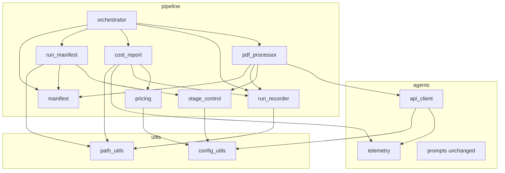
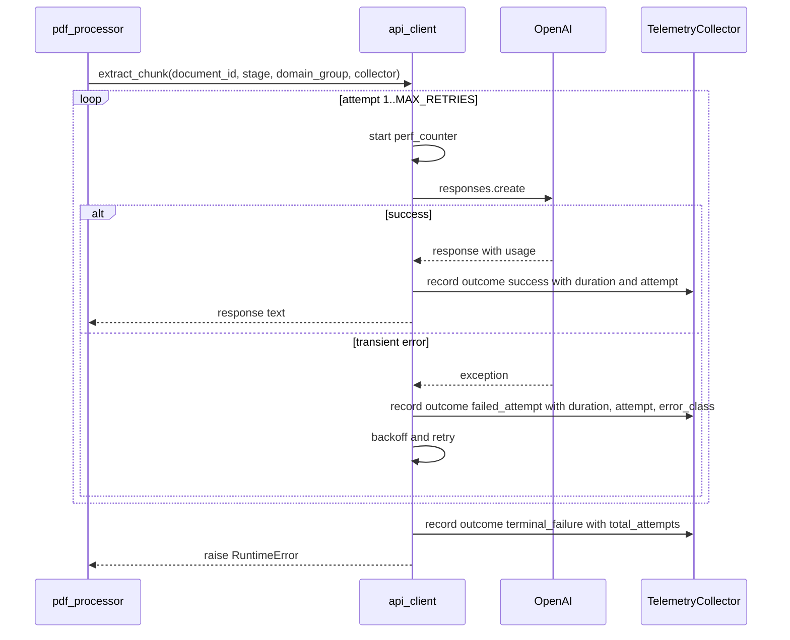
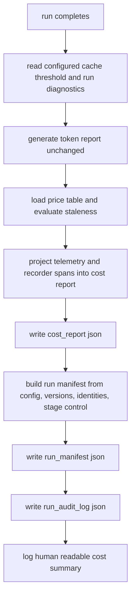
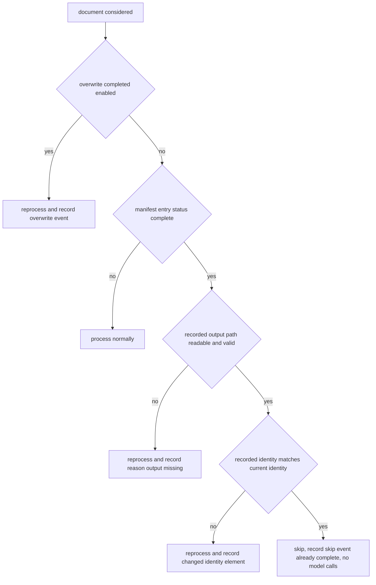

# Design Document: cost-and-run-reporting

## Overview

**Purpose**: This feature makes an EviTrace run answerable to two questions it cannot answer today — *what did this run cost* and *what exactly produced these outputs*. It extends the existing telemetry and report machinery with the facts that are missing (per-call duration, document identity, attempt number, failure classification), adds an operator-editable versioned price table, derives estimated cost as a projection over telemetry, and emits three run-scoped artifacts: a cost report, a reproducibility manifest, and an audit log of stage lifecycle events.

**Users**: Pipeline operators sizing a corpus run against a budget; researchers who must describe and reproduce a run in a methods section; downstream specs (`evaluation-harness`, `provenance-audit-export`, `reviewer-ui`) that consume rather than re-derive these artifacts.

**Impact**: `TelemetryRecord` gains optional fields; the API client times each attempt and records failures it currently discards; the orchestrator's existing end-of-run block gains three artifact writes; the manifest begins persisting the identity hashes it already computes; and per-document outputs gain a provenance envelope key. No prompt text, no prompt ordering, no token-budget threshold, and no extracted-field structure changes.

### Goals

- Every model call — successful, retried, or terminally failed — is attributable to a document, a stage, an attempt, a duration, and an estimated cost.
- Cost is derived from a versioned price table that operators edit as configuration, is always labelled an estimate, and degrades to "unavailable" rather than to a misleading zero.
- Every run emits a self-contained manifest sufficient to describe, compare, and attempt to reproduce it.
- A resumed run never destroys a completed output unless explicitly configured to.
- Nonessential model calls can be switched off, and the fact that they were off is recorded in the outputs they affected.

### Non-Goals

- Cost enforcement, budget aborts, or any change to the ceilings enforced by `src/pipeline/token_budget.py`.
- Reconciliation against a provider billing or usage API.
- Cost dashboards, charts, or any rendering surface.
- The full audit package, evidence-level lineage, or tamper-evidence.
- Ablation or experiment orchestration.
- Any change to `_shared_paper_prefix` content or ordering, or to the prompt-cache key derivation.

## Boundary Commitments

### This Spec Owns

- The **facts** recorded per model call: `document_id`, `duration_seconds`, `attempt`, `total_attempts`, `outcome`, `error_class`, `error_detail` on `TelemetryRecord`, and the recording of failed attempts that are currently discarded.
- The **Price_Table**: its schema, its loading and validation, its versioning and staleness semantics, and the arithmetic that turns token counts into a Cost_Estimate.
- The **Cost_Report** artifact and all of its content, including the cost-report content that `reviewer-ui` surfaces (multiagent R21.7).
- The **Run_Manifest** artifact — the **sole** implementation home for `xtrace-toolkit` R-X-2. `run_manifest.json` is the project's single reproducibility manifest: no other spec re-derives code revision, environment, dependency versions, resolved configuration, schema/prompt/model identity, stage state, per-document identity hashes, or the determinism declarations. In particular, `provenance-audit-export` does **not** build a second manifest; its audit package consumes `run_manifest.json` **by reference** (it records the artifact's path and content hash and contributes only its own per-artifact-file hash list). Method is settled here too: `git` metadata is obtained by `subprocess` under a bounded timeout as specified below, and no other spec's prohibition on subprocess applies to this artifact.
- The **Run_Audit_Log** artifact and the stage lifecycle vocabulary (`started`, `completed`, `skipped`, `rerun`, `failed`) plus the closed skip-reason vocabulary.
- The **stage registry**: which stages are required and which are optional, and the switches that disable optional stages.
- **Resume safety**: persisting per-document identity and output path into the manifest, and refusing to overwrite a valid completed output.
- The **run-provenance envelope key** on per-document extraction outputs.

### Out of Boundary

- Prompt construction, prompt ordering, and prompt-cache key derivation (`src/agents/openai/prompts.py`, `paper_cache_key`). This spec asserts their stability; it does not change them.
- Token budget checking and mitigation (`src/pipeline/token_budget.py`) — untouched.
- The `TokenReport` top-level and `per_stage` schema (`src/pipeline/token_report.py`) — extended only through additive `TelemetryRecord` keys.
- The extracted-field records themselves, `configs/extraction_map.json`, and the four-stage quality-control sequence.
- The provenance graph, per-claim lineage, chain validation, and tamper-evidence — `provenance-core` and `public-private-provenance`.
- The full audit package — `provenance-audit-export`. This spec **contributes artifacts into** that package (see the slot contribution below) but never assembles, orders, seals, or validates the package itself.
- Experiment design and ablation orchestration — `evaluation-harness`.
- Any UI rendering of these artifacts — `reviewer-ui`.

### Allowed Dependencies

- `src/agents/openai/*` may depend on its own siblings inside `src/agents/*` (for example `prompts`, `validator`, `telemetry`, and shared helpers), on `src/utils/*`, and on the standard library. It must **not** import `src/pipeline/*`, `src/quality_control/*`, `src/pdf_extractor/*`, or `src/privacy/*` — that prohibition is the load-bearing half of this rule, and it is what keeps the Price_Table unreachable from the API client. Sibling `agents.*` imports are explicitly permitted, because other specs (`evidence-routing`, `multiagent-extraction`) add agent-client modules under `src/agents/openai/` that import sibling agent modules alongside `utils.*` and stdlib.
- New modules live in `src/pipeline/` and may depend on `src/utils/*`, `src/agents/openai/telemetry` (dataclass types only), and each other in the declared layering below.
- Internal layering (imports flow left to right only):
  `utils.config_utils, utils.path_utils` → `pipeline.stage_control, pipeline.pricing` → `pipeline.run_recorder` → `pipeline.cost_report, pipeline.run_manifest` → `pipeline.orchestrator`
- No new third-party dependency. `git` metadata is read via `subprocess`; distribution versions via `importlib.metadata` **without importing the distribution**.

### Revalidation Triggers

- A new model-calling stage is introduced → it must register in `stage_control` as required or optional, or it will be reported but not controllable.
- `TelemetryRecord` field names change → `cost_report`, `token_report`, and any downstream consumer must re-check.
- The Cost_Report or Run_Manifest JSON shape changes → `provenance-audit-export` and `reviewer-ui` must re-check.
- **The Run_Manifest shape, its top-level key set, its `ManifestElement` envelope, or its filename changes → `provenance-audit-export` must re-validate.** It consumes `run_manifest.json` by reference as the reproducibility manifest of its audit package and builds no equivalent of its own, so any change here is a change to that package's contract.
- **The end-of-run write order changes, or `run_manifest.json` stops being written before audit-package collection runs → `provenance-audit-export` must re-validate.** Its `collect_reproducibility` references the manifest by path and sha256, so the manifest write must complete before that collection step; reordering the end-of-run block breaks that dependency silently.
- The name, filename, or JSON shape of the artifact contributed to the audit package's `cost_report` slot changes → `provenance-audit-export` must re-check its `SLOT_REGISTRY` entry and its completeness computation.
- The per-document output envelope gains or loses keys → final-output validation and `reviewer-ui` must re-check.
- Manifest entry shape changes → resume semantics and `risk-remediation` must re-check.

## Architecture

### Existing Architecture Analysis

The pipeline already has the three seams this feature needs:

1. **A run-scoped telemetry collector.** `TelemetryCollector` is instantiated once in `orchestrator.run_pipeline` (`orchestrator.py:111`) and threaded explicitly to `pdf_processor.process_pdf` → `_run_parallel_chunks` → `warm_pdf_cache` / `RepairRetryLoop` / `extract_chunk`. Every parameter defaults to `None`, so telemetry is opt-in and additive.
2. **An end-of-run block.** `orchestrator.py:157-204` already runs cache diagnostics, logs stage summaries, and writes `token_report.json`. Artifact writes attach here.
3. **Computed-but-unpersisted identity.** `manifest.compute_identity()` produces exactly the hashes a reproducibility manifest needs; `load_manifest_with_identity_check()` implements staleness comparison. Neither is wired to a caller.

Two defects in the current code fall inside this feature's boundary and are repaired as part of it: failed API attempts produce no record at all (both retry loops), and `cache_diagnostics.threshold` is configured but never read.

### Architecture Pattern & Boundary Map



**Architecture Integration**

- **Selected pattern**: *fact capture in `agents`, projection and reporting in `pipeline`*. The API client records only what it observes; nothing priced, named, or aggregated crosses back into `agents`. This is what keeps `tests/test_dependency_directions.py` green and what makes an old run re-priceable.
- **Domain boundaries**: measurement (`telemetry`, `run_recorder`), valuation (`pricing`), reporting (`cost_report`, `run_manifest`), control (`stage_control`), persistence of resume state (`manifest`).
- **Existing patterns preserved**: config loaded once and passed explicitly, never mutated as a global; atomic tmp-file + `os.replace` artifact writes; artifact paths declared in `path_utils`; heavy optional deps never imported at module level.
- **New components rationale**: five small modules, each with one responsibility, rather than one `reporting.py` that would co-own valuation, timing, and control.

### Technology Stack

| Layer | Choice / Version | Role in Feature | Notes |
|-------|------------------|-----------------|-------|
| Runtime | Python 3.12.x | Host | Existing pin; no change |
| Config | PyYAML via `utils.config_utils` | Price table, stage switches, resume settings | Three new top-level keys registered in `_ALL_KNOWN_TOP_LEVEL_KEYS` |
| Timing | `time.perf_counter`, `datetime.timezone.utc` | Per-attempt duration, event timestamps | Stdlib only |
| Versions | `importlib.metadata` | Distribution versions without importing the package | Required so `paddleocr`/`torch`/`faiss` stay unimported |
| Code revision | `subprocess` → `git rev-parse` / `git status --porcelain` | Commit id and dirty flag | Bounded timeout; degrades to `unavailable` |
| Currency arithmetic | `decimal.Decimal` | Cost estimation | Avoids float drift in the Requirement 4.8 sum invariant; serialized as a string-free rounded float at a documented precision |

## File Structure Plan

### Directory Structure

```
src/
├── agents/openai/
│   ├── telemetry.py            # MODIFIED: new TelemetryRecord fields + reliability aggregation
│   └── api_client.py           # MODIFIED: per-attempt timing, document_id, failure recording
└── pipeline/
    ├── stage_control.py        # NEW: stage registry + enable/disable resolution
    ├── pricing.py              # NEW: PriceTable load/validate/staleness + per-record cost math
    ├── run_recorder.py         # NEW: RunRecorder, RunAuditEvent, stage spans, audit-log write
    ├── cost_report.py          # NEW: CostReport aggregation + artifact write
    ├── run_manifest.py         # NEW: RunProvenance (shared version source), RunManifest
    │                           #      build, canonical form, artifact write
    ├── orchestrator.py         # MODIFIED: recorder wiring, resume gate, end-of-run artifacts
    ├── pdf_processor.py        # MODIFIED: document_id/domain_group forwarding, stage gating,
    │                           #           per-output provenance, manifest identity persist
    └── manifest.py             # MODIFIED: persist identity + output_path in entries
```

### Modified Files

- `src/agents/openai/telemetry.py` — add optional fields to `TelemetryRecord`; add `ReliabilitySummary` and `TelemetryCollector.reliability_summary()`; make `check_cache_diagnostics` accept the configured threshold from its caller (already parameterised — the fix is at the call site).
- `src/agents/openai/api_client.py` — time every attempt; forward `pdf_name` as `document_id`; record failed attempts and terminal failures from both retry loops via one shared helper.
- `src/pipeline/orchestrator.py` — construct `RunRecorder`; wrap `build_qc_bundle` and `process_pdf` in stage spans; apply the resume gate; read the configured cache threshold; write `cost_report.json`, `run_manifest.json`, `run_audit_log.json` in the existing end-of-run block; and, when an audit-package builder is present for a document, contribute the cost report into that package's `cost_report` slot (see below).

**Audit-package slot contribution (`cost_report`)**

`provenance-audit-export` declares a `cost_report` slot in its `SLOT_REGISTRY` whose real owner is this spec. Without a contribution from the owner that slot finalizes as `absent`, which forces every audit package to `complete=False`. This spec therefore makes exactly one contribution and no more:

```python
builder.put("cost_report", cost_report_dict, supplied_by="cost-and-run-reporting")
```

- Made after `cost_report.json` is built in the end-of-run block, once per audit-package builder handed to the orchestrator. The content is the same mapping serialized to `cost_report.json`; the run-scoped artifact is contributed unchanged into each per-document package.
- The builder is received as an optional argument. When none is supplied — the shipped default, since `provenance-audit-export` is not yet implemented — nothing is contributed and no behavior changes.
- When the cost report is unavailable (`status == "telemetry_unavailable"`) or its build failed, the orchestrator calls `builder.mark_absent("cost_report", reason=...)` instead, so the slot is still accounted for with a stated reason rather than silently absent.
- The contribution is guarded like every other reporting call: a failure logs an ERROR and never aborts the run or the remaining artifact writes.
- **Still out of boundary**: constructing the builder's registry, assembling, ordering, sealing, hashing, or validating the package; declaring or renaming slots; computing `inventory.complete`. This spec contributes the artifact; `provenance-audit-export` assembles the package.
- `src/pipeline/pdf_processor.py` — pass `document_id` and `domain_group` into `extract_chunk`/`warm_pdf_cache`; consult `StageControl` before warmup and repair; attach the `run_provenance` envelope key to per-document output; persist `ManifestIdentity` and the resolved output path on completion.
- `src/pipeline/manifest.py` — write the `identity` block and `output_path` into completed entries; expose a resume decision helper built on the existing `is_stale` / `_is_output_valid`.
- `src/utils/config_utils.py` — register `pricing`, `stages`, `run_reporting` in `_ALL_KNOWN_TOP_LEVEL_KEYS`; add `load_reporting_config()` with env > yaml > default resolution.
- `src/utils/path_utils.py` — add `COST_REPORT_FILE`, `RUN_MANIFEST_FILE`, `RUN_AUDIT_LOG_FILE`, all run-scoped.
- `configs/config.yaml` — add the `pricing`, `stages`, and `run_reporting` sections.

## System Flows

### Per-call fact capture and failure accounting



The recording helper never raises and never blocks extraction (1.6). A failed attempt that reports usage contributes its tokens to run totals (2.2); one that does not is recorded with zero counts (2.3).

### End-of-run artifact generation



Each write is independent: a failure in one is logged and does not prevent the others or invalidate already-written extraction outputs (5.5, 8.6).

### Resume decision



## Requirements Traceability

| Requirement | Summary | Components | Interfaces | Flows |
|-------------|---------|------------|------------|-------|
| 1.1, 1.2, 1.3 | Duration, document id, attempt, domain group on each record | `TelemetryRecord`, `api_client`, `pdf_processor` | `_record_telemetry`, `extract_chunk`, `warm_pdf_cache` | Per-call fact capture |
| 1.4 | Existing telemetry preserved | `TelemetryRecord`, `TokenReport` | additive optional fields | — |
| 1.5, 1.6 | Degrade, warn, never fail extraction | `api_client` | `_record_telemetry` guard | Per-call fact capture |
| 2.1, 2.2, 2.3, 2.4 | Failed and terminal attempts recorded with impact | `api_client`, `TelemetryRecord.outcome` | `_record_attempt_failure` | Per-call fact capture |
| 2.5 | Failure and retry counts per stage and run | `ReliabilitySummary`, `CostReport` | `TelemetryCollector.reliability_summary` | End-of-run |
| 2.6 | No failure observable only transiently | `CostReport`, `RunAuditLog` | artifact writes | End-of-run |
| 3.1, 3.2, 3.3 | Price table content, versioning, override order | `pricing`, `config_utils` | `load_price_table`, `load_reporting_config` | End-of-run |
| 3.4, 3.5, 3.6 | Unpriced models, absent table, invalid entries | `pricing` | `PriceTable.unit_prices`, validation | End-of-run |
| 3.7, 3.8 | Staleness horizon; version stamped on artifacts | `pricing`, `CostReport` | `PriceTable.is_stale`, `PriceTableStamp` | End-of-run |
| 4.1, 4.2, 4.3, 4.4 | Per-call, per-document, per-stage, per-run estimates and shares | `cost_report`, `pricing` | `estimate_record_cost`, `build_cost_report` | End-of-run |
| 4.5, 4.6 | Elapsed per stage including zero-cost stages | `run_recorder`, `cost_report` | `RunRecorder.stage_durations` | End-of-run |
| 4.7 | Estimate labelling | `CostReport.cost_basis` | artifact field | End-of-run |
| 4.8 | Sum invariants | `cost_report` | `build_cost_report` | End-of-run |
| 4.9 | Unknown stages reported without config | `cost_report` | stage grouping with no allowlist | End-of-run |
| 5.1, 5.2 | Cost report written with required content | `cost_report`, `path_utils` | `generate_cost_report` | End-of-run |
| 5.3 | Human-readable log summary | `cost_report` | `log_cost_summary` | End-of-run |
| 5.4, 5.5, 5.6 | Unavailable status, write failure isolation, atomic write | `cost_report` | `_atomic_write_json` reuse | End-of-run |
| 5.7 | Token report untouched | `token_report` | unchanged schema | — |
| 6.1 | Prefix stability preserved (prefix source/output unchanged and default-path payload byte-identical; the file itself may gain additive optional parameters) | `prompts` (prefix guarded) | prefix-stability guard test | — |
| 6.2, 6.3 | Cache key prefix, retention, per-stage cache cost split | `cost_report` | `CostReport.cache` | End-of-run |
| 6.4 | Cache-stability violations recorded in the report | `telemetry`, `cost_report` | `check_prefix_drift` result capture | End-of-run |
| 6.5, 6.6 | Configured cache threshold honoured with validated fallback | `orchestrator`, `config_utils` | `check_cache_diagnostics(threshold)` | End-of-run |
| 7.1, 7.2 | Independent stage switches, defaults preserve behavior | `stage_control`, `pdf_processor` | `StageControl.is_enabled` | — |
| 7.3, 7.4 | Skip event and disabled marker in report | `run_recorder`, `cost_report` | `record_skip` | End-of-run |
| 7.5 | Refuse disabling a required stage | `stage_control` | `REQUIRED_STAGES` guard | — |
| 7.6 | Stage state in manifest | `run_manifest` | `RunManifest.stages` | End-of-run |
| 7.7 | Disabled stages marked on outputs | `pdf_processor` | `run_provenance.disabled_stages` | — |
| 8.1, 8.2 | Manifest start and full content | `run_manifest` | `build_run_manifest` | End-of-run |
| 8.3 | Reuse existing identity hashes | `manifest`, `run_manifest` | `compute_identity` | Resume decision |
| 8.4 | No secrets | `run_manifest` | redaction of credential values | End-of-run |
| 8.5, 8.6, 8.7 | Degradable elements, write isolation, self-contained | `run_manifest` | `ManifestElement` | End-of-run |
| 8.8 | Run-scoped only | `run_manifest` | boundary constraint | — |
| 9.1, 9.2, 9.3, 9.4, 9.5 | Per-output version provenance | `pdf_processor`, `run_manifest` | `run_provenance` envelope key | — |
| 10.1, 10.2, 10.3 | No overwrite, skip event, explicit overwrite | `manifest`, `orchestrator`, `run_recorder` | `resume_decision` | Resume decision |
| 10.4, 10.5 | Stale or missing output reprocessed with reason | `manifest` | `is_stale`, `_is_output_valid` | Resume decision |
| 10.6, 10.7 | No skipped-and-charged document; reports always fresh | `cost_report`, `orchestrator` | invariant assertion | Resume decision |
| 11.1, 11.2, 11.3 | Lifecycle events, closed skip vocabulary, rerun events | `run_recorder` | `stage_span`, `record_skip`, `record_rerun` | All flows |
| 11.4, 11.5 | Audit log written, append-only within a run | `run_recorder` | `write_audit_log` | End-of-run |
| 11.6 | No content or secrets in events | `run_recorder` | `RunAuditEvent` field set | — |
| 11.7 | Append failure is non-fatal | `run_recorder` | guarded append | — |
| 12.1, 12.2, 12.4, 12.6 | Seeds, pinned versions, determinism declarations | `run_manifest` | `RunManifest.determinism` | End-of-run |
| 12.3 | Canonical manifest equality across comparable runs | `run_manifest` | `canonical_manifest` | End-of-run |
| 12.5 | Stable ordering in all three artifacts | `cost_report`, `run_manifest`, `run_recorder` | documented sort keys | End-of-run |

## Components and Interfaces

| Component | Layer | Intent | Req Coverage | Key Dependencies | Contracts |
|-----------|-------|--------|--------------|------------------|-----------|
| `TelemetryRecord` (extended) | agents | Per-call fact row | 1.1–1.6, 2.1–2.4 | none (P0) | State |
| `ReliabilitySummary` | agents | Failure/retry aggregation | 2.5 | `TelemetryCollector` (P0) | Service |
| `api_client` (modified) | agents | Time attempts, record outcomes | 1.1–1.6, 2.1–2.4 | `telemetry` (P0) | Service |
| `stage_control` | pipeline | Stage registry and switches | 7.1–7.6 | `config_utils` (P0) | Service |
| `pricing` | pipeline | Price table and cost math | 3.1–3.8, 4.1 | `config_utils` (P0) | Service |
| `run_recorder` | pipeline | Stage spans, audit events, timings | 4.5, 7.3, 10.2–10.5, 11.1–11.7 | `path_utils` (P0) | Service, Batch, State |
| `cost_report` | pipeline | Cost projection and artifact | 2.5, 2.6, 4.1–4.9, 5.1–5.7, 6.2–6.4 | `pricing` (P0), `run_recorder` (P0), `telemetry` (P0) | Batch |
| `run_manifest` | pipeline | Reproducibility artifact | 7.6, 8.1–8.8, 9.5, 12.1–12.6 | `manifest` (P0), `stage_control` (P1) | Batch |
| `manifest` (modified) | pipeline | Persist identity, resume decision | 8.3, 10.1–10.5 | existing (P0) | State |
| `pdf_processor` (modified) | pipeline | Forward ids, gate stages, stamp outputs | 1.3, 7.2, 7.7, 9.1–9.4 | `stage_control` (P0), `run_recorder` (P1) | Service |
| `orchestrator` (modified) | pipeline | Wire recorder, gate resume, write artifacts | 5.1–5.5, 6.5, 8.1, 10.1–10.3, 11.4 | all above (P0) | Service |

### agents

#### TelemetryRecord (extended) and ReliabilitySummary

| Field | Detail |
|-------|--------|
| Intent | Carry the per-call facts cost reporting needs, without carrying prices |
| Requirements | 1.1, 1.2, 1.3, 1.4, 1.5, 2.1, 2.2, 2.3, 2.4, 2.5 |

**Responsibilities & Constraints**

- Every new field is optional with a default, so existing construction sites and `token_report.json` consumers are unaffected (1.4).
- The record carries no currency, no price, and no price-table reference. Valuation is not this layer's concern.
- `document_id` uses the sentinel `"__run__"` for calls not issued on behalf of a single document (1.2).

**Dependencies**: Inbound: `api_client` (P0). Outbound: none. External: none.

**Contracts**: Service [x] / State [x]

##### State Management

```python
DocumentId = str            # "__run__" for run-level calls
Outcome = Literal["success", "failed_attempt", "terminal_failure"]
UNKNOWN_DOCUMENT_ID: Final[str] = "__unknown__"
RUN_LEVEL_DOCUMENT_ID: Final[str] = "__run__"

@dataclass
class TelemetryRecord:
    # --- existing fields, unchanged and in their current order ---
    stage: str
    model: str
    timestamp: str
    input_tokens: int
    output_tokens: int
    cached_input_tokens: int
    uncached_input_tokens: int
    total_tokens: int
    prompt_fingerprint: PromptFingerprint
    field_index_start: int | None = None
    field_index_end: int | None = None
    domain_group: str | None = None
    repair_attempt: int | None = None
    error_type: str | None = None          # existing: "parse" | "schema" (validation repair trigger)
    # --- new fields, all optional ---
    document_id: str = RUN_LEVEL_DOCUMENT_ID
    duration_seconds: float | None = None
    attempt: int | None = None             # 1-based attempt that produced this record
    total_attempts: int | None = None      # set on terminal_failure only
    outcome: Outcome = "success"
    error_class: str | None = None         # API exception class name
    error_detail: str | None = None        # truncated message, max 500 chars, no secrets
```

- Invariant: `uncached_input_tokens == max(input_tokens - cached_input_tokens, 0)` (unchanged).
- Invariant: `outcome == "terminal_failure"` implies `total_attempts is not None`.
- Invariant: `outcome != "success"` implies `error_class is not None`.

```python
@dataclass
class ReliabilitySummary:
    stage: str | None                      # None = whole run
    failed_attempts: int
    calls_succeeded_after_retry: int
    calls_terminally_failed: int

@dataclass(frozen=True)
class PrefixDriftViolation:
    stage: str
    prompt_version: str
    fingerprints: tuple[str, ...]

class TelemetryCollector:
    def reliability_summary(self) -> list[ReliabilitySummary]: ...
    def prefix_drift_violations(self) -> list[PrefixDriftViolation]: ...
```

`prefix_drift_violations()` returns the same condition `check_prefix_drift()` already logs, as data the cost report can embed (6.4). `check_prefix_drift()` keeps its current logging behavior unchanged.

- Postcondition: the list contains one entry per observed stage plus one run-level entry with `stage is None`; run-level counts equal the sum of per-stage counts (2.5).
- `calls_succeeded_after_retry` counts records with `outcome == "success" and attempt is not None and attempt > 1`.

**Implementation Notes**

- Integration: `stage_summaries()`, `top_n_expensive()`, `check_cache_diagnostics()`, and `check_prefix_drift()` keep their current behavior. `stage_summaries()` continues to aggregate **all** records including failed attempts, because a failed attempt that consumed tokens is real consumption.
- Validation: the closed `Outcome` vocabulary is asserted at construction of failure records in `api_client`.
- Risks: `top_n_expensive()` may now surface a failure record; this is correct and is documented in the report's per-call section.

#### api_client (modified)

| Field | Detail |
|-------|--------|
| Intent | Measure each attempt and record its outcome, including the failures currently discarded |
| Requirements | 1.1, 1.2, 1.3, 1.5, 1.6, 2.1, 2.2, 2.3, 2.4 |

**Responsibilities & Constraints**

- Wrap each `await _client.responses.create(...)` in a `time.perf_counter()` pair. There are exactly two such sites — inside `_call_api_with_retries` and inside `extract_chunk`'s inline retry loop. Both are instrumented; the duplicated loop is **not** refactored away.
- Forward the existing `pdf_name` argument as `document_id`; substitute `RUN_LEVEL_DOCUMENT_ID` when it is absent or `"unknown"`.
- The client must not import anything from `src/pipeline/`, `src/quality_control/`, `src/pdf_extractor/`, or `src/privacy/`. Sibling imports within `src/agents/*`, `src/utils/*`, and the standard library are permitted (see Allowed Dependencies).

**Dependencies**: Inbound: `pdf_processor` (P0). Outbound: `telemetry` (P0). External: `openai` AsyncOpenAI (P0).

**Contracts**: Service [x]

##### Service Interface

```python
def _record_telemetry(
    *,
    collector: TelemetryCollector | None,
    response: Any,
    stage: str,
    model: str,
    source_package: str,
    document_id: str,
    duration_seconds: float | None,
    attempt: int | None,
    field_index_start: int | None = None,
    field_index_end: int | None = None,
    domain_group: str | None = None,
    repair_attempt: int | None = None,
    error_type: str | None = None,
) -> None: ...

def _record_attempt_failure(
    *,
    collector: TelemetryCollector | None,
    exc: BaseException,
    stage: str,
    model: str,
    source_package: str,
    document_id: str,
    duration_seconds: float | None,
    attempt: int,
    terminal: bool,
    total_attempts: int | None = None,
) -> None: ...
```

- Preconditions: none; both no-op when `collector is None`.
- Postconditions: exactly one `TelemetryRecord` is appended per attempt outcome. A call that succeeds on attempt 3 yields three records: two `failed_attempt`, one `success`.
- Invariants: neither function raises. Both are wrapped in `try/except Exception` logging a warning (1.5, 1.6).
- Error envelope: `error_class` is `type(exc).__name__`; `error_detail` is `str(exc)` truncated to 500 characters with any `sk-` prefixed token elided.

**Implementation Notes**

- Integration: `extract_chunk` and `warm_pdf_cache` gain a `document_id: str = RUN_LEVEL_DOCUMENT_ID` keyword argument. All other signatures are unchanged and every new argument has a default, preserving existing call sites and tests.
- Validation: token extraction from a failed attempt's exception uses the same `_get_attr_or_key` accessor; when absent, counts are zero (2.3).
- Risks: `_call_api_with_retries` currently sleeps after the final failed attempt before raising; the terminal-failure record is emitted before that sleep so the duration reflects the API call, not the backoff.

### pipeline — control and valuation

#### stage_control

| Field | Detail |
|-------|--------|
| Intent | Declare which stages exist, which are optional, and resolve the operator's switches |
| Requirements | 7.1, 7.2, 7.3, 7.5, 7.6 |

**Responsibilities & Constraints**

- Sole authority on stage optionality. No other module may decide whether a stage can be disabled.
- `cache_warmup` does not compete with the existing `openai.prompt_cache.enable_prewarm` setting: the registry reads that setting as the stage's effective state, and `stages.cache_warmup.enabled`, when set, is combined with it by logical AND.

**Dependencies**: Inbound: `pdf_processor`, `run_manifest`, `cost_report` (P0). Outbound: `config_utils` (P0).

**Contracts**: Service [x]

##### Service Interface

```python
REQUIRED_STAGES: Final[frozenset[str]] = frozenset({"extraction_chunk", "synthesis"})
OPTIONAL_STAGES: Final[frozenset[str]] = frozenset({"cache_warmup", "validation_repair"})
KNOWN_STAGE_ORDER: Final[tuple[str, ...]] = (
    "document_extraction", "quality_control", "evidence_index",
    "cache_warmup", "extraction_chunk", "validation_repair", "synthesis",
)

@dataclass(frozen=True)
class StageControl:
    disabled: frozenset[str]
    def is_enabled(self, stage: str) -> bool: ...
    def disabled_stages(self) -> list[str]: ...   # sorted

def load_stage_control(config: dict) -> StageControl: ...
```

- Precondition: `config` is the already-loaded configuration dict; the function performs no file I/O.
- Postcondition: a request to disable a stage in `REQUIRED_STAGES` is dropped from `disabled`, logged at ERROR naming the stage, and the run continues with that stage enabled (7.5).
- Postcondition: an unknown stage name in the switch configuration is accepted and recorded, so future stages need no change here.
- Invariant: with no `stages` configuration present, `disabled` is empty except for `cache_warmup` when `enable_prewarm` is false — reproducing current behavior exactly (7.1).

#### pricing

| Field | Detail |
|-------|--------|
| Intent | Own the Price_Table and the token-to-currency arithmetic |
| Requirements | 3.1, 3.2, 3.3, 3.4, 3.5, 3.6, 3.7, 3.8, 4.1 |

**Dependencies**: Inbound: `cost_report` (P0). Outbound: `config_utils` (P0).

**Contracts**: Service [x]

##### Service Interface

```python
DEFAULT_STALENESS_HORIZON_DAYS: Final[int] = 180
PRICE_UNIT: Final[str] = "per_1m_tokens"

@dataclass(frozen=True)
class ModelPrice:
    model: str
    input_uncached: Decimal
    input_cached: Decimal
    output: Decimal

@dataclass(frozen=True)
class PriceTableStamp:
    version: str | None
    currency: str | None
    effective_date: str | None          # ISO 8601 date
    unit: str                           # PRICE_UNIT
    stale: bool
    staleness_horizon_days: int
    available: bool                     # False when the table is absent/empty/unreadable

@dataclass(frozen=True)
class PriceTable:
    stamp: PriceTableStamp
    prices: Mapping[str, ModelPrice]
    invalid_models: tuple[str, ...]
    def price_for(self, model: str) -> ModelPrice | None: ...

@dataclass(frozen=True)
class CallCost:
    available: bool                     # False when model unpriced or table unavailable
    currency: str | None
    amount: Decimal                     # Decimal("0") when unavailable
    cached_input_amount: Decimal
    uncached_input_amount: Decimal
    output_amount: Decimal

def load_price_table(config: dict, *, now: date | None = None) -> PriceTable: ...
def estimate_record_cost(record: TelemetryRecord, table: PriceTable) -> CallCost: ...
```

- Precondition: `estimate_record_cost` requires a record whose token counts are non-negative integers.
- Postcondition: `amount == cached_input_amount + uncached_input_amount + output_amount`, each computed as `tokens / 1_000_000 * unit_price` in `Decimal` and rounded to 6 decimal places at the call level only; aggregates sum rounded call amounts so Requirement 4.8's invariant holds exactly.
- Postcondition: an unpriced model yields `CallCost(available=False, amount=Decimal("0"))` and is added to the report's `unpriced_models` list (3.4).
- Postcondition: an absent, empty, or unreadable table yields `stamp.available is False`; every `CallCost` is unavailable (3.5).
- Postcondition: a missing, non-numeric, or negative unit price removes that model from `prices`, adds it to `invalid_models`, and logs a warning naming the model and field (3.6).
- Postcondition: `stamp.stale is True` when `effective_date` is older than `now - staleness_horizon_days` (3.7).
- Error envelope: no exception escapes `load_price_table`; all defects degrade to warnings.

**Implementation Notes**

- Validation: `effective_date` must parse as an ISO 8601 date; otherwise it is treated as unavailable and the table is marked stale (a table whose age cannot be established is not assumed current).
- Risks: `Decimal` values are serialized to JSON as floats rounded to 6 places; the sum invariant is asserted against the rounded call amounts, not the unrounded ones.

### pipeline — measurement and reporting

#### run_recorder

| Field | Detail |
|-------|--------|
| Intent | One run-scoped object that owns stage timing, the audit log, and skip/rerun reasons |
| Requirements | 4.5, 4.6, 7.3, 10.2, 10.3, 10.4, 10.5, 11.1, 11.2, 11.3, 11.4, 11.5, 11.6, 11.7 |

**Responsibilities & Constraints**

- Single source of truth for "what happened to a stage". The cost report reads durations from here rather than keeping its own timers.
- Thread-safe: appends occur from PDF-level worker tasks under a lock, mirroring `TelemetryCollector`.
- Events carry identifiers, stage names, outcomes, reasons, and counts only — never document text, extracted values, or secrets (11.6).

**Dependencies**: Inbound: `orchestrator`, `pdf_processor`, `cost_report`, `run_manifest` (P0). Outbound: `path_utils` (P0).

**Contracts**: Service [x] / Batch [x] / State [x]

##### Service Interface

```python
EventKind = Literal["stage_started", "stage_completed", "stage_skipped",
                    "stage_rerun", "stage_failed"]
SkipReason = Literal["disabled_by_configuration", "already_complete",
                     "not_applicable", "prerequisite_unavailable"]

@dataclass(frozen=True)
class RunAuditEvent:
    sequence: int
    timestamp: str                      # ISO 8601 UTC
    kind: EventKind
    stage: str
    document_id: str | None
    reason: str | None                  # SkipReason value, or a rerun/failure reason
    attempt: int | None
    detail: Mapping[str, str | int | bool] | None

@dataclass(frozen=True)
class StageDuration:
    stage: str
    document_id: str | None
    elapsed_seconds: float

class RunRecorder:
    def __init__(self, run_id: str, started_at: str) -> None: ...
    @contextmanager
    def stage_span(self, stage: str, document_id: str | None = None) -> Iterator[None]: ...
    def record_skip(self, stage: str, document_id: str | None, reason: SkipReason,
                    detail: Mapping[str, str | int | bool] | None = None) -> None: ...
    def record_rerun(self, stage: str, document_id: str | None, reason: str,
                     attempt: int | None = None) -> None: ...
    def record_failure(self, stage: str, document_id: str | None, reason: str) -> None: ...
    def events(self) -> list[RunAuditEvent]: ...
    def stage_durations(self) -> list[StageDuration]: ...
    def total_elapsed_seconds(self) -> float: ...
    def write_audit_log(self, output_dir: Path) -> Path | None: ...
```

- Precondition: `stage_span` requires a non-empty stage name.
- Postcondition: `stage_span` emits `stage_started` on entry and `stage_completed` on normal exit; on exception it emits `stage_failed` with the exception class name as the reason and re-raises (11.1).
- Postcondition: `sequence` is strictly increasing within a run and events are never rewritten or removed (11.5).
- Postcondition: `stage_durations()` aggregates started/completed pairs per `(stage, document_id)`; an unmatched start contributes no duration and is reported as an incomplete span.
- Postcondition: an append that raises is caught, logged at WARNING, and the run continues (11.7).
- Postcondition: `write_audit_log` returns `None` and logs an error on write failure rather than raising.

##### Batch / Job Contract

- Trigger: end of `run_pipeline`.
- Output: `run_audit_log.json` in the run output directory, containing `{run_id, started_at, ended_at, events: [...]}` with events ordered by `sequence` (11.4, 12.5).
- Idempotency: written once per run via tmp-file + `os.replace`.

#### cost_report

| Field | Detail |
|-------|--------|
| Intent | Project telemetry and stage spans into the run's cost artifact |
| Requirements | 2.5, 2.6, 3.8, 4.1–4.9, 5.1–5.7, 6.2, 6.3, 6.4, 7.4, 10.6 |

**Dependencies**: Inbound: `orchestrator` (P0). Outbound: `pricing` (P0), `run_recorder` (P0), `agents.openai.telemetry` types (P0), `path_utils` (P0), `stage_control` (P1).

**Contracts**: Batch [x]

##### Service Interface

```python
COST_REPORT_FILENAME: Final[str] = "cost_report.json"
COST_BASIS: Final[str] = "estimate"

def build_cost_report(
    *,
    collector: TelemetryCollector,
    recorder: RunRecorder,
    price_table: PriceTable,
    stage_control: StageControl,
    cache_settings: Mapping[str, str | float | None],
    prefix_drift_violations: Sequence[PrefixDriftViolation],
    document_count: int,
) -> CostReport: ...

def generate_cost_report(report: CostReport, output_dir: Path) -> Path | None: ...
def log_cost_summary(report: CostReport) -> None: ...
```

- Precondition: `collector` and `recorder` belong to the same run.
- Precondition: `cost_report` performs no configuration or file reads of its own. The orchestrator supplies `price_table`, `stage_control`, `cache_settings` (key prefix, retention, threshold), and `prefix_drift_violations`; this keeps valuation and reporting free of configuration ownership.
- Postcondition: `sum(per_stage[i].estimated_cost) == totals.estimated_cost` and `sum(per_document[i].estimated_cost) == totals.estimated_cost` for the reported currency (4.8).
- Postcondition: every stage present in `KNOWN_STAGE_ORDER`, in telemetry, or in recorder events appears exactly once in `per_stage`, including zero-cost and disabled stages (4.6, 4.9, 7.4).
- Invariant (**open stage vocabulary**, 4.9): the stage label is an open string. Downstream specs (for example `evidence-routing` and `multiagent-extraction`) contribute new stage labels simply by emitting them in telemetry or recorder events — there is no registration step — and no allowlist, enum, `Literal`, or other closed set of stage names may be introduced anywhere in this feature's reporting path. `KNOWN_STAGE_ORDER` is a **display-ordering hint only**: names absent from it sort alphabetically after the known ones and are never filtered, rejected, or bucketed into an "other" row.
- Postcondition: `status == "telemetry_unavailable"` with null totals when the collector holds no records (5.4).
- Postcondition: a document that appears with a `stage_skipped` / `already_complete` event has no per-call cost lines in the same run (10.6).
- Postcondition: `generate_cost_report` returns `None` and logs an error on write failure; it never raises (5.5).
- Invariant: all lists are ordered — `per_stage` by `KNOWN_STAGE_ORDER` then alphabetically for unknown stages; `per_document` by document id; `per_call` by `(document_id, stage, timestamp, attempt)` (12.5).

##### Batch / Job Contract

- Trigger: end of `run_pipeline`, after the token report.
- Output: `cost_report.json` (see Data Models).
- Recovery: independent of the manifest and audit-log writes; a failure in any one does not prevent the others.

#### run_manifest

| Field | Detail |
|-------|--------|
| Intent | Emit the self-contained record of what produced the run's outputs |
| Requirements | 7.6, 8.1–8.8, 9.5, 12.1, 12.2, 12.3, 12.4, 12.5, 12.6 |

**Dependencies**: Inbound: `orchestrator` (P0). Outbound: `manifest.compute_identity` (P0), `stage_control` (P1), `path_utils` (P0). External: `git` binary (P2, degradable), `importlib.metadata` (P1).

**Contracts**: Batch [x]

##### Service Interface

```python
RUN_MANIFEST_FILENAME: Final[str] = "run_manifest.json"

@dataclass(frozen=True)
class ManifestElement:
    value: Any
    status: Literal["available", "unavailable"]
    reason: str | None = None

@dataclass(frozen=True)
class RunProvenance:
    """Single source of the version values shared by the manifest and every
    per-document output. Built once at run start; never recomputed."""
    run_id: str
    schema_version: str
    extraction_map_hash: str
    models: Mapping[str, str]              # stage -> resolved model name
    prompt_versions: Mapping[str, str]     # prompt name -> version identifier
    prompt_hashes: Mapping[str, str]       # prompt name -> content hash
    disabled_stages: tuple[str, ...]
    cost_basis: str                        # COST_BASIS
    def to_output_envelope(self) -> dict[str, Any]: ...

def build_run_provenance(
    *, run_id: str, resolved_config: Mapping[str, Any], stage_control: StageControl
) -> RunProvenance: ...

def build_run_manifest(
    *,
    provenance: RunProvenance,
    started_at: str,
    ended_at: str,
    resolved_config: Mapping[str, Any],
    document_identities: Mapping[str, ManifestIdentity],
) -> RunManifest: ...

def canonical_manifest(manifest: Mapping[str, Any]) -> dict[str, Any]: ...
def write_run_manifest(manifest: RunManifest, output_dir: Path) -> Path | None: ...
```

- Precondition: `resolved_config` is the configuration after environment and CLI overrides.
- Postcondition: every credential-bearing key in `resolved_config` is replaced by `{"present": true|false}`; no secret value appears anywhere in the artifact (8.4).
- Postcondition: any element that cannot be determined is emitted as `ManifestElement(value=None, status="unavailable", reason=...)`; the artifact is still written (8.5).
- Postcondition: `canonical_manifest` removes `run_id`, all timestamps, all durations, and every element whose `status == "unavailable"`, so two comparable runs produce equal canonical dicts (12.3).
- Postcondition: `write_run_manifest` returns `None` and logs an error on failure; it never raises (8.6).
- Invariant: the artifact contains no per-claim or per-evidence lineage (8.8).
- Invariant: `RunProvenance` is the **single** source of schema version, extraction-map hash, per-stage model names, prompt versions, and disabled stages. `pdf_processor` stamps outputs from `to_output_envelope()` and `build_run_manifest` reads the same object, so Requirement 9.5's equality holds by construction rather than by two agreeing computations — the same rule Requirement 8.3 applies to identity hashes.

**Implementation Notes**

- Integration: parser/tool versions are read with `importlib.metadata.version(<dist>)` for `pymupdf`, `pdfplumber`, `paddleocr`, `sentence-transformers`, `faiss-cpu`, `torch`, `openai`, `pyyaml` — **never by importing the package**, so the lazy-import rule holds. GROBID is recorded as a service endpoint with its configured URL and, when the run captured it, its reported version; otherwise `unavailable`.
- Integration: `document_identities` comes straight from `compute_identity()`; no second identity computation exists (8.3).
- Validation: prompt content hashes are computed as SHA-256 over `get_system_prompt()` and over the prompt-builder module source, both truncated to 16 hex characters, matching the existing fingerprint convention.
- Risks: `git` may be absent; the subprocess call uses a 5-second timeout and degrades.

### pipeline — modified existing components

#### manifest (modified)

| Field | Detail |
|-------|--------|
| Intent | Persist the identity it already computes and answer the resume question |
| Requirements | 8.3, 10.1, 10.2, 10.3, 10.4, 10.5 |

##### Service Interface

```python
@dataclass(frozen=True)
class ResumeDecision:
    action: Literal["skip", "process", "reprocess"]
    reason: str                          # "already_complete" | "output_missing" |
                                         # "identity_changed:<field>" | "overwrite_configured" | "not_complete"

def resume_decision(
    entry: Mapping[str, Any] | None,
    current_identity: ManifestIdentity,
    *,
    overwrite_completed: bool,
) -> ResumeDecision: ...
```

- Precondition: `current_identity` is produced by `compute_identity()` for the document under consideration.
- Postcondition: `action == "skip"` only when the entry status is `complete`, the recorded output path resolves to a readable, parseable JSON file, and every identity field matches (10.1).
- Postcondition: `overwrite_completed` short-circuits to `reprocess` with reason `overwrite_configured` (10.3).
- Postcondition: a mismatching identity field is named in the reason so the audit event can record which element changed (10.4).
- Invariant: completed manifest entries gain `identity` (the `ManifestIdentity` dict) and `output_path` (resolved absolute path). Existing keys `status`, `error`, `failed_chunks` are untouched, so `risk-remediation`'s status vocabulary work is unaffected.

#### pdf_processor (modified)

| Field | Detail |
|-------|--------|
| Intent | Forward identity to telemetry, respect stage switches, stamp provenance on outputs |
| Requirements | 1.3, 7.2, 7.7, 9.1, 9.2, 9.3, 9.4 |

**Responsibilities & Constraints**

- Passes `document_id=pdf_name` and `domain_group=<group of the chunk's fields>` into `extract_chunk`; the `domain_group` parameter already exists and is simply supplied for the first time.
- Consults `StageControl.is_enabled("cache_warmup")` before warmup and `is_enabled("validation_repair")` before the repair loop. When disabled, it records a skip event and proceeds without the model call (7.2, 7.3).
- On successful write, adds a `run_provenance` key to the per-document output envelope from the run's `RunProvenance` object — it computes none of those values itself — and persists identity plus output path into the manifest entry.
- Receives `stage_control`, `recorder`, and `provenance` as explicit keyword arguments from the orchestrator; it reads no configuration of its own for these concerns.
- Asserts that the envelope with the added key still passes final-output validation. Changing `configs/agent_schema.json` or `configs/structure_schema.json` is **out of boundary**; if validation rejects the envelope, the work stops and the schema-owner question returns to design rather than being patched here.

##### State Management

```python
# added to the per-document output envelope; the field records themselves are untouched
"run_provenance": {
    "run_id": "run_21-07-26_18-20-51",
    "schema_version": "1.0.0",
    "extraction_map_hash": "…16 hex…",
    "models": {"extraction_chunk": "gpt-5.5", "synthesis": "gpt-5.5"},
    "prompt_versions": {"system": "scoping-review-v1"},
    "disabled_stages": ["validation_repair"],
    "cost_basis": "estimate"
}
```

- Invariant: values here are identical to the corresponding Run_Manifest values for the same run (9.5).
- Invariant: once written, an output's `run_provenance` is never rewritten by a later run — a later run that reprocesses the document writes a new file with new values; a later run that skips it does not touch the file (9.2).

#### orchestrator (modified)

| Field | Detail |
|-------|--------|
| Intent | Own the run lifecycle: recorder construction, resume gating, artifact emission |
| Requirements | 5.1, 5.2, 5.3, 5.4, 5.5, 6.5, 6.6, 8.1, 10.1, 10.2, 10.3, 10.7, 11.4 |

**Responsibilities & Constraints**

- Constructs `RunRecorder(run_id=RUN_FOLDER_NAME, started_at=<iso utc>)`, `StageControl` via `load_stage_control(config)`, and `RunProvenance` via `build_run_provenance(...)` alongside the existing `TelemetryCollector`, and passes all four explicitly into `process_pdf`. No module-level state is introduced.
- Collects the cache settings (key prefix, retention, configured threshold) and `collector.prefix_drift_violations()` at end of run and supplies them to `build_cost_report`, so the report reads no configuration itself.
- Wraps `build_qc_bundle` in `stage_span("document_extraction", pdf_name)` and `process_pdf` in `stage_span("evidence_index", pdf_name)` for its local phase, using names drawn from `KNOWN_STAGE_ORDER`, giving local stages elapsed time without touching `quality_control` (4.5).
- Applies `resume_decision` before dispatching a document and records the resulting audit event (10.1–10.5).
- Reads the configured `cache_diagnostics.threshold` and passes it to `check_cache_diagnostics`, replacing today's always-default behavior (6.5, 6.6).
- Extends the existing end-of-run block at `orchestrator.py:157-204` with the three artifact writes, each guarded independently.
- **Ordering obligation**: `run_manifest.json` must be written **before** any downstream consumer that references it by path and content hash runs. Concretely, `provenance-audit-export`'s `collect_reproducibility` records the manifest artifact's path and its sha256 rather than re-deriving its contents, so it must observe a fully written manifest file. The end-of-run sequence is therefore: cost report → **run manifest write** → audit log → any audit-package collection or slot contribution that references the manifest. If the manifest write fails, the reproducibility reference degrades to unavailable with a stated reason; it is never satisfied by a partially written or absent file.
- Run-scoped reports are always regenerated for the current run; resume never suppresses them (10.7).
- Contributes the built cost report into the audit package's `cost_report` slot via `put("cost_report", …, supplied_by="cost-and-run-reporting")` when an audit-package builder is supplied, or `mark_absent` with a reason when the report is unavailable. It assembles nothing; see the slot-contribution note in File Structure Plan.

## Data Models

### Cost_Report (`cost_report.json`)

```json
{
  "status": "complete",
  "cost_basis": "estimate",
  "run_id": "run_21-07-26_18-20-51",
  "run_started_at": "2026-07-21T18:20:51Z",
  "run_ended_at": "2026-07-21T18:44:02Z",
  "price_table": {
    "version": "2026-06-openai-v1",
    "currency": "USD",
    "effective_date": "2026-06-01",
    "unit": "per_1m_tokens",
    "stale": false,
    "staleness_horizon_days": 180,
    "available": true
  },
  "totals": {
    "estimated_cost": 3.421875,
    "input_tokens": 950000, "output_tokens": 120000,
    "cached_input_tokens": 720000, "uncached_input_tokens": 230000,
    "request_count": 119, "document_count": 12,
    "mean_estimated_cost_per_document": 0.285156,
    "elapsed_seconds": 1391.4
  },
  "per_stage": [
    {"stage": "extraction_chunk", "enabled": true, "estimated_cost": 2.1,
     "share_of_total": 0.614, "input_tokens": 680000, "output_tokens": 90000,
     "cached_input_tokens": 550000, "uncached_input_tokens": 130000,
     "request_count": 88, "elapsed_seconds": 902.1,
     "failed_attempts": 2, "calls_succeeded_after_retry": 2, "calls_terminally_failed": 0}
  ],
  "per_document": [
    {"document_id": "paper_a", "estimated_cost": 0.31, "input_tokens": 79000,
     "output_tokens": 10000, "request_count": 10, "elapsed_seconds": 118.2,
     "skipped": false}
  ],
  "per_document_stage": [
    {"document_id": "paper_a", "stage": "synthesis", "estimated_cost": 0.09,
     "input_tokens": 21000, "output_tokens": 3000, "request_count": 1}
  ],
  "per_call": [
    {"document_id": "paper_a", "stage": "extraction_chunk", "model": "gpt-5.5",
     "timestamp": "2026-07-21T18:22:10Z", "attempt": 1, "outcome": "success",
     "duration_seconds": 8.42, "input_tokens": 8500, "output_tokens": 1200,
     "cached_input_tokens": 6000, "uncached_input_tokens": 2500,
     "estimated_cost": 0.0316, "cost_available": true,
     "error_class": null, "error_detail": null}
  ],
  "reliability": {"failed_attempts": 3, "calls_succeeded_after_retry": 2,
                  "calls_terminally_failed": 1},
  "cache": {
    "key_prefix": "scoping-review-v1", "retention": "24h", "threshold": 50.0,
    "per_stage": [{"stage": "extraction_chunk", "cache_rate": 0.809,
                   "cached_input_cost": 0.33, "uncached_input_cost": 1.42}],
    "stability_violations": [{"stage": "synthesis", "prompt_version": "scoping-review-v1",
                              "fingerprints": ["a1b2c3d4e5f67890", "0f1e2d3c4b5a6978"]}]
  },
  "unpriced_models": [],
  "disabled_stages": ["validation_repair"],
  "warnings": []
}
```

When `status == "telemetry_unavailable"`, `totals` is `null`, all lists are empty, and `warnings` states why (5.4).

### Run_Manifest (`run_manifest.json`)

```json
{
  "manifest_version": "1.0.0",
  "run_id": "run_21-07-26_18-20-51",
  "started_at": "2026-07-21T18:20:51Z",
  "ended_at": "2026-07-21T18:44:02Z",
  "code": {
    "commit": {"value": "4c0e70c…", "status": "available", "reason": null},
    "working_tree_modified": {"value": false, "status": "available", "reason": null}
  },
  "environment": {
    "python_version": {"value": "3.12.7", "status": "available", "reason": null},
    "platform": {"value": "Linux-7.0.0-28-generic-x86_64", "status": "available", "reason": null},
    "dependencies": {"value": {"openai": "1.x", "pymupdf": "1.x", "pdfplumber": "0.x",
                               "paddleocr": null}, "status": "available", "reason": null}
  },
  "configuration": {"value": {"openai": {"api_key": {"present": true}, "chunk_model": "gpt-5.5"},
                              "extraction": {"num_chunks": 5}},
                    "status": "available", "reason": null},
  "schema": {"extraction_schema_version": {"value": "1.0.0", "status": "available", "reason": null},
             "extraction_map_hash": {"value": "…", "status": "available", "reason": null}},
  "models": {"value": {"extraction_chunk": "gpt-5.5", "synthesis": "gpt-5.5"},
             "status": "available", "reason": null},
  "prompts": {"value": {"system": {"version": "scoping-review-v1", "content_hash": "…"},
                        "builders": {"content_hash": "…"}},
              "status": "available", "reason": null},
  "tools": {"value": {"grobid": {"url": "http://localhost:8070", "version": null}},
            "status": "available", "reason": null},
  "stages": {"enabled": ["extraction_chunk", "synthesis", "cache_warmup"],
             "disabled": ["validation_repair"]},
  "documents": [{"document_id": "paper_a", "pdf_content_hash": "…", "config_hash": "…",
                 "extraction_map_hash": "…", "model_id": "gpt-5.5",
                 "schema_version": "1.0.0", "output_path": "…/paper_a.extracted.json"}],
  "determinism": {
    "seeds": {"value": {}, "status": "available", "reason": "no local step uses randomness"},
    "deterministic_steps": ["evidence_id_assignment", "evidence_serialization_order",
                            "deterministic_merge", "prompt_prefix_construction"],
    "nondeterministic_steps": [{"step": "model_response", "reason": "provider sampling"},
                               {"step": "pdf_level_concurrency_ordering",
                                "reason": "asyncio scheduling; outputs are per-document and order-independent"}],
    "model_calls_guaranteed": false
  }
}
```

- Ordering: `documents` sorted by `document_id`; `dependencies`, `enabled`, `disabled`, `deterministic_steps` sorted alphabetically; `nondeterministic_steps` sorted by `step` (12.5).
- `canonical_manifest` drops `run_id`, `started_at`, `ended_at`, and every `ManifestElement` with `status == "unavailable"` (12.3).

### Configuration additions (`configs/config.yaml`)

```yaml
pricing:
  version: "2026-06-openai-v1"
  currency: "USD"
  effective_date: "2026-06-01"
  staleness_horizon_days: 180
  models:
    gpt-5.5:
      input_uncached_per_1m: 0.00
      input_cached_per_1m: 0.00
      output_per_1m: 0.00

stages:
  cache_warmup:
    enabled: true
  validation_repair:
    enabled: true

run_reporting:
  cost_report: true
  run_manifest: true
  audit_log: true
  overwrite_completed: false
```

- All three keys are registered in `_ALL_KNOWN_TOP_LEVEL_KEYS` in `src/utils/config_utils.py`, or `load_local_config` raises `ValueError`.
- Environment overrides, resolved env > yaml > default in `load_reporting_config()`: `EVITRACE_PRICING_CURRENCY`, `EVITRACE_PRICING_VERSION`, `EVITRACE_PRICING_EFFECTIVE_DATE`, `EVITRACE_PRICING_STALENESS_DAYS`, `EVITRACE_DISABLED_STAGES` (comma-separated), `EVITRACE_OVERWRITE_COMPLETED` (boolean, parsed with the existing `{"0","false","no"}` convention).
- Prices ship as `0.00` placeholders so the repository never asserts a provider price it cannot keep current; the shipped table is therefore valid but yields zero-cost estimates until an operator fills it in, and its `effective_date` drives the staleness warning.

## Error Handling

### Error Strategy

Reporting is strictly subordinate to extraction. No component in this feature may abort a run, and no component may leave a partial artifact where a valid one stood.

### Error Categories and Responses

| Category | Trigger | Response |
|----------|---------|----------|
| Telemetry capture failure | Missing usage field, unmeasurable duration, absent document id | Record with the field marked unknown, log WARNING, continue (1.5, 1.6) |
| Model call failure | API exception on an attempt | Record a `failed_attempt`; on exhaustion record `terminal_failure` with `total_attempts`; existing retry/raise behavior unchanged (2.1, 2.4) |
| Price table defect | Absent, empty, unreadable, invalid entry, unparseable date | Degrade to unavailable or unpriced, log WARNING naming model and field, still produce a report (3.4, 3.5, 3.6) |
| Stale price table | `effective_date` older than horizon, or undeterminable | Mark `stale: true`, log WARNING with date and horizon (3.7) |
| No telemetry | Empty collector | `status: "telemetry_unavailable"`, null totals, never zero-valued totals (5.4) |
| Artifact write failure | I/O error on any of the three artifacts | Log ERROR with path and cause; other artifacts and extraction outputs unaffected; atomic write prevents replacing a valid file with a partial one (5.5, 5.6, 8.6) |
| Required stage disabled | Configuration names a required stage | Log ERROR naming the stage, drop the request, run with the stage enabled (7.5) |
| Manifest element undeterminable | No git, missing distribution, unreachable GROBID | `ManifestElement(status="unavailable", reason=...)`; artifact still written (8.5) |
| Audit append failure | Unexpected error during append | Log WARNING, continue the run (11.7) |

### Monitoring

The human-readable end-of-run summary (5.3) logs run total estimated cost, mean cost per document, the top stages by estimated cost, and the reliability counts. Existing cache-diagnostic and prefix-drift warnings continue to fire and are additionally captured into the cost report (6.4).

## Testing Strategy

Tests follow `.kiro/steering/testing.md`: mirrored layout under `tests/src/`, `test_<module>_<aspect>.py` naming, Hypothesis for properties, no real OpenAI/GROBID/PaddleOCR calls.

### Unit Tests

- `tests/src/agents/openai/test_telemetry_cost_fields.py` — new optional fields default correctly; existing construction sites still work unmodified; `outcome` invariants (`terminal_failure` implies `total_attempts`, non-success implies `error_class`) hold (1.1–1.4, 2.1–2.4).
- `tests/src/agents/openai/test_api_client_failure_telemetry.py` — a mocked client raising twice then succeeding produces exactly two `failed_attempt` records and one `success` record with `attempt == 3`; an always-raising client produces `MAX_RETRIES` failure records plus one `terminal_failure`; `document_id` and `duration_seconds` are populated on every one (2.1, 2.4, 1.1).
- `tests/src/pipeline/test_pricing.py` — unit-price arithmetic; unpriced model yields `available=False` with zero amount; absent/empty/unreadable table marks the stamp unavailable; negative and non-numeric prices are rejected into `invalid_models`; staleness fires past the horizon and when the date is unparseable (3.1–3.7).
- `tests/src/pipeline/test_stage_control.py` — disabling an optional stage takes effect; disabling a required stage is refused and logged; absent configuration reproduces current behavior; `enable_prewarm=false` disables `cache_warmup` through the registry; an unknown stage name is accepted (7.1, 7.2, 7.5).
- `tests/src/pipeline/test_run_recorder.py` — span emits started/completed; an exception inside a span emits `stage_failed` and re-raises; skip reasons are drawn from the closed vocabulary; sequence is strictly increasing; events carry no document text; a failing append does not raise (11.1–11.3, 11.5–11.7).
- `tests/src/pipeline/test_run_manifest.py` — every required element present; credentials reduced to presence flags; an undeterminable element degrades with a reason; the artifact parses standalone; determinism block states seeds, deterministic steps, and that model calls are not guaranteed (8.2, 8.4, 8.5, 8.7, 12.1, 12.2, 12.4, 12.6).
- `tests/src/pipeline/test_manifest_resume_decision.py` — skip only on complete + valid recorded output + matching identity; missing output reprocesses; each changed identity field is named in the reason; `overwrite_completed` short-circuits (10.1, 10.3, 10.4, 10.5).

### Property-Based Tests (Hypothesis)

- **Cost sum invariant** — for arbitrary telemetry record sets and price tables, per-stage and per-document estimated costs each sum to the run total (4.8).
- **Cost monotonicity and zero** — adding a record never decreases the run total; a record with zero tokens contributes zero cost.
- **Stage coverage** — every stage appearing in telemetry or recorder events appears exactly once in `per_stage`, including stages the feature has never seen before (4.6, 4.9).
- **Reliability accounting** — for arbitrary attempt sequences, `calls_succeeded_after_retry` plus `calls_terminally_failed` never exceeds the number of distinct calls, and run-level counts equal the sum of per-stage counts (2.5).
- **Artifact ordering stability** — the three artifacts, built twice from the same shuffled inputs, serialize byte-identically after canonicalization (12.5).
- **Canonical manifest equality** — two manifests differing only in `run_id`, timestamps, durations, and unavailable elements have equal canonical forms (12.3).

### Integration / Regression Tests

- `tests/src/pipeline/test_cost_report.py` — end-to-end build from a synthetic collector and recorder; unavailable-telemetry status path; write-failure path returns `None` without raising; disabled stage appears with a zero cost and a disabled marker (5.1, 5.2, 5.4, 5.5, 7.4).
- `tests/src/pipeline/test_token_report.py`, `test_token_report_properties.py`, `test_token_efficiency_regression.py` — must pass **unmodified**, proving the token report is unchanged (5.7, 1.4).
- `tests/src/agents/openai/test_prompts_stability_properties.py` — the invariant this feature guards is **prefix stability, not file immutability**. `src/agents/openai/prompts.py` may be edited by other specs (for example `multiagent-extraction` adds an optional `routed_evidence_block: str | None = None` parameter to `build_user_message`); what must not change is the cached prefix. The guard therefore asserts: (a) `_shared_paper_prefix`'s source text and its returned output are unchanged for a fixed evidence package; (b) the default-path payload — every message built with all newly-added optional parameters left at their defaults — is byte-identical to the pre-change payload; (c) `_shared_paper_prefix` output is byte-identical across warmup, chunk, and synthesis message construction for the same source package; and (d) no pricing, cost, run-id, or timestamp symbol appears in `src/agents/openai/prompts.py` (6.1). An additive optional parameter that is byte-identical when unset satisfies this guard; a change to the shared prefix's content or ordering does not.
- `tests/test_dependency_directions.py` — must pass unmodified, proving `agents` still does not import `pipeline` and the price table has not leaked into the API client.
- `tests/src/pipeline/test_resume_no_overwrite.py` — a second run over a corpus with completed outputs issues no model calls for those documents, leaves their files byte-identical, records `already_complete` skip events, and reports no per-call cost for them (10.1, 10.2, 10.6).
- `tests/src/pipeline/test_output_run_provenance.py` — the `run_provenance` envelope key is present with values matching the Run_Manifest, the extracted field records are unchanged in shape, and disabled stages are listed (9.1, 9.3, 9.4, 9.5).

### Performance

- Telemetry and audit appends are O(1) under a lock, mirroring the existing collector; the added per-call overhead is two `perf_counter` reads.
- Artifact generation is a single pass over records at end of run; for the observed ~119 records per run this is negligible.
- No new blocking I/O occurs inside the per-PDF hot path; all artifact writes happen after `asyncio.gather` completes.

## Security Considerations

- The Run_Manifest and Cost_Report never contain API keys or credential values; credentials are reduced to `{"present": true|false}` (8.4).
- `error_detail` on failure records is truncated to 500 characters and elides `sk-` prefixed tokens before storage.
- Run_Audit_Log events carry identifiers, stage names, outcomes, reasons, and counts only — never document text or extracted values (11.6).
- No new network call, no new outbound data flow, and no new third-party dependency is introduced.
