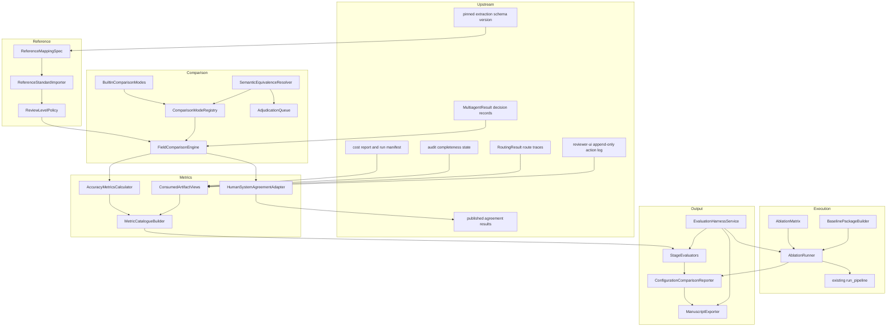
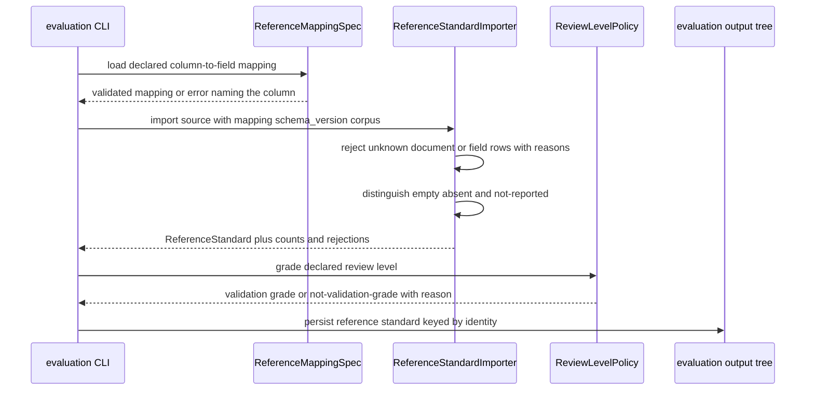
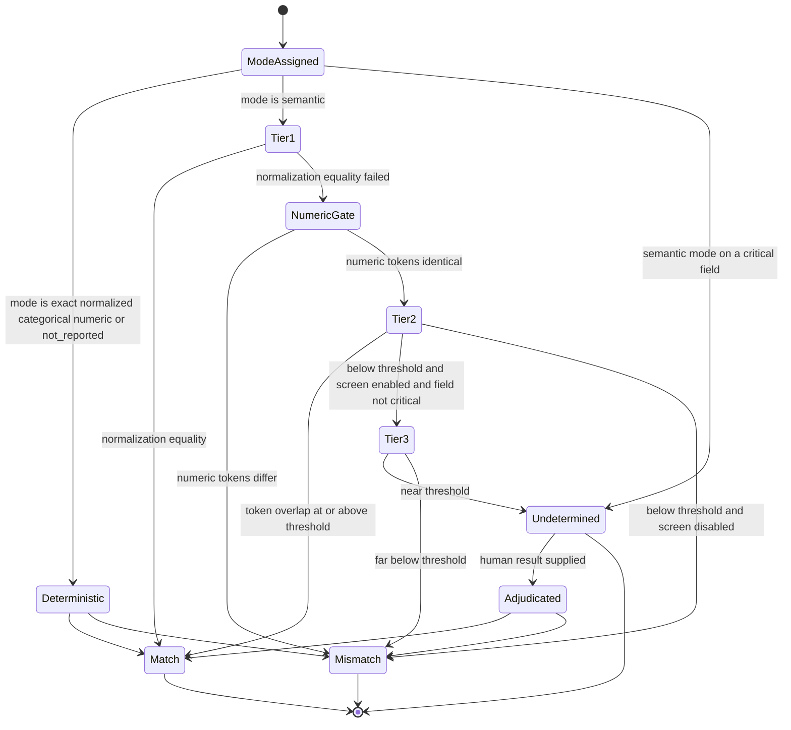
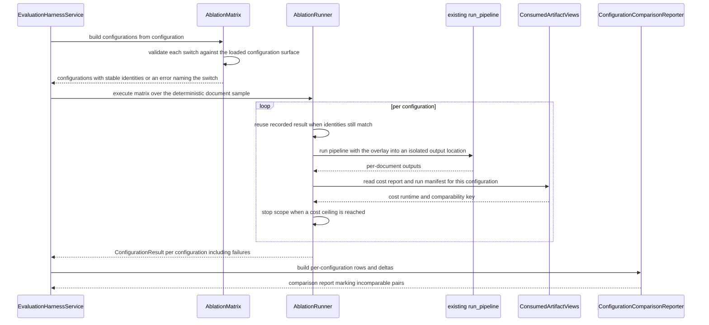

# Technical Design — evaluation-harness

## Overview

**Purpose**: This feature makes the multi-agent architecture falsifiable. It imports a human reference standard, compares it field by field against system output under six declared comparison modes, computes the accuracy and evidence-support metric set, and then reruns the same corpus with individual agents disabled and against full-document baselines — reporting accuracy, evidence support, cost, runtime, and manual-review rate per configuration. Every number it produces carries the identity of the run, the configuration, the schema version, and the review level of the reference standard behind it.

**Users**: Researchers producing a methodology manuscript (Stage 1) and, later, a benchmark manuscript (Stage 2); operators who must keep an N-configuration sweep inside a budget; the manuscript itself, which consumes the exported tables directly.

**Impact**: Today the pipeline produces operational reports — a flagged-fields CSV, a token report, and (after `cost-and-run-reporting`) a cost report and run manifest. None of them compares anything to a reference standard, and no configuration switch turns an agent off for measurement. After this change a new `src/evaluation/` package exists that reads those artifacts, executes the *existing* orchestrator once per configuration overlay, and writes an evaluation output tree. The only modification *this spec* makes to the pipeline itself is one optional `evidence_package_builder` parameter on `process_pdf`, whose default reproduces today's bytes exactly. Other specs (`provenance-audit-export`, `cost-and-run-reporting`) make their own pipeline modifications, including injecting an unrelated `AuditPackageBuilder`; this spec neither authorizes nor forbids them, and its parameter name is deliberately distinct from theirs.

### Goals

- One comparison outcome per document-and-field pair, with the deciding mode and its score recorded, reproducible across runs for every deterministic mode.
- Free-text equivalence decided by a deterministic tiered cascade with an explicit undetermined band, and never by a language model in the default path.
- Every one of the twelve success metrics present in one catalogue, each carrying its availability and a named reason when absent.
- Every ablation expressed as a validated configuration overlay over the shipped pipeline, never as a second extraction path.
- No result presented as validation unless the reference standard behind it reached the dual-annotator-adjudicated review level.

### Non-Goals

- Authoring benchmark annotations, or providing any review, annotation, or adjudication interface (`reviewer-ui`).
- Computing any agreement statistic (`agreement-statistics`), any price or token count (`cost-and-run-reporting`), any audit-completeness definition (`provenance-audit-export`), or any parser-risk flag (`agreement-statistics` via `evidence-routing`).
- Changing extraction, routing, verification, repair, or quality-control behaviour beyond applying a configuration switch that already exists.
- Statistical significance testing, confidence intervals from sampling theory, power analysis, or study design.
- Re-litigating the token-budget thresholds set by `token-efficient-extraction`.

## Boundary Commitments

### This Spec Owns

- The reference-standard model: its identity, its declared column-to-field mapping, its review level, blinding state, annotator count, adjudication rule, and validation grading.
- The comparison contract: the `ComparisonMode` interface, the six built-in modes, the per-field mode assignment and its override, and the `FieldComparison` record.
- The semantic equivalence cascade, its tier vocabulary, its undetermined band, the adjudication queue it feeds, and bounded metric reporting over undetermined pairs.
- The metric catalogue: the twelve success-metric entries, the `MetricValue` envelope (value, availability, reason, bounds, counts), and the closed unavailability-reason vocabulary.
- The **review timing contract** (`ReviewTimingEvent`) and its recording sink, scoped strictly to R24.6 review-timing and correction-burden instrumentation. This is a *derived* type, reconstructed from `reviewer-ui`'s append-only action log by the adapter contract below; it is not a review record, not an action vocabulary, and not a log. See "Ownership split: review actions versus review timing".
- The two evaluation stage modes and which catalogue entries each admits.
- The ablation matrix, configuration identity, comparability key, the two baseline configurations, deterministic sampling, cost ceilings, matrix resumability, the per-configuration comparison report, and the manuscript export profiles.
- The `evaluation` configuration section and the evaluation output tree.

### Out of Boundary

- Any agreement statistic, price, token count, audit-completeness definition, parser-risk flag, route quality verdict, or per-field decision record — read, never computed, never overwritten.
- Corpus membership and the pinned extraction schema version (`corpus-and-schema-builder`).
- The behaviour of any ablated agent. This spec toggles declared switches and observes; it does not change what a stage does when enabled.
- Any user interface. The adjudication queue is data on disk; the review action log is supplied data.
- **The `ReviewEvent` record, the review action vocabulary (`ActionKind`), the review status vocabulary, the reviewer identity model, and the append-only review action log — all owned by `reviewer-ui`.** This spec reads that log and never defines, emits, re-orders, re-keys, or writes it.
- Writing to any extraction output, cost artifact, run manifest, or audit artifact.

### Ownership split: review actions versus review timing

There is exactly one review record type in the system and `reviewer-ui` owns it.

| Concern | Owner | Type | Time model | Field key |
|---|---|---|---|---|
| Review actions, their vocabulary, the append-only log, reviewer identity | `reviewer-ui` | `ReviewEvent` | instant (`recorded_at`, plus monotonic `sequence`) | `field_index: int` |
| R24.6 timing and correction-burden instrumentation | this spec | `ReviewTimingEvent` | interval (`started_at` / `ended_at`), reconstructed | `field_id: str`, mapped from `field_index` |

`ReviewTimingEvent` is **derived, never emitted**. `reviewer-ui` is not asked to produce it, is not asked to adopt this spec's shape, and is not asked to change its own. The derivation is the `ReviewActionLogAdapter` contract specified under the Instrumentation Layer, which is the single place the two models meet.

Consequences of the split, all binding:

- This spec never defines an action kind. Its `decision` vocabulary (`accepted` / `edited` / `rejected` / `deferred`) is a **projection** of `reviewer-ui`'s `ActionKind`, defined by the adapter's mapping table, and is only ever narrower.
- This spec never keys by `field_index`. It maps `field_index` to `field_id` through the pinned extraction schema version, and drops any action whose index does not resolve, recording the drop.
- Interval timing does not exist in the source log; it is reconstructed under stated assumptions, and where reconstruction is not defensible the timing metrics report `unavailable` with a named reason rather than a guessed duration.
- Usability ratings have no representation in `reviewer-ui`'s log at all. They are optional supplied side-channel data, and metric 7's usability component is `unavailable` whenever they are absent.
- The existing scope position is unchanged and reaffirmed: **the prospective half of Stage 2 is not executable until `reviewer-ui` lands.** Until then there is no action log to adapt, and metrics 6 and 7 report `unavailable` with `review_surface_absent`, never zero.

### Allowed Dependencies

- `src/evaluation/` may import `pipeline.orchestrator`, `pipeline.manifest`, `pipeline.token_budget`, `text_processing`, `quality_control.models` (for `RaterFieldOutput`, `ComparisonUnit`, and the agreement result vocabulary), `quality_control.iaa_calculator` (for `compute_agreement` only), `quality_control.agreement` (for `ComparisonNormalizer` only), `utils.*`, and — once they exist — `pipeline.routing`, `pipeline.multiagent`, `pipeline.run_recorder`, `pipeline.cost_report`, `pipeline.stage_control`, `provenance.*`.
- **Why the agreement widening breaks no dependency rule.** `agreement-statistics` designs `quality_control/agreement/` as a layered pure core and `quality_control.iaa_calculator.compute_agreement(units, config) -> dict` as its pure public entry point. Both are leaf-pure: they import only `quality_control.models`, `utils`, and the standard library, and nothing from `pipeline`, `agents`, `pdf_extractor`, or `evaluation`. Importing them from `src/evaluation/` therefore adds only the edge `evaluation -> quality_control`, which is in the permitted direction and creates no cycle. The standing rule that **this spec computes no statistic itself** is unaffected: it constructs no statistic, implements no `AgreementStatistic`, chooses no degenerate-case policy, and never overrides an undefined reason code — it hands units in and copies the returned dict out.
- Nothing in `src/pipeline/`, `src/agents/`, `src/quality_control/`, `src/text_processing/`, or `src/pdf_extractor/` may import `evaluation`. The dependency is strictly one-directional and is asserted by `tests/test_dependency_directions.py`.
- Heavy optional dependencies (`sentence-transformers`, `faiss`, `torch`) stay lazily imported inside function bodies and are reachable only through the disabled-by-default Tier 3 screen. No new third-party dependency is introduced.

### Revalidation Triggers

- Any change to `FieldComparison`, `MetricValue`, `MetricEntry`, or `ConfigurationResult` field names — the export and any downstream manuscript tooling read all four.
- Any change by `reviewer-ui` to `ReviewEvent`, `ActionKind`, `ReviewerRef`, the review status vocabulary, the action-log path and record ordering, or the per-field projection's `current_value` / `original_model_value` fields — revalidate `ReviewActionLogAdapter` on the consumer side, since the derivation of `ReviewTimingEvent` reads all of them. This spec adapts to `reviewer-ui`; `reviewer-ui` is never asked to emit this spec's shape.
- Any change to `ReviewTimingEvent` or to the adapter's `ActionKind` → `decision` mapping table — changes what metrics 6 and 7 mean.
- Any change to the unavailability-reason vocabulary or the review-level vocabulary — both are stamped into exported artifacts.
- Any change to the comparability key's inputs — changes which configurations may be differenced.
- Any change to which upstream field names are read from `MultiagentResult`, `RoutingResult`, `cost_report.json`, `run_manifest.json`, or `metrics_hierarchy`.
- Adding a second pipeline modification by *this spec* beyond the `evidence_package_builder` override, or changing that override's default behaviour. (A pipeline modification made by another spec — for example the `AuditPackageBuilder` injected by `provenance-audit-export` and `cost-and-run-reporting` — is not this trigger, but a name collision on `process_pdf`'s parameters would be.)
- Reversing the venue decision (methodology paper first) — it determines which export profile is the default and therefore which tables are built first.

## Architecture

### Existing Architecture Analysis

- `run_pipeline()` (`src/pipeline/orchestrator.py`) takes CLI overrides as parameters and never writes them back to module state, and `process_pdf` (`src/pipeline/pdf_processor.py`) builds one paper-level evidence package shared by every chunk. Both facts are what make configuration-overlay ablation possible without a fork.
- `_shared_paper_prefix` (`src/agents/openai/prompts.py`) wraps exactly one variable — the serialized paper package. The cache-stability rule is byte-identity across warmup, chunks, and synthesis *for the same document*. A full-text package built once per document satisfies it; only cache economics change. This is why the baselines need an injected builder rather than a fork.
- `src/text_processing/` already provides `WhitespaceNormalizer`, `AggressiveNormalizer`, `UnicodeNormalizer`, `OcrCleaner`, `SimpleWordTokenizer` (Tiers 1–2) and `SemanticMatcher` + `EmbeddingProcessor` behind lazy imports (Tier 3). No new dependency is needed.
- `src/pipeline/extraction_report.py::generate_flagged_fields_report` writes `outputs/flagged_fields.csv` — the closest existing per-field artifact. R14.3 keeps the per-field evaluation export row-shape-compatible with it rather than inventing a rival layout.
- `_ALL_KNOWN_TOP_LEVEL_KEYS` in `src/utils/config_utils.py` rejects unregistered top-level YAML keys; registering `evaluation` is part of this feature's foundation work.
- Technical debt worked around: five of the twelve success metrics depend on specs that ship later or alongside. Rather than blocking, every consumed artifact has a declared absent-path yielding an unavailable metric with a named reason.

### Architecture Pattern & Boundary Map

Selected pattern: **read-only observer over a configuration-overlay executor**. The measurement half never mutates; the execution half mutates only a validated configuration overlay and then calls the shipped orchestrator.



**Architecture Integration**:

- Domain boundaries: the reference layer owns "what the humans said"; the comparison layer owns "did these two values agree"; the metrics layer owns "what does that add up to, and can we say it"; the execution layer owns "run the shipped pipeline under this overlay"; the output layer owns "put it in a table". No layer reaches across two boundaries.
- Existing patterns preserved: config loaded once and passed explicitly; ABC-plus-registry for pluggable behaviour (mirrors `QualityMetrics`, `TextProcessor`, and `evidence-routing`'s stage strategies); frozen dataclasses with tuple collections; lazy heavy imports; atomic JSON writes.
- New components rationale: the comparison mode registry exists because R3.2 requires extension without editing existing modes; the semantic resolver is separate from the modes because its cascade, thresholds, and queue are the single most tunable surface in the feature; the consumed-artifact views exist so that five upstream dependencies each have exactly one absent-path implementation rather than five scattered `if is None` branches.
- Dependency direction: `models` → `config` → `reference` → `comparison` → `metrics` → `review_hooks` → `stages` → `ablation` → `export` → `service` → `cli`. Each module imports only from modules to its left. `ablation.baselines` is the only module permitted to touch a pipeline entry point's parameters.

### Technology Stack

| Layer | Choice / Version | Role in Feature | Notes |
|-------|------------------|-----------------|-------|
| Frontend / CLI | Python 3.12 `argparse` module entry (`python -m evaluation`) | Import a reference standard, run a matrix, export tables | Mirrors `python -m pdf_extractor.pdf_extractor` |
| Backend / Services | Python 3.12, `dataclasses`, `asyncio` | All layers; the runner awaits the existing `run_pipeline` | Matches existing pipeline |
| Text comparison | `text_processing` normalizers and tokenizers | Tiers 1–2 of the semantic cascade, categorical normalization | No new dependency |
| Optional similarity | `text_processing.embedding` / `SemanticMatcher` behind lazy import | Tier 3 screen only, disabled by default | Keeps `torch`/`faiss` out of the fast suite |
| Data / Storage | JSON and delimited-text artifacts under the evaluation output tree | Reference standards, comparisons, catalogues, reports, exports | Atomic write helper, same convention as `token_report.py` |
| Consumed artifacts | `cost_report.json`, `run_manifest.json`, `metrics_hierarchy`, multiagent and routing artifact directories | Cost, runtime, identity, agreement, route and parser state | Read-only |

No new third-party dependency is introduced.

## File Structure Plan

### Directory Structure

```
src/evaluation/
├── __init__.py                     # Public surface: run_evaluation, import_reference_standard, EvaluationResult
├── models.py                       # All evaluation dataclasses and closed vocabularies
├── config.py                       # EvaluationConfig resolution, defaults, strict validation
├── reference/
│   ├── __init__.py
│   ├── mapping.py                  # ReferenceMappingSpec: declared column-to-field mapping and its validation
│   ├── importer.py                 # ReferenceStandardImporter: rows -> ReferenceStandard, rejections, counts
│   └── grading.py                  # ReviewLevelPolicy: level enforcement and validation grading
├── comparison/
│   ├── __init__.py
│   ├── modes.py                    # ComparisonMode ABC + ComparisonModeRegistry
│   ├── builtin_modes.py            # exact, normalized, categorical, numeric_tolerance, not_reported
│   ├── semantic.py                 # SemanticEquivalenceResolver: the tiered cascade and its bands
│   ├── adjudication.py             # AdjudicationQueue: undetermined pairs in, human results out
│   └── engine.py                   # FieldComparisonEngine: mode assignment and per-pair comparison
├── metrics/
│   ├── __init__.py
│   ├── accuracy.py                 # AccuracyMetricsCalculator: metrics 1-5 and 11 with bounds
│   ├── agreement_adapter.py        # HumanSystemAgreementAdapter: rater outputs out, published results in
│   ├── consumed.py                 # CostView, AuditCompletenessView, ParserRiskView, RouteQualityView
│   └── catalogue.py                # MetricCatalogueBuilder: the twelve entries and their availability
├── review_hooks.py                 # ReviewTimingEvent contract, ReviewActionLogAdapter, ReviewTimingSink
├── stages.py                       # Stage1Evaluator and Stage2Evaluator
├── ablation/
│   ├── __init__.py
│   ├── matrix.py                   # AblationMatrix: overlays, switch validation, configuration identity
│   ├── baselines.py                # BaselinePackageBuilder: full-document package construction and size limit
│   ├── runner.py                   # AblationRunner: sampling, ceilings, isolation, failure handling, resume
│   └── report.py                   # ConfigurationComparisonReporter: per-configuration rows and deltas
├── export.py                       # ManuscriptExporter: Stage 1 and Stage 2 profiles, stamping, redaction
├── service.py                      # EvaluationHarnessService: end-to-end sequencing
└── cli.py                          # `python -m evaluation` entry point

configs/
└── config.yaml                     # New `evaluation` section
```

### Modified Files

- `src/utils/config_utils.py` — register `evaluation` in `_ALL_KNOWN_TOP_LEVEL_KEYS`; add `load_evaluation_config`.
- `src/utils/path_utils.py` — add a resolver for the evaluation output tree (`outputs/evaluation/` by default), and per-configuration subdirectories under it.
- `src/pipeline/pdf_processor.py` — `process_pdf` gains one optional `evidence_package_builder` parameter, which overrides construction of the **paper evidence package**. When it is `None` (the default and every production call), the serialized package bytes are byte-identical to today's. This is the only pipeline modification *this spec* makes. The name is deliberately explicit: `provenance-audit-export` and `cost-and-run-reporting` inject an unrelated `AuditPackageBuilder` into the same call path, and the two must never be confused for one another or share a parameter name.
- `tests/test_dependency_directions.py` — assert that no module under `src/pipeline/`, `src/agents/`, `src/quality_control/`, `src/text_processing/`, or `src/pdf_extractor/` imports `evaluation`.
- `configs/config.yaml` — the `evaluation` section described under Data Models.

## System Flows

### Reference-standard import and grading



A source declaring patient-level content is rejected before any row is read. Re-importing the same source yields the same reference-value identities and updates the stored standard in place.

### Field comparison and the semantic cascade



The numeric gate sits above every similarity score: two values whose numeric tokens differ are a mismatch no matter how similar their wording. Undetermined pairs never enter a numerator or a denominator as a decision; they drive the bounds instead.

### Ablation matrix execution



Ceilings are evaluated after each configuration and, where the cost artifact updates during a run, between documents. Reaching a ceiling stops new work for the affected scope and yields a partial matrix report rather than discarding completed work.

## Requirements Traceability

| Requirement | Summary | Components | Interfaces | Flows |
|-------------|---------|------------|------------|-------|
| 1.1, 1.4 | Declared mapping; unmapped columns recorded | ReferenceMappingSpec, ReferenceStandardImporter | `load_mapping`, `import_reference` | Import |
| 1.2 | Source, timestamp, schema version, mapping recorded | ReferenceStandardImporter | `ReferenceStandard` | Import |
| 1.3 | Unknown document or field rows rejected with reason | ReferenceStandardImporter | `RowRejection` | Import |
| 1.5 | Empty, not-reported, and absent distinguished | ReferenceStandardImporter, EvaluationModels | `ReferenceValue.presence` | Import |
| 1.6 | Idempotent re-import | ReferenceStandardImporter | `reference_value_id` | Import |
| 1.7 | Import counts reported | ReferenceStandardImporter | `ReferenceImportResult` | Import |
| 1.8 | Declared patient-level source rejected | ReferenceStandardImporter | `import_reference` | Import |
| 2.1, 2.2 | Review level required with its attributes | ReviewLevelPolicy, EvaluationModels | `ReviewLevelDeclaration` | Import |
| 2.3 | Human-human agreement reported first at Level C | ReviewLevelPolicy, HumanSystemAgreementAdapter | `human_human_agreement` | Import |
| 2.4, 2.5 | Below minimum counts or not blind is not validation-grade | ReviewLevelPolicy | `grade` | Import |
| 2.6 | Level stamped on every result and export | ReviewLevelPolicy, ManuscriptExporter | `ValidationGrade` | Export |
| 2.7 | Agreement wording, never correctness | MetricCatalogueBuilder, ManuscriptExporter | metric labels | Export |
| 3.1, 3.7 | One outcome per pair including one-sided pairs | FieldComparisonEngine | `compare` | Comparison |
| 3.2 | Six modes, registry-extensible | ComparisonModeRegistry, BuiltinComparisonModes | `ComparisonMode` | Comparison |
| 3.3 | Mode from schema format, overridable, recorded | FieldComparisonEngine, EvaluationConfig | `assign_mode` | Comparison |
| 3.4 | Numeric tolerance and unparseable content | BuiltinComparisonModes | `NumericToleranceMode` | Comparison |
| 3.5 | Categorical with out-of-vocabulary distinction | BuiltinComparisonModes | `CategoricalMode` | Comparison |
| 3.6 | Not-reported agreement and its two mismatch kinds | BuiltinComparisonModes | `NotReportedMode` | Comparison |
| 3.8 | Deterministic repeat for deterministic modes | FieldComparisonEngine, BuiltinComparisonModes | `compare` | Comparison |
| 3.9 | Full comparison record | EvaluationModels | `FieldComparison` | Comparison |
| 4.1, 4.2 | Tier 1 normalization, Tier 2 overlap with numeric identity | SemanticEquivalenceResolver | `resolve` | Comparison |
| 4.3 | Differing numeric tokens are always a mismatch | SemanticEquivalenceResolver | numeric gate | Comparison |
| 4.4, 4.5 | Screen may only widen doubt; critical fields bypass it | SemanticEquivalenceResolver | `resolve` | Comparison |
| 4.6 | No model judge; resolver identity recorded | SemanticEquivalenceResolver | `resolver_version` | Comparison |
| 4.7, 4.8 | Undetermined queued; adjudication applied and recorded | AdjudicationQueue | `enqueue`, `apply_result` | Comparison |
| 4.9 | Point estimate with lower and upper bounds | AccuracyMetricsCalculator, EvaluationModels | `MetricValue.bounds` | Metrics |
| 5.1, 5.5, 5.6 | Accuracy overall, per field, per group; not-reported; critical | AccuracyMetricsCalculator | `compute` | Metrics |
| 5.2 | Completeness | AccuracyMetricsCalculator | `compute` | Metrics |
| 5.3, 5.4 | Unsupported-answer rate and evidence-support accuracy from upstream checks | AccuracyMetricsCalculator, ConsumedArtifactViews | `support_view` | Metrics |
| 5.7 | Manual-review rate by field group | AccuracyMetricsCalculator, ConsumedArtifactViews | `terminal_states` | Metrics |
| 5.8 | Undefined with a named reason, never zero | EvaluationModels, MetricCatalogueBuilder | `UnavailableReason` | Metrics |
| 5.9 | Provenance of every metric | AccuracyMetricsCalculator | `MetricValue.context` | Metrics |
| 6.1 | Twelve-entry catalogue with availability | MetricCatalogueBuilder | `build` | Metrics |
| 6.2 | Rater outputs out, agreement computed by the agreement module | HumanSystemAgreementAdapter | `emit_rater_outputs`, `compute_agreement` | Metrics |
| 6.3, 6.4 | Cost metrics from the published artifact; absent path | ConsumedArtifactViews | `CostView` | Metrics |
| 6.5 | Audit completeness read, unavailable until it exists | ConsumedArtifactViews | `AuditCompletenessView` | Metrics |
| 6.6 | Parser-risk stratified accuracy; never computes a flag | ConsumedArtifactViews, AccuracyMetricsCalculator | `ParserRiskView` | Metrics |
| 6.7 | Threshold recalibration recommendation, never a write | MetricCatalogueBuilder | `RecalibrationRecommendation` | Metrics |
| 6.8 | Identity mismatch is incomparable, not combined | ConsumedArtifactViews, ConfigurationComparisonReporter | `comparability_key` | Ablation |
| 7.1, 7.2 | Review timing contract, derived from the reviewer-ui action log, and its recording | ReviewActionLogAdapter, ReviewTimingSink, EvaluationModels | `ReviewTimingEvent`, `derive` | Metrics |
| 7.3 | Correction burden and time saved | AccuracyMetricsCalculator, ReviewTimingSink | `compute_review_metrics` | Metrics |
| 7.4 | Absent review surface yields unavailable, not zero | ReviewTimingSink, MetricCatalogueBuilder | `review_surface_absent` | Metrics |
| 7.5, 7.6 | No interface; blocked state recorded in output | ReviewTimingSink, Stage2Evaluator | `prospective_blocked` | Stage 2 |
| 8.1, 8.2 | Stage 1 without a reference standard, reading upstream outcomes | Stage1Evaluator, ConsumedArtifactViews | `evaluate` | Stage 1 |
| 8.3 | Reference-dependent metrics marked not applicable | Stage1Evaluator, MetricCatalogueBuilder | `not_applicable_to_stage` | Stage 1 |
| 8.4 | Stage 1 table set is the default profile | ManuscriptExporter | `PROFILE_STAGE_1` | Export |
| 8.5 | Disabled upstream stage yields not applicable | Stage1Evaluator | `evaluate` | Stage 1 |
| 9.1, 9.2 | Stage 2 requires a reference standard; halves kept separate | Stage2Evaluator | `evaluate` | Stage 2 |
| 9.3 | Retrospective completes; prospective blocked | Stage2Evaluator, ReviewTimingSink | `prospective_blocked` | Stage 2 |
| 9.4 | Stage 2 profile is opt-in | ManuscriptExporter | `PROFILE_STAGE_2` | Export |
| 9.5 | Missing reference standard is an error | Stage2Evaluator | `evaluate` | Stage 2 |
| 10.1, 10.6 | Matrix membership and restriction | AblationMatrix | `build` | Ablation |
| 10.2, 10.3 | Overlays only; unknown switch is an error | AblationMatrix | `validate_overlay` | Ablation |
| 10.4 | Stable configuration identity | AblationMatrix | `configuration_id` | Ablation |
| 10.5 | Effective configuration recorded | AblationRunner | `ConfigurationResult` | Ablation |
| 10.7 | Output isolation per configuration | AblationRunner, path resolver | `configuration_output_dir` | Ablation |
| 11.1, 11.2 | One-shot and chunked full-document baselines | BaselinePackageBuilder, AblationMatrix | `build_package` | Ablation |
| 11.3 | Baselines opt-in only | AblationMatrix, EvaluationConfig | `build` | Ablation |
| 11.4 | Mandatory cost ceiling for baselines | AblationRunner, EvaluationConfig | `execute` | Ablation |
| 11.5 | Document-level prompt material stable | BaselinePackageBuilder | `build_package` | Ablation |
| 11.6, 11.7 | Oversized documents skipped, recorded, excluded | BaselinePackageBuilder, AblationRunner | `SkippedDocument` | Ablation |
| 11.8 | Budget thresholds untouched | BaselinePackageBuilder | boundary invariant | Boundary |
| 12.1 | Existing pipeline invoked, no second path | AblationRunner | `execute` | Ablation |
| 12.2 | Deterministic shared sample from a recorded seed | AblationRunner | `select_sample` | Ablation |
| 12.3, 12.4 | Per-configuration and matrix ceilings; partial matrix | AblationRunner | `execute` | Ablation |
| 12.5, 12.6 | Document and configuration failure isolation | AblationRunner | `ConfigurationResult.failures` | Ablation |
| 12.7, 12.8 | Resume reuse and identity-based invalidation | AblationRunner | `load_if_valid` | Ablation |
| 13.1, 13.2 | One row per configuration with counts | ConfigurationComparisonReporter | `build_report` | Ablation |
| 13.3 | Deltas against the full-system configuration | ConfigurationComparisonReporter | `build_report` | Ablation |
| 13.4 | Incomplete configurations still appear | ConfigurationComparisonReporter | `ConfigurationRow.status` | Ablation |
| 13.5 | Incomparable pairs marked, not differenced | ConfigurationComparisonReporter | `comparability_key` | Ablation |
| 13.6 | Observed differences, no significance claim | ConfigurationComparisonReporter | `Delta` | Ablation |
| 13.7 | Review level recorded on dependent rows | ConfigurationComparisonReporter, ReviewLevelPolicy | `ValidationGrade` | Ablation |
| 14.1, 14.2 | Machine-readable artifacts; two profiles | ManuscriptExporter | `export` | Export |
| 14.3 | Per-field export compatible with the existing flag rows | ManuscriptExporter | `per_field_rows` | Export |
| 14.4 | Identity stamping | ManuscriptExporter | `ExportStamp` | Export |
| 14.5 | Unavailable, undefined, and bounded states carried through | ManuscriptExporter, EvaluationModels | `MetricValue` | Export |
| 14.6 | Shareable exports exclude text and identities; restrictive default | ManuscriptExporter | `SharingSuitability` | Export |
| 14.7 | Write failure leaves prior artifacts intact | ManuscriptExporter | atomic write | Export |
| 15.1, 15.2, 15.3 | Configuration surface, defaults recorded, invalid rejected | EvaluationConfig | `load_evaluation_config` | All |
| 15.4 | Disabled harness changes nothing | EvaluationHarnessService | `run_evaluation` | All |
| 15.5 | No behavioural modification beyond declared switches | EvaluationHarnessService, AblationRunner | boundary invariant | Boundary |
| 15.6 | Run identities read, never re-derived | ConsumedArtifactViews | `RunIdentity` | Ablation |
| 15.7 | Missing upstream artifact yields unavailable | ConsumedArtifactViews | `UnavailableReason` | Metrics |
| 15.8 | Writes confined to the evaluation tree | path resolver, ManuscriptExporter | `evaluation_output_dir` | Export |

## Components and Interfaces

| Component | Domain/Layer | Intent | Req Coverage | Key Dependencies (P0/P1) | Contracts |
|-----------|--------------|--------|--------------|--------------------------|-----------|
| EvaluationModels | Types | Every evaluation record and closed vocabulary | 1, 2, 3, 4, 5, 6, 7, 10, 12, 13, 14 | none | State |
| EvaluationConfig | Config | Resolve, default, and validate every setting | 15 | config_utils (P0) | Service, State |
| ReferenceMappingSpec | Reference | Declared column-to-field mapping and its validation | 1.1, 1.4 | EvaluationModels (P0) | Service |
| ReferenceStandardImporter | Reference | Rows to reference standard, with rejections and counts | 1 | ReferenceMappingSpec (P0), schema version store (P1) | Service, Batch |
| ReviewLevelPolicy | Reference | Enforce review level and validation grading | 2 | HumanSystemAgreementAdapter (P1) | Service |
| ComparisonModeRegistry | Comparison | Register and resolve comparison modes | 3.2 | EvaluationModels (P0) | Service |
| BuiltinComparisonModes | Comparison | Exact, normalized, categorical, numeric, not-reported | 3.4, 3.5, 3.6, 3.8 | text_processing (P0) | Service |
| SemanticEquivalenceResolver | Comparison | The tiered free-text cascade and its bands | 4.1–4.6 | text_processing (P0), embedding (P1) | Service |
| AdjudicationQueue | Comparison | Hold undetermined pairs; apply human results | 4.7, 4.8 | EvaluationModels (P0) | State |
| FieldComparisonEngine | Comparison | Mode assignment and per-pair comparison | 3.1, 3.3, 3.7, 3.9 | ComparisonModeRegistry (P0) | Service |
| AccuracyMetricsCalculator | Metrics | Metrics 1–5, 11, and the review-derived metrics | 4.9, 5, 7.3 | FieldComparisonEngine (P0) | Service |
| HumanSystemAgreementAdapter | Metrics | Rater outputs out, agreement module's `compute_agreement` result in | 2.3, 6.2 | quality_control.models (P0), quality_control.iaa_calculator / quality_control.agreement (P1) | Service |
| ConsumedArtifactViews | Metrics | One absent-path per consumed upstream artifact | 5.3, 5.7, 6.3–6.6, 6.8, 8.2, 15.6, 15.7 | cost report, audit state, routing, multiagent (P1) | Service, State |
| MetricCatalogueBuilder | Metrics | The twelve entries, availability, recalibration note | 2.7, 5.8, 6.1, 6.7, 7.4 | AccuracyMetricsCalculator (P0) | Service |
| ReviewActionLogAdapter | Instrumentation | Derive `ReviewTimingEvent`s from reviewer-ui's action log | 7.1, 7.2, 7.5 | EvaluationModels (P0), reviewer-ui action log (P1) | Service |
| ReviewTimingSink | Instrumentation | Record derived timing events and report their availability | 7.1, 7.2, 7.4, 7.5, 7.6 | EvaluationModels (P0), ReviewActionLogAdapter (P0) | Event, State |
| Stage1Evaluator | Stages | System validation without a reference standard | 8 | ConsumedArtifactViews (P0) | Service |
| Stage2Evaluator | Stages | Benchmark evaluation; halves kept separate | 9 | FieldComparisonEngine (P0) | Service |
| AblationMatrix | Execution | Overlays, switch validation, configuration identity | 10, 11.3 | EvaluationConfig (P0) | Service, State |
| BaselinePackageBuilder | Execution | Full-document package construction and size limit | 11.1, 11.2, 11.5–11.8 | pipeline evidence-package-builder seam (P0) | Service |
| AblationRunner | Execution | Sampling, ceilings, isolation, failures, resume | 10.5, 10.7, 11.4, 12 | pipeline orchestrator (P0), ConsumedArtifactViews (P0) | Batch, State |
| ConfigurationComparisonReporter | Output | Per-configuration rows and deltas | 13 | AblationRunner (P0) | Service |
| ManuscriptExporter | Output | Profiles, stamping, redaction, atomic writes | 2.6, 8.4, 9.4, 14 | MetricCatalogueBuilder (P0) | Batch |
| EvaluationHarnessService | Orchestration | Sequence the halves; disabled path | 15.4, 15.5 | all above (P0) | Service |
| evaluation CLI | Orchestration | Import, run, export entry points | 1.7, 10.6, 14.2 | EvaluationHarnessService (P0) | API |

### Types Layer

#### EvaluationModels

| Field | Detail |
|-------|--------|
| Intent | Single definition of every evaluation record and closed vocabulary |
| Requirements | 1.2, 1.5, 2.1, 3.9, 4.9, 5.8, 5.9, 6.1, 7.1, 10.4, 12.5, 13.1, 14.4 |

**Responsibilities & Constraints**
- All dataclasses are frozen; every collection field is a tuple, so results are hashable and safe to share across `asyncio` tasks.
- No upstream type is redefined. `RaterFieldOutput` is imported from `quality_control.models`; `FieldDecisionRecord`, `AnswerVerdict`, `AdjudicatedRoute`, and the cost and manifest shapes are read as their owners publish them.
- Vocabularies are `Literal` types, so an unknown value is a type error rather than a silent string.
- `MetricValue` is the only way a number leaves this feature. There is no bare-float return path.

**Dependencies**: Inbound: every other component (P0). Outbound: `quality_control.models` (P0).

**Contracts**: State [x]

##### State Management

```python
ComparisonModeName = Literal["exact", "normalized", "categorical",
                             "numeric_tolerance", "semantic", "not_reported"]
ComparisonOutcome = Literal["match", "mismatch", "undetermined",
                            "reference_only", "system_only", "not_applicable"]
MismatchKind = Literal["value_differs", "numeric_differs", "out_of_vocabulary",
                       "wrong_category", "asserted_against_not_reported",
                       "not_reported_against_asserted", "unparseable_numeric", "none"]
SemanticTier = Literal["normalization", "token_overlap", "numeric_gate",
                       "embedding_screen", "critical_field_referral", "human_adjudication"]
ValuePresence = Literal["asserted", "not_reported", "empty", "absent"]
ReviewLevel = Literal["single_annotator", "imported_benchmark", "dual_annotator_adjudicated"]
EvaluationStage = Literal["stage_1", "stage_2"]
MetricAvailability = Literal["available", "unavailable", "not_applicable"]
UnavailableReason = Literal["review_surface_absent", "audit_state_absent",
                            "parser_risk_flags_absent", "cost_artifact_absent",
                            "route_traces_absent", "agreement_undefined",
                            "zero_denominator", "no_reference_standard",
                            "not_applicable_to_stage", "incomparable_identity",
                            "stage_disabled", "configuration_incomplete",
                            "review_timing_unreconstructable", "usability_data_absent"]
ConfigurationKind = Literal["full_system", "ablation", "baseline"]
AblationTarget = Literal["counterfactual_locator", "second_extractor",
                         "verifier", "repair_agent"]
BaselineKind = Literal["one_shot_full_document", "chunked_full_document"]
SharingSuitability = Literal["restricted", "shareable"]
ConfigurationStatus = Literal["completed", "failed", "not_attempted",
                              "cost_ceiling_reached"]

@dataclass(frozen=True)
class ReferenceValue:
    reference_value_id: str            # stable across re-import (1.6)
    document_id: str
    field_id: str
    field_group: str
    value: str
    presence: ValuePresence            # (1.5)
    source_row: int
    annotator_id: str | None

@dataclass(frozen=True)
class RowRejection:
    source_row: int
    reason: str                        # (1.3)
    detail: str

@dataclass(frozen=True)
class ReviewLevelDeclaration:
    level: ReviewLevel                          # (2.1)
    annotator_count: int                        # (2.2)
    blind_to_other_annotators: bool
    blind_to_system_output: bool                # (2.5)
    adjudication_rule: str
    adjudicated_document_count: int
    adjudicated_unit_count_by_group: Mapping[str, int]

@dataclass(frozen=True)
class ValidationGrade:
    validation_grade: bool                      # (2.6)
    level: ReviewLevel
    reasons: tuple[str, ...]                    # why it is not validation-grade
    below_threshold_groups: tuple[str, ...]     # (2.4)

@dataclass(frozen=True)
class ReferenceStandard:
    reference_standard_id: str
    source_identity: str                        # (1.2)
    imported_at: str
    schema_version_id: str
    mapping_id: str
    declaration: ReviewLevelDeclaration
    grade: ValidationGrade
    values: Mapping[tuple[str, str], ReferenceValue]   # (document_id, field_id)

@dataclass(frozen=True)
class ReferenceImportResult:
    reference_standard: ReferenceStandard | None
    accepted_rows: int                          # (1.7)
    rejected_rows: int
    unmapped_columns: tuple[str, ...]           # (1.4)
    covered_documents: int
    covered_fields: int
    rejections: tuple[RowRejection, ...]

@dataclass(frozen=True)
class FieldComparison:
    document_id: str
    field_id: str
    field_group: str
    is_critical: bool
    mode: ComparisonModeName                    # (3.3)
    outcome: ComparisonOutcome                  # (3.1, 3.7)
    mismatch_kind: MismatchKind
    reference_value: str | None
    system_value: str | None
    reference_presence: ValuePresence
    system_presence: ValuePresence
    score: float | None                         # (3.9)
    deciding_tier: SemanticTier | None          # (4.1-4.8)
    threshold_in_effect: float | None
    resolver_version: str | None                # (4.6)
    parser_risk: str | None                     # read from upstream (6.6)
    evidence_supported: bool | None             # read from upstream (5.3, 5.4)
    terminal_state: str | None                  # read from upstream (5.7)

@dataclass(frozen=True)
class AdjudicationItem:
    item_id: str
    document_id: str
    field_id: str
    reference_value: str
    system_value: str
    band_tier: SemanticTier                     # (4.7)
    status: Literal["outstanding", "adjudicated"]
    result: Literal["match", "mismatch"] | None
    adjudicator_id: str | None                  # (4.8)
    adjudicated_at: str | None

@dataclass(frozen=True)
class MetricBounds:
    point: float | None                         # adjudicated only (4.9)
    lower: float | None                         # undetermined counted as mismatch
    upper: float | None                         # undetermined counted as match
    undetermined_count: int

@dataclass(frozen=True)
class MetricValue:
    value: float | None
    bounds: MetricBounds | None
    availability: MetricAvailability            # (5.8, 6.1)
    unavailable_reason: UnavailableReason | None
    numerator: int
    denominator: int
    excluded: int
    context: Mapping[str, Any]                  # (5.9) reference, configuration, modes, thresholds

@dataclass(frozen=True)
class MetricEntry:
    metric_number: int                          # 1..12 (6.1)
    name: str
    value: MetricValue
    breakdowns: Mapping[str, MetricValue]       # per field, per field group, per stratum

@dataclass(frozen=True)
class RecalibrationRecommendation:
    thresholds_observed: Mapping[str, Any]      # (6.7)
    risky_stratum: MetricValue
    non_risky_stratum: MetricValue
    accuracy_difference: float | None
    note: str

@dataclass(frozen=True)
class MetricCatalogue:
    stage: EvaluationStage
    entries: tuple[MetricEntry, ...]            # exactly twelve
    grade: ValidationGrade | None
    recalibration: RecalibrationRecommendation | None

TimingBasis = Literal[
    "adjacent_action_delta",    # duration inferred from the previous action's instant
    "session_boundary",         # first action of a session: no predecessor within the session
    "single_action",            # only one action for this (document, field): no interval
    "supplied",                 # duration supplied out-of-band alongside the log
]

ReviewDecision = Literal["accepted", "edited", "rejected", "deferred"]

@dataclass(frozen=True)
class ReviewTimingEvent:
    """DERIVED, never emitted by reviewer-ui.

    Reconstructed by ReviewActionLogAdapter from reviewer-ui's append-only
    `ReviewEvent` log. reviewer-ui owns `ReviewEvent`, the `ActionKind`
    vocabulary, the review status vocabulary, and the log itself; this record
    is a timing-and-correction-burden projection over it and nothing more.

    The two value fields below are copied verbatim from reviewer-ui's field
    projection. No before/after value is reconstructed from the action log,
    and correction burden is decided from these projected values alone.
    """
    run_id: str                                 # (7.1) evaluation-side, not in the log
    configuration_id: str                       # evaluation-side, not in the log
    document_id: str                            # from ReviewEvent.document_id
    field_id: str                               # mapped from ReviewEvent.field_index
    session_id: str                             # derived session grouping, see the adapter
    reviewer_id: str                            # from ReviewEvent.reviewer.reviewer_id
    started_at: str | None                      # reconstructed; None when unreconstructable
    ended_at: str                               # from ReviewEvent.recorded_at
    timing_basis: TimingBasis                   # how started_at was obtained
    duration_seconds: float | None              # None whenever started_at is None
    decision: ReviewDecision                    # projection of ReviewEvent.kind
    source_action_kind: str                     # the ActionKind projected, kept verbatim
    source_action_id: str                       # ReviewEvent.action_id, for traceability
    projected_original_model_value: str | None  # copied from reviewer-ui's field projection
    projected_current_value: str | None         # copied from reviewer-ui's field projection
    usability_rating: int | None                # side-channel only; absent from the log

@dataclass(frozen=True)
class RunIdentity:
    run_id: str                                 # (15.6) all read from the run manifest
    schema_version_id: str | None
    prompt_versions: Mapping[str, str]
    model_ids: Mapping[str, str]
    configuration_hash: str | None
    price_table_version: str | None

@dataclass(frozen=True)
class ConfigurationDescriptor:
    configuration_id: str                       # (10.4) hash over switches
    kind: ConfigurationKind
    label: str
    ablation_target: AblationTarget | None
    baseline_kind: BaselineKind | None
    switches: Mapping[str, Any]                 # (10.2) declared overlay only

@dataclass(frozen=True)
class SkippedDocument:
    document_id: str
    reason: str                                 # (11.6, 12.5)

@dataclass(frozen=True)
class ConfigurationResult:
    descriptor: ConfigurationDescriptor
    status: ConfigurationStatus                 # (12.4, 12.6, 13.4)
    status_reason: str | None
    output_dir: str                             # (10.7)
    run_identity: RunIdentity | None            # (15.6)
    comparability_key: str | None               # (6.8, 13.5)
    effective_config: Mapping[str, Any]         # (10.5)
    documents_attempted: tuple[str, ...]
    documents_completed: tuple[str, ...]
    documents_skipped: tuple[SkippedDocument, ...]
    comparisons: tuple[FieldComparison, ...]
    catalogue: MetricCatalogue | None

@dataclass(frozen=True)
class Delta:
    metric_number: int
    baseline_configuration_id: str
    value: float | None                         # (13.6) observed difference only
    comparable: bool                            # (13.5)
    incomparable_reason: str | None

@dataclass(frozen=True)
class ConfigurationRow:
    descriptor: ConfigurationDescriptor
    status: ConfigurationStatus
    accuracy: MetricValue
    evidence_support: MetricValue
    cost: MetricValue
    runtime: MetricValue
    manual_review_rate: MetricValue
    documents_attempted: int
    documents_completed: int
    documents_excluded: int
    grade: ValidationGrade | None               # (13.7)
    deltas: tuple[Delta, ...]

@dataclass(frozen=True)
class EvaluationResult:
    stage: EvaluationStage
    enabled: bool
    catalogue: MetricCatalogue | None
    configuration_results: tuple[ConfigurationResult, ...]
    rows: tuple[ConfigurationRow, ...]
    outstanding_adjudications: int
    effective_config: Mapping[str, Any]         # (15.2)
    warnings: tuple[str, ...]
```

**Implementation Notes**
- Validation: a test constructs one instance of every record, asserts all are frozen with tuple collections, and asserts no record name or field name collides with a `quality_control.models`, `pipeline.multiagent`, or `pipeline.routing` type.
- Risks: `MetricValue.context` is an open mapping and could become a dumping ground — a test pins the required context keys (reference standard id, configuration id, mode assignment, thresholds).

### Config Layer

#### EvaluationConfig

| Field | Detail |
|-------|--------|
| Intent | Resolve, default, and validate every evaluation setting once per run |
| Requirements | 15.1, 15.2, 15.3, 15.4 |

**Responsibilities & Constraints**
- The `evaluation` top-level key must be registered in `_ALL_KNOWN_TOP_LEVEL_KEYS` or `load_local_config` raises `ValueError`; that registration is part of this component's work.
- Validation is strict and up front: an unknown stage, an unknown comparison mode name, a tolerance or threshold outside its permitted range, a sampling fraction outside `[0, 1]`, a non-positive ceiling, an unknown ablation target, or a baseline in the matrix without a ceiling raises before anything executes.
- The feature is **disabled by default**. With `enabled: false` nothing under `src/evaluation/` executes and no artifact is written (15.4).
- The fully resolved mapping, including every defaulted value, is carried on `EvaluationResult.effective_config` (15.2).

**Dependencies**: Inbound: every other component (P0). Outbound: `utils.config_utils` (P0), `utils.path_utils` (P0).

**Contracts**: Service [x] / State [x]

##### Service Interface

```python
@dataclass(frozen=True)
class EvaluationConfig:
    enabled: bool = False
    stage: EvaluationStage = "stage_1"
    # Reference standard (Open Questions 8, 9)
    reference_standard_dir: str = "outputs/evaluation/reference"
    mapping_path: str | None = None
    min_validation_documents: int = 20
    min_validation_units_per_group: int = 100
    require_validation_grade: bool = False
    # Comparison
    mode_overrides: Mapping[str, ComparisonModeName] = field(default_factory=dict)
    numeric_absolute_tolerance: float = 0.0
    numeric_relative_tolerance: float = 0.01
    # Semantic cascade (Open Question 7)
    semantic_token_overlap_threshold: float = 0.85
    semantic_undetermined_margin: float = 0.10
    embedding_screen_enabled: bool = False
    embedding_similarity_threshold: float = 0.85
    embedding_model_id: str | None = None
    adjudication_queue_path: str = "outputs/evaluation/adjudication_queue.json"
    # Ablation
    matrix: tuple[str, ...] = ("full_system", "no_counterfactual_locator",
                               "no_second_extractor", "no_verifier", "no_repair_agent")
    sample_fraction: float = 1.0
    sample_seed: int = 20260721
    per_configuration_cost_ceiling: float | None = None
    matrix_cost_ceiling: float | None = None
    baseline_max_document_tokens: int = 120_000
    # Output
    export_profile: Literal["stage_1", "stage_2"] = "stage_1"
    output_dir: str = "outputs/evaluation"
    sharing_suitability: SharingSuitability = "restricted"

def load_evaluation_config(config: Mapping[str, Any] | None) -> EvaluationConfig: ...
```

- Preconditions: `config` is the already-loaded run configuration mapping.
- Postconditions: every returned field is populated; defaults applied are recorded in `as_dict()`.
- Errors: `EvaluationConfigError` naming the setting and the invalid value (15.3).

**Implementation Notes**
- Integration: mirrors `load_routing_config` and `load_multiagent_config` — unknown keys rejected, missing keys defaulted.
- Validation: table-driven tests over each invalid value class, including a baseline listed in `matrix` with no ceiling declared.

### Reference Layer

#### ReferenceMappingSpec

| Field | Detail |
|-------|--------|
| Intent | Carry and validate the declared column-to-field mapping |
| Requirements | 1.1, 1.4 |

**Responsibilities & Constraints**
- The mapping declares, per source column, the target field reference and the role (`document_reference`, `field_reference`, `value`, `annotator`, `presence_marker`, `ignored`). A source column absent from the mapping is *unmapped*, never inferred (1.4).
- The mapping is validated against the pinned extraction schema version at load time; a target field that does not exist in that version is a load-time error naming the column.
- The mapping supports both wide layouts (one column per field) and long layouts (a field-reference column plus a value column); which layout applies is declared, not detected.

**Dependencies**: Inbound: ReferenceStandardImporter (P0). Outbound: schema version source (P1), EvaluationModels (P0).

**Contracts**: Service [x]

##### Service Interface

```python
ColumnRole = Literal["document_reference", "field_reference", "value",
                     "annotator", "presence_marker", "ignored"]

@dataclass(frozen=True)
class ColumnBinding:
    column: str
    role: ColumnRole
    field_id: str | None

@dataclass(frozen=True)
class ReferenceMappingSpec:
    mapping_id: str
    layout: Literal["wide", "long"]
    schema_version_id: str
    bindings: tuple[ColumnBinding, ...]
    not_reported_tokens: tuple[str, ...]
    declared_contains_patient_data: bool

def load_mapping(path: str, schema_version_id: str) -> ReferenceMappingSpec: ...
```

- Errors: `ReferenceMappingError` naming the offending column and the reason.

#### ReferenceStandardImporter

| Field | Detail |
|-------|--------|
| Intent | Turn a mapped source into a reference standard, with rejections and counts |
| Requirements | 1.1–1.8 |

**Responsibilities & Constraints**
- `reference_value_id = f"{document_id}:{field_id}"`, which makes re-import idempotent by construction (1.6) and makes an update-in-place the only possible outcome of a repeat import.
- Presence resolution order: an absent row yields no `ReferenceValue`; a row whose value matches a declared not-reported token yields `not_reported`; a row whose value is empty after whitespace normalization yields `empty`; anything else yields `asserted` (1.5).
- Document references resolve by document id, original filename, or content-hash prefix; an ambiguous filename is a row rejection, never a guess (1.3).
- `declared_contains_patient_data` on the mapping aborts the import before any row is read, with that declaration named as the reason (1.8). This is the code-level enforcement of the standing PHI boundary.
- The importer never writes outside the reference directory under the evaluation output tree.

**Dependencies**: Inbound: EvaluationHarnessService, CLI (P0). Outbound: ReferenceMappingSpec (P0), corpus membership (P1), schema version source (P1).

**Contracts**: Service [x] / Batch [x]

##### Service Interface

```python
class ReferenceStandardImporter:
    def __init__(self, mapping: ReferenceMappingSpec, corpus_document_ids: Sequence[str],
                 schema_field_ids: Sequence[str], output_dir: Path) -> None: ...
    def import_reference(self, source: Path, declaration: ReviewLevelDeclaration
                         ) -> ReferenceImportResult: ...
    def load(self, reference_standard_id: str) -> ReferenceStandard: ...
```

##### Batch Contract
- Trigger: `python -m evaluation reference import --source FILE --mapping FILE --level LEVEL`.
- Input / validation: header-keyed rows read through the declared mapping; unknown documents and fields rejected per row.
- Output / destination: one reference-standard artifact under the reference directory, plus a rejection listing.
- Idempotency & recovery: re-importing the same source updates the stored standard and produces the same value identities; a failed import leaves the previous standard intact.

**Implementation Notes**
- Risks: a reference standard pinned to one schema version compared against output extracted under another — the standard records its version and the comparison engine refuses the pairing with `incomparable_identity`.

#### ReviewLevelPolicy

| Field | Detail |
|-------|--------|
| Intent | Enforce the three review levels and compute validation grading |
| Requirements | 2.1–2.7 |

**Responsibilities & Constraints**
- A declaration with no level is rejected at registration (2.1). A `dual_annotator_adjudicated` declaration missing annotator count, blinding state, adjudication rule, or adjudicated counts is rejected (2.2).
- `validation_grade` is true only when every condition holds: level is `dual_annotator_adjudicated`; `blind_to_system_output` is true; `blind_to_other_annotators` is true; `adjudicated_document_count >= min_validation_documents`; and each reported field group's adjudicated unit count is at or above `min_validation_units_per_group`. Groups failing the last condition are listed in `below_threshold_groups` and are individually marked, so a single thin group does not invalidate the whole standard (2.4).
- At Level C, the policy requires the human-human agreement result to have been requested and recorded before any system comparison result is released (2.3). It obtains that result from the agreement adapter; it computes no statistic.
- The policy exposes the labelling vocabulary used everywhere downstream: results are described as *agreement with the reference standard*; the words "correct" and "verified" are absent from every metric name and export header (2.7), asserted by a lexical test over the export headers.

**Dependencies**: Inbound: ReferenceStandardImporter, MetricCatalogueBuilder, ManuscriptExporter (P0). Outbound: HumanSystemAgreementAdapter (P1).

**Contracts**: Service [x]

```python
class ReviewLevelPolicy:
    def __init__(self, config: EvaluationConfig) -> None: ...
    def validate(self, declaration: ReviewLevelDeclaration) -> None: ...      # raises
    def grade(self, declaration: ReviewLevelDeclaration) -> ValidationGrade: ...
    def require_human_agreement_first(self, standard: ReferenceStandard) -> bool: ...
```

### Comparison Layer

#### ComparisonModeRegistry and BuiltinComparisonModes

| Field | Detail |
|-------|--------|
| Intent | A pluggable comparison contract with five deterministic built-ins |
| Requirements | 3.2, 3.4, 3.5, 3.6, 3.8 |

**Responsibilities & Constraints**
- `ComparisonMode` is an ABC with one method. Registering a new mode never requires editing an existing one (3.2). The registry is constructed per run from configuration; it is not a module-level mutable singleton.
- `ExactMode` compares raw strings. `NormalizedMode` applies the project's whitespace → aggressive normalization ladder and reports which pass matched as its score (1.0 and 0.9 respectively), reusing the convention `LexicalMatcher` already establishes.
- `NumericToleranceMode` parses numeric content from both sides; matching requires agreement within the configured absolute **or** relative tolerance; either side unparseable yields `mismatch` with `unparseable_numeric` (3.4).
- `CategoricalMode` normalizes both sides and compares against the field's declared category set; a value outside the set yields `out_of_vocabulary`, a value inside the set but different yields `wrong_category` (3.5).
- `NotReportedMode` treats mutual absence as a match and distinguishes `asserted_against_not_reported` from `not_reported_against_asserted` (3.6).
- Every built-in mode is pure and total: no I/O, no clock, no randomness, identical output for identical input (3.8).

**Dependencies**: Inbound: FieldComparisonEngine (P0). Outbound: `text_processing` normalizers and tokenizers (P0).

**Contracts**: Service [x]

```python
@dataclass(frozen=True)
class ComparisonInput:
    reference: str | None
    system: str | None
    reference_presence: ValuePresence
    system_presence: ValuePresence
    categories: tuple[str, ...]
    is_critical: bool

@dataclass(frozen=True)
class ComparisonVerdict:
    outcome: ComparisonOutcome
    mismatch_kind: MismatchKind
    score: float | None
    deciding_tier: SemanticTier | None
    threshold_in_effect: float | None
    resolver_version: str | None

class ComparisonMode(abc.ABC):
    name: ClassVar[ComparisonModeName]
    deterministic: ClassVar[bool] = True
    @abc.abstractmethod
    def compare(self, item: ComparisonInput) -> ComparisonVerdict: ...

class ComparisonModeRegistry:
    def register(self, mode: ComparisonMode) -> None: ...
    def get(self, name: ComparisonModeName) -> ComparisonMode: ...
    def names(self) -> tuple[ComparisonModeName, ...]: ...
```

#### SemanticEquivalenceResolver

| Field | Detail |
|-------|--------|
| Intent | Decide free-text equivalence by a declared, deterministic-first cascade |
| Requirements | 4.1, 4.2, 4.3, 4.4, 4.5, 4.6 |

**Responsibilities & Constraints**
- Cascade order is fixed: normalization equality → numeric-token gate → content-token overlap → optional embedding screen. The tier that produced the verdict is recorded on every comparison (`deciding_tier`).
- **Numeric gate (4.3)**: the multiset of numeric tokens parsed from each side must be identical. If it differs, the verdict is `mismatch` with `numeric_differs`, and no similarity score can override it. This gate sits above Tier 2 and Tier 3.
- **Tier 2 (4.2)**: content-token overlap after stopword and punctuation removal, scored symmetrically; at or above `semantic_token_overlap_threshold` yields `match`.
- **Tier 3 (4.4)**: enabled only when `embedding_screen_enabled` is true; it may return only `undetermined` or leave the Tier 2 `mismatch` standing. It can never return `match`. It is reached only when Tier 2's score is within `semantic_undetermined_margin` of the threshold.
- **Critical fields (4.5)**: the embedding screen is never applied; any semantic decision that is not settled by Tier 1 or Tier 2 is referred straight to adjudication with `critical_field_referral`.
- **No model judge (4.6)**: this component makes no external call of any kind, asserted by a test that patches the OpenAI client module and asserts it is never touched. `resolver_version` names the cascade version and, when the screen ran, the embedding model id.
- The embedding path imports `text_processing.embedding` lazily inside the method body; with the screen disabled the module is never imported, keeping `torch`/`faiss` out of the fast suite.

**Dependencies**: Inbound: ComparisonModeRegistry (P0). Outbound: `text_processing` normalizers and tokenizers (P0), `text_processing.embedding` (P1, lazy).

**Contracts**: Service [x]

```python
class SemanticEquivalenceResolver(ComparisonMode):
    name: ClassVar[ComparisonModeName] = "semantic"
    deterministic: ClassVar[bool] = True     # true while the screen is disabled
    RESOLVER_VERSION: ClassVar[str] = "cascade-v1"
    def __init__(self, config: EvaluationConfig) -> None: ...
    def compare(self, item: ComparisonInput) -> ComparisonVerdict: ...
    def numeric_tokens(self, value: str) -> tuple[str, ...]: ...
```

- Invariant: `compare` returns `match` only from the `normalization` or `token_overlap` tiers.

#### AdjudicationQueue

| Field | Detail |
|-------|--------|
| Intent | Hold undetermined pairs and absorb human results |
| Requirements | 4.7, 4.8 |

**Responsibilities & Constraints**
- Keyed by `item_id = f"{reference_standard_id}:{document_id}:{field_id}"`, so a repeated comparison updates an existing entry rather than appending a second.
- Adjudicated items are retained, not deleted; `apply_result` records the adjudicator identity and timestamp and moves the item out of the outstanding set.
- Read and write only. There is no prompt, no editor, no server — the adjudication surface belongs to `reviewer-ui`.

**Contracts**: State [x]

```python
class AdjudicationQueue:
    def enqueue(self, comparison: FieldComparison, band_tier: SemanticTier) -> str: ...
    def apply_result(self, item_id: str, result: Literal["match", "mismatch"],
                     adjudicator_id: str, at: str) -> None: ...
    def outstanding(self) -> tuple[AdjudicationItem, ...]: ...
    def results(self) -> Mapping[str, Literal["match", "mismatch"]]: ...
```

#### FieldComparisonEngine

| Field | Detail |
|-------|--------|
| Intent | Assign a mode per field and produce one comparison per pair |
| Requirements | 3.1, 3.3, 3.7, 3.8, 3.9 |

**Responsibilities & Constraints**
- Mode assignment order: an explicit per-field override from configuration wins; otherwise the extraction schema's declared field format maps to a mode through a fixed table (`numeric`/`count`/`percentage`/`year` → `numeric_tolerance`; `categorical`/`boolean` → `categorical`; `text`/`free_text` → `semantic`; everything else → `normalized`). The assigned mode is recorded on every comparison (3.3).
- The pair set is the union of reference-covered and system-covered document-and-field pairs; a one-sided pair yields `reference_only` or `system_only` and never a match (3.1, 3.7).
- The engine attaches upstream-read attributes to each comparison without recomputing them: `evidence_supported` from the multiagent verdict, `terminal_state` from the decision record, `parser_risk` from the adjudicated route, `is_critical` from the pinned schema.
- The engine refuses to compare a reference standard and a system output whose schema version ids differ, returning `incomparable_identity`.
- The engine is deterministic for every deterministic mode: a repeat comparison over the same inputs and configuration yields identical outcomes (3.8).

**Dependencies**: Inbound: Stage2Evaluator, AblationRunner (P0). Outbound: ComparisonModeRegistry (P0), AdjudicationQueue (P0), ConsumedArtifactViews (P1).

**Contracts**: Service [x]

```python
class FieldComparisonEngine:
    def __init__(self, registry: ComparisonModeRegistry, queue: AdjudicationQueue,
                 config: EvaluationConfig, schema_fields: Mapping[str, Any]) -> None: ...
    def assign_mode(self, field_id: str) -> ComparisonModeName: ...
    def compare(self, standard: ReferenceStandard,
                system_output: Mapping[tuple[str, str], Any]
                ) -> tuple[FieldComparison, ...]: ...
```

### Metrics Layer

#### AccuracyMetricsCalculator

| Field | Detail |
|-------|--------|
| Intent | Turn comparisons into the accuracy and support metric set, with bounds |
| Requirements | 4.9, 5.1–5.9, 7.3 |

**Responsibilities & Constraints**
- Every metric is returned as a `MetricValue` carrying numerator, denominator, excluded count, and context. There is no bare-float path (5.9).
- Bounds (4.9): `point` counts only adjudicated outcomes; `lower` counts undetermined as mismatch; `upper` counts undetermined as match. With no undetermined pairs the three collapse to one number.
- Accuracy is computed overall, per field, and per field group (5.1); completeness over reference-covered pairs (5.2); not-reported accuracy separately from asserted-value accuracy (5.5); critical-field accuracy over schema-designated critical fields (5.6).
- Unsupported-answer rate and evidence-support accuracy are computed **from upstream-recorded support state**, never re-derived; the acceptance criterion used for the evidence-support denominator is stated in the metric's context (5.3, 5.4).
- Manual-review rate by field group comes from upstream terminal states (5.7).
- A zero denominator or an unavailable input yields `availability = "unavailable"` with `zero_denominator` or the specific reason — never a zero value (5.8).
- Review-derived metrics (7.3): correction burden is the proportion and count of reviewed fields whose `projected_current_value` differs from `projected_original_model_value` — both copied from `reviewer-ui`'s projection by `ReviewActionLogAdapter` and never recomputed here (see the adapter's "Correction burden" note, which is the single definition); time saved is the declared manual baseline minus reconstructed review duration, per field and aggregated. Both operate over `ReviewTimingEvent`s derived from `reviewer-ui`'s action log; events whose `duration_seconds is None` are excluded from the time-saved denominator and their exclusion is carried in `MetricValue.counts`, so a partly reconstructable log yields a bounded figure rather than a silently deflated one.

**Dependencies**: Inbound: MetricCatalogueBuilder (P0). Outbound: FieldComparisonEngine (P0), AdjudicationQueue (P0), ConsumedArtifactViews (P1), ReviewTimingSink (P1).

**Contracts**: Service [x]

```python
class AccuracyMetricsCalculator:
    def compute(self, comparisons: Sequence[FieldComparison],
                adjudications: Mapping[str, str],
                context: Mapping[str, Any]) -> Mapping[str, MetricEntry]: ...
    def compute_review_metrics(self, events: Sequence[ReviewTimingEvent],
                               manual_baseline_seconds: float | None
                               ) -> Mapping[str, MetricEntry]: ...
    def stratify_by_parser_risk(self, comparisons: Sequence[FieldComparison]
                                ) -> Mapping[str, MetricValue]: ...
```

#### HumanSystemAgreementAdapter

| Field | Detail |
|-------|--------|
| Intent | Hand rater outputs to the agreement module's public entry point and read back its result |
| Requirements | 2.3, 6.2 |

**Responsibilities & Constraints**
- Emits one `RaterFieldOutput` per rater per document-and-field pair, using the rater names `human_reference` and `system`, and — at Level C — `human_annotator_1` / `human_annotator_2` for the human-human comparison (2.3).
- Populates only the fields the agreement module's input contract declares; it adds no field and renames none.
- **Calls the agreement module directly.** There is no published human-versus-system agreement artifact anywhere in the system: `agreement-statistics` computes only inside `_pdf_iaa_fn`, over `multiagent-extraction`'s two agent raters. Waiting for a published result would make 2.3 and 6.2 permanently `unavailable` with `agreement_undefined`. Instead this adapter normalizes its rater outputs into `ComparisonUnit`s through `quality_control.agreement.comparison.ComparisonNormalizer` — the only permitted producer of that type — and calls `quality_control.iaa_calculator.compute_agreement(units, config)`, copying the returned dict into the catalogue verbatim.
- **It still computes no statistic.** It implements no `AgreementStatistic`, constructs no contingency or coincidence matrix, applies no degenerate-case policy, performs no stratification, and never overrides or reinterprets an `undefined_reason` returned by the module (6.2). Every number in the catalogue entry is a value the agreement module produced.
- Where a published agreement artifact *does* exist for a given comparison (the agent-versus-agent case), it is read rather than recomputed; `compute_agreement` is used only for the human-versus-system and human-versus-human comparisons that nothing else computes.
- If `compute_agreement` returns an undefined result, its `undefined_reason` is carried through unchanged. The catalogue entry is `unavailable` with `agreement_undefined` only when the agreement module itself is absent or the rater outputs cannot be formed.

**Dependencies**: Inbound: MetricCatalogueBuilder, ReviewLevelPolicy (P0). Outbound: `quality_control.models` — `RaterFieldOutput`, `ComparisonUnit` (P0); `quality_control.agreement.comparison.ComparisonNormalizer` (P1); `quality_control.iaa_calculator.compute_agreement` (P1). All are leaf-pure and import nothing this spec is forbidden to reach, so the edge `evaluation -> quality_control` is the only one added (see Allowed Dependencies).

**Contracts**: Service [x]

```python
class HumanSystemAgreementAdapter:
    def emit_rater_outputs(self, comparisons: Sequence[FieldComparison]
                           ) -> tuple[RaterFieldOutput, ...]: ...
    def emit_human_human_outputs(self, standard: ReferenceStandard
                                 ) -> tuple[RaterFieldOutput, ...]: ...
    def compute(self, outputs: Sequence[RaterFieldOutput],
                qc_config: Mapping[str, Any]) -> MetricEntry:
        """Normalize to ComparisonUnits, call compute_agreement, wrap the
        returned dict as a MetricEntry. Adds no arithmetic of its own."""
    def read_published(self, source: Mapping[str, Any] | None) -> MetricEntry: ...
```

**Absent-agreement-module path**: if `quality_control.iaa_calculator` does not expose `compute_agreement` (i.e. `agreement-statistics` has not landed), the import is attempted inside the function body, and the failure yields `unavailable` with `agreement_undefined` rather than an error. This keeps the harness runnable ahead of that spec while making the dependency explicit.

#### ConsumedArtifactViews

| Field | Detail |
|-------|--------|
| Intent | Exactly one absent-path per consumed upstream artifact |
| Requirements | 5.3, 5.7, 6.3, 6.4, 6.5, 6.6, 6.8, 8.2, 15.6, 15.7 |

**Responsibilities & Constraints**
- Four read-only views, each with a declared absent-path returning a named `UnavailableReason` rather than raising:
  - `CostView` — reads the published cost report for a configuration's output directory; exposes total estimated cost, cost per document, elapsed seconds, and per-stage shares. It performs no price arithmetic and no token counting; when the artifact is missing or reports its own telemetry unavailable, it returns `cost_artifact_absent` (6.3, 6.4).
  - `AuditCompletenessView` — reads the per-field audit-completeness state; returns `audit_state_absent` while the audit subsystem does not publish one (6.5).
  - `ParserRiskView` — reads published parser-risk state per page and resolves it per field through the adjudicated route; returns `parser_risk_flags_absent` when the flags do not exist. It never computes or overrides a flag (6.6).
  - `RouteQualityView` — reads route verdicts, evidence support, criticality, and terminal states from the routing and multiagent artifacts; returns `route_traces_absent` when they do not exist (5.3, 5.7, 8.2).
- `RunIdentity` is read from the published run manifest and never re-derived (15.6). The **comparability key** is a hash over `schema_version_id`, sorted `prompt_versions`, sorted sampled document ids, and `price_table_version`; two configurations may be differenced only when their keys match (6.8).
- No view writes anything.

**Dependencies**: Inbound: AccuracyMetricsCalculator, MetricCatalogueBuilder, Stage1Evaluator, AblationRunner, ConfigurationComparisonReporter (P0). Outbound: cost report, run manifest, audit state, routing and multiagent artifacts (P1 each).

**Contracts**: Service [x] / State [x]

```python
@dataclass(frozen=True)
class ViewResult:
    available: bool
    unavailable_reason: UnavailableReason | None
    payload: Mapping[str, Any]

class CostView:
    def load(self, configuration_output_dir: Path) -> ViewResult: ...
class AuditCompletenessView:
    def load(self, configuration_output_dir: Path) -> ViewResult: ...
class ParserRiskView:
    def load(self, configuration_output_dir: Path) -> ViewResult: ...
class RouteQualityView:
    def load(self, configuration_output_dir: Path) -> ViewResult: ...

def read_run_identity(configuration_output_dir: Path) -> RunIdentity | None: ...
def comparability_key(identity: RunIdentity, sampled_document_ids: Sequence[str]) -> str: ...
```

#### MetricCatalogueBuilder

| Field | Detail |
|-------|--------|
| Intent | Assemble exactly twelve entries with honest availability |
| Requirements | 2.7, 5.8, 6.1, 6.7, 7.4 |

**Responsibilities & Constraints**
- The catalogue always contains exactly twelve entries in metric-number order, whatever is available (6.1), asserted by a test that runs the builder with every input absent and still gets twelve entries.
- Metric-to-source map: 1–5 and 11 from `AccuracyMetricsCalculator`; 6–7 from `ReviewTimingEvent`s derived from `reviewer-ui`'s action log; 8 from the agreement adapter; 9 from `CostView`; 10 from `AuditCompletenessView`; 12 from `ParserRiskView` stratification.
- Stage-driven applicability: in Stage 1, reference-standard-dependent entries are `not_applicable` with `not_applicable_to_stage`, distinct from `unavailable` (8.3).
- Absent review timing events yield `unavailable` with `review_surface_absent`, and unreconstructable durations yield `review_timing_unreconstructable`, never a zero (7.4).
- Emits the parser-risk `RecalibrationRecommendation` when stratification is available, naming the observed thresholds and the accuracy difference between strata. It never writes a threshold (6.7).
- Metric names use agreement wording; "correct" and "verified" never appear (2.7).

**Contracts**: Service [x]

```python
class MetricCatalogueBuilder:
    METRIC_NAMES: ClassVar[Mapping[int, str]]        # twelve entries
    def build(self, stage: EvaluationStage, sources: Mapping[str, Any]) -> MetricCatalogue: ...
```

### Instrumentation Layer

#### ReviewActionLogAdapter

| Field | Detail |
|-------|--------|
| Intent | Derive `ReviewTimingEvent`s from `reviewer-ui`'s append-only action log |
| Requirements | 7.1, 7.2, 7.5 |

**Responsibilities & Constraints**
- This adapter is the **single place** where this spec's model meets `reviewer-ui`'s. It reads `reviewer-ui`'s `ReviewEvent` records — instant-stamped, `field_index`-keyed, drawn from the project's append-only action log — and produces this spec's interval-shaped `ReviewTimingEvent`s. It never writes the log, never re-orders it, and never asks `reviewer-ui` for a different shape.
- It parses the log through a narrow read Protocol over the record fields it needs (`action_id`, `sequence`, `recorded_at`, `reviewer.reviewer_id`, `kind`, `target_kind`, `document_id`, `field_index`, `artifact_key`, `schema_version_id`) and ignores every other field. Adding a field to `ReviewEvent` cannot break it; renaming or removing one of these ten can, which is why the consumer-side revalidation trigger names them. Separately and optionally, it reads `reviewer-ui`'s per-field projection for exactly two values — `current_value` and `original_model_value` — which it copies onto the derived event and never recomputes; the log records themselves are used only for timing, ordering, and the decision projection.

**Interval reconstruction from instant-stamped actions.** `reviewer-ui` records one instant per action and no durations. Reconstruction is therefore explicit and bounded:

1. Records are filtered to `target_kind == "field"`; `queue_item` actions (`discard_evidence`) carry no field and are excluded from timing.
2. Surviving records are grouped by `(reviewer_id, document_id)` and ordered by `sequence` (the log's monotonic ordering, never by parsed timestamp).
3. A **session** is a maximal run of consecutive records within a group whose successive `recorded_at` gap is at or below the configured `review_session_idle_gap_seconds` (default 900). The session identifier is derived — `reviewer-ui` has no session concept and none is requested of it.
4. For each record, `ended_at = recorded_at`. `started_at` is the `recorded_at` of the immediately preceding record **in the same session**, giving `timing_basis = "adjacent_action_delta"`. This measures time-to-next-decision, not focused attention, and the design says so where the metric is reported.
5. The first record of a session has no predecessor: `started_at = None`, `duration_seconds = None`, `timing_basis = "session_boundary"`. A group with exactly one record yields `timing_basis = "single_action"`.
6. If durations are supplied out-of-band alongside the log, they override steps 4–5 with `timing_basis = "supplied"`.

**What is unavailable when reconstruction fails.** These are stated absences, never imputed values:

| Situation | Result |
|---|---|
| No action log at all (`reviewer-ui` not landed, or no reviews performed) | no timing events; sink reports `review_surface_absent`; metrics 6 and 7 `unavailable` (7.4) |
| Every record is a session boundary or a single action | timing events exist with `duration_seconds = None`; correction burden is still computable **from the supplied projection** (it does not depend on timing), **time-saved is `unavailable` with `review_timing_unreconstructable`** |
| Action log supplied but no per-field projection supplied | timing metrics are unaffected; correction burden is `unavailable` with `review_surface_absent` — never inferred from `edit` actions |
| Some durations reconstructable, some not | time-saved is reported **bounded**, over the reconstructable subset only, carrying the covered and total counts in `MetricValue.counts` |
| `field_index` does not resolve against the pinned schema version | the record is dropped, counted, and named in `EvaluationResult.warnings`; it never becomes a silently mis-keyed event |
| No usability ratings supplied | metric 7's usability component `unavailable` with `usability_data_absent`; `reviewer-ui`'s log has no such field and is not expected to grow one |

**`ActionKind` → `decision` projection.** The mapping is the whole of this spec's `decision` vocabulary and is deliberately narrower than `reviewer-ui`'s vocabulary:

| `reviewer-ui` `ActionKind` | `ReviewTimingEvent.decision` |
|---|---|
| `accept` | `accepted` |
| `edit` | `edited` |
| `reject` | `rejected` |
| `mark_not_reported` | `edited` (a value change) |
| `request_reextraction` | `deferred` |
| `add_evidence`, `link_evidence`, `comment` | not a decision — retained for timing only, excluded from correction-burden denominators |
| `discard_evidence` | excluded (queue target, step 1) |

An `ActionKind` value this table does not cover is a hard error naming the unknown kind, not a silent drop — a new action kind in `reviewer-ui` must be triaged here deliberately.

**Correction burden (single definition).** A field counts as corrected when its projected `current_value` differs from its `original_model_value` — both read from `reviewer-ui`'s per-field projection, which is a separate supplied artifact from the action log and is copied onto `ReviewTimingEvent` as `projected_current_value` / `projected_original_model_value`. Neither value is reconstructed by replaying the log, and no before/after pair is derived from adjacent action records anywhere in this feature. When the projection is not supplied, both values are `None`, the field is excluded from the correction-burden denominator, and the exclusion is counted; the metric is `unavailable` with `review_surface_absent` when no field has a projection at all. This is the only definition of correction burden in this design; `AccuracyMetricsCalculator` consumes it and restates nothing.

**Dependencies**: Inbound: ReviewTimingSink (P0). Outbound: `reviewer-ui` action log records, read as data (P1).

**Contracts**: Service [x]

```python
class ReviewActionLogAdapter:
    def derive(self, actions: Sequence[Mapping[str, Any]], run_id: str,
               configuration_id: str, schema_version_id: str,
               projection: Mapping[tuple[str, int], Mapping[str, Any]] | None = None
               ) -> tuple[tuple[ReviewTimingEvent, ...], tuple[str, ...]]:
        """Returns derived timing events and the warnings for dropped records.

        `projection` is reviewer-ui's per-field projection, keyed by
        (document_id, field_index); only `current_value` and
        `original_model_value` are read from it, and they are copied onto the
        derived event unchanged. When it is None the two projected value fields
        are None and correction burden is unavailable.
        """
```

#### ReviewTimingSink

| Field | Detail |
|-------|--------|
| Intent | Record derived timing events and report their availability honestly |
| Requirements | 7.1, 7.2, 7.4, 7.5, 7.6 |

**Responsibilities & Constraints**
- This component is the R24.6 instrumentation hook and nothing more. It stores `ReviewTimingEvent`s keyed by run and configuration and reports their availability (7.1, 7.2). It declares no action vocabulary and owns no log.
- It provides no review, annotation, or adjudication surface, and it never produces a review action; timing events arrive only from `ReviewActionLogAdapter` over supplied data (7.5). A test asserts the module exposes no server, prompt, or input function.
- When a run has no timing events, the sink reports `review_surface_absent`, which the catalogue turns into unavailable metrics 6 and 7 (7.4).
- It emits a standing note into `EvaluationResult.warnings` and into the Stage 2 output stating that the prospective human-in-the-loop half is not executable until `reviewer-ui` lands and reviews have been performed (7.6).

**Contracts**: Event [x] / State [x]

##### Event Contract
- Subscribed events: `ReviewTimingEvent`, derived by `ReviewActionLogAdapter`. `reviewer-ui`'s `ReviewEvent` is never subscribed to directly.
- Published events: none.
- Ordering / delivery guarantees: none assumed; timing events are keyed by `(run_id, configuration_id, document_id, field_id, source_action_id)` and a repeated key updates rather than duplicates. `source_action_id` is `reviewer-ui`'s idempotency key, so replaying a log is idempotent here too.

```python
PROSPECTIVE_BLOCKED_NOTE: Final[str] = (
    "Prospective human-in-the-loop evaluation is not executable: reviewer-ui "
    "has not landed, or no review actions have been recorded for this run."
)

class ReviewTimingSink:
    def record(self, events: Sequence[ReviewTimingEvent]) -> int: ...
    def events_for(self, run_id: str, configuration_id: str
                   ) -> tuple[ReviewTimingEvent, ...]: ...
    def availability(self, run_id: str, configuration_id: str
                     ) -> tuple[bool, UnavailableReason | None]: ...
```

### Stage Layer

#### Stage1Evaluator and Stage2Evaluator

| Field | Detail |
|-------|--------|
| Intent | The two evaluation modes and what each admits |
| Requirements | 8.1–8.5, 9.1–9.5 |

**Responsibilities & Constraints**
- `Stage1Evaluator` runs without a reference standard (8.1). It reads parser outcomes, route quality, evidence support, and audit completeness through the consumed views and computes none of them (8.2). Reference-dependent entries are marked `not_applicable_to_stage` (8.3). When a stage the outcome depends on is disabled in the evaluated configuration, that outcome is `not_applicable` naming the disabled stage, and evaluation continues (8.5). Stage 1 is the default export profile (8.4).
- `Stage2Evaluator` requires a registered reference standard and errors naming it when absent (9.5). It reports the retrospective and prospective halves as separate result blocks that are never merged into one figure (9.2). With no review timing events — the state of the world until `reviewer-ui` lands — it completes the retrospective half and marks the prospective half blocked, without failing (9.3). Stage 2 is an opt-in export profile (9.4).

**Contracts**: Service [x]

```python
class Stage1Evaluator:
    def evaluate(self, results: Sequence[ConfigurationResult]) -> MetricCatalogue: ...

class Stage2Evaluator:
    def evaluate(self, results: Sequence[ConfigurationResult],
                 standard: ReferenceStandard | None) -> MetricCatalogue: ...
```

### Execution Layer

#### AblationMatrix

| Field | Detail |
|-------|--------|
| Intent | Turn configuration names into validated overlays with stable identities |
| Requirements | 10.1–10.7, 11.3 |

**Responsibilities & Constraints**
- The built-in matrix members are `full_system`, `no_counterfactual_locator`, `no_second_extractor`, `no_verifier`, `no_repair_agent`, `baseline_one_shot`, and `baseline_chunked` (10.1). The two baselines are never in the default matrix (11.3).
- Each member maps to an overlay of **declared configuration keys only** — for example `no_second_extractor` sets the multiagent second-extractor enable flag false, and `no_counterfactual_locator` sets the routing counterfactual per-document bound to zero. No overlay names a code path (10.2).
- Every overlay key is validated against the loaded configuration surface before execution; an unrecognised key raises an error naming the switch and the configuration executes not at all (10.3).
- `configuration_id` is a short hash over the canonically serialized overlay, so the same overlay always yields the same identity (10.4).
- The matrix may be restricted to a subset by configuration without redefining it (10.6).
- Each configuration is assigned its own output directory under the evaluation tree, never the production output directory (10.7).

**Contracts**: Service [x] / State [x]

```python
class AblationMatrix:
    BUILTIN_OVERLAYS: ClassVar[Mapping[str, Mapping[str, Any]]]
    def __init__(self, config: EvaluationConfig, base_config: Mapping[str, Any]) -> None: ...
    def build(self) -> tuple[ConfigurationDescriptor, ...]: ...
    def validate_overlay(self, overlay: Mapping[str, Any]) -> None: ...   # raises
    def apply(self, descriptor: ConfigurationDescriptor) -> Mapping[str, Any]: ...
    def output_dir(self, descriptor: ConfigurationDescriptor) -> Path: ...
```

#### BaselinePackageBuilder

| Field | Detail |
|-------|--------|
| Intent | Build the full-document paper package for the two baseline configurations |
| Requirements | 11.1, 11.2, 11.5, 11.6, 11.7, 11.8 |

**Responsibilities & Constraints**
- Builds one paper **evidence** package per document from the full document text rather than from the ranked evidence bundle, and returns it to the pipeline through the optional `evidence_package_builder` parameter on `process_pdf`. This is the only pipeline modification this spec makes; absent the override the pipeline's package bytes are byte-identical to today's, asserted by a regression test. It is unrelated to, and must not be conflated with, the `AuditPackageBuilder` that `provenance-audit-export` and `cost-and-run-reporting` inject into the same call path — this builder produces LLM prompt material, that one produces an audit artifact.
- The package is built **once per document** and reused across every request for that document, so the shared paper prefix stays byte-identical across warmup, chunks, and synthesis (11.5). What changes is cache economics, not cache correctness.
- `one_shot_full_document` requests every field in a single chunk; `chunked_full_document` keeps the existing chunk structure over the same full-text package (11.1, 11.2).
- When a document's estimated package size exceeds `baseline_max_document_tokens`, the document is skipped for that configuration with a recorded reason and excluded from that configuration's denominators (11.6, 11.7).
- It reads the existing budget thresholds to make the size decision and never alters, relaxes, or re-derives them (11.8).

**Dependencies**: Inbound: AblationRunner (P0). Outbound: `pipeline.pdf_processor` `evidence_package_builder` seam (P0), `pipeline.token_budget` (P1, read-only).

**Contracts**: Service [x]

```python
class BaselinePackageBuilder:
    def __init__(self, kind: BaselineKind, max_document_tokens: int) -> None: ...
    def build_package(self, document_id: str, full_text: str,
                      prefilled_fields: Mapping[int, Any]) -> str | None: ...
    def skip_reason(self, document_id: str) -> str | None: ...
```

- Postcondition: `build_package` returns `None` exactly when the document is skipped, and the same document, text, and prefill always yield byte-identical package output.

#### AblationRunner

| Field | Detail |
|-------|--------|
| Intent | Execute the matrix over a deterministic sample under cost ceilings, resumably |
| Requirements | 10.5, 10.7, 11.4, 12.1–12.8 |

**Responsibilities & Constraints**
- Executes each configuration by awaiting the existing pipeline entry point with the overlay applied and the configuration's isolated output directory. There is no second extraction path (12.1).
- Sampling (12.2): documents are sorted by document id and selected by a deterministic function of the recorded seed and the sample fraction; the **same** sample is used for every configuration in the matrix and its membership is recorded on every result.
- Ceilings (12.3, 12.4, 11.4): after each configuration — and, where the cost artifact updates during a run, between documents — the runner reads `CostView` and compares against the per-configuration and matrix ceilings. Reaching a ceiling marks the affected scope `cost_ceiling_reached`, stops starting new work in it, records which configurations completed and which were not attempted, and returns the partial matrix. A configuration of kind `baseline` with no declared ceiling is refused before execution (11.4).
- Failure isolation: a failed document is recorded as skipped for that configuration and excluded from its denominators (12.5); a failed configuration is recorded with a reason and the matrix continues (12.6).
- Resume (12.7, 12.8): a recorded `ConfigurationResult` is reused when its `configuration_id`, schema version, prompt versions, and sampled document set all still match; otherwise it is discarded and the configuration re-executes.
- The runner records the fully resolved effective configuration on each result (10.5) and writes only under the configuration's own output directory (10.7).

**Dependencies**: Inbound: EvaluationHarnessService (P0). Outbound: `pipeline.orchestrator` (P0), AblationMatrix (P0), BaselinePackageBuilder (P0), ConsumedArtifactViews (P0).

**Contracts**: Batch [x] / State [x]

##### Batch / Job Contract
- Trigger: `python -m evaluation run --matrix ...`, or `EvaluationHarnessService.run_evaluation`.
- Input / validation: validated descriptors, the sampled document set, and the ceilings; a baseline without a ceiling is rejected up front.
- Output / destination: one `ConfigurationResult` per descriptor plus one persisted result file per configuration under its output directory.
- Idempotency & recovery: re-running a matrix reuses matching recorded results; identity drift discards them; a ceiling yields a partial but valid matrix.

```python
class AblationRunner:
    def select_sample(self, document_ids: Sequence[str]) -> tuple[str, ...]: ...
    async def execute(self, descriptors: Sequence[ConfigurationDescriptor],
                      document_ids: Sequence[str]) -> tuple[ConfigurationResult, ...]: ...
    def load_if_valid(self, descriptor: ConfigurationDescriptor,
                      sample: Sequence[str]) -> ConfigurationResult | None: ...
```

### Output Layer

#### ConfigurationComparisonReporter

| Field | Detail |
|-------|--------|
| Intent | One row per configuration and honest deltas against the full system |
| Requirements | 13.1–13.7 |

**Responsibilities & Constraints**
- One row per configuration carrying accuracy, evidence support, cost, runtime, and manual-review rate, plus the configuration identity, its switches, and the attempted, completed, and excluded document counts (13.1, 13.2).
- Deltas are computed against the `full_system` row when it completed; each delta names its baseline configuration (13.3).
- An incomplete configuration keeps its row, marked with its status and reason, and is never dropped (13.4).
- A delta is emitted only when both rows' comparability keys match; otherwise the delta is marked `comparable = false` with a named reason and carries no value (13.5).
- A delta is an observed difference. No significance value, confidence interval, or hypothesis-test result is attached anywhere in this component, asserted by a lexical test over the report keys (13.6).
- Every row that depended on a reference standard carries that standard's review level and validation grade (13.7).

**Contracts**: Service [x]

```python
class ConfigurationComparisonReporter:
    def build_report(self, results: Sequence[ConfigurationResult],
                     grade: ValidationGrade | None) -> tuple[ConfigurationRow, ...]: ...
```

#### ManuscriptExporter

| Field | Detail |
|-------|--------|
| Intent | Emit stamped, profile-selected, redaction-aware manuscript artifacts |
| Requirements | 2.6, 8.4, 9.4, 14.1–14.7 |

**Responsibilities & Constraints**
- Three artifacts per export: the metric catalogue, the per-configuration comparison, and the per-field accuracy breakdown (14.1).
- Two profiles: `stage_1` is the default; `stage_2` is opt-in and is not produced unless selected (14.2, 8.4, 9.4).
- The per-field breakdown keeps the existing per-field flag export's row shape — one row per document-and-field with the document identifier, field index, and field name in the same leading positions — so the two are readable by one tool (14.3).
- Every artifact carries an `ExportStamp`: run identities, configuration identity, extraction schema version, prompt versions, reference-standard identity, review level and validation grade, and the harness version (14.4, 2.6).
- A metric that is unavailable, undefined, or bounded is exported with that state intact; a bare number is never substituted (14.5).
- Sharing suitability defaults to `restricted`. An export marked `shareable` excludes document text, evidence text, reference values, and reviewer identities (14.6). A test asserts that no shareable artifact contains a reference value string.
- Writes are atomic: a failure names the artifact and leaves any previously valid artifact in place (14.7). Every path resolves under the evaluation output tree; a guard test asserts no write lands on an extraction output, cost artifact, run manifest, or audit artifact (15.8).

**Contracts**: Batch [x]

```python
HARNESS_VERSION: Final[str] = "1.0.0"
PROFILE_STAGE_1: Final[str] = "stage_1"
PROFILE_STAGE_2: Final[str] = "stage_2"

@dataclass(frozen=True)
class ExportStamp:
    harness_version: str
    run_identities: Mapping[str, RunIdentity]
    configuration_ids: tuple[str, ...]
    schema_version_id: str | None
    prompt_versions: Mapping[str, str]
    reference_standard_id: str | None
    review_level: ReviewLevel | None
    validation_grade: bool
    sharing_suitability: SharingSuitability

class ManuscriptExporter:
    def export(self, result: EvaluationResult, profile: str) -> tuple[Path, ...]: ...
```

### Orchestration Layer

#### EvaluationHarnessService and CLI

| Field | Detail |
|-------|--------|
| Intent | Sequence the two halves and guarantee the disabled path |
| Requirements | 1.7, 10.6, 14.2, 15.4, 15.5 |

**Responsibilities & Constraints**
- With `enabled: false` the service returns immediately, writes nothing, and the pipeline runs exactly as it does today (15.4).
- The service applies only the declared configuration switches of the configuration under evaluation; it does not touch extraction, routing, verification, repair, or quality-control behaviour (15.5). A boundary test asserts that no module under `src/evaluation/` imports a stage implementation module or calls a stage function other than the pipeline entry point.
- Sequence: resolve configuration → build and validate the matrix → select the sample → execute → build comparisons (Stage 2 only) → build the catalogue → build the comparison report → export.
- The CLI exposes three subcommands: `reference import`, `run`, and `export`, mirroring the `python -m pdf_extractor.pdf_extractor` convention.

**Contracts**: Service [x] / API [x]

##### API Contract
| Command | Input | Output | Errors |
|---------|-------|--------|--------|
| `reference import` | source, mapping, review level declaration | reference standard artifact plus counts | mapping error, PHI declaration, unknown schema version |
| `run` | stage, matrix subset, sample, ceilings | configuration results and comparison report | unknown switch, missing ceiling for a baseline, missing reference standard in Stage 2 |
| `export` | profile, output location | stamped artifacts | write failure naming the artifact |

```python
async def run_evaluation(config: Mapping[str, Any], *,
                         stage: EvaluationStage | None = None,
                         matrix: Sequence[str] | None = None
                         ) -> EvaluationResult: ...
```

## Data Models

### Domain Model

- **`ReferenceStandard`** — the aggregate root of the measurement half: its values, the mapping and schema version they were imported under, the declared review level, and the computed validation grade. Every metric result names the standard it used.
- **`FieldComparison`** — the atomic unit of measurement: one document-and-field pair, its two values, the mode that decided it, the tier that produced the verdict, and the upstream attributes it was stratified by.
- **`MetricValue`** — a value object: a number with its counts and context, or an unavailability reason, plus bounds when undetermined pairs exist. Never a bare float.
- **`ConfigurationResult`** — the aggregate root of the execution half: one configuration's descriptor, status, identity, effective configuration, document accounting, comparisons, and catalogue.

Invariants: `MetricValue.value is None` whenever `availability != "available"`. `MetricBounds.lower <= point <= upper` whenever all three are defined. A `FieldComparison` with `outcome == "match"` never carries `mismatch_kind` other than `none`. A `ComparisonMode` marked `deterministic` returns the same verdict for the same `ComparisonInput`.

### Logical Data Model

| Entity | Natural key | Key attributes | Referential rules |
|---|---|---|---|
| `ReferenceStandard` | `reference_standard_id` | `source_identity`, `schema_version_id`, `mapping_id`, `declaration`, `grade` | `schema_version_id` must exist in the pinned schema store |
| `ReferenceValue` | `(document_id, field_id)` | `value`, `presence`, `source_row`, `annotator_id` | `document_id` must be in the evaluated corpus; `field_id` must be in the pinned version |
| `FieldComparison` | `(configuration_id, document_id, field_id)` | mode, outcome, mismatch kind, score, tier, thresholds | references one reference standard and one configuration result |
| `AdjudicationItem` | `item_id` | band tier, status, result, adjudicator, timestamp | one entry per comparison; adjudicated items retained |
| `ConfigurationResult` | `configuration_id` | status, run identity, comparability key, document accounting | written only under its own output directory |
| `ReviewTimingEvent` | `(run_id, configuration_id, document_id, field_id, source_action_id)` | reconstructed interval, timing basis, decision projection, values, usability rating | derived from `reviewer-ui`'s action log; repeated key updates |

**Consistency & Integrity**
- Transaction boundary = one configuration. A configuration's results are written atomically or the previous result stands.
- Cascading: discarding an evaluation output directory removes everything for that evaluation; nothing outside it references evaluation state.
- Temporal: reference standards and configuration results are content-identified; a change in schema version, prompt version, or sample membership invalidates a recorded result rather than silently reusing it.

### Configuration additions (`configs/config.yaml`)

```yaml
evaluation:
  enabled: false
  stage: "stage_1"
  reference:
    dir: "outputs/evaluation/reference"
    mapping_path: null
    min_validation_documents: 20
    min_validation_units_per_group: 100
    require_validation_grade: false
  comparison:
    mode_overrides: {}
    numeric_absolute_tolerance: 0.0
    numeric_relative_tolerance: 0.01
    semantic:
      token_overlap_threshold: 0.85
      undetermined_margin: 0.10
      embedding_screen_enabled: false
      embedding_similarity_threshold: 0.85
      embedding_model_id: null
    adjudication_queue_path: "outputs/evaluation/adjudication_queue.json"
  review_timing:
    action_log_path: null              # reviewer-ui project action log; null until it lands
    session_idle_gap_seconds: 900      # session boundary for interval reconstruction
    manual_extraction_baseline_seconds: null
  ablation:
    matrix: ["full_system", "no_counterfactual_locator", "no_second_extractor",
             "no_verifier", "no_repair_agent"]
    sample_fraction: 1.0
    sample_seed: 20260721
    per_configuration_cost_ceiling: null
    matrix_cost_ceiling: null
    baseline_max_document_tokens: 120000
  output:
    export_profile: "stage_1"
    dir: "outputs/evaluation"
    sharing_suitability: "restricted"
```

- `evaluation` is registered in `_ALL_KNOWN_TOP_LEVEL_KEYS` in `src/utils/config_utils.py`, or `load_local_config` raises `ValueError`.
- Environment overrides, resolved env > yaml > default: `EVITRACE_EVAL_ENABLED`, `EVITRACE_EVAL_STAGE`, `EVITRACE_EVAL_MATRIX` (comma-separated), `EVITRACE_EVAL_SAMPLE_FRACTION`, `EVITRACE_EVAL_MATRIX_COST_CEILING`.
- The two baseline members are absent from the shipped default matrix; adding either without a per-configuration ceiling is a configuration error.

## Error Handling

### Error Strategy

Evaluation is strictly subordinate to extraction and strictly non-destructive. No component may abort a pipeline run, overwrite a non-evaluation artifact, or turn a missing upstream input into a fabricated number.

### Error Categories and Responses

| Category | Trigger | Response |
|----------|---------|----------|
| Configuration error | Unknown stage, mode, or ablation target; out-of-range threshold or fraction; baseline without a ceiling | Raise `EvaluationConfigError` naming the setting and value before anything executes (15.3) |
| Mapping error | Unmapped required role, target field absent from the pinned schema | Raise `ReferenceMappingError` naming the column (1.1) |
| Import rejection | Unknown document or field, ambiguous filename reference, malformed row | Reject the row with a reason, continue the import, report counts (1.3, 1.7) |
| Policy rejection | Source declared to contain patient-level data; missing review level; incomplete Level C declaration | Abort the import or registration naming the declaration (1.8, 2.1, 2.2) |
| Unavailable input | Cost artifact, audit state, parser-risk flags, route traces, or the reviewer-ui action log absent | `MetricValue` with `availability = "unavailable"` and a named reason; continue (5.8, 6.4, 6.5, 6.6, 7.4, 15.7) |
| Incomparable identity | Schema, prompt, price-table, or sample mismatch between two configurations or between output and reference | Mark the comparison or delta incomparable with a reason; never combine (6.8, 13.5) |
| Undecidable comparison | Semantic cascade lands in the band, or a critical field needs a semantic judgment | `undetermined`, enqueue for adjudication, report bounded metrics (4.7, 4.9) |
| Document failure | A document fails inside a configuration, or exceeds the baseline size limit | Record as skipped with a reason, exclude from denominators, continue (11.6, 12.5) |
| Configuration failure | A configuration cannot complete | Record the configuration as failed with a reason, keep its row, continue the matrix (12.6, 13.4) |
| Budget stop | Per-configuration or matrix ceiling reached | Stop new work in scope, mark `cost_ceiling_reached`, return the partial matrix (12.3, 12.4) |
| Write failure | An export artifact cannot be written | Name the artifact, leave the previous artifact intact, continue (14.7) |

### Monitoring

Configuration starts and completions, sample membership and seed, ceiling evaluations and stops, per-configuration document accounting, outstanding adjudication count, and every unavailability reason are logged at INFO; rejections, incomparability, and write failures at WARNING; configuration and policy errors at ERROR. No log line carries a reference value, a document text span, or a reviewer identity.

## Testing Strategy

### Unit Tests

1. `test_evaluation_config.py` — every invalid value class raises naming the setting; a baseline in the matrix without a ceiling raises; defaults are recorded in the effective mapping; `enabled: false` produces no artifact (15.1, 15.2, 15.3, 15.4).
2. `test_reference_importer.py` — unknown document and unknown field rows are rejected with reasons while others import; unmapped columns are listed, never inferred; empty, not-reported, and absent are three distinct states; re-import updates rather than duplicates; a declared patient-data source aborts before any row is read (1.3–1.8).
3. `test_review_level_policy.py` — a declaration with no level is rejected; an incomplete Level C declaration is rejected; a Level C standard below the document or unit minimum is not validation-grade and names the thin groups; a standard built with system visibility is not validation-grade; Level A and B are never validation-grade (2.1–2.6).
4. `test_comparison_modes.py` — numeric tolerance matches inside and mismatches outside the tolerance and reports unparseable content; categorical distinguishes out-of-vocabulary from wrong-category; not-reported distinguishes its two mismatch kinds; every built-in mode returns the identical verdict on a repeat call (3.4, 3.5, 3.6, 3.8).
5. `test_semantic_resolver.py` — normalization equality matches at Tier 1; differing numeric tokens mismatch regardless of a near-1.0 overlap score; the disabled screen never imports the embedding module; the enabled screen can only produce `undetermined`; a critical field is referred to adjudication rather than screened; patching the provider client module proves it is never touched (4.1–4.6).
6. `test_metric_value_envelope.py` — a zero denominator yields unavailable with `zero_denominator` and never a zero value; bounds collapse to a single number with no undetermined pairs and spread correctly with them (4.9, 5.8).
7. `test_review_timing_adapter.py` — a fixture `reviewer-ui` action log yields one `ReviewTimingEvent` per field action with `field_index` mapped to `field_id`; the first action of a session carries `timing_basis = "session_boundary"` and `duration_seconds = None`; a gap over the configured idle threshold starts a new session; a `discard_evidence` record is excluded; an unknown `ActionKind` raises naming it; an unresolvable `field_index` is dropped, counted, and warned about; a log of only session boundaries with a supplied projection yields correction burden available and time-saved `unavailable` with `review_timing_unreconstructable`; the projected values are copied verbatim onto each event and an omitted projection yields correction burden `unavailable` rather than a burden inferred from `edit` actions; replaying the same log twice yields the same event set (7.1, 7.2, 7.3, 7.5).
8. `test_ablation_matrix.py` — each built-in member produces the expected overlay of declared keys only; an unrecognised switch raises naming it; the same overlay yields the same identity across constructions; baselines are absent from the default matrix (10.1–10.4, 11.3).

### Integration Tests

1. `test_comparison_engine_end_to_end.py` — a fixture reference standard and a fixture system output produce one comparison per union pair, one-sided pairs are `reference_only`/`system_only`, the assigned mode is recorded on each, and a repeat run is identical (3.1, 3.3, 3.7, 3.8, 3.9).
2. `test_metric_catalogue_availability.py` — with every upstream input absent the catalogue still contains exactly twelve entries, each unavailable with the correct named reason; supplying each input in turn flips exactly one entry to available (6.1, 6.3–6.6, 7.4).
3. `test_stage_modes.py` — Stage 1 completes with no reference standard and marks reference-dependent entries not applicable; Stage 1 marks an outcome not applicable when its stage is disabled; Stage 2 without a reference standard errors; Stage 2 without a reviewer-ui action log completes the retrospective half and marks the prospective half blocked (8.1–8.5, 9.1–9.5).
4. `test_ablation_runner.py` — a stub pipeline entry point records the overlay it received per configuration; the sample is identical across configurations for a fixed seed; a per-configuration ceiling stops that configuration and the matrix still reports; a failed document is excluded from denominators; a resumed matrix reuses matching results and discards identity-drifted ones (12.1–12.8).
5. `test_configuration_report.py` — deltas are emitted only between comparable rows, an incomparable pair is marked with a reason and carries no value, an incomplete configuration keeps its row, and every row that used a reference standard carries its grade (13.1–13.7).
6. `test_manuscript_export.py` — the Stage 1 profile is produced by default and the Stage 2 profile only on request; every artifact carries a full stamp; an unavailable metric survives export as unavailable; a shareable export contains no reference value; a simulated write failure leaves the previous artifact intact (14.1–14.7).

### Contract and Regression Tests

1. `test_evaluation_boundaries.py` — no module under `src/pipeline/`, `src/agents/`, `src/quality_control/`, `src/text_processing/`, or `src/pdf_extractor/` imports `evaluation`; no evaluation module writes outside the evaluation output tree; no evaluation module computes an agreement statistic, a price, or a parser-risk flag (Allowed Dependencies, 15.5, 15.8).
2. `test_baseline_package_seam.py` — with no `evidence_package_builder` override, the serialized paper package bytes are byte-identical to the pre-change baseline; with the override, the package is built once per document and is byte-identical across that document's requests; a document over the size limit is skipped with a recorded reason; and `process_pdf` exposes no other parameter named for this spec's builder, so the seam cannot be confused with another spec's `AuditPackageBuilder` injection (11.5, 11.6, and this spec's sole-pipeline-modification commitment).
3. `test_rater_output_contract.py` — emitted rater outputs populate only the fields the agreement module's input contract declares and use the declared rater names; the adapter calls `quality_control.iaa_calculator.compute_agreement` and copies its dict through unchanged (asserted with the entry point patched); no evaluation module computes percent agreement, kappa, or alpha, implements `AgreementStatistic`, or overrides an `undefined_reason`; with `compute_agreement` unimportable the entry is `unavailable` with `agreement_undefined` rather than an error (2.3, 6.2).
   Also asserted here: `quality_control.iaa_calculator` and `quality_control.agreement` import nothing from `pipeline`, `agents`, `pdf_extractor`, or `evaluation`, so the widened allowlist adds only the permitted `evaluation -> quality_control` edge.
4. `test_export_row_compatibility.py` — the per-field export's leading columns match the existing per-field flag export's row shape (14.3).
5. `test_no_significance_claims.py` — no report or export key or header contains a significance, p-value, or confidence-interval term, and no metric name contains "correct" or "verified" (2.7, 13.6).
6. `test_models_frozen.py` — every evaluation dataclass is frozen with tuple collections and no name collides with an upstream type (Types layer).

### Performance

- The comparison engine is linear in the number of document-and-field pairs and performs no I/O per pair; a 100-document, 62-field comparison completes without a measurable pause in the fast suite.
- Tier 3 is the only path that can load a model; it is disabled by default, so the fast suite never imports `torch`, `faiss`, or `sentence-transformers`.
- The matrix runner's cost is dominated by the pipeline runs it invokes; its own overhead per configuration is one artifact read and one artifact write.

## Security Considerations

- **No PHI, ever.** A source declared to contain patient-level data is rejected at import (1.8). No reference value, document text span, evidence text, or reviewer identity appears in any log line or in any artifact marked shareable (14.6). Sharing suitability defaults to the most restrictive value.
- **No compliance claim.** Nothing in this feature asserts regulatory conformance; the review-level grading is a research-methods control, not a certification.
- **No correctness claim.** Every metric is described as agreement with a reference standard. Below the dual-annotator-adjudicated review level, every artifact carries an explicit not-validation-grade marking (2.6, 2.7).
- **No credential handling.** The harness makes no provider call of its own; every model call happens inside the pipeline it invokes, through the existing single call path.
- **Non-destructive by construction.** Every write resolves under the evaluation output tree, asserted by a boundary test; extraction outputs, cost artifacts, run manifests, and audit artifacts are never overwritten (15.8).
