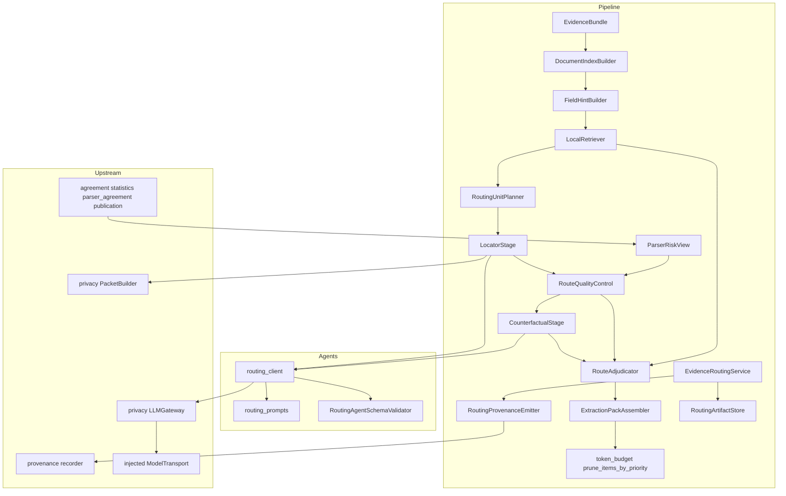
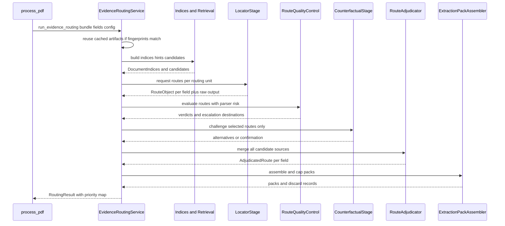
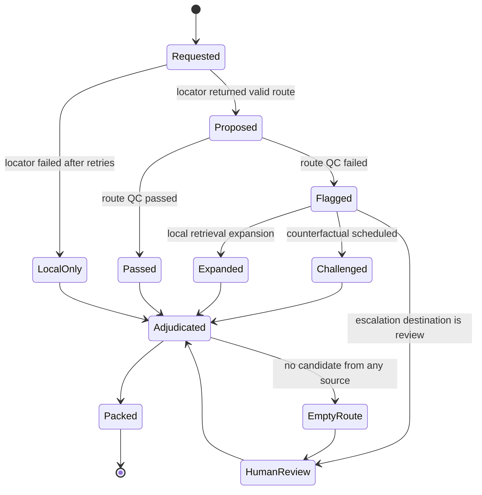
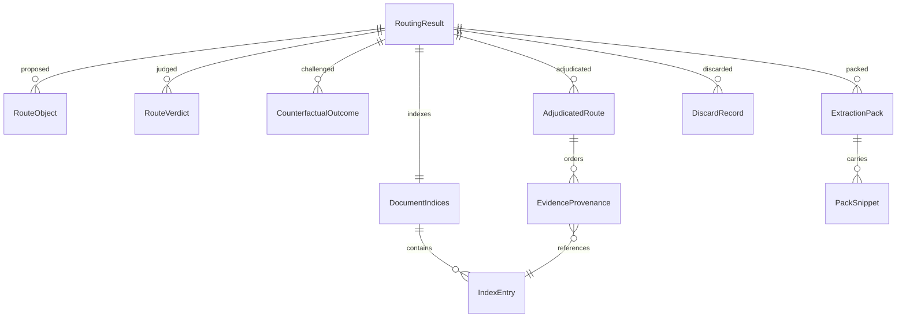

# Technical Design — evidence-routing

## Overview

**Purpose**: This feature delivers an explicit, audited routing layer between document parsing and value extraction. Every extraction field acquires a route — primary and backup evidence identifiers, page, section, confidence, risk flags, and a rationale — that is checked before extraction runs, challenged where it is weak, adjudicated deterministically, and assembled into a token-capped extraction pack whose discards are recorded.

**Users**: Biomedical reviewers and institutional evaluators who must attribute a wrong extraction to the location choice rather than to the extractor; operators who need routing cost bounded and reproducible.

**Impact**: Today `build_paper_evidence_package` selects evidence by a field-agnostic section score and nothing records why a passage was shown. After this change, a routing stage runs between the evidence bundle build and the package build inside `process_pdf`, produces per-field adjudicated routes and extraction packs, records every discarded identifier, and supplies a deterministic priority map that makes the shared per-paper package route-informed without changing its cache behavior.

### Goals

- Field-aware, reproducible evidence selection with a recorded reason for every included and every excluded identifier.
- Two model-driven stages (locator, counterfactual locator) fenced by deterministic stages on both sides, with the counterfactual gated rather than universal.
- A single pruning implementation shared with the completed token-efficient-extraction work, extended to record discards.
- No change to `_shared_paper_prefix` byte-stability across warmup, extraction chunks, and synthesis for a document.

### Non-Goals

- Deciding any field value, its confidence, or its correctness (`multiagent-extraction`).
- Computing agreement statistics, parser agreement metrics, or the parser-risky threshold (`agreement-statistics`).
- Defining evidence identity or the provenance graph (`provenance-core`).
- Re-tuning token budget thresholds, or providing a human review surface (`reviewer-ui`).

## Boundary Commitments

### This Spec Owns

- The four document indices (section, paragraph, table, caption) as projections over the existing evidence item list, and the record of which parser supplied table content.
- Field-specific retrieval hints and deterministic local candidate retrieval with recorded scores and contributing hint terms.
- The routing unit plan (field-group by default, per-field on failure or by configuration).
- The locator and counterfactual locator request/response contracts, their route object schema, their validation, repair, and escalation paths, and unconditional persistence of their raw output.
- Route quality control checks, verdicts, issue vocabulary, and the issue-to-destination escalation mapping.
- Consumption of published parser-risk page flags and the resulting stricter-handling and audit-escalation markings.
- Deterministic route adjudication, route provenance retention, and the adjudicated route ordering.
- Extraction pack assembly, its token cap, its deterministic trimming order, and the discard record.
- The generalized priority-aware pruning function in `token_budget.py`, and the discard records it now produces for every caller.
- The `evidence_routing` configuration section and its validation.
- Routing artifact persistence, resumability, and invalidation.
- The seven routing stage names, their declarations added to `provenance-core`'s `STAGE_CONTRACTS` and `STAGE_ORDER`, and the fixed stage-to-`DerivationKind` mapping table for them. The tables themselves are owned by `provenance-core`; this spec owns only the seven rows it adds.
- The adapter that converts `agreement-statistics`' published `metrics_hierarchy["parser_agreement"]` block — a **report container** whose `pairs` list holds one per-pair result, each carrying its own nested `pages` list of `PageAgreementRecord` dicts — into the page-indexed view `ParserRiskView` consumes. No other spec claims this conversion; `agreement-statistics` explicitly states it provides no index, no merge across pairs, and no per-page rollup, so this spec is the sole consumer and owns it.

### Out of Boundary

- Any field value, value confidence, verification verdict, or repair of a wrong answer.
- Computation of parser agreement metrics, page thresholds, parser-risky marking, or the skip and audit signals — read only.
- Evidence identifier construction, claim records, graph assembly, and chain validation — adopted from `provenance-core`.
- The token budget stage limits themselves, and the existing flat-text mitigation ladder's ordering.
- Rendering, exporting, or reporting any routing artifact.
- Providing the human review surface that a human-review escalation targets.
- The `DisclosureGate`, `PacketBuilder`, `LLMGateway`, `ModelTransport`, vendor approval, audit trail, and response scanning — owned by `privacy-core`. This feature receives a gateway and a packet builder by injection, constructs no provider client, and never imports `agents.openai.api_client`.
- The definition of `STAGE_CONTRACTS`, `STAGE_ORDER`, `DerivationKind`, and `Determinism` — owned by `provenance-core`; this feature only adds rows and selects members.
- Computation of `PageAgreementRecord` values or the `parser_agreement` publication shape — owned by `agreement-statistics`; this feature only reshapes what is published.

### Allowed Dependencies

- `src/pipeline/routing/` may import `pipeline.evidence_index`, `pipeline.token_budget`, `quality_control.models`, `text_processing`, `agents.openai.routing_client`, `utils.*`, `privacy.*` (for the injected `LLMGateway` / `PacketBuilder` types), and (once it exists) `provenance.*`.
- `src/agents/openai/routing_prompts.py`, `src/agents/openai/routing_client.py`, and `src/agents/routing_validator.py` may import only `agents.*`, `utils.*`, and the standard library. They must not import `pipeline`, `quality_control`, or `pdf_extractor`.
- **They must not import `privacy` at all — not at module level, and not under `if TYPE_CHECKING`.** `privacy-core` adds a `FORBIDDEN_PAIRS` entry "`agents` must not import `privacy`", enforced by an AST test that sees a `TYPE_CHECKING`-guarded import exactly as it sees a runtime one. The `LLMGateway`, `ModelTransport`, `PacketBuilder`, `EvidencePacket`, and `DisclosureDecision` types are therefore referenced **only as quoted forward-reference annotations** (`gateway: "LLMGateway"`, `packet: "EvidencePacket"`), exactly as `multiagent-extraction`'s `multiagent_client` does. The objects arrive by injection at runtime; the names are never resolved, and nothing under `src/agents/` depends on `privacy` being importable.
- **`routing_client.py` must not import `agents.openai.api_client`.** Per `privacy-core`'s agent-client rule, `api_client` has exactly one importer, `src/pipeline/privacy_wiring.py`. `routing_client` receives request construction, semaphore gating, the retry ladder, and backoff behind an injected `ModelTransport` and issues every call through `LLMGateway.send`.
- `quality_control` must not import anything from `pipeline.routing`.
- Heavy optional dependencies stay lazily imported inside function bodies.

### Revalidation Triggers

- Any change to `RouteObject`, `AdjudicatedRoute`, or `ExtractionPack` field names — `multiagent-extraction` consumes all three. `AdjudicatedRoute.resolved_confidence` in particular is gated on by that spec's `DualExtractionPolicy` rule `route_empty_or_low_confidence`.
- Any change to the `DiscardRecord` shape — `provenance-audit-export` and `cost-and-run-reporting` consume it.
- Any change to `prune_items_by_priority`'s signature or ordering semantics — the completed token-efficient-extraction synthesis path depends on it.
- Any change to which page-agreement field names are read, or to the shape of the `metrics_hierarchy["parser_agreement"]` publication this spec's adapter consumes — pinned by `agreement-statistics`. In particular the adapter reads `publication["pairs"][*]["pages"]`; the publication has **no top-level `pages` key**, and a change that moves the page records again must be revalidated here, because a silently absent key would make this adapter answer `unknown` for every page forever.
- Any change to how evidence identifiers are constructed — forbidden; identity is owned by `provenance-core`.
- Adding, removing, or reordering content inside `_shared_paper_prefix` — forbidden.
- **Against `privacy-core`**: `routing_client` is a new agent-client module under `src/agents/openai/`, and the routing index package and per-unit snippet blocks are new model-visible, document-derived payloads. Both are named revalidation triggers in `privacy-core`'s own design (its agent-client rule and Requirement 6.8). Three points require joint revalidation when either spec changes: (a) `routing_client` receives an injected `LLMGateway`, behind which the shared `ModelTransport` sits, and calls only `LLMGateway.send`, and `privacy-core`'s AST agent-client test must be revalidated against it; (b) `LLMGateway.send`'s and `ModelTransport.send`'s `kind` literal must be extended from `"warmup" | "chunk" | "synthesis"` to include `"locator"` and `"counterfactual_locator"`, since routing calls have no honest existing member; (c) `PacketBuilder.build`'s govern-once invariant must read, as `privacy-core` now states it, "**`build` is called at most once per distinct model-visible payload *instance*, and any payload carried by more than one call must be byte-identical across those calls**" — a per-payload-instance rule, not a per-document-total-of-one rule. Routing is admitted by that wording as written: it builds one document-level index packet instance, reused byte-identically across every routing call for the document, plus one instance per routing unit's snippet block and one per challenged route, each carried by exactly one call. What remains out of contract is rebuilding a payload that more than one call carries, which routing never does. None of the three may be worked around locally.
- **Against `provenance-core`**: the seven routing stage names must be present in `STAGE_CONTRACTS` and `STAGE_ORDER`, and every stage in the mapping table below must name a `DerivationKind` member that still exists in that spec's closed literal. A stage absent from `STAGE_CONTRACTS` raises `UnknownStageError` at record time.

## Architecture

### Existing Architecture Analysis

- `process_pdf` (`src/pipeline/pdf_processor.py`) builds the evidence bundle, computes `valid_location_ids`, prefills fields 1 and 2 from TEI, then serializes one paper-level package used by every chunk. Between the bundle build and the package build is the only point where structured evidence items and the full field list coexist; that is the insertion point.
- `token_budget.py` owns estimation, budget checking, and a flat-text mitigation ladder. `pdf_processor.py` owns the only identifier-aware pruner, used by the synthesis call site alone. Neither records discards.
- `_shared_paper_prefix` wraps exactly one variable, the serialized package. One package per paper is what makes it cache-stable.
- `EvidenceBundle.evidence_map` already provides identifier lookup; item identifiers are `S%06d`, `F%06d`, `T%06d`.
- `AgentSchemaValidator` establishes the "one schema file, one owner" pattern that the routing agent schema follows.
- Technical debt worked around: `section_path` is sticky across TEI divs lacking a heading, so index entries record whether the section path was explicit or inherited.

### Architecture Pattern & Boundary Map

Selected pattern: **deterministic-sandwich pipeline** — every model call is preceded and followed by a deterministic stage, so the model's contribution is always a proposal that a reproducible stage accepts, repairs, or rejects.



**Architecture Integration**:

- Domain boundaries: index and retrieval are pure functions over the bundle; the two agent stages own only request assembly and response validation; route QC, adjudication, and assembly are deterministic and model-free; the service owns sequencing, resumability, and configuration resolution.
- Existing patterns preserved: config loaded once and passed explicitly; schema validators as single-owner singletons; heavy dependencies lazily imported; all provider calls issued from `src/agents/` through `privacy-core`'s single governed egress path, never around it; deterministic ordering with stable identifier tie-breaks.
- New components rationale: each stage in the sandwich is separately testable and separately ablatable, which `evaluation-harness` R25.3 requires for the counterfactual stage specifically.
- Dependency direction: `models` → `config` → `indices`/`hints`/`parser_risk` → `retrieval` → `locator`/`counterfactual` → `route_qc` → `adjudicator` → `pack` → `provenance_emit` → `service`. Each module imports only from modules to its left.

### Technology Stack

| Layer | Choice / Version | Role in Feature | Notes |
|-------|------------------|-----------------|-------|
| Backend / Services | Python 3.12, `dataclasses`, `asyncio` | All routing stages; agent stages are `async` | Matches existing pipeline |
| Model provider | `privacy-core`'s `LLMGateway` over an injected `ModelTransport` | Locator and counterfactual locator calls | Request construction, semaphore gating, retry ladder and backoff arrive behind the transport; `api_client` is never imported |
| Disclosure governance | `privacy-core`'s `PacketBuilder` and `DisclosureGate` | Every model-visible, document-derived routing payload | Index package and per-unit snippet blocks are packets, not raw strings |
| Schema validation | `jsonschema` Draft 7 (already a dependency) | Route object schema validation | New `configs/routing_agent_schema.json`, single owner |
| Data / Storage | JSON artifacts under the run output directory | Raw agent output, routes, verdicts, packs, discards | Same atomic-write helper as existing outputs |
| Text matching | `text_processing` tokenizers and normalizers | Hint term matching in local retrieval | No new dependency; no embeddings in this spec |

No new third-party dependency is introduced.

## File Structure Plan

### Directory Structure

```
src/pipeline/routing/
├── __init__.py            # Public surface: run_evidence_routing, RoutingResult
├── models.py              # All routing dataclasses and literal vocabularies
├── config.py              # RoutingConfig resolution, defaults, validation
├── indices.py             # DocumentIndexBuilder: four indices over EvidenceBundle
├── hints.py               # FieldHintBuilder: per-field retrieval hints
├── retrieval.py           # LocalRetriever: deterministic ranked candidates
├── units.py               # RoutingUnitPlanner: field-group vs per-field units
├── parser_risk.py         # ParserRiskView: adapter over page agreement records
├── locator.py             # LocatorStage: request, validate, repair, escalate
├── counterfactual.py      # CounterfactualStage: gating and challenge handling
├── route_qc.py            # RouteQualityControl: checks, verdicts, destinations
├── adjudicator.py         # RouteAdjudicator: deterministic merge and ordering
├── pack.py                # ExtractionPackAssembler: pack build, cap, trim
├── provenance_emit.py     # RoutingProvenanceEmitter: derivation records
├── store.py               # RoutingArtifactStore: persistence, reuse, invalidation
└── service.py             # EvidenceRoutingService: sequencing and orchestration

src/agents/openai/
├── routing_prompts.py     # Stable prefixes and message builders for both agents
└── routing_client.py      # async request_routes, request_counterfactual

src/agents/
└── routing_validator.py   # RoutingAgentSchemaValidator singleton owner

configs/
├── routing_agent_schema.json   # Routing system prompts, policies, route JSON Schema
└── config.yaml                 # New evidence_routing section
```

### Modified Files

- `src/pipeline/token_budget.py` — add `PruneOutcome`, `DiscardRecord`, and `prune_items_by_priority(...)`, the single identifier-aware pruner. Existing flat-text `_prune_evidence` and `apply_mitigation` ordering are unchanged.
- `src/pipeline/pdf_processor.py` — `_prune_evidence_json_preserving_protected` becomes a thin wrapper over `prune_items_by_priority` with identical behavior and signature; `process_pdf` awaits `run_evidence_routing` between the bundle build and the package build, persists routing artifacts, and passes the priority map into `build_paper_evidence_package`. It also reads `unified.metrics_hierarchy.get("parser_agreement")` and forwards that published block — unmodified — to `run_evidence_routing`, which converts it through this spec's adapter (see `ParserRiskView.from_publication`). `process_pdf` forwards the `LLMGateway` and `PacketBuilder` it already holds for the extraction calls; it constructs neither.
- `src/provenance/contracts.py` (owned by `provenance-core`) — **extends `STAGE_CONTRACTS` and `STAGE_ORDER`** with the seven routing stages, in this order, inserted after the evidence-index stage and before the extraction stages: `routing_index_build`, `routing_local_retrieval`, `routing_locator`, `routing_route_qc`, `routing_counterfactual`, `routing_adjudication`, `routing_pack_assembly`. Without these rows every routing emission raises `UnknownStageError`, because `STAGE_CONTRACTS` is a closed table. Each row declares the `derivation` record kind at `document` scope.
- `src/pipeline/evidence_index.py` — `build_paper_evidence_package` gains an optional `route_priority: Mapping[str, int] | None = None` parameter used only as the primary sort key; when `None`, output is byte-identical to today.
- `src/agents/__init__.py` — construct and export the `routing_agent_schema_validator` singleton.
- `src/agents/openai/telemetry.py` — record routing calls under the new stage labels `locator` and `counterfactual_locator` so prefix-drift and cost reporting cover the new stages. Stage labels are **open strings, not an enumerated set**: `cost-and-run-reporting` Requirement 4.9 requires an unrecognized stage label to be reported as-is with no allowlist, so no enum, `Literal`, or membership check may be introduced here. Any existing name list is documentation of the labels in use, never a gate on which labels are accepted.
- `src/utils/config_utils.py` — register `evidence_routing` in `_ALL_KNOWN_TOP_LEVEL_KEYS`; add `load_routing_config`.
- `src/utils/path_utils.py` — add resolvers for the routing artifact directory.
- `src/privacy/gateway.py` (owned by `privacy-core`) — the `kind` literal on `ModelTransport.send` and `LLMGateway.send` gains `"locator"` and `"counterfactual_locator"`. This is the minimum change that lets routing calls cross the single egress path honestly rather than mislabelling themselves as `"chunk"`.
- `src/pipeline/privacy_wiring.py` (owned by `privacy-core`) — adapts the two routing request kinds `"locator"` and `"counterfactual_locator"` onto the `ModelTransport` protocol and supplies the assembled `LLMGateway` to `run_evidence_routing`. `privacy-core` owns the file; this feature contributes the two request kinds it must carry. Declared in the same form as `multiagent-extraction`'s contribution, so both downstream specs state the cross-boundary edit identically.
- `tests/test_dependency_directions.py` — assert `agents.openai.routing_*` and `agents.routing_validator` import nothing from `pipeline`, `quality_control`, `pdf_extractor`, or `privacy` (the last being `privacy-core`'s own `FORBIDDEN_PAIRS` entry, which this spec must not force an exception to), **and that `routing_client` does not import `agents.openai.api_client`**, keeping `privacy-core`'s single-importer rule satisfiable.

## System Flows

### Per-document routing sequence



Gating decisions: the locator is invoked once per routing unit; the counterfactual is invoked only for routes selected by requirement 8.1's rules and never beyond the per-document call bound; adjudication and assembly always run, including for units whose locator call failed, so that local retrieval alone still produces a route.

### Route lifecycle



## Requirements Traceability

| Requirement | Summary | Components | Interfaces | Flows |
|-------------|---------|------------|------------|-------|
| 1.1, 1.2, 1.4, 1.7 | Four indices, entry metadata, single representation, determinism | DocumentIndexBuilder | `build_indices` | Routing sequence |
| 1.3 | Adopt pipeline identifiers | DocumentIndexBuilder, RoutingProvenanceEmitter | `IndexEntry.evidence_id` | Routing sequence |
| 1.5 | Table content parser fallback recorded | DocumentIndexBuilder | `IndexEntry.content_source` | Routing sequence |
| 1.6 | Index-unavailable state | DocumentIndexBuilder, EvidenceRoutingService | `IndexUnavailable` | Routing sequence |
| 2.1 | Field hints from schema | FieldHintBuilder | `build_hints` | Routing sequence |
| 2.2, 2.3, 2.7 | Ranked candidates with scores and contributing terms, deterministic | LocalRetriever | `retrieve` | Routing sequence |
| 2.4, 2.5 | Hints not answers; unused candidates retained | LocatorStage, RouteAdjudicator | `RetrievalCandidate` | Route lifecycle |
| 2.6 | No-local-candidate state | LocalRetriever | `RetrievalOutcome` | Routing sequence |
| 3.1, 3.2, 3.4, 3.5 | Group-by-default granularity, per-field routes, recorded | RoutingUnitPlanner | `plan_units` | Routing sequence |
| 3.3 | Per-field re-request on QC failure | RoutingUnitPlanner, LocatorStage | `plan_refinement_units` | Route lifecycle |
| 3.6 | Prefilled fields excluded | RoutingUnitPlanner | `ExcludedField` | Routing sequence |
| 4.1, 4.6, 4.7 | Locator inputs bounded, single governed call path | LocatorStage, routing_client | `request_routes` via `LLMGateway.send` | Routing sequence |
| 4.2 | No values from locator | LocatorStage, RoutingAgentSchemaValidator | `ContractViolation` | Route lifecycle |
| 4.3 | Route object content | models, RoutingAgentSchemaValidator | `RouteObject` | Routing sequence |
| 4.4 | Absence-verification routes | LocatorStage | `RouteObject.route_kind` | Route lifecycle |
| 4.5 | Identifier existence check | LocatorStage | `validate_identifiers` | Route lifecycle |
| 5.1, 5.2, 5.3 | Schema validation, bounded repair, escalation | LocatorStage | `request_routes_with_repair` | Route lifecycle |
| 5.4 | Invalid identifier dropped individually | LocatorStage | `validate_identifiers` | Route lifecycle |
| 5.5, 5.6, 5.7 | Raw output persisted and linked; failure tolerated | RoutingArtifactStore | `write_raw_output` | Routing sequence |
| 6.1, 6.2, 6.3, 6.5, 6.7, 6.8 | Coverage, issue detection, plausibility, verdicts, determinism | RouteQualityControl | `evaluate` | Route lifecycle |
| 6.4 | Critical fields need backup or challenge | RouteQualityControl | `evaluate` | Route lifecycle |
| 6.6 | Issue-to-destination mapping | RouteQualityControl, RoutingConfig | `EscalationDestination` | Route lifecycle |
| 7.1, 7.2, 7.6 | Attach risk, mark stricter handling, unknown default | ParserRiskView, RouteQualityControl | `from_publication`, `risk_for` | Route lifecycle |
| 7.3, 7.4, 7.5 | Audit scheduling, skip signal honored | CounterfactualStage | `select_routes` | Route lifecycle |
| 7.7 | Never recompute metrics | ParserRiskView | read-only adapter | Boundary |
| 8.1, 8.2 | Gating rules and recorded selection | CounterfactualStage | `select_routes` | Route lifecycle |
| 8.3, 8.4, 8.5 | Inputs, no values, alternatives or confirmation | CounterfactualStage, routing_client | `request_counterfactual` | Routing sequence |
| 8.6 | Alternatives go to adjudication | CounterfactualStage, RouteAdjudicator | `CounterfactualOutcome` | Route lifecycle |
| 8.7 | Raw output persisted and linked | RoutingArtifactStore | `write_raw_output` | Routing sequence |
| 8.8 | Failure retains original route | CounterfactualStage | `CounterfactualOutcome` | Route lifecycle |
| 9.1, 9.3, 9.5, 9.7 | Single merged route, dedup, model-free, deterministic | RouteAdjudicator | `adjudicate` | Route lifecycle |
| 9.2, 9.6 | Source provenance, decision rule, and carried confidence recorded | RouteAdjudicator | `EvidenceProvenance`, `AdjudicatedRoute.resolved_confidence` | Route lifecycle |
| 9.4 | Ordering policy | RouteAdjudicator | `PRIORITY_TIERS` | Route lifecycle |
| 9.8 | Empty-route record | RouteAdjudicator | `AdjudicatedRoute.is_empty` | Route lifecycle |
| 10.1, 10.2 | Pack content and quote policy | ExtractionPackAssembler | `assemble` | Routing sequence |
| 10.3, 10.7 | Shared estimator, single pruner | ExtractionPackAssembler, token_budget | `prune_items_by_priority` | Routing sequence |
| 10.4, 10.5, 10.8 | Deterministic trim order, discard records | token_budget, ExtractionPackAssembler | `PruneOutcome` | Routing sequence |
| 10.6 | Critical primary never trimmed | ExtractionPackAssembler | `non_droppable` | Routing sequence |
| 11.1, 11.2, 11.4 | Derivation records with removal and model identity | RoutingProvenanceEmitter | `emit_stage` | Routing sequence |
| 11.3 | Single evidence identity | RoutingProvenanceEmitter | `format_evidence_id` | Boundary |
| 11.5, 11.7 | Queryable data, no reports | RoutingResult, RoutingArtifactStore | `RoutingResult` | Routing sequence |
| 11.6 | Provenance optional | RoutingProvenanceEmitter | `enabled` flag | Routing sequence |
| 12.1, 12.2, 12.3 | Shared prefix untouched, own stable prefixes | routing_prompts | `_shared_routing_prefix` | Routing sequence |
| 12.4, 12.5 | Call accounting and per-document bound | CounterfactualStage, EvidenceRoutingService | `RoutingCallLedger` | Routing sequence |
| 12.6 | Existing concurrency and retry, inherited via the injected transport | routing_client | `request_routes`, `ModelTransport` | Routing sequence |
| 13.1, 13.2, 13.3 | Config surface, defaults recorded, invalid rejected | RoutingConfig | `load_routing_config` | Routing sequence |
| 13.4 | Disabled path | EvidenceRoutingService | `run_evidence_routing` | Routing sequence |
| 13.5, 13.6 | Field and document failure isolation | EvidenceRoutingService | `RoutingResult.failures` | Routing sequence |
| 13.7, 13.8 | Resume and invalidate | RoutingArtifactStore | `load_if_valid` | Routing sequence |

## Components and Interfaces

| Component | Domain/Layer | Intent | Req Coverage | Key Dependencies (P0/P1) | Contracts |
|-----------|--------------|--------|--------------|--------------------------|-----------|
| RoutingModels | Types | All routing dataclasses and vocabularies | 1, 2, 3, 4, 8, 9, 10 | none | State |
| RoutingConfig | Config | Resolve, default, validate routing settings | 13 | config_utils (P0) | Service, State |
| DocumentIndexBuilder | Retrieval | Four indices over the evidence bundle | 1 | evidence_index (P0) | Service |
| FieldHintBuilder | Retrieval | Per-field retrieval hints from the schema | 2 | text_processing (P1) | Service |
| LocalRetriever | Retrieval | Deterministic ranked candidates per unit | 2 | DocumentIndexBuilder (P0) | Service |
| RoutingUnitPlanner | Planning | Group vs field units, exclusions, refinement | 3 | RoutingConfig (P0) | Service |
| ParserRiskView | Signals | Read-only adapter over page agreement records | 7 | agreement-statistics (P1) | Service, State |
| RoutingAgentSchemaValidator | Agents | Sole owner of the routing agent schema file | 4, 5, 8 | jsonschema (P0) | Service |
| routing_prompts | Agents | Stable prefixes and message builders | 12 | RoutingAgentSchemaValidator (P0) | Service |
| routing_client | Agents | Async locator and counterfactual calls through the governed egress path | 4, 8, 12 | privacy-core `LLMGateway` + injected `ModelTransport` (P0) | Service |
| LocatorStage | Agent stage | Request, validate, repair, escalate routes | 4, 5 | routing_client (P0) | Service |
| RouteQualityControl | Determinism | Route checks, verdicts, destinations | 6, 7 | ParserRiskView (P0) | Service |
| CounterfactualStage | Agent stage | Gated challenge of weak or critical routes | 7, 8, 12 | routing_client (P0) | Service |
| RouteAdjudicator | Determinism | Merge candidates into one route per field | 9 | RoutingModels (P0) | Service |
| ExtractionPackAssembler | Determinism | Build, cap, and trim packs; record discards | 10 | token_budget (P0) | Service |
| RoutingProvenanceEmitter | Provenance | Derivation records for every routing stage | 11 | provenance-core (P1) | Service |
| RoutingArtifactStore | Persistence | Persist, reuse, invalidate routing artifacts | 5, 8, 11, 13 | path_utils (P0) | Batch, State |
| EvidenceRoutingService | Orchestration | Sequence stages, isolate failures, account calls | 12, 13 | all above (P0) | Service |

### Types Layer

#### RoutingModels

| Field | Detail |
|-------|--------|
| Intent | Single definition of every routing dataclass and vocabulary |
| Requirements | 1.2, 1.5, 2.3, 2.6, 3.5, 3.6, 4.3, 4.4, 6.2, 6.7, 8.5, 9.2, 9.4, 9.8, 10.1, 10.5 |

**Responsibilities & Constraints**
- All dataclasses are frozen; every collection field is a tuple so artifacts are hashable and safely shareable across `asyncio` tasks.
- Evidence is referenced by the bare pipeline-local identifier (`S000123`, `T000004`). The scoped provenance identifier is constructed only at emission time via `provenance.format_evidence_id`; no routing type stores a scoped identifier.
- Vocabularies are `Literal` types so an unknown value is a type error rather than a silent string.

**Contracts**: State [x]

##### State Management

```python
EvidenceKind = Literal["section", "paragraph", "table", "caption"]
ContentSource = Literal["tei", "structural_blocks"]
SectionPathOrigin = Literal["explicit_heading", "inherited"]
RouteKind = Literal["located", "absence_verification"]
RouteConfidence = Literal["high", "medium", "low"]
CandidateSource = Literal["locator_primary", "locator_backup", "counterfactual", "local_retrieval"]
ParserRiskState = Literal["risky", "safe_to_skip", "audit_recommended", "unknown"]
EscalationDestination = Literal["counterfactual", "local_expansion", "human_review", "none"]
RouteStatus = Literal["passed", "flagged", "local_only", "empty"]
DiscardReason = Literal["token_cap", "quote_shortened", "quote_dropped", "invalid_identifier", "duplicate"]
Granularity = Literal["group", "field"]

@dataclass(frozen=True)
class IndexEntry:
    evidence_id: str                       # pipeline identifier, verbatim (1.3)
    kind: EvidenceKind                     # (1.2)
    page: int | None
    section_path: str
    section_path_origin: SectionPathOrigin
    ordinal: int                           # position in document order (1.2)
    memberships: tuple[EvidenceKind, ...]  # every index it belongs to (1.4)
    content_source: ContentSource          # which parser supplied the content (1.5)
    char_length: int

@dataclass(frozen=True)
class DocumentIndices:
    document_id: str
    entries: Mapping[str, IndexEntry]
    by_kind: Mapping[EvidenceKind, tuple[str, ...]]
    outline: tuple[tuple[str, int | None], ...]     # section path, first page
    unavailable_reason: str | None                   # (1.6)

@dataclass(frozen=True)
class FieldHints:
    field_index: int
    terms: tuple[str, ...]
    expected_kinds: tuple[EvidenceKind, ...]
    expected_sections: tuple[str, ...]
    value_format: str

@dataclass(frozen=True)
class RetrievalCandidate:
    evidence_id: str
    score: int
    matched_terms: tuple[str, ...]          # (2.3)

@dataclass(frozen=True)
class RetrievalOutcome:
    field_index: int
    candidates: tuple[RetrievalCandidate, ...]
    no_candidate_reason: str | None          # (2.6)

@dataclass(frozen=True)
class RoutingUnit:
    unit_id: str
    granularity: Granularity                 # (3.5)
    group_name: str | None
    field_indices: tuple[int, ...]

@dataclass(frozen=True)
class ExcludedField:
    field_index: int
    reason: str                              # (3.6)

@dataclass(frozen=True)
class RouteObject:
    field_index: int
    route_kind: RouteKind                    # (4.4)
    primary_evidence_ids: tuple[str, ...]
    backup_evidence_ids: tuple[str, ...]
    pages: tuple[int, ...]
    section_names: tuple[str, ...]
    confidence: RouteConfidence
    risk_flags: tuple[str, ...]
    rationale: str

@dataclass(frozen=True)
class RouteIssue:
    code: str
    field_index: int
    detail: str
    offending_ids: tuple[str, ...] = ()

@dataclass(frozen=True)
class RouteVerdict:
    field_index: int
    passed: bool
    issues: tuple[RouteIssue, ...]
    destination: EscalationDestination
    parser_risk: ParserRiskState
    requires_stricter_handling: bool         # (7.2)

@dataclass(frozen=True)
class CounterfactualOutcome:
    field_index: int
    completed: bool
    confirmed_original: bool
    alternative_evidence_ids: tuple[str, ...]
    trigger_rule: str
    failure_reason: str | None

@dataclass(frozen=True)
class EvidenceProvenance:
    evidence_id: str
    sources: tuple[CandidateSource, ...]     # every proposing source (9.3)
    ranks: tuple[int, ...]
    retained_by_rule: str                    # (9.2)
    tier: int

@dataclass(frozen=True)
class AdjudicatedRoute:
    field_index: int
    status: RouteStatus
    ordered_evidence: tuple[EvidenceProvenance, ...]
    primary_evidence_ids: tuple[str, ...]
    resolved_confidence: RouteConfidence     # carried from the adjudicated RouteObject
    decision_rule: str                       # (9.6)
    parser_risk: ParserRiskState
    requires_stricter_handling: bool
    is_critical: bool
    empty_reason: str | None                 # (9.8)

@dataclass(frozen=True)
class PackSnippet:
    evidence_id: str
    kind: EvidenceKind
    page: int | None
    section: str
    text: str | None                         # None means identifier-only (10.2)

@dataclass(frozen=True)
class ExtractionPack:
    unit_id: str
    field_definitions: tuple[Mapping[str, Any], ...]
    snippets: tuple[PackSnippet, ...]
    route_trace: tuple[AdjudicatedRoute, ...]
    parser_risk_flags: Mapping[str, ParserRiskState]
    document_metadata: Mapping[str, Any]
    estimated_tokens: int
    oversize_field_indices: tuple[int, ...]  # (10.6)

@dataclass(frozen=True)
class RoutingCallLedger:
    locator_calls: int
    counterfactual_calls: int
    counterfactual_suppressed: int           # (12.5)
    triggers: Mapping[int, str]

@dataclass(frozen=True)
class RoutingResult:
    document_id: str
    enabled: bool
    indices: DocumentIndices
    routes: Mapping[int, RouteObject]
    verdicts: Mapping[int, RouteVerdict]
    counterfactuals: Mapping[int, CounterfactualOutcome]
    adjudicated: Mapping[int, AdjudicatedRoute]
    packs: tuple[ExtractionPack, ...]
    discards: tuple["token_budget.DiscardRecord", ...]
    excluded_fields: tuple[ExcludedField, ...]
    call_ledger: RoutingCallLedger
    effective_config: Mapping[str, Any]      # (13.2)
    failures: Mapping[int, str]              # per-field failures (13.5)
    document_failure: str | None             # (13.6)

    def priority_map(self) -> Mapping[str, int]: ...
```

**Implementation Notes**
- Validation: a test asserts every routing dataclass is frozen and that no field name collides with a `provenance-core` node field name.
- Risks: drift between `RouteObject` here and the JSON Schema in `configs/routing_agent_schema.json` — mitigated by a test that round-trips a `RouteObject` through the schema.

### Config Layer

#### RoutingConfig

| Field | Detail |
|-------|--------|
| Intent | Resolve, default, and validate every routing setting once per run |
| Requirements | 13.1, 13.2, 13.3, 13.4 |

**Responsibilities & Constraints**
- The `evidence_routing` top-level key must be registered in `_ALL_KNOWN_TOP_LEVEL_KEYS` or `load_local_config` raises `ValueError`; that registration is part of this component's work.
- Validation is strict and up front: an out-of-range threshold, a non-positive limit, an unknown granularity, or an unknown escalation destination raises before any stage runs (13.3).
- The fully resolved mapping, including every defaulted value, is carried on `RoutingResult.effective_config` (13.2).
- No value is read from configuration after resolution; the resolved object is passed explicitly, per the no-global-mutation rule.

**Dependencies**
- Outbound: `utils.config_utils` (P0)

**Contracts**: Service [x] / State [x]

##### Service Interface

```python
@dataclass(frozen=True)
class RoutingConfig:
    enabled: bool = True
    granularity: Granularity = "group"
    hint_sources: tuple[str, ...] = ("field_name", "definition", "reviewer_question", "format")
    synonyms: Mapping[str, tuple[str, ...]] = field(default_factory=dict)
    expected_locations: Mapping[str, tuple[str, ...]] = field(default_factory=dict)
    min_candidate_score: int = 1
    max_candidates_per_field: int = 20
    locator_model: str | None = None
    counterfactual_model: str | None = None
    locator_max_retries: int = 2
    counterfactual_max_retries: int = 1
    locator_failure_destination: EscalationDestination = "local_expansion"
    counterfactual_confidence_threshold: RouteConfidence = "low"
    max_counterfactual_calls_per_document: int = 12
    issue_destinations: Mapping[str, EscalationDestination] = field(default_factory=dict)
    default_criticality: bool = False
    max_snippet_chars: int = 400
    pack_token_cap: int = 20_000
    artifact_dir: str = "outputs/routing"

def load_routing_config(config: Mapping[str, Any] | None) -> RoutingConfig: ...
```

- Preconditions: `config` is the already-loaded run configuration mapping.
- Postconditions: every returned field is populated; defaults applied are recorded in the returned object's `as_dict()` output.
- Errors: `RoutingConfigError` naming the setting and the invalid value (13.3).

**Implementation Notes**
- Integration: `load_routing_config` mirrors `load_budgets`'s tolerant-vs-strict split — unknown keys are rejected, missing keys default.
- Validation: table-driven tests over each invalid value class.

### Retrieval Layer

#### DocumentIndexBuilder

| Field | Detail |
|-------|--------|
| Intent | Project the evidence bundle into four indices without re-parsing |
| Requirements | 1.1, 1.2, 1.3, 1.4, 1.5, 1.6, 1.7 |

**Responsibilities & Constraints**
- Kind mapping: bundle `type == "table"` → `table`; `type == "figure_caption"` → `caption`; `type == "sentence"` → `paragraph` when the item originated from a TEI `<p>` and `sentence`-level otherwise. Because the existing item dict does not distinguish the two, the builder derives paragraph membership from the absence of a sentence sibling in the same `xpath` prefix and records the derivation; every sentence-kind entry is also a member of the enclosing section entry.
- Section entries are synthesized one per distinct `section_path` in document order, carrying the first page on which that path appears; they are the only entries the builder creates rather than projects, and they carry no text of their own.
- `section_path_origin` is `explicit_heading` when the path changed at this entry and `inherited` otherwise, which exposes the known TEI stickiness rather than hiding it.
- Table fallback (1.5): when a `table` entry's text is empty and the structural block parser supplies a table candidate on the same page, the entry takes that content and sets `content_source = "structural_blocks"`. The same substitution applies when `ParserRiskView` reports table-detection disagreement for the page. No other substitution is permitted.
- An entry appearing in several indices is stored once, keyed by `evidence_id`, with `memberships` listing the indices (1.4).
- When the bundle has no items, or no item carries a section path or page, the builder returns `DocumentIndices` with `unavailable_reason` set and empty indices (1.6); the service then records the document as routing-failed.
- Pure and total: no I/O, no clock, no randomness (1.7).

**Dependencies**
- Inbound: EvidenceRoutingService (P0)
- Outbound: `pipeline.evidence_index.EvidenceBundle` (P0), `quality_control.models.UnifiedRecord` structural layer for table candidates (P1)

**Contracts**: Service [x]

##### Service Interface

```python
def build_indices(
    bundle: EvidenceBundle,
    *,
    document_id: str,
    structural_tables: Mapping[int, Sequence[str]] | None = None,
    risk: "ParserRiskView | None" = None,
) -> DocumentIndices: ...
```

- Preconditions: `bundle.evidence_items` entries carry `id`, `type`, `section_path`.
- Postconditions: `entries` keys are exactly the bundle identifiers plus the synthesized section identifiers; identical inputs yield an equal result.
- Invariants: no identifier is ever constructed for an existing evidence item.
- Errors: none — an unusable bundle yields `unavailable_reason`, not an exception.

**Implementation Notes**
- Validation: property test asserting `set(entries) ⊇ set(bundle.evidence_map)` and that repeated builds are equal.
- Risks: paragraph-vs-sentence derivation is heuristic; recorded in `IndexEntry.memberships` so route QC can reason about it rather than assuming.

#### FieldHintBuilder

| Field | Detail |
|-------|--------|
| Intent | Turn each extraction field definition into matchable retrieval terms |
| Requirements | 2.1 |

**Responsibilities & Constraints**
- Terms are drawn from the configured hint sources, normalized and tokenized through `text_processing` (the same normalizer the pipeline already uses), lowercased, deduplicated, and sorted for determinism.
- Configured synonyms and expected evidence locations are merged in per field index or per domain group.
- `expected_kinds` is derived from the field's declared format: numeric and cardinality formats add `table`; formats naming a figure add `caption`; all fields include `paragraph` and `section`.
- Builds no candidates and reads no document content.

**Contracts**: Service [x]

##### Service Interface

```python
def build_hints(fields: Sequence[Mapping[str, Any]], config: RoutingConfig) -> Mapping[int, FieldHints]: ...
```

- Postconditions: one `FieldHints` per input field; term tuples are sorted and deduplicated.

#### LocalRetriever

| Field | Detail |
|-------|--------|
| Intent | Deterministic per-field ranked candidates over the indices |
| Requirements | 2.2, 2.3, 2.5, 2.6, 2.7 |

**Responsibilities & Constraints**
- Score for an entry against a field: the entry's existing section score, plus a fixed weight per matched hint term, plus a kind bonus when the entry's kind is in `expected_kinds`, plus a section bonus when its section path matches `expected_sections`. The weights are constants in this module, not configuration, so scoring stays reproducible across deployments.
- Ordering is `(-score, evidence_id)`, mirroring the existing package builder's tie-break so the two orderings never disagree.
- Truncates at `max_candidates_per_field`; entries scoring below `min_candidate_score` are excluded, and a field with no surviving candidate yields `no_candidate_reason` (2.6).
- Retains the full candidate list on the outcome so adjudication can later consider candidates the locator ignored (2.5).
- No embeddings, no model call, no I/O (2.7).

**Contracts**: Service [x]

##### Service Interface

```python
def retrieve(
    indices: DocumentIndices,
    hints: Mapping[int, FieldHints],
    config: RoutingConfig,
) -> Mapping[int, RetrievalOutcome]: ...
```

- Postconditions: candidate order is total and identical for identical inputs; `matched_terms` is non-empty for any candidate whose score exceeds its base section score.

### Planning Layer

#### RoutingUnitPlanner

| Field | Detail |
|-------|--------|
| Intent | Decide what a single routing request covers |
| Requirements | 3.1, 3.2, 3.3, 3.4, 3.5, 3.6 |

**Responsibilities & Constraints**
- Default granularity is `group`, using the extraction schema's `domain_group` values in ascending `field_index` order; `unit_id` is the group name for group units and `f{field_index}` for field units (3.1, 3.4).
- Fields pre-filled by the pipeline without a model call are excluded before planning and recorded with a reason (3.6).
- `plan_refinement_units` produces one field unit per flagged field, never a group unit (3.3).
- Records the effective granularity so it travels with the routes (3.5). The per-field-route requirement itself (3.2) is enforced by `LocatorStage` against this plan.

**Contracts**: Service [x]

##### Service Interface

```python
def plan_units(
    fields: Sequence[Mapping[str, Any]],
    prefilled_field_indices: AbstractSet[int],
    config: RoutingConfig,
) -> tuple[tuple[RoutingUnit, ...], tuple[ExcludedField, ...]]: ...

def plan_refinement_units(field_indices: Sequence[int]) -> tuple[RoutingUnit, ...]: ...
```

- Postconditions: every non-excluded field appears in exactly one planned unit.

### Signals Layer

#### ParserRiskView

| Field | Detail |
|-------|--------|
| Intent | Read-only adapter over the page agreement records published by `agreement-statistics` |
| Requirements | 7.1, 7.3, 7.4, 7.5, 7.6, 7.7 |

**Responsibilities & Constraints**
- Accepts a mapping of page number to a page-agreement record mapping and reads only `parser_risky`, `skip_parser_counterfactual`, `counterfactual_audit_recommended`, `failing_metrics`, `thresholds_in_effect`, and `unavailable_signals`. It computes nothing and mutates nothing (7.7).
- Resolution order per page: `risky` when `parser_risky`; else `audit_recommended` when `counterfactual_audit_recommended`; else `safe_to_skip` when `skip_parser_counterfactual`; else `unknown`. A page absent from the mapping, and any evidence entry whose `page is None`, resolve to `unknown` (7.6).
- Default construction is empty, so routing runs correctly before `agreement-statistics` ships; the empty case is the specified unknown behavior, not a stub.
- Exposes the reason a page was marked risky so route QC can attach it to the route (7.1).

**Publication adapter (owned here).** `agreement-statistics` does not publish a page-indexed mapping. It publishes, under `ctx.metrics_hierarchy["parser_agreement"]`, a **report container** of the form

```
{"report_version", "status", "undefined_reason",
 "primary_pair", "primary_pair_basis", "available_pairs",
 "pairs": [ {"parser_a", "parser_b", "status", "undefined_reason",
             "pages": [ …PageAgreementRecord dicts… ],
             "single_parser_pages", "thresholds_in_effect"}, … ],
 "thresholds_in_effect"}
```

There is **no top-level `pages` key**: the page records live one level down, at `publication["pairs"][*]["pages"]`, one `pairs` entry per analyzed parser pair and one `pages` entry per shared page within that pair. `quality_control.parser_agreement.enabled` defaults to `false`, in which case the published block is `{"status": "skipped", "pairs": []}`. Only the *nesting* differs from the per-record shape this component reads — `PageAgreementRecord` still carries `page_index`, `parser_a`, `parser_b`, `parser_risky`, `skip_parser_counterfactual`, `counterfactual_audit_recommended`, `failing_metrics`, `thresholds_in_effect`, and `unavailable_signals`, so no field name changes here. No other spec converts the container into the shape this component consumes, so this spec owns the conversion. `ParserRiskView.from_publication` is that adapter, and its behaviour is fully specified:

  - **Absent key, `None`, non-mapping, or a mapping whose `status` is anything other than `"computed"`** (`"skipped"` when the feature is disabled, `"undefined"` when only one parser ran) yields an **empty view**. Every page then resolves to `unknown`. It never resolves to `safe_to_skip`: an absent signal is an absent signal, and 7.6 forbids treating it as safe. The reason the view is empty (`absent`, `skipped`, `undefined:<undefined_reason>`, `malformed`) is retained on the view and surfaced on `RoutingResult.effective_config` so an operator can tell "no risk found" apart from "risk never measured".
  - **`status == "computed"`** iterates `publication["pairs"]` and, within each pair result, its nested `pages` list, grouping every record it finds by `page_index` (the record's page key; a record missing or carrying a non-integer `page_index` is skipped with a WARNING and does not fail routing). A `pairs` value that is absent or not a list, and a pair entry that is not a mapping or whose `pages` is not a list, are each treated as contributing no records — a top-level `"computed"` status with no usable pair therefore yields an empty view with reason `malformed`, never a silent all-`unknown` view that looks like a successful read. A pair entry whose own `status` is not `"computed"` contributes no records; its exclusion is not an error, because the container status can be `"computed"` while an individual pair is `"undefined"`.
  - **All pairs are merged, not just one.** Records for the same page that came from different `pairs` entries are combined by **most-severe, never last-wins**: `parser_risky` is the logical OR across the contributing records; `counterfactual_audit_recommended` is the logical OR; `skip_parser_counterfactual` is the logical **AND**, so one pair declining to skip suppresses the skip signal for the page; `failing_metrics` and `unavailable_signals` are the sorted union; `thresholds_in_effect` is retained per contributing pair under that pair's `parser_a`/`parser_b` identity, since a threshold set is only meaningful against the pair it was applied to. The merge direction is chosen so that combining evidence can only make a page look *less* safe. This is the pre-existing merge rule, restated against the published nesting: it already assumed several records per page from several pairs, and the only change is where those records are read from.
  - **`primary_pair` is recorded, not used for selection.** Routing merges every pair rather than reading only the designated primary pair, because a page that any analyzed pair found risky is a page routing must treat strictly, and honouring only the primary pair would discard the other pairs' risk evidence. `primary_pair`, `primary_pair_basis`, and `available_pairs` are copied onto the view and surfaced on `RoutingResult.effective_config` for audit — so an operator can see which pair `agreement-statistics` designated and which pairs contributed — and they influence no risk resolution. They are never used to filter `pairs`.
  - The adapter copies scalars out of the published dicts; it never retains a reference into `metrics_hierarchy` and never writes to it.
  - It is pure and total: a malformed block yields an empty view with reason `malformed`, never an exception.

  `run_evidence_routing` accepts the published block itself rather than a pre-converted mapping, so no caller has to know the conversion rule and `process_pdf` can forward `unified.metrics_hierarchy.get("parser_agreement")` verbatim.

**Contracts**: Service [x] / State [x]

##### Service Interface

```python
ParserRiskUnavailableReason = Literal["absent", "skipped", "undefined", "malformed", "none"]

class ParserRiskView:
    def __init__(self, page_records: Mapping[int, Mapping[str, Any]] | None = None,
                 *, unavailable_reason: ParserRiskUnavailableReason = "none") -> None: ...

    @classmethod
    def from_publication(cls, parser_agreement: Mapping[str, Any] | None) -> "ParserRiskView": ...

    @property
    def unavailable_reason(self) -> ParserRiskUnavailableReason: ...
    @property
    def designated_primary_pair(self) -> tuple[str, str] | None: ...   # audit only; never filters pairs
    @property
    def contributing_pairs(self) -> tuple[tuple[str, str], ...]: ...   # every pair merged into the view
    def risk_for(self, page: int | None) -> ParserRiskState: ...
    def reasons_for(self, page: int | None) -> tuple[str, ...]: ...
    def numeric_or_table_disagreement(self, page: int | None) -> bool: ...
    def risk_for_route(self, evidence_ids: Sequence[str], indices: DocumentIndices) -> ParserRiskState: ...
```

- Postconditions: `risk_for_route` returns the most severe state across the route's pages, ordered `risky > audit_recommended > unknown > safe_to_skip`, so an unknown page can never make a route look safe (7.6). `from_publication` is total: it returns a view for every input, including `None`. `contributing_pairs` lists every `pairs` entry whose records were merged; `designated_primary_pair` is carried for audit and is never used to select records.
- Invariants: the adapter never writes to the supplied mapping or to the published block; a view built from a non-`"computed"` publication answers `unknown` for every page and `safe_to_skip` for none.

### Agents Layer

#### RoutingAgentSchemaValidator

| Field | Detail |
|-------|--------|
| Intent | Sole reader of `configs/routing_agent_schema.json` and sole validator of routing agent output |
| Requirements | 4.2, 4.3, 5.1, 8.4 |

**Responsibilities & Constraints**
- Loads and validates the schema file once in `__init__`, mirroring `AgentSchemaValidator`; missing file, malformed JSON, or a missing required top-level key raises at construction.
- Required top-level keys: `version`, `locator_system_prompt`, `counterfactual_system_prompt`, `policies`, `route_schema`, `counterfactual_schema`.
- `route_schema` is a Draft 7 schema whose route object forbids any value-bearing property; validation therefore rejects a locator that tries to extract (4.2). The same prohibition applies to `counterfactual_schema` (8.4).
- Exported as the module-level singleton `routing_agent_schema_validator` from `src/agents/__init__.py`. No other module reads the file.

**Contracts**: Service [x]

##### Service Interface

```python
class RoutingAgentSchemaValidator:
    def __init__(self, schema_path: Path | str | None = None) -> None: ...
    def get_locator_system_prompt(self) -> str: ...
    def get_counterfactual_system_prompt(self) -> str: ...
    def get_policies(self) -> dict: ...
    def validate_routes(self, payload: object) -> list[RouteObject]: ...
    def validate_counterfactual(self, payload: object) -> CounterfactualOutcome: ...
```

- Errors: `RoutingSchemaValidationError` carrying the failing JSON path and message, which `LocatorStage` turns into a targeted repair instruction.

#### routing_prompts

| Field | Detail |
|-------|--------|
| Intent | Build routing agent messages with their own stable cacheable prefixes |
| Requirements | 4.1, 4.6, 8.3, 12.1, 12.2, 12.3 |

**Responsibilities & Constraints**
- Defines `_shared_routing_prefix(index_package: str) -> str` and `_shared_counterfactual_prefix(index_package: str) -> str`. Each is the routing analogue of `_shared_paper_prefix`: fixed instruction lines wrapping one serialized document-level package. Nothing request-specific — no unit identifier, no field list, no timestamp, no run identifier — appears inside either (12.2).
- `index_package` is one serialization per document, built once by `LocatorStage` and reused for every unit and every counterfactual call in that document, which is what makes the prefixes byte-identical across requests (12.3). The string these builders receive is always `packet.payload` — the governed output of `PacketBuilder.build` — never the raw serialization; see `LocatorStage.build_package`. `build_index_package` produces the candidate payload; it is not itself a disclosure decision point and performs no redaction.
- The per-unit and per-route material placed after the prefix (unit field definitions, hints, candidates, and selected snippets) is also model-visible and document-derived, so it is likewise a governed packet rather than a free string; the builders receive its `payload` for the same reason.
- Must not import, call, or modify `prompts._shared_paper_prefix` (12.1). A test asserts the module does not reference it.
- The locator message body after the prefix carries the routing unit's field definitions, that unit's retrieval hints, and the requested output shape (4.1). The counterfactual body carries the original route, the field definitions, the local candidates, and the selected snippets (8.3). No document text beyond hint and selected snippets is included (4.6).

**Contracts**: Service [x]

##### Service Interface

```python
def build_index_package(outline, entries, hints_by_field) -> str: ...
def build_locator_message(index_package: str, unit_fields: list[dict], unit_hints: list[dict]) -> str: ...
def build_locator_repair_message(index_package: str, unit_fields: list[dict],
                                 unit_hints: list[dict], failure_detail: str) -> str: ...
def build_counterfactual_message(index_package: str, route: dict, field_def: dict,
                                 candidates: list[dict], snippets: list[dict]) -> str: ...
```

- Invariants: for a fixed `index_package`, every message returned by these builders begins with the identical prefix bytes.

#### routing_client

| Field | Detail |
|-------|--------|
| Intent | Issue locator and counterfactual calls through the single governed egress path |
| Requirements | 4.7, 8.3, 12.6 |

**Responsibilities & Constraints**
- **Governed egress, not a second call path.** `routing_client` receives an **injected `LLMGateway`**, behind which the shared `ModelTransport` sits, and issues every call through `LLMGateway.send`. It does **not** import `agents.openai.api_client` and does not call `_call_api_with_retries`, directly or transitively. `privacy-core`'s gateway sits *in front of* `api_client` — it is wired in `src/pipeline/privacy_wiring.py`, the module's only importer — so reaching `api_client` from here would bypass the `DisclosureGate`, the `EvidencePacket`, the audit trail, vendor-profile approval, and post-response scanning. That is ungoverned egress, not a shortcut.
- Requirement 12.6 ("existing concurrency limits and retry behavior rather than its own") is satisfied by *inheritance through injection*: request construction, semaphore gating, the retry ladder, and backoff live inside the transport that `privacy_wiring.py` builds for the extraction path, and routing receives that same transport instance. Nothing is reimplemented and nothing is copied, but nothing is reached around the gateway either. `LLMGateway.send` accepts an optional caller-owned `semaphore` which it forwards to the transport unchanged; **routing supplies none**, because the gate already lives inside the injected transport. No routing function takes a semaphore; routing units are dispatched with `asyncio.gather` and the transport bounds how many of them are in flight at the provider.
- Both call sites take an already-built `EvidencePacket` and its `DisclosureDecision` — produced by `PacketBuilder` in `LocatorStage`, never here — and pass `packet.payload` to the gateway unchanged. The client adds no bytes to the payload.
- Calls are issued under the gateway `kind` values `"locator"` and `"counterfactual_locator"`. These are additions to `privacy-core`'s `kind` literal (see Revalidation Triggers); routing calls are never mislabelled as `"chunk"` to fit the existing vocabulary, because vendor approval and audit records key off `kind`.
- Records telemetry under the matching stage labels `locator` and `counterfactual_locator` so cost reporting and prefix-drift detection cover the routing stages.
- Returns raw response text; all validation is the caller's responsibility, matching `extract_chunk`'s contract. The text returned has already passed every registered `ResponseScanner` inside the gateway.
- Imports nothing from `pipeline`, `quality_control`, or `pdf_extractor`, nothing from `agents.openai.api_client`, and **nothing from `privacy`** (all enforced by the dependency-direction test; the last is `privacy-core`'s own `FORBIDDEN_PAIRS` entry). Every privacy type it names is a quoted forward reference on a parameter that is filled by injection.

**Dependencies**
- Inbound: LocatorStage (P0), CounterfactualStage (P0)
- Outbound: the `LLMGateway` behind which the injected `ModelTransport` sits, received as an **injected value** (P0). This is a runtime dependency only: the module imports nothing from `privacy`, and both types appear solely as quoted forward-reference annotations, because `privacy-core`'s `FORBIDDEN_PAIRS` forbids `agents` importing `privacy` and its AST test does not exempt `TYPE_CHECKING` blocks.

**Contracts**: Service [x]

##### Service Interface

```python
async def request_routes(*, gateway: "LLMGateway", packet: "EvidencePacket",
                         decision: "DisclosureDecision",
                         request: Mapping[str, Any],
                         model: str, document_id: str, now: str,
                         collector: "TelemetryCollector | None" = None) -> str: ...

async def request_counterfactual(*, gateway: "LLMGateway", packet: "EvidencePacket",
                                 decision: "DisclosureDecision",
                                 request: Mapping[str, Any],
                                 model: str, document_id: str, now: str,
                                 collector: "TelemetryCollector | None" = None) -> str: ...
```

- The signature binds to `LLMGateway.send(*, kind, packet, decision, model, request, semaphore=None, now) -> str` as `privacy-core` defines it. `send` accepts an optional caller-owned `semaphore` and forwards it to the transport unchanged; **no routing function supplies one**, because concurrency gating already lives inside the injected `ModelTransport` that `privacy_wiring.py` builds — the same instance the extraction path uses. Introducing a semaphore here would be a second, parallel gate, which is precisely what requirement 12.6's "existing concurrency limits rather than its own" forbids. No routing module accepts, holds, or passes a semaphore.
- All non-payload request material — the per-request user message that follows the governed payload, the response format, and any other provider request field — is carried in the `request` mapping, which the client hands to `send` unchanged. `packet.payload` is the only payload; the client adds no bytes to either.
- Each function names its own call `kind` (`"locator"`, `"counterfactual_locator"`) and its own telemetry stage label; that is the only difference between them.
- Preconditions: `decision.decision_id == packet.decision_id`; the gateway rejects a mismatch with `GatewayUndecidedError`.
- Postconditions: exactly one `LLMGateway.send` invocation per call; zero direct transport invocations from this module.
- Errors: propagates whatever the gateway raises — the provider errors surfaced by the transport after its retries are exhausted, and `privacy-core`'s fail-closed errors (`VendorProfileNotApprovedError`, `ResponseScanViolationError`, `GatewayUndecidedError`). `LocatorStage` and `CounterfactualStage` convert all of them into their recorded escalation paths; a fail-closed block is never retried around.

### Agent Stage Layer

#### LocatorStage

| Field | Detail |
|-------|--------|
| Intent | Obtain a valid route object per field, repairing or escalating on failure |
| Requirements | 3.2, 4.1, 4.2, 4.3, 4.4, 4.5, 4.7, 5.1, 5.2, 5.3, 5.4 |

**Responsibilities & Constraints**
- Builds the document index package once per document and reuses it for every unit (12.3). **The package is constructed through `privacy-core`'s `PacketBuilder`**: `build_package` serializes the outline, entries, and hints, hands that string to `PacketBuilder.build(payload=..., label=..., evidence_ids=..., artifact_ids=..., now=...)`, and keeps the returned `(EvidencePacket, DisclosureDecision)` pair. Every routing call then transmits `packet.payload`. The raw serialization never reaches a provider, because the index package is exactly the kind of model-visible, document-derived payload `privacy-core` Requirement 6.8 requires to be governed — routing must not open a second, ungoverned disclosure surface next to the extraction package.
- Per-unit snippet blocks are governed the same way: one packet per routing unit, and one per challenged route for the counterfactual stage. `evidence_ids` on each packet is the identifier set that block cites, so the audit trail resolves a routing call back to exactly the evidence it disclosed.
- This satisfies `privacy-core`'s govern-once invariant as that spec states it — **`build` is called at most once per distinct model-visible payload *instance*, and any payload carried by more than one call must be byte-identical across those calls** — rather than requiring an exception to it. The index package is one instance carried byte-identically by every routing call for the document (which is also what keeps the routing prefixes cache-stable under 12.3); each unit snippet block and each challenged-route block is a separate instance carried by exactly one call. No payload instance is ever rebuilt for a second call.
- A `PacketBlockedError` for the document package is a document-level routing failure recorded on `RoutingResult.document_failure`; a block on one unit's packet is a per-field failure recorded on `failures` for that unit's fields. Neither is retried and neither falls back to sending the raw string.
- `privacy-core` ships before this feature in roadmap order, so the builder is available at implementation time; there is no ungoverned interim path.
- Validates every response through `RoutingAgentSchemaValidator` before any route is used (5.1); a failure yields a repair request naming the exact validation failure, bounded by `locator_max_retries` (5.2).
- Enforces one route per field in the requested unit; a response covering several fields with one route, or omitting a field, is a validation failure and enters the repair path (3.2).
- Identifier validation (4.5, 5.4): each identifier is checked against `DocumentIndices.entries`. Unknown identifiers are removed from that route individually and recorded as an `invalid_evidence_id` issue; the route survives. A route left with no primary identifier is passed on with empty primaries, which route QC then flags under 6.2.
- A route whose `route_kind` is `absence_verification` is accepted with primaries pointing at the locations where absence is checkable (4.4).
- Exhausted repairs escalate the unit to `locator_failure_destination` — local-retrieval-only routing or human review — and the escalation is recorded (5.3).
- Persists the raw response, the request, and the model identity for every call, successful or not, through `RoutingArtifactStore` (5.5).

**Dependencies**
- Inbound: EvidenceRoutingService (P0)
- Outbound: routing_client (P0), RoutingAgentSchemaValidator (P0), RoutingArtifactStore (P0), injected `PacketBuilder` and `LLMGateway` (P0)

**Contracts**: Service [x]

##### Service Interface

```python
class LocatorStage:
    def __init__(self, config: RoutingConfig, store: RoutingArtifactStore,
                 gateway: "LLMGateway", packets: "PacketBuilder",
                 collector: TelemetryCollector | None = None) -> None: ...
    def build_package(self, indices: DocumentIndices,
                      hints: Mapping[int, FieldHints]
                      ) -> tuple["EvidencePacket", "DisclosureDecision"]: ...
    async def locate(self, unit: RoutingUnit, index_package: "EvidencePacket",
                     unit_fields: Sequence[Mapping[str, Any]],
                     outcomes: Mapping[int, RetrievalOutcome],
                     indices: DocumentIndices
                     ) -> tuple[Mapping[int, RouteObject], tuple[RouteIssue, ...], EscalationDestination]: ...
```

- Preconditions: `unit_fields` covers exactly `unit.field_indices`.
- Postconditions: returned routes reference only identifiers present in `indices.entries`; a failed unit returns no routes and a non-`none` destination.
- Errors: provider failures are caught and converted into the escalation path, never propagated to the service as exceptions.

**Implementation Notes**
- Validation: tests for schema failure then success on repair, for a value-bearing response being rejected as a contract violation, for one hallucinated identifier being dropped while its route survives, and for exhausted repairs producing the configured destination.
- Risks: a model that returns fields in an unexpected order — handled by keying routes on `field_index`, never on position.

#### CounterfactualStage

| Field | Detail |
|-------|--------|
| Intent | Challenge only the routes the gates select, within a per-document budget |
| Requirements | 7.3, 7.4, 7.5, 8.1, 8.2, 8.3, 8.4, 8.5, 8.6, 8.7, 8.8, 12.4, 12.5 |

**Responsibilities & Constraints**
- Gating rules, evaluated in a fixed order so the recorded trigger is deterministic: `route_qc_failed`, `critical_field`, `parser_risk_audit_recommended`, `low_confidence`. A route matching none is not challenged. Every route records whether it was selected and by which rule (8.2).
- A page carrying the published skip signal suppresses parser-risk-based selection only; a route on such a page is still selected if it failed route QC, is critical, or is low confidence (7.5).
- Numeric-token or table-detection disagreement on a page a route depends on selects that route for a counterfactual challenge, or routes it to human review when configured to do so, and the choice is recorded (7.4).
- Selection is capped by `max_counterfactual_calls_per_document`. When the cap suppresses a scheduled call, the suppression is counted on the ledger and the route retains its original state (12.5). Ordering under the cap is by gate rank then `field_index`, so the cap is deterministic.
- The response is either alternatives or an explicit confirmation; both are recorded, and alternatives are never applied directly to the route — they are handed to adjudication (8.5, 8.6).
- A failed or invalid response after retries retains the original route and records `completed = False` with a reason (8.8).
- Raw output is persisted and linked to the challenged route (8.7).

**Contracts**: Service [x]

##### Service Interface

```python
class CounterfactualStage:
    def __init__(self, config: RoutingConfig, store: RoutingArtifactStore,
                 risk: ParserRiskView, gateway: "LLMGateway", packets: "PacketBuilder",
                 collector: TelemetryCollector | None = None) -> None: ...
    def select_routes(self, routes: Mapping[int, RouteObject],
                      verdicts: Mapping[int, RouteVerdict],
                      critical_fields: AbstractSet[int],
                      indices: DocumentIndices) -> tuple[tuple[int, str], ...]: ...
    async def challenge(self, selected: Sequence[tuple[int, str]],
                        index_package: "EvidencePacket",
                        routes: Mapping[int, RouteObject],
                        field_defs: Mapping[int, Mapping[str, Any]],
                        outcomes: Mapping[int, RetrievalOutcome],
                        indices: DocumentIndices
                        ) -> tuple[Mapping[int, CounterfactualOutcome], RoutingCallLedger]: ...
```

- Postconditions: the number of calls made never exceeds the configured cap; every selected route has an outcome, completed or not.

### Determinism Layer

#### RouteQualityControl

| Field | Detail |
|-------|--------|
| Intent | Judge every route before extraction and assign an escalation destination |
| Requirements | 6.1, 6.2, 6.3, 6.4, 6.5, 6.6, 6.7, 6.8, 7.1, 7.2, 7.6 |

**Responsibilities & Constraints**
- Coverage (6.1): every non-excluded field must have exactly one route; a field with none yields `missing_route`, a field with several yields `duplicate_field_coverage`.
- Issue vocabulary (6.2): `missing_route`, `duplicate_field_coverage`, `invalid_field_id`, `invalid_evidence_id`, `empty_primary_evidence`, `missing_confidence`.
- Non-evidential content (6.3): a route whose primaries all resolve to entries whose section path matches the existing evidence index's penalty vocabulary — references, bibliography, acknowledgements, funding, author, affiliation — or to entries absent from the indices because cleaning removed them, yields `non_evidential_target`. The penalty vocabulary is read from the existing section-score table so the two never drift.
- Critical backup (6.4): a critical field whose route has no backup identifier and no scheduled counterfactual yields `critical_without_backup`.
- Plausibility (6.5): the field's declared format is matched against the routed entries' kinds and, for numeric and cardinality formats, against whether any routed entry contains a digit. A mismatch yields `implausible_route`.
- Parser risk (7.1, 7.2, 7.6): the verdict carries the route's resolved risk state and the reasons; a critical field on a risky page sets `requires_stricter_handling`; an absent signal yields `unknown`, which never counts as safe.
- Destination (6.6): resolved from the configured issue-to-destination mapping, taking the most severe destination among the route's issues, with the severity order `human_review > counterfactual > local_expansion > none`.
- Verdicts and full issue lists are recorded for every route, passing or failing (6.7), and the stage is a pure function of routes, indices, risk, and configuration (6.8).

**Contracts**: Service [x]

##### Service Interface

```python
class RouteQualityControl:
    def __init__(self, config: RoutingConfig, risk: ParserRiskView) -> None: ...
    def evaluate(self, routes: Mapping[int, RouteObject],
                 expected_field_indices: AbstractSet[int],
                 critical_fields: AbstractSet[int],
                 indices: DocumentIndices,
                 scheduled_counterfactuals: AbstractSet[int]) -> Mapping[int, RouteVerdict]: ...
```

- Postconditions: one verdict per expected field index; issue tuples are ordered by issue code then identifier for stable comparison.
- Invariants: never mutates a route; never calls a model.

#### RouteAdjudicator

| Field | Detail |
|-------|--------|
| Intent | Merge every candidate source into exactly one ordered route per field |
| Requirements | 9.1, 9.2, 9.3, 9.4, 9.5, 9.6, 9.7, 9.8, 2.5 |

**Responsibilities & Constraints**
- Inputs per field: locator primaries, locator backups, counterfactual alternatives, and every local retrieval candidate including those the locator ignored (2.5).
- Priority tiers (9.4), in order: (1) locator primary evidence; (2) counterfactual alternatives for critical fields; (3) table and caption evidence when the field's expected kinds include them; (4) locator backup evidence; (5) counterfactual alternatives for non-critical fields; (6) remaining local retrieval candidates.
- Within a tier, order is `(-retrieval_score, evidence_id)`, matching the retriever's own ordering so the two never disagree.
- Deduplication (9.3): an identifier proposed by several sources appears once, at its best (lowest) tier, with every proposing source and rank recorded on `EvidenceProvenance` (9.2).
- The decision rule applied for the field — for example `locator_confirmed`, `counterfactual_promoted`, `local_only`, `empty` — is recorded on the route (9.6).
- **Confidence is carried, not discarded.** `RouteConfidence` is produced by the locator on `RouteObject` and would otherwise die at adjudication, but `multiagent-extraction`'s `DualExtractionPolicy` gates its `route_empty_or_low_confidence` rule on the adjudicated route, not on the raw one. `AdjudicatedRoute.resolved_confidence` therefore carries it through, resolved deterministically: it is the `confidence` of the `RouteObject` the adjudicated route was built from; for a `local_only` route (the locator failed or was never called) and for an `empty` route it is `"low"`, since no model asserted confidence in either; when a counterfactual alternative is promoted above the locator primary for a critical field the value is lowered to `min(original, "medium")` under the order `high > medium > low`, because the original route was successfully challenged. The rule that produced the value is part of `decision_rule`, so the downgrade is auditable rather than implicit.
- Empty route (9.8): when no source proposed any identifier, an `AdjudicatedRoute` with `status = "empty"`, an `empty_reason`, and a human-review marking is produced; the field is never omitted.
- Model-free and pure (9.5, 9.7).

**Contracts**: Service [x]

##### Service Interface

```python
class RouteAdjudicator:
    def __init__(self, config: RoutingConfig) -> None: ...
    def adjudicate(self, routes: Mapping[int, RouteObject],
                   verdicts: Mapping[int, RouteVerdict],
                   counterfactuals: Mapping[int, CounterfactualOutcome],
                   outcomes: Mapping[int, RetrievalOutcome],
                   critical_fields: AbstractSet[int],
                   hints: Mapping[int, FieldHints]) -> Mapping[int, AdjudicatedRoute]: ...
```

- Postconditions: exactly one `AdjudicatedRoute` per expected field; `ordered_evidence` has no duplicate identifier; identical inputs produce equal output.

#### ExtractionPackAssembler

| Field | Detail |
|-------|--------|
| Intent | Build the token-capped pack the extractor will consume, and record what was left out |
| Requirements | 10.1, 10.2, 10.3, 10.4, 10.5, 10.6, 10.7, 10.8 |

**Responsibilities & Constraints**
- One pack per routing unit, carrying field definitions, snippets, the route trace, the parser risk flags for the routed pages, and the document metadata (10.1).
- Quote policy (10.2): `text` is populated only for identifiers in `AdjudicatedRoute.primary_evidence_ids` and for identifiers promoted to primary by adjudication, truncated at `max_snippet_chars` on a word boundary. Every other snippet has `text = None` and carries identifier, kind, page, and section only.
- Token accounting uses `token_budget.estimate_tokens` and `token_budget.check_budget` against `pack_token_cap` — no second estimator exists (10.3).
- Trimming (10.4) delegates entirely to `token_budget.prune_items_by_priority` with a four-phase policy expressed as priority values: phase 1 shortens non-critical quotes to half `max_snippet_chars`; phase 2 sets non-critical quotes to `None`; phase 3 drops identifiers from the lowest tier upward; phase 4 stops. Identifiers are never dropped while any quote remains shortenable.
- `non_droppable` always contains every critical field's primary identifiers (10.6). When the pack still exceeds the cap with only those remaining, the assembler records the field indices on `oversize_field_indices` and keeps the identifiers rather than dropping them; it does not raise.
- Every trim action produces a `DiscardRecord` naming the identifier, the reason, and the phase (10.5).
- Single pruner (10.7): the assembler contains no pruning loop of its own.
- Pure and deterministic (10.8).

**Dependencies**
- Outbound: `pipeline.token_budget` (P0)

**Contracts**: Service [x]

##### Service Interface

```python
class ExtractionPackAssembler:
    def __init__(self, config: RoutingConfig) -> None: ...
    def assemble(self, units: Sequence[RoutingUnit],
                 adjudicated: Mapping[int, AdjudicatedRoute],
                 indices: DocumentIndices,
                 bundle: EvidenceBundle,
                 field_defs: Mapping[int, Mapping[str, Any]],
                 risk: ParserRiskView,
                 document_metadata: Mapping[str, Any]
                 ) -> tuple[tuple[ExtractionPack, ...], tuple[DiscardRecord, ...]]: ...
```

- Postconditions: every returned pack's `estimated_tokens` is at or below the cap unless its `oversize_field_indices` is non-empty.

#### token_budget extension

| Field | Detail |
|-------|--------|
| Intent | The single identifier-aware pruner, shared by synthesis and by pack assembly |
| Requirements | 10.3, 10.4, 10.5, 10.7 |

**Responsibilities & Constraints**
- `prune_items_by_priority` generalizes the existing `_prune_evidence_json_preserving_protected`: it accepts items with identifiers, a priority value per item (lower is kept longer), a non-droppable identifier set, the other prompt sections, and a budget; it drops the highest-priority-value items first, tie-broken by identifier descending so the earliest-listed item survives longest, matching the existing convention.
- Returns kept items plus a `DiscardRecord` per dropped item. The existing flat-text `_prune_evidence` and the `apply_mitigation` ladder are untouched.
- `pdf_processor._prune_evidence_json_preserving_protected` becomes a wrapper: it maps `protected_ids` onto `non_droppable`, assigns every item the same priority so ordering falls back to the existing tail-drop behavior, and returns the same `(text, changed)` tuple. Its observable behavior is unchanged; a characterization test pins this.

**Contracts**: Service [x]

##### Service Interface

```python
@dataclass(frozen=True)
class DiscardRecord:
    item_id: str
    reason: DiscardReason
    phase: int
    stage: str

@dataclass(frozen=True)
class PruneOutcome:
    kept: tuple[Mapping[str, Any], ...]
    discarded: tuple[DiscardRecord, ...]
    estimated_tokens: int

def prune_items_by_priority(items: Sequence[Mapping[str, Any]], *, budget: int,
                            other_parts: Mapping[str, str], stage: str,
                            priority: Mapping[str, int],
                            non_droppable: AbstractSet[str],
                            serialize: Callable[[Sequence[Mapping[str, Any]]], str]) -> PruneOutcome: ...
```

- Invariants: no identifier in `non_droppable` ever appears in `discarded`.

### Provenance and Persistence Layer

#### RoutingProvenanceEmitter

| Field | Detail |
|-------|--------|
| Intent | Turn routing stage outcomes into provenance derivation records |
| Requirements | 11.1, 11.2, 11.3, 11.4, 11.6 |

**Responsibilities & Constraints**
- Emits one derivation step per routing stage per document, through `provenance.adapters.derivation_from_stage_event` followed by `recorder.record_derivation` (11.1). It constructs no `DerivationStep` itself.
- **Stage vocabulary and kind mapping.** `provenance-core`'s `DerivationKind` is a closed `Literal` of ten members and `STAGE_CONTRACTS` is a closed table; a stage absent from the table raises `UnknownStageError` at record time. The seven routing stages are therefore pinned to a fixed row each, added to `STAGE_CONTRACTS` and `STAGE_ORDER` by this spec (see Modified Files):

  | Stage name | `DerivationKind` | `Determinism` | `model_id` | Removal fields used |
  |------------|------------------|---------------|------------|---------------------|
  | `routing_index_build` | `normalize` | `deterministic` | `None` | no |
  | `routing_local_retrieval` | `filter` | `deterministic` | `None` | yes — candidates excluded below the minimum score |
  | `routing_locator` | `annotate` | `probabilistic` | locator model in effect | yes — identifiers dropped as `invalid_evidence_id` |
  | `routing_route_qc` | `annotate` | `deterministic` | `None` | no |
  | `routing_counterfactual` | `annotate` | `probabilistic` | counterfactual model in effect | no |
  | `routing_adjudication` | `reconcile` | `deterministic` | `None` | yes — duplicates collapsed at their best tier |
  | `routing_pack_assembly` | `merge` | `deterministic` | `None` | yes — every `DiscardRecord` from trimming |

  The mapping is data, not a per-call decision: a table in `provenance_emit.py` keyed by stage name, so a stage can never be emitted with an ad-hoc kind. A stage name absent from the table is a programming error raised locally rather than an `UnknownStageError` from the recorder.
- Determinism is the `Determinism` literal `"deterministic" | "probabilistic"` from `provenance-core`, **not a bool**. The two model-driven stages carry the model identity in effect; every other stage carries `model_id=None` (11.4).
- Discards and dropped identifiers become the derivation step's `removal_reason` and `removed_ids` (11.2), populated only for the rows marked above.
- Constructs scoped evidence identifiers only through `provenance.format_evidence_id`; it never concatenates them itself (11.3).
- Holds an `enabled` flag; when the recorder is absent or disabled, every method is a no-op and the service records that provenance emission did not occur (11.6).

**Contracts**: Service [x]

##### Service Interface

```python
RoutingStage = Literal["routing_index_build", "routing_local_retrieval", "routing_locator",
                       "routing_route_qc", "routing_counterfactual",
                       "routing_adjudication", "routing_pack_assembly"]

# stage -> (DerivationKind, Determinism); the sole source of both values
STAGE_DERIVATION_KINDS: Mapping[RoutingStage, tuple["DerivationKind", "Determinism"]]

class RoutingProvenanceEmitter:
    def __init__(self, recorder: object | None, *, source_id: str, run_id: str) -> None: ...
    @property
    def enabled(self) -> bool: ...
    def emit_stage(self, stage: RoutingStage, *, model_id: str | None = None,
                   input_ids: Sequence[str], output_ids: Sequence[str],
                   removal_reason: str | None = None,
                   removed_ids: Sequence[str] = ()) -> None: ...
```

- `emit_stage` looks the stage up in `STAGE_DERIVATION_KINDS` and calls
  `derivation_from_stage_event(stage, kind, run_id=..., inputs=..., outputs=..., model_id=..., removal_reason=..., removed_ids=...)`,
  matching that adapter's signature. It passes no `determinism` argument, because the adapter derives it, and no `extensions` argument, because routing contributes no fields outside `DerivationStep`; both default. The emitter asserts the returned step's `determinism` equals the table's value, so a divergence between this table and `provenance-core`'s derivation fails a test rather than silently mislabelling a model-driven stage as deterministic.
- Errors: `UnknownStageError` from the recorder is never expected and is treated as a contract-drift bug, logged and recorded as a routing provenance failure without stopping routing (11.6).

**Implementation Notes**
- Validation: a test asserts every member of `RoutingStage` appears in `STAGE_DERIVATION_KINDS`, in `STAGE_CONTRACTS`, and in `STAGE_ORDER`, and that every mapped kind is a member of `DerivationKind` — the drift guard `provenance-core` prescribes for its own recorder, applied to this spec's rows.

#### RoutingArtifactStore

| Field | Detail |
|-------|--------|
| Intent | Persist routing artifacts, reuse them on resume, invalidate them when inputs change |
| Requirements | 5.5, 5.6, 5.7, 8.7, 11.5, 13.7, 13.8 |

**Responsibilities & Constraints**
- Artifact key is `{document_id}_{pdf_sha256}_{extraction_map_hash}`, matching the evidence cache convention so a schema or document change invalidates routing artifacts by construction (13.8).
- Raw agent output is written unconditionally, independent of log level, because the existing debug-artifact path is effectively disabled (5.5). Each raw file records the request, the response, the model identity, and the identifiers of the routes derived from it (5.6).
- A persistence failure is logged and recorded on the result; routing continues and routes are not discarded (5.7).
- `load_if_valid` returns previously recorded routes, counterfactual outcomes, and adjudicated packs for a matching key so a resumed run does not re-issue model calls (13.7); a key mismatch returns nothing.
- Writes use the existing atomic-write helper. All artifacts are plain JSON, queryable without the pipeline (11.5); the store formats no report (11.7).

**Contracts**: Batch [x] / State [x]

##### Batch / Job Contract

- Trigger: called by `EvidenceRoutingService` at stage boundaries.
- Input / validation: serializable routing dataclasses; the artifact key must be non-empty.
- Output / destination: `outputs/routing/{key}/` containing `raw/{unit_id}.{attempt}.json`, `routes.json`, `verdicts.json`, `counterfactuals.json`, `packs.json`, `discards.json`, `result.json`.
- Idempotency & recovery: writes are atomic and keyed; rewriting the same key with the same inputs produces identical bytes; a corrupt artifact is discarded and recomputed with a warning, matching the evidence cache's behavior.

### Orchestration Layer

#### EvidenceRoutingService

| Field | Detail |
|-------|--------|
| Intent | Sequence the stages, isolate failures, account for calls, expose the result |
| Requirements | 12.4, 12.5, 13.2, 13.4, 13.5, 13.6, 13.7, 1.6, 11.5, 11.6 |

**Responsibilities & Constraints**
- Sequence: config resolve → artifact reuse check → indices → hints → retrieval → unit plan → locate → route QC → counterfactual selection and challenge → refinement re-route for flagged fields → adjudication → pack assembly → provenance emission → persist.
- Disabled path (13.4): returns a `RoutingResult` with `enabled = False`, empty routes, and no priority map; `process_pdf` then calls `build_paper_evidence_package` exactly as it does today.
- Failure isolation: a per-field exception is captured into `failures[field_index]` and the remaining fields continue (13.5); an index-unavailable document, a configuration error surfaced late, or an exception outside any field scope sets `document_failure` and returns a result rather than raising, so the caller records the document and moves on (13.6, 1.6).
- The call ledger records locator calls, counterfactual calls, suppressions, and the trigger rule per challenged field (12.4, 12.5).
- The resolved configuration including defaults travels on the result (13.2).
- Concurrency: routing units are dispatched with `asyncio.gather`, and provider concurrency is bounded inside the injected `ModelTransport`, which already holds the existing API gate. No routing signature carries a semaphore and no new concurrency control is introduced, per `privacy-core`'s `send` contract (see `routing_client`).

**Contracts**: Service [x]

##### Service Interface

```python
async def run_evidence_routing(
    bundle: EvidenceBundle,
    unified_content: Mapping[str, Any],
    all_fields: Sequence[Mapping[str, Any]],
    prefilled_field_indices: AbstractSet[int],
    *,
    document_id: str,
    artifact_key: str,
    config: Mapping[str, Any],
    gateway: "LLMGateway",
    packets: "PacketBuilder",
    parser_agreement: Mapping[str, Any] | None = None,
    provenance_recorder: object | None = None,
    collector: TelemetryCollector | None = None,
) -> RoutingResult: ...
```

- `parser_agreement` is the published `metrics_hierarchy["parser_agreement"]` block **exactly as `agreement-statistics` writes it** — the report container whose `pairs` list holds one per-pair result, each with its own nested `pages` list of `PageAgreementRecord` dicts; or `{"status": "skipped", "pairs": []}` when the feature is off; or `None`/absent when it has not shipped. There is no top-level `pages` key. The service converts it with `ParserRiskView.from_publication`, which merges the page records across every `pairs` entry; no caller performs the conversion. An absent, skipped, or undefined publication yields a view answering `unknown` for every page and `safe_to_skip` for none.
- `gateway` and `packets` are injected by `process_pdf` from the objects `privacy-core` already wired for the extraction calls. Routing constructs neither and imports no provider client.
- Preconditions: `bundle` is built; `all_fields` is the full extraction map.
- Postconditions: a `RoutingResult` is always returned; exceptions never escape to `process_pdf`.

**Implementation Notes**
- Integration: `process_pdf` awaits this between `build_or_load_evidence_bundle` and `build_paper_evidence_package`, passes `result.priority_map()` into the package builder, and persists the result. When routing is disabled or failed, the priority map is `None` and package bytes are unchanged from today.
- Risks: added latency per document from up to 13 locator calls; mitigated by dispatching units concurrently, with the transport's existing gate bounding how many reach the provider at once.

## Data Models

### Domain Model

The routing aggregate is the document. Its root is `RoutingResult`; every other record is reachable from it and none is meaningful outside it. Invariants:

- Every non-excluded field has exactly one `RouteVerdict` and exactly one `AdjudicatedRoute`.
- Every identifier appearing in any routing record exists in `DocumentIndices.entries`, or is recorded as an `invalid_evidence_id` issue and appears nowhere else.
- `RoutingCallLedger.counterfactual_calls` never exceeds the configured per-document cap.
- The union of identifiers across a pack's snippets and its discard records equals the identifiers of the adjudicated routes the pack covers.

### Logical Data Model



Natural keys: `IndexEntry.evidence_id`; `RouteObject.field_index`; `ExtractionPack.unit_id`; `DiscardRecord` is keyed by `(item_id, stage, phase)`. Referential integrity is enforced at construction: the adjudicator rejects an `EvidenceProvenance` whose identifier is absent from the indices.

### Data Contracts & Integration

- **Consumed from `agreement-statistics`**: the published `metrics_hierarchy["parser_agreement"]` report container. Its page records are reached at `publication["pairs"][*]["pages"]` — there is no top-level `pages` key — and each `PageAgreementRecord` exposes `page_index`, `parser_a`, `parser_b`, `parser_risky`, `skip_parser_counterfactual`, `counterfactual_audit_recommended`, `failing_metrics`, `thresholds_in_effect`, and `unavailable_signals`. The container's `primary_pair`, `primary_pair_basis`, and `available_pairs` are read for audit only. This spec owns the container-to-page-mapping adapter (`ParserRiskView.from_publication`), which merges across all pairs; `agreement-statistics` publishes nothing page-indexed and performs no cross-pair rollup. Read-only; absent, `"skipped"`, or `"undefined"` means unknown for every page and never `safe_to_skip`.
- **Consumed from `provenance-core`**: `format_evidence_id`, `derivation_from_stage_event`, the `DerivationKind` and `Determinism` literals, `STAGE_CONTRACTS` / `STAGE_ORDER` (extended with seven rows by this spec), and the recorder's `record_derivation`. Nothing else.
- **Consumed from `privacy-core`**: the `LLMGateway`, `PacketBuilder`, `ModelTransport`, `EvidencePacket`, and `DisclosureDecision` types, all received by injection. Modules under `src/pipeline/routing/` may import them; modules under `src/agents/` may **not**, and name them only as quoted forward references, because `agents` must not import `privacy`. `privacy-core` ships before this feature in roadmap order. This spec constructs no provider client, no transport, and no disclosure decision.
- **Published to `multiagent-extraction`**: `ExtractionPack`, `AdjudicatedRoute`, and `RouteVerdict`, both in-process on `RoutingResult` and on disk under the routing artifact directory.
- **Published to `cost-and-run-reporting`**: `RoutingCallLedger` and the new telemetry stage labels.
- **Serialization**: JSON with `ensure_ascii=False` and stable key order, written through the existing atomic-write helper.

## Error Handling

### Error Strategy

Every stage degrades to a recorded state rather than an exception crossing a stage boundary. The only exception permitted to escape `run_evidence_routing` is none: configuration errors are raised by `load_routing_config` before routing starts, and everything after that is captured.

### Error Categories and Responses

**Configuration errors** — an unknown granularity, a non-positive limit, an unknown escalation destination, or an unregistered top-level key raises `RoutingConfigError` naming the setting and value before any stage runs (13.3). An unregistered `evidence_routing` key surfaces as the existing `ValueError` from `load_local_config`.

**Input errors** — an unusable bundle yields `DocumentIndices.unavailable_reason`, which the service converts to `document_failure` (1.6, 13.6). A field with no local candidate yields `no_candidate_reason` and is still routed (2.6).

**Model errors** — schema-invalid output triggers bounded repair (5.2); exhausted repair escalates to the configured destination (5.3); a hallucinated identifier is dropped individually (5.4); a provider failure after the client's own retries escalates the unit exactly as a schema failure does. A counterfactual failure retains the original route and records the reason (8.8).

**Budget errors** — a pack that cannot fit while retaining critical primaries records `oversize_field_indices` and is returned oversize rather than raising (10.6). This deliberately differs from the extraction path's `TokenBudgetExceededError`, because a route is still auditable when its pack is too large, whereas an over-budget extraction request cannot be sent.

**Persistence errors** — a failed artifact write is recorded on the result and routing continues (5.7). A corrupt cached artifact is discarded and recomputed.

### Monitoring

- Every stage logs at INFO with document identifier, unit count, and elapsed stage counts; issue and discard details are logged at DEBUG and always persisted regardless of log level.
- Telemetry records the two new stage labels, making locator and counterfactual token cost visible in the existing stage summary and cost report. The labels are added as recorded values only; the reporting path stays allowlist-free per `cost-and-run-reporting` Requirement 4.9.
- `TelemetryCollector.check_prefix_drift` covers the new stages and warns if any routing prefix changes within a run.

## Testing Strategy

### Unit Tests

- `build_indices` produces the four indices over a fixture bundle, marks an inherited section path as inherited, records `content_source = "structural_blocks"` for an empty TEI table with a structural candidate, and returns `unavailable_reason` for an empty bundle (1.1–1.7).
- `retrieve` yields identical candidates, scores, matched terms, and ordering across repeated calls, and yields `no_candidate_reason` when every entry scores below the minimum (2.2, 2.3, 2.6, 2.7).
- `RouteQualityControl.evaluate` produces each of the eight issue codes from a targeted route fixture and resolves the most severe destination when a route carries several issues (6.2–6.6).
- `RouteAdjudicator.adjudicate` places a counterfactual alternative for a critical field above a locator backup, deduplicates an identifier proposed by three sources into one entry listing all three, and produces an empty route with a reason when nothing was proposed (9.2, 9.3, 9.4, 9.8).
- `prune_items_by_priority` never discards a non-droppable identifier and produces one discard record per dropped item; a characterization test asserts the wrapped `_prune_evidence_json_preserving_protected` output is byte-identical to the pre-change implementation (10.4–10.7).
- `ParserRiskView.risk_for_route` returns `risky` when any page is risky and `unknown` when a route's page is `None`, and never returns `safe_to_skip` for a route touching an unknown page (7.6).

### Integration Tests

- Locator repair path with a mocked client: first response schema-invalid, second valid; the repair message names the validation failure and the resulting routes are used (5.1, 5.2).
- Locator escalation: all attempts invalid; the unit escalates to the configured destination, adjudication still produces routes from local retrieval alone, and every field is covered (5.3, 6.1, 9.1).
- Counterfactual gating: a fixture with one critical route, one low-confidence route, one route on a skip-signalled page, and one clean route selects exactly the first two; raising the per-document cap to one suppresses the second and increments `counterfactual_suppressed` (7.5, 8.1, 8.2, 12.5).
- Parser-risk escalation: a critical field routed to a page marked risky with table-detection disagreement sets `requires_stricter_handling` and schedules a counterfactual audit, and the flags travel onto the pack (7.1–7.4, 10.1).
- End-to-end `process_pdf` with routing enabled and a mocked client: routing artifacts are written, packs and discards are persisted, and the run completes; re-running with the same artifact key issues zero model calls (13.7).
- Invalidation: changing the extraction map hash discards cached routing artifacts and re-routes (13.8).
- Disabled path: with `evidence_routing.enabled: false`, the serialized paper package bytes are identical to the pre-change baseline (13.4).

### Contract and Regression Tests

- Prompt-cache stability: with routing enabled, all chunk prefixes for one document are byte-identical, and `_shared_paper_prefix`'s source text is unchanged; `routing_prompts` contains no reference to `_shared_paper_prefix` (12.1, 12.3).
- Dependency direction: `agents.openai.routing_prompts`, `agents.openai.routing_client`, and `agents.routing_validator` import nothing from `pipeline`, `quality_control`, or `pdf_extractor`; `quality_control` imports nothing from `pipeline.routing`.
- Governed egress (AST): `routing_client` contains no import of `agents.openai.api_client` and no reference to `_call_api_with_retries`; a fake `ModelTransport` asserts that a routing run invokes the transport only via `LLMGateway.send`, and that a gateway block produces zero transport invocations and a recorded escalation rather than a raw send.
- Packet governance: a routing run with a fake `PacketBuilder` asserts that every string reaching the gateway is a `packet.payload`, that the index package is built exactly once per document, and that a `PacketBlockedError` on the document package yields `document_failure` while a block on one unit yields per-field failures — with no ungoverned fallback send in either case.
- Provenance contract: every member of `RoutingStage` is present in `STAGE_DERIVATION_KINDS`, `STAGE_CONTRACTS`, and `STAGE_ORDER`; every mapped kind is a `DerivationKind` member; `emit_stage` produces a step whose `determinism` is the `Determinism` literal matching the table, and the two model-driven stages carry a non-`None` `model_id` (11.1, 11.4).
- Parser-agreement adapter: `ParserRiskView.from_publication` is exercised against a fixture built to the **published container shape** (`pairs[*].pages`, no top-level `pages`). It yields an all-`unknown` view for `None`, for `{"status": "skipped", "pairs": []}` (the shipped default), for `{"status": "undefined", ...}`, for a malformed block, and for a `"computed"` block whose `pairs` is missing or unusable — each with the matching `unavailable_reason`, and `safe_to_skip` for no page in any of those cases. A `"computed"` block whose two `pairs` entries each carry a record for the same page merges risky by OR, audit by OR, and skip by AND, and lists both pairs on `contributing_pairs`. A record with a missing `page_index` is skipped with a warning without failing the run. A **regression guard** asserts that a block carrying a top-level `pages` key and no `pairs` is treated as `malformed` rather than read successfully, so the removed shape can never be silently re-adopted (7.6, 7.7).
- Adjudicated confidence: `AdjudicatedRoute.resolved_confidence` equals the source `RouteObject.confidence` for a locator-confirmed route, is `"low"` for a `local_only` and for an `empty` route, and is at most `"medium"` when a counterfactual alternative was promoted for a critical field.
- Identity: no module under `src/pipeline/routing/` constructs an evidence identifier by string formatting; every scoped identifier is produced by `format_evidence_id` (11.3).
- Config registration: `load_local_config` accepts an `evidence_routing` section and rejects an unknown sibling key (13.1, 13.3).
- Route schema round-trip: a `RouteObject` serializes to and validates against `configs/routing_agent_schema.json`, and a payload carrying a value field is rejected (4.2, 4.3).

### Performance

- Thirteen concurrently dispatched locator calls per document complete without exceeding `global_api_limit`, because the injected transport's own gate — not any routing-side control — bounds provider concurrency.
- Index build and local retrieval over a 2000-item bundle across 62 fields complete without a measurable share of per-document wall time, since both are pure in-memory passes.
- Pack assembly's pruning loop is bounded by item count, and its worst case (every item dropped one at a time) is exercised on the largest fixture bundle.

## Security Considerations

- Routing sends only the document outline, index entries, hint terms, and bounded snippets to the provider — never the full document text — which reduces disclosure surface relative to the existing extraction call. Reduced surface is not governed surface, and this bullet is not a governance claim.
- **Routing is governed by `privacy-core`, and that requires work here — it is not inherited.** `privacy-core`'s gateway sits *in front of* `agents.openai.api_client`, wired in `src/pipeline/privacy_wiring.py`, which is that module's only permitted importer. A call issued by importing `api_client` and invoking `_call_api_with_retries` would therefore travel *around* the gateway, bypassing the `DisclosureGate`, the `EvidencePacket`, the audit trail, vendor-profile approval, and post-response scanning. `routing_client` consequently does not import `api_client`: it receives an **injected `LLMGateway`**, behind which the shared `ModelTransport` sits, and issues every locator and counterfactual call through **`LLMGateway.send`**. Requirement 12.6's "existing concurrency limits and retry behavior" is satisfied by receiving the extraction path's transport instance, not by reaching past the gateway to the helpers inside it.
- **Every model-visible, document-derived routing payload is a governed packet.** The document index package and each routing unit's snippet block are built through `PacketBuilder.build`, which is what keeps `privacy-core`'s 100%-governance property true once routing lands; sending either as a raw string would open a second, ungoverned disclosure surface beside the extraction package. A `PacketBlockedError` fails the affected document or unit closed and is never retried as an ungoverned send.
- One change to `privacy-core` is a prerequisite and is recorded as a revalidation trigger rather than assumed: the `kind` literal must admit `"locator"` and `"counterfactual_locator"`. `PacketBuilder`'s govern-once invariant needs no widening — `privacy-core` states it as "at most once per distinct model-visible payload *instance*, and any payload carried by more than one call must be byte-identical across those calls", which admits routing's one index-package instance plus one instance per routing unit and per challenged route. Until the `kind` literal lands, routing must not be enabled in a governed run.
- Raw agent artifacts are written under the run output directory alongside existing outputs and inherit their handling; no credential or key is ever written into a routing artifact, and no `SecretHandle` reaches any routing module — credential resolution happens inside the gateway.
