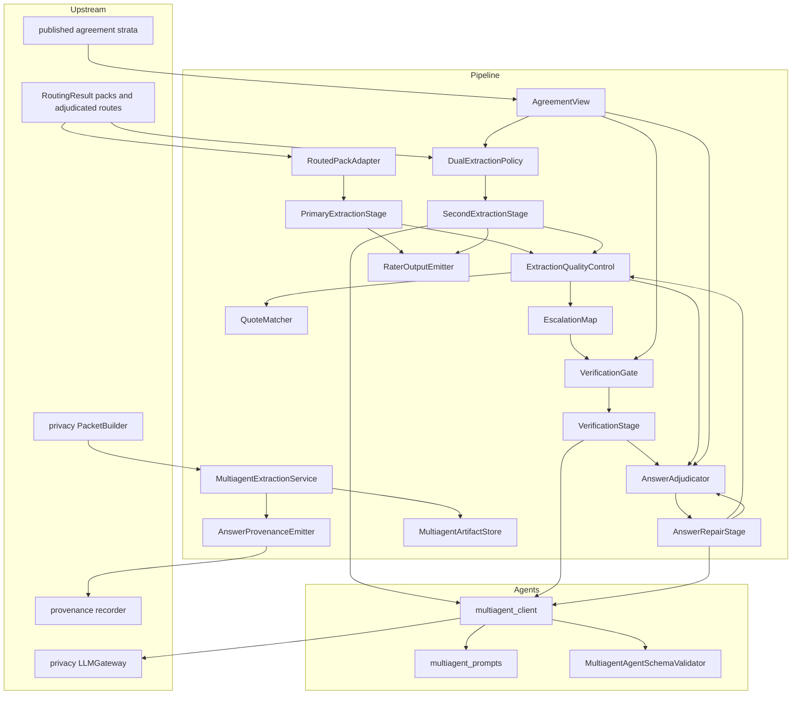
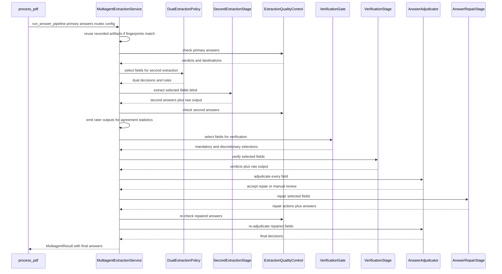
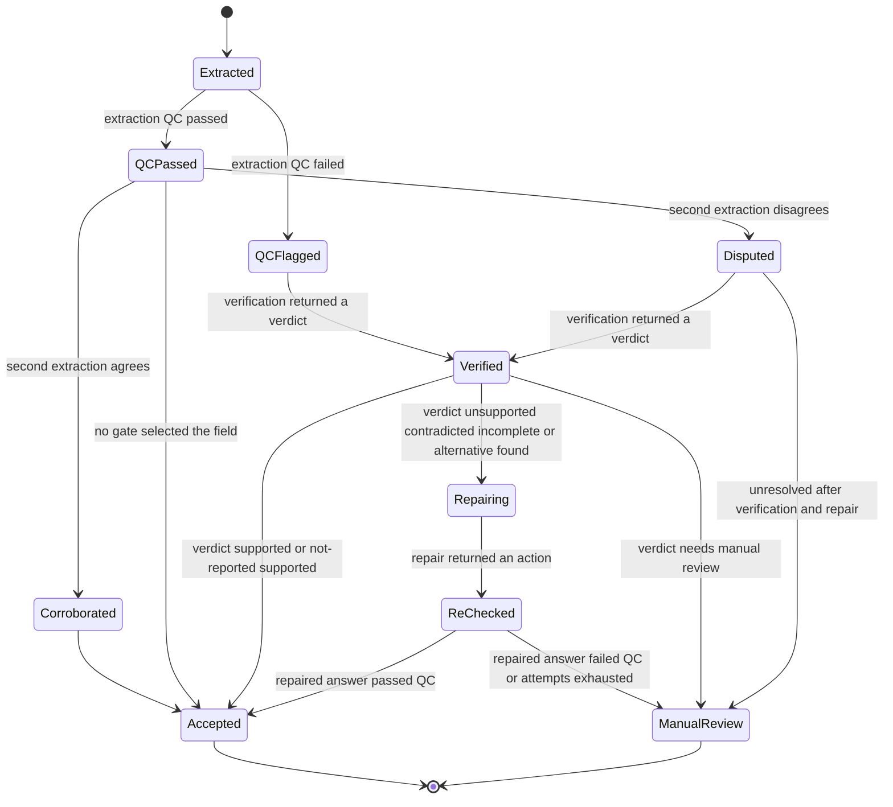
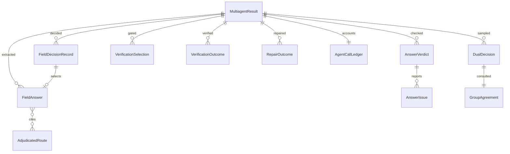

# Technical Design — multiagent-extraction

## Overview

**Purpose**: This feature turns each extracted field from a single model's assertion into the output of an auditable decision. A primary extractor works from route-derived evidence packs and must cite evidence for every asserted value; a blind second extractor runs where an explicit policy requires it; a deterministic extraction quality-control stage checks answers against the evidence they cite; a gated verifier challenges the fields that already look wrong; a deterministic adjudicator accepts, repairs, or escalates; and a targeted repair agent handles the residue and is re-checked by the same quality control.

**Users**: Biomedical reviewers who must know which values are defensible; institutional evaluators who must reconstruct why a value was accepted; operators who must keep four possible model passes per field affordable.

**Impact**: Today `process_pdf` runs chunk extraction, validates the output shape, and persists it. After this change, chunk extraction receives a routed-evidence block after the shared paper prefix, and the answers it produces enter a gated stage graph that ends in one decision record per field. `agreement-statistics`'s inter-rater stage stops reporting `NO_COMPARISON_DATA` because this feature becomes the first producer of two-rater data.

### Goals

- Every non-not-reported accepted value cites at least one valid evidence identifier, checked deterministically.
- Every model call after the primary extraction is gated by a recorded rule, and every gate decision is reproducible from recorded inputs.
- `_shared_paper_prefix` remains byte-identical across warmup, extraction chunks, and synthesis, unchanged in source.
- Each agent is independently disableable, so `evaluation-harness` can ablate the stage graph without editing code.
- One decision record per field, carrying the rule, its inputs, and their provenance.

### Non-Goals

- Computing any agreement statistic, parser agreement metric, or page risk flag (`agreement-statistics`).
- Selecting evidence locations, assembling packs, or pruning evidence (`evidence-routing`).
- Defining evidence identity, claim records, or the provenance graph (`provenance-core`).
- Repairing malformed model output — the existing bounded schema-repair loop keeps that job.
- Any human review surface, review queue, merger, export, or cost report (`reviewer-ui`, `provenance-audit-export`, `cost-and-run-reporting`).

## Boundary Commitments

### This Spec Owns

- The answer contract extension: the optional short-quote key on the compact answer object, and the mandatory-citation rule over it.
- The routed-evidence block appended to primary extraction requests, and its placement relative to the shared paper prefix.
- The dual-extraction policy: calibration and production modes, the mandatory selection rules, the graduation rule and its thresholds, and the deterministic residual sampling.
- The extraction quality-control check set, its issue vocabulary, the quote-to-evidence match, and the issue-to-destination escalation map.
- The low-agreement escalation policy that reads published statistics (multiagent R15.9 only).
- The verifier gating rules, the mandatory-versus-discretionary split, the verification request contract, and the seven verdict states.
- The deterministic answer adjudication rules and the per-field decision record.
- The answer repair agent's request contract, its four-action vocabulary, its attempt limit, and mandatory post-repair re-quality-control.
- The three new agent prompt prefixes, their template versions, and the per-agent per-document call bounds.
- Production of `RaterFieldOutput` records for `agreement-statistics`.
- The `multiagent_extraction` configuration section and its validation, and multiagent artifact persistence, reuse, and invalidation.
- The seven multiagent provenance stage names, contributed as **additions** to `provenance-core`'s `STAGE_CONTRACTS` and `STAGE_ORDER` tables: `multiagent_primary_adaptation`, `multiagent_extraction_qc`, `multiagent_second_extraction`, `multiagent_verification`, `multiagent_adjudication`, `multiagent_repair`, `multiagent_post_repair_qc`. `STAGE_CONTRACTS` is a closed table and `ProvenanceRecorder` raises `UnknownStageError` for any stage absent from it, so these seven names, their `StageContract` declarations, and their positions in `STAGE_ORDER` are added to `provenance-core`'s table as part of this feature's work. The table remains owned by `provenance-core`; this spec owns only the seven entries it contributes.
- The mapping from each of those seven stages onto a member of `provenance-core`'s closed `DerivationKind` literal, and the `x-multiagent-*` namespaced `extensions` keys this feature writes onto `DerivationStep`.

### Out of Boundary

- Any agreement statistic, comparison unit, stratification, parser metric, or page flag — read only, never computed or overridden.
- Route selection, document indices, route quality control, route adjudication, pack assembly, token capping, and evidence pruning — consumed verbatim.
- Evidence identifier construction, the provenance graph, the `DerivationKind` vocabulary, and the shape of `DerivationStep` — adopted from `provenance-core`; this feature adds stage-table entries and namespaced extension keys, never new core fields or new vocabulary members.
- Disclosure decisions, evidence-packet construction, vendor and model approval, credential resolution, and post-response scanning — owned by `privacy-core`. This feature calls through them and never re-implements or bypasses them.
- The existing malformed-output repair loop and the token-budget thresholds.
- Rendering, exporting, or reporting any artifact; providing the human review surface a `manual_review` state targets.

### Allowed Dependencies

- `src/pipeline/multiagent/` may import `pipeline.routing`, `pipeline.evidence_index`, `pipeline.token_budget`, `pipeline.validator`, `quality_control.models`, `text_processing`, `agents.openai.multiagent_client`, `utils.*`, and (once they exist) `provenance.*` and `privacy.*`. The service holds the injected `LLMGateway` and `PacketBuilder`; it never constructs a transport and never imports `agents.openai.api_client`, which `src/pipeline/privacy_wiring.py` alone may import.
- `src/agents/openai/multiagent_prompts.py`, `src/agents/openai/multiagent_client.py`, and `src/agents/multiagent_validator.py` may import only `agents.*`, `utils.*`, and the standard library. They must not import `pipeline`, `quality_control`, or `pdf_extractor`.
- `src/agents/openai/multiagent_client.py` must **not** import `agents.openai.api_client`, and must not reach any provider-calling helper through it. Under `privacy-core`'s agent-client rule, `api_client` has exactly one legal importer — `src/pipeline/privacy_wiring.py` — and every module matching `src/agents/openai/*_client.py` issues its provider calls only through an injected `ModelTransport` invoked from `LLMGateway.send`. `multiagent_client` therefore receives its gateway by injection and holds no provider import of its own; the dependency-direction test asserts the absent `api_client` import explicitly.
- `quality_control` must not import anything from `pipeline.multiagent`. `text_processing` must not import `quality_control`.
- Heavy optional dependencies stay lazily imported inside function bodies. No new third-party dependency is introduced.

### Revalidation Triggers

- Any change to `FieldAnswer`, `AnswerVerdict`, or `FieldDecisionRecord` field names — `evaluation-harness`, `reviewer-ui`, and `provenance-audit-export` consume all three.
- Any change to which `RaterFieldOutput` fields are populated, or to the rater name vocabulary — pinned by `agreement-statistics`.
- Any change to which `AdjudicatedRoute` or `ExtractionPack` field names are read — pinned by `evidence-routing`. In particular `AdjudicatedRoute.resolved_confidence` is read by name by `DualExtractionPolicy`; `evidence-routing` adds that field for this consumer, so removing or renaming it breaks this feature.
- Any change to the `ModelTransport`, `LLMGateway.send`, `PacketBuilder.build`, `EvidencePacket`, or `DisclosureDecision` signatures in `privacy-core` — `multiagent_client` calls the gateway and the service builds packets, so all four are consumed contracts. Conversely, this feature introduces two new model-visible, document-derived payloads (the routed-evidence block and the multiagent document package); `privacy-core`'s revalidation trigger for such payloads and its govern-once rule must be revalidated when this feature lands.
- **Against `privacy-core`'s `kind` literal.** The `kind` literal shared by `ModelTransport.send` and `LLMGateway.send` must admit this feature's three request kinds — `"second_extraction"`, `"verification"`, and `"repair"` — because no existing member (`"warmup"`, `"chunk"`, `"synthesis"`) honestly describes a multiagent call, and vendor approval and audit records key off `kind`. `privacy-core` declares that literal an extension point, so this is a sanctioned contribution rather than an intrusion, in the same form `evidence-routing` makes for `"locator"` and `"counterfactual_locator"`. Adding, removing, or renaming any of the three, or any change to the literal itself in `privacy-core`, requires joint revalidation; it must never be worked around locally by mislabelling a multiagent call as `"chunk"`. Until the literal admits all three, this feature must not be enabled in a governed run.
- `privacy-core`'s shipped prompt-cache boundary test currently asserts that `prompts.py` is unmodified. This feature adds an optional `routed_evidence_block: str | None = None` parameter to `build_user_message`, which is byte-identical on the default path but is a source edit to that file. `privacy-core` is being amended to assert `_shared_paper_prefix` source-and-output stability plus default-path request-payload byte-identity instead of file immutability (its Boundary Commitments already carry the amended wording). This is a **reciprocal dependency**: if that assertion is not amended before this feature lands, this feature's prompt change breaks a shipped `privacy-core` test, and if this feature's parameter is ever made non-optional or given a non-`None` default, `privacy-core`'s amended assertion must be revalidated.
- Any change to `provenance-core`'s `DerivationKind` members, to `DerivationStep`'s field set, to `derivation_from_stage_event`'s signature, or to the `x-<namespace>-<field>` extension-key rule — this feature's stage-to-kind table and its `x-multiagent-*` keys are pinned to all four.
- Adding, removing, or renaming any of the seven multiagent stage names — they are declared in `provenance-core`'s `STAGE_CONTRACTS` and `STAGE_ORDER`, and `provenance-core`'s contract-drift test asserts every recorded stage appears in both.
- Any change to the graduation thresholds or the mandatory verification set — these are the recorded resolutions of roadmap Open Questions 2 and 3; changing them re-opens the question.
- Any change to the answer object's key set sent to the provider — changes the strict response schema for every extraction call.
- Adding, removing, or reordering content inside `_shared_paper_prefix` — forbidden.

## Architecture

### Existing Architecture Analysis

- `process_pdf` (`src/pipeline/pdf_processor.py`) builds the evidence bundle, prefills fields 1–2 from TEI, builds one paper-level package shared by every chunk, then runs chunks concurrently through `RepairRetryLoop`. `evidence-routing` inserts routing between the bundle build and the package build and supplies a priority map. The insertion point for a routed-evidence block is the per-chunk user message, after the shared prefix.
- `_shared_paper_prefix` (`src/agents/openai/prompts.py:27`) wraps exactly one variable, the serialized paper package. One package per paper is what makes it cache-stable. `build_cache_warmup_message` warms only that prefix for chunks 1..N-1.
- `src/pipeline/validator.py` enforces `REQUIRED_KEYS = {"i", "v", "loc", "c"}` and `ALLOWED_CONFIDENCE = {"h", "m", "l", "nr"}`, rejects unexpected keys, and checks `loc` membership against `valid_location_ids`. Adding the quote means widening the permitted key set, not the required one.
- `RepairRetryLoop` (`src/pipeline/pdf_processor.py:471`) repairs parse and schema failures inside the extraction call. Its trigger set is disjoint from Agent 3's by construction, because schema-invalid output never leaves the call.
- `AgentSchemaValidator` and `evidence-routing`'s `RoutingAgentSchemaValidator` establish the "one schema file, one owner, one singleton" pattern the new validator follows.
- Technical debt worked around: the compact answer carries no quote today, so R14.3's fuzzy match is conditional on the quote being present rather than assumed; and answer quality control cannot live in `src/quality_control/` without a forbidden import, so it lives under `pipeline/multiagent/` with the name overlap documented.

### Architecture Pattern & Boundary Map

Selected pattern: **deterministic-sandwich stage graph**, the same pattern `evidence-routing` uses — every model call is preceded and followed by a deterministic stage, so a model's contribution is always a proposal that a reproducible stage accepts, repairs, or rejects.



**Architecture Integration**:

- Domain boundaries: three agent stages own only request assembly and response validation; the policies, quality control, and adjudication are deterministic and model-free; the service owns sequencing, failure isolation, call accounting, and resumability.
- Existing patterns preserved: config loaded once and passed explicitly; schema validators as single-owner singletons; all provider calls inside `src/agents/`; deterministic ordering with stable `field_index` tie-breaks; frozen dataclasses with tuple collections.
- New components rationale: each gate is separately testable and each agent separately disableable, which `evaluation-harness` R25.3–R25.6 requires; the quote matcher is separate because its threshold is the single most tunable parameter in the feature.
- Dependency direction: `models` → `config` → `packs`/`quote_match`/`agreement_view` → `extraction_qc` → `escalation` → `dual_policy`/`verification_policy` → `primary`/`second`/`verifier` → `answer_adjudicator` → `repair` → `rater_outputs`/`provenance_emit` → `store` → `service`. Each module imports only from modules to its left.

### Technology Stack

| Layer | Choice / Version | Role in Feature | Notes |
|-------|------------------|-----------------|-------|
| Backend / Services | Python 3.12, `dataclasses`, `asyncio` | All stages; the three agent stages are `async` | Matches existing pipeline |
| Model provider | OpenAI Responses API reached through `privacy-core`'s `LLMGateway.send` over an injected `ModelTransport` | Second extraction, verification, repair calls | Request construction, semaphore gating, retry ladder, and backoff arrive behind the injected transport; `multiagent_client` never imports `api_client` |
| Egress governance | `privacy-core` `DisclosureGate`, `PacketBuilder`, `LLMGateway`, `ResponseScanner` | Governs both document-derived payloads and every one of the three agents' calls | Injected; absent gateway means no multiagent model call is issued |
| Schema validation | `jsonschema` Draft 7 (already a dependency) | Verifier and repair response schemas | New `configs/multiagent_agent_schema.json`, single owner |
| Text matching | `text_processing` normalizers and tokenizers | Quote-to-evidence fuzzy match | No new dependency, no embeddings |
| Data / Storage | JSON artifacts under the run output directory | Raw agent output, answers, verdicts, decisions | Same atomic-write helper as existing outputs |

No new third-party dependency is introduced.

## File Structure Plan

### Directory Structure

```
src/pipeline/multiagent/
├── __init__.py             # Public surface: run_answer_pipeline, build_routed_evidence_block, MultiagentResult
├── models.py               # All multiagent dataclasses and literal vocabularies
├── config.py               # MultiagentConfig resolution, defaults, validation
├── packs.py                # RoutedPackAdapter: ExtractionPack -> routed block and per-field snippet view
├── quote_match.py          # QuoteMatcher: normalized token overlap score
├── agreement_view.py       # AgreementView: read-only adapter over published agreement results
├── extraction_qc.py        # ExtractionQualityControl: deterministic answer checks
├── escalation.py           # EscalationMap and AgreementEscalationPolicy
├── dual_policy.py          # DualExtractionPolicy: modes, graduation, residual sampling
├── verification_policy.py  # VerificationGate: mandatory and discretionary selection
├── primary.py              # PrimaryExtractionStage: answer normalization and contract checks
├── second.py               # SecondExtractionStage: blind second extraction
├── verifier.py             # VerificationStage: gated challenge and verdict handling
├── answer_adjudicator.py   # AnswerAdjudicator: deterministic accept/repair/review
├── repair.py               # AnswerRepairStage: targeted repair and re-quality-control
├── rater_outputs.py        # RaterOutputEmitter: answers -> RaterFieldOutput
├── provenance_emit.py      # AnswerProvenanceEmitter: derivation records
├── store.py                # MultiagentArtifactStore: persistence, reuse, invalidation
└── service.py              # MultiagentExtractionService: sequencing and orchestration

src/agents/openai/
├── multiagent_prompts.py   # Three stable prefixes and message builders
└── multiagent_client.py    # async request_second_extraction, request_verification, request_repair

src/agents/
└── multiagent_validator.py # MultiagentAgentSchemaValidator singleton owner

configs/
├── multiagent_agent_schema.json  # System prompts, policies, response schemas for 1B, 1c, 3
└── config.yaml                   # New multiagent_extraction section
```

### Modified Files

- `src/agents/openai/prompts.py` — `build_user_message` gains `routed_evidence_block: str | None = None`, emitted immediately after `_shared_paper_prefix` and before the extraction map. When `None`, output is byte-identical to today. `_shared_paper_prefix` and `build_cache_warmup_message` are unchanged.
- `src/pipeline/validator.py` — add `OPTIONAL_KEYS = {"q"}`; the unexpected-key check becomes `obj.keys() - (REQUIRED_KEYS | OPTIONAL_KEYS)`; `q` is validated as a string when present. `REQUIRED_KEYS` and `ALLOWED_CONFIDENCE` are unchanged.
- `src/agents/openai/api_client.py` — `_json_schema_format()` declares `q` as an optional string property; `extract_chunk` forwards `routed_evidence_block` to `build_user_message`. No new provider-calling entry point is added here, and no new importer of this module is introduced: `src/pipeline/privacy_wiring.py` remains its sole importer.
- `src/pipeline/privacy_wiring.py` (owned by `privacy-core`) — adapts the three multiagent request kinds `"second_extraction"`, `"verification"`, and `"repair"` onto the `ModelTransport` protocol and supplies the assembled `LLMGateway` to `run_answer_pipeline`. `privacy-core` owns the file; this feature contributes the three request kinds it must carry.
- `src/privacy/gateway.py` (owned by `privacy-core`) — the `kind` literal on `ModelTransport.send` and `LLMGateway.send` gains `"second_extraction"`, `"verification"`, and `"repair"`. `privacy-core` declares that literal an extension point, so this is a sanctioned contribution in the same form `evidence-routing` makes for `"locator"` and `"counterfactual_locator"`. It is the minimum change that lets multiagent calls cross the single egress path honestly: vendor approval and audit records key off `kind`, so no multiagent call is ever mislabelled as `"chunk"` to fit the existing vocabulary. These three gateway request kinds are a different vocabulary from the three telemetry **stage** labels below (`second_extraction`, `answer_verification`, `answer_repair`); the two are recorded independently and neither is derived from the other.
- `src/provenance/contracts.py` (owned by `provenance-core`) — add the seven multiagent stage names to `STAGE_CONTRACTS` with their `StageContract` declarations (record kind `derivation`, artifact scope `document`) and to `STAGE_ORDER`, positioned after the extraction stages and before synthesis. Without this addition every `AnswerProvenanceEmitter` call raises `UnknownStageError`, because `STAGE_CONTRACTS` is closed and `ProvenanceRecorder` validates against it.
- `src/agents/openai/telemetry.py` — this feature records telemetry under three new stage labels, `second_extraction`, `answer_verification`, and `answer_repair`, so cost reporting and prefix-drift detection cover the new stages. The telemetry stage identifier stays a free-form string: `cost-and-run-reporting` R4.9 requires an unrecognized stage to be reported as itself with no allowlist, so no enum, `Literal`, or membership check over stage names is introduced here — registering a label means teaching the summary and prefix-drift paths about it, not closing the vocabulary.
- `src/agents/__init__.py` — construct and export the `multiagent_agent_schema_validator` singleton.
- `src/pipeline/pdf_processor.py` — `process_pdf` builds the routed-evidence block per chunk from the routing result, **constructs it through `privacy-core`'s `PacketBuilder.build`** before it reaches any request, passes the resulting governed payload into extraction, and after chunk extraction awaits `run_answer_pipeline`, persisting its result alongside the existing outputs. It also passes the assembled `LLMGateway` and the `PacketBuilder` into `run_answer_pipeline` so the multiagent document package is governed the same way.
- **Privacy governance of this feature's document-derived payloads.** The routed-evidence block and the multiagent document package are both model-visible strings derived from document content, so both are constructed through `PacketBuilder.build` and only the returned `packet.payload` is ever placed into a request; the returned `EvidencePacket` and `DisclosureDecision` travel with every call that carries that payload, and `LLMGateway.send` refuses a call whose decision and packet do not correspond. This relies on `privacy-core`'s restated govern-once rule: **`build` is called at most once per distinct model-visible payload instance; any payload carried by more than one call must be byte-identical across those calls.** That per-instance form (rather than a per-document-total-of-one form) is what preserves prompt-cache stability while admitting more than one packet per document. Each of this feature's two payloads is one instance built once per document and reused byte-identically across every request that carries it, so both satisfy the rule directly. That restatement is listed above as a reciprocal revalidation trigger against `privacy-core`.
- `src/utils/config_utils.py` — register `multiagent_extraction` in `_ALL_KNOWN_TOP_LEVEL_KEYS`; add `load_multiagent_config`.
- `src/utils/path_utils.py` — add a resolver for the multiagent artifact directory.
- `tests/test_dependency_directions.py` — assert `agents.openai.multiagent_*` and `agents.multiagent_validator` import nothing from `pipeline`, `quality_control`, or `pdf_extractor`, and that `quality_control` imports nothing from `pipeline.multiagent`.

## System Flows

### Per-document answer pipeline



Gating decisions: extraction quality control always runs on every answer; the second extractor runs only on fields the dual policy selects and within the per-document bound; the verifier runs on every mandatory field regardless of the bound, and on discretionary fields only within it; repair runs only on fields adjudication sent to repair, up to the attempt limit; adjudication always runs for every field, including fields whose stages failed.

### Field lifecycle



## Requirements Traceability

| Requirement | Summary | Components | Interfaces | Flows |
|-------------|---------|------------|------------|-------|
| 1.1, 1.2 | Packs feed extraction; recorded fallback when absent | RoutedPackAdapter, PrimaryExtractionStage | `build_routed_evidence_block` | Answer pipeline |
| 1.3, 1.4 | Compact answer contract; metadata rejected | PrimaryExtractionStage, pipeline validator | `FieldAnswer`, `OPTIONAL_KEYS` | Answer pipeline |
| 1.5 | Identifier membership check | PrimaryExtractionStage, ExtractionQualityControl | `invalid_evidence_id` | Field lifecycle |
| 1.6 | Malformed output uses the existing repair path | PrimaryExtractionStage | `RepairRetryLoop` (unchanged) | Answer pipeline |
| 1.7 | Raw primary output persisted | MultiagentArtifactStore | `write_raw_output` | Answer pipeline |
| 2.1, 2.2 | Mandatory citation; uncited value is an issue | ExtractionQualityControl | `uncited_value` | Field lifecycle |
| 2.3, 2.4 | Absence answers cite verification locations | PrimaryExtractionStage | `FieldAnswer.absence_verified` | Field lifecycle |
| 2.5 | Prefilled fields excluded and recorded | MultiagentExtractionService | `ExcludedField` | Answer pipeline |
| 3.1 | Second extractor blind to the first | SecondExtractionStage, multiagent_prompts | `build_second_extraction_message` | Answer pipeline |
| 3.2 | Same compact contract | SecondExtractionStage | `FieldAnswer` | Answer pipeline |
| 3.3 | Decorrelation levers recorded | SecondExtractionStage, MultiagentConfig | `DecorrelationLevers` | Answer pipeline |
| 3.4 | Second raw output stored separately | MultiagentArtifactStore | `write_raw_output` | Answer pipeline |
| 3.5 | Rater outputs emitted, no statistics computed | RaterOutputEmitter | `emit` | Answer pipeline |
| 3.6 | Second extraction failure tolerated | SecondExtractionStage | `SecondExtractionOutcome` | Field lifecycle |
| 4.1, 4.2, 4.3 | Calibration and production selection, deterministic sampling | DualExtractionPolicy | `select` | Answer pipeline |
| 4.4, 4.5 | Graduation thresholds; unknown never counts as cleared | DualExtractionPolicy, AgreementView | `group_state` | Answer pipeline |
| 4.6, 4.7 | Per-field decision recorded; per-document bound | DualExtractionPolicy, AgentCallLedger | `DualDecision` | Answer pipeline |
| 4.8 | Never recompute statistics | AgreementView | read-only adapter | Boundary |
| 5.1, 5.2 | Schema and structural checks | ExtractionQualityControl | `check` | Field lifecycle |
| 5.3 | Quote fuzzy match | QuoteMatcher | `score` | Field lifecycle |
| 5.4, 5.5, 5.6 | Unsupported high confidence, numeric, critical-at-risk | ExtractionQualityControl | issue codes | Field lifecycle |
| 5.7, 5.8 | Verdict recorded for all; deterministic and model-free | ExtractionQualityControl | `AnswerVerdict` | Field lifecycle |
| 6.1, 6.2, 6.3 | Issue-to-destination map, severity, default | EscalationMap | `destination_for` | Field lifecycle |
| 6.4 | Acceptance eligibility recorded | ExtractionQualityControl, AnswerAdjudicator | `AnswerVerdict.destination` | Field lifecycle |
| 7.1, 7.2 | Low-agreement escalation with recorded statistic | AgreementEscalationPolicy | `escalate` | Answer pipeline |
| 7.3 | Unknown agreement handled explicitly | AgreementView, AgreementEscalationPolicy | `GroupAgreement` | Answer pipeline |
| 7.4, 7.5 | Agreement never relaxes or overrides | AgreementEscalationPolicy, AnswerAdjudicator | `escalate`, `adjudicate` | Field lifecycle |
| 8.1, 8.2 | Mandatory and discretionary verification sets | VerificationGate | `select` | Answer pipeline |
| 8.3, 8.5 | Bound never suppresses mandatory; overrun recorded | VerificationGate, AgentCallLedger | `select` | Answer pipeline |
| 8.4 | Selection recorded per field | VerificationGate | `VerificationSelection` | Answer pipeline |
| 9.1 | Verifier request content | VerificationStage, multiagent_prompts | `build_verification_message` | Answer pipeline |
| 9.2, 9.3, 9.4 | Seven verdicts; no free rewriting; proposals need evidence | MultiagentAgentSchemaValidator, VerificationStage | `validate_verification` | Field lifecycle |
| 9.5 | Adverse verdicts reach adjudication and repair | VerificationStage, AnswerAdjudicator | `VerificationOutcome` | Field lifecycle |
| 9.6, 9.7 | Raw output persisted; failure tolerated | MultiagentArtifactStore, VerificationStage | `write_raw_output` | Answer pipeline |
| 10.1, 10.2 | Deterministic accept/repair/review | AnswerAdjudicator | `adjudicate` | Field lifecycle |
| 10.3, 10.4 | Non-critical and critical acceptance criteria | AnswerAdjudicator | `RULES` | Field lifecycle |
| 10.5, 10.6 | Disagreement and invalid evidence block acceptance | AnswerAdjudicator | `RULES` | Field lifecycle |
| 10.7 | Unresolved becomes manual review | AnswerAdjudicator | `RULES` | Field lifecycle |
| 10.8, 10.9 | Decision rule, inputs, provenance; one record per field | AnswerAdjudicator, FieldDecisionRecord | `FieldDecisionRecord` | Answer pipeline |
| 11.1, 11.2, 11.3 | Bounded repair inputs; four actions; revision completeness | AnswerRepairStage, MultiagentAgentSchemaValidator | `repair` | Answer pipeline |
| 11.4, 11.6 | Unresolved and exhausted attempts become manual review | AnswerRepairStage | `RepairOutcome` | Field lifecycle |
| 11.5 | Post-repair re-quality-control | AnswerRepairStage, ExtractionQualityControl | `check` | Answer pipeline |
| 11.7 | Repair raw output and decision persisted | MultiagentArtifactStore | `write_raw_output` | Answer pipeline |
| 11.8 | Answer repair separate from malformed-output repair | AnswerRepairStage | trigger invariant | Boundary |
| 12.1, 12.2 | Shared prefix untouched; routed block placed after it | prompts, RoutedPackAdapter | `build_user_message` | Answer pipeline |
| 12.3, 12.4 | Own stable prefixes, byte-identical per document | multiagent_prompts | `_shared_*_prefix` | Answer pipeline |
| 12.5, 12.6 | Prompt versions recorded and invalidate reuse | multiagent_prompts, MultiagentArtifactStore | `PROMPT_VERSIONS` | Answer pipeline |
| 12.7 | Per-agent call accounting | AgentCallLedger, MultiagentExtractionService | `AgentCallLedger` | Answer pipeline |
| 12.8 | Single governed call path, concurrency, retries | multiagent_client, privacy-core `LLMGateway` | `request_*` via `LLMGateway.send` | Answer pipeline |
| 13.1 | Per-field decision record | AnswerAdjudicator, MultiagentArtifactStore | `FieldDecisionRecord` | Answer pipeline |
| 13.2, 13.3 | Unconditional raw persistence; failure tolerated | MultiagentArtifactStore | `write_raw_output` | Answer pipeline |
| 13.4, 13.5, 13.6 | Derivation records, single identity, optional provenance | AnswerProvenanceEmitter | `emit_stage` | Answer pipeline |
| 13.7 | Queryable data, no reports | MultiagentResult, MultiagentArtifactStore | `MultiagentResult` | Answer pipeline |
| 14.1, 14.2, 14.3 | Config surface, defaults recorded, invalid rejected | MultiagentConfig | `load_multiagent_config` | Answer pipeline |
| 14.4, 14.5 | Per-agent and whole-feature disablement | MultiagentExtractionService | `run_answer_pipeline` | Answer pipeline |
| 14.6, 14.7 | Field and document failure isolation | MultiagentExtractionService | `MultiagentResult.failures` | Answer pipeline |
| 14.8, 14.9 | Resume and invalidate | MultiagentArtifactStore | `load_if_valid` | Answer pipeline |

## Components and Interfaces

| Component | Domain/Layer | Intent | Req Coverage | Key Dependencies (P0/P1) | Contracts |
|-----------|--------------|--------|--------------|--------------------------|-----------|
| MultiagentModels | Types | All multiagent dataclasses and vocabularies | 1, 3, 4, 5, 8, 9, 10, 11, 13 | none | State |
| MultiagentConfig | Config | Resolve, default, validate every setting | 14 | config_utils (P0) | Service, State |
| RoutedPackAdapter | Adapter | Turn extraction packs into request material | 1, 12 | evidence-routing (P0) | Service |
| QuoteMatcher | Determinism | Normalized quote-to-evidence similarity | 5.3 | text_processing (P0) | Service |
| AgreementView | Signals | Read-only adapter over published statistics | 4, 7 | agreement-statistics (P1) | Service, State |
| ExtractionQualityControl | Determinism | Deterministic answer checks and verdicts | 5, 6.4 | QuoteMatcher (P0) | Service |
| EscalationMap | Determinism | Issue kind to escalation destination | 6 | MultiagentConfig (P0) | Service |
| AgreementEscalationPolicy | Determinism | Low-agreement escalation (R15.9) | 7 | AgreementView (P0) | Service |
| DualExtractionPolicy | Policy | Calibration, production, graduation, sampling | 4 | AgreementView (P0) | Service |
| VerificationGate | Policy | Mandatory and discretionary verification sets | 8 | EscalationMap (P0) | Service |
| MultiagentAgentSchemaValidator | Agents | Sole owner of the multiagent agent schema file | 3, 9, 11 | jsonschema (P0) | Service |
| multiagent_prompts | Agents | Three stable prefixes and message builders | 12 | MultiagentAgentSchemaValidator (P0) | Service |
| multiagent_client | Agents | Async second-extraction, verify, repair calls through the governed gateway | 12.8 | privacy-core `LLMGateway` / injected `ModelTransport` (P0) | Service |
| PrimaryExtractionStage | Agent stage | Normalize and contract-check primary answers | 1, 2 | RoutedPackAdapter (P0) | Service |
| SecondExtractionStage | Agent stage | Blind second extraction | 3 | multiagent_client (P0) | Service |
| VerificationStage | Agent stage | Gated adversarial verification | 9 | multiagent_client (P0) | Service |
| AnswerAdjudicator | Determinism | Accept, repair, or manual review per field | 10 | MultiagentModels (P0) | Service |
| AnswerRepairStage | Agent stage | Targeted repair and re-quality-control | 11 | ExtractionQualityControl (P0) | Service |
| RaterOutputEmitter | Adapter | Answers to rater field outputs | 3.5 | quality_control.models (P0) | Service |
| AnswerProvenanceEmitter | Provenance | Derivation records per stage | 13.4, 13.5, 13.6 | provenance-core (P1) | Service |
| MultiagentArtifactStore | Persistence | Persist, reuse, invalidate artifacts | 1.7, 3.4, 9.6, 11.7, 13, 14.8, 14.9 | path_utils (P0) | Batch, State |
| MultiagentExtractionService | Orchestration | Sequence stages, isolate failures, account calls | 2.5, 12.7, 14 | all above (P0) | Service |

### Types Layer

#### MultiagentModels

| Field | Detail |
|-------|--------|
| Intent | Single definition of every multiagent dataclass and vocabulary |
| Requirements | 1.3, 2.3, 3.3, 4.6, 5.2, 5.7, 8.4, 9.2, 10.8, 11.2, 12.5, 13.1 |

**Responsibilities & Constraints**
- All dataclasses are frozen; every collection field is a tuple so artifacts are hashable and safely shareable across `asyncio` tasks.
- Evidence is referenced by the bare pipeline-local identifier (`S000123`, `T000004`), exactly as `evidence-routing` stores it. Scoped provenance identifiers are constructed only at emission time via `provenance.format_evidence_id`.
- No routing or agreement type is redefined here; `AdjudicatedRoute`, `ExtractionPack`, `RouteVerdict`, and `RaterFieldOutput` are imported from their owners.
- Vocabularies are `Literal` types so an unknown value is a type error rather than a silent string.

**Contracts**: State [x]

##### State Management

```python
AgentRole = Literal["primary", "second", "verifier", "repair"]
RaterName = Literal["agent_1a", "agent_1b", "agent_3"]
Confidence = Literal["h", "m", "l", "nr"]
DualMode = Literal["calibration", "production"]
GroupState = Literal["graduated", "not_graduated", "unknown"]
EscalationTarget = Literal["verification", "repair", "manual_review", "none"]
SupportStatus = Literal["supported", "unsupported", "contradicted", "incomplete",
                        "alternative_found", "not_reported_supported", "needs_manual_review"]
RepairAction = Literal["revised", "kept_original", "marked_not_reported", "manual_review"]
AdjudicationOutcome = Literal["accepted", "repair", "manual_review"]
QCIssueCode = Literal["missing_field", "duplicate_field_id", "invalid_evidence_id",
                      "empty_value", "invalid_confidence", "uncited_value",
                      "quote_mismatch", "unsupported_high_confidence",
                      "missing_numeric_content", "critical_field_at_risk",
                      "contract_violation"]

@dataclass(frozen=True)
class FieldAnswer:
    field_index: int
    rater: RaterName
    value: str
    evidence_ids: tuple[str, ...]
    quote: str | None                      # (1.3) optional; absent is not a mismatch
    confidence: Confidence
    not_reported: bool
    absence_verified: bool                 # (2.3, 2.4)
    route_absent: bool                     # (1.2) extracted without a route
    prompt_version: str                    # (12.5)
    model_id: str

@dataclass(frozen=True)
class AnswerIssue:
    code: QCIssueCode
    field_index: int
    detail: str
    offending_ids: tuple[str, ...] = ()

@dataclass(frozen=True)
class AnswerVerdict:
    field_index: int
    rater: RaterName
    passed: bool
    issues: tuple[AnswerIssue, ...]
    destination: EscalationTarget          # (6.1, 6.2)
    quote_match_score: float | None        # (5.3)
    is_critical: bool
    parser_risk: str                       # adopted from AdjudicatedRoute.parser_risk

@dataclass(frozen=True)
class GroupAgreement:
    field_group: str
    state: GroupState                      # (4.4, 4.5, 7.3)
    statistic_name: str | None
    value: float | None
    unit_count: int
    undefined_reason: str | None

@dataclass(frozen=True)
class DualDecision:
    field_index: int
    selected: bool
    rule: str                              # (4.6)
    mode: DualMode
    suppressed_by_budget: bool             # (4.7)
    group_agreement: GroupAgreement
    thresholds_in_effect: Mapping[str, Any]

@dataclass(frozen=True)
class SecondExtractionOutcome:
    field_index: int
    completed: bool
    answer: FieldAnswer | None
    levers_applied: tuple[str, ...]        # (3.3)
    failure_reason: str | None             # (3.6)

@dataclass(frozen=True)
class VerificationSelection:
    field_index: int
    selected: bool
    mandatory: bool
    rule: str                              # (8.4)
    suppressed_by_budget: bool             # (8.3)

@dataclass(frozen=True)
class VerificationOutcome:
    field_index: int
    completed: bool
    verdict: SupportStatus | None          # (9.2)
    proposed_value: str | None             # (9.4)
    proposed_evidence_ids: tuple[str, ...]
    rationale: str | None
    prompt_version: str
    model_id: str
    failure_reason: str | None             # (9.7)

@dataclass(frozen=True)
class RepairOutcome:
    field_index: int
    completed: bool
    action: RepairAction | None            # (11.2)
    answer: FieldAnswer | None             # (11.3)
    rationale: str | None
    attempt: int                           # (11.6)
    prompt_version: str
    model_id: str
    failure_reason: str | None

@dataclass(frozen=True)
class FieldDecisionRecord:
    field_index: int
    outcome: AdjudicationOutcome
    decision_rule: str                     # (10.8)
    inputs: Mapping[str, Any]              # every input the rule consumed
    final_answer: FieldAnswer | None
    stages_run: tuple[str, ...]            # (13.1)
    issues: tuple[AnswerIssue, ...]
    verification_verdict: SupportStatus | None
    repair_action: RepairAction | None
    agreement_reference: GroupAgreement | None   # (7.2)
    failures: Mapping[str, str]            # stage -> reason (14.6)

@dataclass(frozen=True)
class AgentCallLedger:
    calls: Mapping[AgentRole, int]                 # (12.7)
    suppressed: Mapping[AgentRole, int]
    mandatory_overrun: bool                        # (8.5)
    triggers: Mapping[int, str]

@dataclass(frozen=True)
class ExcludedField:
    field_index: int
    reason: str                            # (2.5)

@dataclass(frozen=True)
class MultiagentResult:
    document_id: str
    enabled: bool
    mode: DualMode
    primary_answers: Mapping[int, FieldAnswer]
    second_answers: Mapping[int, SecondExtractionOutcome]
    verdicts: Mapping[tuple[int, RaterName], AnswerVerdict]
    dual_decisions: Mapping[int, DualDecision]
    verification_selections: Mapping[int, VerificationSelection]
    verifications: Mapping[int, VerificationOutcome]
    repairs: Mapping[int, RepairOutcome]
    decisions: Mapping[int, FieldDecisionRecord]
    rater_outputs: tuple[Any, ...]         # quality_control.models.RaterFieldOutput
    excluded_fields: tuple[ExcludedField, ...]
    call_ledger: AgentCallLedger
    effective_config: Mapping[str, Any]    # (14.2)
    failures: Mapping[int, str]            # (14.6)
    document_failure: str | None           # (14.7)

    def final_answers(self) -> Mapping[int, FieldAnswer]: ...
    def manual_review_field_indices(self) -> tuple[int, ...]: ...
```

**Implementation Notes**
- Validation: a test asserts every multiagent dataclass is frozen and that no field name collides with a `provenance-core` node field name or with an `evidence-routing` record field name.
- Risks: drift between `FieldAnswer` here and the response schemas in `configs/multiagent_agent_schema.json` — mitigated by a round-trip test per agent schema.

### Config Layer

#### MultiagentConfig

| Field | Detail |
|-------|--------|
| Intent | Resolve, default, and validate every multiagent setting once per run |
| Requirements | 14.1, 14.2, 14.3, 14.4, 14.5 |

**Responsibilities & Constraints**
- The `multiagent_extraction` top-level key must be registered in `_ALL_KNOWN_TOP_LEVEL_KEYS` or `load_local_config` raises `ValueError`; that registration is part of this component's work.
- Validation is strict and up front: an unknown mode, a fraction outside `[0, 1]`, a non-positive bound, an unknown escalation destination, or an unknown issue code raises before any stage runs (14.3).
- The fully resolved mapping, including every defaulted value, is carried on `MultiagentResult.effective_config` (14.2).
- Per-agent `enabled` flags are independent, so any single agent can be ablated (14.4); a feature-level `enabled` flag turns the whole stage graph off (14.5).

**Contracts**: Service [x] / State [x]

##### Service Interface

```python
@dataclass(frozen=True)
class MultiagentConfig:
    enabled: bool = False
    mode: DualMode = "calibration"
    second_extractor_enabled: bool = True
    verifier_enabled: bool = True
    repair_enabled: bool = True
    # Dual-extraction policy (Open Question 2)
    min_comparison_units: int = 50
    release_agreement_threshold: float = 0.80
    release_statistic: str = "cohen_kappa"
    residual_sample_fraction: float = 0.10
    sampling_seed: int = 20260721
    max_second_extraction_calls_per_document: int = 20
    decorrelation_levers: tuple[str, ...] = ("framing", "snippet_order")
    second_model: str | None = None
    second_max_retries: int = 1
    # Extraction quality control
    quote_match_threshold: float = 0.60
    numeric_formats: tuple[str, ...] = ("numeric", "count", "percentage", "year")
    issue_destinations: Mapping[str, EscalationTarget] = field(default_factory=dict)
    default_issue_destination: EscalationTarget = "verification"
    default_criticality: bool = False
    # Verification gating (Open Question 3)
    discretionary_verification_enabled: bool = True
    verification_confidence_threshold: Confidence = "l"
    max_verification_calls_per_document: int = 15
    verifier_model: str | None = None
    verifier_max_retries: int = 1
    # Agreement escalation (multiagent R15.9)
    agreement_escalation_threshold: float = 0.60
    agreement_escalation_action: EscalationTarget = "verification"
    unknown_agreement_action: EscalationTarget = "verification"
    # Repair
    max_repair_attempts: int = 1
    max_repair_calls_per_document: int = 15
    repair_model: str | None = None
    artifact_dir: str = "outputs/multiagent"

def load_multiagent_config(config: Mapping[str, Any] | None) -> MultiagentConfig: ...
```

- Preconditions: `config` is the already-loaded run configuration mapping.
- Postconditions: every returned field is populated; defaults applied are recorded in the returned object's `as_dict()` output.
- Errors: `MultiagentConfigError` naming the setting and the invalid value (14.3).

**Implementation Notes**
- Integration: mirrors `load_routing_config`'s tolerant-vs-strict split — unknown keys rejected, missing keys defaulted.
- Validation: table-driven tests over each invalid value class.

### Adapter and Determinism Layer

#### RoutedPackAdapter

| Field | Detail |
|-------|--------|
| Intent | Turn routing's extraction packs into request material without modifying them |
| Requirements | 1.1, 1.2, 12.1, 12.2 |

**Responsibilities & Constraints**
- Builds one routed-evidence block per extraction chunk by concatenating, in ascending `field_index` order, the pack snippets covering that chunk's fields. Snippets whose `text` is `None` are emitted as identifier, kind, page, and section only, exactly as the pack carries them (1.1).
- Emits the block as a serialized string. Because that string is model-visible and derived from document content, `process_pdf` constructs it through `privacy-core`'s `PacketBuilder.build` before it reaches a request, and passes the returned `packet.payload` — not the adapter's raw output — into `build_user_message` as `routed_evidence_block`, which places it after `_shared_paper_prefix` and before the extraction map (12.2). The adapter itself performs no governance and never touches the paper package or the prefix (12.1).
- Exposes a per-field view of the adjudicated route — primary identifiers, ordered evidence, criticality, parser risk, stricter-handling marking, and empty reason — used by every downstream gate. It reads those fields; it never recomputes them.
- When `RoutingResult.enabled` is `False`, or the routing result carries a `document_failure`, or a field has no adjudicated route, the adapter returns no block for that chunk and marks the affected fields `route_absent`, which the service records (1.2).
- Pure and total: no I/O, no clock, no randomness.

**Contracts**: Service [x]

##### Service Interface

```python
def build_routed_evidence_block(
    routing_result: "RoutingResult",
    chunk_field_indices: Sequence[int],
    config: MultiagentConfig,
) -> str | None: ...

def route_view(routing_result: "RoutingResult", field_index: int) -> "AdjudicatedRoute | None": ...
```

- Postconditions: for identical inputs the returned block is byte-identical; `None` is returned when routing is disabled, failed, or covers none of the chunk's fields.

#### QuoteMatcher

| Field | Detail |
|-------|--------|
| Intent | Score a model-emitted short quote against the text of the evidence it cites |
| Requirements | 5.3 |

**Responsibilities & Constraints**
- Normalizes both sides through the pipeline's existing `text_processing` normalizer (casefolding, whitespace collapse, punctuation stripping) and tokenizes with the existing tokenizer, so quote matching and every other text comparison in the project agree on what a token is.
- Score is the proportion of quote tokens present in the concatenated text of the cited evidence items, in order-insensitive multiset form; it is `1.0` when every quote token appears and `0.0` when none does.
- Returns `None` — explicitly not a mismatch — when the answer carries no quote, or when every cited identifier resolves to identifier-only evidence with no text available. A `None` score never produces a `quote_mismatch` issue (5.3).
- Deterministic, pure, and free of heavy optional dependencies.

**Contracts**: Service [x]

##### Service Interface

```python
class QuoteMatcher:
    def __init__(self, threshold: float) -> None: ...
    def score(self, quote: str | None, evidence_texts: Sequence[str]) -> float | None: ...
    def is_mismatch(self, score: float | None) -> bool: ...
```

- Invariants: `is_mismatch(None)` is always `False`; `score` is in `[0.0, 1.0]` whenever it is not `None`.

#### AgreementView

| Field | Detail |
|-------|--------|
| Intent | Read-only adapter over the agreement results published by `agreement-statistics` |
| Requirements | 4.4, 4.5, 4.8, 7.2, 7.3, 7.5 |

**Responsibilities & Constraints**
- Accepts the published `metrics_hierarchy["inter_rater_agreement"]` mapping. It computes nothing and mutates nothing (4.8, 7.5).
- **Per-group resolution reads `strata`, not `statistics`.** `agreement-statistics` keys the top-level `statistics` mapping by *agreement dimension* (`value`, `evidence`, `confidence`, `support_status`, `not_reported`), not by field group; per-field-group results exist only as `DisagreementStratum` entries in the report's `strata` list. The adapter therefore:
  1. reads `report["strata"]`, a list of serialized `DisagreementStratum` dicts;
  2. keeps entries whose `axis == "field_group"` **and** whose `dimension == "value"` — the value dimension is the one graduation and escalation are defined over;
  3. selects the entry whose `key` equals the requested field group;
  4. from that entry reads `unit_count` and `disagreement_rate`, and scans its nested `statistics` list — each element a serialized `StatisticResult` — for the element whose `statistic` equals the configured `release_statistic` and whose `dimension` is `value`, reading that element's `value`, `undefined_reason`, and `unit_count`.
  The exact keys consumed are therefore, on the stratum: `axis`, `key`, `dimension`, `unit_count`, `disagreement_rate`, `statistics`; and on the nested statistic: `statistic`, `dimension`, `value`, `undefined_reason`, `unit_count`. No other key of either record is read, and nothing outside `strata` is consulted for group resolution. The stratum's `unit_count` is used only when the selected statistic carries none.
- Resolution per group: `graduated` when the configured release statistic is present for that group with a numeric `value` at or above the release threshold, a `null` `undefined_reason`, **and** a `unit_count` at or above the minimum; `not_graduated` when the statistic is present but either bar is missed; `unknown` when `strata` is absent, when no stratum matches `axis == "field_group"` / `dimension == "value"` / the requested `key`, when the release statistic is absent from that stratum, when its `value` is `null` or its `undefined_reason` is set, when the report's `status` is `not_computed`, or when the whole report is missing (4.5, 7.3).
- A missing `report["status"] == "computed"` is treated as unknown rather than as a failure — `agreement-statistics` publishes `{"status": "not_computed"}` before this feature produces two-rater data, which is exactly the bootstrap case.
- Default construction is empty, so the feature runs correctly before `agreement-statistics` ships; the empty case resolves to `unknown` for every group, which is the specified conservative behavior rather than a stub.
- Exposes the statistic name, value, unit count, and reason so every decision that consumed them can record them (7.2).

**Contracts**: Service [x] / State [x]

##### Service Interface

```python
class AgreementView:
    def __init__(self, report: Mapping[str, Any] | None = None, *, config: MultiagentConfig) -> None: ...
    def for_group(self, field_group: str) -> GroupAgreement: ...
    def is_below_escalation_threshold(self, field_group: str) -> bool: ...
```

- Postconditions: `for_group` always returns a `GroupAgreement`; `state` is never `graduated` on absent or undefined input.
- Invariants: the adapter never writes to the supplied mapping, computes no statistic, and reads only the stratum keys `axis`, `key`, `dimension`, `unit_count`, `disagreement_rate`, `statistics` and the statistic keys `statistic`, `dimension`, `value`, `undefined_reason`, `unit_count`. A guard test asserts no agreement statistic is computed anywhere under `src/pipeline/multiagent/` and that the supplied report object is unchanged after every adapter call.

#### ExtractionQualityControl

| Field | Detail |
|-------|--------|
| Intent | Judge every extracted answer against its cited evidence before adjudication |
| Requirements | 1.5, 2.1, 2.2, 5.1, 5.2, 5.3, 5.4, 5.5, 5.6, 5.7, 5.8, 6.4, 11.5 |

**Responsibilities & Constraints**
- Coverage and structure (5.1, 5.2): every requested field must have exactly one answer; a missing answer yields `missing_field`, a repeated field index yields `duplicate_field_id`. Evidence identifiers are checked against the identifiers supplied to that request, yielding `invalid_evidence_id` for each unknown one (1.5). An empty value yields `empty_value`; a confidence outside the allowed set yields `invalid_confidence`.
- Citation (2.1, 2.2): a non-not-reported value with no evidence identifier yields `uncited_value`.
- Quote match (5.3): delegates to `QuoteMatcher`; a score below the configured threshold yields `quote_mismatch` carrying the score.
- Unsupported high confidence (5.4): a `h` confidence answer with no evidence identifiers, or with a `quote_mismatch`, yields `unsupported_high_confidence`.
- Numeric content (5.5): when the field's declared format is in the configured numeric format set and the value contains no digit, yields `missing_numeric_content`.
- Critical at risk (5.6): a field whose route is critical and whose answer is low-confidence, not-reported, uncited, or whose route's parser risk is `risky` yields `critical_field_at_risk` naming which condition applied.
- Records a verdict with the full issue list for every field, passing or failing (5.7), and resolves the escalation destination through `EscalationMap`. A passing field selected by no gate carries destination `none`, which is the recorded acceptance-eligible state (6.4).
- Pure and model-free (5.8). Re-runnable against a repaired answer with identical semantics, which is how 11.5 is satisfied without a second implementation.

**Dependencies**
- Inbound: MultiagentExtractionService, AnswerRepairStage (P0)
- Outbound: QuoteMatcher (P0), EscalationMap (P0), `evidence-routing` route view (P0)

**Contracts**: Service [x]

##### Service Interface

```python
class ExtractionQualityControl:
    def __init__(self, config: MultiagentConfig, matcher: QuoteMatcher, escalation: EscalationMap) -> None: ...
    def check(self,
              answers: Mapping[int, FieldAnswer],
              expected_field_indices: AbstractSet[int],
              field_defs: Mapping[int, Mapping[str, Any]],
              routes: Mapping[int, "AdjudicatedRoute"],
              evidence_text: Mapping[str, str],
              valid_evidence_ids: AbstractSet[str],
              rater: RaterName) -> Mapping[int, AnswerVerdict]: ...
```

- Postconditions: one verdict per expected field index; issue tuples are ordered by issue code then identifier for stable comparison.
- Invariants: never mutates an answer; never calls a model.

#### EscalationMap and AgreementEscalationPolicy

| Field | Detail |
|-------|--------|
| Intent | Turn issues into destinations, and low published agreement into extra scrutiny |
| Requirements | 6.1, 6.2, 6.3, 7.1, 7.2, 7.3, 7.4, 7.5 |

**Responsibilities & Constraints**
- `EscalationMap` resolves an issue code to a destination from configuration, taking the most severe destination among a field's issues with the severity order `manual_review > repair > verification > none` (6.1, 6.2). An unmapped code resolves to the configured default with a `WARNING` naming the code (6.3).
- `AgreementEscalationPolicy` reads `AgreementView` per field group and, when the published statistic is below the escalation threshold, applies the configured escalation — raising verification coverage, forcing dual extraction, or assigning manual review — and records the statistic name, value, unit count, and threshold in force (7.1, 7.2).
- Unknown or undefined agreement applies `unknown_agreement_action` and is recorded as unknown, never as low (7.3).
- The policy can only add scrutiny. It has no path that lowers a destination, relaxes a quality-control verdict, or accepts a field (7.4), and it never writes to the agreement report (7.5).

**Contracts**: Service [x]

##### Service Interface

```python
class EscalationMap:
    def __init__(self, config: MultiagentConfig) -> None: ...
    def destination_for(self, issues: Sequence[AnswerIssue]) -> EscalationTarget: ...

class AgreementEscalationPolicy:
    def __init__(self, config: MultiagentConfig, view: AgreementView) -> None: ...
    def escalate(self, field_group: str, current: EscalationTarget) -> tuple[EscalationTarget, GroupAgreement]: ...
```

- Invariants: `escalate` never returns a destination less severe than `current`.

### Policy Layer

#### DualExtractionPolicy

| Field | Detail |
|-------|--------|
| Intent | Decide which fields get a second, blind extraction — the resolution of Open Question 2 |
| Requirements | 4.1, 4.2, 4.3, 4.4, 4.5, 4.6, 4.7, 4.8, 7.1 |

**Responsibilities & Constraints**
- Calibration mode selects every field sent to the primary extractor unless the second extractor is disabled (4.1).
- Production mode evaluates rules in a fixed order so the recorded rule is deterministic: `critical_field`, `route_empty_or_low_confidence`, `route_requires_stricter_handling`, `parser_risky_route`, `group_not_graduated`, `agreement_escalation`, then `residual_sample` (4.2, 4.3, 7.1). A field matching none is not selected.
- `route_empty_or_low_confidence` reads two named fields of `AdjudicatedRoute` and nothing else: `status`, which fires the rule when it is `"empty"` or `"local_only"`, and `resolved_confidence: RouteConfidence`, which fires the rule when it is `"low"`. `resolved_confidence` is the route-level confidence `evidence-routing` resolves from its candidate evidence and publishes on `AdjudicatedRoute` for this consumer; it is read verbatim and never recomputed here. The rule never reads the per-candidate `EvidenceProvenance.confidence` values, and it never infers a route confidence from `ordered_evidence`.
- Graduation (4.4, 4.5): a group is graduated only when `AgreementView.for_group(...)` returns `graduated`; `unknown` and `not_graduated` both select the field, and the reason is recorded on the decision.
- Residual sampling (4.3) is deterministic: a field is sampled when `sha256(f"{seed}|{document_id}|{field_index}")` interpreted as an integer, modulo 10 000, is below `residual_sample_fraction * 10 000`. No run-time randomness is used, so the same configuration selects the same fields on a repeated run.
- Selection is capped by `max_second_extraction_calls_per_document`, ordered by rule rank then `field_index`, so the cap is deterministic; a suppressed selection is counted on the ledger and recorded on the decision (4.7).
- Every field, selected or not, gets a `DualDecision` carrying the rule, the mode, the group agreement consulted, and the thresholds in effect (4.6).
- Computes no statistic (4.8).

**Contracts**: Service [x]

##### Service Interface

```python
class DualExtractionPolicy:
    def __init__(self, config: MultiagentConfig, view: AgreementView,
                 escalation: AgreementEscalationPolicy) -> None: ...
    def select(self,
               field_indices: Sequence[int],
               field_defs: Mapping[int, Mapping[str, Any]],
               routes: Mapping[int, "AdjudicatedRoute"],
               primary_verdicts: Mapping[int, AnswerVerdict],
               *, document_id: str) -> Mapping[int, DualDecision]: ...
```

- Postconditions: exactly one decision per input field index; the number of `selected and not suppressed_by_budget` decisions never exceeds the configured cap.

#### VerificationGate

| Field | Detail |
|-------|--------|
| Intent | Decide which fields the verifier challenges — the resolution of Open Question 3 |
| Requirements | 8.1, 8.2, 8.3, 8.4, 8.5, 7.1 |

**Responsibilities & Constraints**
- Mandatory rules, evaluated in fixed order: `critical_field`, `qc_issue_to_verification`, `extractor_disagreement`, `route_requires_stricter_handling` (8.1). A critical field answered not-reported is mandatory under `critical_field`, deliberately — an unverified absence claim on a critical field is the failure mode this gate exists for.
- Extractor disagreement is evaluated on the value dimension and the support-status dimension only, comparing normalized values through the same normalizer the quote matcher uses. It is not an agreement statistic and is never published as one.
- Discretionary rules, evaluated only when discretionary verification is enabled: `low_confidence` (confidence at or below the configured threshold) and `non_critical_not_reported` (8.2).
- The per-document bound suppresses discretionary selections only. Mandatory selections are always performed; when they exceed the bound, `AgentCallLedger.mandatory_overrun` is set and recorded (8.3, 8.5).
- Every field records whether it was selected, whether the selection was mandatory, which rule selected it, and whether the bound suppressed it (8.4).
- The agreement escalation policy can raise a field's destination into verification, which then enters the mandatory set through `qc_issue_to_verification` (7.1).

**Contracts**: Service [x]

##### Service Interface

```python
class VerificationGate:
    def __init__(self, config: MultiagentConfig, escalation: AgreementEscalationPolicy) -> None: ...
    def select(self,
               primary: Mapping[int, FieldAnswer],
               second: Mapping[int, SecondExtractionOutcome],
               verdicts: Mapping[tuple[int, RaterName], AnswerVerdict],
               routes: Mapping[int, "AdjudicatedRoute"],
               field_defs: Mapping[int, Mapping[str, Any]]) -> tuple[Mapping[int, VerificationSelection], bool]: ...
```

- Postconditions: every mandatory selection has `selected = True` and `suppressed_by_budget = False`; the returned flag reports whether the bound was exceeded on mandatory grounds.

### Agents Layer

#### MultiagentAgentSchemaValidator

| Field | Detail |
|-------|--------|
| Intent | Sole reader of `configs/multiagent_agent_schema.json` and sole validator of the three agents' output |
| Requirements | 3.2, 9.2, 9.3, 9.4, 11.2, 11.3 |

**Responsibilities & Constraints**
- Loads and validates the schema file once in `__init__`, mirroring `AgentSchemaValidator`; missing file, malformed JSON, or a missing required top-level key raises at construction.
- Required top-level keys: `version`, `second_extraction_system_prompt`, `verification_system_prompt`, `repair_system_prompt`, `policies`, `answer_schema`, `verification_schema`, `repair_schema`, `prompt_versions`.
- `answer_schema` is the compact answer object with the optional quote key, shared by the second extractor and by repair revisions (3.2, 11.3).
- `verification_schema` requires exactly one of the seven verdict values, forbids a proposal that carries neither evidence identifiers nor a rationale (9.4), and forbids a proposal for any field index other than the one requested (9.3).
- `repair_schema` requires exactly one of the four actions, and requires the full answer object when the action is `revised` (11.2, 11.3).
- Exported as the module-level singleton `multiagent_agent_schema_validator` from `src/agents/__init__.py`. No other module reads the file.

**Contracts**: Service [x]

##### Service Interface

```python
class MultiagentAgentSchemaValidator:
    def __init__(self, schema_path: Path | str | None = None) -> None: ...
    def get_second_extraction_system_prompt(self) -> str: ...
    def get_verification_system_prompt(self) -> str: ...
    def get_repair_system_prompt(self) -> str: ...
    def get_policies(self) -> dict: ...
    def get_prompt_version(self, role: AgentRole) -> str: ...
    def validate_answers(self, payload: object, expected_field_indices: Sequence[int]) -> list[dict]: ...
    def validate_verification(self, payload: object, field_index: int) -> dict: ...
    def validate_repair(self, payload: object, field_index: int) -> dict: ...
```

- Errors: `MultiagentSchemaValidationError` carrying the failing JSON path and message, which the calling stage turns into a targeted repair instruction or a recorded failure.

#### multiagent_prompts

| Field | Detail |
|-------|--------|
| Intent | Build the three agents' messages with their own stable cacheable prefixes |
| Requirements | 3.1, 3.3, 9.1, 11.1, 12.3, 12.4, 12.5 |

**Responsibilities & Constraints**
- Defines `_shared_second_extraction_prefix(document_package: str)`, `_shared_verification_prefix(document_package: str)`, and `_shared_repair_prefix(document_package: str)`. Each is fixed instruction text wrapping one serialized document-level package built once per document and reused for every request to that agent, which is what makes the prefixes byte-identical across requests (12.3, 12.4). Nothing request-specific — no field index, no timestamp, no run identifier — appears inside any of them.
- Must not import, call, or modify `prompts._shared_paper_prefix` (12.1). A guard test asserts the module does not reference it.
- The second-extraction message body carries the field definitions and the routed snippets for the requested fields, and **never** the primary answer, its quote, its confidence, or its identifiers (3.1). Blindness is enforced structurally: the builder's signature does not accept the primary answer at all.
- Decorrelation levers (3.3): `framing` selects an alternative instruction paragraph declared in the schema file; `snippet_order` reverses the routed snippet order; `model` is applied by the client through `second_model`. Applied levers are returned to the caller for recording.
- The verification message body carries the field definition, the candidate answers, the cited evidence, the alternative evidence from the adjudicated route, and the quality-control issues (9.1). The repair message body carries only the field definition, the current answer, the issues, the verifier critique when present, and the route's evidence snippets (11.1).
- Exposes `PROMPT_VERSIONS`, a mapping from agent role to the template version recorded on every request (12.5).
- `build_document_package` returns the **ungoverned** package string. It is never sent as-is: the service passes it through `privacy-core`'s `PacketBuilder.build` exactly once — it is one payload instance per document — and only the returned `packet.payload` is placed inside a prefix or handed to `multiagent_client`. Under `privacy-core`'s rule, `build` is called at most once per distinct model-visible payload instance and any payload carried by more than one call must be byte-identical across those calls; this package is carried by many calls, so building it once and reusing the returned payload byte-identically is what keeps the three prefixes cache-stable. Governing per request would break both the cache and that rule. The same treatment applies to the routed-evidence block built by `RoutedPackAdapter`.

**Contracts**: Service [x]

##### Service Interface

```python
PROMPT_VERSIONS: Mapping[AgentRole, str]

def build_document_package(routed_snippets: Sequence[Mapping[str, Any]],
                           document_metadata: Mapping[str, Any]) -> str: ...
def build_second_extraction_message(document_package: str, field_defs: list[dict],
                                    snippets: list[dict], levers: Sequence[str]
                                    ) -> tuple[str, tuple[str, ...]]: ...
def build_verification_message(document_package: str, field_def: dict, answers: list[dict],
                               cited: list[dict], alternatives: list[dict],
                               issues: list[dict]) -> str: ...
def build_repair_message(document_package: str, field_def: dict, current_answer: dict,
                         issues: list[dict], critique: dict | None, snippets: list[dict]) -> str: ...
```

- Invariants: for a fixed `document_package`, every message returned by a given builder begins with identical prefix bytes; `build_second_extraction_message` has no parameter through which a primary answer could be passed.

#### multiagent_client

| Field | Detail |
|-------|--------|
| Intent | Issue the three agents' calls through `privacy-core`'s governed egress path |
| Requirements | 12.8 |

**Responsibilities & Constraints**
- **Takes an injected `ModelTransport` and issues every call through `LLMGateway.send`.** It does **not** import `agents.openai.api_client` and does not call `_call_api_with_retries`, or any other provider-calling helper reached by importing that module, directly. This is not a stylistic preference: `privacy-core`'s gateway sits *in front of* `api_client`, so a direct helper call bypasses the `DisclosureGate`, the `EvidencePacket`, the audit trail, vendor and model approval, and post-response scanning entirely — ungoverned egress, not a shortcut. `privacy-core`'s agent-client rule states this for every module matching `src/agents/openai/*_client.py`, and its AST test enforces it.
- Request construction, semaphore gating, the retry ladder, and backoff are still reused rather than reimplemented — they arrive **behind** the injected transport, which `src/pipeline/privacy_wiring.py` builds from the existing `api_client` helpers. The reuse is preserved; only the import direction changes.
- Every call carries the `EvidencePacket` and the `DisclosureDecision` that authorized its payload. The client places `packet.payload` and nothing else into the request's payload slot; it contributes no policy identifier, packet identifier, or gateway metadata to any request field, preserving `privacy-core`'s prompt-bytes invariant.
- The gateway is required, not optional. When no gateway is supplied, the client raises rather than falling back to a direct provider call, and the service records the affected stage as not completed. There is no ungoverned path.
- A `FailClosedError` from the gateway — a blocked packet, an unapproved vendor profile, an undecided call, or a response-scan violation — is surfaced to the calling stage as a call failure with the gateway's rationale, and the stage converts it into a recorded not-completed outcome exactly as it does a provider failure. A scan violation never returns response text for persistence.
- Records telemetry under the new stage labels `second_extraction`, `answer_verification`, and `answer_repair`, carrying the prompt template version so cost reporting and prefix-drift detection cover the new stages.
- Returns raw response text; all validation is the caller's responsibility, matching `extract_chunk`'s contract.
- Imports nothing from `pipeline`, `quality_control`, or `pdf_extractor` (enforced by the dependency-direction test), and nothing from `agents.openai.api_client` (enforced by `privacy-core`'s agent-client AST test and asserted again here).

**Contracts**: Service [x]

##### Service Interface

```python
async def request_second_extraction(*, gateway: "LLMGateway",
                                    packet: "EvidencePacket",
                                    decision: "DisclosureDecision",
                                    model: str,
                                    request: Mapping[str, Any],
                                    document_id: str, prompt_version: str,
                                    now: str,
                                    collector: "TelemetryCollector | None" = None) -> str: ...
async def request_verification(...) -> str: ...   # same gateway/packet/decision/request parameters
async def request_repair(...) -> str: ...          # same gateway/packet/decision/request parameters
```

- **The parameter list is bound to `LLMGateway.send`'s, not invented alongside it.** `send` takes `kind`, `packet`, `decision`, `model`, `request`, `now`, and an optional caller-owned `semaphore` that it forwards to the transport unchanged; each `request_*` function is a thin adapter that fills `kind` with its own constant and forwards the rest. It **supplies no semaphore**: under `privacy-core`'s agent-client rule, request construction, concurrency gating, the retry ladder, and backoff all arrive *behind* the injected `ModelTransport` that `privacy_wiring.py` builds, so a client-held semaphore would be a second, parallel concurrency control over a path that already has one. No stage in this feature holds or forwards a semaphore either.
- **Non-payload request material travels in `request`.** The governed document payload reaches the provider as `packet.payload` and nothing else; the per-request variable material — the assembled user message from `multiagent_prompts`, the response-format declaration, and the sampling parameters — is carried in the `request` mapping that `send` forwards to the transport. The client adds no governance metadata to that mapping.
- The three functions differ only in the gateway request `kind` they name — `"second_extraction"`, `"verification"`, `"repair"` — and the telemetry stage label they record — `second_extraction`, `answer_verification`, `answer_repair`. The two vocabularies are independent and neither is derived from the other.
- Errors: propagates whatever the gateway raises after its own retries — provider errors from behind the transport, and `privacy-core`'s `PacketBlockedError`, `VendorProfileNotApprovedError`, `ResponseScanViolationError`, and `GatewayUndecidedError`. It swallows none of them and converts none of them into a direct provider call.

### Agent Stage Layer

#### PrimaryExtractionStage

| Field | Detail |
|-------|--------|
| Intent | Normalize the existing chunk extraction's output into answers and enforce the primary contract |
| Requirements | 1.2, 1.3, 1.4, 1.5, 1.6, 2.1, 2.2, 2.3, 2.4 |

**Responsibilities & Constraints**
- Does **not** issue the primary call. The existing chunk extraction path remains the primary extractor; this stage adapts its validated compact output into `FieldAnswer` records and applies the contract checks that the shipped validator does not cover.
- Contract violations (1.4): the shipped validator already rejects unexpected keys, so a response carrying field names or document metadata fails there. This stage records that rejection as a `contract_violation` issue rather than swallowing it.
- Malformed output (1.6) continues to be handled by the existing bounded repair loop inside the extraction call; this stage never sees schema-invalid output, which is the structural guarantee behind 11.8.
- Absence answers (2.3, 2.4): an answer whose value equals the configured not-reported value is marked `not_reported`, and `absence_verified` is `True` only when it carries at least one evidence identifier; otherwise the absence is recorded as unverified.
- Fields extracted without a route are marked `route_absent` so the fallback is visible per field (1.2).

**Contracts**: Service [x]

##### Service Interface

```python
class PrimaryExtractionStage:
    def __init__(self, config: MultiagentConfig) -> None: ...
    def adapt(self, compact_answers: Sequence[Mapping[str, Any]],
              routes: Mapping[int, "AdjudicatedRoute"],
              *, model_id: str, prompt_version: str) -> Mapping[int, FieldAnswer]: ...
```

- Postconditions: one `FieldAnswer` per compact answer; `rater` is always `agent_1a`.

#### SecondExtractionStage

| Field | Detail |
|-------|--------|
| Intent | Produce a blind second answer for the fields the dual policy selected |
| Requirements | 3.1, 3.2, 3.3, 3.4, 3.6, 12.4 |

**Responsibilities & Constraints**
- Builds the document package once per document and reuses it for every request (12.4).
- Blindness (3.1) is structural: the stage never reads `primary_answers`, and the prompt builder has no parameter that could carry them. A guard test asserts the stage's request payload contains none of the primary answer's value, quote, or identifiers.
- Validates every response through `MultiagentAgentSchemaValidator` before any answer is used, retrying up to `second_max_retries` with a targeted repair instruction naming the validation failure.
- Applies and records the configured decorrelation levers (3.3).
- Persists the raw response, the request, and the model identity for every attempt, in a location distinct from the primary raw output (3.4).
- A failure or an exhausted retry yields `completed = False` with a reason; the primary answer is retained and processing continues (3.6).

**Contracts**: Service [x]

##### Service Interface

```python
class SecondExtractionStage:
    def __init__(self, config: MultiagentConfig, store: MultiagentArtifactStore,
                 collector: "TelemetryCollector | None" = None) -> None: ...
    async def extract(self, selected: Sequence[int], document_package: str,
                      field_defs: Mapping[int, Mapping[str, Any]],
                      snippets: Mapping[int, Sequence[Mapping[str, Any]]]
                      ) -> Mapping[int, SecondExtractionOutcome]: ...
```

- Postconditions: one outcome per selected field; provider failures are converted into outcomes, never raised.

#### VerificationStage

| Field | Detail |
|-------|--------|
| Intent | Challenge the selected fields and return one of seven verdicts |
| Requirements | 9.1, 9.2, 9.3, 9.4, 9.5, 9.6, 9.7 |

**Responsibilities & Constraints**
- Supplies exactly the inputs 9.1 names and nothing else; the alternative evidence comes from the adjudicated route's non-primary ordered evidence.
- Validates through `MultiagentAgentSchemaValidator`, which enforces the one-of-seven verdict (9.2), rejects a proposal for a field the request did not name (9.3), and rejects a proposal missing both evidence identifiers and a rationale (9.4).
- An adverse verdict — `unsupported`, `contradicted`, `incomplete`, or `alternative_found` — makes the field eligible for repair and is carried into adjudication (9.5).
- Persists raw output, request, and model identity, associated with the field (9.6).
- A failed or invalid response after retries yields `completed = False` with a reason; the field is adjudicated without a verdict rather than dropped (9.7).

**Contracts**: Service [x]

##### Service Interface

```python
class VerificationStage:
    def __init__(self, config: MultiagentConfig, store: MultiagentArtifactStore,
                 collector: "TelemetryCollector | None" = None) -> None: ...
    async def verify(self, selections: Mapping[int, VerificationSelection], document_package: str,
                     primary: Mapping[int, FieldAnswer], second: Mapping[int, SecondExtractionOutcome],
                     verdicts: Mapping[tuple[int, RaterName], AnswerVerdict],
                     routes: Mapping[int, "AdjudicatedRoute"],
                     field_defs: Mapping[int, Mapping[str, Any]],
                     evidence_text: Mapping[str, str]) -> Mapping[int, VerificationOutcome]: ...
```

- Postconditions: one outcome per selected, non-suppressed field.

#### AnswerRepairStage

| Field | Detail |
|-------|--------|
| Intent | Repair wrong answers with a targeted call and re-check the result |
| Requirements | 11.1, 11.2, 11.3, 11.4, 11.5, 11.6, 11.7, 11.8 |

**Responsibilities & Constraints**
- Sends only the inputs 11.1 names. The full paper package, the other fields' answers, and the full document text are never included.
- The four-action vocabulary is enforced by the schema (11.2); a `revised` action missing value, identifiers, quote, confidence, or rationale is a validation failure and enters the bounded retry path (11.3).
- After a repair returns, the stage re-runs `ExtractionQualityControl.check` on the repaired answer — the same implementation, not a copy (11.5).
- A repaired answer that fails quality control again, or a field whose attempts reach `max_repair_attempts`, is marked for manual review (11.4, 11.6).
- Persists raw output and the final repair decision per field (11.7).
- Never receives schema-invalid extractor output; the existing malformed-output loop consumes that before it can reach here (11.8), and a test asserts the two triggers are disjoint.

**Contracts**: Service [x]

##### Service Interface

```python
class AnswerRepairStage:
    def __init__(self, config: MultiagentConfig, qc: ExtractionQualityControl,
                 store: MultiagentArtifactStore,
                 collector: "TelemetryCollector | None" = None) -> None: ...
    async def repair(self, field_indices: Sequence[int], document_package: str,
                     answers: Mapping[int, FieldAnswer],
                     verdicts: Mapping[tuple[int, RaterName], AnswerVerdict],
                     verifications: Mapping[int, VerificationOutcome],
                     routes: Mapping[int, "AdjudicatedRoute"],
                     field_defs: Mapping[int, Mapping[str, Any]],
                     evidence_text: Mapping[str, str]
                     ) -> tuple[Mapping[int, RepairOutcome], Mapping[int, AnswerVerdict]]: ...
```

- Postconditions: one outcome per requested field; every `revised` outcome carries a re-checked verdict.

### Determinism Layer

#### AnswerAdjudicator

| Field | Detail |
|-------|--------|
| Intent | Decide accept, repair, or manual review for every field, deterministically |
| Requirements | 10.1, 10.2, 10.3, 10.4, 10.5, 10.6, 10.7, 10.8, 10.9, 6.4, 7.4 |

**Responsibilities & Constraints**
- Rules are evaluated in a fixed order and the first match wins, so the recorded rule is unambiguous:
  1. `evidence_invalid` — any `invalid_evidence_id`, `uncited_value`, or `quote_mismatch` issue on the surviving answer → not acceptable on agreement grounds; destination `repair`, or `manual_review` when repair is disabled or exhausted (10.6).
  2. `verifier_adverse` — verdict `unsupported`, `contradicted`, `incomplete`, or `alternative_found` → `repair` (9.5).
  3. `verifier_manual` — verdict `needs_manual_review` → `manual_review`.
  4. `extractor_disagreement` — two answers differ on the normalized value → `repair` when a verifier verdict is absent, `manual_review` when verification already ran and did not resolve it (10.5).
  5. `critical_strict` — a critical field is accepted only when it passed quality control, cites at least one valid identifier, has no adverse verdict, and either was corroborated by the second extractor or was verified `supported` / `not_reported_supported`; otherwise `repair`, then `manual_review` (10.4).
  6. `noncritical_supported` — a non-critical field that passed quality control with valid evidence is accepted without repair (10.3).
  7. `unresolved` — anything still undecided after verification and repair → `manual_review` (10.7).
- Model-free and pure (10.2). Agreement values are never consulted to relax a rule; they appear only in the recorded inputs and in the escalation policy that runs before adjudication (7.4).
- Produces exactly one `FieldDecisionRecord` per field sent to extraction, including fields whose stages failed — a failed stage contributes to `failures` and the field falls through to `unresolved` rather than vanishing (10.9, 14.6).
- Records the decision rule, every input the rule consumed, and the provenance of those inputs (10.8).

**Contracts**: Service [x]

##### Service Interface

```python
class AnswerAdjudicator:
    def __init__(self, config: MultiagentConfig) -> None: ...
    def adjudicate(self,
                   field_indices: Sequence[int],
                   primary: Mapping[int, FieldAnswer],
                   second: Mapping[int, SecondExtractionOutcome],
                   verdicts: Mapping[tuple[int, RaterName], AnswerVerdict],
                   verifications: Mapping[int, VerificationOutcome],
                   repairs: Mapping[int, RepairOutcome],
                   routes: Mapping[int, "AdjudicatedRoute"],
                   agreement: Mapping[str, GroupAgreement],
                   failures: Mapping[int, str]) -> Mapping[int, FieldDecisionRecord]: ...
```

- Postconditions: exactly one record per input field index; identical inputs produce equal output.

### Provenance and Persistence Layer

#### RaterOutputEmitter

| Field | Detail |
|-------|--------|
| Intent | Publish two-rater data in the form `agreement-statistics` consumes |
| Requirements | 3.5 |

**Responsibilities & Constraints**
- Emits one `quality_control.models.RaterFieldOutput` per rater per field, populating `rater`, `document_id`, `field_id`, `field_group`, `value`, `evidence_ids`, `confidence`, `support_status`, `not_reported`, `page_index`, and `criticality` from the answer, the route, and the field definition.
- `support_status` is the verifier verdict when one exists and `None` otherwise; the emitter never invents one.
- Computes no statistic, builds no comparison unit, and never calls the agreement package (3.5).
- Rater names are the fixed vocabulary `agent_1a` / `agent_1b` so the statistics module's rater-count assumptions hold.

**Contracts**: Service [x]

##### Service Interface

```python
class RaterOutputEmitter:
    def emit(self, document_id: str,
             primary: Mapping[int, FieldAnswer],
             second: Mapping[int, SecondExtractionOutcome],
             verifications: Mapping[int, VerificationOutcome],
             routes: Mapping[int, "AdjudicatedRoute"],
             field_defs: Mapping[int, Mapping[str, Any]]) -> tuple[Any, ...]: ...
```

#### AnswerProvenanceEmitter

| Field | Detail |
|-------|--------|
| Intent | Turn stage outcomes into provenance derivation records |
| Requirements | 13.4, 13.5, 13.6 |

**Responsibilities & Constraints**
- Emits one derivation step per stage per document, for the seven stages below (13.4). Every step is built by calling `provenance.adapters.derivation_from_stage_event(stage, kind, *, run_id, inputs, outputs, model_id, determinism, removal_reason, removed_ids, extensions)` — this emitter constructs no `DerivationStep` itself, mutates no step after construction, and invents no field.
- **Stage-to-`DerivationKind` table.** `DerivationKind` is a closed `Literal` of ten members (`extract`, `normalize`, `chunk`, `filter`, `merge`, `synthesize`, `reconcile`, `remove`, `prefill`, `annotate`); this feature adds none and pins each stage to an existing member. The stage names are the seven added to `STAGE_CONTRACTS` and `STAGE_ORDER`:

| Stage name | `DerivationKind` | Determinism | Rationale |
|------------|------------------|-------------|-----------|
| `multiagent_primary_adaptation` | `normalize` | deterministic | Reshapes already-validated compact output into `FieldAnswer` records; asserts nothing new |
| `multiagent_extraction_qc` | `annotate` | deterministic | Attaches verdicts and issues to existing answers without changing any value |
| `multiagent_second_extraction` | `extract` | probabilistic | A model derives a fresh value from evidence |
| `multiagent_verification` | `annotate` | probabilistic | A model attaches a support verdict and an optional proposal; it never rewrites the answer |
| `multiagent_adjudication` | `reconcile` | deterministic | Reconciles two raters, a verdict, and a repair outcome into one decision |
| `multiagent_repair` | `extract` | probabilistic | A model re-derives the value from the cited evidence and the critique |
| `multiagent_post_repair_qc` | `annotate` | deterministic | Re-runs the same deterministic checks over the repaired answer |

- Determinism is expressed the way the upstream adapter expresses it — a `model_id` is passed for the three probabilistic stages and omitted for the four deterministic ones, and the adapter marks the step accordingly. This emitter never sets `determinism` directly.
- **`prompt_version` and `replaced_field_indices` are not `DerivationStep` fields.** `provenance-core` states the rule positively: every field not declared on `DerivationStep` travels in `extensions`, under its `x-<namespace>-<field>` key rule. This feature's namespace is `multiagent`:
  - `x-multiagent-prompt_version` — the agent's prompt template version, written only for the three model-driven stages;
  - `x-multiagent-replaced_field_indices` — the field indices whose answer a later stage replaced, written only where a replacement occurred.
  The emitter passes these entries to the adapter directly, as its `extensions=` argument, in the same call that builds the step. `derivation_from_stage_event` declares `extensions: Mapping[str, Any] | None = None` precisely for this, so there is no post-construction mutation step: the step is never rebuilt, copied, or `dataclasses.replace`d after the adapter returns it. Keys are validated against `x-<ns>-<field>` at node construction, so a malformed key fails loudly rather than being dropped. No other multiagent field is smuggled into `extensions`, and no core field is shadowed by one.
- Removals — a repair action of `marked_not_reported` that discards the prior cited evidence — use the adapter's own `removal_reason` and `removed_ids` parameters rather than an extension.
- Constructs scoped evidence identifiers only through `provenance.format_evidence_id`; it never concatenates them itself (13.5).
- Holds an `enabled` flag; when the recorder is absent or disabled, every method is a no-op and the service records that provenance emission did not occur (13.6).

**Contracts**: Service [x]

##### Service Interface

```python
STAGE_DERIVATION_KINDS: Mapping[str, "DerivationKind"]   # the seven-row table above
PROVENANCE_EXTENSION_NAMESPACE = "multiagent"

class AnswerProvenanceEmitter:
    def __init__(self, recorder: object | None, *, source_id: str, run_id: str) -> None: ...
    @property
    def enabled(self) -> bool: ...
    def emit_stage(self, stage: str, *,
                   model_id: str | None,                      # None marks the step deterministic
                   input_ids: Sequence[str],
                   output_ids: Sequence[str],
                   prompt_version: str | None = None,         # -> x-multiagent-prompt_version
                   replaced_field_indices: Sequence[int] = (),# -> x-multiagent-replaced_field_indices
                   removal_reason: str | None = None,
                   removed_ids: Sequence[str] = ()) -> None: ...
```

- Preconditions: `stage` is one of the seven names, and each is declared in `STAGE_CONTRACTS` and `STAGE_ORDER`; otherwise `ProvenanceRecorder` raises `UnknownStageError`.
- Postconditions: every emitted step's `derivation_kind` comes from `STAGE_DERIVATION_KINDS`; every extension key matches `x-multiagent-<field>`.
- Validation: a test asserts the seven stage names are exactly the keys of `STAGE_DERIVATION_KINDS`, that each mapped kind is a member of `DerivationKind`, that each stage is present in both provenance tables, and that every keyword `emit_stage` passes to `derivation_from_stage_event` is one the adapter declares — with `prompt_version` and `replaced_field_indices` reaching it only inside the `extensions` mapping, never as adapter keywords of their own.

#### MultiagentArtifactStore

| Field | Detail |
|-------|--------|
| Intent | Persist multiagent artifacts, reuse them on resume, invalidate them when inputs change |
| Requirements | 1.7, 3.4, 9.6, 11.7, 13.1, 13.2, 13.3, 13.7, 14.8, 14.9 |

**Responsibilities & Constraints**
- Artifact key is `{document_id}_{pdf_sha256}_{extraction_map_hash}_{prompt_version_digest}`, so a schema change, a document change, or a prompt template change invalidates by construction (14.9, 12.6).
- Raw agent output is written unconditionally, independent of log level (13.2). Each raw file records the request, the response, the model identity, the prompt template version, and the field indices it covers. Primary and second raw outputs are written to distinct paths (3.4).
- A persistence failure is logged and recorded on the result; the run continues and answers are not discarded (13.3).
- `load_if_valid` returns previously recorded answers, verdicts, verifications, repairs, and decisions for a matching key so a resumed run does not re-issue model calls (14.8); a key mismatch returns nothing.
- Writes use the existing atomic-write helper. All artifacts are plain JSON, queryable without the pipeline (13.7); the store formats no report.

**Contracts**: Batch [x] / State [x]

##### Batch / Job Contract

- Trigger: called by `MultiagentExtractionService` at stage boundaries.
- Input / validation: serializable multiagent dataclasses; the artifact key must be non-empty.
- Output / destination: `outputs/multiagent/{key}/` containing `raw/primary/{chunk}.json`, `raw/second/{field}.{attempt}.json`, `raw/verification/{field}.{attempt}.json`, `raw/repair/{field}.{attempt}.json`, `answers.json`, `verdicts.json`, `dual_decisions.json`, `verifications.json`, `repairs.json`, `decisions.json`, `result.json`.
- Idempotency & recovery: writes are atomic and keyed; rewriting the same key with the same inputs produces identical bytes; a corrupt artifact is discarded and recomputed with a warning, matching the evidence cache's behavior.

### Orchestration Layer

#### MultiagentExtractionService

| Field | Detail |
|-------|--------|
| Intent | Sequence the stages, isolate failures, account for calls, expose the result |
| Requirements | 2.5, 12.7, 14.2, 14.4, 14.5, 14.6, 14.7, 14.8, 13.6 |

**Responsibilities & Constraints**
- Sequence: config resolve → artifact reuse check → primary adaptation → extraction quality control → dual policy → second extraction → extraction quality control on second answers → rater output emission → agreement escalation → verification gate → verification → adjudication → repair → post-repair re-check → re-adjudication → provenance emission → persist.
- Disabled paths: a disabled feature returns a `MultiagentResult` with `enabled = False` and no decisions, and `process_pdf` persists exactly what it does today (14.5); a disabled individual agent skips its stage, records the disablement, and lets adjudication treat its absent output as absent rather than failed (14.4).
- Failure isolation: a per-field exception is captured into `failures[field_index]` and the field is still adjudicated with the outputs it has (14.6); an exception outside any field scope sets `document_failure` and returns a result rather than raising, so the caller records the document and moves on (14.7).
- Prefilled fields are excluded before any stage and recorded with a reason (2.5).
- The call ledger records calls, suppressions, mandatory overrun, and the trigger rule per non-primary call (12.7).
- The resolved configuration including defaults travels on the result (14.2).
- Concurrency: per-field agent calls are dispatched with `asyncio.gather`; the concurrency gate itself lives behind the injected `ModelTransport`, per `privacy-core`'s agent-client rule, so neither the service, nor any stage, nor `multiagent_client` holds or forwards a semaphore, and no new concurrency control is introduced.

**Contracts**: Service [x]

##### Service Interface

```python
async def run_answer_pipeline(
    compact_answers: Sequence[Mapping[str, Any]],
    routing_result: "RoutingResult",
    all_fields: Sequence[Mapping[str, Any]],
    prefilled_field_indices: AbstractSet[int],
    evidence_text: Mapping[str, str],
    *,
    document_id: str,
    artifact_key: str,
    config: Mapping[str, Any],
    agreement_report: Mapping[str, Any] | None = None,
    provenance_recorder: object | None = None,
    gateway: "LLMGateway | None" = None,
    packet_builder: "PacketBuilder | None" = None,
    collector: "TelemetryCollector | None" = None,
) -> MultiagentResult: ...
```

- Preconditions: `compact_answers` is the already-validated primary extractor output for the document.
- Governance: the service builds the multiagent document package once, passes it through `packet_builder.build` once, and hands the resulting `(packet, decision)` pair to every agent stage; the stages hand them to `multiagent_client`, which sends through `gateway.send`. With `gateway` or `packet_builder` absent, no multiagent model call is issued: the three model-driven stages are recorded as not completed with reason `egress_unavailable`, the deterministic stages still run, and every field is still adjudicated. There is no direct-provider fallback.
- A `PacketBlockedError` for the document package is a document-scoped block: it sets `document_failure` with the gate's rationale, no multiagent model call is issued, and the run continues with the next document.
- Postconditions: a `MultiagentResult` is always returned; exceptions never escape to `process_pdf`.

**Implementation Notes**
- Integration: `process_pdf` builds the routed-evidence block per chunk before extraction, then awaits this after chunk extraction and before persisting, replacing each field's value with `MultiagentResult.final_answers()` where a decision produced one.
- Risks: added latency from up to three extra call rounds per document; mitigated by gating and by running each round's fields concurrently under the existing concurrency gate held behind the injected transport.

## Data Models

### Domain Model

The multiagent aggregate is the document. Its root is `MultiagentResult`; every other record is reachable from it and none is meaningful outside it. Invariants:

- Every non-excluded field has exactly one `FieldDecisionRecord`, one `DualDecision`, one `VerificationSelection`, and at least one `AnswerVerdict`.
- Every evidence identifier appearing in any answer either exists among the identifiers supplied to that request or is recorded as an `invalid_evidence_id` issue.
- `AgentCallLedger.calls["second"]` never exceeds the configured second-extraction bound; `calls["verifier"]` may exceed its bound only when `mandatory_overrun` is `True`.
- A field with `outcome == "accepted"` has no unresolved `invalid_evidence_id`, `uncited_value`, or `quote_mismatch` issue on its final answer.
- `FieldAnswer.absence_verified` is `True` only when `not_reported` is `True` and `evidence_ids` is non-empty.

### Logical Data Model



Natural keys: `FieldAnswer` is keyed by `(field_index, rater)`; `AnswerVerdict` by `(field_index, rater)`; every other record by `field_index`. Referential integrity is enforced at construction: the adjudicator rejects a `FieldDecisionRecord` whose `final_answer` references an identifier absent from the run's evidence map.

### Data Contracts & Integration

- **Consumed from `evidence-routing`**: `RoutingResult`, `ExtractionPack`, `AdjudicatedRoute` (`is_critical`, `parser_risk`, `requires_stricter_handling`, `resolved_confidence`, `primary_evidence_ids`, `ordered_evidence`, `empty_reason`, `status`), and `RouteVerdict`. Read-only; never modified. `resolved_confidence` is a `RouteConfidence` (`"high" | "medium" | "low"`) that `evidence-routing` adds to `AdjudicatedRoute`; `DualExtractionPolicy` reads it by name.
- **Consumed from `agreement-statistics`**: `metrics_hierarchy["inter_rater_agreement"]`, specifically its `status` and its `strata` list. Per-field-group agreement is read from `DisagreementStratum` entries with `axis == "field_group"` and `dimension == "value"`, using the stratum keys `key`, `unit_count`, `disagreement_rate`, `statistics` and the nested `StatisticResult` keys `statistic`, `dimension`, `value`, `undefined_reason`, `unit_count`. The top-level `statistics` mapping is **not** read: it is keyed by agreement dimension, not by field group. Read-only; absent means unknown.
- **Produced for `agreement-statistics`**: `quality_control.models.RaterFieldOutput`, one per rater per field.
- **Consumed from `provenance-core`**: `format_evidence_id`, `DerivationStep`, `DerivationKind`, `derivation_from_stage_event`, the `x-<namespace>-<field>` extension-key rule, and the recorder's `record_derivation`. Nothing else.
- **Contributed to `provenance-core`**: seven `STAGE_CONTRACTS` entries and seven `STAGE_ORDER` positions, plus the `x-multiagent-prompt_version` and `x-multiagent-replaced_field_indices` extension keys. No new `DerivationKind` member and no new `DerivationStep` field.
- **Consumed from `privacy-core`**: `PacketBuilder.build`, `EvidencePacket`, `DisclosureDecision`, `LLMGateway.send`, the `ModelTransport` protocol, and the `FailClosedError` hierarchy. This feature produces no disclosure decision and constructs no packet identity of its own.
- **Published to `evaluation-harness`, `reviewer-ui`, `provenance-audit-export`**: `FieldDecisionRecord`, `AnswerVerdict`, and `VerificationOutcome`, both in-process on `MultiagentResult` and on disk under the multiagent artifact directory.
- **Published to `cost-and-run-reporting`**: `AgentCallLedger` and the three new telemetry stage labels.
- **Serialization**: JSON with `ensure_ascii=False` and stable key order, written through the existing atomic-write helper.

## Error Handling

### Error Strategy

Every stage degrades to a recorded state rather than an exception crossing a stage boundary. Configuration errors are raised by `load_multiagent_config` before any stage runs; everything after that is captured onto the result.

### Error Categories and Responses

**Configuration errors** — an unknown mode, an out-of-range fraction, a non-positive bound, an unknown issue code, or an unknown escalation destination raises `MultiagentConfigError` naming the setting and value before any stage runs (14.3). An unregistered `multiagent_extraction` key surfaces as the existing `ValueError` from `load_local_config`.

**Input errors** — a disabled or failed routing result yields `route_absent` answers and the recorded no-route fallback (1.2). A missing agreement report yields `unknown` group agreement everywhere (4.5, 7.3). A prefilled field is excluded with a reason (2.5).

**Model errors** — schema-invalid second-extraction, verification, or repair output triggers a bounded retry naming the validation failure; an exhausted retry yields `completed = False` with a reason and the field continues to adjudication (3.6, 9.7). A provider failure after the client's own retries is treated identically. Malformed primary output never reaches this feature — the existing repair loop owns it (1.6, 11.8).

**Egress governance errors** — a `PacketBlockedError` on the document package is a document-scoped block recorded on `document_failure`; a `VendorProfileNotApprovedError`, `GatewayUndecidedError`, or `ResponseScanViolationError` on an individual call is recorded as a not-completed stage outcome with the gateway's rationale, and the field is still adjudicated with the outputs it has. An absent gateway or packet builder records `egress_unavailable` for the three model-driven stages. No path falls back to a direct provider call.

**Provenance errors** — an `UnknownStageError` means the seven multiagent stages were not added to `STAGE_CONTRACTS` and `STAGE_ORDER`; it is caught, logged, and recorded as provenance emission not occurring, and it never aborts extraction (13.6).

**Budget errors** — a suppressed discretionary call is counted and recorded, never silently dropped (4.7, 8.3). A mandatory verification set larger than the bound performs every mandatory call and sets `mandatory_overrun`, deliberately preferring a recorded cost overrun to a silent coverage gap (8.5).

**Persistence errors** — a failed artifact write is recorded on the result and the run continues (13.3). A corrupt cached artifact is discarded and recomputed.

### Monitoring

- Every stage logs at INFO with document identifier, field counts, and per-stage call counts; issue and decision details are logged at DEBUG and always persisted regardless of log level.
- Telemetry records the three new stages, making second-extraction, verification, and repair token cost visible in the existing stage summary and cost report.
- `TelemetryCollector.check_prefix_drift` covers the new stages and warns if any multiagent prefix changes within a run.
- A WARNING is logged whenever `mandatory_overrun` is set, whenever an unmapped issue code is defaulted, and whenever a group's agreement is unknown while production mode is configured.

## Testing Strategy

### Unit Tests

- `ExtractionQualityControl.check` produces each of the eleven issue codes from a targeted answer fixture, and resolves the most severe destination when a field carries several issues (5.2–5.6, 6.2).
- `QuoteMatcher.score` returns `1.0` for a quote fully contained in its cited evidence, a value below threshold for an unrelated quote, and `None` for an absent quote and for identifier-only evidence; `is_mismatch(None)` is `False` (5.3).
- `DualExtractionPolicy.select` selects everything in calibration mode; in production mode selects a critical field, a stricter-handling route, a parser-risky route, and an ungraduated group while leaving a clean graduated field unselected; the residual sample is identical across repeated runs with the same seed and changes with the seed (4.1–4.3).
- `AgreementView.for_group` reads only `strata` entries with `axis == "field_group"` and `dimension == "value"`: it returns `unknown` for an empty report, for a report whose `strata` list contains only other axes or other dimensions, and for a group whose stratum lacks the configured release statistic or carries an `undefined_reason`; `not_graduated` for a statistic below threshold or a unit count below the minimum; and `graduated` only when both bars clear (4.4, 4.5, 7.3). A companion test asserts that a report whose top-level `statistics` mapping carries a passing value while `strata` carries none still resolves to `unknown` — the dimension-keyed mapping is not a group-keyed one and must not be read as one.
- `VerificationGate.select` marks the four mandatory rules mandatory, suppresses only discretionary selections under a bound of one, and sets the mandatory-overrun flag when mandatory selections exceed the bound (8.1–8.5).
- `AnswerAdjudicator.adjudicate` produces each of the seven rules from a targeted fixture, refuses to accept a field whose evidence identifiers are invalid even when both extractors agree, applies stricter criteria to a critical field, and emits exactly one record per field including one whose stage failed (10.3–10.9).
- `RaterOutputEmitter.emit` produces two rater outputs per dual-extracted field with the fixed rater names and populates every field the agreement module reads, and produces one for a field the second extractor skipped (3.5).

### Integration Tests

- Second-extraction blindness with a mocked client: the recorded request payload for a field contains none of the primary answer's value, quote, confidence, or identifiers, and the two answers are independently checked (3.1, 3.2).
- Verification path with a mocked client: an adverse verdict routes the field to repair, a `needs_manual_review` verdict routes it to manual review, and a verifier proposal missing both evidence and rationale is rejected as a contract violation (9.2–9.5).
- Repair path with a mocked client: a `revised` action is re-checked by extraction quality control and accepted, a repaired answer that fails re-check becomes manual review, and a field reaching the attempt limit becomes manual review (11.2–11.6).
- Failure isolation: injecting a provider failure for one field's second extraction, one field's verification, and one field's repair still yields one decision record per field, with each failure recorded against its field (3.6, 9.7, 14.6).
- End-to-end `process_pdf` with the feature enabled and a mocked client: multiagent artifacts are written, decisions are persisted, and the run completes; re-running with the same artifact key issues zero model calls for the multiagent stages (14.8).
- Invalidation: changing the extraction map hash, the document fingerprint, or a prompt template version discards cached multiagent artifacts and re-runs the stages (12.6, 14.9).
- Ablation: disabling each agent in turn completes the run with the remaining stages, records the disablement, and produces a decision for every field (14.4).
- Disabled path: with `multiagent_extraction.enabled: false`, the persisted extraction output bytes are identical to the pre-change baseline (14.5).

### Contract and Regression Tests

- Prompt-cache stability: with the feature enabled, all chunk prefixes for one document are byte-identical, `_shared_paper_prefix`'s source text is unchanged, and `multiagent_prompts` contains no reference to `_shared_paper_prefix` (12.1–12.4).
- Routed-block placement: `build_user_message` with `routed_evidence_block=None` reproduces the pre-change bytes exactly, and with a block the shared prefix bytes are unchanged and the block appears after them and before the extraction map (12.2).
- Answer schema additivity: a four-key answer object still validates, a five-key object carrying `q` validates, and a six-key object carrying an unexpected key is still rejected (1.3, 1.4).
- Repair-trigger disjointness: a schema-invalid extractor response is consumed by the existing malformed-output loop and never reaches `AnswerRepairStage` (11.8).
- Dependency direction: `agents.openai.multiagent_prompts`, `agents.openai.multiagent_client`, and `agents.multiagent_validator` import nothing from `pipeline`, `quality_control`, or `pdf_extractor`; `quality_control` imports nothing from `pipeline.multiagent`.
- Governed egress: an AST test asserts `multiagent_client` contains no import of `agents.openai.api_client` and no reference to `_call_api_with_retries`; a fake-transport test asserts every second-extraction, verification, and repair call reaches the transport only via `LLMGateway.send`, that the transport is never invoked on a blocked, unapproved, or undecided path, and that with no gateway supplied zero provider invocations occur and the three stages are recorded `egress_unavailable`.
- Packet governance: a test asserts the routed-evidence block and the multiagent document package are each one payload instance per document that passes through `PacketBuilder.build` exactly once, that only `packet.payload` reaches any request, and that the payload is byte-identical across every request carrying it — the same property the prompt-cache test asserts.
- Provenance stage table: a test asserts each of the seven multiagent stage names is present in `STAGE_CONTRACTS` and `STAGE_ORDER`, that recording an unlisted stage raises `UnknownStageError`, that every stage maps to a declared `DerivationKind` member, and that `prompt_version` and `replaced_field_indices` reach the step **through** `derivation_from_stage_event`'s `extensions` parameter — the spy asserts the adapter is called with `extensions={"x-multiagent-prompt_version": ..., "x-multiagent-replaced_field_indices": ...}` and with no keyword named `prompt_version` or `replaced_field_indices`, and that the returned step is the one emitted, never replaced or copied afterwards. A round-trip test asserts those extension keys survive serialization unchanged.
- Agreement shape: a test asserts `AgreementView` reads no key outside the pinned stratum and statistic key sets, leaves the supplied report object equal to its input, and computes no statistic (4.8, 7.5).
- Identity: no module under `src/pipeline/multiagent/` constructs an evidence identifier by string formatting; every scoped identifier is produced by `format_evidence_id` (13.5).
- Config registration: `load_local_config` accepts a `multiagent_extraction` section and rejects an unknown sibling key (14.1, 14.3).
- Statistics boundary: a guard test asserts no module under `src/pipeline/multiagent/` computes an agreement statistic — the identifiers `kappa`, `alpha`, `ac1`, and `percent_agreement` appear nowhere as a computation, only as configuration statistic names read from the published report (4.8, 7.5).

### Performance

- Worst-case call count per document is asserted bounded: primary chunks plus the three configured per-document bounds, with mandatory verification the only permitted overrun.
- A production-mode run over a fixture corpus with all groups graduated issues second-extraction calls for no more than the mandatory set plus the residual fraction of the remaining fields.
- Extraction quality control and adjudication over 62 fields with 250 evidence items complete as pure in-memory passes without a measurable share of per-document wall time.

## Security Considerations

- The three new agents receive only field definitions, bounded routed snippets, and prior answers — never the full document text — which keeps their disclosure surface below the existing extraction call's. A smaller surface is a mitigation, not governance; it does not substitute for the gateway.
- **Every multiagent provider call is governed by `privacy-core`, by construction.** `multiagent_client` receives an injected `LLMGateway`, behind which the shared `ModelTransport` sits, and issues every call through `LLMGateway.send`; it does not import `agents.openai.api_client` and never calls `_call_api_with_retries` or any other provider-calling helper reachable through it. This is deliberate and load-bearing: the gateway sits *in front of* `api_client`, so a direct helper call would bypass the `DisclosureGate`, the `EvidencePacket`, the audit trail, vendor and model approval, and post-response scanning — it would be ungoverned egress. Reuse of request construction, semaphore gating, the retry ladder, and backoff is preserved by receiving them behind the injected transport, which `privacy_wiring.py` builds. An earlier draft of this design claimed that reusing the existing call path meant the gateway would fence these agents "without any change here"; that claim was false and is withdrawn — routing through the gateway *is* the change, and it is required in this feature, not deferred to `privacy-core`.
- **Both of this feature's model-visible, document-derived payloads are packet-governed.** The routed-evidence block and the multiagent document package are each constructed through `PacketBuilder.build` once per document, and only the returned `packet.payload` reaches a request; the authorizing `EvidencePacket` and `DisclosureDecision` accompany every call carrying that payload, and the gateway refuses a call whose decision and packet do not correspond.
- **No ungoverned fallback exists.** With no gateway or no packet builder supplied, the three model-driven stages are recorded as not completed rather than issuing a direct provider call; a blocked packet fails the document closed; a response-scan violation withholds the response from persistence. Every one of these is a recorded state, never a silent downgrade.
- Three reciprocal dependencies on `privacy-core` are tracked as revalidation triggers above: its govern-once rule is stated per payload **instance** — `build` is called at most once per distinct model-visible payload instance, and any payload carried by more than one call must be byte-identical across those calls; its `kind` literal admits this feature's three request kinds; and its prompt-cache boundary test moves from asserting `prompts.py` immutability to asserting `_shared_paper_prefix` stability plus default-path payload byte-identity.
- Raw agent artifacts are written under the run output directory alongside existing outputs and inherit their handling; no credential or key is ever written into a multiagent artifact.
- No accepted decision is presented as verified truth: `FieldDecisionRecord.outcome` records what rule accepted a field, and the standing product boundary that correctness is not guaranteed without human validation is preserved by the `manual_review` terminal state and by acceptance never being derivable from agent agreement alone.
