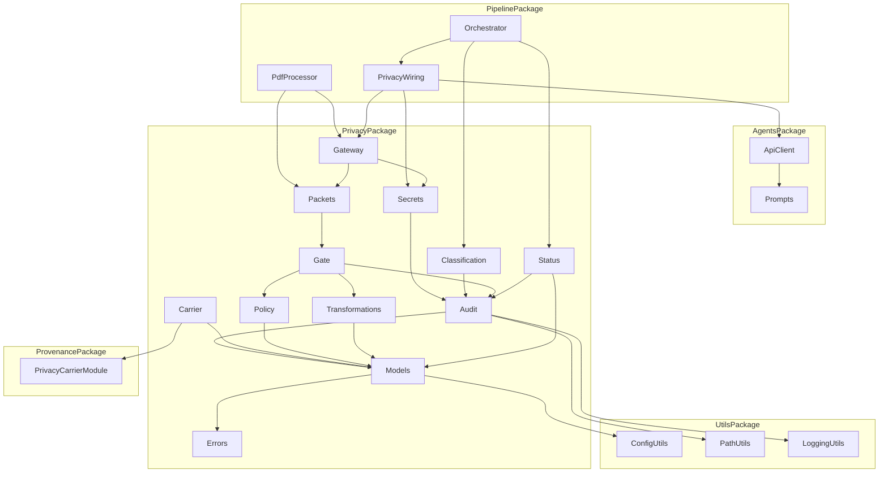
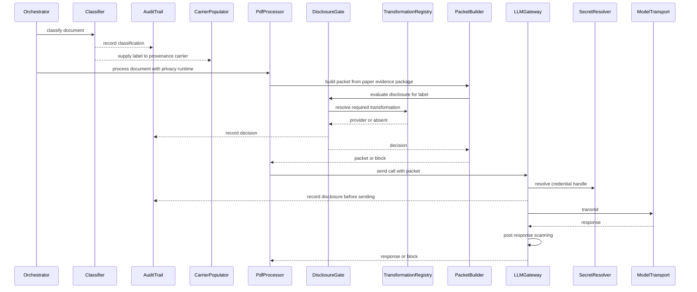
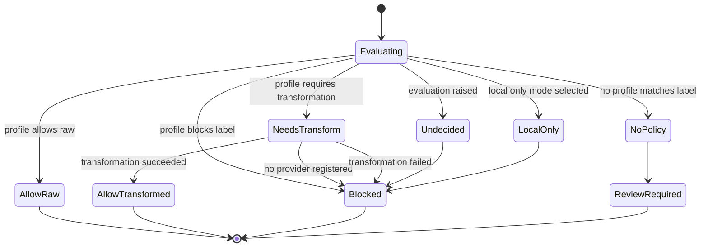
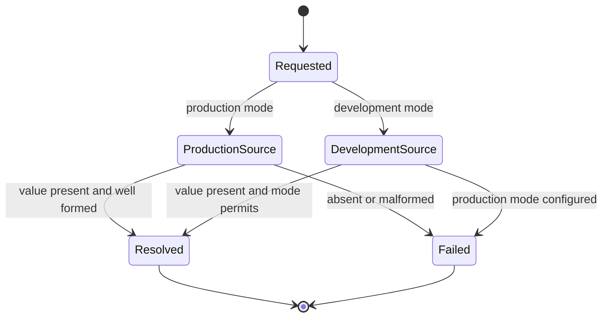
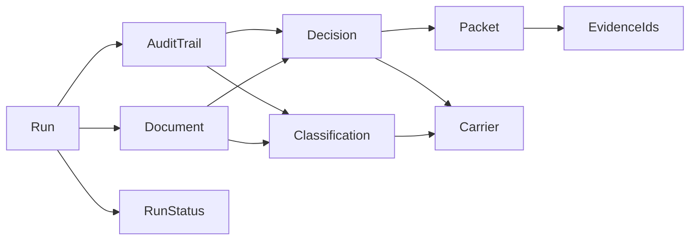

# Design Document — privacy-core

## Overview

**Purpose**: This feature makes disclosure control a first-class, auditable subsystem. It introduces `src/privacy/`, a package that owns a closed sensitivity label vocabulary, a single managed secret access path, a declarative disclosure policy gate that is the sole decision authority, model-safe evidence packets that retain provenance identifiers, a gateway through which every external model call passes, an append-only privacy audit trail, a uniform fail-closed rule, and a content-free operator status projection.

**Users**: Clinical researchers, data stewards, and institutional reviewers consume the output as status data and audit records. The direct code consumers are `src/pipeline/`, which wires the subsystem into the run, and the downstream specs `privacy-transformations` (implements the transformation provider interface), `public-private-provenance` (consults the carrier this spec populates), `provenance-audit-export`, `multiagent-extraction` (inherits the gateway), and `reviewer-ui` (renders the status projection).

**Impact**: The model-call path changes shape. Today `src/pipeline/pdf_processor.py` imports `agents.openai.api_client` at three lazy import sites and calls the provider directly, and `api_client.py` binds the credential into a module constant at import time. After this feature, exactly one module in the repository imports `api_client` — and any agent client added later receives an injected `LLMGateway` (or `ModelTransport`) instead of importing it — every call is issued through the gateway, and the credential is resolved per use through a redacting handle. The evidence package the model sees is governed exactly once per document, so the byte-stable shared prompt prefix is preserved: `_shared_paper_prefix`'s source and output are unchanged and the default-path request payload is byte-identical.

### Goals

- One decision authority for disclosure, with every decision reproducible from its recorded inputs.
- One managed access path for every secret, with key-version identity and no leakage into any observable artifact.
- A gateway that 100% of external model calls pass through, provable by a static import test rather than by assertion — paired with the rule that 100% of the model-visible, document-derived strings those calls carry are constructed by `PacketBuilder` (Requirement 6.8). Either half alone is a false safety claim: a governed chokepoint carrying an ungoverned string governs nothing.
- Prompt-cache stability preserved byte-for-byte on the governed path.
- Fail-closed on every uncertainty, with no configuration or code path that permits disclosure on an undecided state.
- Controls and audit surfaces only — never a compliance claim.

### Non-Goals

- Transformation algorithms: redaction, pseudonymization, minimization, date-shifting, leakage-risk scoring — `privacy-transformations`.
- Any protected-health-information detection model, named-entity recognizer, or clinical encoder.
- Semantic firewall behavior and leakage-risk estimation.
- Vault, cryptographic commitments, tamper-evidence, public and private provenance views — `public-private-provenance`.
- Provenance graph structure, evidence node identity, chain validation — `provenance-core`, consumed as-is.
- Multi-user project access control — deferred by explicit product decision, not by mechanism gap.
- Any user interface. The status projection is data.

## Boundary Commitments

### This Spec Owns

- The closed sensitivity label vocabulary, its strictness ordering, the conservative default, and the review-required state.
- The classification record, the operator declaration format, the operator override record, and the `SensitivityDetector` protocol and registry. No detector implementation.
- The single managed secret access path: `SecretRef`, `SecretHandle`, `SecretResolver`, key-version identity, and the development-versus-production mode rule.
- The disclosure policy profile format and its version, profile loading and structural validation, and `DisclosureGate.evaluate()` as the **sole** producer of a `DisclosureDecision`.
- The `TransformationProvider` protocol and registry, and dispatch to it. No transformation implementation.
- `EvidencePacket` construction, packet identity, the govern-once rule (one build per distinct model-visible payload instance, byte-identical across every call that carries it), and the **sole-construction rule for model-visible payloads**: any model-visible, document-derived string — whatever its shape — is constructed through `PacketBuilder` and reaches a provider only as an `EvidencePacket` payload (Requirement 6.8).
- The `LLMGateway`, the `ModelTransport` protocol, vendor and model profile approval, local-only mode, the `ResponseScanner` protocol and registry, and the post-response scanning point.
- The append-only privacy audit trail, its record schema, its write-through ordering, and its restricted export projection.
- The privacy status projection at document, evidence, output, and run level.
- Population of the `PrivacyCarrier` structure defined by `provenance-core`.
- The `privacy` configuration block, the policy profile file, the `src/privacy` dependency-direction rules, and the anti-overclaiming text checks.

### Out of Boundary

- Implementing any transformation, detector, or response scanner. This spec ships protocols, registries, and the fail-closed behavior for an empty registry.
- Defining evidence node identity, provenance node structure, graph assembly, or chain validation. `node_id = f"{source_id}#{local_id}"` is consumed from `provenance-core` and never redefined here.
- Interpreting the privacy carrier after supplying it, generating public or private views, or coordinating disclosure across views — `public-private-provenance`.
- Changing `_shared_paper_prefix` — neither its source nor its output changes — the framing lines of the shared prompt, the chunk-output JSON contract, the extraction map, or any prompt content. The commitment is **prefix stability plus a byte-identical default-path request payload**, not `prompts.py` file immutability: a later spec may add an optional parameter with a `None` default to a prompt builder provided the shared prefix's source and output are unchanged and the default path produces the same bytes.
- Changing extraction, quality control, PDF extraction, or text processing behavior. Those four packages are not modified.
- Rewriting the OpenAI client. `extract_chunk` and `warm_pdf_cache` keep their existing parameters, defaults, and return types; **this spec adds only** a lazily constructed client plus one optional injected-client parameter. Later specs add further optional parameters to those same entry points — `cost-and-run-reporting` adds `document_id` and `domain_group`, and `multiagent-extraction` forwards a routed-evidence block — and that is compatible with this spec provided every addition is optional with a default that leaves the default-path request payload byte-identical.
- Rendering, formatting, or exporting a user interface for privacy status.
- Any legal compliance claim, certification, attestation, or compliance report conclusion.

### Allowed Dependencies

- `src/privacy/` may import **only** `src/utils/`, `src/provenance/`, and the Python standard library. Within that, the single module permitted to import `provenance` is `src/privacy/carrier.py`.
- `src/pipeline/` is the sole integration point and may import `privacy`.
- `agents`, `pdf_extractor`, `quality_control`, `text_processing`, and `provenance` must **not** import `privacy`.
- **Agent-client rule (single egress, extensible).** `agents.openai.api_client` may be imported only by `src/pipeline/privacy_wiring.py`; any additional agent-client module must reach the provider only through an injected `LLMGateway` **or** `ModelTransport` and route through the gateway. Concretely: every module matching `src/agents/openai/*_client.py` — the existing `api_client.py` and any future one — issues its provider calls only through an `LLMGateway` or a `ModelTransport` it receives by injection, and every such transport is invoked only from `LLMGateway.send`. Taking an injected `LLMGateway` is the stricter of the two forms, and is the form the known downstream clients use. No agent-client module imports `api_client`, and no module outside `privacy_wiring.py` imports it either. A direct call to `api_client._call_api_with_retries` (or to any other provider-calling helper reached by importing `api_client`) **bypasses the DisclosureGate, the EvidencePacket, the audit trail, vendor-profile approval, and post-response scanning entirely** — it is ungoverned egress, not a shortcut.
  - This is the extensible form of the rule. Downstream specs that add an agent client (`evidence-routing`, `multiagent-extraction`) reuse request construction, semaphore gating, and the retry ladder by receiving them behind the injected `ModelTransport`, not by importing `api_client`. The rule stays satisfiable when those land, and the AST test below expresses exactly it.
- **Call-kind vocabulary is an open extension point.** The `kind` literal on `ModelTransport.send` and `LLMGateway.send` is deliberately **open to downstream extension**, not closed. This spec seeds it with `"warmup" | "chunk" | "synthesis"` — the three call kinds the existing extraction path issues — and downstream specs widen the literal **in place** in `src/privacy/gateway.py` when they add a call kind. `evidence-routing` and `multiagent-extraction` are the known consumers that will do so; this spec does not enumerate their kinds. Widening the literal is the only permitted form of extension: no spec may add a second transport protocol, a `kind`-free send path, or an untyped `str` kind, because the closed-at-any-instant literal is what makes the audit trail's call-kind field a bounded vocabulary. Each addition fires the corresponding Revalidation Trigger below.
- No new third-party dependency. `hashlib`, `json`, `os`, `datetime`, `pathlib`, `importlib`, `threading`, and `asyncio` (for the `Semaphore` type on the egress signatures) from the standard library, plus the already-present `yaml` used by `config_utils`.

### Revalidation Triggers

- Any change to the sensitivity label vocabulary or its strictness ordering — breaks `privacy-transformations` and `public-private-provenance`.
- Any change to `DisclosureDecision` or `EvidencePacket` field names — breaks `privacy-transformations`, `provenance-audit-export`, and `reviewer-ui`.
- Any change to the `TransformationProvider`, `SensitivityDetector`, `ResponseScanner`, or `ModelTransport` protocol signatures — breaks `privacy-transformations` and `multiagent-extraction`.
- A major bump of `PRIVACY_POLICY_SCHEMA_VERSION` or `PRIVACY_AUDIT_SCHEMA_VERSION` — breaks every artifact reader.
- Any change to the govern-once rule — "`build` is called at most once per distinct model-visible payload instance; any payload carried by more than one call is byte-identical across those calls" — directly threatens prompt-cache stability.
- Any change to the `src/privacy` dependency-direction rules or to the agent-client rule for `api_client`.
- **Any spec introducing a new model-visible, document-derived payload** — a new evidence package, index package, routed-evidence block, or any other string derived from document content that a model can see. Such a payload must be constructed through `PacketBuilder` (Requirement 6.8), and its introduction requires revalidating this design's govern-once rule and the prompt-cache stability test. The known first two consumers are `evidence-routing` and `multiagent-extraction`.
- **Any spec adding an agent-client module** under `src/agents/openai/` — it must reach the provider only through an injected `LLMGateway` or `ModelTransport` and route through `LLMGateway.send`, and the AST agent-client test must be revalidated against it.
- **Any spec widening the `kind` literal** on `ModelTransport.send` or `LLMGateway.send`. The literal is an extension point that downstream specs widen in place; every added member is a change to this spec's egress contract and fires a revalidation of the gateway call sequence, the audit record's call-kind field, and the prompt-cache stability test. `evidence-routing` and `multiagent-extraction` are the known consumers.
- Any change to how this spec populates `PrivacyCarrier` — must be revalidated against `provenance-core` Requirement 9.

## Architecture

### Existing Architecture Analysis

Four facts about the current system determine this design.

| Existing fact | Location | Consequence for this design |
|---|---|---|
| The paper evidence package is built **once per document** as a single JSON string and reused byte-identically for warmup, every chunk, and synthesis | `evidence_index.py:1062`; assigned `pdf_processor.py:1263-1270`, copied `:1279` | Governance can transform it once at that point without perturbing prompt-cache stability |
| `_shared_paper_prefix(source_package)` is a pure function whose only variable material is that string, with exactly two callers, both internal to `prompts.py` | `prompts.py:27, 93, 121` | This feature changes neither `_shared_paper_prefix`'s source nor its output; interposition happens upstream. The invariant is prefix stability, not file immutability — a later spec may add an optional, default-`None` parameter elsewhere in `prompts.py` as long as the prefix and the default-path request payload stay byte-identical |
| `api_client` binds the credential at import time and constructs the client immediately | `api_client.py:17, 23, 40` | Requirement 2 forces a lazy client and an injected-client parameter |
| Every import of `api_client` in `src/` is a function-local lazy import inside `pdf_processor.py`, and there are exactly three | `pdf_processor.py:522, 1047, 1157` | The "single egress path" claim is enforceable by an AST test in the two-part form stated under Allowed Dependencies: `api_client` importable only from `privacy_wiring.py`, and every other agent-client module reaching the provider only through an injected `LLMGateway` or `ModelTransport` |

Constraints preserved unchanged: no global mutation, config loaded once and passed explicitly; heavy optional dependencies lazily imported; each package's shared dataclasses owned by one module; run-scoped output paths; closed string vocabularies; AST-enforced dependency direction.

One further fact shapes the secret design: `logging_utils.py` has no redaction filter, and `api_client.py` logs client initialization and a raw-response preview at DEBUG. Redaction is therefore designed into the *value type* rather than into a log filter that a call site must remember to use.

### Architecture Pattern & Boundary Map

Selected pattern: **leaf domain package with an injected transport**. The privacy core knows nothing about PDFs, evidence indexes, or model providers. It accepts plain strings and mappings, and `pipeline` performs all wiring. This mirrors `provenance-core`'s adapter approach and is what keeps the dependency direction legal while still letting the gateway sit in front of the real client.



**Architecture Integration**

- **Dependency direction** (exhaustive; every module of the package appears exactly once): `utils → privacy.errors → privacy.models → privacy.audit → privacy.carrier → privacy.secrets → privacy.classification → privacy.policy → privacy.transformations → privacy.gate → privacy.packets → privacy.gateway → privacy.status`. Each module imports only from modules to its left. `errors` precedes `models` because record construction raises typed privacy errors. `audit` sits third because every subsequent component writes to the trail and receives it explicitly. `carrier` is placed immediately after `audit` and is the only module importing `provenance`, so the upstream dependency is confined to one file. `pipeline` sits above all of privacy and is the only caller.
- **Domain boundaries**: *credential access* (secrets) is separate from *labelling* (classification), which is separate from *deciding* (policy, transformations, gate), which is separate from *packaging* (packets), which is separate from *egress* (gateway), which is separate from *observation* (audit, status, carrier). These are the six boundary candidates named in the brief and they are the parallel-safe task seams.
- **Existing patterns preserved**: single-module ownership of shared dataclasses (mirrors `quality_control/models.py`); pluggable strategies loaded by fully-qualified class path (mirrors `text_processor.class` and the QC concern strategies); explicit config passing; run-scoped output paths via `resolve_run_output_path`; closed `Literal` vocabularies; a pre-flight guard function returning `None` or raising (mirrors `validate_qc_context_input`).
- **New components rationale**: every module maps to exactly one requirement group. No module exists speculatively; the three protocol-plus-registry modules exist because their empty-registry blocking behavior is required and testable now.

### Technology Stack

| Layer | Choice / Version | Role in Feature | Notes |
|-------|------------------|-----------------|-------|
| Runtime | Python 3.12.x | Package language | Matches repo pin |
| Domain model | `dataclasses` (frozen) + `typing.Literal` + `typing.Protocol` | Records, closed vocabularies, and the four pluggable interfaces | `from __future__ import annotations` throughout |
| Policy declaration | YAML via the already-present loader | Disclosure policy profiles and vendor profiles in `configs/privacy_policies.yaml` | No new dependency; validated against a closed structural schema in code |
| Identity | `hashlib.sha256` (stdlib) | Packet identity and audit record identity | Content-addressed; no clock in the identity |
| Persistence | JSON Lines (stdlib `json`) → `outputs/run_<ts>/privacy/` | Append-only audit trail, restricted export, status snapshot | Same run-scoped pattern as the evidence cache |
| Plugin loading | `importlib` | Detector, transformation provider, and response scanner registries | Same mechanism as the existing `text_processor.class` hook |
| Config | `configs/config.yaml` top-level `privacy:` block | Enable flag, mode, policy path, local-only flag, registries | Must be registered in `_ALL_KNOWN_TOP_LEVEL_KEYS` |
| Tests | pytest + Hypothesis | Unit, property, AST boundary, and prompt-cache regression tests | Hypothesis for decision determinism and redaction totality |

No new third-party dependency is introduced.

## File Structure Plan

### Directory Structure

```
src/privacy/
├── __init__.py            # Public surface; re-exports models, gate, packets, gateway, status
├── errors.py              # Exception hierarchy rooted at PrivacyError; FailClosedError and its subclasses
├── models.py              # All closed vocabularies and every shared frozen record:
│                          # SensitivityLabel, ClassificationSource, DecisionType, RationaleCategory,
│                          # ClassificationRecord, OverrideRecord, PolicyProfile, VendorProfile,
│                          # DisclosureDecision, EvidencePacket, AuditRecord, PrivacyStatus records
├── audit.py               # PrivacyAuditTrail: append-only write-through writer; restricted export projection
├── carrier.py             # Populates provenance PrivacyCarrier. The ONLY module importing provenance.
├── secrets.py             # SecretRef, SecretHandle, SecretResolver; key-version identity; dev vs production
├── classification.py      # Classifier; SensitivityDetector protocol and registry; declarations; overrides
├── policy.py              # Policy profile file loading, structural validation, profile and vendor lookup
├── transformations.py     # TransformationProvider protocol and registry; dispatch; no algorithm
├── gate.py                # DisclosureGate.evaluate(): the sole producer of a DisclosureDecision
├── packets.py             # PacketBuilder: one EvidencePacket per document; packet identity
├── gateway.py             # LLMGateway; ModelTransport protocol; vendor approval; local-only mode;
│                          # ResponseScanner protocol and registry; post-response scanning point
└── status.py              # PrivacyStatusProjector: document, evidence, output, and run-level status
```

Registries live beside the protocol they serve rather than in a shared registry module, so the three plug-in tasks share no file.

```
tests/src/privacy/
├── test_privacy_errors.py                 # hierarchy, fail-closed base, no permissive default
├── test_privacy_models.py                 # vocabulary closure, frozen records, strictness ordering
├── test_privacy_audit.py                  # append-only, write-through ordering, restricted export
├── test_privacy_carrier.py                # carrier population, self-identification, rejection handling
├── test_privacy_secrets.py                # redaction in repr/str/serialization, key version, dev vs prod
├── test_privacy_classification.py         # declaration, detector, default, uncertainty, override
├── test_privacy_policy.py                 # profile loading, malformed and unknown-label defects
├── test_privacy_transformations.py        # registry, dispatch, empty-registry block, failure block
├── test_privacy_gate.py                   # every decision type, no-policy block, determinism
├── test_privacy_packets.py                # identifier preservation, packet identity, block-and-report
├── test_privacy_gateway.py                # routing, vendor approval, local-only, response scanning
├── test_privacy_status.py                 # content-free projection, run-level summary
├── test_privacy_import_isolation.py       # imports cleanly with pipeline and agents absent from sys.modules
└── test_privacy_fail_closed.py            # cross-cutting: no permissive path exists anywhere
```

```
tests/src/pipeline/
├── test_privacy_wiring.py                 # transport construction, agent-client rule, injected client
└── test_privacy_prompt_cache_stability.py # shared prefix source and output unchanged; default-path
                                           # request payload byte-identical on the governed path
```

```
tests/steering/
└── test_privacy_no_compliance_claims.py   # repository text scan for compliance, certified, approved claims
```

### Modified Files

- `src/utils/config_utils.py` — add `_PRIVACY_DEFAULTS`, register `"privacy"` in `_ALL_KNOWN_TOP_LEVEL_KEYS`, add `load_privacy_config(config)`. Stop returning a bare credential string from `load_openai_config`: the key is exposed as a `SecretRef` description rather than a value, and the existing `api_key` key is retained only for the ungoverned path.
- `src/utils/path_utils.py` — add `PRIVACY_DIR = resolve_run_output_path("privacy")`.
- `configs/config.yaml` — add the `privacy:` block.
- `configs/privacy_policies.yaml` — **new**. Disclosure policy profiles and vendor profiles, with a schema version.
- `tests/test_dependency_directions.py` — add nine `FORBIDDEN_PAIRS` entries plus one named test per pair, and add the two-part agent-client test: `agents.openai.api_client` importable only from `src/pipeline/privacy_wiring.py`, and every `src/agents/openai/*_client.py` module (matched by glob, not by a fixed list) reaching the provider only through an injected `LLMGateway` or `ModelTransport` rather than importing another agent client or calling the provider SDK directly.
- `src/agents/openai/api_client.py` — replace the import-time client construction with a lazily constructed client accessor, and add an optional `client` keyword to `warm_pdf_cache` and `extract_chunk`. Both signatures are otherwise unchanged by **this** spec and both default to current behavior. This spec adds only that; later specs add further optional parameters to the same entry points. `agents` still imports nothing from `privacy`.
- `src/pipeline/privacy_wiring.py` — **new**. The sole importer of `agents.openai.api_client`. Builds the `ModelTransport` from the resolved secret handle and assembles the `LLMGateway`.
- `src/pipeline/pdf_processor.py` — govern the paper evidence package once, immediately after it is built; route the warmup, chunk, and synthesis calls through the gateway instead of importing `api_client`; propagate blocks as per-document privacy blocks rather than errors.
- `src/pipeline/orchestrator.py` — own the privacy runtime lifecycle: classify each document on ingest, construct the audit trail and gateway once per run, pass them explicitly, and write the run-level status at the end.

## System Flows

### Governed document flow, from ingest to transmission



Key decisions not visible in the diagram: the packet payload is produced **once** and the same string is used for warmup, every extraction chunk, and synthesis, which is what preserves prompt-cache stability; the audit write happens **before** transmission so a crash mid-call cannot lose the record; and a block anywhere in the chain terminates that document's external work while other documents continue.

### Disclosure decision states



Every path that is not `AllowRaw` or `AllowTransformed` terminates without transmission. There is deliberately no edge from `Undecided`, `NoPolicy`, or `NeedsTransform` to an allowing state — that absence is Requirement 9.6 expressed as a state machine, and a test asserts the transition table contains no such edge.

### Credential resolution



`Failed` never yields a handle and never falls back to another source. A resolved handle carries its mode and its key version; both appear in status and audit output, and neither is the secret value.

## Requirements Traceability

| Requirement | Summary | Components | Interfaces | Flows |
|-------------|---------|------------|------------|-------|
| 1.1, 1.2, 1.3, 1.4, 1.5, 1.6 | First-class subsystem; disclosure form vocabulary; unknown means restricted; single decision authority; no network; disabled state is reported | PrivacyModels, Classifier, DisclosureGate, PrivacyStatusProjector | `SensitivityLabel`, `DecisionType`, `DEFAULT_LABEL`, `DisclosureGate.evaluate`, `PrivacyStatus.governed` | Governed document flow |
| 2.1, 2.2, 2.3, 2.4, 2.5, 2.6 | One secret path; no leakage; safe failure; key version; dev vs production; resolve at point of use | SecretResolver, PrivacyWiring, ApiClientIntegration | `SecretRef`, `SecretHandle`, `SecretResolver.resolve`, `SecretUnavailableError` | Credential resolution |
| 3.1, 3.2, 3.3, 3.4, 3.5, 3.6, 3.7 | Label vocabulary; three assignment sources; heightened sensitivity; uncertainty; linkable to evidence identity; overrides; no detector registered | Classifier, PrivacyModels, CarrierPopulator | `SensitivityLabel`, `ClassificationRecord`, `SensitivityDetector`, `Classifier.classify`, `Classifier.override` | Governed document flow |
| 4.1, 4.2, 4.3, 4.4, 4.5 | Supply label and decision to provenance; self-identify; single mechanism; rejection handling; classify without a provenance record | CarrierPopulator, PrivacyAuditTrail | `populate_carrier`, `carrier_input_from` | Governed document flow |
| 5.1, 5.2, 5.3, 5.4, 5.5, 5.6, 5.7, 5.8 | Evaluate before boundary crossing; block; require transformation; no policy blocks; defective profile blocks; decision record; determinism; no algorithm here | DisclosureGate, PolicyRegistry, TransformationRegistry | `DisclosureGate.evaluate`, `PolicyProfile`, `DisclosureDecision`, `TransformationProvider` | Disclosure decision states |
| 6.1, 6.2, 6.3, 6.4, 6.5, 6.6, 6.7, 6.8 | Permitted content only; preserve evidence identifiers; packet identity; block and report; transformation failure blocks; record on transmit; no secrets in packets; sole construction path for every model-visible document-derived string | PacketBuilder, TransformationRegistry, LLMGateway | `PacketBuilder.build`, `EvidencePacket`, `PacketBlockedError` | Governed document flow |
| 7.1, 7.2, 7.3, 7.4, 7.5, 7.6, 7.7, 7.8, 7.9 | Single egress path; label-based block; call recording; vendor approval; local-only mode; response scanning; prompt bytes untouched; disclosure transparency; undecided blocks | LLMGateway, PrivacyWiring, ApiClientIntegration | `LLMGateway.send`, `ModelTransport`, `VendorProfile`, `ResponseScanner` | Governed document flow |
| 8.1, 8.2, 8.3, 8.4, 8.5, 8.6, 8.7 | Audit every event; record fields; human intervention; block reason; restricted export; append-only; write failure blocks | PrivacyAuditTrail | `PrivacyAuditTrail.append`, `AuditRecord`, `export_restricted` | Governed document flow |
| 9.1, 9.2, 9.3, 9.4, 9.5, 9.6, 9.7 | Detection failure means sensitive; policy failure blocks; transformation failure blocks; no credential fallback; incomplete means review; no permissive path; per-artifact isolation | PrivacyErrors, Classifier, DisclosureGate, TransformationRegistry, SecretResolver, LLMGateway | `FailClosedError`, `PrivacyError`, decision state table | Disclosure decision states, Credential resolution |
| 10.1, 10.2, 10.3, 10.4, 10.5, 10.6, 10.7 | Document classification; evidence disposition; output derivation; export blocker; content-free; queryable data not UI; run summary | PrivacyStatusProjector | `PrivacyStatusProjector.project`, `RunPrivacyStatus`, `DocumentPrivacyStatus` | Governed document flow |
| 11.1, 11.2, 11.3, 11.4, 11.5, 11.6 | No compliance claim; governance still required; workflow-control framing; export disclaimer; safeguard framing; no compliance-asserting artifact | PrivacyAuditTrail, PrivacyStatusProjector, PolicyRegistry, AntiOverclaimingCheck | `DISCLAIMER_TEXT`, `export_restricted`, repository text scan | Governed document flow |

## Components and Interfaces

| Component | Domain/Layer | Intent | Req Coverage | Key Dependencies (P0/P1) | Contracts |
|-----------|--------------|--------|--------------|--------------------------|-----------|
| PrivacyErrors | Definition | Typed error hierarchy whose base is fail-closed | 9 | none | State |
| PrivacyModels | Definition | All closed vocabularies and shared records | 1, 3, 5, 6, 8, 10 | PrivacyErrors (P0) | State |
| PrivacyAuditTrail | Observation | Append-only write-through trail and restricted export | 8, 11 | PrivacyModels (P0), PathUtils (P1) | Service, State |
| CarrierPopulator | Observation | Populate the provenance-defined privacy carrier | 4 | PrivacyModels (P0), provenance carrier (P0) | Service |
| SecretResolver | Credential | One managed access path with key-version identity | 2, 9 | PrivacyAuditTrail (P1), ConfigUtils (P1) | Service, State |
| Classifier | Labelling | Assign sensitivity labels from declaration, detector, or default | 1, 3, 9 | PrivacyAuditTrail (P0), PrivacyModels (P0) | Service |
| PolicyRegistry | Decision | Load and structurally validate disclosure policy profiles | 5, 11 | PrivacyModels (P0) | State |
| TransformationRegistry | Decision | Protocol, registry, and dispatch for transformation providers | 5, 6, 9 | PrivacyModels (P0) | Service |
| DisclosureGate | Decision | Sole producer of a disclosure decision | 1, 5, 9 | PolicyRegistry (P0), TransformationRegistry (P0), PrivacyAuditTrail (P0) | Service |
| PacketBuilder | Packaging | Build one model-safe packet per document | 6, 9 | DisclosureGate (P0) | Service |
| LLMGateway | Egress | The single external-call chokepoint | 2, 6, 7, 9 | PacketBuilder (P0), SecretResolver (P0), PrivacyAuditTrail (P0) | Service |
| PrivacyStatusProjector | Observation | Content-free status at four levels | 1, 10, 11 | PrivacyModels (P0), PrivacyAuditTrail (P0) | Service, State |
| PrivacyWiring | Integration | Build the transport and assemble the gateway | 2, 7 | LLMGateway (P0), ApiClient (P0) | Service |
| ApiClientIntegration | Integration | Lazy client and injected-client parameter | 2, 7 | none | Service |
| PipelineIntegration | Integration | Wire lifecycle, governance point, and call routing | 1, 3, 6, 7, 10 | all privacy components (P0) | Service |
| AntiOverclaimingCheck | Validation | Repository-wide text scan for compliance claims | 11 | none | Batch |

### Definition Layer

#### PrivacyErrors

| Field | Detail |
|-------|--------|
| Intent | Typed error hierarchy in which the base class means "block", not "warn" |
| Requirements | 9.1, 9.2, 9.3, 9.4, 9.6 |

**Responsibilities & Constraints**
- `PrivacyError` is the root. `FailClosedError` derives from it and is the base for every condition that must block: `ClassificationUnavailableError`, `PolicyEvaluationError`, `NoApplicablePolicyError`, `TransformationUnavailableError`, `TransformationFailedError`, `SecretUnavailableError`, `PacketBlockedError`, `VendorProfileNotApprovedError`, `AuditWriteError`, `ResponseScanViolationError`, `GatewayUndecidedError`.
- Every error carries a `rationale` so a block always reaches the audit trail with a named reason rather than a free-text message (8.4). Because `errors.py` precedes `models.py` in the dependency order, the attribute is annotated `str` at runtime and narrowed to `RationaleCategory` under `TYPE_CHECKING` only. `models.py` owns the vocabulary, and a conformance test asserts every raised rationale is a member of it.
- No error in this hierarchy is recoverable by continuing the operation that raised it. The only permitted handling is to record, block that artifact, and continue with other artifacts (9.7).

**Contracts**: State [x]

**Implementation Notes**
- Validation: a test asserts every `FailClosedError` subclass declares a `rationale` and that no module catches `FailClosedError` and proceeds to transmit.
- Risks: a future contributor catching the base class broadly — mitigated by the AST test above.

#### PrivacyModels

| Field | Detail |
|-------|--------|
| Intent | Single owner of every privacy vocabulary and every record shared across more than one layer |
| Requirements | 1.2, 1.3, 3.1, 3.2, 5.6, 6.2, 6.3, 8.2, 10.2 |

**Responsibilities & Constraints**
- **Ownership rule**: `models.py` owns (a) every closed vocabulary, (b) every record type consumed by more than one module, and (c) the strictness ordering over labels. Exactly five modules outside `models.py` declare a dataclass, and the list is exhaustive: `SecretRef` and `SecretHandle` (`secrets.py`, because `SecretHandle` carries redaction behavior rather than data), `PolicyFile` (`policy.py`), `TransformationResult` (`transformations.py`, because it is the provider protocol's return type and belongs with the protocol), `ScanResult` (`gateway.py`), and the four status records in `status.py`. Nothing else declares a privacy dataclass.
- All records are `@dataclass(frozen=True)`. Immutability is what makes a recorded decision non-revisable.
- Vocabularies are `Literal` unions — closed by design. Adding a member is a Revalidation Trigger.
- `LABEL_STRICTNESS` is a total order over `SensitivityLabel`, used by vendor approval (7.4) and by heightened-sensitivity treatment (3.3). It is data, not a chain of comparisons.
- `DEFAULT_LABEL = "restricted"` and `DEFAULT_CLASSIFICATION_SOURCE = "defaulted"`. There is no code path that produces a label more permissive than `DEFAULT_LABEL` in the absence of evidence (1.3).

**Contracts**: State [x]

##### State Management

```python
SensitivityLabel = Literal[
    "public_safe", "research_only", "internal_only",
    "restricted", "phi_bearing", "heightened_sensitivity",
]
LABEL_STRICTNESS: Mapping[SensitivityLabel, int] = {
    "public_safe": 0, "research_only": 1, "internal_only": 2,
    "restricted": 3, "phi_bearing": 4, "heightened_sensitivity": 5,
}
DEFAULT_LABEL: SensitivityLabel = "restricted"

ClassificationSource = Literal["declared", "detected", "defaulted", "overridden"]
ClassificationState = Literal["assigned", "review_required"]
DecisionType = Literal["allow_raw", "allow_transformed", "block", "review_required"]
PrivacyMode = Literal["production", "development"]
AuditEventKind = Literal[
    "classified", "overridden", "decided", "transformed",
    "disclosed", "blocked", "scanned", "exported", "carrier_rejected",
]
RationaleCategory = Literal[
    "policy_allows_raw", "policy_requires_transformation", "policy_blocks_label",
    "no_applicable_policy", "policy_profile_defective", "unapproved_vendor_profile",
    "local_only_mode", "transformation_unavailable", "transformation_failed",
    "classification_uncertain", "classification_failed", "secret_unavailable",
    "audit_write_failed", "gateway_undecided", "response_scan_violation",
    "carrier_rejected", "privacy_disabled",
]

@dataclass(frozen=True)
class ClassificationRecord:
    artifact_id: str                       # source_id or evidence node_id from provenance-core
    label: SensitivityLabel
    state: ClassificationState
    source: ClassificationSource
    assigned_by: str                       # component or detector identity
    assigned_at: str                       # ISO 8601
    confidence: float | None = None
    detector_id: str | None = None
    notes: str | None = None               # non-content rationale only

@dataclass(frozen=True)
class OverrideRecord:
    artifact_id: str
    previous_label: SensitivityLabel
    new_label: SensitivityLabel
    reason: str
    operator_id: str
    overridden_at: str

@dataclass(frozen=True)
class PolicyProfile:
    profile_id: str
    profile_version: str
    applies_to_labels: tuple[SensitivityLabel, ...]
    external_disclosure: Literal["allow_raw", "allow_transformed", "block"]
    required_transformation: str | None
    approved_vendor_profiles: tuple[str, ...]
    description: str

@dataclass(frozen=True)
class VendorProfile:
    vendor_profile_id: str
    vendor: str
    models: tuple[str, ...]
    max_sensitivity: SensitivityLabel
    notes: str

@dataclass(frozen=True)
class DisclosureDecision:
    decision_id: str                       # content-addressed over the decision inputs
    artifact_ids: tuple[str, ...]
    label: SensitivityLabel
    decision: DecisionType
    rationale: RationaleCategory
    profile_id: str | None
    profile_version: str | None
    required_transformation: str | None
    approved_vendor_profiles: tuple[str, ...]
    decided_at: str
    detail: str | None = None              # non-content explanation

@dataclass(frozen=True)
class EvidencePacket:
    packet_id: str                         # sha256 over payload plus decision_id
    payload: str                           # the model-visible evidence package
    contributing_evidence_ids: tuple[str, ...]   # provenance evidence node ids, unchanged
    decision_id: str
    transformation_applied: str | None
    built_at: str

@dataclass(frozen=True)
class AuditRecord:
    record_id: str
    schema_version: str
    event_kind: AuditEventKind
    artifact_ids: tuple[str, ...]
    decision_id: str | None
    profile_id: str | None
    profile_version: str | None
    packet_id: str | None
    vendor_profile_id: str | None
    rationale: RationaleCategory | None
    key_version: str | None
    component: str
    human_involved: bool
    occurred_at: str
    detail: Mapping[str, Any]              # non-content fields only
```

- Preconditions: every `artifact_id` is either a provenance source identifier or an evidence node identifier in the `source_id#local_id` form defined by `provenance-core`; this spec parses that form but never constructs a competing one.
- Postconditions: records are hashable and comparable by value.
- Invariants: no record carries evidence text except `EvidencePacket.payload`; no record carries a secret value.

**Implementation Notes**
- Integration: `src/privacy/__init__.py` re-exports these.
- Validation: a test enumerates each `Literal` union and asserts every member appears in the serializer round-trip; a second test asserts `LABEL_STRICTNESS` covers the vocabulary exactly and is injective.
- Risks: vocabulary growth pressure from `privacy-transformations` — mitigated by listing vocabulary additions as a Revalidation Trigger.

### Observation Layer

#### PrivacyAuditTrail

| Field | Detail |
|-------|--------|
| Intent | Append-only, write-through record of every privacy event, plus a restricted export projection |
| Requirements | 8.1, 8.2, 8.3, 8.4, 8.5, 8.6, 8.7, 11.4 |

**Responsibilities & Constraints**
- Exposes `append` and read-only projections. No update, no delete, no truncate method exists (8.6).
- **Write-through ordering**: `append` writes and flushes to the run-scoped JSON Lines file before returning. Every caller that is about to disclose calls `append` first and transmits only after it returns (8.7). A write failure raises `AuditWriteError`, which is a `FailClosedError`.
- Every record carries the audit schema version, so a reader can interpret an older trail (`PRIVACY_AUDIT_SCHEMA_VERSION = "1.0.0"`).
- `export_restricted` is a **pure projection** over the records: it drops `detail` keys declared protected and never emits a payload, a secret, or a transformed-away fragment. It is regenerated on demand and never maintained as a second store (8.5).
- Every export carries `DISCLAIMER_TEXT`, the fixed statement distinguishing technical controls from legal compliance conclusions (11.4).
- This module is also the **single owner** of `PROHIBITED_CLAIM_TERMS`, the list of compliance, certification, and external-approval assertions that no shipped privacy string may make. `PolicyRegistry` consumes it at profile-load time and `AntiOverclaimingCheck` consumes it as a repository scan; neither defines its own copy (11.3, 11.6).
- **Concurrency**: PDF-level `asyncio` tasks append concurrently. All appends are serialized by a single `threading.Lock` held around the write and flush.
- The trail records identifiers, decisions, reasons, and key versions. It never records evidence text, prompt content, model responses, or secret values.

**Dependencies**
- Inbound: every other privacy component (P0)
- Outbound: PrivacyModels (P0), `utils.path_utils` (P1), `utils.logging_utils` (P2)

**Contracts**: Service [x] / State [x]

##### Service Interface

```python
PRIVACY_AUDIT_SCHEMA_VERSION: str = "1.0.0"
DISCLAIMER_TEXT: str = (...)   # fixed anti-overclaiming statement

class PrivacyAuditTrail:
    def __init__(self, path: Path, *, enabled: bool = True) -> None: ...
    def append(self, record: AuditRecord) -> str: ...
    def records(self) -> tuple[AuditRecord, ...]: ...
    def export_restricted(self, destination: Path) -> Path: ...
    def counts_by_event(self) -> Mapping[AuditEventKind, int]: ...

class AuditWriteError(FailClosedError): ...
```

- Preconditions: `path` is under the run-scoped privacy directory.
- Postconditions: after `append` returns, the record is durable on disk; `records()` returns them in append order.
- Invariants: the file is opened in append mode only; no code path rewrites an existing line.
- Errors: `AuditWriteError` on any I/O failure.

**Implementation Notes**
- Integration: constructed once per run in `orchestrator.py` and passed explicitly.
- Validation: a test asserts the class exposes no mutating method beyond `append`; an ordering test asserts a transport that records call time never sees a call whose audit record is absent from disk.
- Risks: flush cost per call — bounded at one flush per external call, negligible against network latency.

#### CarrierPopulator

| Field | Detail |
|-------|--------|
| Intent | Supply labels and decisions to the provenance-defined carrier; the sole module importing `provenance` |
| Requirements | 4.1, 4.2, 4.3, 4.4, 4.5 |

**Responsibilities & Constraints**
- Converts a `ClassificationRecord` plus an optional `DisclosureDecision` into the mapping shape that `provenance.privacy_carrier.attach_privacy` accepts, supplying `label` and `decision` as opaque strings (4.1).
- Supplies `supplied_by="privacy-core"` and an ISO 8601 `supplied_at` (4.2).
- Uses the provenance carrier as the **only** attachment mechanism; this spec defines no parallel privacy field on any provenance record (4.3).
- If the carrier is reported non-conforming, appends a `carrier_rejected` audit record and marks the artifact review-required; it never retries with a coerced value (4.4).
- Classification, decision, and audit all proceed for artifacts that have no provenance record; carrier population is skipped for those and their status still reports a label (4.5).
- This is the only module in `src/privacy/` permitted to import `provenance`. Its tests skip cleanly while `src/provenance/` does not yet exist, so the rest of the package is buildable ahead of its upstream.

**Contracts**: Service [x]

##### Service Interface

```python
def carrier_input_from(classification: ClassificationRecord,
                       decision: DisclosureDecision | None) -> Mapping[str, Any]: ...

def populate_carrier(node_id: str,
                     classification: ClassificationRecord,
                     decision: DisclosureDecision | None,
                     *, audit: PrivacyAuditTrail,
                     now: str) -> "PrivacyCarrier": ...
```

- Preconditions: `node_id` is a provenance node identifier; this module parses it and never constructs one.
- Postconditions: the returned carrier's `label` equals `classification.label` byte-for-byte and its `decision` equals `decision.decision` byte-for-byte.
- Invariants: this module never reads a provenance node's other fields and never writes one.

**Implementation Notes**
- Risks: provenance changing its carrier field names — listed as a Revalidation Trigger on both sides.

### Credential Layer

#### SecretResolver

| Field | Detail |
|-------|--------|
| Intent | The single managed access path for every secret, with key-version identity and safe failure |
| Requirements | 2.1, 2.2, 2.3, 2.4, 2.5, 2.6, 9.4, 6.7 |

**Responsibilities & Constraints**
- Resolves a `SecretRef` at the point of use. Nothing binds a secret at import time (2.6).
- Returns a `SecretHandle` whose `__repr__`, `__str__`, `__format__`, and any dictionary or JSON conversion yield a fixed redacted token. The value is reachable only through the explicit `reveal()` accessor (2.2). Redaction is a property of the type, not of a log filter.
- Derives a non-secret `key_version` from a digest of the value combined with the reference identity, so rotation is detectable and events remain attributable without ever storing the value (2.4).
- On absence, emptiness, or malformation, raises `SecretUnavailableError` naming the reference identity and the source that was consulted. It never substitutes a fallback, never falls through to a second source, and never proceeds (2.3, 9.4).
- Carries a `PrivacyMode`. A `development` source resolves only while the subsystem is in development mode; requesting one under `production` raises (2.5). The resolved mode is surfaced in status.
- The resolver is the only component permitted to hold secret material, and it never writes a value into an audit record, a packet, a status record, or a log line (6.7).

**Dependencies**
- Inbound: LLMGateway, PrivacyWiring (P0)
- Outbound: PrivacyAuditTrail (P1), `utils.config_utils` for the resolution source (P1)

**Contracts**: Service [x] / State [x]

##### Service Interface

```python
@dataclass(frozen=True)
class SecretRef:
    ref_id: str                       # e.g. "openai.api_key"
    env_var: str | None
    config_path: str | None
    allow_development: bool = False

class SecretHandle:
    ref_id: str
    key_version: str
    mode: PrivacyMode
    def reveal(self) -> str: ...
    def __repr__(self) -> str: ...    # always "<SecretHandle ref_id=... key_version=... REDACTED>"

class SecretResolver:
    def __init__(self, *, mode: PrivacyMode, config: Mapping[str, Any],
                 audit: PrivacyAuditTrail) -> None: ...
    def resolve(self, ref: SecretRef) -> SecretHandle: ...
    def describe(self, ref: SecretRef) -> Mapping[str, str]: ...   # non-secret fields only

class SecretUnavailableError(FailClosedError): ...
```

- Preconditions: `ref.env_var` or `ref.config_path` is set.
- Postconditions: a returned handle always has a non-empty `key_version`; a failure returns no handle at all.
- Invariants: no method other than `reveal` returns the secret value, and `reveal` is called at exactly one place in the repository — inside the transport construction in `privacy_wiring.py`.

**Implementation Notes**
- Integration: `config_utils.load_openai_config` continues to describe where the key comes from; the resolver, not the caller, reads it.
- Validation: a Hypothesis property test asserts that for arbitrary secret values, no rendering of a handle — `repr`, `str`, f-string, `json.dumps` of its describe output — contains the value as a substring.
- Risks: a call site interpolating `reveal()` into a log line — mitigated by an AST test asserting `reveal()` appears in exactly one module.

### Labelling Layer

#### Classifier

| Field | Detail |
|-------|--------|
| Intent | Assign a sensitivity label from an operator declaration, a registered detector, or the conservative default |
| Requirements | 1.1, 3.2, 3.3, 3.4, 3.5, 3.6, 3.7, 9.1, 9.5 |

**Responsibilities & Constraints**
- Resolution order is fixed and declared: operator override, then operator declaration, then registered detectors in registration order, then the conservative default. The record names which of these produced the label (3.2).
- A detector is any object satisfying the `SensitivityDetector` protocol, loaded by fully-qualified class path from configuration — the same mechanism as the existing `text_processor.class` hook. This spec ships **no** detector implementation.
- A detector that raises, times out, or reports confidence below the configured threshold yields `state="review_required"` with `label` no more permissive than `DEFAULT_LABEL` (3.4, 9.1). The detector's failure is recorded; its output is discarded.
- With an empty detector registry, classification still succeeds from declarations and the default (3.7). No run fails for want of a detector.
- Heightened-sensitivity declarations map to the `heightened_sensitivity` label, which sits above `phi_bearing` in `LABEL_STRICTNESS` and therefore selects stricter policy treatment without any special-casing in the gate (3.3).
- An override applies the new label, appends both an `OverrideRecord` and an `overridden` audit record with `human_involved=True`, and retains the prior label (3.6, 8.3). An override that widens disclosure is permitted but can never be silent.
- Labels attach to artifact identifiers supplied by the caller — provenance source identifiers and evidence node identifiers — and this module defines no identity scheme of its own (3.5).

**Contracts**: Service [x]

##### Service Interface

```python
class SensitivityDetector(Protocol):
    detector_id: str
    def detect(self, text: str, *, artifact_id: str) -> tuple[SensitivityLabel, float]: ...

class Classifier:
    def __init__(self, *, detectors: Sequence[SensitivityDetector],
                 declarations: Mapping[str, SensitivityLabel],
                 confidence_threshold: float,
                 audit: PrivacyAuditTrail) -> None: ...
    def classify(self, artifact_id: str, text: str | None, *, now: str) -> ClassificationRecord: ...
    def override(self, artifact_id: str, new_label: SensitivityLabel, *,
                 reason: str, operator_id: str, now: str) -> ClassificationRecord: ...
    def label_for(self, artifact_id: str) -> SensitivityLabel: ...

def load_detectors(class_paths: Sequence[str]) -> list[SensitivityDetector]: ...
class ClassificationUnavailableError(FailClosedError): ...
```

- Postconditions: `classify` is total — it always returns a record, never raises, and never returns a label more permissive than `DEFAULT_LABEL` unless a declaration or a confident detector supplied one.
- Invariants: no branch in this module returns `"public_safe"` in the absence of an explicit declaration or a confident detector result.

**Implementation Notes**
- Validation: a test registers a raising detector, a slow detector, and a low-confidence detector and asserts all three yield `review_required`; a test asserts an empty registry still classifies.
- Risks: a detector leaking content into `notes` — mitigated by an assertion that `notes` never contains a substring of the classified text.

### Decision Layer

#### PolicyRegistry

| Field | Detail |
|-------|--------|
| Intent | Load and structurally validate disclosure policy profiles and vendor profiles |
| Requirements | 5.1, 5.5, 5.6, 11.3 |

**Responsibilities & Constraints**
- Reads `configs/privacy_policies.yaml`, validates it against a closed structural schema in code (no new dependency), and exposes profile and vendor lookup by label and by identifier.
- Structural defects are **not** tolerated: an unknown label, an unknown `external_disclosure` value, a missing profile version, an `allow_transformed` profile with no `required_transformation`, or a duplicate profile identifier makes every profile in that file unusable and every disclosure it governs blocked, with the specific defect reported (5.5).
- Profile descriptions and identifiers are checked at load time against the anti-overclaiming word list, so a profile cannot name itself as compliant or certified (11.3, 11.6).
- The registry is data. It reaches no decision.

**Contracts**: State [x]

##### Service Interface

```python
PRIVACY_POLICY_SCHEMA_VERSION: str = "1.0.0"

@dataclass(frozen=True)
class PolicyFile:
    schema_version: str
    profiles: Mapping[str, PolicyProfile]
    vendor_profiles: Mapping[str, VendorProfile]
    defects: tuple[str, ...]

def load_policy_file(path: Path) -> PolicyFile: ...
def profile_for_label(policy: PolicyFile, label: SensitivityLabel) -> PolicyProfile | None: ...
class PolicyProfileDefectError(FailClosedError): ...
```

- Postconditions: `load_policy_file` never raises on a malformed file; it returns a `PolicyFile` whose `defects` is non-empty and whose `profiles` is empty, so the gate blocks rather than the run aborting.
- Invariants: at most one profile matches a given label; a second match is a defect, not a precedence rule.

#### TransformationRegistry

| Field | Detail |
|-------|--------|
| Intent | Define the provider protocol, hold the registry, and dispatch; implement nothing |
| Requirements | 5.3, 5.8, 6.5, 9.3 |

**Responsibilities & Constraints**
- `TransformationProvider` is a structural protocol. `privacy-transformations` implements it; this spec does not.
- Providers are loaded by fully-qualified class path from configuration, keyed by `transformation_id`.
- Dispatch is fail-closed on three distinct conditions, each with its own rationale: no provider registered for the named transformation (`transformation_unavailable`), the provider raised (`transformation_failed`), and the provider returned a result it did not mark as complete (`transformation_failed`). None of the three degrades to raw content (6.5, 9.3).
- This module contains no transformation logic of any kind (5.8).

**Contracts**: Service [x]

##### Service Interface

```python
class TransformationProvider(Protocol):
    transformation_id: str
    def transform(self, payload: str, *, label: SensitivityLabel,
                  evidence_ids: Sequence[str]) -> "TransformationResult": ...

@dataclass(frozen=True)
class TransformationResult:
    payload: str
    complete: bool
    preserved_evidence_ids: tuple[str, ...]
    detail: str | None = None

class TransformationRegistry:
    def __init__(self, providers: Mapping[str, TransformationProvider]) -> None: ...
    def has(self, transformation_id: str) -> bool: ...
    def apply(self, transformation_id: str, payload: str, *,
              label: SensitivityLabel, evidence_ids: Sequence[str]) -> TransformationResult: ...

def load_providers(class_paths: Sequence[str]) -> dict[str, TransformationProvider]: ...
class TransformationUnavailableError(FailClosedError): ...
class TransformationFailedError(FailClosedError): ...
```

- Postconditions: `apply` either returns a result with `complete is True`, or raises a `FailClosedError`. There is no third outcome.
- Invariants: `TransformationResult.preserved_evidence_ids` must be a superset of the identifiers the packet builder requires, or the packet builder blocks (6.2).

#### DisclosureGate

| Field | Detail |
|-------|--------|
| Intent | The sole producer of a disclosure decision |
| Requirements | 1.2, 1.4, 5.1, 5.2, 5.3, 5.4, 5.6, 5.7, 9.2, 9.6 |

**Responsibilities & Constraints**
- `evaluate()` is the only function in the repository that constructs a `DisclosureDecision`. A test asserts no other module does (1.4).
- Evaluation is a pure function of `(label, policy_file, local_only, transformation_registry membership)` plus a supplied timestamp. The same inputs always yield the same `decision_id`, which is content-addressed over those inputs — this is what makes 5.7 testable.
- Decision precedence, in fixed order: **privacy disabled → `allow_raw` with rationale `privacy_disabled`**; local-only mode → `block` with `local_only_mode`; policy file defective → `block` with `policy_profile_defective`; no matching profile → `review_required` with `no_applicable_policy` **and no transmission**; profile blocks → `block` with `policy_blocks_label`; profile requires a transformation with no provider → `block` with `transformation_unavailable`; profile requires a transformation with a provider → `allow_transformed`; profile allows raw → `allow_raw`.
- The disabled row is the one and only permitting outcome that is not derived from a policy profile. It exists because turning privacy off must leave the pre-existing pipeline behavior intact rather than blocking every extraction; the run is then reported as **ungoverned** (1.6), and the `privacy_disabled` rationale on every decision makes that visible in the audit trail. It is not a fallback for an undecided state: it fires only on an explicit operator configuration, never on a failure.
- **Local-only mode is decided here and nowhere else.** The gateway holds the flag solely for a defensive re-check and emits no second decision if the check fires.
- Any exception inside evaluation is converted to `block` with `gateway_undecided` before propagating the record; the gate never returns without a decision, and the only decisions it can return without an explicit permitting profile are `block` and `review_required` (9.2, 9.6).
- Every decision is appended to the audit trail before it is returned (8.1).
- The gate implements no transformation; it only names one and asks the registry whether it can be satisfied (5.8).

**Contracts**: Service [x]

##### Service Interface

```python
class DisclosureGate:
    def __init__(self, *, policy: PolicyFile, transformations: TransformationRegistry,
                 local_only: bool, enabled: bool, audit: PrivacyAuditTrail) -> None: ...
    def evaluate(self, *, label: SensitivityLabel, artifact_ids: Sequence[str],
                 now: str) -> DisclosureDecision: ...
    def permits_external(self, decision: DisclosureDecision) -> bool: ...
```

- Postconditions: `evaluate` is total. `permits_external` returns `True` only for `allow_raw` and `allow_transformed`.
- Invariants: `permits_external` is a lookup against a two-member frozen set, not a chain of conditions, so no future branch can widen it accidentally.

**Implementation Notes**
- Validation: a table-driven test covers every precedence row; a Hypothesis test asserts `decision_id` equality for repeated evaluation of arbitrary valid inputs; an AST test asserts `DisclosureDecision(` is constructed only in `gate.py`.
- Risks: precedence drift — mitigated by the table-driven test, which fails when a row is added without a case.

### Packaging Layer

#### PacketBuilder

| Field | Detail |
|-------|--------|
| Intent | Build exactly one model-safe evidence packet per document; sole construction path for every model-visible document-derived string |
| Requirements | 6.1, 6.2, 6.3, 6.4, 6.5, 6.7, 6.8, 7.7 |

**Responsibilities & Constraints**
- **Govern once, transmit many.** For this spec's payload, `build()` is called once per document, immediately after the paper evidence package is constructed and before any call is issued. The resulting `payload` is the string used for warmup, every extraction chunk, and synthesis. That reuse is what preserves prompt-cache stability (7.7).
- **Sole-construction rule for model-visible payloads (6.8).** The paper evidence package is the *first* model-visible, document-derived string, not the only possible one. Any additional such string — regardless of shape, and regardless of which component originates it — must be constructed through `PacketBuilder.build` and must reach a provider only as an `EvidencePacket` payload passed to `LLMGateway.send`. The goal "100% of external model calls pass through the gateway" is only meaningful together with this rule: without it, a component could route an ungoverned string through the gateway and satisfy the import test while defeating the governance.
  - "Govern once" is a **per-payload-instance** rule, not a per-document-total-of-one rule: `build` is called at most once per distinct model-visible payload **instance**, and **any payload carried by more than one call must be byte-identical across those calls**. A document may therefore legitimately have many packets — this spec's paper evidence package is one instance reused across warmup, every chunk, and synthesis, while a downstream spec may build one instance per routing unit or per challenged route, each carried by exactly one call. What is out of contract is rebuilding a payload that is carried by more than one call, because that is what breaks prompt-cache stability.
  - This spec does **not** enumerate the downstream payloads. It names the known first two consumers — `evidence-routing` (an index package: outline, index entries, hint terms, bounded snippets) and `multiagent-extraction` (a routed-evidence block plus a document package for additional agents) — and fixes the obligation they inherit. Introducing any new model-visible payload fires the Revalidation Trigger recorded above.
  - `build()` is deliberately shape-agnostic to make this satisfiable: it takes `payload: str` plus identifier sequences and knows nothing about evidence-package structure, so a new payload kind needs no new packet API.
- Content is limited to what the decision permits: `allow_raw` passes the payload through unchanged; `allow_transformed` dispatches to the named provider and uses its output (6.1).
- The packet preserves `contributing_evidence_ids` unchanged in the provenance `source_id#local_id` form, whatever the transformation did to the text (6.2). If the transformation result does not preserve them, the packet is blocked.
- `packet_id` is `sha256(payload + decision_id)[:16]`, so it is reproducible and resolves back to both the content actually sent and the decision that authorized it (6.3).
- Any block raises `PacketBlockedError` carrying the rationale, and the caller reports that document as blocked and continues with other documents (6.4, 9.7).
- The builder asserts, structurally, that no `SecretHandle` and no revealed secret can reach the payload: its inputs are strings and identifier sequences only, and it never receives a resolver (6.7).

**Contracts**: Service [x]

##### Service Interface

```python
class PacketBuilder:
    def __init__(self, *, gate: DisclosureGate, transformations: TransformationRegistry,
                 audit: PrivacyAuditTrail) -> None: ...
    def build(self, *, payload: str, label: SensitivityLabel,
              evidence_ids: Sequence[str], artifact_ids: Sequence[str],
              now: str) -> tuple[EvidencePacket, DisclosureDecision]: ...

class PacketBlockedError(FailClosedError): ...
```

- Preconditions: `payload` is the fully assembled evidence package string; `evidence_ids` are provenance evidence node identifiers.
- Postconditions: for identical inputs the returned `packet_id` is identical, which is what a prompt-cache regression test asserts.
- Invariants: `build` is called at most once per distinct model-visible payload **instance**, and any payload carried by more than one call is byte-identical across those calls. With only this spec's payload in existence that is exactly one build per document per run, whose payload is reused byte-identically by warmup, every chunk, and synthesis. A downstream spec producing one payload instance per routing unit, each carried by a single call, satisfies the same invariant.

### Egress Layer

#### LLMGateway

| Field | Detail |
|-------|--------|
| Intent | The single chokepoint through which every external model call passes |
| Requirements | 2.2, 6.6, 6.8, 7.1, 7.2, 7.3, 7.4, 7.5, 7.6, 7.7, 7.8, 7.9, 9.7 |

**Responsibilities & Constraints**
- Holds an injected `ModelTransport`. It does **not** import `agents`; `pipeline` supplies the real transport, and tests supply a fake one (7.1 at the dependency level). Any agent client added by a downstream spec is adapted to this same protocol in `privacy_wiring.py` and reaches the provider only from here.
- **Accepts an `EvidencePacket`, never a bare payload string (6.8).** There is no `send` overload, parameter, or helper that takes raw text, so a caller cannot route an ungoverned document-derived string through the chokepoint. This is what makes "100% of external model calls pass through the gateway" a real safety property rather than a topology claim.
- **The gateway constructs no `DisclosureDecision`.** It consumes one produced by the gate. Every gateway-side block raises a `FailClosedError` and appends a `blocked` `AuditRecord` carrying the rationale; `blocked_calls()` returns those audit records, not decisions. This is what keeps `gate.py` the sole construction site (1.4) while still letting the gateway refuse a call.
- Call sequence, in fixed order: defensive local-only re-check; check the decision permits external use; check the vendor profile approves the label; resolve the credential handle; append the `disclosed` audit record and flush; transmit; run response scanners; return.
- **Vendor approval** compares `LABEL_STRICTNESS[label]` against `LABEL_STRICTNESS[vendor_profile.max_sensitivity]` and checks that the model in effect is listed by the profile. An unapproved profile blocks and the profile identifier is reported (7.4). Approval is a gateway-time fact — the model in effect is not known at decision time — so it refuses a permitted call rather than re-deciding it.
- **Local-only mode** is owned by the gate, which resolves it once from configuration at construction so it is effective before any call is possible (7.5) and records the block as a policy block with `local_only_mode`. The gateway holds the same flag only as a defensive re-check: if it ever receives a permitting decision while local-only is set, it raises `GatewayUndecidedError` and emits no second decision record.
- **Post-response scanning** invokes each registered `ResponseScanner` on the returned text. A scanner reporting a violation raises `ResponseScanViolationError` and the response is not returned for persistence (7.6). With an empty scanner registry the response passes through, and the scanning point is still recorded.
- **Prompt bytes**: the gateway passes `packet.payload` to the transport and adds nothing. It contributes no policy identifier, packet identifier, decision timestamp, or gateway metadata to any request field. All of that goes to the audit trail (7.7). A test asserts the request payload the transport receives is byte-identical to the one it receives on the ungoverned path for the same packet.
- **Non-payload request material** travels in the `request` mapping, which the gateway forwards to the transport **unchanged** — it neither reads, rewrites, augments, nor validates its contents. `request` is where the caller puts everything the provider call needs that is not the governed payload: the user/instruction message text for this call, the chunk or unit index, the field list, prior-chunk results for a synthesis call, and any provider parameters such as token limits or reasoning settings. The split is the contract: **every model-visible, document-derived string is in `packet.payload`; everything else is in `request`.** A caller that puts document-derived content into `request` violates Requirement 6.8, which is why boundary test 9 asserts the transport's only document-derived input is a builder-produced payload. Prompt assembly — combining the payload with the request material into the provider's actual request object — happens inside the transport, which is where it happens today, so the shared prefix's bytes are unaffected by the gateway's existence.
- **Concurrency gating lives in the transport, and the `asyncio.Semaphore` reaches it through the gateway.** `send` takes an optional `semaphore` parameter and forwards it to `transport.send` verbatim; the gateway never acquires, releases, creates, or defaults it, and holds no concurrency state of its own. This exists because the gateway is the only path from a caller to the transport, so a caller that owns a semaphore — the extraction path today, and any downstream agent client — needs a channel to hand it across. When `semaphore` is `None` the transport applies whatever gating it was constructed with. Note the ordering consequence: the audit append happens **before** `transport.send`, therefore before the semaphore is acquired, so audit durability is never blocked on concurrency admission.
- **Disclosure transparency**: because the audit record carries the `packet_id` and the packet resolves to its payload and contributing evidence identifiers, an operator can determine exactly which document text was and was not transmitted (7.8).
- Any exception the gateway itself cannot classify becomes `GatewayUndecidedError` and the call is blocked, never transmitted (7.9). A block affects one call; other documents proceed (9.7).
- The gateway never places a secret value into a log line, an audit record, or a request field other than the transport's credential parameter (2.2).

**Dependencies**
- Inbound: PipelineIntegration (P0)
- Outbound: PacketBuilder (P0), SecretResolver (P0), PrivacyAuditTrail (P0)

**Contracts**: Service [x]

##### Service Interface

```python
# `kind` is an OPEN extension point, not a closed vocabulary. This spec seeds the literal
# with the three call kinds the existing extraction path issues. Downstream specs — the
# known consumers are `evidence-routing` and `multiagent-extraction` — widen this literal
# IN PLACE in this module when they add a call kind, and each addition fires the
# corresponding Revalidation Trigger. The literal is closed at any given instant and open
# across specs: there is no untyped-`str` kind and no kind-free send path.
CallKind = Literal["warmup", "chunk", "synthesis"]

class ModelTransport(Protocol):
    async def send(self, *, kind: CallKind,               # open to downstream extension
                   payload: str, request: Mapping[str, Any],
                   semaphore: "asyncio.Semaphore | None" = None) -> str: ...

class ResponseScanner(Protocol):
    scanner_id: str
    def scan(self, response: str, *, packet_id: str) -> "ScanResult": ...

@dataclass(frozen=True)
class ScanResult:
    scanner_id: str
    violation: bool
    rationale: RationaleCategory | None
    detail: str | None

class LLMGateway:
    def __init__(self, *, transport: ModelTransport, secrets: SecretResolver,
                 audit: PrivacyAuditTrail, vendor_profile: VendorProfile,
                 scanners: Sequence[ResponseScanner], local_only: bool,
                 secret_ref: SecretRef) -> None: ...
    async def send(self, *,
                   kind: CallKind,                    # open to downstream extension
                   packet: EvidencePacket,            # the ONLY document-derived material
                   decision: DisclosureDecision,      # must satisfy decision_id == packet.decision_id
                   model: str,                        # model in effect; checked against the vendor profile
                   request: Mapping[str, Any],        # all non-payload request material (see below)
                   semaphore: "asyncio.Semaphore | None" = None,   # forwarded, never acquired here
                   now: str) -> str: ...
    def blocked_calls(self) -> tuple[AuditRecord, ...]: ...

class VendorProfileNotApprovedError(FailClosedError): ...
class ResponseScanViolationError(FailClosedError): ...
class GatewayUndecidedError(FailClosedError): ...
```

- Preconditions: `decision.decision_id == packet.decision_id`; a mismatch is `GatewayUndecidedError`. `request` contains no model-visible, document-derived string. A supplied `semaphore` is owned and constructed by the caller.
- Postconditions: a returned response has passed every registered scanner; a blocked call has an audit record and no transport invocation.
- Invariants: `transport.send` is invoked at exactly one place in this module, after the audit append has returned. The gateway mutates neither `request` nor `semaphore` and forwards both unchanged.

**Implementation Notes**
- Validation: a fake transport that records invocations asserts zero invocations on each block path and byte-identical payloads across warmup, chunk, and synthesis for one packet.
- Risks: a future caller reaching the provider directly — mitigated by the two-part agent-client AST test (`api_client` importable only from `privacy_wiring.py`; every other `src/agents/openai/*_client.py` module reaches the provider only through an injected `LLMGateway` or `ModelTransport`). A direct `_call_api_with_retries` call bypasses the gate, the packet, the audit trail, vendor approval, and response scanning.
- Risks: a future caller routing an *ungoverned* string through `send` — mitigated by Requirement 6.8: `send` accepts an `EvidencePacket`, never a bare string, so the only way to reach the transport is with a packet the builder produced.

#### PrivacyStatusProjector

| Field | Detail |
|-------|--------|
| Intent | Project privacy state to the operator at document, evidence, output, and run level without exposing content |
| Requirements | 1.6, 10.1, 10.2, 10.3, 10.4, 10.5, 10.6, 10.7, 11.4 |

**Responsibilities & Constraints**
- A pure projection over classification records, decisions, packets, output-to-artifact mappings, and audit records. It computes nothing new and stores nothing (10.6). It depends on `models` and `audit` only; it does **not** import the gateway, and every gateway-side block reaches it as an audit record like any other event.
- Document level reports the label and the assigning component (10.1). Evidence level reports whether evidence was disclosed raw, disclosed transformed, blocked, or review-required — the four-member `DecisionType` vocabulary, unchanged (10.2). Output level is derived from an explicit `outputs` argument mapping each produced output identifier to the artifact identifiers that contributed to it; the reported label is the strictest of those artifacts' labels under `LABEL_STRICTNESS` (10.3). A blocked export reports the policy category that prevented it, taken from the blocking decision's rationale (10.4).
- **Content-free by construction**: the projection accepts only records, never a payload or a text argument, so no evidence text, secret, or transformed-away fragment can reach it (10.5). A test asserts the projected JSON contains no substring of the source document text.
- When privacy is disabled, the run status reports `governed=False` with reason `privacy_disabled` rather than reporting the run as governed (1.6).
- Run level summarizes counts by classification and by decision type (10.7), and carries `DISCLAIMER_TEXT` (11.4).
- It renders nothing. It emits data, written as `privacy_status.json` under the run-scoped privacy directory.

**Contracts**: Service [x] / State [x]

##### Service Interface

```python
@dataclass(frozen=True)
class DocumentPrivacyStatus:
    artifact_id: str
    label: SensitivityLabel
    state: ClassificationState
    assigned_by: str
    source: ClassificationSource

@dataclass(frozen=True)
class EvidencePrivacyStatus:
    packet_id: str | None
    decision: DecisionType
    rationale: RationaleCategory
    transformation_applied: str | None

@dataclass(frozen=True)
class OutputPrivacyStatus:
    output_id: str
    derived_from_label: SensitivityLabel
    exportable: bool
    export_blocked_by: RationaleCategory | None

@dataclass(frozen=True)
class RunPrivacyStatus:
    run_id: str
    governed: bool
    mode: PrivacyMode
    local_only: bool
    documents: tuple[DocumentPrivacyStatus, ...]
    evidence: tuple[EvidencePrivacyStatus, ...]
    outputs: tuple[OutputPrivacyStatus, ...]
    counts_by_label: Mapping[SensitivityLabel, int]
    counts_by_decision: Mapping[DecisionType, int]
    disclaimer: str

class PrivacyStatusProjector:
    def project(self, *, run_id: str, classifications: Sequence[ClassificationRecord],
                decisions: Sequence[DisclosureDecision], packets: Sequence[EvidencePacket],
                outputs: Mapping[str, Sequence[str]],   # output id -> contributing artifact ids
                audit: PrivacyAuditTrail, governed: bool, mode: PrivacyMode,
                local_only: bool) -> RunPrivacyStatus: ...
    def write(self, status: RunPrivacyStatus, path: Path) -> Path: ...
```

- Invariants: every field of the projection is derivable from its inputs; the projector opens no file other than the one it writes.

### Integration Layer

#### PrivacyWiring

| Field | Detail |
|-------|--------|
| Intent | Build the model transport from a resolved credential and assemble the gateway |
| Requirements | 2.1, 2.6, 7.1 |

**Responsibilities & Constraints**
- **The only module in the repository permitted to import `agents.openai.api_client`.** Together with the second half of the agent-client rule — every other `src/agents/openai/*_client.py` module reaches the provider only through an injected `LLMGateway` or `ModelTransport` and routes through `LLMGateway.send` — this converts Requirement 7.1 from an assertion into a static test that remains satisfiable as downstream specs add agent clients.
- A future agent client is wired the same way: `privacy_wiring.py` adapts it to the `ModelTransport` protocol and hands the transport to the gateway, which the client receives as an injected `LLMGateway` (the stricter form) or, less strictly, as an injected `ModelTransport`. The new client never imports `api_client` and never calls `_call_api_with_retries`; it receives request construction, the retry ladder, and the application of semaphore gating through the injected transport, passing its own semaphore across via `LLMGateway.send`'s `semaphore` parameter. A direct `_call_api_with_retries` call bypasses the DisclosureGate, the EvidencePacket, the audit trail, vendor approval, and response scanning entirely.
- Constructs an `AsyncOpenAI` client from `handle.reveal()` — the single call site of `reveal()` in the repository — and adapts `warm_pdf_cache` and `extract_chunk` to the `ModelTransport` protocol.
- Resolves the credential handle per gateway construction, not at import (2.6).
- Assembles the gateway from the resolver, the audit trail, the vendor profile, the scanner registry, and the local-only flag.
- Contains no policy logic, no classification, and no decision. It is wiring.

**Contracts**: Service [x]

##### Service Interface

```python
def build_transport(handle: SecretHandle, *, base_url: str | None) -> ModelTransport: ...
def build_gateway(*, privacy_config: Mapping[str, Any], policy: PolicyFile,
                  secrets: SecretResolver, audit: PrivacyAuditTrail) -> LLMGateway: ...
```

#### ApiClientIntegration

| Field | Detail |
|-------|--------|
| Intent | Remove the import-time credential binding and accept an injected client |
| Requirements | 2.6, 7.1 |

**Responsibilities & Constraints**
- Replaces the module-level `_client = AsyncOpenAI(...)` with a lazily constructed accessor that builds the client on first use and caches it, so importing `api_client` no longer requires a credential (2.6).
- Adds an optional `client` keyword to `warm_pdf_cache` and `extract_chunk`. When supplied, that client is used; when omitted, behavior is exactly as today. **This spec** changes no other parameter, default, or return type.
- This spec adds only that; the entry points are not frozen against later specs. `cost-and-run-reporting` adds optional `document_id` and `domain_group` parameters, and `multiagent-extraction` forwards a routed-evidence block. The standing constraint those inherit is not "no further parameters" but: every addition is optional with a default under which the default-path request payload stays byte-identical, which is exactly what the prompt-cache stability regression test enforces.
- `agents` imports nothing from `privacy`, and this feature changes neither `_shared_paper_prefix`'s source nor its output.
- Existing tests that monkeypatch the module-level client are updated to patch the accessor instead; this is the one behavioral ripple and it is confined to the agents test module.

**Contracts**: Service [x]

**Implementation Notes**
- Risks: a lazy client changing failure timing from import to first call — that is the intended change, and it is what makes a missing credential a named operational error rather than an import crash.

#### PipelineIntegration

| Field | Detail |
|-------|--------|
| Intent | Wire the privacy lifecycle, the single governance point, and call routing into the existing pipeline |
| Requirements | 1.1, 1.5, 1.6, 3.5, 6.1, 7.1, 7.5, 9.7, 10.7 |

**Responsibilities & Constraints**
- `orchestrator.py` constructs the audit trail, secret resolver, classifier, policy registry, gate, packet builder, and gateway **once per run** and passes them explicitly down the call chain — no global, no module-level singleton. It classifies each document on ingest before any evidence is prepared (1.1) and writes the run-level status at the end (10.7).
- `pdf_processor.py` calls `PacketBuilder.build` exactly once per document, immediately after `build_paper_evidence_package` returns, and assigns the resulting `packet.payload` to every entry of `chunk_sources`. This preserves the existing byte-identity property rather than introducing a new one.
- `pdf_processor.py` routes the warmup, chunk, and synthesis calls through `LLMGateway.send` and no longer imports `api_client` at any of its three current lazy import sites.
- A `PacketBlockedError` or a gateway block marks that document as privacy-blocked in the manifest and the run continues with the remaining documents (9.7).
- When `privacy.enabled` is false, the pipeline still runs, the gateway is constructed in an ungoverned pass-through mode, and the run status reports `governed=False` (1.6). No call site branches on privacy being off.
- All governance happens after evidence assembly and before transmission. No privacy value enters `_shared_paper_prefix`; this feature leaves both that function's source and its output unchanged, and the default-path request payload byte-identical.

**Contracts**: Service [x]

**Implementation Notes**
- Validation: an end-to-end test with a fabricated evidence bundle and a fake transport asserts a packet is built once, three call kinds share one payload, the audit trail contains one record per event, and the status artifact is written.
- Risks: `asyncio` PDF-level concurrency interleaving audit appends — mitigated by the trail's internal lock.

#### AntiOverclaimingCheck

| Field | Detail |
|-------|--------|
| Intent | Mechanically prevent the project from shipping a compliance claim |
| Requirements | 11.1, 11.2, 11.3, 11.5, 11.6 |

**Responsibilities & Constraints**
- A text scan over exactly the strings this spec ships: `src/privacy/` source, `configs/privacy_policies.yaml`, the `privacy:` block of `configs/config.yaml`, and the exported audit and status artifacts. It asserts that none of them claims compliance, certification, or approval by an external authority. It does not scan documents this spec does not produce.
- The check is a **test**, not a runtime component, so it cannot be disabled by configuration.
- It consumes `PROHIBITED_CLAIM_TERMS` from `audit.py` rather than defining a second list. The terms cover assertions of automatic regulatory compliance, certification, and external approval, and the check permits them in an explicitly negating context — the required disclaimer itself must be allowed to name what it disclaims.
- `DISCLAIMER_TEXT` states that institutional governance, provider agreements, review-board approval, and legal review remain required (11.2), frames capabilities as safeguards, controls, and audit support (11.5), and is embedded in every exported audit and status artifact (11.4).

**Contracts**: Batch [x]

## Data Models

### Domain Model

Aggregates: the **run** is the root; a **document** is the per-document aggregate root carrying one `ClassificationRecord` and — within this spec — at most one `EvidencePacket`, the count being a property of how many payload instances a spec produces rather than a limit imposed by the packet model; a `DisclosureDecision` belongs to the document that produced it; `AuditRecord`s belong to the run and reference documents by identifier.



Invariants:
- Every document has exactly one effective `ClassificationRecord` at any time; an override supersedes but does not erase the prior record.
- A `DisclosureDecision` exists for every document that reached the packet stage, including blocked ones.
- An `EvidencePacket` exists only for a decision whose type is `allow_raw` or `allow_transformed`.
- `EvidencePacket.contributing_evidence_ids` are provenance evidence node identifiers, unchanged.
- Every disclosure has an `AuditRecord` written **before** the transmission it describes.
- No record other than `EvidencePacket.payload` carries evidence text; no record at all carries a secret value.

### Logical Data Model

| Entity | Key | Cardinality | Notes |
|---|---|---|---|
| ClassificationRecord | `artifact_id` plus `assigned_at` | 1 effective per artifact | Overrides append, never replace |
| PolicyProfile | `profile_id` | N per policy file | At most one may match a label |
| VendorProfile | `vendor_profile_id` | N per policy file | Referenced by profiles |
| DisclosureDecision | `decision_id` | 1 per document per evaluation | Content-addressed over the decision inputs |
| EvidencePacket | `packet_id` | 1 per model-visible payload instance; at most 1 per document within this spec | `sha256(payload + decision_id)[:16]` |
| AuditRecord | `record_id` | N per run | Append-only JSON Lines |
| SecretHandle | `ref_id` plus `key_version` | 1 per resolution | Never persisted |

### Data Contracts & Integration

**Configuration (`configs/config.yaml`)**

```yaml
privacy:
  enabled: true
  mode: "production"                     # production | development
  local_only: false
  output_subdir: "privacy"
  policy_path: "configs/privacy_policies.yaml"
  vendor_profile: "openai-default"
  declarations_path: null                # optional operator label declarations
  detector_confidence_threshold: 0.8
  detectors: []                          # fully qualified class paths
  transformation_providers: []           # fully qualified class paths
  response_scanners: []                  # fully qualified class paths
  restricted_audit_export: true
```

Registered in `_ALL_KNOWN_TOP_LEVEL_KEYS`, defaults in `_PRIVACY_DEFAULTS`, read via `load_privacy_config(config)`. Each key has exactly one consumer:

| Key | Consumer |
|---|---|
| `enabled` | DisclosureGate and PipelineIntegration; when false the run reports `governed=False` |
| `mode` | SecretResolver, PrivacyStatusProjector |
| `local_only` | LLMGateway construction and DisclosureGate precedence |
| `output_subdir` | PrivacyAuditTrail and PrivacyStatusProjector paths |
| `policy_path` | PolicyRegistry |
| `vendor_profile` | LLMGateway approval check |
| `declarations_path` | Classifier |
| `detector_confidence_threshold` | Classifier |
| `detectors`, `transformation_providers`, `response_scanners` | the three registries |
| `restricted_audit_export` | PrivacyAuditTrail export |

**Policy profile file (`configs/privacy_policies.yaml`)**

```yaml
schema_version: "1.0.0"
profiles:
  - profile_id: "public-open"
    profile_version: "1.0.0"
    applies_to_labels: ["public_safe"]
    external_disclosure: "allow_raw"
    required_transformation: null
    approved_vendor_profiles: ["openai-default"]
    description: "Workflow-control profile for publicly available literature."
  - profile_id: "restricted-transform"
    profile_version: "1.0.0"
    applies_to_labels: ["research_only", "internal_only", "restricted"]
    external_disclosure: "allow_transformed"
    required_transformation: "redact"
    approved_vendor_profiles: ["openai-default"]
    description: "Workflow-control profile requiring a registered transformation before egress."
  - profile_id: "sensitive-block"
    profile_version: "1.0.0"
    applies_to_labels: ["phi_bearing", "heightened_sensitivity"]
    external_disclosure: "block"
    required_transformation: null
    approved_vendor_profiles: []
    description: "Workflow-control profile blocking all external disclosure."
vendor_profiles:
  - vendor_profile_id: "openai-default"
    vendor: "openai"
    models: ["gpt-5.5"]
    max_sensitivity: "public_safe"
    notes: "No agreement recorded. Approves public-safe content only."
```

The shipped default is deliberately strict: with no transformation provider registered, `restricted-transform` blocks, `sensitive-block` blocks, and the vendor profile approves only `public_safe`. A fresh install with an unclassified corpus therefore blocks external calls until an operator declares labels or registers providers, which is the intended fail-closed posture.

**Audit record artifact (`outputs/run_<ts>/privacy/privacy_audit.jsonl`)**

One JSON object per line, each carrying `schema_version`, `record_id`, `event_kind`, `artifact_ids`, `decision_id`, `profile_id`, `profile_version`, `packet_id`, `vendor_profile_id`, `rationale`, `key_version`, `component`, `human_involved`, `occurred_at`, and a `detail` object restricted to non-content fields. The restricted export (`privacy_audit.restricted.jsonl`) is the same shape with declared-protected `detail` keys removed and `DISCLAIMER_TEXT` in a header line.

**Compatibility rule**: readers accept any artifact whose major version matches `PRIVACY_AUDIT_SCHEMA_VERSION` or `PRIVACY_POLICY_SCHEMA_VERSION` respectively; a differing major is reported rather than partially interpreted.

## Error Handling

### Error Strategy

Privacy failures block the affected artifact and never degrade to disclosure. A privacy failure does not abort the run: other documents continue, and each blocked artifact is reported individually (9.7).

| Category | Example | Response |
|---|---|---|
| Classification failed | Detector raised or timed out | `review_required` with `DEFAULT_LABEL`; `classification_failed` recorded; no permissive label |
| Classification uncertain | Detector confidence below threshold | `review_required`; detector output discarded |
| No applicable policy | Label matches no profile | `review_required` with `no_applicable_policy`; no transmission |
| Policy file defective | Unknown label in a profile | Every profile unusable; all disclosures blocked with `policy_profile_defective` |
| Transformation unavailable | Profile names `redact`, no provider registered | `block` with `transformation_unavailable` |
| Transformation failed | Provider raised or returned `complete=False` | `block` with `transformation_failed`; untransformed content never sent |
| Identifiers lost | Result omits a required evidence identifier | `PacketBlockedError`; packet not built |
| Secret unavailable | Key absent, empty, or malformed | `SecretUnavailableError` naming the reference and source; no fallback |
| Wrong secret mode | Development source under production mode | `SecretUnavailableError`; no handle returned |
| Vendor not approved | Label stricter than the profile's maximum | `block` with `unapproved_vendor_profile`, naming the profile |
| Local-only mode | Any external call attempted | `block` with `local_only_mode`, recorded as a policy block, not an error |
| Audit write failed | Disk full or permission denied | `AuditWriteError`; the disclosure it would have recorded is blocked |
| Response scan violation | Registered scanner reports a violation | `ResponseScanViolationError`; response not returned for persistence |
| Gateway undecided | Unclassifiable internal failure | `GatewayUndecidedError`; call blocked, never transmitted |
| Carrier rejected | Provenance reports a non-conforming carrier | `carrier_rejected` recorded; artifact marked review-required |
| Privacy disabled | `privacy.enabled: false` | The gate issues `allow_raw` with rationale `privacy_disabled`, so pre-existing pipeline behavior is unchanged; the run status reports `governed=False`. This fires only on explicit operator configuration, never on a failure |

### Monitoring

All privacy logging goes through `utils.logging_utils.get_logger(__name__)`; `print` is never used. One INFO line per run summarizes counts by label and by decision type and names the status artifact path. Individual blocks are logged at WARNING with the artifact identifier and the rationale category — never with content. No log line, at any level, contains a secret value, a packet payload, or evidence text; the redacting `SecretHandle` makes the first of those structurally impossible rather than conventionally avoided.

## Testing Strategy

### Unit Tests

1. `SecretHandle` renders redacted under `repr`, `str`, f-string interpolation, and `json.dumps` of its describe output, for arbitrary secret values (2.2), and `resolve` raises `SecretUnavailableError` without returning a handle when the key is absent, empty, or requested in the wrong mode (2.3, 2.5).
2. `Classifier.classify` yields `review_required` with a label no more permissive than the default for a raising detector, a low-confidence detector, and an empty registry, and yields `declared` provenance when an operator declaration exists (3.2, 3.4, 3.7, 9.1).
3. `DisclosureGate.evaluate` produces the documented decision and rationale for every row of the precedence table, including the no-policy and defective-profile rows, and produces an identical `decision_id` on repeated evaluation of identical inputs (5.2, 5.4, 5.5, 5.6, 5.7).
4. `TransformationRegistry.apply` raises the distinct fail-closed error for each of the unregistered, raising, and incomplete-result cases, and never returns a payload in any of them (6.5, 9.3).
5. `PacketBuilder.build` preserves every contributing evidence identifier unchanged through a transformation, produces a reproducible `packet_id`, and raises `PacketBlockedError` when identifiers are lost (6.2, 6.3, 6.4).
6. `PrivacyStatusProjector.project` yields a JSON artifact containing no substring of the source document text and reports `governed=False` when privacy is disabled (1.6, 10.5).

### Integration Tests

1. End-to-end governed run over a fabricated evidence bundle with a fake transport: one packet built, three call kinds issued with a byte-identical payload, one audit record per event, and the status artifact written (6.1, 7.3, 8.1, 10.7).
2. Audit write-through ordering: a transport that records invocation order never observes a call whose `disclosed` audit record is absent from disk, and an audit trail whose write fails blocks the call entirely (8.7).
3. Local-only mode blocks every external call for a whole run, records each as a policy block with `local_only_mode`, and still produces a complete status artifact (7.5).
4. Vendor approval blocks a `restricted`-labelled packet against a profile whose maximum sensitivity is `public_safe`, reporting the profile identifier (7.4).
5. Post-response scanning with a violating scanner blocks persistence; with an empty registry the response passes and the scanning point is still recorded (7.6).
6. A block on one document leaves the other documents in the run fully processed and reported individually (9.7).
7. Carrier population supplies the label and decision verbatim with `supplied_by` set to this subsystem, and a reported rejection yields a `carrier_rejected` audit record and a review-required artifact (4.1, 4.2, 4.4). Skipped while `src/provenance/` is absent.

### Boundary and Regression Tests

1. AST dependency-direction tests for all nine new pairs: `privacy` must not import `agents`, `pipeline`, `pdf_extractor`, `quality_control`, or `text_processing`; and `agents`, `pdf_extractor`, `quality_control`, `text_processing`, and `provenance` must not import `privacy`.
2. **Agent-client rule**, expressed in two parts so it stays satisfiable when downstream agent clients land (7.1):
   (a) `agents.openai.api_client` is imported by exactly one module in the repository, `src/pipeline/privacy_wiring.py`; and
   (b) every module matching `src/agents/openai/*_client.py` — including any added later — **imports no `api_client`, makes no direct provider SDK call, and reaches the provider only through an injected `LLMGateway` **or** `ModelTransport` parameter on its provider-calling entry points**, so all of its egress can only flow through `LLMGateway.send`.
   The disjunction is deliberate and not a loosening. A client that takes an injected `LLMGateway` satisfies the intent *more* strictly than one taking a `ModelTransport`, because it cannot reach a transport at all without passing the gate check, the vendor-approval check, and the audit append inside `send`; the known downstream clients in `evidence-routing` and `multiagent-extraction` are of exactly that stricter form and take a `gateway: LLMGateway` parameter and never see a `ModelTransport`. A predicate demanding a transport parameter would reject both of the clients it was written to permit, so the predicate names both injected types. What it never permits is a provider-calling entry point with neither.
   The test is written against the glob rather than against a hard-coded module list, so adding an agent client in `evidence-routing` or `multiagent-extraction` is covered automatically rather than breaking the assertion. A direct `_call_api_with_retries` call bypasses the DisclosureGate, the EvidencePacket, the audit trail, vendor approval, and response scanning; the test exists to make that unreachable.
3. `src/privacy/` imports cleanly with `pipeline` and `agents` absent from `sys.modules`, and performs no network access (1.5); and `carrier.py` is the only module under `src/privacy/` that imports `provenance`.
4. `DisclosureDecision(` is constructed only in `gate.py`, and `SecretHandle.reveal()` is called only in `privacy_wiring.py` (1.4, 2.2).
5. **Prompt-cache stability**: for one governed document, the string reaching `_shared_paper_prefix` is byte-identical across the warmup, chunk, and synthesis calls; `_shared_paper_prefix`'s source and its output are unchanged by this feature — asserted against a pinned digest of the function's source text and a pinned digest of its output for a fixed input, not against the whole of `prompts.py`; and the default-path request payload the transport receives is byte-identical to the ungoverned path's payload for an `allow_raw` decision. The invariant is prefix stability plus default-path byte identity, **not** file immutability: a later spec may add an optional, default-`None` parameter elsewhere in `prompts.py` and this test must still pass.
6. No `FailClosedError` subclass is caught and followed by a transport invocation anywhere in `src/` (9.6).
7. Anti-overclaiming scan finds no compliance, certification, or external-approval claim, outside the disclaimer's negating context, in any string this spec ships: `src/privacy/` source, `configs/privacy_policies.yaml`, the `privacy:` block of `configs/config.yaml`, and the exported audit and status artifacts (11.1, 11.3, 11.6). The scan uses `PROHIBITED_CLAIM_TERMS`, whose single owner is `audit.py`.
8. Every test fixture in `tests/src/privacy/` is synthetic: identifiers are fabricated and text is lorem, asserted by a fixture-content test. No fixture contains a value resembling a real identifier or clinical record.
9. **Payload sole-construction (6.8)**: the only string that can reach `ModelTransport.send` is an `EvidencePacket.payload` produced by `PacketBuilder.build`. `LLMGateway.send` accepts an `EvidencePacket`, never a bare payload string, and an AST check asserts no module under `src/` invokes a transport's `send` outside `gateway.py`. This is the counterpart to boundary test 2: test 2 proves every call goes through the gateway, test 9 proves every string the gateway carries was governed.

### Property Tests (Hypothesis)

1. For arbitrary secret values, no rendering of a `SecretHandle` contains the value as a substring (2.2).
2. For arbitrary valid `(label, policy file, local-only flag)` triples, `evaluate` is deterministic and `permits_external` is true only for the two permitting decision types (5.7, 9.6).
3. For arbitrary payloads and identifier sets, `packet_id` is stable and `contributing_evidence_ids` round-trips unchanged (6.2, 6.3).

## Security Considerations

- The subsystem stores identifiers, labels, decisions, reasons, and key versions. Evidence text exists only in `EvidencePacket.payload`, which is never persisted by this spec and never enters an audit record, a status record, or a log line.
- Secrets are never persisted, never logged, and never serialized. Redaction is a property of the handle type rather than of a log filter, so it cannot be bypassed by forgetting to install a filter. `reveal()` has exactly one call site, asserted by test.
- The default shipped policy blocks external disclosure for every label above `public_safe`, so an unconfigured install fails closed rather than open.
- The gateway records before it transmits, so a crash cannot produce an untraceable disclosure.
- Test fixtures use synthetic identifiers and lorem text only. No protected health information, credential, or real patient data enters the repository or any fixture.
- Nothing this spec produces certifies anything. Every exported artifact carries a statement distinguishing technical controls from legal compliance conclusions.
