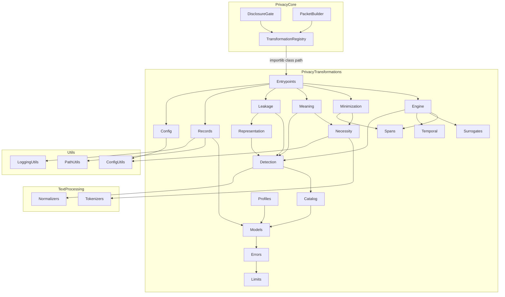
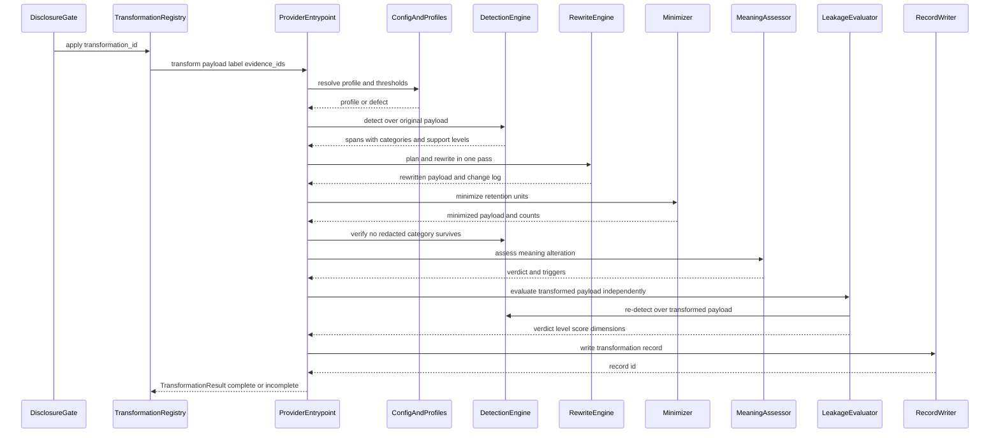
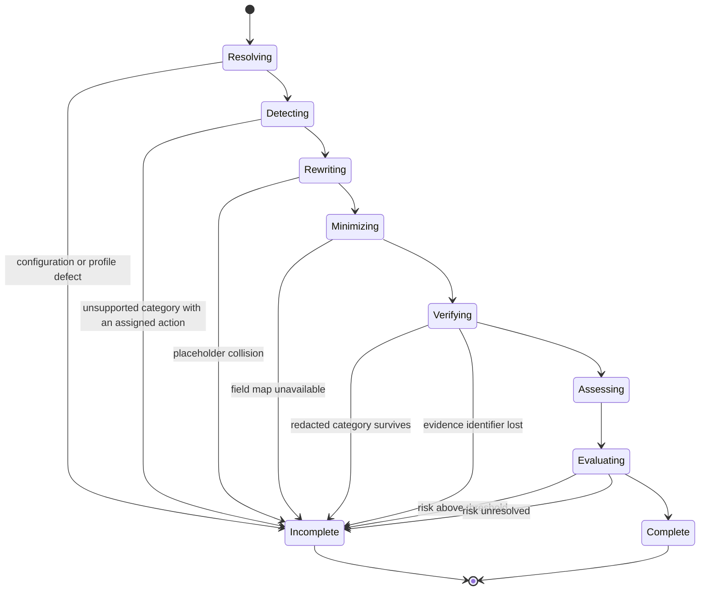
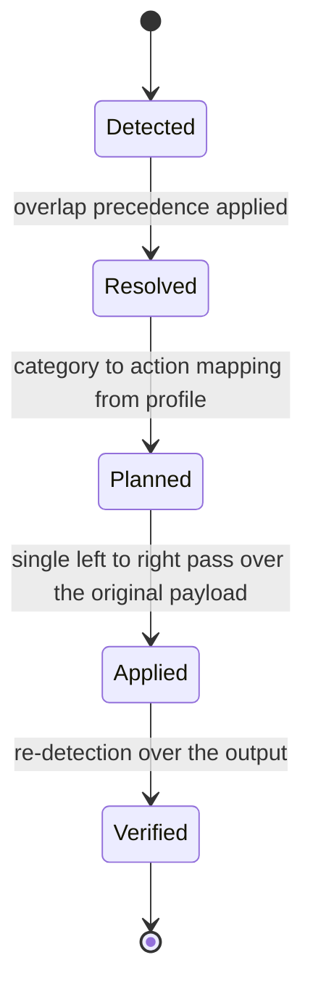
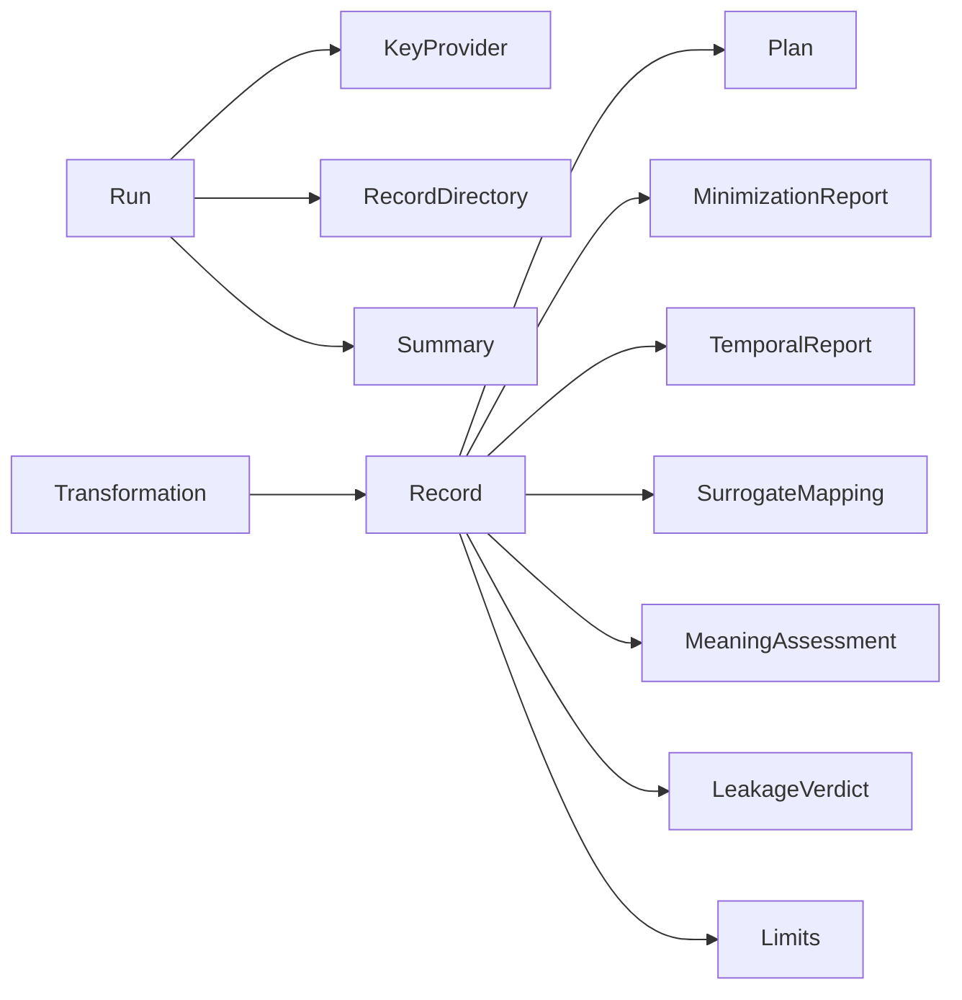

# Design Document — privacy-transformations

## Overview

**Purpose**: This feature supplies the transformation provider that `privacy-core` dispatches to and deliberately does not implement. It introduces `src/privacy_transformations/`, a package that owns a closed, versioned identifier catalogue with a declared detection-support level per category; one deterministic detect-plan-rewrite engine driven by declarative transformation profiles; a unit-level minimizer whose necessity definition is derived from the active extraction field map; a meaning-alteration assessor with a three-valued verdict; representation governance for encoder outputs; a leakage-risk evaluator that is structurally prevented from scoring its own inputs' producer; run-scoped transformation records; and a fixed limits statement embedded in every artifact.

**Users**: Clinical researchers whose corpora are currently blocked by `privacy-core`'s fail-closed default posture; data stewards and institutional reviewers who read the transformation records and risk reports. The only direct code consumer is `privacy-core`'s `TransformationRegistry`, which loads this package's entrypoint classes by class path and never imports the package statically. Downstream, `public-private-provenance` consumes surrogate mapping records and anchor-safety findings, and `reviewer-ui` renders the meaning-altered and risk-unresolved states.

**Impact**: The shipped `restricted-transform` policy profile stops blocking. Today `privacy-core` ships `configs/privacy_policies.yaml` with `required_transformation: "redact"` and an empty provider registry, so every label above `public_safe` blocks with rationale `transformation_unavailable`. After this feature, registering `privacy_transformations.entrypoints.RedactProvider` satisfies that dispatch. Nothing else in the repository changes behaviour: the disclosure gate, the packet builder, the gateway, and the prompt-cache-stable shared prefix are untouched.

### Goals

- A registered provider that turns `allow_transformed` from a theoretical decision into a working one.
- Every capability claim measured against a fabricated corpus with ground truth, with regression-failing baselines.
- Every operational definition that stands in for a vaguer concept states the gap it does not cover, in the artifact itself.
- Byte-deterministic output, because `privacy-core`'s prompt-cache stability depends on the packet payload being reproducible.
- Fail-closed through exactly one mechanism: an incomplete transformation result.
- Controls, records, and audit surfaces only — never a de-identification guarantee, an expert determination, or a compliance claim.

### Non-Goals

- Deciding disclosure. `privacy-core`'s `DisclosureGate.evaluate()` remains the sole construct site of a `DisclosureDecision`.
- Any machine-learned identifier detector, clinical named-entity recognizer, encoder selection, or third-party de-identification service.
- Storing surrogate-to-original mappings, authorizing their resolution, or logging their access — the vault, owned by `public-private-provenance`.
- Cryptographic commitments, safe-reference substitution for provenance anchors, tamper-evidence.
- Any statistical disclosure-control estimate, re-identification probability, or population-level rarity claim.
- Registering a `SensitivityDetector` or a `ResponseScanner` with `privacy-core`.
- Any user interface. Records and summaries are data.

## Boundary Commitments

### This Spec Owns

- The closed, versioned `IdentifierCategory` catalogue, its per-category detection-support level, and the quasi-identifier catalogue.
- Pattern and gazetteer detection, span precedence resolution, and the offset-safe rewrite plan.
- The `TransformationProfile` format, the profile file, its structural validation, and the named `transformation_id`s that policy profiles reference.
- The four rewrite actions (`passthrough`, `redact`, `pseudonymize`, `temporal`) and their postconditions.
- Surrogate derivation, the run-scoped key provider, the surrogate stability contract, the `SurrogateMapping` handoff record, and the **pinned wire schema of the surrogate handoff artifact** (`surrogate_handoff.json`) that carries it to `public-private-provenance`. **Not** its persistence, its resolution, or its ingest.
- The necessity vocabulary derived from the active extraction field map, the retention-unit boundary, and the minimization pass.
- The three temporal modes, the interval-preservation contract, age bucketing, and unparsed-date handling.
- The operational definition of meaning alteration, its triggers, and the `MeaningVerdict` vocabulary.
- Representation labelling inheritance, the declared representation checks, structure-retention measures, and the anchor-safety finding.
- `RuleBasedLeakageRubric` v1: its five dimensions, its ordinal scale, its aggregation, its `unresolved` rule, and its threshold gating.
- The `TransformationRecord`, the run-level summary, their schema version, and their run-scoped artifact layout.
- `LIMITS_TEXT` and the prohibition on asserting `de-identified`, `anonymized`, or `safe` in any artifact.
- The synthetic evaluation corpus, its generator, its ground truth, and the versioned detection baseline.
- The `privacy_transformations` configuration block and the new dependency-direction rules for this package.

### Out of Boundary

- Producing a `DisclosureDecision`, evaluating a policy, building an `EvidencePacket`, writing the privacy audit trail, resolving a secret, or classifying sensitivity — all `privacy-core`.
- Defining evidence node identity. `node_id = f"{source_id}#{local_id}"` is consumed from `provenance-core` and never redefined, rewritten, or replaced.
- Persisting or resolving surrogate mappings, vault access control, access logging (priv R10) — `public-private-provenance`.
- Substituting safe references for provenance anchors, cryptographic commitments (priv R12, R13) — `public-private-provenance`.
- Changing `TransformationProvider`, `TransformationResult`, `EvidencePacket`, `DisclosureDecision`, `_shared_paper_prefix`, `prompts.py`, the extraction map contents, or any prompt material.
- Changing extraction, quality control, PDF extraction, or text-processing behaviour. Those packages are not modified.
- Any legal, regulatory, certification, or expert-determination claim.

### Allowed Dependencies

- `src/privacy_transformations/` may import **only** `src/utils/`, `src/text_processing/`, and the Python standard library — plus `src/privacy/` from exactly one module, `entrypoints.py`, which is the sole place the upstream `TransformationResult` type is named.
- `src/privacy/` must **not** import `privacy_transformations`. The coupling is one-directional and dynamic: `privacy-core`'s `load_providers()` resolves the entrypoint classes by `importlib` class path at runtime.
- `agents`, `pdf_extractor`, `quality_control`, `text_processing`, `provenance`, and `pipeline` must **not** import `privacy_transformations`.
- `src/disclosure/` (`public-private-provenance`) must **not** import `privacy_transformations` either, and this package must not import `disclosure`. The surrogate handoff therefore crosses **as a file, not as a call**: this package writes the run-scoped `surrogate_handoff.json` artifact against a pinned, versioned schema (see *Surrogate handoff artifact* under Data Contracts & Integration), and `public-private-provenance`'s vault reads it by path. **A file-based handoff with a versioned schema needs no import edge in either direction** — the schema version is the compatibility contract, which is exactly why neither Allowed-Dependencies list has to be widened and why the mutual prohibition above can stay absolute. The producer never learns the consumer exists; the consumer never links against the producer.
- Reuse of `text_processing` is limited to `UnicodeNormalizer`, `WhitespaceNormalizer`, and `SimpleWordTokenizer`. `matchers`, `embedding`, and every `SentenceSegment` backend are excluded, so no heavy optional dependency is reachable from this package at any import depth.
- No new third-party dependency. `re`, `hashlib`, `hmac`, `secrets`, `json`, `unicodedata`, `datetime`, `pathlib`, `threading` from the standard library, plus the `yaml` already used by `config_utils`.

### Revalidation Triggers

- Any change to `TransformationProvider.transform` or to `TransformationResult`'s fields — breaks `entrypoints.py`, the sole coupling point.
- Any change to `IDENTIFIER_CATALOG_VERSION`'s member set or to the detection-support level of a category — invalidates every recorded baseline and every stored transformation record.
- Any change to `LEAKAGE_RUBRIC_VERSION`, its dimensions, its ordinal scale, or its aggregation rule — invalidates every stored risk verdict and every threshold an operator has configured.
- Any change to `MeaningVerdict` or to the trigger set — breaks `reviewer-ui`'s meaning-altered surface.
- Any change to the `SurrogateMapping` shape, to the surrogate stability scope, or to `SURROGATE_HANDOFF_SCHEMA_VERSION` / the `surrogate_handoff.json` field set, filename, or location — breaks `public-private-provenance`'s vault ingest. A matching trigger is recorded on that spec's side, so a schema change fires revalidation of both specs.
- A major bump of `TRANSFORMATION_RECORD_SCHEMA_VERSION` or `TRANSFORMATION_PROFILE_SCHEMA_VERSION` — breaks every artifact reader.
- Any change to the determinism contract (1.7) — directly threatens `privacy-core`'s prompt-cache stability.
- Adding a `risk_verdict` or `meaning_verdict` field to `DisclosureDecision` upstream — retires the by-reference attachment recorded in 10.7 and requires a coordinated change here.

## Architecture

### Existing Architecture Analysis

Five facts about the completed upstream determine this design.

| Existing fact | Location | Consequence for this design |
|---|---|---|
| `TransformationProvider.transform(payload, *, label, evidence_ids) -> TransformationResult`, and `TransformationResult` carries only `payload`, `complete`, `preserved_evidence_ids`, `detail: str \| None` | `privacy-core` design, TransformationRegistry | Every finding richer than a string must travel out-of-band as a run-scoped artifact, referenced from `detail` |
| `load_providers(class_paths)` constructs providers with **no arguments** | `privacy-core` design, TransformationRegistry | Providers must be zero-arg constructible; configuration is read in one module and a configuration defect surfaces as an incomplete result per call, not a construction error |
| Dispatch is fail-closed on unregistered, raised, and `complete is False` | `privacy-core` design, 6.5 / 9.3 | This spec needs no blocking mechanism of its own; `complete=False` is the whole vocabulary |
| `PacketBuilder` blocks unless `preserved_evidence_ids` is a superset of what it requires | `privacy-core` design, 6.2 | Identifier preservation is a hard postcondition; minimization must suppress unit *text* while retaining unit *identity* |
| The packet payload is produced **once per document** and reused byte-identically for warmup, every chunk, and synthesis | `privacy-core` design, PacketBuilder | Non-determinism here would silently break prompt-cache stability; determinism is a first-class requirement with a property test |
| `src/privacy/` may import only `utils`, `provenance`, and stdlib; an AST test forbids `privacy → text_processing` | `privacy-core` design, Allowed Dependencies | The implementation cannot live in `src/privacy/`; a sibling package reached by `importlib` is the only legal placement |

Repository constraints preserved unchanged: no global mutation and explicit config passing; heavy optional dependencies never imported at module level; one module owns each package's shared dataclasses; run-scoped output paths; closed `Literal` vocabularies; AST-enforced dependency direction; new top-level YAML keys registered in `_ALL_KNOWN_TOP_LEVEL_KEYS`.

### Architecture Pattern & Boundary Map

Selected pattern: **a pure pipeline over an immutable payload, with a declarative plan and an independent auditor**. Detection, planning, and rewriting are pure functions of `(payload, profile, catalogue, key material)`. The leakage evaluator sits *upstream of every transformer in the dependency order*, so it structurally cannot import one — independence is enforced by the same left-to-right import rule that governs the rest of the package, not by convention.



**Architecture Integration**

- **Dependency direction** (exhaustive; every module appears exactly once): `utils, text_processing → limits → errors → models → catalog → profiles → config → necessity → detection → spans → representation → leakage → surrogates → temporal → minimization → engine → meaning → records → entrypoints`. Each module imports only from modules to its left. `leakage` is placed deliberately to the **left** of every transformer so that Requirement 9.8 is a consequence of the import rule rather than an extra assertion. `entrypoints` is the rightmost module and the only one that imports `privacy`.
- **Domain boundaries**: *cataloguing* (catalog, profiles, config) is separate from *finding* (necessity, detection, spans), which is separate from *judging* (representation, leakage), which is separate from *changing* (surrogates, temporal, minimization, engine), which is separate from *reporting* (meaning, records), which is separate from *integration* (entrypoints). These six are the parallel-safe task seams and they match the brief's boundary candidates.
- **Existing patterns preserved**: single-module ownership of shared dataclasses (mirrors `quality_control/models.py` and `privacy/models.py`); declarative profile file with structural validation that degrades to "everything unusable" rather than "partially applied" (mirrors `privacy/policy.py`); run-scoped artifact paths via `resolve_run_output_path`; closed `Literal` vocabularies; single-importer discipline for the one cross-package import (mirrors `privacy/carrier.py`).
- **New components rationale**: each module maps to exactly one requirement group. `spans.py` exists separately from `engine.py` because offset-safe rewriting is the one correctness property that every action depends on and it deserves its own property-test surface. Nothing exists speculatively.

### Technology Stack

| Layer | Choice / Version | Role in Feature | Notes |
|-------|------------------|-----------------|-------|
| Runtime | Python 3.12.x | Package language | Matches repo pin |
| Domain model | `dataclasses` (frozen) + `typing.Literal` + `typing.Protocol` | Records, closed vocabularies, key-provider interface | `from __future__ import annotations` throughout |
| Detection | stdlib `re` with pre-compiled, anchored patterns; `unicodedata` for normalization | Pattern-based identifier detection | No regex engine dependency; catastrophic backtracking avoided by bounded quantifiers, asserted by a timing test |
| Surrogates | `hmac` + `hashlib.sha256` + `secrets.token_bytes` (stdlib) | Non-invertible, scope-keyed surrogate derivation | Key material is ephemeral and in-memory only |
| Declarations | YAML via the already-present loader | `configs/privacy_transformation_profiles.yaml` | Validated against a closed structural schema in code |
| Persistence | JSON (stdlib `json`) → `outputs/run_<ts>/privacy/transformations/` | Transformation records, run summary, risk reports | Same run-scoped pattern as the privacy audit trail |
| Text utilities | `text_processing.UnicodeNormalizer`, `WhitespaceNormalizer`, `SimpleWordTokenizer` | Normalization before detection; tokenization for the necessity vocabulary | Reuse, not fork; heavy backends excluded by the allowed-dependency rule |
| Config | `configs/config.yaml` top-level `privacy_transformations:` block | Profiles path, thresholds, gazetteers, temporal settings | Registered in `_ALL_KNOWN_TOP_LEVEL_KEYS` |
| Tests | pytest + Hypothesis | Unit, property, AST boundary, corpus-baseline regression | Hypothesis for offset safety, determinism, interval preservation, and the `unresolved` absorbing rule |

No new third-party dependency is introduced.

## File Structure Plan

### Directory Structure

```
src/privacy_transformations/
├── __init__.py         # Public surface; re-exports models, engine, leakage, records
├── limits.py           # LIMITS_TEXT, PROHIBITED_ASSERTION_TERMS, schema/rubric version constants
├── errors.py           # TransformationDefect hierarchy; internal-only, never crosses transform()
├── models.py           # All closed vocabularies and shared frozen records:
│                       # IdentifierCategory, DetectionSupport, RewriteAction, TemporalMode,
│                       # MeaningVerdict, LeakageDimension, LeakageScore, LeakageLevel,
│                       # FailureCategory, DetectedSpan, RewritePlanEntry, SurrogateMapping,
│                       # MinimizationReport, TemporalReport, MeaningAssessment,
│                       # RepresentationEvaluation, LeakageVerdict, TransformationRecord
├── catalog.py          # Identifier + quasi-identifier catalogues; per-category support level;
│                       # placeholder and surrogate token forms; IDENTIFIER_CATALOG_VERSION
├── profiles.py         # TransformationProfile format, file loading, structural validation
├── config.py           # load_transformations_config(); the ONLY module reading config.yaml
├── necessity.py        # NecessityVocabulary built from the active extraction field map
├── detection.py        # Pattern + gazetteer detectors; DetectionEngine.detect()
├── spans.py            # Span precedence resolution and the offset-safe single-pass rewriter
├── representation.py   # Representation label inheritance, declared checks, structure retention,
│                       # anchor-safety finding
├── leakage.py          # RuleBasedLeakageRubric v1; imports only limits/errors/models/catalog/
│                       # necessity/detection/spans/representation — never a transformer
├── surrogates.py       # SurrogateKeyProvider protocol; EphemeralRunKeyProvider; derivation
├── temporal.py         # Relative / shift / suppress modes; age bucketing; unparsed dates
├── minimization.py     # Retention-unit segmentation and the minimization pass
├── engine.py           # detect -> plan -> rewrite; the single offset-safe transformation core
├── meaning.py          # MeaningAlterationAssessor and its declared triggers
├── records.py          # TransformationRecordWriter; run-level summary; append-only artifacts;
│                       # surrogate_handoff.json under SURROGATE_HANDOFF_SCHEMA_VERSION
└── entrypoints.py      # Zero-arg TransformationProvider classes. The ONLY module importing privacy.
```

```
tests/src/privacy_transformations/
├── test_pt_limits.py                  # limits text present, prohibited assertion terms absent
├── test_pt_models.py                  # vocabulary closure, frozen records, ordinal ordering
├── test_pt_catalog.py                 # category closure, support levels, version constant
├── test_pt_profiles.py                # profile loading, defect handling, unknown category
├── test_pt_config.py                  # defaults, threshold parsing, unknown-key rejection
├── test_pt_necessity.py               # vocabulary built from field map; empty map defect
├── test_pt_detection.py               # per-category detection, gazetteer, overlap precedence
├── test_pt_spans.py                   # offset safety, no rewrite-of-rewrite, precedence record
├── test_pt_representation.py          # label inheritance, three checks, structure retention
├── test_pt_leakage.py                 # per-dimension table, aggregation, unresolved absorption
├── test_pt_surrogates.py              # stability in scope, divergence across scopes, no residue
├── test_pt_temporal.py                # interval preservation, suppression totality, age cap
├── test_pt_minimization.py            # identifier retention, drop accounting, uncertain retained
├── test_pt_engine.py                  # profile-driven actions, determinism, verify-after-rewrite
├── test_pt_meaning.py                 # each trigger positive and negative; undetermined path
├── test_pt_records.py                 # schema, append-only, no residue, run summary
├── test_pt_entrypoints.py             # zero-arg construction, complete/incomplete contract
├── test_pt_import_isolation.py        # imports with privacy and pipeline absent from sys.modules
└── test_pt_fail_closed.py             # cross-cutting: every blocking condition yields complete=False
```

```
tests/src/privacy_transformations/corpus/
├── generate_corpus.py                 # Seeded generator; reserved-range values only
├── synthetic_corpus.json              # Fabricated documents + manifest (synthetic: true, seed)
├── ground_truth.json                  # Identifier spans, unit necessity, quasi-identifier tuples
├── detection_baseline.json            # Versioned per-category recall/precision floors
├── test_pt_corpus_integrity.py        # Reserved-range assertion; no real-data patterns
└── test_pt_detection_baseline.py      # Measured recall/precision vs baseline; fails on regression
```

```
tests/steering/
└── test_privacy_transformations_boundaries.py   # AST: dependency direction, single privacy importer,
                                                 # leakage imports no transformer, no assertion terms
```

### Modified Files

- `src/utils/config_utils.py` — register `"privacy_transformations"` in `_ALL_KNOWN_TOP_LEVEL_KEYS`, add `_PRIVACY_TRANSFORMATIONS_DEFAULTS` and `load_privacy_transformations_config(config)`.
- `src/utils/path_utils.py` — add `PRIVACY_TRANSFORMATIONS_DIR = resolve_run_output_path("privacy/transformations")`.
- `configs/config.yaml` — add the `privacy_transformations:` block.
- `configs/privacy_transformation_profiles.yaml` — **new**. Profile definitions with a schema version.
- `configs/config.yaml` (`privacy:` block) — populate `privacy.transformation_providers` with this package's entrypoint class paths. `configs/privacy_policies.yaml` is **not** modified: its `required_transformation: "redact"` now resolves because a provider is registered.
- `tests/test_dependency_directions.py` — add the following `FORBIDDEN_PAIRS` entries, and exactly these: `privacy → privacy_transformations`, `privacy_transformations → agents`, `privacy_transformations → pipeline`, `privacy_transformations → pdf_extractor`, `privacy_transformations → quality_control`, `privacy_transformations → provenance`, `privacy_transformations → disclosure`, `disclosure → privacy_transformations`. Plus the single-importer test for `privacy` inside this package. The last two pin the file-based surrogate handoff: neither side may acquire an import edge to the other. The enumerated list is the contract; no acceptance check may assert a bare count independently of it.

## System Flows

### One transformation, from dispatch to result



Key decisions not visible in the diagram: detection runs **twice on purpose** — once by the engine over the original payload and once by the evaluator over the transformed payload — because a rubric that trusted the engine's change log would be scoring the transformer's own account of itself (9.3, 9.8). The record is written **before** the result is returned, so a verdict always has a durable artifact behind the reference in `detail` (10.1, 10.4). Any internal defect is caught at the entrypoint and converted to an incomplete result, so no exception crosses the `transform()` boundary (1.3).

### Result completeness decision



There is deliberately no transition from any `Incomplete` state back into the flow, and no state that emits a payload without passing `Verifying` and `Evaluating`. A test asserts the transition table contains no edge from an incomplete cause to `Complete`.

### Rewrite-plan construction



The plan is built entirely against **original** offsets and applied once; no action ever observes text produced by another action (3.3). Rewrites are applied in ascending start offset with a running output buffer, so an action's replacement length never perturbs a later action's source offsets.

## Requirements Traceability

| Requirement | Summary | Components | Interfaces | Flows |
|-------------|---------|------------|------------|-------|
| 1.1, 1.2, 1.4, 1.5, 1.6, 1.7 | Complete-or-incomplete contract; identifier preservation; named failure cause; no decision authority; zero-arg construction; determinism | ProviderEntrypoints, TransformationModels | `RedactProvider.transform`, `TransformationResult`, `FailureCategory` | One transformation; Result completeness |
| 1.3 | Raise, timeout, or unmet postcondition yields incomplete | ProviderEntrypoints, TransformationErrors | `TransformationDefect`, `_to_incomplete` | Result completeness |
| 2.1, 2.2, 2.3, 2.6, 2.7 | Closed catalogue; support levels; span records; overlap precedence; per-category counts | IdentifierCatalog, DetectionEngine, SpanPlanner | `IdentifierCategory`, `DetectionSupport`, `DetectedSpan`, `resolve_overlaps` | Rewrite-plan construction |
| 2.4 | Unsupported category with an assigned action blocks | DetectionEngine, ProfileRegistry, ProviderEntrypoints | `Profile.actions`, `FailureCategory.unsupported_category` | Result completeness |
| 2.5 | Operator gazetteer matching | DetectionEngine, TransformationConfig | `GazetteerDetector.detect` | One transformation |
| 3.1, 3.3, 3.4 | Category-marked placeholder; single offset-safe pass; idempotent placeholder | RewriteEngine, SpanPlanner, IdentifierCatalog | `apply_plan`, `placeholder_for` | Rewrite-plan construction |
| 3.2 | Verify no redacted category survives | RewriteEngine, DetectionEngine | `verify_absence` | Result completeness |
| 3.5 | Placeholder collision blocks | RewriteEngine, IdentifierCatalog | `FailureCategory.placeholder_collision` | Result completeness |
| 4.1, 4.2, 4.3, 4.4 | Tagged surrogate; stability in scope; divergence across scopes; non-invertible | SurrogateGenerator | `SurrogateGenerator.surrogate_for`, `SurrogateKeyProvider` | One transformation |
| 4.5, 4.6, 4.7 | Mapping handoff via the pinned `surrogate_handoff.json` artifact; no surrogate-to-original mapping anywhere; run-scoped stability declared | SurrogateGenerator, TransformationRecordWriter | `SurrogateMapping`, `key_version`, `SURROGATE_HANDOFF_SCHEMA_VERSION`, `write_surrogate_handoff` | One transformation |
| 5.1, 5.2, 5.6 | Necessity vocabulary from field map; retention rule; uncertain retained | NecessityVocabulary, Minimizer | `NecessityVocabulary.build`, `Minimizer.minimize` | One transformation |
| 5.3 | Dropped units keep their evidence identifier | Minimizer | `SUPPRESSED_UNIT_MARKER` | One transformation |
| 5.4, 5.7 | Retention accounting; measured recall of necessary content | Minimizer, DetectionBaseline | `MinimizationReport` | One transformation |
| 5.5 | Missing or empty field map blocks | NecessityVocabulary | `FailureCategory.field_map_unavailable` | Result completeness |
| 6.1, 6.2, 6.3, 6.4, 6.7 | Three modes; interval preservation; suppression totality; scope-derived offset | TemporalAbstractor | `TemporalMode`, `TemporalAbstractor.apply` | Rewrite-plan construction |
| 6.5 | Age cap bucketing | TemporalAbstractor, IdentifierCatalog | `age_bucket_marker` | One transformation |
| 6.6 | Unparsed date suppressed and recorded | TemporalAbstractor | `TemporalReport.unparsed` | One transformation |
| 7.1, 7.2, 7.3, 7.4, 7.6 | Three-valued verdict and its four triggers | MeaningAlterationAssessor, NecessityVocabulary | `MeaningVerdict`, `MeaningAssessment` | One transformation |
| 7.5 | Assessment failure yields undetermined, treated as altered | MeaningAlterationAssessor, ProviderEntrypoints | `MeaningVerdict.undetermined` | Result completeness |
| 7.7 | Unchanged is not a claim of clinical equivalence | MeaningAlterationAssessor, LimitsStatement | `LIMITS_TEXT` | — |
| 8.1 | Strictest contributing label inherited | RepresentationGovernor | `inherit_label` | One transformation |
| 8.2, 8.3 | Declared checks; structure-retention measures | RepresentationGovernor, DetectionEngine | `RepresentationEvaluation` | One transformation |
| 8.4 | Unevaluated never reported low risk | RepresentationGovernor, LeakageRiskEvaluator | `EvaluationStatus.unevaluated` | Result completeness |
| 8.5, 8.6 | No added anchors; anchor-safety finding on supplied identifiers | RepresentationGovernor, DetectionEngine | `anchor_safety_findings` | One transformation |
| 8.7 | Structural checks are not a non-identifying determination | RepresentationGovernor, LimitsStatement | `LIMITS_TEXT` | — |
| 9.1, 9.2, 9.4, 9.7 | Named versioned rubric; five ordinal dimensions; overall verdict and score; recorded inputs | LeakageRiskEvaluator | `RuleBasedLeakageRubric`, `LeakageVerdict` | One transformation |
| 9.3, 9.8 | Independent re-detection; no transformer dependency | LeakageRiskEvaluator, DetectionEngine | dependency-order placement; AST test | One transformation |
| 9.5 | Indeterminate or failure absorbs to unresolved | LeakageRiskEvaluator | `LeakageLevel.unresolved` | Result completeness |
| 9.6 | Threshold gating yields incomplete | LeakageRiskEvaluator, ProviderEntrypoints | `thresholds`, `FailureCategory.leakage_above_threshold` | Result completeness |
| 9.9 | Ordinal heuristic, not a risk estimate | LeakageRiskEvaluator, LimitsStatement | `LIMITS_TEXT` | — |
| 10.1, 10.2, 10.5, 10.6 | Record artifact; contents; run summary; append-only | TransformationRecordWriter | `TransformationRecord`, `write`, `summarize` | One transformation |
| 10.3 | No residue in any record or log | TransformationRecordWriter, TransformationModels | record field allowlist | — |
| 10.4, 10.7 | Compact reference in the result; deferral of direct attachment | ProviderEntrypoints, TransformationRecordWriter | `detail` reference format | One transformation |
| 11.1, 11.2 | Fabricated corpus; reserved-range values only | SyntheticCorpusGenerator | `generate_corpus`, corpus manifest | — |
| 11.3, 11.4, 11.5 | Measured recall and precision vs versioned baseline; unsupported excluded | DetectionBaseline | `detection_baseline.json` | — |
| 11.6, 11.7, 11.8 | Limits statement; embedded everywhere; no assertion terms | LimitsStatement, TransformationRecordWriter | `LIMITS_TEXT`, `PROHIBITED_ASSERTION_TERMS` | — |

## Components and Interfaces

| Component | Domain/Layer | Intent | Req Coverage | Key Dependencies (P0/P1) | Contracts |
|-----------|--------------|--------|--------------|--------------------------|-----------|
| LimitsStatement | Definition | Fixed honest-limits text and prohibited assertion terms | 7, 8, 9, 11 | none | State |
| TransformationErrors | Definition | Internal defect hierarchy that never crosses `transform()` | 1 | LimitsStatement (P1) | State |
| TransformationModels | Definition | All closed vocabularies and shared frozen records | 1–11 | TransformationErrors (P0) | State |
| IdentifierCatalog | Cataloguing | Category catalogue, support levels, placeholder forms | 2, 3, 6 | TransformationModels (P0) | State |
| ProfileRegistry | Cataloguing | Profile file loading and structural validation | 1, 2, 3, 4, 6 | TransformationModels (P0) | State |
| TransformationConfig | Cataloguing | Sole reader of the configuration block | 1, 2, 6, 9 | ConfigUtils (P1) | State |
| NecessityVocabulary | Finding | Necessity terms derived from the active field map | 5, 7 | ConfigUtils (P1), text_processing tokenizer (P1) | Service |
| DetectionEngine | Finding | Pattern and gazetteer detection producing categorized spans | 2, 3, 8, 9 | IdentifierCatalog (P0), text_processing normalizers (P1) | Service |
| SpanPlanner | Finding | Overlap precedence and the offset-safe single-pass rewriter | 2, 3 | TransformationModels (P0) | Service |
| RepresentationGovernor | Judging | Label inheritance, declared checks, structure retention, anchor safety | 8 | DetectionEngine (P0), NecessityVocabulary (P1) | Service |
| LeakageRiskEvaluator | Judging | Independent ordinal rubric and threshold gating | 9 | DetectionEngine (P0), RepresentationGovernor (P0) | Service |
| SurrogateGenerator | Changing | Scope-keyed, non-invertible surrogates and the mapping handoff | 4 | TransformationModels (P0) | Service |
| TemporalAbstractor | Changing | Relative, shift, and suppress modes; age cap; unparsed dates | 6 | IdentifierCatalog (P0), SurrogateGenerator (P1) | Service |
| Minimizer | Changing | Retention-unit segmentation and the necessity-driven pass | 5 | NecessityVocabulary (P0), SpanPlanner (P1) | Service |
| RewriteEngine | Changing | detect → plan → rewrite → verify, in one offset-safe pass | 1, 2, 3, 4, 6 | DetectionEngine (P0), SpanPlanner (P0), SurrogateGenerator (P0), TemporalAbstractor (P0) | Service |
| MeaningAlterationAssessor | Reporting | Declared triggers and the three-valued verdict | 7 | NecessityVocabulary (P0), DetectionEngine (P1) | Service |
| TransformationRecordWriter | Reporting | Run-scoped append-only records and the run summary | 10, 11 | TransformationModels (P0), PathUtils (P1) | Service, Batch |
| ProviderEntrypoints | Integration | Zero-arg providers implementing the upstream protocol | 1, 2, 5, 7, 9, 10 | all of the above (P0), `privacy` (P0) | Service |
| SyntheticCorpusGenerator | Validation | Seeded fabricated corpus and ground truth | 11 | none | Batch |
| DetectionBaseline | Validation | Measured accuracy against versioned floors | 5, 11 | SyntheticCorpusGenerator (P0), DetectionEngine (P0) | Batch |

### Definition Layer

#### LimitsStatement

| Field | Detail |
|-------|--------|
| Intent | Ship the honest limits as a constant, not as prose someone can forget to copy |
| Requirements | 7.7, 8.7, 9.9, 11.6, 11.7, 11.8 |

**Responsibilities & Constraints**
- `LIMITS_TEXT` is a single fixed string stating: all measurements derive from fabricated fixtures and do not transfer to real corpora; pattern-based detection does not find person names, geographic subdivisions, or free-text identifiers; risk levels are ordinal heuristics with no probability semantics; an `unchanged` meaning verdict means no declared trigger fired and asserts no clinical equivalence; representation checks are structural and measure no embedding invertibility; nothing produced here is a de-identification guarantee, an expert determination, or a compliance conclusion.
- `PROHIBITED_ASSERTION_TERMS` is the single owner of the terms that may never appear as an asserted artifact name, field, or value: `de-identified`, `anonymized`, `safe`, `compliant`, `certified`, `approved`. A repository text scan consumes it; nothing defines a second copy. The negating context inside `LIMITS_TEXT` is the one permitted appearance.
- Holds the version constants: `IDENTIFIER_CATALOG_VERSION`, `TRANSFORMATION_PROFILE_SCHEMA_VERSION`, `TRANSFORMATION_RECORD_SCHEMA_VERSION`, `SURROGATE_HANDOFF_SCHEMA_VERSION`, `LEAKAGE_RUBRIC_VERSION`, all `"1.0.0"` at first ship. `SURROGATE_HANDOFF_SCHEMA_VERSION` is versioned separately from the record schema precisely because it is the cross-spec wire contract read by `public-private-provenance`; a record-schema bump must not force a handoff-schema bump or vice versa.

**Contracts**: State [x]

#### TransformationModels

| Field | Detail |
|-------|--------|
| Intent | Single owner of every vocabulary and every record shared across more than one module |
| Requirements | 1.4, 2.1, 2.2, 2.3, 4.5, 5.4, 6.1, 7.1, 8.2, 9.2, 9.4, 10.2 |

**Responsibilities & Constraints**
- **Ownership rule**: `models.py` owns every closed vocabulary and every record consumed by more than one module. Exactly three modules outside it declare a dataclass, and the list is exhaustive: `TransformationProfile` and `ProfileFile` (`profiles.py`), `TransformationSettings` (`config.py`), and `NecessityVocabulary` (`necessity.py`, because it carries lookup behaviour rather than data).
- All records are `@dataclass(frozen=True)`; a produced finding is not revisable.
- Ordinal vocabularies carry an explicit total-order mapping (`LEAKAGE_SCORE_ORDER`, `SUPPORT_STRICTNESS`) as data, never as a chain of comparisons.
- No record carries an original identifier surface form, a dropped unit's text, or a surrogate-to-original mapping. `SurrogateMapping` is the one record naming surrogates, and it names **only** surrogates, categories, scope, and key version — never the originals.

**Contracts**: State [x]

##### State Management

```python
IdentifierCategory = Literal[
    "person_name", "geographic_subdivision", "date_full", "age_over_cap",
    "telephone", "fax", "email", "national_id_like", "record_number_like",
    "health_plan_id", "account_id", "license_id", "vehicle_id", "device_id",
    "url", "ip_address", "biometric_ref", "image_ref", "other_unique_id",
]
DetectionSupport = Literal["pattern", "gazetteer", "unsupported"]
RewriteAction   = Literal["passthrough", "redact", "pseudonymize", "temporal"]
TemporalMode    = Literal["relative", "shift", "suppress"]
MeaningVerdict  = Literal["unchanged", "possibly_altered", "undetermined"]
LeakageDimension = Literal[
    "direct_identifiers", "quasi_identifiers", "rare_patterns",
    "reconstructability", "linkage",
]
LeakageScore = Literal["none", "low", "moderate", "high", "indeterminate"]
LeakageLevel = Literal["low", "moderate", "high", "unresolved"]
EvaluationStatus = Literal["evaluated", "unevaluated"]
FailureCategory = Literal[
    "configuration_defect", "profile_defect", "unsupported_category",
    "placeholder_collision", "field_map_unavailable", "identifier_lost",
    "redacted_category_survived", "meaning_assessment_failed",
    "leakage_above_threshold", "leakage_unresolved", "internal_defect",
    "time_budget_exceeded",
]

LEAKAGE_SCORE_ORDER: Mapping[LeakageScore, int] = {
    "none": 0, "low": 1, "moderate": 2, "high": 3, "indeterminate": 99,
}

@dataclass(frozen=True)
class DetectedSpan:
    category: IdentifierCategory
    start: int                          # offset in the ORIGINAL payload
    end: int
    support: DetectionSupport
    detector_id: str

@dataclass(frozen=True)
class RewritePlanEntry:
    span: DetectedSpan
    action: RewriteAction
    replacement: str                    # placeholder, surrogate, or temporal form

@dataclass(frozen=True)
class SurrogateMapping:
    scope_id: str
    key_version: str
    stability: Literal["run_scoped"]    # cross-run stability requires the vault
    entries: tuple[tuple[IdentifierCategory, str], ...]   # (category, surrogate) ONLY

@dataclass(frozen=True)
class MinimizationReport:
    units_examined: int
    units_retained: int
    units_dropped: int
    retention_ratio: float
    dropped_unit_ids: tuple[str, ...]

@dataclass(frozen=True)
class TemporalReport:
    mode: TemporalMode
    scope_id: str
    interval_preserving: bool
    dates_transformed: int
    ages_bucketed: int
    unparsed_suppressed: int

@dataclass(frozen=True)
class MeaningAssessment:
    verdict: MeaningVerdict
    triggers: tuple[str, ...]
    affected_unit_ids: tuple[str, ...]
    note: str                           # always includes the 7.7 statement

@dataclass(frozen=True)
class RepresentationEvaluation:
    status: EvaluationStatus
    inherited_label: str                # strictest contributing sensitivity label
    raw_text_retained: bool
    reconstructability_factors: Mapping[str, Any]
    identifier_spans_in_representation: int
    numeric_token_retention: float
    section_label_retention: float
    evidence_id_retention: float
    anchor_safety_findings: tuple[str, ...]
    note: str                           # always includes the 8.7 statement

@dataclass(frozen=True)
class LeakageVerdict:
    rubric_version: str
    status: EvaluationStatus
    dimension_scores: Mapping[LeakageDimension, LeakageScore]
    dimension_inputs: Mapping[LeakageDimension, Mapping[str, Any]]
    level: LeakageLevel
    aggregate_score: int
    thresholds: Mapping[str, Any]
    note: str                           # always includes the 9.9 statement

@dataclass(frozen=True)
class TransformationRecord:
    record_id: str                      # sha256 over the record's own content
    schema_version: str
    profile_id: str
    profile_version: str
    catalog_version: str
    rubric_version: str
    transformation_id: str
    label: str
    evidence_id_count: int
    detections_by_category: Mapping[IdentifierCategory, int]
    undetectable_requested: tuple[IdentifierCategory, ...]
    actions_applied: Mapping[IdentifierCategory, RewriteAction]
    minimization: MinimizationReport | None
    temporal: TemporalReport | None
    surrogates: SurrogateMapping | None
    meaning: MeaningAssessment
    leakage: LeakageVerdict
    complete: bool
    failure_category: FailureCategory | None
    limits: str                         # LIMITS_TEXT, always present
    written_at: str
```

- Preconditions: every offset in a `DetectedSpan` indexes the original payload.
- Postconditions: records are hashable and comparable by value.
- Invariants: no record field holds an original surface form, a dropped unit's text, or a secret.

### Cataloguing Layer

#### IdentifierCatalog

| Field | Detail |
|-------|--------|
| Intent | The closed category catalogue with an honest per-category detection-support level |
| Requirements | 2.1, 2.2, 3.1, 3.4, 6.5 |

**Responsibilities & Constraints**
- Maps each `IdentifierCategory` to its `DetectionSupport`. **`person_name` and `geographic_subdivision` ship as `unsupported`**; every structured category ships as `pattern`; a category acquires `gazetteer` support only when the operator supplies entries for it. This asymmetry is the spec's central honesty commitment and it is asserted by test.
- Owns placeholder forms (`[REDACTED:<CATEGORY>]`), the surrogate prefix (`SUR-<CATEGORY>-`), the age bucket marker, and the suppressed-unit marker. All are chosen to be themselves detectable, so a second transformation pass is a no-op (3.4).
- Owns the quasi-identifier catalogue used by the rubric: the declared quasi-identifier categories and the tuple definitions over which rarity is computed.
- Contains **no** detection logic and no rewrite logic. It is data.

**Contracts**: State [x]

#### ProfileRegistry

| Field | Detail |
|-------|--------|
| Intent | Load and structurally validate transformation profiles; a defect makes every profile unusable |
| Requirements | 1.6, 2.4, 3.1, 4.1, 6.1 |

**Responsibilities & Constraints**
- Reads `configs/privacy_transformation_profiles.yaml` and validates against a closed structural schema in code. Defects — unknown category, unknown action, unknown temporal mode, missing profile version, duplicate `transformation_id`, an action assigned to a category absent from the catalogue — make **every** profile in the file unusable, mirroring `privacy-core`'s `PolicyFile` behaviour.
- `load_profile_file` never raises; it returns a `ProfileFile` whose `defects` is non-empty and whose `profiles` is empty, so each `transform()` call returns an incomplete result with `profile_defect` rather than the run aborting.
- Profile identifiers and descriptions are checked against `PROHIBITED_ASSERTION_TERMS` at load time (11.8).

**Contracts**: State [x]

##### Service Interface

```python
@dataclass(frozen=True)
class TransformationProfile:
    transformation_id: str
    profile_version: str
    actions: Mapping[IdentifierCategory, RewriteAction]
    minimize: bool
    temporal_mode: TemporalMode | None
    description: str

@dataclass(frozen=True)
class ProfileFile:
    schema_version: str
    profiles: Mapping[str, TransformationProfile]
    defects: tuple[str, ...]

def load_profile_file(path: Path) -> ProfileFile: ...
```

- Invariants: a category absent from `actions` defaults to `passthrough`; there is no implicit action.

#### TransformationConfig

| Field | Detail |
|-------|--------|
| Intent | The only module in the package that reads configuration |
| Requirements | 1.6, 2.5, 6.5, 6.7, 9.6 |

**Responsibilities & Constraints**
- Exposes `load_transformations_config()` returning a frozen `TransformationSettings`. Every other module receives settings explicitly, preserving the repository's no-global-mutation rule despite the upstream zero-argument construction constraint.
- Confining the config read to one module is what makes zero-argument provider construction legal without scattering implicit configuration.

**Contracts**: State [x]

### Finding Layer

#### NecessityVocabulary

| Field | Detail |
|-------|--------|
| Intent | Turn "necessary for the task" into a concrete term set derived from the active field map |
| Requirements | 5.1, 5.5, 5.6, 7.3 |

**Responsibilities & Constraints**
- Builds from `configs/extraction_map.json` (path resolved through `config_utils`): tokenizes each field's `field_name`, `definition`, `reviewer_question`, and `categories_or_examples` with `SimpleWordTokenizer`, casefolds, and removes a declared stop list.
- Also holds the numeric-token recognizer used by both minimization and meaning assessment: integers, decimals, percentages, ranges, units, confidence intervals, and p-value forms.
- If the map is absent, unreadable, or empty, raises a `FieldMapUnavailable` defect, which the entrypoint converts to an incomplete result (5.5). It never falls back to an empty vocabulary, because an empty vocabulary would silently make everything droppable.

**Contracts**: Service [x]

```python
class NecessityVocabulary:
    version: str
    terms: frozenset[str]
    @classmethod
    def build(cls, field_map_path: Path) -> "NecessityVocabulary": ...
    def is_necessary(self, unit_text: str) -> bool | None: ...   # None means undetermined
    def contains_numeric_token(self, text: str) -> bool: ...
```

- Postconditions: `is_necessary` returns `None` only when the unit is empty or non-textual; the caller retains on `None` (5.6).

#### DetectionEngine

| Field | Detail |
|-------|--------|
| Intent | Produce categorized, non-overlapping spans over an unmodified payload |
| Requirements | 2.1, 2.2, 2.3, 2.5, 2.6, 2.7, 3.2, 8.2, 8.6, 9.3 |

**Responsibilities & Constraints**
- Normalizes for matching using `UnicodeNormalizer`, but **reports offsets against the original payload**, so no rewrite is ever applied at a shifted position. Normalization that changes length is disallowed; a length-changing normalizer is a configuration defect.
- Patterns are pre-compiled with bounded quantifiers. A timing test asserts detection over a 1 MB payload completes within a configured budget; exceeding it is `time_budget_exceeded`, an incomplete result (1.3).
- Gazetteer matching is casefolded whole-token matching, consistent with the repository's existing casefold matching convention (2.5).
- `verify_absence(payload, categories)` re-runs detection and reports surviving spans; used for both redaction verification (3.2) and independent rubric scoring (9.3).
- Detection is deliberately reusable by the evaluator and the representation governor because it is a pure function with no transformer state.

**Contracts**: Service [x]

```python
class DetectionEngine:
    def __init__(self, *, catalog: IdentifierCatalog,
                 gazetteers: Mapping[IdentifierCategory, frozenset[str]],
                 time_budget_s: float) -> None: ...
    def detect(self, payload: str) -> tuple[DetectedSpan, ...]: ...
    def verify_absence(self, payload: str,
                       categories: Sequence[IdentifierCategory]) -> tuple[DetectedSpan, ...]: ...
    def support_for(self, category: IdentifierCategory) -> DetectionSupport: ...
```

- Postconditions: returned spans are sorted by start offset and mutually non-overlapping.

#### SpanPlanner

| Field | Detail |
|-------|--------|
| Intent | Overlap precedence and the single offset-safe rewrite pass |
| Requirements | 2.6, 3.3 |

**Responsibilities & Constraints**
- Precedence for overlapping spans is fixed and declared: longer span wins; on equal length, the stricter detection support wins (`pattern` over `gazetteer`); on a further tie, catalogue declaration order wins. The suppressed span and the rule that suppressed it are recorded (2.6).
- `apply_plan` walks entries in ascending original-start order, copying unmodified slices and emitting replacements into an output buffer. No entry is ever matched against or applied to emitted text (3.3).
- A Hypothesis property test asserts, for arbitrary payloads and arbitrary non-overlapping plans, that unrewritten regions survive byte-identically and every replacement appears exactly once.

**Contracts**: Service [x]

### Judging Layer

#### RepresentationGovernor

| Field | Detail |
|-------|--------|
| Intent | Govern encoder and semantic-representation outputs; never let unevaluated read as safe |
| Requirements | 8.1, 8.2, 8.3, 8.4, 8.5, 8.6, 8.7 |

**Responsibilities & Constraints**
- `inherit_label` returns the strictest contributing sensitivity label using the strictness order **supplied by the caller**, not redefined here — the label vocabulary belongs to `privacy-core` and this module treats labels as opaque ordered strings (8.1).
- Three declared checks, each independently falsifiable: raw source text retained alongside the representation; declared reconstructability factors (dimensionality, numeric precision, whether the transform is lossless or a pure format change); direct-identifier spans detectable in any textual component of the serialized representation (8.2).
- Three structure-retention measures as proportions against the source: numeric tokens, section labels, evidence identifiers (8.3).
- Any check that cannot be completed sets `status="unevaluated"`, which the rubric maps to `indeterminate` on the reconstructability dimension and therefore to `unresolved` overall (8.4).
- Adds **no** anchor of any kind (8.5). When a supplied evidence identifier's `source_id` component itself matches a detectable identifier pattern, it records an anchor-safety finding and leaves the identifier byte-identical, because `privacy-core` requires identifiers preserved unchanged. Substituting a safe reference is explicitly deferred to `public-private-provenance` (8.6).
- Every evaluation carries the 8.7 note.

**Contracts**: Service [x]

#### LeakageRiskEvaluator

| Field | Detail |
|-------|--------|
| Intent | Score a transformed artifact independently of whatever produced it, and gate on the result |
| Requirements | 9.1–9.9, 8.4 |

**Responsibilities & Constraints**
- `RuleBasedLeakageRubric` v1 scores five dimensions on `LeakageScore`:
  - **direct_identifiers** — count of spans surviving in the transformed payload, obtained by re-running `DetectionEngine.detect` over it (9.3). Zero ⇒ `none`; any surviving span of a category the profile assigned a non-passthrough action ⇒ `high`; surviving spans of passthrough categories ⇒ `low` or `moderate` by declared count bands.
  - **quasi_identifiers** — number of distinct quasi-identifier categories present, banded.
  - **rare_patterns** — minimum equivalence-class size `k` over the declared quasi-identifier tuples **within the evaluation corpus**; `k < k_min` ⇒ escalating scores. When no corpus context is supplied, this dimension is `indeterminate`, not `none`.
  - **reconstructability** — from `RepresentationEvaluation` when one exists: raw text retained, lossless transform, or `status="unevaluated"` ⇒ `indeterminate`.
  - **linkage** — presence of corpus-scoped surrogates, externally resolvable identifiers (URL, DOI-shaped, accession-shaped), and unshifted exact dates.
- Aggregation is fixed: overall `level` is the worst dimension mapped into `LeakageLevel`; **any dimension scoring `indeterminate` sets `level="unresolved"` regardless of the others** (9.5). `aggregate_score` is the sum of dimension scores with `indeterminate` excluded from the sum and reported separately, so a score can never look reassuring while a dimension is unknown.
- Gating (9.6): the verdict passes only when `status == "evaluated"`, `level` is no worse than `max_leakage_risk_level` (default `"low"`), and `aggregate_score <= max_leakage_risk_score` (default `2`). Otherwise the entrypoint returns an incomplete result. `unresolved` never passes under any configuration; there is no setting whose effect is to admit it.
- **Independence is structural**: this module sits left of every transformer in the dependency order, so importing one is a dependency-direction violation caught by the existing AST test shape (9.8).
- Every verdict carries the 9.9 note.

**Contracts**: Service [x]

```python
LEAKAGE_RUBRIC_VERSION: str = "1.0.0"

class LeakageRiskEvaluator:
    def __init__(self, *, detection: DetectionEngine, catalog: IdentifierCatalog,
                 thresholds: Mapping[str, Any]) -> None: ...
    def evaluate(self, *, transformed_payload: str,
                 profile: TransformationProfile,
                 representation: RepresentationEvaluation | None,
                 corpus_context: Mapping[str, Any] | None,
                 surrogate_scope: str | None) -> LeakageVerdict: ...
    def permits_disclosure(self, verdict: LeakageVerdict) -> bool: ...
```

- Invariants: `permits_disclosure` is a lookup against a frozen permitted set, never a chain of conditions, so no future branch can widen it accidentally.

### Changing Layer

#### SurrogateGenerator

| Field | Detail |
|-------|--------|
| Intent | Stable, scope-keyed, non-invertible surrogates plus the mapping handoff |
| Requirements | 4.1, 4.2, 4.3, 4.4, 4.5, 4.6, 4.7 |

**Responsibilities & Constraints**
- `surrogate_for(surface, category, scope_id)` returns `SUR-<CATEGORY>-<token>` where `token` is a truncated `hmac.new(key, f"{scope_id}\x00{category}\x00{normalized_surface}")` digest. Same scope and surface ⇒ same surrogate (4.2); different scope ⇒ different surrogate (4.3); no portion of the surface appears in the output and the derivation is not invertible from the surrogate alone (4.4).
- `SurrogateKeyProvider` is a protocol; the only shipped implementation is `EphemeralRunKeyProvider`, drawing from `secrets.token_bytes` once per run, holding key material in memory, and exposing a non-secret `key_version` derived by digest. Nothing persists key material, and this package never reads a secret from configuration or the environment — the single managed secret path belongs to `privacy-core` and is not duplicated here.
- The emitted `SurrogateMapping` names surrogates only. **No structure in this package holds a surrogate-to-original mapping beyond the in-memory dictionary that guarantees within-call stability, and that dictionary is discarded when `transform()` returns** (4.6).
- `stability` is the literal `"run_scoped"`, and the record says so, because cross-run stability requires persisted key material and a resolvable store — the vault, out of boundary (4.7). This position is unchanged by the handoff below: surrogates remain run-scoped until and unless `public-private-provenance`'s vault supplies persisted key material, and this package never asserts otherwise.
- **The handoff path** (4.5): the `SurrogateMapping` is handed to the caller in-process *and* serialized into one run-scoped artifact, `surrogate_handoff.json`, written by `TransformationRecordWriter` against `SURROGATE_HANDOFF_SCHEMA_VERSION`. That artifact is the entire mechanism by which `public-private-provenance`'s vault learns which surrogates exist in a run. There is no import in either direction and no shared runtime object: the producer writes a file with a pinned schema, the consumer reads it by path. This is deliberate — an import edge would violate both specs' Allowed Dependencies, whereas a versioned file crosses the boundary with the schema version as the only coupling.
- The artifact contains surrogates, categories, scope identifiers, key versions, and the stability declaration — **never an original surface form and never a surrogate-to-original mapping** (4.6). Writing it is therefore not "persisting the mapping"; the resolvable half does not exist here and must be established by the vault, which owns it.

**Contracts**: Service [x]

#### TemporalAbstractor

| Field | Detail |
|-------|--------|
| Intent | Three declared temporal modes with explicit interval semantics |
| Requirements | 6.1–6.7 |

**Responsibilities & Constraints**
- `shift`: one offset per temporal scope, derived as `HMAC(run_key, scope_id) mod (2 * max_shift_days) - max_shift_days`, so it is deterministic within a run, differs across scopes, and preserves every pairwise interval within a scope exactly (6.2, 6.7). A Hypothesis property test asserts interval preservation over arbitrary date sets.
- `relative`: each date becomes its signed day offset from the scope's declared anchor; intervals preserved exactly (6.3).
- `suppress`: every date becomes the category marker; `verify_absence` over the output must return zero date spans, asserted as a postcondition (6.4).
- Ages above `age_cap` (default 89) collapse to one bucket marker regardless of value (6.5).
- A detected date token that does not parse into a calendar date is **suppressed**, never shifted or relativized, and counted as `unparsed_suppressed` (6.6). Shifting an unparseable token risks emitting the original.
- `interval_preserving` is recorded per run: `True` for `shift` and `relative`, `False` for `suppress` — this is the flag meaning assessment consumes (7.4).

**Contracts**: Service [x]

#### Minimizer

| Field | Detail |
|-------|--------|
| Intent | Drop task-unnecessary retention units without ever losing an evidence identifier |
| Requirements | 5.2, 5.3, 5.4, 5.6, 5.7 |

**Responsibilities & Constraints**
- Segments the payload at the declared retention-unit boundary. The default unit is the evidence-index paragraph block already delimited in the assembled payload; when no delimiter is present, the unit is a blank-line-separated block. The boundary is declared in configuration and recorded in the report, so a retention ratio is always interpretable.
- Retains a unit when `NecessityVocabulary.is_necessary` is true **or** the unit carries a numeric token **or** necessity is undetermined (5.2, 5.6). Retention is the default in every ambiguous case.
- A dropped unit's text is replaced by `[MINIMIZED:<unit_id>]`, preserving the unit's evidence identifier so `PacketBuilder`'s superset requirement still holds (5.3). Dropping a unit is what makes the meaning verdict `possibly_altered` (7.4).
- Reports units examined, retained, dropped, the retention ratio, and the dropped unit identifiers (5.4). The dropped units' **text is never recorded** (10.3).
- Measured recall of necessary content against the synthetic corpus must be exactly `1.0`, enforced by the corpus suite (5.7).

**Contracts**: Service [x]

#### RewriteEngine

| Field | Detail |
|-------|--------|
| Intent | The single transformation core: detect, plan, rewrite once, verify |
| Requirements | 1.7, 2.4, 2.7, 3.1, 3.2, 3.3, 3.5, 4.1, 6.1 |

**Responsibilities & Constraints**
- Sequence, fixed: detect over the original payload; check that every category the profile assigns a non-passthrough action to is detectable, else `unsupported_category` (2.4); resolve overlaps; build the plan by mapping each span's category to its action and computing its replacement; apply the plan in one pass; verify.
- Verification is threefold and each failure is its own named cause: no span of a redacted category survives (3.2, `redacted_category_survived`); no placeholder form appeared in the *original* payload (3.5, `placeholder_collision`); every supplied evidence identifier is still present in the output (`identifier_lost`).
- Determinism (1.7): all randomness is confined to `EphemeralRunKeyProvider`, which is constructed once per run and fixed before the first transformation. Given the same key material, config, profile, and payload, output is byte-identical. A Hypothesis property test asserts this, and a regression test asserts that repeated transformation of one document yields one `packet_id`-stable payload — the property `privacy-core`'s prompt-cache stability rests on.
- Contains no policy logic and constructs no decision.

**Contracts**: Service [x]

```python
@dataclass(frozen=True)
class RewriteOutcome:
    payload: str
    plan: tuple[RewritePlanEntry, ...]
    detections_by_category: Mapping[IdentifierCategory, int]
    undetectable_requested: tuple[IdentifierCategory, ...]
    temporal: TemporalReport | None
    surrogates: SurrogateMapping | None

class RewriteEngine:
    def transform(self, payload: str, *, profile: TransformationProfile,
                  evidence_ids: Sequence[str], scope_id: str) -> RewriteOutcome: ...
```

### Reporting Layer

#### MeaningAlterationAssessor

| Field | Detail |
|-------|--------|
| Intent | Apply the declared triggers and produce a three-valued verdict in which unknown means altered |
| Requirements | 7.1–7.7 |

**Responsibilities & Constraints**
- Four declared triggers, evaluated against the rewrite plan and the minimization and temporal reports: a rewritten span overlaps a numeric, quantity, unit, percentage, interval, or statistical token (7.2); a rewritten span overlaps a necessity-vocabulary term (7.3); any retention unit was dropped (7.4); temporal `interval_preserving` is false (7.4). Any trigger ⇒ `possibly_altered`; none ⇒ `unchanged`.
- Assessment failure — a missing plan, an unusable vocabulary, an internal error — ⇒ `undetermined`, and every downstream consumer treats `undetermined` exactly as `possibly_altered` (7.5). The entrypoint therefore never treats an undetermined verdict as reassuring.
- Records the triggering condition and the affected unit identifiers, never the affected text (7.6, 10.3).
- Every assessment carries the 7.7 note.
- Configuration may escalate `possibly_altered` to an incomplete result (`block_on_meaning_alteration`, default `false`), because 7 is a marking obligation and 9 is the gating one; the option exists so an operator can make it gating without a code change.

**Contracts**: Service [x]

#### TransformationRecordWriter

| Field | Detail |
|-------|--------|
| Intent | Durable, append-only, residue-free records and a run-level summary |
| Requirements | 10.1–10.7, 4.5, 11.7 |

**Responsibilities & Constraints**
- Writes one JSON record per transformation to `outputs/run_<ts>/privacy/transformations/<record_id>.json`, where `record_id = sha256(canonical_record_json)[:16]` — content-addressed, so an identical transformation yields an identical record identifier (10.1).
- Exposes `append` and read-only projections; no update, no delete, no truncate method exists (10.6). Writes are serialized by a single `threading.Lock`, since `privacy-core` runs PDF-level `asyncio` tasks concurrently.
- **Residue prohibition (10.3)**: the writer serializes only fields on a declared allowlist. A test asserts, for a fixture whose identifier surface forms and dropped-unit text are known, that no record, summary, or log line contains any of them as a substring.
- `LIMITS_TEXT` is written into every record and summary (11.7).
- `reference_for(record)` returns the compact `detail` string handed back through `TransformationResult`: `"tr:<record_id> meaning:<verdict> risk:<level>"` (10.4). Direct attachment of the verdict to `DisclosureDecision` requires a field `privacy-core` does not define; that deferral is recorded in the record itself under `attachment_mode: "by_reference"` and is listed as a Revalidation Trigger on both sides (10.7).
- `summarize()` writes `outputs/run_<ts>/privacy/transformations/summary.json` with counts by profile, meaning verdict, leakage level, and incomplete-result cause (10.5).
- `write_surrogate_handoff()` writes `outputs/run_<ts>/privacy/transformations/surrogate_handoff.json` — one run-scoped artifact aggregating every `SurrogateMapping` emitted during the run, under `SURROGATE_HANDOFF_SCHEMA_VERSION` (4.5). It is append-only like the records, subject to the same allowlist and the same residue test (10.3), and it carries `LIMITS_TEXT` (11.7). It is the sole cross-spec surface of this package: `public-private-provenance`'s vault ingests it by path. Nothing in this package reads it back, resolves it, or asserts anything about who may.

**Contracts**: Service [x] / Batch [x]

### Integration Layer

#### ProviderEntrypoints

| Field | Detail |
|-------|--------|
| Intent | Zero-argument provider classes satisfying the upstream protocol; the sole importer of `privacy` |
| Requirements | 1.1–1.7, 2.4, 5.5, 7.5, 9.6, 10.4 |

**Responsibilities & Constraints**
- **The only module in this package permitted to import `privacy`.** It names `TransformationResult` and nothing else from upstream. An AST test asserts the single-importer rule, mirroring `privacy/carrier.py`.
- One class per shipped `transformation_id`, each a thin binding of a profile name to the shared runtime: `RedactProvider`, `PseudonymizeProvider`, `MinimizeProvider`, `RedactMinimizeProvider`, `TemporalRedactProvider`. Each declares `transformation_id` and is constructible with no arguments (1.6).
- Construction is cheap and never fails: settings, profiles, catalogue, vocabulary, and key provider are resolved lazily on first `transform()` and cached per process. A configuration or profile defect therefore surfaces as an incomplete result on every call with a named cause, not as an import-time or construction-time crash (1.6).
- `transform()` is total: it catches every internal defect and converts it to an incomplete result carrying a `FailureCategory`; no exception crosses the boundary (1.3, 1.4). An incomplete result returns the **original evidence identifiers** and an empty payload — never a partially transformed one.
- Orchestrates the pipeline in the fixed order of the flow diagram, writes the record before returning, and builds `detail` from `reference_for` (10.4).
- Constructs no `DisclosureDecision` and reads no policy (1.5). An AST test asserts `DisclosureDecision` is never named in this package.

**Contracts**: Service [x]

```python
class _BaseProvider:
    transformation_id: str
    def transform(self, payload: str, *, label: str,
                  evidence_ids: Sequence[str]) -> "TransformationResult": ...

class RedactProvider(_BaseProvider):
    transformation_id = "redact"
```

- Preconditions: none beyond the upstream protocol; the provider tolerates an empty payload and an empty identifier sequence.
- Postconditions: `complete is True` implies the payload passed verification and the rubric gate; `complete is False` implies an empty payload and a named cause.

### Validation Layer

#### SyntheticCorpusGenerator and DetectionBaseline

| Field | Detail |
|-------|--------|
| Intent | Make every accuracy claim measurable and every regression failing |
| Requirements | 5.7, 11.1–11.5 |

**Responsibilities & Constraints**
- `generate_corpus.py` is seeded and reproducible. Every fabricated value comes from a documented never-issued or reserved range: `example.com`/`example.org` addresses, `555-01xx` telephone numbers, documentation IP ranges, national-identifier-shaped values using never-issued prefixes, record numbers with an `X` sentinel prefix, and lorem-derived clinical prose. The manifest declares `synthetic: true` and the seed (11.1, 11.2).
- `ground_truth.json` annotates identifier spans with category and offsets, marks each retention unit as field-supporting or not, and lists quasi-identifier tuples for rarity.
- `test_pt_corpus_integrity.py` asserts every ground-truth value matches an allowed reserved pattern — this is what makes "no real data" mechanically checkable rather than a promise (11.2).
- `test_pt_detection_baseline.py` computes per-category recall and precision and compares to `detection_baseline.json`; falling below a recorded floor fails the suite (11.3, 11.4). Categories whose support is `unsupported` record recall `0.0` and are excluded from any aggregate reported as a capability (11.5).
- The same suite asserts minimization's recall of necessary content is exactly `1.0` (5.7).

**Contracts**: Batch [x]

## Data Models

### Domain Model

Aggregates: the **run** is the root and owns the key provider and the record directory; a **transformation** is the per-call aggregate root owning exactly one `TransformationRecord`; the plan, reports, assessment, and verdict belong to that transformation and have no independent identity.



Invariants:
- Every transformation produces exactly one record, whether it completed or not.
- A `LeakageVerdict` exists for every record; a record with `complete=True` has `level` no worse than the configured maximum and `status="evaluated"`.
- `undetermined` and `unresolved` are absorbing: no aggregation, configuration, or later stage converts either into a passing state.
- No record holds an original surface form, a dropped unit's text, a surrogate-to-original mapping, or a secret.
- Evidence identifiers are byte-identical between input and output for every completed transformation.

### Logical Data Model

| Entity | Key | Cardinality | Notes |
|---|---|---|---|
| TransformationProfile | `transformation_id` | N per profile file | One per registered provider class |
| DetectedSpan | `(start, end)` in the original payload | N per transformation | Non-overlapping after precedence |
| SurrogateMapping | `(scope_id, key_version)` | ≤1 per transformation | Handoff only; no resolvable store here |
| SurrogateHandoffArtifact | `run_id` | 1 per run | Pinned wire schema; the sole cross-spec surface, consumed by `public-private-provenance`'s vault |
| TransformationRecord | `record_id` | 1 per transformation | `sha256(canonical json)[:16]`, append-only |
| LeakageVerdict | embedded in the record | 1 per transformation | Rubric version pinned in the record |
| DetectionBaseline | `(catalog_version, category)` | 1 per category | Regression floor |

### Data Contracts & Integration

**Configuration (`configs/config.yaml`)**

```yaml
privacy_transformations:
  profiles_path: "configs/privacy_transformation_profiles.yaml"
  output_subdir: "privacy/transformations"
  retention_unit: "evidence_block"        # evidence_block | blank_line
  gazetteers: {}                          # category -> list of operator-supplied terms
  temporal:
    max_shift_days: 365
    age_cap: 89
    anchor_field: null                    # required only for the relative mode
  leakage:
    max_leakage_risk_level: "low"         # low | moderate | high  (unresolved never passes)
    max_leakage_risk_score: 2
    k_min: 5
  block_on_meaning_alteration: false
  detection_time_budget_s: 5.0
```

Registered in `_ALL_KNOWN_TOP_LEVEL_KEYS`; defaults in `_PRIVACY_TRANSFORMATIONS_DEFAULTS`; read via `load_privacy_transformations_config(config)`. Each key has exactly one consumer: `profiles_path` → ProfileRegistry; `output_subdir` → TransformationRecordWriter; `retention_unit` → Minimizer; `gazetteers` and `detection_time_budget_s` → DetectionEngine; `temporal.*` → TemporalAbstractor; `leakage.*` → LeakageRiskEvaluator; `block_on_meaning_alteration` → ProviderEntrypoints.

**Profile file (`configs/privacy_transformation_profiles.yaml`)**

```yaml
schema_version: "1.0.0"
profiles:
  - transformation_id: "redact"
    profile_version: "1.0.0"
    minimize: false
    temporal_mode: "suppress"
    actions:
      email: "redact"
      telephone: "redact"
      url: "redact"
      ip_address: "redact"
      national_id_like: "redact"
      record_number_like: "redact"
      date_full: "temporal"
    description: "Workflow-control profile removing structured direct identifiers."
  - transformation_id: "pseudonymize"
    profile_version: "1.0.0"
    minimize: false
    temporal_mode: "shift"
    actions:
      email: "pseudonymize"
      record_number_like: "pseudonymize"
      account_id: "pseudonymize"
      date_full: "temporal"
    description: "Workflow-control profile replacing structured identifiers with surrogates."
```

The shipped defaults deliberately assign **no** action to `person_name` or `geographic_subdivision`. Assigning one without an operator gazetteer produces an incomplete result rather than a silent no-op, which is the honest behaviour and the tested one.

**Transformation record artifact (`outputs/run_<ts>/privacy/transformations/<record_id>.json`)**

One JSON object per transformation, carrying `schema_version`, `record_id`, the profile/catalog/rubric versions, detection counts, actions applied, minimization and temporal reports, the surrogate mapping, the meaning assessment, the leakage verdict, `complete`, `failure_category`, `attachment_mode`, and `limits`. **Compatibility rule**: readers accept any artifact whose major version matches `TRANSFORMATION_RECORD_SCHEMA_VERSION`; a differing major is reported rather than partially interpreted.

**Surrogate handoff artifact (`outputs/run_<ts>/privacy/transformations/surrogate_handoff.json`)**

This is the **only** artifact of this package that another spec is contracted to read, and it is the entire `SurrogateMapping` handoff path (4.5). `public-private-provenance`'s vault ingests it as `pseudonym_mapping` entries. The schema below is **pinned**: adding, removing, renaming, or retyping any field, or moving or renaming the file, is a major bump of `SURROGATE_HANDOFF_SCHEMA_VERSION` and a Revalidation Trigger on **both** specs.

```json
{
  "schema_version": "1.0.0",
  "run_id": "run_20260721T101500Z",
  "producer": "privacy_transformations",
  "catalog_version": "1.0.0",
  "stability": "run_scoped",
  "generated_at": "2026-07-21T10:15:00Z",
  "scopes": [
    {
      "scope_id": "paper_a1b2c3",
      "key_version": "kv_9f3c1d2e",
      "entries": [
        {"category": "email", "surrogate": "SUR-EMAIL-4f9a2c7b1e0d"},
        {"category": "record_number_like", "surrogate": "SUR-RECORD_NUMBER_LIKE-8c1f0a3d"}
      ]
    }
  ],
  "limits": "<LIMITS_TEXT>"
}
```

Field rules, all asserted by test:

- `schema_version` — `SURROGATE_HANDOFF_SCHEMA_VERSION`. **Compatibility rule**: a reader accepts any artifact whose *major* version matches its own and reports a differing major rather than partially interpreting it. A reader that cannot parse the artifact must treat the run as having no ingestible surrogates, never as having none.
- `producer` — the fixed literal `"privacy_transformations"`, so a consumer can identify the producer without an import and a second producer cannot appear silently.
- `stability` — the fixed literal `"run_scoped"` (4.7). A consumer that persists these entries beyond the run does so on its own authority and must record that it did; this artifact makes no cross-run claim. Should the vault later supply persisted key material, that is a coordinated change to this field's vocabulary and a major bump — not something either side may assume.
- `scopes[].entries[]` — `(category, surrogate)` pairs **only**. There is no field in this schema capable of carrying an original surface form, and the writer's allowlist has no path to add one (4.6, 10.3).
- `limits` — `LIMITS_TEXT` verbatim (11.7).
- No key material, no secret, and no `PROHIBITED_ASSERTION_TERMS` value appears anywhere in the artifact.
- The artifact is written even when a run produces zero surrogates, with `scopes: []`, so a consumer distinguishes "no surrogates this run" from "producer did not run".

## Error Handling

### Error Strategy

Every failure is internal. `TransformationDefect` and its subclasses exist only inside the package; the entrypoint catches them and every unexpected exception, converts each to a `FailureCategory`, writes a record, and returns an incomplete result. There is exactly one way for this subsystem to say "no", and `privacy-core` already knows how to handle it.

| Category | Example | Response |
|---|---|---|
| `configuration_defect` | Unknown key, non-numeric threshold | Incomplete on every call; cause named |
| `profile_defect` | Unknown category or action in the profile file | Every profile unusable; incomplete on every call |
| `unsupported_category` | Profile assigns `redact` to `person_name` with no gazetteer | Incomplete; the category is named rather than reported as handled |
| `placeholder_collision` | Source already contains a redaction placeholder form | Incomplete; collision recorded |
| `field_map_unavailable` | Extraction map missing or empty while minimization is on | Incomplete; never minimizes against an empty vocabulary |
| `identifier_lost` | An evidence identifier absent from the output | Incomplete; `PacketBuilder` would have blocked anyway |
| `redacted_category_survived` | Post-rewrite detection finds a redacted category | Incomplete; untransformed content never returned |
| `meaning_assessment_failed` | Assessor could not examine the plan | Verdict `undetermined`, treated as altered; incomplete only when configured to block |
| `leakage_above_threshold` | Level worse than configured maximum, or score over the cap | Incomplete; the disclosure gate blocks |
| `leakage_unresolved` | Any dimension `indeterminate`, or evaluation failed | Incomplete; no configuration admits this |
| `time_budget_exceeded` | Detection over a pathological payload exceeds the budget | Incomplete; partial detection never used |
| `internal_defect` | Anything unclassifiable | Incomplete; no payload returned |

### Monitoring

All logging goes through `utils.logging_utils.get_logger(__name__)`; `print` is never used. One INFO line per run names the summary artifact and reports counts by leakage level and meaning verdict. Individual incomplete results are logged at WARNING with the `transformation_id`, the `record_id`, and the `FailureCategory` — never with payload text, an identifier surface form, or a surrogate. No log line at any level contains payload content.

## Testing Strategy

### Unit Tests

1. `DetectionEngine.detect` finds every ground-truth span for each `pattern`-support category, attributes gazetteer hits with `gazetteer` support, reports offsets against the original payload, and returns zero spans for `person_name` with no gazetteer while `support_for("person_name")` reports `unsupported` (2.1, 2.2, 2.3, 2.5, 2.7).
2. `SpanPlanner.apply_plan` leaves unrewritten regions byte-identical, emits each replacement exactly once, applies no rewrite to emitted text, and records the suppressed span for each overlap-precedence rule (2.6, 3.3).
3. `RewriteEngine.transform` returns incomplete with the exact `FailureCategory` for each of: unsupported category with an assigned action, placeholder collision, surviving redacted category, and lost evidence identifier (2.4, 3.2, 3.5).
4. `SurrogateGenerator` yields the same surrogate for repeated surface forms in one scope, different surrogates across scopes, and no substring of the surface form in the output; the mapping record contains no original value (4.2, 4.3, 4.4, 4.6).
5. `TemporalAbstractor` preserves every pairwise interval under `shift` and `relative`, yields zero date spans under `suppress`, buckets ages above the cap, and suppresses rather than shifts an unparseable date (6.2, 6.3, 6.4, 6.5, 6.6).
6. `Minimizer` retains every unit carrying a numeric token or an undetermined necessity, replaces dropped units with a marker that preserves the unit identifier, and reports counts that sum to units examined (5.2, 5.3, 5.4, 5.6).
7. `MeaningAlterationAssessor` yields `possibly_altered` for each of the four triggers in isolation, `unchanged` when none fires, and `undetermined` when the plan is unavailable (7.1–7.5).
8. `LeakageRiskEvaluator.evaluate` produces the documented score for every row of the per-dimension table, sets `unresolved` whenever any dimension is `indeterminate`, and `permits_disclosure` is false for `unresolved` under every threshold configuration (9.2, 9.4, 9.5, 9.6).
9. `RepresentationGovernor` inherits the strictest contributing label, fails each of the three declared checks in isolation, reports the three retention proportions, and marks `unevaluated` when a check cannot complete (8.1, 8.2, 8.3, 8.4).

### Integration Tests

1. End-to-end `RedactProvider.transform` over a synthetic document: complete result, every evidence identifier preserved, one record written, `detail` carrying the record reference and both verdicts (1.1, 1.2, 10.1, 10.4).
2. A profile assigning an action to `person_name` with no gazetteer yields incomplete with `unsupported_category` and still writes a record (2.4, 10.1).
3. A payload engineered to survive redaction (a category the profile did not cover) drives the rubric's direct-identifier dimension to `high` and the result to incomplete with `leakage_above_threshold` (9.3, 9.6).
4. Omitting corpus context makes `rare_patterns` `indeterminate`, the verdict `unresolved`, and the result incomplete — under a configuration whose thresholds would otherwise permit everything (9.5, 9.6).
5. `PseudonymizeProvider` over two documents in one scope produces consistent surrogates across both, and a different scope produces none in common (4.2, 4.3).
6. Minimization over a document whose necessary units are annotated retains all of them and drops only annotated non-supporting units, with the evidence identifier of every dropped unit still present in the output (5.3, 5.7).
7. Two identical transformations produce byte-identical payloads and identical `record_id`s — the property `privacy-core`'s prompt-cache stability depends on (1.7).
8. A run of several transformations writes a summary with counts by profile, meaning verdict, leakage level, and incomplete cause (10.5).

### Boundary and Regression Tests

1. AST dependency direction: `privacy_transformations` must not import `agents`, `pipeline`, `pdf_extractor`, `quality_control`, or `provenance`; and `privacy`, `agents`, `pdf_extractor`, `quality_control`, `text_processing`, and `provenance` must not import `privacy_transformations`.
2. `entrypoints.py` is the only module under `src/privacy_transformations/` importing `privacy`, and it names only `TransformationResult`.
3. `leakage.py` imports no transformer module — `engine`, `redaction` behaviour, `surrogates`, `temporal`, `minimization` — which the left-to-right module order already forbids and this test pins (9.8).
4. `DisclosureDecision` is never named anywhere in this package (1.5).
5. `src/privacy_transformations/` imports cleanly with `privacy`, `pipeline`, and `agents` absent from `sys.modules` for every module except `entrypoints`, and reaches no heavy optional dependency at any import depth.
6. Residue scan: for a fixture whose identifier surface forms, dropped-unit text, and surrogate inputs are known, none appears in any written record, summary, or captured log line (10.3).
7. `PROHIBITED_ASSERTION_TERMS` appear nowhere in this package's source, its profile file, its configuration block, or any artifact it writes, outside the negating context of `LIMITS_TEXT` (11.8).
8. Every fixture in `tests/src/privacy_transformations/` is synthetic and every ground-truth identifier value matches an allowed reserved pattern (11.1, 11.2).
9. Per-category detection recall and precision meet or exceed `detection_baseline.json`; unsupported categories record recall `0.0` and are excluded from the aggregate (11.3, 11.4, 11.5).

### Property Tests (Hypothesis)

1. For arbitrary payloads and arbitrary non-overlapping plans, `apply_plan` preserves unrewritten regions byte-identically and emits each replacement exactly once (3.3).
2. For arbitrary date sets and scope identifiers, `shift` and `relative` preserve every pairwise interval exactly, and `suppress` leaves no date span detectable (6.2, 6.3, 6.4).
3. For arbitrary surface forms, a surrogate contains no substring of its input of length three or more, and equality of surrogates implies equality of `(scope, category, normalized surface)` (4.2, 4.4).
4. For arbitrary dimension-score combinations, any combination containing `indeterminate` yields `level="unresolved"`, and `permits_disclosure` is false (9.5).
5. For arbitrary payloads, transforming twice with the same key material and profile yields the same output as transforming once — placeholders and surrogates are themselves idempotent under a second pass (3.4, 1.7).

## Security Considerations

- This package holds no secret. Surrogate key material is ephemeral, in-memory, never persisted, never logged, and never serialized; only a derived non-secret `key_version` reaches any artifact. `privacy-core`'s managed secret path is not duplicated, extended, or bypassed.
- The only content this package writes to disk is counts, categories, identifiers, verdicts, and surrogates. Original surface forms, dropped-unit text, and surrogate-to-original mappings are never written, and a residue test asserts it against a fixture with known values.
- Every fail-closed obligation resolves to `complete=False`, which `privacy-core` already blocks on. This package can make disclosure *less* likely and never more likely; it constructs no decision and has no permitting outcome.
- `unresolved` and `undetermined` are absorbing states. No configuration key, threshold value, or code path converts either into a passing verdict.
- Test fixtures are entirely fabricated from documented never-issued ranges. No protected health information, credential, institutional identifier, or real patient data enters the repository or any fixture.
- Nothing this package produces is a de-identification guarantee, an expert determination, or a compliance conclusion. `LIMITS_TEXT` states the specific gaps — pattern detection misses person names and free-text identifiers, ordinal risk levels carry no probability semantics, and all measurements derive from fabricated fixtures — and it is embedded in every artifact and asserted by test.
