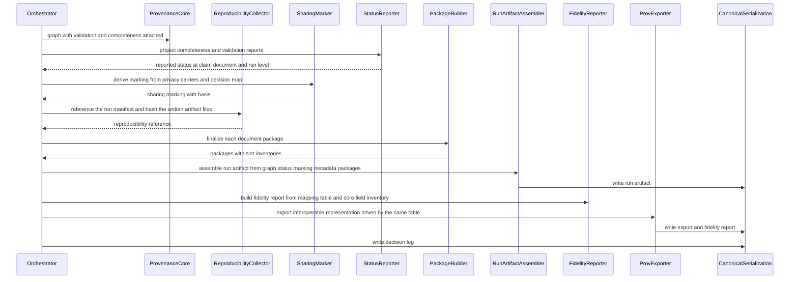
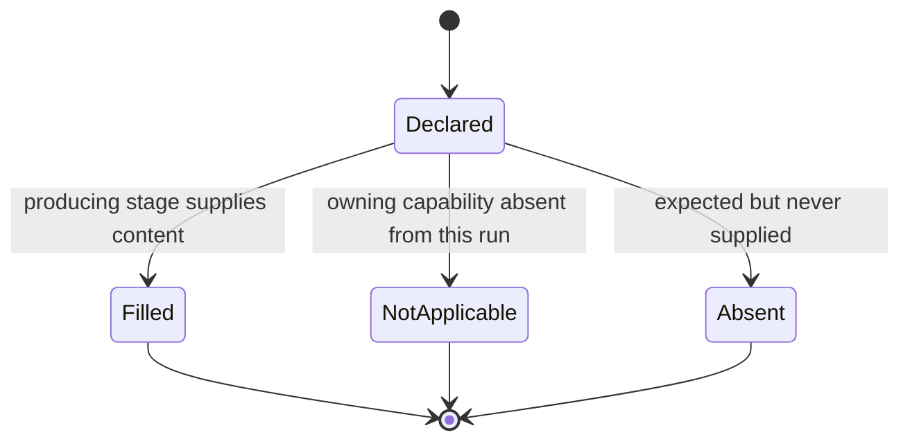
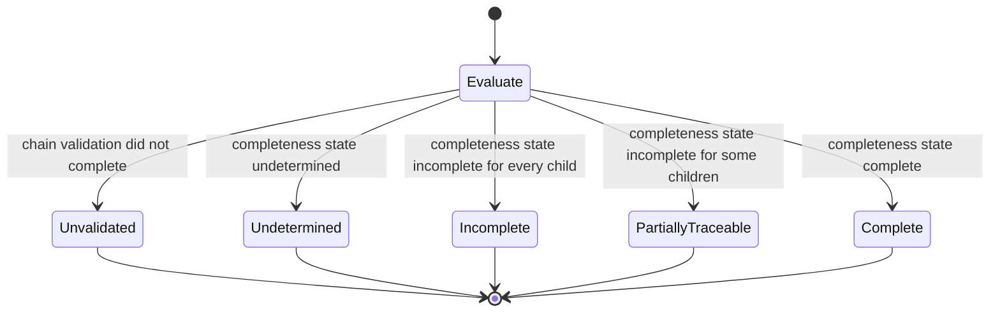
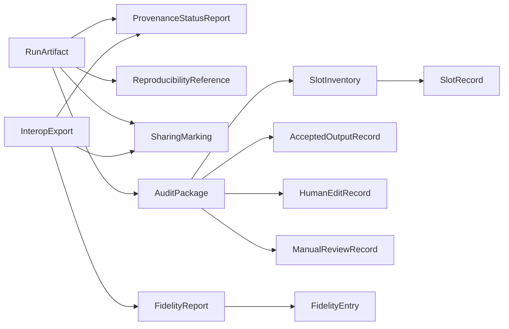

# Design Document — provenance-audit-export

## Overview

**Purpose**: This feature turns the provenance graph that `provenance-core` produces into artifacts a human outside the runtime can read, compare, and cite. It introduces `src/provenance/export/`, a subpackage of the package core already owns, containing: a run-level provenance artifact assembler and its canonical serializer, a reproducibility-reference collector (which points at `cost-and-run-reporting`'s `run_manifest.json` and adds only the per-artifact-file hashes), a cross-run comparator, a W3C PROV-O JSON-LD interoperable exporter driven by a declarative mapping table, a fidelity reporter computed by diffing that table against core's runtime field inventory, a status reporter that projects core's completeness and validation reports into a reported vocabulary, an append-only decision-log exporter over core's event-log projection, and a per-document audit package with a declared slot registry.

**Users**: Academic evaluators, manuscript reviewers, and institutional reviewers consume the artifacts directly, outside the runtime. The direct software consumers are `public-private-provenance` (redacts these artifacts into public views), `reviewer-ui` (renders status and packages), `evaluation-harness` (compares run artifacts across ablations), and `cost-and-run-reporting` (fills one declared slot).

**Impact**: A completed run currently leaves a repo-root cache manifest, an extracted-fields JSON per paper, and a flagged-fields CSV — none versioned as provenance, none able to declare a gap. After this feature a run additionally leaves one run-scoped, schema-versioned provenance artifact, its interoperable export plus fidelity report, an ordered decision log, and one audit package per document whose unfilled slots are named rather than silently absent. No existing output changes shape and no second provenance store is created.

### Goals

- Exactly one run-level provenance artifact per run, derived wholly from core's graph, that still exists when the run failed.
- One interoperable, runtime-independent export that preserves claim→evidence→source relationships and always ships a machine-readable fidelity report.
- `provenance-incomplete`, `partially-traceable`, `undetermined`, and `unvalidated` as reported states visible at claim, document, and run level — the single place core's computed state becomes readable.
- A per-document audit package whose declared slot inventory makes an unfilled slot a reported fact.
- xtrace `R-GOV-1` (append-only ledger) delivered as an export of core's projection — shipped once, as a projection rather than a parallel store.
- xtrace `R-X-2` (reproducibility manifest) **consumed by reference, not re-implemented**: `cost-and-run-reporting` owns `run_manifest.json` and is the single implementation of R-X-2. The run artifact references that manifest and contributes only what this spec uniquely produces — the per-artifact-file content hashes of the files the run wrote.

### Non-Goals

- The provenance graph, node/edge types, evidence identity, derivation records, chain validation, and the *computation* of completeness — `provenance-core`.
- Public/private views, redaction of artifact contents, commitments, tamper-evidence, integrity markers — `public-private-provenance`.
- Sensitivity classification and any disclosure decision — `privacy-core`.
- Token and cost accounting content — `cost-and-run-reporting` fills the declared slot.
- Parser QC metric definitions and parser agreement statistics — `quality_control` today, `agreement-statistics` next.
- Any stage output's content, any user interface, any graph query language or visualization.

## Boundary Commitments

### This Spec Owns

- The run-level provenance artifact: its content model, its schema identity and version, its canonical serialization, and its run-scoped location.
- The reproducibility-**reference** section of the run artifact: a resolvable reference to `cost-and-run-reporting`'s `run_manifest.json` (its relative path, its `manifest_version`, and a content hash of the manifest file), plus the per-artifact-file content hashes (`ArtifactFileHash`) of the files the run wrote — the one reproducibility fact this spec uniquely adds, because only this spec knows the full set of artifact files it emitted.
- Cross-run comparison of two run artifacts, including reporting elements that are not comparable across schema versions.
- The sharing-suitability marking placed on every artifact, package, and export, and its fail-closed default.
- The reported provenance-status vocabulary and the projection from core's `CompletenessReport` and `ChainValidationReport` onto it, at claim, document, and run level.
- The interoperable PROV-O JSON-LD export, its declarative mapping table, and the fidelity report computed from that table.
- The append-only decision-log export over core's `project_event_log`.
- The per-document audit package: the declared slot registry, slot admission, the slot inventory with `filled` / `absent` / `not_applicable` classification, and the self-contained package bundle.
- The `provenance.export`, `provenance.audit_package`, and `provenance.sharing` configuration sub-blocks.

### Out of Boundary

- Recomputing, overriding, or re-deriving anything core computed: completeness state, validation findings, severities, evidence identity, fingerprints, event ordering. All are consumed as-is.
- **The per-run reproducibility manifest itself — `cost-and-run-reporting` owns `xtrace-toolkit` R-X-2 and `run_manifest.json`.** That spec ships in wave 1 and already owns the price, stage, and telemetry facts the manifest carries, so it is the single implementation. This spec therefore produces **no** source-revision resolution, **no** environment or dependency-version capture, **no** resolved-configuration capture or secret omission, **no** determinism-settings capture, and **no** model-identifier list of its own; it references `run_manifest.json` instead. The disagreement in method is resolved with ownership: `cost-and-run-reporting` may shell out to `git rev-parse`, and this spec's prohibition on subprocess remains true because this spec no longer resolves a revision at all.
- Generating the content of any audit-package slot. The package is a container; producers fill it.
- Computing or reinterpreting parser QC metrics, parser agreement metrics, or cleaning/removal decisions.
- Deciding whether anything may be shared, classifying sensitivity, or altering artifact contents on the basis of a marking.
- Becoming a second producer of W3C Web Annotation JSON-LD; `src/artifact_generation/w3c_annotation.py` remains sole producer of that format.
- Any change to `src/quality_control/`, `src/agents/`, `src/pdf_extractor/`, or `src/text_processing/`.
- Any change to the manifest schema, the manifest's repo-root location, its staleness semantics, or the shape of `outputs/<paper>.extracted.json` and `flagged_fields.csv`.
- Cost content, route content, verification content, repair content, and agreement content — declared as slots, produced elsewhere.

### Allowed Dependencies

- `src/provenance/export/` may import `src/provenance/` (core), `src/utils/`, and the Python standard library — nothing else.
- `src/pipeline/` is the sole integration point and the only caller; it may import `provenance.export`.
- `quality_control`, `agents`, `pdf_extractor`, and `text_processing` must **not** import `provenance` or any subpackage of it. This is already enforced by the eight forbidden-import pairs `provenance-core` adds; this spec adds no new package and therefore no new pair, but adds a scoped test asserting the subpackage obeys them.
- No new third-party dependency. JSON-LD is emitted by hand, as `w3c_annotation.py` already does. `json`, `hashlib`, `zipfile`, `platform`, `importlib.metadata`, and `dataclasses` from the standard library only. No subprocess, no network, no crypto library.

### Revalidation Triggers

- Any change to `ProvenanceGraph`, `CompletenessReport`, `ChainValidationReport`, `RunIdentity`, or `ProvenanceEvent` shape — this spec projects all five.
- Any change to core's `PrivacyCarrier` field names or its "opaque, never interpreted" rule — breaks the sharing marking.
- Adding, removing, or renaming a field on any core record dataclass — the fidelity mapping table's coverage test will fail by design, and the table must be updated.
- A major bump of `AUDIT_ARTIFACT_SCHEMA_VERSION`, `INTEROP_EXPORT_SCHEMA_VERSION`, or `AUDIT_PACKAGE_SCHEMA_VERSION` — breaks every artifact reader, including `public-private-provenance` and `reviewer-ui`.
- Any change to the audit-package slot registry: a new slot, a renamed slot, or a slot moving from `not_applicable` to expected — breaks `evidence-routing`, `multiagent-extraction`, `agreement-statistics`, `cost-and-run-reporting`, and `corpus-and-schema-builder`, all of which fill slots.
- Any change to the reported status vocabulary — breaks `reviewer-ui` and `evaluation-harness`.
- **Any change to `cost-and-run-reporting`'s `run_manifest.json` — its filename, its run-scoped location, its `manifest_version`, or the removal of a field this artifact's readers reach through the reference.** This spec consumes that manifest by reference and holds no copy of its contents, so a rename or relocation silently breaks the reference and a major `manifest_version` bump changes what a reader finds behind it. The reference resolution test must be re-run against that spec's artifact whenever either side moves.

## Architecture

### Existing Architecture Analysis

Five existing surfaces are relevant, and each is adopted or referenced rather than replaced:

| Existing surface | Location | Relationship to this spec | Constraint it imposes |
|---|---|---|---|
| Provenance graph plus its two reports | `src/provenance/` (from `provenance-core`) | Sole input; consumed whole | Never recomputed; report shapes are a revalidation trigger |
| Web Annotation JSON-LD producer | `src/artifact_generation/w3c_annotation.py` | Untouched; a *different* vocabulary is used here | Single-producer rule must survive |
| Run-scoped output paths | `src/utils/path_utils.py` (`resolve_run_output_path`, `RUN_FOLDER_NAME`) | Reused for artifact and package locations | Run folder name is computed once at import; it must never enter artifact content |
| Atomic write pattern | `src/pipeline/manifest.py` (`save_manifest`) | Reused verbatim for every file written | Temp file then replace, tmp cleaned on `BaseException` |
| Raw parser payloads and parser QC metrics | `QCBundle.branches[*].payload`; `quality_control/local_metrics.py` | Retained and packaged, never interpreted | `quality_control` is not modified; payloads reach the package through pipeline wiring |

The repo-root, non-run-scoped `manifest.json` is read for the input-manifest slot and for per-document status; it is neither rewritten nor extended.

### Architecture Pattern & Boundary Map

Selected pattern: **linear projection pipeline over an immutable upstream graph, plus a container with a declared slot registry**. Every analytical module is a pure function of the graph and core's reports; every module that touches disk does so through one canonical writer. The pipeline performs all wiring, so no module here imports `pipeline`.

```mermaid
graph TB
    subgraph ProvenanceCore
        Graph
        CompletenessReportIn
        ChainValidationReportIn
        EventLogProjection
    end
    subgraph ExportSubpackage
        ExportModels
        CanonicalSerialization
        SharingMarker
        StatusReporter
        ReproducibilityCollector
        FidelityReporter
        ProvExporter
        DecisionLogExporter
        SlotRegistry
        PackageBuilder
        RunArtifactAssembler
        PackageBundler
        ArtifactComparator
    end
    subgraph PipelinePackage
        Orchestrator
        ExtractionPipeline
        PdfProcessor
    end
    subgraph UtilsPackage
        ConfigUtils
        PathUtils
        LoggingUtils
    end
    Graph --> StatusReporter
    CompletenessReportIn --> StatusReporter
    ChainValidationReportIn --> StatusReporter
    Graph --> SharingMarker
    Graph --> ProvExporter
    EventLogProjection --> DecisionLogExporter
    ExportModels --> CanonicalSerialization
    ExportModels --> SharingMarker
    ExportModels --> StatusReporter
    ExportModels --> ReproducibilityCollector
    ExportModels --> FidelityReporter
    FidelityReporter --> ProvExporter
    SlotRegistry --> PackageBuilder
    StatusReporter --> PackageBuilder
    SharingMarker --> PackageBuilder
    StatusReporter --> RunArtifactAssembler
    SharingMarker --> RunArtifactAssembler
    ReproducibilityCollector --> RunArtifactAssembler
    PackageBuilder --> RunArtifactAssembler
    CanonicalSerialization --> RunArtifactAssembler
    CanonicalSerialization --> PackageBundler
    ProvExporter --> PackageBundler
    RunArtifactAssembler --> ArtifactComparator
    Orchestrator --> RunArtifactAssembler
    Orchestrator --> ProvExporter
    Orchestrator --> DecisionLogExporter
    Orchestrator --> PackageBundler
    ExtractionPipeline --> PackageBuilder
    PdfProcessor --> PackageBuilder
    CanonicalSerialization --> PathUtils
    ReproducibilityCollector --> ConfigUtils
    PackageBuilder --> LoggingUtils
```



**Architecture Integration**

- **Dependency direction** (exhaustive and strictly linear; every module appears exactly once): `utils + provenance core → export.models → export.serialization → export.sharing → export.status → export.reproducibility → export.fidelity → export.prov_jsonld → export.event_log → export.package.slots → export.package.builder → export.run_artifact → export.package.bundle → export.compare`. Each module imports only from modules to its left, plus core and `utils`. `serialization` precedes everything that writes so a single canonical writer exists; `fidelity` precedes `prov_jsonld` because the exporter is driven by the mapping table the fidelity reporter also reads; `package.builder` precedes `run_artifact` because the run artifact references the packages it covers.
- **Domain boundaries**: *content assembly* (run_artifact, package.builder, reproducibility) is separate from *representation* (prov_jsonld, event_log, fidelity) which is separate from *status and marking* (status, sharing) which is separate from *persistence* (serialization, package.bundle) and from *comparison* (compare). These are the four boundary candidates named in the brief and are the parallel-safe task seams.
- **Existing patterns preserved**: run-scoped output via `resolve_run_output_path`; atomic temp-then-replace writes; closed `Literal` vocabularies; frozen dataclasses in one owning module per package; explicit config passing with no global mutation; AST-enforced dependency direction; `get_logger(__name__)` and never `print`.
- **New components rationale**: each module maps to exactly one requirement group. Nothing exists speculatively — the mapping table exists because requirement 6 demands computed omission reporting, and the slot registry exists because requirement 8 demands declared absence.

### Technology Stack

| Layer | Choice / Version | Role in Feature | Notes |
|-------|------------------|-----------------|-------|
| Runtime | Python 3.12.x | Subpackage language | Matches repo pin |
| Domain model | `dataclasses` (frozen) + `typing.Literal` | Artifact, package, report, and fidelity records | Mirrors `provenance/models.py`; `from __future__ import annotations` throughout |
| Interoperable vocabulary | W3C PROV-O expressed as JSON-LD | Runtime-independent shareable representation | Emitted by hand; no RDF library, no new dependency |
| Persistence | `json` + `zipfile` (stdlib) → `outputs/run_<ts>/provenance/` and `outputs/run_<ts>/audit/` | Artifact, exports, packages, bundles | Canonical JSON; pinned zip entry timestamps |
| Hashing | `hashlib.sha256` (stdlib) | Per-artifact-file content hashes only | Document/config/schema fingerprints are consumed from core, never recomputed |
| Reproducibility | Reference to `cost-and-run-reporting`'s `run_manifest.json` | R-X-2 content | Owned there, not here: no revision resolution, no environment capture, no config capture, no subprocess, no `git` binary dependency, no network |
| Config | `configs/config.yaml`, nested under the existing `provenance:` block | Enable flags, output subdirs, retention, decision→level map | No new top-level key, so no new registration |
| Tests | pytest + Hypothesis | Unit, property, boundary, and inventory-coverage tests | Hypothesis for serialization determinism and comparison symmetry |

## File Structure Plan

### Directory Structure

```
src/provenance/export/
├── __init__.py               # Public surface; re-exports artifact, package, export, and status entry points
├── models.py                 # Every export-side frozen record and closed vocabulary:
│                             # ReportedStatus, StatusEntry, ProvenanceStatusReport, SharingMarking,
│                             # ReproducibilityReference, ArtifactFileHash, RunArtifact, FieldDisposition,
│                             # FieldMapping, FidelityEntry, FidelityReport, InteropExport, DecisionLogEntry,
│                             # SlotSpec, SlotState, SlotRecord, SlotInventory, AuditPackage,
│                             # AcceptedOutputRecord, HumanEditRecord, ManualReviewRecord,
│                             # RunArtifactDiff, and the three schema id/version constants
├── serialization.py          # Canonical JSON dump/load, atomic write, schema-version guard,
│                             # UnsupportedArtifactVersionError. Single writer for the subpackage.
├── sharing.py                # derive_sharing_marking(): fail-closed marking from privacy carriers
├── status.py                 # build_status_report(): pure projection of core's two reports
├── reproducibility.py        # collect_reproducibility(): reference to run_manifest.json + artifact-file hashes
├── fidelity.py               # PROV_MAPPING table, mapping-vs-inventory diff, build_fidelity_report()
├── prov_jsonld.py            # export_prov_jsonld(): table-driven PROV-O JSON-LD emission
├── event_log.py              # export_decision_log(): serialization of core's event-log projection
├── run_artifact.py           # build_run_artifact(), write_run_artifact(), read_run_artifact()
├── compare.py                # compare_run_artifacts(): cross-run and cross-version diff
└── package/
    ├── __init__.py           # Package-side re-exports
    ├── slots.py              # SLOT_REGISTRY: the declared slot inventory and each slot's owning spec
    ├── builder.py            # AuditPackageBuilder: admission, verbatim retention, inventory finalization
    └── bundle.py             # export_audit_bundle(): deterministic self-contained bundle
```

```
tests/src/provenance/export/
├── test_export_models.py               # vocabulary closure, frozen records, schema constants
├── test_export_serialization.py        # canonical form, byte-identical rewrite, version guard
├── test_export_sharing.py              # fail-closed default, verbatim decision, no label interpretation
├── test_export_status.py               # five reported states, three levels, no recomputation
├── test_export_reproducibility.py      # manifest-reference resolution, unavailable path, artifact hashes
├── test_export_fidelity.py             # computed inventory coverage, omitted vs transformed, empty-loss report
├── test_export_prov_jsonld.py          # claim to evidence to source preservation, schema info, anno-context absence
├── test_export_event_log.py            # projection reuse, determinism, no parallel store
├── test_export_run_artifact.py         # required sections, failed-run artifact, no-records artifact
├── test_export_compare.py              # element diffs, cross-version incomparability
├── test_export_package_slots.py        # registry completeness against the sixteen declared slots
├── test_export_package_builder.py      # filled vs absent vs not-applicable, verbatim retention, supplier recorded
├── test_export_package_records.py      # accepted-output, human-edit, manual-review records
├── test_export_package_bundle.py       # self-containment, deterministic repeat export, incomplete export
└── test_export_import_isolation.py     # imports cleanly with pipeline/QC absent; no forbidden imports
```

One test module per source module, so no two tasks share a test file. The only shared files are the two `__init__.py` surfaces, to which each task appends its own re-export line.

### Modified Files

- `src/utils/config_utils.py` — extend the `provenance` defaults mapping with `export`, `audit_package`, and `sharing` sub-blocks. No new top-level key, so `_ALL_KNOWN_TOP_LEVEL_KEYS` is unchanged.
- `src/utils/path_utils.py` — add a run-scoped audit-package directory constant beside the provenance directory constant.
- `configs/config.yaml` — extend the existing `provenance:` block with the three sub-blocks.
- `src/pipeline/orchestrator.py` — after core builds, validates, and attaches reports to the graph: collect reproducibility metadata, derive the sharing marking, build the status report, assemble and write the run artifact, write the interoperable export plus its fidelity report, write the decision log, and finalize and write each document's audit package.
- `src/pipeline/extraction_pipeline.py` — hand the parser QC report, each backend's raw payload, the canonical and cleaned documents, and the recorded removed blocks to the document's package builder.
- `src/pipeline/pdf_processor.py` — hand extraction outputs, the final extraction, and accepted-output justification records to the document's package builder.
- `tests/test_dependency_directions.py` — add one scoped test asserting no module under `src/provenance/export/` imports `pipeline`, `agents`, `quality_control`, or `pdf_extractor`. No new `FORBIDDEN_PAIRS` entry is needed because the subpackage sits under `provenance`.
- `src/provenance/README.md` — document the export subpackage's boundary and slot registry.

## System Flows

### Run completion: artifact, exports, and packages



Key decisions not visible in the diagram: every step is skippable independently via configuration and a skipped step is recorded as an absent artifact rather than omitted silently; a failed run reaches this flow with a partial graph and still produces every artifact (1.4); and no step reads a clock — all timestamps come from `RunIdentity.created_at`.

### Slot lifecycle



`Absent` carries a reason and forces the package's own completeness to be reported as incomplete (8.4). `NotApplicable` names the owning spec and does not (8.6). A slot can never leave `Filled`, because admission retains content verbatim and the builder exposes no replace operation.

### Reported status derivation



`Unvalidated` dominates every other outcome, so a run whose validation could not finish is never reported as complete (7.4). At claim level there are no children, so `PartiallyTraceable` cannot occur; the missing-anchor versus unsupported distinction is carried through from core's reason string rather than re-derived (7.3, 7.6).

## Requirements Traceability

| Requirement | Summary | Components | Interfaces | Flows |
|-------------|---------|------------|------------|-------|
| 1.1, 1.2, 1.3, 1.4, 1.5, 1.6, 1.7 | One run artifact per run; required contents; projection not store; artifact on failure; artifact when nothing recorded; references packages; no network | RunArtifactAssembler, CanonicalSerialization, ExportModels | `build_run_artifact`, `write_run_artifact`, `RunArtifact` | Run completion |
| 2.1, 2.2, 2.3, 2.4, 2.5, 2.6 | Reference the run manifest that carries revision, environment, config, determinism, and models; per-artifact-file hashes; unresolvable reference reported; reuse core fingerprints; hold no secrets; R-X-2 owned by `cost-and-run-reporting` and consumed by reference | ReproducibilityCollector, ExportModels | `collect_reproducibility`, `ReproducibilityReference`, `ArtifactFileHash` | Run completion |
| 3.1, 3.2, 3.3, 3.4, 3.5, 3.6 | Schema identity and version; cross-run diff; cross-version incomparability; older artifacts readable; unrecognized version reported; identical re-serialization | ArtifactComparator, CanonicalSerialization, ExportModels | `compare_run_artifacts`, `read_run_artifact`, `UnsupportedArtifactVersionError`, `RunArtifactDiff` | Run completion |
| 4.1, 4.2, 4.3, 4.4, 4.5, 4.6 | Marking on every artifact; internal or restricted; fail-closed default; no policy; supplier and time recorded; contents unaltered | SharingMarker, ExportModels | `derive_sharing_marking`, `SharingMarking` | Run completion |
| 5.1, 5.2, 5.3, 5.4, 5.5, 5.6, 5.7 | Native structured format; runtime-independent export; relationships preserved; schema info; marking carried; no second annotation producer; export despite incompleteness | ProvExporter, CanonicalSerialization, SharingMarker, StatusReporter | `export_prov_jsonld`, `InteropExport` | Run completion |
| 6.1, 6.2, 6.3, 6.4, 6.5, 6.6 | Omitted and transformed named; machine-readable; per-element reason; unmapped kinds reported; approximate is transformed; lossless still reports | FidelityReporter, ExportModels | `PROV_MAPPING`, `build_fidelity_report`, `FidelityReport`, `FieldDisposition` | Run completion |
| 7.1, 7.2, 7.3, 7.4, 7.5, 7.6, 7.7, 7.8 | Stage-level failure; partially traceable; missing anchor distinct; unvalidated with reason; three levels; no recomputation; states distinguishable; status propagated everywhere | StatusReporter, RunArtifactAssembler, ProvExporter, PackageBuilder | `build_status_report`, `ProvenanceStatusReport`, `ReportedStatus` | Reported status derivation, Run completion |
| 8.1, 8.2, 8.3, 8.4, 8.5, 8.6, 8.7 | Package per document; sixteen declared slots; inventory recorded; absent with reason; supplier recorded and content verbatim; not applicable distinct; container never generates content | SlotRegistry, PackageBuilder, ExportModels | `SLOT_REGISTRY`, `AuditPackageBuilder`, `SlotInventory`, `SlotState` | Slot lifecycle |
| 9.1, 9.2, 9.3, 9.4, 9.5, 9.6, 9.7 | Parser QC report saved; raw parser output retained; per-backend distinguishable; removed blocks and reasons; evidence-bearing flag; absent with reason; no reinterpretation | SlotRegistry, PackageBuilder, PipelineIntegration | `AuditPackageBuilder.put`, `SLOT_REGISTRY` | Slot lifecycle |
| 10.1, 10.2, 10.3, 10.4, 10.5, 10.6 | Route and evidence backing accepted output; original and edited preserved; human origin; manual-review reason; unsupported reported; never decides or edits | PackageBuilder, ExportModels | `AcceptedOutputRecord`, `HumanEditRecord`, `ManualReviewRecord` | Slot lifecycle |
| 11.1, 11.2, 11.3, 11.4, 11.5, 11.6 | Self-contained bundle; runtime-independent with schema info; inventory and status included; marking carried; incomplete still exported; identical repeat export | PackageBundler, CanonicalSerialization | `export_audit_bundle` | Run completion |
| 12.1, 12.2, 12.3, 12.4, 12.5 | Ordered append-only log; derived from records; deterministic; stage, record, position; unifies xtrace R-GOV-1 | DecisionLogExporter, ExportModels | `export_decision_log`, `DecisionLogEntry` | Run completion |

## Components and Interfaces

| Component | Domain/Layer | Intent | Req Coverage | Key Dependencies (P0/P1) | Contracts |
|-----------|--------------|--------|--------------|--------------------------|-----------|
| ExportModels | Definition | All export-side records, vocabularies, and schema constants | 1–12 | provenance core models (P0) | State |
| CanonicalSerialization | Persistence | Single canonical, atomic, version-guarded reader/writer | 1, 3, 5, 11 | ExportModels (P0), PathUtils (P1) | Service, State |
| SharingMarker | Marking | Fail-closed sharing-suitability marking from privacy carriers | 4 | ExportModels (P0), core `PrivacyCarrier` (P0) | Service |
| StatusReporter | Analysis | Project core's two reports onto the reported status vocabulary | 7 | ExportModels (P0), core reports (P0) | Service |
| ReproducibilityCollector | Assembly | Revision, environment, config, seeds, per-artifact hashes | 2 | ExportModels (P0), ConfigUtils (P1) | Service |
| FidelityReporter | Representation | Mapping table plus computed omission and transformation report | 6 | ExportModels (P0), core record types (P0) | Service, State |
| ProvExporter | Representation | Table-driven PROV-O JSON-LD interoperable export | 5 | FidelityReporter (P0), StatusReporter (P1), SharingMarker (P1) | Service |
| DecisionLogExporter | Representation | Serialize core's event-log projection as an append-only log | 12 | core `project_event_log` (P0), ExportModels (P0) | Service |
| SlotRegistry | Container | Declare every audit-package slot and its owning spec | 8, 9, 10 | ExportModels (P0) | State |
| PackageBuilder | Container | Admit slot content verbatim; finalize the slot inventory | 8, 9, 10 | SlotRegistry (P0), StatusReporter (P1), SharingMarker (P1) | Service, State |
| RunArtifactAssembler | Assembly | Assemble the run-level artifact from all projections | 1, 2, 3, 7 | all of the above (P0) | Service |
| PackageBundler | Persistence | Deterministic self-contained package bundle | 11 | CanonicalSerialization (P0), PackageBuilder (P0) | Batch |
| ArtifactComparator | Analysis | Diff two run artifacts, including across schema versions | 3 | RunArtifactAssembler (P0) | Service |
| PipelineIntegration | Integration | Wire lifecycle and slot feeding into the existing pipeline | 1, 7, 8, 9, 10, 11, 12 | all components (P0), ConfigUtils, PathUtils (P1) | Service |

### Definition Layer

#### ExportModels

| Field | Detail |
|-------|--------|
| Intent | Single owner of every export-side record type, every closed vocabulary, and the three schema constants |
| Requirements | 1.2, 2.1, 3.1, 4.1, 6.2, 7.5, 8.2, 10.1, 11.3, 12.4 |

**Responsibilities & Constraints**
- **Ownership rule**: `models.py` owns every dataclass declared by this subpackage. Exactly two modules outside it declare module-level data: `fidelity.py` declares the `PROV_MAPPING` table (a mapping literal, not a dataclass) and `package/slots.py` declares `SLOT_REGISTRY` (likewise). Nothing else declares export-side state.
- All records are `@dataclass(frozen=True)`; vocabularies are `Literal` unions, closed by design. Adding a member is a revalidation trigger.
- Three independent schema constants, each with its own SemVer version, so an export format can evolve without bumping the artifact: `AUDIT_ARTIFACT_SCHEMA_ID/VERSION`, `INTEROP_EXPORT_SCHEMA_ID/VERSION`, `AUDIT_PACKAGE_SCHEMA_ID/VERSION`.
- This module re-declares nothing owned by core. Core records are referenced by identifier, never copied — the artifact stores node ids, never evidence text.

**Dependencies**
- Outbound: `provenance.models` for core record types and vocabularies (P0)
- External: none

**Contracts**: State [x]

##### State Management

```python
ReportedStatus = Literal["complete", "partially_traceable", "incomplete",
                         "undetermined", "unvalidated"]
StatusLevel = Literal["run", "document", "claim"]
SharingLevel = Literal["restricted", "internal", "shareable"]
MarkingBasis = Literal["privacy_decision", "default_no_decision", "unmapped_decision"]
FieldDisposition = Literal["preserved", "transformed", "omitted"]
SlotState = Literal["filled", "absent", "not_applicable"]

@dataclass(frozen=True)
class StatusEntry:
    level: StatusLevel
    subject_id: str
    status: ReportedStatus
    reason: str | None                       # carried verbatim from core (7.6)
    missing_record_kinds: tuple[str, ...]
    responsible_stages: tuple[str, ...]

@dataclass(frozen=True)
class ProvenanceStatusReport:
    run: StatusEntry
    documents: Mapping[str, StatusEntry]
    claims: Mapping[str, StatusEntry]
    stage_failures: Mapping[str, str]        # stage -> reason (7.1)
    validation_completed: bool
    validation_incompletion_reason: str | None

@dataclass(frozen=True)
class SharingMarking:
    level: SharingLevel
    basis: MarkingBasis
    decision: str | None                     # opaque, verbatim (4.5)
    supplied_by: str | None
    supplied_at: str | None

@dataclass(frozen=True)
class ArtifactFileHash:
    relative_path: str
    sha256: str
    byte_size: int

@dataclass(frozen=True)
class ReproducibilityReference:
    """Pointer to `cost-and-run-reporting`'s run_manifest.json — the project's single
    implementation of xtrace R-X-2 — plus the one reproducibility fact this spec adds.
    No revision, environment, dependency-version, resolved-config, determinism, or
    model-id content is duplicated here (2.6)."""
    run_manifest_relative_path: str | None              # relative to the run output dir
    run_manifest_version: str | None                    # manifest_version read from the file
    run_manifest_sha256: str | None                     # content hash of the referenced file
    run_manifest_unavailable_reason: str | None         # (2.3): absent manifest is reported, never faked
    config_fingerprint: str                             # consumed from core's RunIdentity (2.4)
    schema_fingerprint: str
    document_fingerprints: Mapping[str, str]
    artifact_hashes: tuple[ArtifactFileHash, ...]       # (2.2) — uniquely produced here

@dataclass(frozen=True)
class RunArtifact:
    schema_id: str
    schema_version: str
    run_id: str
    created_at: str
    sharing: SharingMarking
    status: ProvenanceStatusReport
    reproducibility: ReproducibilityReference
    source_identities: tuple[Mapping[str, Any], ...]
    evidence_references: tuple[str, ...]
    claim_references: tuple[Mapping[str, Any], ...]
    transformation_summaries: tuple[Mapping[str, Any], ...]
    validation_summary: Mapping[str, Any]
    audit_package_references: tuple[str, ...]           # (1.6)
    missing_segments: tuple[Mapping[str, Any], ...]
    records_present: bool                               # False for the empty-run artifact (1.5)

@dataclass(frozen=True)
class FieldMapping:
    node_kind: str
    field_name: str
    disposition: FieldDisposition
    target_term: str | None                  # PROV-O term when preserved or transformed
    reason: str | None                       # required when transformed or omitted

@dataclass(frozen=True)
class FidelityEntry:
    node_kind: str
    field_name: str
    disposition: FieldDisposition
    reason: str
    affected_count: int

@dataclass(frozen=True)
class FidelityReport:
    export_schema_id: str
    export_schema_version: str
    entries: tuple[FidelityEntry, ...]       # empty tuple is a valid, reported result (6.6)
    lossless: bool

@dataclass(frozen=True)
class InteropExport:
    schema_id: str
    schema_version: str
    sharing: SharingMarking
    status: ProvenanceStatusReport
    document: Mapping[str, Any]              # the JSON-LD payload
    fidelity: FidelityReport

@dataclass(frozen=True)
class DecisionLogEntry:
    sequence: int
    stage: str
    event_kind: str
    node_id: str
    node_kind: str
    summary: Mapping[str, Any]

@dataclass(frozen=True)
class SlotSpec:
    name: str
    description: str
    owning_spec: str                         # which spec fills it; "this" for none
    available: bool                          # False -> not_applicable until that spec ships

@dataclass(frozen=True)
class SlotRecord:
    name: str
    state: SlotState
    supplied_by: str | None                  # (8.5)
    reason: str | None                       # required for absent and not_applicable
    relative_path: str | None
    sha256: str | None

@dataclass(frozen=True)
class SlotInventory:
    records: Mapping[str, SlotRecord]
    filled: tuple[str, ...]
    absent: tuple[str, ...]
    not_applicable: tuple[str, ...]
    complete: bool                           # False whenever absent is non-empty (8.4)

@dataclass(frozen=True)
class AcceptedOutputRecord:
    field_index: int
    field_name: str
    route_id: str | None
    supporting_evidence_ids: tuple[str, ...]
    supported: bool                          # False -> reported unsupported, entry retained (10.5)

@dataclass(frozen=True)
class HumanEditRecord:
    field_index: int
    original_value_digest: str
    edited_value_digest: str
    origin: Literal["human"]
    edited_at: str | None

@dataclass(frozen=True)
class ManualReviewRecord:
    field_index: int
    reason: str
    requested_by_stage: str

@dataclass(frozen=True)
class AuditPackage:
    schema_id: str
    schema_version: str
    run_id: str
    document_id: str
    sharing: SharingMarking
    status: StatusEntry
    inventory: SlotInventory
    accepted_outputs: tuple[AcceptedOutputRecord, ...]
    human_edits: tuple[HumanEditRecord, ...]
    manual_reviews: tuple[ManualReviewRecord, ...]

@dataclass(frozen=True)
class RunArtifactDiff:
    left_run_id: str
    right_run_id: str
    schema_versions_differ: bool
    incomparable_sections: tuple[str, ...]   # (3.3)
    source_identity_changes: tuple[Mapping[str, Any], ...]
    claim_changes: tuple[Mapping[str, Any], ...]
    transformation_changes: tuple[Mapping[str, Any], ...]
    validation_changes: Mapping[str, Any]
    status_changes: tuple[Mapping[str, Any], ...]
```

- Preconditions: every `reason` field is non-empty whenever its record's state is not the nominal one.
- Postconditions: records are hashable and comparable by value.
- Invariants: no record exposes a mutation method; no record holds evidence text, only identifiers and digests.

**Implementation Notes**
- Integration: `src/provenance/export/__init__.py` re-exports these; `src/provenance/__init__.py` is not modified, so core's surface is unchanged.
- Validation: a test constructs one instance of each record and enumerates every `Literal` member, asserting the canonical serializer round-trips each.
- Risks: vocabulary growth pressure from `reviewer-ui` — mitigated by listing vocabulary additions as a revalidation trigger.

#### SlotRegistry

| Field | Detail |
|-------|--------|
| Intent | Declare, as data, every audit-package slot, what it holds, and which spec fills it |
| Requirements | 8.2, 8.6, 9.1, 9.2, 9.4, 10.1, 10.2, 10.4 |

**Responsibilities & Constraints**
- `SLOT_REGISTRY: Mapping[str, SlotSpec]` declares the sixteen slots named by multiagent R22.2 — input manifest, parser outputs, canonical document, cleaned document, parser QC, route map, route QC, counterfactual route output, final route map, extraction outputs, agreement report, verification output, repair output, final extraction, cost report, logs — plus three slots this spec requires directly: raw parser output (9.2, 9.3), removed blocks with reasons and evidence-bearing flags (9.4, 9.5), and review records covering accepted outputs, human edits, and manual-review reasons (10.1–10.4).
- Each spec declares `owning_spec` and `available`. Slots owned by specs that have not shipped are declared `available=False` and finalize as `not_applicable` naming that spec, never as `absent` (8.6).
- Absence is only detectable against a declaration; the registry, not the producing stage, is authoritative.

**Contracts**: State [x]

**Implementation Notes**
- Validation: a test asserts the registry contains a slot for each of the sixteen R22.2 names plus the three added here, that every slot names an owning spec, and that no two slots share a name or a storage path.
- Risks: registry drift as downstream specs ship — mitigated by making a slot's `available` flip a named revalidation trigger.

### Persistence Layer

#### CanonicalSerialization

| Field | Detail |
|-------|--------|
| Intent | The subpackage's only reader and writer: canonical JSON, atomic write, schema-version guard |
| Requirements | 1.3, 3.1, 3.4, 3.5, 3.6, 5.4, 11.2, 11.6 |

**Responsibilities & Constraints**
- Canonical form: `sort_keys=True`, `ensure_ascii=True`, fixed indent, trailing newline. No clock is read; every timestamp in content originates from `RunIdentity.created_at` or from a caller-supplied value.
- Atomic write: temp file then replace, temp removed on `BaseException` — the pattern `save_manifest` already establishes.
- Version guard: an artifact whose major version matches the reader's is interpreted, preserving unknown keys under a namespaced extension key rather than dropping them (3.4). A differing major raises `UnsupportedArtifactVersionError` naming the version found and the versions supported, and materializes nothing partial (3.5).
- Every written payload carries its schema identity and version as its first two keys, so a file is self-describing (3.1, 5.4, 11.2).

**Dependencies**
- Outbound: ExportModels (P0), `utils.path_utils` (P1)

**Contracts**: Service [x] / State [x]

##### Service Interface

```python
def canonical_dumps(payload: Mapping[str, Any]) -> str: ...
def atomic_write_json(payload: Mapping[str, Any], path: Path) -> Path: ...
def read_versioned_json(path: Path, *, schema_id: str,
                        supported_major: int) -> dict[str, Any]: ...
class UnsupportedArtifactVersionError(Exception): ...
```

- Preconditions: `payload` is JSON-serializable and contains its schema keys.
- Postconditions: writing the same payload twice produces a byte-identical file (3.6, 11.6); `read_versioned_json` either returns a fully interpreted mapping or raises.
- Invariants: no other module in the subpackage opens a file for writing.

**Implementation Notes**
- Risks: a caller embedding a fresh timestamp and breaking determinism — mitigated by a property test that serializing one artifact twice in one process and across two constructions yields identical bytes.

#### PackageBundler

| Field | Detail |
|-------|--------|
| Intent | Produce a deterministic, self-contained bundle of one document's audit package |
| Requirements | 11.1, 11.2, 11.3, 11.4, 11.5, 11.6 |

**Responsibilities & Constraints**
- The bundle contains a bundle manifest (schema identity and version, slot inventory, provenance status, sharing marking), every filled slot's content, the interoperable export, and its fidelity report. Nothing in it references a path outside itself (11.1, 11.2).
- Determinism: entries are written in sorted order with pinned entry timestamps, so re-bundling an unchanged package yields identical bytes (11.6).
- An incomplete package is bundled with its incompleteness declared in the manifest; the bundler never refuses (11.5).
- The bundle carries the package's marking unchanged and removes nothing on its basis (11.4, and 4.6).

**Contracts**: Batch [x]

##### Batch / Job Contract

- Trigger: end of `run_pipeline()` for each document, or an explicit user-initiated export.
- Input / validation: one finalized `AuditPackage` and the run's interoperable export. A package that is not finalized is rejected before any file is written.
- Output / destination: one bundle per document under the run-scoped audit directory.
- Idempotency & recovery: temp-then-replace; re-bundling an unchanged package is byte-identical and therefore safely repeatable.

**Implementation Notes**
- Risks: bundle size on large corpora when raw parser output is retained — mitigated by the retention configuration flag and by recording a reference plus digest, rather than a copy, when the payload already exists in the content-addressed TEI cache.

### Marking and Analysis Layer

#### SharingMarker

| Field | Detail |
|-------|--------|
| Intent | Derive a fail-closed sharing-suitability marking without interpreting any privacy label |
| Requirements | 4.1, 4.2, 4.3, 4.4, 4.5, 4.6 |

**Responsibilities & Constraints**
- Reads only `PrivacyCarrier.state`, `.decision`, `.supplied_by`, and `.supplied_at` from graph nodes. It never reads or branches on `.label`.
- No decision present on any node ⇒ `SharingMarking(level="restricted", basis="default_no_decision")` (4.3). A decision present but absent from the configured decision→level map ⇒ `level="restricted"`, `basis="unmapped_decision"`, decision recorded verbatim.
- When several nodes carry decisions, the most restrictive resolved level wins.
- The module classifies nothing, evaluates no policy, and alters no content (4.4, 4.6).

**Contracts**: Service [x]

##### Service Interface

```python
def derive_sharing_marking(graph: ProvenanceGraph, *,
                           decision_levels: Mapping[str, SharingLevel]
                           ) -> SharingMarking: ...
```

- Postconditions: the result is `restricted` unless a decision is present *and* mapped; `decision` is byte-identical to the carrier value or `None`.
- Invariants: the module contains no comparison against any privacy label literal.

**Implementation Notes**
- Validation: a source-level test asserts the module never references the carrier's label field, mirroring core's inertness test.

#### StatusReporter

| Field | Detail |
|-------|--------|
| Intent | Project core's completeness and validation reports onto the reported status vocabulary at three levels |
| Requirements | 7.1, 7.2, 7.3, 7.4, 7.5, 7.6, 7.7 |

**Responsibilities & Constraints**
- Pure function of `CompletenessReport`, `ChainValidationReport`, and the recorded per-stage failure reasons. It performs no graph traversal that could constitute recomputation and calls no core computation entry point (7.6).
- Mapping: validation not completed ⇒ `unvalidated` at run level, dominating everything (7.4); core state `undetermined` ⇒ `undetermined`; core state `incomplete` for every child ⇒ `incomplete`; core state `incomplete` for some children ⇒ `partially_traceable` (7.2); otherwise `complete`.
- Claim-level entries carry core's `reason` verbatim, which is what keeps missing-anchor and unsupported distinct without re-deriving either (7.3).
- Stage failures are surfaced as `stage_failures`, naming the stage at which provenance generation failed (7.1).
- The five reported values are distinct members of a closed vocabulary, so no consumer must infer completeness from an absence (7.7).

**Contracts**: Service [x]

##### Service Interface

```python
def build_status_report(completeness: CompletenessReport,
                        validation: ChainValidationReport,
                        *, stage_failures: Mapping[str, str]
                        ) -> ProvenanceStatusReport: ...
```

- Postconditions: exactly one `StatusEntry` per claim id and per document id present in the completeness report, plus one for the run; `claims` contains no entry with status `partially_traceable`.
- Invariants: read-only with respect to both input reports.

**Implementation Notes**
- Validation: one test per reported value from purpose-built minimal reports; plus an AST test asserting `status.py` imports no core function whose name begins with `compute_` or `validate_`.

#### ArtifactComparator

| Field | Detail |
|-------|--------|
| Intent | Diff two run artifacts, reporting what changed and what cannot be compared |
| Requirements | 3.2, 3.3 |

**Responsibilities & Constraints**
- Pure function; performs no I/O. Callers read artifacts through `read_run_artifact` first.
- Compares source identities by document fingerprint, claims by claim id (value digest, support, status), transformation summaries by derivation id, validation by severity counts and completion, and statuses by subject id.
- Differing major schema versions ⇒ `schema_versions_differ=True` and every section whose shape changed listed in `incomparable_sections`; comparable sections are still compared (3.3).

**Contracts**: Service [x]

##### Service Interface

```python
def compare_run_artifacts(left: RunArtifact, right: RunArtifact) -> RunArtifactDiff: ...
```

- Postconditions: comparing an artifact with itself yields empty change tuples and no incomparable sections; the diff is antisymmetric in the sense that swapping arguments swaps each change's before and after.

### Representation Layer

#### FidelityReporter

| Field | Detail |
|-------|--------|
| Intent | Declare how each core field maps into the export, and compute what the export could not represent |
| Requirements | 6.1, 6.2, 6.3, 6.4, 6.5, 6.6 |

**Responsibilities & Constraints**
- `PROV_MAPPING: Mapping[tuple[str, str], FieldMapping]`, keyed by `(node_kind, field_name)`, is the single declaration of how the export represents core data. `ProvExporter` is driven by this table, so the exporter and the report cannot drift.
- The report is computed by diffing the table against the **runtime field inventory** of core's record dataclasses. A field or node kind absent from the table is reported `omitted` with reason `unmapped` and is emitted by nothing (6.4). This is why an unmapped node type surfaces as a reported omission rather than a silent drop.
- Dispositions: `preserved` (represented without loss), `transformed` (represented approximately or restructured — including any element expressed only through a lossy PROV-O term, 6.5), `omitted`. `transformed` and `omitted` entries require a non-empty reason (6.3).
- Known omissions from PROV-O today: anchor precision and anchor-absence markers, per-node privacy carriers, finding severities, stage contracts, and graph missing-segments — each declared in the table with its reason.
- The report is emitted as data alongside the export, never as prose only (6.2), and is produced even when nothing was lost, with `lossless=True` and an empty entry tuple (6.6).

**Contracts**: Service [x] / State [x]

##### Service Interface

```python
def core_field_inventory() -> Mapping[str, tuple[str, ...]]: ...   # node kind -> declared field names
def build_fidelity_report(graph: ProvenanceGraph, *,
                          mapping: Mapping[tuple[str, str], FieldMapping] = PROV_MAPPING
                          ) -> FidelityReport: ...
```

- Preconditions: none; the function is total over any graph.
- Postconditions: `lossless` is `True` if and only if `entries` is empty; every entry with disposition other than `preserved` has a non-empty reason; `affected_count` counts nodes of that kind present in the graph.
- Invariants: the inventory is computed from the dataclass definitions at call time, never enumerated in source.

**Implementation Notes**
- Validation: a coverage test computes the inventory and asserts every `(kind, field)` pair is either in the table or reported unmapped — so adding a field to a core record makes the test fail with a named gap rather than silently losing data.
- Risks: the table becoming a maintenance burden — accepted deliberately; the alternative is silent loss, which requirement 6 exists to prevent.

#### ProvExporter

| Field | Detail |
|-------|--------|
| Intent | Emit the interoperable, runtime-independent PROV-O JSON-LD representation |
| Requirements | 5.1, 5.2, 5.3, 5.4, 5.5, 5.6, 5.7 |

**Responsibilities & Constraints**
- Vocabulary: W3C PROV-O expressed as JSON-LD. Source and evidence nodes and claims become entities; derivation steps and the run become activities; claim→evidence citation becomes derivation, evidence→source becomes primary-source attribution (5.3).
- The payload is self-contained: node identifiers, anchors that PROV-O can carry, and relationships, with no reference to configuration, source documents, or runtime state (5.2).
- Every emitted field is emitted because the mapping table says so; the exporter contains no per-field literal outside that table.
- Carries the export schema identity and version (5.4), the sharing marking (5.5), and the reported status including any incompleteness (5.7).
- Emits the PROV-O context only. It never emits the Web Annotation context, so `src/artifact_generation/w3c_annotation.py` remains the sole producer of that format (5.6).

**Contracts**: Service [x]

##### Service Interface

```python
def export_prov_jsonld(graph: ProvenanceGraph, *,
                       status: ProvenanceStatusReport,
                       sharing: SharingMarking) -> InteropExport: ...
```

- Postconditions: for every claim in the graph with cited evidence, the payload contains a derivation relation to each cited evidence entity and each evidence entity carries a primary-source relation to its source entity; the returned `InteropExport.fidelity` is the report produced from the same table.
- Invariants: pure; performs no I/O and reads no clock.

**Implementation Notes**
- Validation: a test walks the emitted payload for a fabricated three-claim graph and asserts every claim→evidence→source path is recoverable from the payload alone; a second test asserts the Web Annotation context IRI appears nowhere under the subpackage.

#### DecisionLogExporter

| Field | Detail |
|-------|--------|
| Intent | Serialize core's event-log projection as the run's append-only decision log |
| Requirements | 12.1, 12.2, 12.3, 12.4, 12.5 |

**Responsibilities & Constraints**
- Calls core's `project_event_log(graph)` and serializes its result. It defines no ordering, assigns no sequence numbers, and stores nothing that the graph does not already contain (12.2, 12.5).
- Each entry carries the stage, the record it concerns, and its position in the run order (12.4), all taken from the projected event.
- Determinism follows from the projection's purity, so exporting twice from one graph yields identical output (12.3).

**Contracts**: Service [x]

##### Service Interface

```python
def export_decision_log(graph: ProvenanceGraph) -> tuple[DecisionLogEntry, ...]: ...
```

- Invariants: every field of every entry is derivable from the projected event; the module writes no file of its own and maintains no state.

**Implementation Notes**
- Validation: a test asserts the module calls the core projection and that its output length and ordering equal the projection's, proving it is not a parallel store.

### Assembly and Container Layer

#### ReproducibilityCollector

| Field | Detail |
|-------|--------|
| Intent | Reference the run manifest that identifies the code, environment, and configuration of a run, and add the per-artifact-file hashes only this spec can produce |
| Requirements | 2.1, 2.2, 2.3, 2.4, 2.5, 2.6 |

**Responsibilities & Constraints**
- **Ownership**: `cost-and-run-reporting` owns `xtrace-toolkit` R-X-2 and produces `run_manifest.json`. That artifact — not this section — carries the source revision, the environment and dependency versions, the resolved configuration with credential values reduced to presence flags, the determinism settings, and the model identifiers (2.1). This collector **references** it and duplicates none of its content (2.6). The audit package still needs those facts; it obtains them by following the reference.
- Reference resolution: locate `run_manifest.json` in the run output directory, record its path relative to that directory, read its `manifest_version` field, and compute a `sha256` of the file so the artifact pins the exact manifest it was produced alongside. Nothing else is read out of the manifest and nothing is copied from it.
- If the manifest is absent or unreadable — for example when `cost-and-run-reporting`'s reporting is disabled — the reference fields are `None` and `run_manifest_unavailable_reason` is non-empty. It is never a placeholder path and never a substituted inline capture (2.3). An unavailable manifest reference degrades the reported run status; it does not abort artifact production.
- Per-artifact-file hashes are computed over every file the run wrote under the run output directory (2.2). **This is the one reproducibility fact this spec uniquely contributes**, because only this spec knows the full set of files it emitted; `run_manifest.json` records inputs and configuration, not the emitted artifact inventory. These are hashes of produced *files*, distinct from core's input fingerprints.
- Configuration, schema, and document fingerprints are taken verbatim from core's `RunIdentity`; none is recomputed (2.4).
- The collector holds no configuration mapping at all, so no credential can reach an export record (2.5) — secret omission is `cost-and-run-reporting`'s obligation inside the manifest it owns. This spec's own no-secret guarantee is structural: it captures no configuration.
- No subprocess, no `git` binary, no `.git` read, no network. The method disagreement with `cost-and-run-reporting` (which may shell out to `git rev-parse`) is resolved by ownership: this spec no longer resolves a revision at all.

**Contracts**: Service [x]

##### Service Interface

```python
RUN_MANIFEST_FILENAME: Final[str] = "run_manifest.json"   # mirrors cost-and-run-reporting

def collect_reproducibility(run: RunIdentity, *, run_output_dir: Path
                            ) -> ReproducibilityReference: ...
```

The `config` and `project_root` parameters are deliberately gone: with R-X-2 owned elsewhere, this function needs neither a configuration mapping nor a repository root.

- Preconditions: `run` is the run identity core assembled; `run_output_dir` is the run-scoped output directory.
- Postconditions: exactly one of `run_manifest_relative_path` and `run_manifest_unavailable_reason` is non-`None`; when the path is set, `run_manifest_version` and `run_manifest_sha256` are both set; `artifact_hashes` is sorted by relative path so the section is order-stable.
- Invariants: no network access, no subprocess, no configuration mapping held, and therefore no credential value in the result.

**Implementation Notes**
- Integration: the orchestrator writes `run_manifest.json` (via `cost-and-run-reporting`) **before** calling this collector, so the reference resolves and the manifest file itself is included in `artifact_hashes`.
- Validation: a test with a fixture `run_manifest.json` asserts the reference resolves and pins its version and hash; a test with the manifest absent asserts the unavailable path with a reason and no placeholder; a source-level assertion confirms the module imports no configuration loader, opens no `.git` path, and calls no subprocess.
- Risks: drift against `cost-and-run-reporting`'s filename, location, or `manifest_version` — covered by the revalidation trigger, and by a test asserting the constant matches that spec's `RUN_MANIFEST_FILENAME`.
- Risks: hashing a large run output directory — mitigated by hashing only files, skipping the artifact currently being written, and doing it once per run.

#### PackageBuilder

| Field | Detail |
|-------|--------|
| Intent | Admit stage outputs into declared slots verbatim and finalize an honest slot inventory |
| Requirements | 8.1, 8.3, 8.4, 8.5, 8.6, 8.7, 9.1, 9.2, 9.3, 9.4, 9.5, 9.6, 9.7, 10.1, 10.2, 10.3, 10.4, 10.5, 10.6 |

**Responsibilities & Constraints**
- One builder per document, created when the document begins processing (8.1). Producing stages call `put` with the slot name, the content, and their own stage name; the builder records the supplier and retains content unmodified (8.5) — it neither parses nor reinterprets any payload (9.7, 10.6).
- Raw parser output is admitted per backend under distinct slot entries, so the selected backend's output is not the only one retained (9.3). Where the payload already exists in the content-addressed extraction cache, a reference plus digest is retained instead of a copy.
- Removed blocks with their removal reasons and any evidence-bearing flag are admitted as recorded by the pipeline; the builder computes none of them (9.4, 9.5, 9.7).
- Review records — accepted outputs with route and supporting evidence, human edits preserving both original and edited values with human origin, and manual-review reasons — are admitted as typed records (10.1–10.4). An accepted output arriving with no route and no evidence is retained with `supported=False` rather than dropped (10.5). The builder decides nothing and edits nothing (10.6).
- `finalize()` produces the inventory: every registry slot appears as `filled`, `absent` with a reason, or `not_applicable` naming the owning spec (8.3, 8.4, 8.6). `complete` is `False` whenever any slot is `absent`, so an incomplete package can never present itself as complete.
- The builder generates no slot content and imports nothing outside `provenance`, `provenance.export`, and `utils` (8.7).
- **Concurrency**: PDF-level `asyncio` tasks each own their own builder, so builders are never shared; within a builder all mutation is guarded by a single lock so a stage emitting from a worker thread cannot interleave a partial slot.

**Dependencies**
- Inbound: PipelineIntegration (P0)
- Outbound: SlotRegistry (P0), ExportModels (P0), StatusReporter (P1), SharingMarker (P1), `utils.logging_utils` (P2)

**Contracts**: Service [x] / State [x]

##### Service Interface

```python
class AuditPackageBuilder:
    def __init__(self, *, run_id: str, document_id: str, package_dir: Path,
                 enabled: bool = True) -> None: ...
    def put(self, slot: str, content: bytes | Mapping[str, Any], *,
            supplied_by: str) -> None: ...
    def put_reference(self, slot: str, *, relative_path: str, sha256: str,
                      supplied_by: str) -> None: ...
    def mark_absent(self, slot: str, *, reason: str) -> None: ...
    def record_accepted_output(self, record: AcceptedOutputRecord) -> None: ...
    def record_human_edit(self, record: HumanEditRecord) -> None: ...
    def record_manual_review(self, record: ManualReviewRecord) -> None: ...
    def finalize(self, *, status: StatusEntry, sharing: SharingMarking) -> AuditPackage: ...
class UnknownSlotError(Exception): ...
```

- Preconditions: `slot` is declared in `SLOT_REGISTRY`; an undeclared name raises `UnknownSlotError`.
- Postconditions: `finalize()` covers every registry slot exactly once; `inventory.complete` is `False` whenever `inventory.absent` is non-empty; calling `finalize()` twice returns equal values.
- Invariants: the builder never removes or rewrites a slot already filled; `enabled=False` makes every method a no-op so no call site needs a conditional.

**Implementation Notes**
- Integration: constructed per document in the pipeline and passed explicitly, per the no-global-mutation rule.
- Validation: a test fills a subset of slots and asserts the finalized inventory classifies the remainder correctly and reports the package incomplete; another asserts admitted bytes are retained byte-for-byte.
- Risks: a downstream spec writing into the package directory directly — such a write never appears in the inventory and the slot is therefore reported absent, which makes the violation visible.

#### RunArtifactAssembler

| Field | Detail |
|-------|--------|
| Intent | Assemble and persist the single run-level provenance artifact |
| Requirements | 1.1, 1.2, 1.3, 1.4, 1.5, 1.6, 1.7, 3.1, 3.4, 3.5, 7.8 |

**Responsibilities & Constraints**
- Produces exactly one artifact per run (1.1), containing source identities, evidence references, claim references, transformation summaries, validation summary, run metadata, reproducibility metadata, sharing marking, and the reported status (1.2).
- All content is projected from the graph; the assembler holds no store and copies no evidence text, only identifiers and digests (1.3).
- Total by construction: a graph from a failed run yields an artifact describing the completed portion, with `missing_segments` carried through (1.4); a run with no records at all yields an artifact with `records_present=False` and a run status of `undetermined` (1.5).
- References each document's audit package by relative path (1.6).
- Carries the reported status verbatim so status is present in the artifact, and the same report object is handed to the exporter and every package, satisfying propagation (7.8).
- Reads and writes through `CanonicalSerialization` only, inheriting version guarding and determinism (3.1, 3.4, 3.5).
- No network access and no model-provider credential (1.7).

**Contracts**: Service [x]

##### Service Interface

```python
def build_run_artifact(graph: ProvenanceGraph, *,
                       status: ProvenanceStatusReport,
                       sharing: SharingMarking,
                       reproducibility: ReproducibilityReference,
                       package_references: Sequence[str]) -> RunArtifact: ...
def write_run_artifact(artifact: RunArtifact, path: Path) -> Path: ...
def read_run_artifact(path: Path) -> RunArtifact: ...
```

- Postconditions: `read_run_artifact(write_run_artifact(a))` equals `a`; `build_run_artifact` never raises.
- Invariants: the artifact is a pure function of its five arguments — no clock, no filesystem read during assembly.

**Implementation Notes**
- Risks: artifact growth on large corpora — mitigated by storing references rather than content, matching core's bound on graph size.

### Integration Layer

#### PipelineIntegration

| Field | Detail |
|-------|--------|
| Intent | Wire artifact production and slot feeding into the existing pipeline |
| Requirements | 1.1, 1.4, 7.8, 8.1, 9.1, 9.2, 9.3, 9.4, 9.5, 10.1, 10.2, 10.4, 11.1, 12.1 |

**Responsibilities & Constraints**
- The orchestrator owns the lifecycle: it already holds the recorder and the graph from core, and after core attaches validation and completeness it drives status, marking, reproducibility, package finalization, artifact assembly, interoperable export, fidelity report, decision log, and bundles — in that order, because the artifact references the packages and the reproducibility hashes cover the files written before it.
- The extraction pipeline creates the per-document builder and feeds the parser QC report, the per-backend raw payloads, the canonical and cleaned documents, and the recorded removed blocks. `quality_control` is **not** modified; the values are read on the pipeline side from the bundle it already returns.
- The chunk processor feeds extraction outputs, the final extraction, and accepted-output justification records built from the claim records core already produced.
- All feeding occurs after prompt assembly and after response parsing, so no artifact value can reach the shared prompt prefix.
- Every step is individually disabled by configuration; a disabled step yields a no-op builder or a skipped artifact, so no call site branches.

**Dependencies**
- Outbound: every export component (P0); `utils.config_utils`, `utils.path_utils` (P1)

**Contracts**: Service [x]

**Implementation Notes**
- Integration: builders and reports are constructed per run or per document and passed explicitly; no module-level singleton. `run_manifest.json` is written by `cost-and-run-reporting` earlier in the same end-of-run block, so the reproducibility reference resolves.
- Validation: an end-to-end test over a fabricated graph and bundle asserts the artifact, export, fidelity report, decision log, and one package bundle are all written and mutually consistent; a regression test asserts the shared prompt prefix is unchanged.
- Risks: ordering mistakes making reproducibility hashes miss late-written files — mitigated by hashing before the artifact itself is written and by declaring the artifact's own file excluded from its hash list. `run_manifest.json` must be written by `cost-and-run-reporting` before the collector runs, so the reference resolves and the manifest is itself covered by a file hash.

## Data Models

### Domain Model

Aggregates: `RunArtifact` is the run-level root; `AuditPackage` is the per-document root. Both reference core nodes by identifier and never embed core records.



Invariants:
- Exactly one `RunArtifact` per run and exactly one `AuditPackage` per document per run.
- `SlotInventory.records` covers every slot in `SLOT_REGISTRY` exactly once, and `complete` is `False` whenever `absent` is non-empty (8.4).
- `FidelityReport.lossless` is `True` if and only if `entries` is empty (6.6).
- Every artifact, package, and export carries a `SharingMarking`, defaulting to `restricted` (4.3).
- No record in this subpackage holds evidence text; claims are referenced by id and compared by digest.

### Logical Data Model

| Entity | Key | Cardinality | Notes |
|---|---|---|---|
| RunArtifact | `run_id` | 1 per run | Written once, run-scoped |
| AuditPackage | `(run_id, document_id)` | N per run | One directory per document |
| SlotRecord | `(run_id, document_id, slot_name)` | 19 per package | Registry-driven; always fully populated |
| InteropExport | `run_id` | 1 per run | Plus one copy inside each bundle |
| FidelityReport | `run_id` | 1 per export | Always emitted, even when lossless |
| DecisionLogEntry | `(run_id, sequence)` | N per run | Sequence supplied by core's projection |
| RunArtifactDiff | `(left_run_id, right_run_id)` | on demand | Never persisted by this spec |

### Data Contracts & Integration

**Configuration (`configs/config.yaml`, nested under the existing `provenance` block)**

```yaml
provenance:
  export:
    enabled: true
    output_subdir: "provenance"
    interop_format: "prov-jsonld"
    write_decision_log: true
  audit_package:
    enabled: true
    output_subdir: "audit"
    retain_raw_parser_output: true
    bundle_on_completion: false
  sharing:
    default_level: "restricted"
    decision_levels: {}
```

No new top-level key is introduced, so `_ALL_KNOWN_TOP_LEVEL_KEYS` is unchanged. Each key has exactly one consumer:

| Key | Consumer |
|---|---|
| `export.enabled` | PipelineIntegration — skip artifact, export, and decision-log production |
| `export.output_subdir` | CanonicalSerialization — run-scoped artifact directory |
| `export.interop_format` | ProvExporter — selects the interoperable representation; only `prov-jsonld` is defined today, and an unknown value is a startup error |
| `export.write_decision_log` | DecisionLogExporter — whether the log file is written |
| `audit_package.enabled` | PackageBuilder — no-op mode |
| `audit_package.output_subdir` | PackageBuilder — run-scoped package directory |
| `audit_package.retain_raw_parser_output` | PackageBuilder — copy payloads or record a reference plus digest only |
| `audit_package.bundle_on_completion` | PackageBundler — bundle every document automatically rather than on request |
| `sharing.default_level` | SharingMarker — the fail-closed level when no decision exists |
| `sharing.decision_levels` | SharingMarker — opaque decision string to level; empty means every decision is unmapped and therefore restricted |

**Run artifact schema (abbreviated)**

```json
{
  "schema_id": "evitrace/provenance-run-artifact",
  "schema_version": "1.0.0",
  "run_id": "run:...",
  "created_at": "...",
  "records_present": true,
  "sharing": {"level": "restricted", "basis": "default_no_decision", "decision": null},
  "status": {"run": {"level": "run", "subject_id": "run:...", "status": "partially_traceable",
                     "reason": "missing_anchor"},
             "documents": {}, "claims": {}, "stage_failures": {},
             "validation_completed": true, "validation_incompletion_reason": null},
  "reproducibility": {"run_manifest_relative_path": "run_manifest.json",
                      "run_manifest_version": "1.0.0", "run_manifest_sha256": "...",
                      "run_manifest_unavailable_reason": null,
                      "config_fingerprint": "...", "schema_fingerprint": "...",
                      "document_fingerprints": {}, "artifact_hashes": []},
  "source_identities": [], "evidence_references": [], "claim_references": [],
  "transformation_summaries": [], "validation_summary": {},
  "audit_package_references": [], "missing_segments": []
}
```

**Interoperable export schema (abbreviated)**

```json
{
  "schema_id": "evitrace/provenance-interop-prov",
  "schema_version": "1.0.0",
  "sharing": {"level": "restricted"},
  "status": {"run": {"status": "complete"}},
  "document": {"@context": {"prov": "http://www.w3.org/ns/prov#"}, "@graph": []},
  "fidelity": {"export_schema_id": "evitrace/provenance-interop-prov",
               "lossless": false,
               "entries": [{"node_kind": "evidence", "field_name": "anchor",
                            "disposition": "transformed",
                            "reason": "anchor precision and absence markers have no PROV term",
                            "affected_count": 42}]}
}
```

**Audit package manifest schema (abbreviated)**

```json
{
  "schema_id": "evitrace/provenance-audit-package",
  "schema_version": "1.0.0",
  "run_id": "run:...", "document_id": "src:...",
  "sharing": {"level": "restricted"},
  "status": {"level": "document", "status": "partially_traceable"},
  "inventory": {"complete": false,
                "records": {"parser_qc": {"state": "filled", "supplied_by": "extraction_pipeline"},
                            "route_map": {"state": "not_applicable",
                                          "reason": "owned by evidence-routing"},
                            "cost_report": {"state": "absent",
                                            "reason": "cost accounting produced no record"}}},
  "accepted_outputs": [], "human_edits": [], "manual_reviews": []
}
```

**Compatibility rule**: each of the three schemas is versioned independently. Readers accept any artifact whose major version matches theirs, preserving unknown keys under a namespaced extension key; a differing major raises `UnsupportedArtifactVersionError`.

## Error Handling

### Error Strategy

Artifact production must never abort extraction, and it must never resolve a gap by omission. Every failure degrades to a recorded absence with a reason: an absent slot, an omitted fidelity entry, an `undetermined` status, or an unavailable reproducibility field.

| Category | Example | Response |
|---|---|---|
| Missing upstream report | Graph arrives without validation attached | Run status `unvalidated` with the reason recorded; artifact still produced (7.4) |
| No provenance records at all | Provenance disabled mid-run, or every stage silent | Artifact with `records_present=False` and run status `undetermined` (1.5) |
| Stage failed | Core recorded a stage failure reason | Reported in `stage_failures` naming the stage (7.1) |
| Undeclared slot name | Producer calls `put` with an unknown slot | `UnknownSlotError` at the call site; caught by integration, logged, slot reported absent |
| Slot never filled | Cost accounting produced nothing | Slot `absent` with reason; package `complete=False` (8.4) |
| Capability not present | Route map with `evidence-routing` unshipped | Slot `not_applicable` naming the owning spec (8.6) |
| Unmapped core field | Core adds a field with no mapping entry | Fidelity entry `omitted` with reason `unmapped`; nothing emitted for it (6.4) |
| Run manifest reference unresolvable | `cost-and-run-reporting` reporting disabled, or `run_manifest.json` absent | Reference fields `None` plus `run_manifest_unavailable_reason`; never a placeholder path and never an inline substitute capture (2.3) |
| No disclosure decision | `privacy-core` not yet shipped | Marking `restricted` with basis `default_no_decision` (4.3) |
| Unknown artifact major version | Artifact from a future release | `UnsupportedArtifactVersionError`; nothing partially materialized (3.5) |
| Comparison across versions | Two artifacts, different majors | Comparable sections compared, others listed as incomparable (3.3) |
| Export requested for incomplete run | Provenance incomplete | Export produced, incompleteness carried into it (5.7); bundle likewise (11.5) |
| Feature disabled | `export.enabled: false` | Production skipped; pipeline behaviour otherwise unchanged |

### Monitoring

All logging goes through `utils.logging_utils.get_logger(__name__)`; `print` is never used. One INFO line per run records the run status, the artifact path, the fidelity report's lossless flag, and per-document slot counts by state. Individual absent slots and fidelity entries are logged at DEBUG to avoid flooding a large corpus run. A run status other than `complete` is logged at WARNING so an incomplete trace is visible without reading the artifact.

## Testing Strategy

### Unit Tests

1. `build_status_report` yields each of the five reported states from purpose-built minimal reports, keeps missing-anchor and unsupported distinct at claim level, and never emits `partially_traceable` for a claim (7.2, 7.3, 7.7).
2. `derive_sharing_marking` returns `restricted` with basis `default_no_decision` when no carrier has a decision, records a mapped decision verbatim with its supplier and time, and returns `restricted` with basis `unmapped_decision` for an unmapped decision (4.3, 4.5).
3. `build_fidelity_report` reports an unmapped core field as `omitted` with reason `unmapped`, reports an approximate representation as `transformed`, and returns `lossless=True` with an empty entry tuple when the table covers everything (6.4, 6.5, 6.6).
4. `collect_reproducibility` resolves the `run_manifest.json` reference and pins its version and content hash, records an unavailable reference with a reason rather than a placeholder when the manifest is absent, reuses core's fingerprints rather than recomputing, and holds no configuration mapping at all so no credential can appear in the result (2.1, 2.3, 2.4, 2.5, 2.6).
5. `AuditPackageBuilder.finalize` classifies every registry slot as filled, absent with a reason, or not applicable naming the owning spec, and reports `complete=False` whenever any slot is absent (8.3, 8.4, 8.6).
6. `compare_run_artifacts` yields empty changes for an artifact compared with itself and lists incomparable sections when majors differ (3.2, 3.3).

### Integration Tests

1. Graph with attached reports → status, marking, reproducibility, packages, artifact, export, fidelity report, decision log, bundle: every file is written, all carry the same schema-versioned headers, and the run status is identical across artifact, export, and each package (1.1, 1.2, 7.8).
2. A graph from a failed run with missing segments still yields a complete set of artifacts, with the failed stage named and status `undetermined` or `unvalidated` (1.4, 7.1, 7.4).
3. A run with no provenance records yields an artifact with `records_present=False` rather than no artifact (1.5).
4. The interoperable export of a three-claim graph allows every claim→evidence→source path to be recovered from the payload alone, without the graph (5.2, 5.3).
5. An audit package with seven not-applicable slots and one absent slot bundles successfully with its incompleteness declared, and re-bundling produces identical bytes (11.5, 11.6).
6. Parser QC report, per-backend raw payloads, removed blocks with reasons, and evidence-bearing flags all arrive in their declared slots with the supplying stage recorded and content byte-identical to what was handed in (9.1–9.5, 8.5).
7. Accepted outputs with route and evidence, a human edit preserving both values, and a manual-review reason are all present in the finalized package, and an accepted output lacking route and evidence appears with `supported=False` (10.1–10.5).

### Boundary and Regression Tests

1. No module under `src/provenance/export/` imports `pipeline`, `agents`, `quality_control`, or `pdf_extractor`, asserted by AST scan.
2. The subpackage imports cleanly with `pipeline` and `quality_control` absent from `sys.modules`, and performs no network access (1.7).
3. `status.py` imports no core computation entry point, asserted by AST scan — status is projected, never recomputed (7.6).
4. `sharing.py` contains no reference to the privacy carrier's label field and no comparison against any label literal (4.4).
5. The Web Annotation context IRI appears nowhere under `src/provenance/export/`, so the existing sole producer of that format is preserved (5.6).
6. No module in the subpackage other than `serialization.py` and `package/bundle.py` opens a file for writing, asserted by AST scan.
7. The fidelity mapping table covers every field of every core record dataclass, with the inventory computed at test time rather than enumerated — this is the test that fails when core grows a field (6.4).
8. The slot registry contains a slot for each of the sixteen names in multiagent R22.2 plus the three added here, each naming an owning spec (8.2).
9. The shared prompt prefix is unchanged by this integration (prompt-cache stability constraint).

### Property Tests (Hypothesis)

1. Serializing any assembled run artifact twice yields byte-identical output, across independent constructions of the same content (3.6).
2. `compare_run_artifacts(a, a)` is empty for arbitrary artifacts, and swapping arguments swaps each recorded change's before and after (3.2).
3. `AuditPackageBuilder.finalize` over an arbitrary sequence of `put`, `put_reference`, and `mark_absent` calls always covers every registry slot exactly once and never reports `complete=True` with a non-empty absent list (8.3, 8.4).

## Security Considerations

- Artifacts store fingerprints, identifiers, digests, anchors, and stage-supplied slot content. Claim values are stored as digests, never as text, which bounds what the run artifact alone can leak. Audit-package slots do hold stage content by design, which is why every package carries a fail-closed `restricted` marking until `privacy-core` supplies a decision.
- No credential, API key, secret value, or model response body is recorded. Credential-named configuration keys are omitted at capture time rather than removed later, so no secret is ever held in an export record.
- This spec makes no disclosure decision and applies no redaction. Producing a shareable view of these artifacts is `public-private-provenance`'s responsibility; the marking here is an input to that work, not a substitute for it.
- Artifact production requires no network access and no model-provider credential, and reads the repository's head reference from the filesystem rather than invoking a subprocess.
- Test fixtures use synthetic identifiers and lorem text only — no PHI, credentials, or real patient data.
