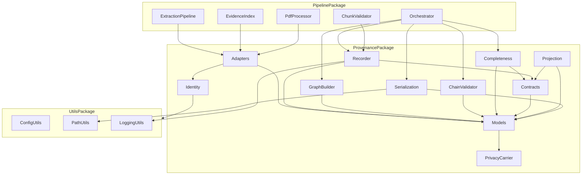
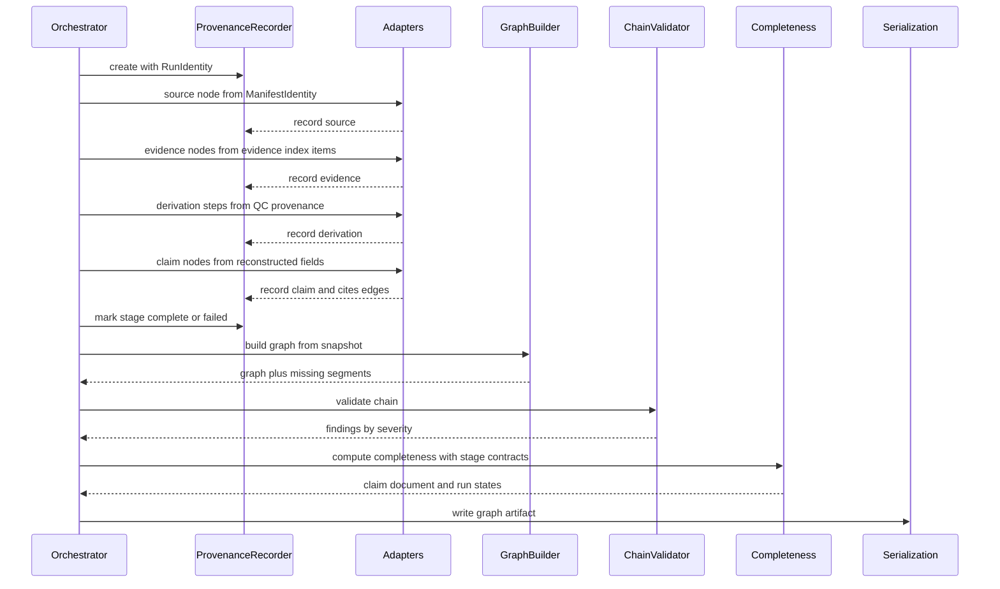
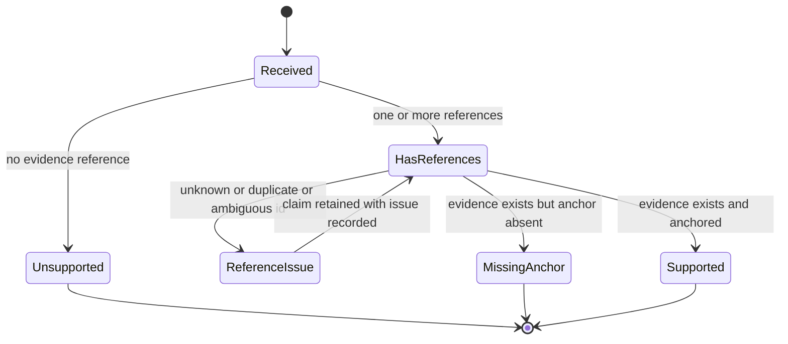
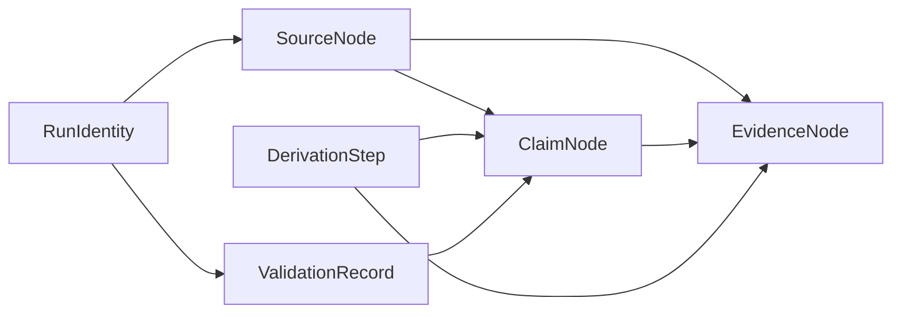

# Design Document — provenance-core

## Overview

**Purpose**: This feature makes evidence traceability a first-class, inspectable subsystem. It introduces `src/provenance/`, a leaf package that defines the provenance record model (sources, evidence nodes, claims, derivation steps, validation results), the identity rules for those records, the typed graph assembled from them, a chain validator that reports broken chains by severity, and a completeness computer that answers "is this artifact fully traceable?" as data rather than prose.

**Users**: Biomedical AI researchers, clinical evaluators, and institutional reviewers consume the output indirectly through downstream specs. The direct consumers are `privacy-core` (populates the privacy carrier), `provenance-audit-export` (reports completeness and validation findings), `public-private-provenance` (consults the carrier), `evidence-routing`, and `reviewer-ui` (consume evidence node identity).

**Impact**: Identity-bearing artifacts that exist today as incidental by-products — the ranked evidence index, the manifest identity, the chunk-output `loc` check, the reconciler's flat provenance dict — are **promoted** into typed provenance records. No parallel store is created, no second fingerprint set is computed, and no second evidence numbering scheme is introduced. The extraction pipeline gains explicit emission calls; everything else is additive.

### Goals

- One canonical definition of evidence node identity for the entire project.
- A typed, schema-versioned provenance graph that is interpretable without pipeline internals.
- Chain validation with per-finding severity, and a completeness state computed at claim, document, and run level.
- A pinned, inert privacy label/decision carrier that provenance stores but never interprets.
- The xtrace append-only decision ledger delivered as a **projection** of this graph, not a second store.

### Non-Goals

- Audit packages, export formats, and reporting of the completeness state — `provenance-audit-export`.
- Public/private views, disclosure coordination, vaults, commitments, tamper-evidence — `public-private-provenance`.
- Any sensitivity classification or disclosure policy evaluation — `privacy-core`.
- Graph visualization, a query language, a UI, or a graph database.
- Replacing `src/artifact_generation/w3c_annotation.py` as the sole W3C annotation producer.

## Boundary Commitments

### This Spec Owns

- The provenance record model and its type vocabulary: node kinds, edge kinds, evidence kinds, derivation kinds, anchor precision, severity, completeness state, privacy state.
- Identity derivation for source nodes, run identity, evidence nodes, claim nodes, and derivation steps.
- The append-only in-run record sink (`ProvenanceRecorder`) and the stage-contract declaration table.
- Graph assembly, including partial-graph preservation and missing-segment reporting.
- Chain validation and severity classification of findings.
- **Computation** of the provenance-completeness state at claim, document, and run level.
- The `PrivacyCarrier` structure carried by every node, and its structural conformance check.
- The in-repo JSON serialization of the graph, its schema identity, and its schema-version compatibility rule.
- The ordered event-log projection derived from the graph.
- The `provenance` configuration block and the `src/provenance` dependency-direction rules.

### Out of Boundary

- **Reporting** the completeness state, rendering audit artifacts, or defining an interoperable export format — `provenance-audit-export` consumes `CompletenessReport` and `ChainValidationReport` as-is.
- **Populating** the privacy carrier or defining the label/decision vocabulary — `privacy-core`.
- **Consulting** the carrier to decide disclosure, and any public/private view — `public-private-provenance`.
- Changing the model-facing `loc` vocabulary, the chunk-output JSON contract, `_shared_paper_prefix`, or any prompt content.
- Fixing the pre-existing duplication of `_compute_extraction_map_hash` between `manifest.py` and `evidence_index.py`; this spec adds no third computation but does not consolidate the existing two.
- Changing the raise semantics of `validate_chunk_output` on the existing call path.
- Any change to `src/quality_control/`, `src/agents/`, `src/pdf_extractor/`, or `src/text_processing/`.

### Allowed Dependencies

- `src/provenance/` may import **only** `src/utils/` and the Python standard library. It is a leaf package, peer to `text_processing`.
- `src/pipeline/` is the sole integration point and may import `provenance`.
- `quality_control`, `agents`, `pdf_extractor`, and `text_processing` must **not** import `provenance`.
- No new third-party dependency. No graph library, no crypto library, no RDF library. `hashlib` and `json` from the standard library only.

### Revalidation Triggers

- Any change to `EvidenceNode.node_id` composition or to the `source_id#local_id` convention — breaks `evidence-routing`, `privacy-core`, `public-private-provenance`, `reviewer-ui`.
- Any change to `PrivacyCarrier` field names or to the "stored verbatim, never inferred" rule — breaks `privacy-core` and `public-private-provenance`.
- Any change to `CompletenessReport` or `ChainValidationReport` shape — breaks `provenance-audit-export`.
- A major bump of `PROVENANCE_SCHEMA_VERSION` — breaks every artifact reader.
- Adding a node kind, edge kind, or derivation kind to the closed vocabularies.
- **Adding or renaming a stage in `STAGE_CONTRACTS` or `STAGE_ORDER`** — this is the expected growth path, not an exceptional one: `evidence-routing` adds seven stages (index build, local retrieval, locator, route QC, counterfactual, adjudication, pack assembly) and `multiagent-extraction` adds seven more (its extraction, verification, adjudication, and repair stages). Each such spec **extends both tables in place** — adding a `StageContract` entry and an ordered `STAGE_ORDER` position — and routes its records through `ProvenanceRecorder`. Bypassing the recorder, catching `UnknownStageError` to skip declaration, or maintaining a private stage list are all prohibited. The vocabulary stays closed and the contract-drift test (every recorded stage appears in both tables) stays in force; a spec that adds a stage must extend the tables and re-run that test, and must re-verify `compute_completeness` under `stage_contracts_strict`.
- Any change to the `derivation_from_stage_event` signature, or to the stage→`DerivationKind` mappings downstream specs pin against it.
- Any change to the `src/provenance` dependency direction rules.

## Architecture

### Existing Architecture Analysis

The pipeline already produces four artifacts that are provenance records in all but name:

| Existing artifact | Location | Becomes | Gap this spec closes |
|---|---|---|---|
| Evidence item `dict` with `id`/`section_path`/`page`/`coords`/`xpath`/`source_pdf`/`score` | `src/pipeline/evidence_index.py` | `EvidenceNode` | No type, no anchor-absence marker, no anchor-precision, no producing backend |
| `ManifestIdentity` (`pdf_content_hash`, `config_hash`, `extraction_map_hash`, `model_id`, `schema_version`) | `src/pipeline/manifest.py` | `SourceNode` + `RunIdentity` | Scoped to cache staleness, not identity; not linkable to evidence |
| `loc` reference check against `valid_location_ids`; `evidence_map` resolution | `src/pipeline/validator.py` | Claim→evidence edges + reference issues | Raises on one path, silently drops on the other; nothing is recorded |
| `_build_provenance_dict` flat extractor-name dict | `src/quality_control/reconciler.py` | `DerivationStep` records | Not a graph; no edges, node types, or derivation steps |

Constraints that must be preserved: `_shared_paper_prefix` byte-stability; no global mutation (config passed explicitly); heavy optional deps lazily imported (not applicable here — none are used); all shared dataclasses of a package live in one module with a single owner.

### Architecture Pattern & Boundary Map

Selected pattern: **leaf domain package with mapping-based adapters**. The core knows nothing about PDFs, GROBID, or model providers; adapters accept plain mappings, so no forbidden import is ever needed. `pipeline` performs all wiring.



**Architecture Integration**

- **Dependency direction** (exhaustive; every module of the package appears exactly once): `utils → provenance.privacy_carrier → provenance.models → provenance.identity → provenance.contracts → provenance.recorder → provenance.graph → provenance.validation → provenance.completeness → provenance.projection → provenance.serialization`, with `provenance.adapters` depending only on `models` and `identity`. Each module imports only from modules to its left. `privacy_carrier` precedes `models` because every node embeds a carrier; `contracts` precedes `completeness` because the completeness diff consumes `STAGE_CONTRACTS`. `pipeline` sits above all of provenance and is the only caller.
- **Domain boundaries**: record *definition and identity* (models, identity, privacy_carrier) is separate from record *emission* (recorder, adapters), which is separate from *assembly* (graph), which is separate from *analysis* (validation, completeness, projection), which is separate from *persistence* (serialization). These are the four boundary candidates named in the brief, and they are the parallel-safe task seams.
- **Existing patterns preserved**: single-module ownership of shared dataclasses (mirrors `quality_control/models.py`); explicit config passing; run-scoped output paths via `resolve_run_output_path`; closed string vocabularies (mirrors `YearResolution.provenance`); AST-enforced dependency direction.
- **New components rationale**: every module above maps to exactly one requirement group; none exists speculatively.

### Technology Stack

| Layer | Choice / Version | Role in Feature | Notes |
|-------|------------------|-----------------|-------|
| Runtime | Python 3.12.x | Package language | Matches repo pin |
| Domain model | `dataclasses` (frozen) + `typing.Literal` | Node/edge/report records and closed vocabularies | Mirrors `quality_control/models.py`; `from __future__ import annotations` throughout |
| Identity | `hashlib.sha256` (stdlib) | Derivation-step and run-identity digests | Document/config/schema fingerprints are **consumed** from `ManifestIdentity`, never recomputed |
| Persistence | `json` (stdlib) → `outputs/run_<ts>/provenance/` | Graph artifact | Same run-scoped pattern as `evidence_cache` |
| Config | `configs/config.yaml` top-level `provenance:` block | Enable flag, output subdir, severity policy | Must be registered in `_ALL_KNOWN_TOP_LEVEL_KEYS` |
| Tests | pytest + Hypothesis | Unit, property, AST boundary tests | Hypothesis for identity determinism and projection purity |

No new third-party dependency is introduced.

## File Structure Plan

### Directory Structure

```
src/provenance/
├── __init__.py                 # Public surface; re-exports models, recorder, graph, reports
├── models.py                   # All record types, closed vocabularies, and every cross-layer type:
│                               # ValidationFinding, DEFAULT_SEVERITIES, MissingSegment,
│                               # StageContract, ArtifactCompleteness, RecordedRun,
│                               # ChainValidationReport, CompletenessReport
├── privacy_carrier.py          # PrivacyCarrier + structural conformance check. Inert by construction.
├── identity.py                 # Source, run, evidence, claim, derivation ID derivation and parsing
├── contracts.py                # STAGE_CONTRACTS declaration table + stage ordering
├── recorder.py                 # ProvenanceRecorder: append-only sink; snapshot to RecordedRun
├── graph.py                    # ProvenanceGraph; build_graph(); attach_validation/attach_completeness
├── validation.py               # validate_chain() only; declares no dataclass
├── completeness.py             # compute_completeness() only; declares no dataclass
├── projection.py               # project_event_log(): ordered append-only view of the graph
├── serialization.py            # graph_to_dict / graph_from_dict / write_graph / read_graph; schema version guard
└── adapters/
    ├── __init__.py             # Adapter re-exports
    ├── identity_adapter.py     # ManifestIdentity mapping -> SourceNode, RunIdentity
    ├── evidence_adapter.py     # Evidence-index item dicts -> EvidenceNode
    ├── claim_adapter.py        # Reconstructed field dicts -> ClaimNode + cites_evidence edges
    └── derivation_adapter.py   # QC provenance dict and stage events -> DerivationStep
```

Adapters take `Mapping[str, Any]` / `Sequence[Mapping[str, Any]]` only. This is what keeps `provenance` importable without `pipeline`.

```
tests/src/provenance/
├── test_provenance_models.py            # vocabulary closure, frozen records, extension namespacing
├── test_provenance_privacy_carrier.py   # inertness, verbatim storage, rejection path
├── test_provenance_identity.py          # ID derivation + round-trip; determinism property tests
├── test_provenance_recorder.py          # append-only semantics, idempotent duplicates, stage marks
├── test_provenance_graph_builder.py     # typed assembly, partial preservation, missing segments
├── test_provenance_validation.py        # each finding kind, severity classification, unvalidated path
├── test_provenance_completeness.py      # claim/document/run states, missing-anchor vs unsupported
├── test_provenance_projection.py        # deterministic order, purity, no-parallel-store assertion
├── test_provenance_serialization.py     # schema metadata, namespaced extensions, version guard
├── test_provenance_adapter_identity.py     # identity adapter
├── test_provenance_adapter_evidence.py     # evidence adapter, incl. all three anchor-precision cases
├── test_provenance_adapter_claim.py        # claim adapter, incl. all three support classifications
├── test_provenance_adapter_derivation.py   # derivation adapter, incl. many-to-one and one-to-many
└── test_provenance_import_isolation.py     # imports cleanly with pipeline/QC absent from sys.modules
```

One test module per adapter, so the four adapter tasks share no test file. The only file they share is `src/provenance/adapters/__init__.py`, to which each adapter task appends exactly one re-export line.

### Modified Files

- `src/utils/config_utils.py` — add `_PROVENANCE_DEFAULTS`, register `"provenance"` in `_ALL_KNOWN_TOP_LEVEL_KEYS`, add `load_provenance_config(config)`.
- `src/utils/path_utils.py` — add `PROVENANCE_DIR = resolve_run_output_path("provenance")`.
- `configs/config.yaml` — add the `provenance:` block.
- `tests/test_dependency_directions.py` — add 8 `FORBIDDEN_PAIRS` entries plus one named test per pair.
- `src/pipeline/validator.py` — add optional `issue_sink` to `_validate_extraction_item`, `validate_chunk_output`, and `reconstruct_fields`. Default `None` preserves current behavior exactly.
- `src/pipeline/evidence_index.py` — add optional `recorder` keyword to `build_or_load_evidence_bundle`; emit evidence nodes via `evidence_adapter` after the bundle is built (both cache-hit and cache-miss paths).
- `src/pipeline/extraction_pipeline.py` — emit the source node from the run's `ManifestIdentity`, and convert `unified.content["provenance"]` into derivation steps via `derivation_adapter`.
- `src/pipeline/pdf_processor.py` — emit claim nodes and per-chunk/synthesis derivation steps; mark prefilled fields 1–2 as non-model origin.
- `src/pipeline/orchestrator.py` — own the recorder lifecycle: construct per run, pass explicitly, then build graph, validate, compute completeness, and write the artifact.

## System Flows

### Record emission through to artifact



Key decisions not visible in the diagram: emission happens strictly **after** prompt assembly and **after** response parsing, so no provenance value can reach `_shared_paper_prefix`; a stage that emits nothing does not abort assembly (1.6) but is detected by the completeness diff (2.1); and validation results are themselves recorded back into the graph as validation nodes (8.7) before serialization.

### Claim support classification



`Unsupported` and `MissingAnchor` are distinct terminal states — this is the whole point of 5.6 and 2.4. A reference issue never destroys the claim (5.4).

## Requirements Traceability

| Requirement | Summary | Components | Interfaces | Flows |
|-------------|---------|------------|------------|-------|
| 1.1, 1.2, 1.3, 1.4, 1.5, 1.6 | First-class subsystem; stage-agnostic emission; separate storage; traversable path; no network need; tolerate silent stages | ProvenanceModels, ProvenanceRecorder, GraphBuilder, Serialization | `ProvenanceRecorder`, `build_graph`, `write_graph`, `ProvenanceGraph.path_from_claim` | Record emission |
| 2.1, 2.2, 2.3, 2.4, 2.5, 2.6 | Completeness computation at three levels; responsible stage; missing-anchor vs unsupported; undetermined; data not report | CompletenessComputer, StageContracts | `compute_completeness`, `STAGE_CONTRACTS`, `CompletenessReport` | Record emission, Claim support classification |
| 3.1, 3.2, 3.3, 3.4, 3.5, 3.6, 3.7 | Source and run identity from fingerprints; single fingerprint set; no disclosure decision | IdentityService, IdentityAdapter, ProvenanceModels | `derive_source_id`, `derive_run_id`, `source_node_from_identity`, `RunIdentity` | Record emission |
| 4.1, 4.2, 4.3, 4.4, 4.5, 4.6, 4.7, 4.8 | Evidence node model, anchors, anchor-absence, approximate precision, backend, adopted ID, sole identity definition | EvidenceAdapter, IdentityService, ProvenanceModels | `evidence_nodes_from_items`, `format_evidence_id`, `parse_evidence_id`, `SourceAnchor` | Record emission |
| 5.1, 5.2, 5.3, 5.4, 5.5, 5.6, 5.7 | Claim records; unsupported marking; reference verification and issues; revision links; anchor vs no-reference; non-model origin | ClaimAdapter, ChainValidator, ProvenanceModels, modified pipeline validator | `claim_nodes_from_fields`, `issue_sink`, `ClaimNode.support`, `ClaimNode.origin` | Claim support classification |
| 6.1, 6.2, 6.3, 6.4, 6.5, 6.6, 6.7 | Derivation steps; stage and kind; probabilistic vs deterministic; many-to-one and one-to-many; removal reasons | DerivationAdapter, ProvenanceModels, IdentityService | `DerivationStep`, `derive_derivation_id`, `derivations_from_qc_provenance` | Record emission |
| 7.1, 7.2, 7.3, 7.4, 7.5, 7.6, 7.7 | Typed graph; distinct node types; self-interpretable; partial preservation; schema metadata; ledger as projection; no export format | GraphBuilder, Projection, Serialization | `build_graph`, `ProvenanceGraph`, `project_event_log`, `PROVENANCE_SCHEMA_ID` | Record emission |
| 8.1, 8.2, 8.3, 8.4, 8.5, 8.6, 8.7 | Chain validation; severity classification; unvalidated state; attachable results | ChainValidator, ProvenanceModels | `validate_chain`, `ValidationFinding`, `DEFAULT_SEVERITIES`, `ChainValidationReport` | Record emission |
| 9.1, 9.2, 9.3, 9.4, 9.5, 9.6, 9.7 | Single privacy carrier; verbatim storage; unknown default; no policy; provenance of the label; structural rejection; absent carrier tolerated | PrivacyCarrierModule, ProvenanceModels, ChainValidator | `PrivacyCarrier`, `check_carrier_conformance` | Claim support classification |
| 10.1, 10.2, 10.3, 10.4, 10.5, 10.6 | New evidence kinds; parser metadata; attachable validations; namespaced extensions; version-forward; unrecognized version reported | ProvenanceModels, Serialization, EvidenceAdapter | `EvidenceKind`, `extensions`, `graph_from_dict`, `UnrecognizedSchemaVersionError` | Record emission |

## Components and Interfaces

| Component | Domain/Layer | Intent | Req Coverage | Key Dependencies (P0/P1) | Contracts |
|-----------|--------------|--------|--------------|--------------------------|-----------|
| ProvenanceModels | Definition | All record types and closed vocabularies | 1, 3, 4, 5, 6, 7, 9, 10 | PrivacyCarrierModule (P0) | State |
| PrivacyCarrierModule | Definition | Inert privacy label/decision carrier | 9 | none | Service, State |
| IdentityService | Definition | Derive and parse all provenance IDs | 3, 4, 5, 6 | ProvenanceModels (P0) | Service |
| StageContracts | Definition | Declarative table of what each stage must emit | 2 | ProvenanceModels (P0) | State |
| ProvenanceRecorder | Emission | Append-only in-run record sink | 1, 2, 5 | ProvenanceModels (P0), IdentityService (P0) | Service, State |
| Adapters | Emission | Convert pipeline mappings into records | 3, 4, 5, 6, 10 | ProvenanceModels (P0), IdentityService (P0) | Service |
| GraphBuilder | Assembly | Assemble typed graph; preserve partial results | 1, 7 | ProvenanceRecorder (P0) | Service |
| ChainValidator | Analysis | Validate chains; classify findings by severity | 5, 8, 9 | GraphBuilder (P0) | Service |
| CompletenessComputer | Analysis | Compute completeness at three levels | 2 | GraphBuilder (P0), StageContracts (P0), ChainValidator (P1) | Service |
| Projection | Analysis | Ordered append-only view of the graph | 7 | GraphBuilder (P0) | Service |
| Serialization | Persistence | JSON artifact with schema identity and version guard | 1, 7, 10 | GraphBuilder (P0), PathUtils (P1) | Batch, State |
| PipelineIntegration | Integration | Wire emission and lifecycle into the pipeline | 1, 2, 3, 4, 5, 6 | all provenance components (P0) | Service |

### Definition Layer

#### ProvenanceModels

| Field | Detail |
|-------|--------|
| Intent | Single owner of every provenance record type, every closed vocabulary, and every type shared across more than one layer |
| Requirements | 1.1, 1.2, 3.2, 4.1, 4.3, 5.1, 6.2, 7.1, 7.2, 9.1, 10.1, 10.4 |

**Responsibilities & Constraints**
- **Ownership rule (precise form)**: `models.py` owns (a) every provenance *record* type, (b) every closed vocabulary, and (c) every type consumed by more than one layer — specifically `ValidationFinding`, `DEFAULT_SEVERITIES`, `RecordedRun`, `MissingSegment`, `StageContract`, `ArtifactCompleteness`, `ChainValidationReport`, and `CompletenessReport`. Three modules outside `models.py` declare a dataclass, and the list is exhaustive: `PrivacyCarrier` (`privacy_carrier.py`, which precedes `models.py` in the dependency order because every node embeds a carrier), `ProvenanceGraph` (`graph.py`), and `ProvenanceEvent` (`projection.py`). Nothing else declares a provenance dataclass.
- Placing `ValidationFinding`, `RecordedRun`, and `DEFAULT_SEVERITIES` here is load-bearing: the recorder (emission layer) and the claim adapter must construct findings and snapshots *before* the validation layer exists in the dependency order.
- Placing `ChainValidationReport` and `CompletenessReport` here is equally load-bearing: `ProvenanceGraph` carries both reports and `graph.py::attach_validation` accepts one, yet `graph.py` sits *before* `validation.py` and `completeness.py` in the dependency order. Declaring the report containers in `models.py` keeps every import pointing leftward.
- All records are `@dataclass(frozen=True)`. Immutability is what makes the recorder append-only in practice.
- Vocabularies are `Literal` unions — closed by design (7.1). Adding a member is a Revalidation Trigger.
- Every node carries `extensions: Mapping[str, Any]` whose keys must match `x-<namespace>-<field>`; a non-conforming key is rejected at construction (10.4).

**Dependencies**
- Outbound: PrivacyCarrierModule — every node embeds a carrier (P0)
- External: none

**Contracts**: State [x]

##### State Management

```python
NodeKind = Literal["source", "evidence", "claim", "derivation", "validation"]
EdgeKind = Literal["cites_evidence", "anchored_in", "derived_from",
                   "has_input", "has_output", "revises", "validates", "belongs_to_source"]
EvidenceKind = Literal["sentence", "figure_caption", "table", "metadata"]
AnchorPrecision = Literal["exact", "approximate", "absent"]
DerivationKind = Literal["extract", "normalize", "chunk", "filter", "merge",
                         "synthesize", "reconcile", "remove", "prefill", "annotate"]
Determinism = Literal["deterministic", "probabilistic"]
Severity = Literal["critical", "error", "warning", "info"]
CompletenessState = Literal["complete", "incomplete", "undetermined"]
ClaimSupport = Literal["supported", "unsupported", "missing_anchor"]
ClaimOrigin = Literal["model", "prefill", "human", "import"]

@dataclass(frozen=True)
class SourceAnchor:
    precision: AnchorPrecision
    page: int | None = None
    coords: tuple[float, float, float, float] | None = None
    section_path: str | None = None
    char_span: tuple[int, int] | None = None
    structural_path: str | None = None
    missing: tuple[str, ...] = ()          # anchor kinds explicitly absent (4.4)

@dataclass(frozen=True)
class ProvenanceNode:
    node_id: str
    kind: NodeKind
    run_id: str
    privacy: PrivacyCarrier
    extensions: Mapping[str, Any]

@dataclass(frozen=True)
class SourceNode(ProvenanceNode):
    document_fingerprint: str
    source_format: str
    source_label: str
    config_fingerprint: str
    schema_fingerprint: str
    model_ids: tuple[str, ...]

@dataclass(frozen=True)
class EvidenceNode(ProvenanceNode):
    local_id: str                          # pipeline-assigned, verbatim (4.7)
    evidence_kind: EvidenceKind
    source_id: str
    anchor: SourceAnchor
    producing_backend: str | None
    rank_score: int | None
    parser_metadata: Mapping[str, Any]     # (10.2)

@dataclass(frozen=True)
class ClaimNode(ProvenanceNode):
    source_id: str
    field_index: int
    field_name: str
    value_digest: str
    origin: ClaimOrigin
    support: ClaimSupport
    cited_evidence_ids: tuple[str, ...]
    confidence: str | None

@dataclass(frozen=True)
class DerivationStep(ProvenanceNode):
    stage: str
    derivation_kind: DerivationKind
    determinism: Determinism
    model_id: str | None
    input_ids: tuple[str, ...]
    output_ids: tuple[str, ...]
    removal_reason: str | None = None
    removed_ids: tuple[str, ...] = ()

@dataclass(frozen=True)
class ValidationRecord(ProvenanceNode):
    check_name: str
    finding_ids: tuple[str, ...]
    completed: bool

@dataclass(frozen=True)
class ProvenanceEdge:
    edge_id: str
    kind: EdgeKind
    from_id: str
    to_id: str
    attributes: Mapping[str, Any]

@dataclass(frozen=True)
class RunIdentity:
    run_id: str
    config_fingerprint: str
    schema_fingerprint: str
    model_ids: tuple[str, ...]
    document_fingerprints: Mapping[str, str]
    created_at: str

# --- Cross-layer types (owned here, not by the layer that analyses them) ---

@dataclass(frozen=True)
class ValidationFinding:
    finding_id: str
    code: str
    severity: Severity
    node_id: str | None
    edge_id: str | None
    message: str
    details: Mapping[str, Any]

DEFAULT_SEVERITIES: Mapping[str, Severity] = {...}   # see ChainValidator for the table

@dataclass(frozen=True)
class MissingSegment:
    stage: str
    record_kind: str
    reason: str
    affected_ids: tuple[str, ...]

@dataclass(frozen=True)
class StageContract:
    stage: str
    required_record_kinds: tuple[str, ...]
    scope: Literal["run", "document", "claim"]

@dataclass(frozen=True)
class ArtifactCompleteness:
    state: CompletenessState
    reason: str | None
    missing_record_kinds: tuple[str, ...]
    responsible_stages: tuple[str, ...]

@dataclass(frozen=True)
class RecordedRun:
    run: RunIdentity
    nodes: Mapping[str, ProvenanceNode]
    edges: tuple[ProvenanceEdge, ...]
    findings: tuple[ValidationFinding, ...]
    stage_status: Mapping[str, Literal["complete", "failed", "not_run"]]
    stage_failure_reasons: Mapping[str, str]

@dataclass(frozen=True)
class ChainValidationReport:
    completed: bool
    incompletion_reason: str | None
    findings: tuple[ValidationFinding, ...]
    counts_by_severity: Mapping[Severity, int]

@dataclass(frozen=True)
class CompletenessReport:
    run: ArtifactCompleteness
    documents: Mapping[str, ArtifactCompleteness]
    claims: Mapping[str, ArtifactCompleteness]
```

- Preconditions: `extensions` keys match `x-<ns>-<field>`; `node_id` non-empty.
- Postconditions: records are hashable and comparable by value.
- Invariants: no record exposes a mutation method; vocabularies are exhaustive.

**Implementation Notes**
- Integration: `src/provenance/__init__.py` re-exports these. Outside `models.py`, only three modules declare a provenance dataclass, and the list is exhaustive: `privacy_carrier.py` (`PrivacyCarrier`), `graph.py` (`ProvenanceGraph`), and `projection.py` (`ProvenanceEvent`).
- Validation: a test enumerates each `Literal` union and asserts the serializer round-trips every member.
- Risks: vocabulary growth pressure from downstream specs — mitigated by `extensions` and by listing vocabulary additions as a Revalidation Trigger.

#### PrivacyCarrierModule

| Field | Detail |
|-------|--------|
| Intent | Define the inert carrier by which privacy labels and disclosure decisions attach to provenance nodes |
| Requirements | 9.1, 9.2, 9.3, 9.4, 9.5, 9.6, 9.7 |

**Responsibilities & Constraints**
- Defines exactly one carrier structure (9.1). No second mechanism for attaching privacy metadata exists anywhere in this design.
- `label` and `decision` are **opaque strings** to provenance. Their vocabulary is owned by `privacy-core`.
- Stores supplied values verbatim (9.2); never normalizes, maps, defaults, or infers (9.4).
- Absent label ⇒ `state == "unknown"`, never a substituted value (9.3).
- Conformance checking is **structural only**: required fields present and correctly typed. A structurally invalid carrier yields `state == "rejected"` with `rejection_reason`, and the caller records a `privacy_carrier_invalid` finding (9.6). The node itself is retained.

**Dependencies**
- Inbound: ProvenanceModels — embeds the carrier on every node (P0)
- Outbound: none
- External: none

**Contracts**: Service [x] / State [x]

##### Service Interface

```python
PrivacyState = Literal["unknown", "labeled", "rejected"]

@dataclass(frozen=True)
class PrivacyCarrier:
    state: PrivacyState = "unknown"
    label: str | None = None
    decision: str | None = None
    supplied_by: str | None = None     # component that supplied it (9.5)
    supplied_at: str | None = None     # ISO 8601 timestamp (9.5)
    rejection_reason: str | None = None

UNKNOWN_PRIVACY: PrivacyCarrier = PrivacyCarrier()

def attach_privacy(
    carrier_input: Mapping[str, Any] | None,
    *,
    supplied_by: str,
    supplied_at: str,
) -> PrivacyCarrier: ...

def check_carrier_conformance(carrier_input: Mapping[str, Any]) -> tuple[bool, str | None]: ...
```

- Preconditions: `carrier_input` is `None` or a mapping.
- Postconditions: `None` input ⇒ `UNKNOWN_PRIVACY`; conforming input ⇒ `state == "labeled"` with `label`/`decision` byte-identical to input; non-conforming ⇒ `state == "rejected"` with a reason and `label is None`.
- Invariants: this module contains no branch on the *value* of `label` or `decision`.

**Implementation Notes**
- Integration: `privacy-core` will call `attach_privacy`; until it exists, every node carries `UNKNOWN_PRIVACY` and the graph still assembles and validates (9.7).
- Validation: a test asserts the module's source contains no comparison against any label literal, guarding 9.4 mechanically.
- Risks: pressure to "just add a default label" — explicitly prohibited by 9.3.

#### IdentityService

| Field | Detail |
|-------|--------|
| Intent | Sole derivation and parsing point for every provenance identifier |
| Requirements | 3.1, 3.3, 3.5, 3.6, 4.2, 4.7, 4.8, 5.1, 6.2 |

**Responsibilities & Constraints**
- Derives IDs; never computes document, config, or extraction-map fingerprints — those arrive from `ManifestIdentity` (3.6).
- Evidence IDs adopt the pipeline-assigned local ID verbatim and scope it by source: `f"{source_id}#{local_id}"` (4.7).
- Derivation-step IDs are content-addressed over `(stage, kind, sorted inputs, sorted outputs)`, making recording idempotent and cross-run comparable (3.3).

**Dependencies**
- Inbound: Adapters, Recorder (P0)
- External: `hashlib` (stdlib) (P2)

**Contracts**: Service [x]

##### Service Interface

```python
def derive_source_id(document_fingerprint: str) -> str: ...            # "src:<fingerprint>"
def derive_run_id(identity_fields: Mapping[str, str]) -> str: ...      # "run:<sha256[:16]>"
def format_evidence_id(source_id: str, local_id: str) -> str: ...      # "<source_id>#<local_id>"
def parse_evidence_id(node_id: str) -> tuple[str, str]: ...            # -> (source_id, local_id)
def derive_claim_id(source_id: str, field_index: int, revision: int = 0) -> str: ...
def derive_derivation_id(stage: str, kind: str,
                         input_ids: Sequence[str], output_ids: Sequence[str]) -> str: ...
def derive_validation_id(run_id: str, check_name: str) -> str: ...
```

- Preconditions: `local_id` is non-empty and contains no `#`.
- Postconditions: `parse_evidence_id(format_evidence_id(s, l)) == (s, l)` for all valid inputs.
- Invariants: all functions are pure; no clock, no randomness, no filesystem access.
- Errors: `InvalidIdentifierError` on malformed input.

**Implementation Notes**
- Validation: Hypothesis property tests for round-trip totality and for order-independence of `derive_derivation_id` under input/output permutation.
- Risks: a downstream spec inventing its own evidence ID — mitigated by 4.8 and by exporting `format_evidence_id` as the only sanctioned constructor.

#### StageContracts

| Field | Detail |
|-------|--------|
| Intent | Declare, as data, what each pipeline stage must emit and in what order stages run |
| Requirements | 2.1, 2.3, 7.6 |

**Responsibilities & Constraints**
- `STAGE_CONTRACTS: Mapping[str, StageContract]` where `StageContract` names the required record kinds and the artifact scope (`run`, `document`, or `claim`).
- `STAGE_ORDER: tuple[str, ...]` gives the deterministic ordering used by the event-log projection (7.6).
- Absence is only detectable against a declaration; therefore the table, not the stage, is authoritative.
- **Extension protocol for downstream specs**: the vocabulary is closed but the table is *extensible*. A spec that introduces new pipeline stages (`evidence-routing`, `multiagent-extraction`) adds one `StageContract` entry per stage to `STAGE_CONTRACTS` and one ordered position per stage to `STAGE_ORDER`, in the same commit that adds the emitting code. It does **not** bypass `ProvenanceRecorder`, does not suppress or catch `UnknownStageError` to avoid declaring, and does not keep a private stage table. Extending the tables is a Revalidation Trigger for this spec but is *not* a `PROVENANCE_SCHEMA_VERSION` bump: `stage` is a free-form string field on `DerivationStep`, so a new stage name is forward-compatible with existing readers.

**Contracts**: State [x]

**Implementation Notes**
- Validation: a test asserts every stage name recorded by `ProvenanceRecorder` appears in `STAGE_CONTRACTS` and in `STAGE_ORDER`, catching table drift. This test is what forces a downstream spec to extend the tables rather than route around them, and it must be re-run whenever a stage is added or renamed.

### Emission Layer

#### ProvenanceRecorder

| Field | Detail |
|-------|--------|
| Intent | Append-only in-run sink that pipeline stages write records into |
| Requirements | 1.2, 1.5, 1.6, 2.1, 2.3, 5.4 |

**Responsibilities & Constraints**
- Append-only: exposes only `record_*` and `mark_stage_*`; no update or delete method exists.
- Recording the same `node_id` twice with identical content is a no-op; with differing content it records a `duplicate_identity` finding and keeps the first (idempotent retry safety).
- Holds an `issue_sink` callable that `src/pipeline/validator.py` can pass so bad `loc` references become recorded issues while the claim is retained (5.4).
- `enabled=False` makes every method a no-op returning the derived ID, so the pipeline never branches on provenance being off.
- Performs no I/O and no network access (1.5).
- **Concurrency**: PDF-level `asyncio` tasks record concurrently. All mutation is guarded by a single `threading.Lock` held only around dictionary and list appends; records are plain immutable values, so no record is ever partially visible. `snapshot()` copies under the same lock.

**Dependencies**
- Inbound: PipelineIntegration (P0)
- Outbound: ProvenanceModels (P0), IdentityService (P0), `utils.logging_utils` (P2)

**Contracts**: Service [x] / State [x]

##### Service Interface

```python
class ProvenanceRecorder:
    def __init__(self, run: RunIdentity, *, enabled: bool = True) -> None: ...
    def record_source(self, node: SourceNode) -> str: ...
    def record_evidence(self, nodes: Sequence[EvidenceNode]) -> tuple[str, ...]: ...
    def record_claim(self, node: ClaimNode, edges: Sequence[ProvenanceEdge]) -> str: ...
    def record_derivation(self, step: DerivationStep) -> str: ...
    def record_validation(self, record: ValidationRecord) -> str: ...
    def record_issue(self, finding: ValidationFinding) -> None: ...
    def issue_sink(self) -> Callable[[str, str, Mapping[str, Any]], None]: ...
    def mark_stage_complete(self, stage: str) -> None: ...
    def mark_stage_failed(self, stage: str, reason: str) -> None: ...
    def snapshot(self) -> RecordedRun: ...
```

- Preconditions: `stage` is declared in `STAGE_CONTRACTS`.
- Postconditions: `snapshot()` returns an immutable `RecordedRun` carrying nodes, edges, findings, and per-stage status; calling it twice returns equal values.
- Invariants: the recorder never removes a previously recorded record.
- Errors: `UnknownStageError` when a stage is not declared.

**Implementation Notes**
- Integration: constructed once per run in `orchestrator.py` and passed explicitly — no module-level singleton, per the no-global-mutation rule.
- Risks: concurrent recording from PDF-level `asyncio` tasks — mitigated by keeping all mutation behind a single lock and recording only plain values.

#### Adapters

| Field | Detail |
|-------|--------|
| Intent | Convert existing pipeline mappings into provenance records without importing `pipeline` |
| Requirements | 3.1, 3.2, 3.4, 3.5, 3.7, 4.1, 4.3, 4.4, 4.5, 4.6, 4.7, 5.1, 5.2, 5.5, 5.6, 5.7, 6.1, 6.3, 6.4, 6.5, 6.6, 6.7, 10.2 |

**Responsibilities & Constraints**
- Accept `Mapping`/`Sequence[Mapping]` only. This is what keeps the dependency direction legal and what makes the adapters unit-testable with literal dicts.
- `evidence_adapter` maps the item dict field-for-field, and derives `SourceAnchor.precision`:
  - `exact` — `page` and `coords` both present;
  - `approximate` — coordinates absent but page or section path present, or the structural path is the weak `.//{tag}` fallback rather than an `xml:id` path (4.5);
  - `absent` — no page, no coords, no usable structural path; `missing` then enumerates the absent anchor kinds (4.4).
- `evidence_adapter` copies unrecognized item keys into `parser_metadata` rather than discarding them (10.2).
- `claim_adapter` sets `origin="prefill"` for fields produced without a model call (5.7) and classifies `support` per the claim-support state machine (5.2, 5.6).
- `derivation_adapter` marks model-performed steps `probabilistic` with the model id, and rule-based steps `deterministic` (6.3, 6.4); it emits one step with many inputs for merges (6.5) and reuses a single input node across many steps for fan-out (6.6); removals carry `removal_reason` and `removed_ids` (6.7).
- `identity_adapter` consumes `ManifestIdentity.to_dict()` and computes no fingerprint of its own (3.6); it copies source metadata without evaluating disclosure (3.7), and produces a source identity from fingerprints alone when descriptive metadata is absent (3.4).

**`derivation_from_stage_event` — call contract for downstream specs**

This is the adapter every downstream spec calls to record a stage event, so its contract is stated exhaustively here and is binding on callers:

- **`kind` is required and positional, and its value space is the closed `DerivationKind` literal.** There is no default and no inference from `stage`. A caller that omits `kind`, or passes a string outside `DerivationKind`, is a contract violation, not a tolerated extension. Each spec that adds stages must pin an explicit stage→`DerivationKind` mapping in its own design and keep that mapping in one place, so a given stage always produces the same `derivation_kind`.
- **Determinism is the `Determinism` literal (`"deterministic"` | `"probabilistic"`), never a `bool`.** The adapter derives it from `model_id` when the caller does not state it (`model_id is not None` ⇒ `"probabilistic"`), and a caller that states it explicitly must pass the literal. Passing `True`/`False` is rejected; there is no bool→literal coercion, because a bool loses the distinction between "rule-based" and "model-free but still sampled".
- **Any field that is not declared on `DerivationStep` must be carried in `extensions`, under the `x-<ns>-<field>` naming rule** (10.4), where `<ns>` is the owning spec's namespace. `DerivationStep` carries exactly `stage`, `derivation_kind`, `determinism`, `model_id`, `input_ids`, `output_ids`, `removal_reason`, `removed_ids`, plus the `ProvenanceNode` base fields. Fields such as `prompt_version` or `replaced_field_indices` are **not** on the record and must be passed as, e.g., `x-multiagent-prompt_version` and `x-multiagent-replaced_field_indices`. Non-conforming keys are rejected at construction; unrecognized *conforming* keys round-trip through serialization unchanged (10.5).
- **Extending `DerivationKind` is a schema-version-bumping change.** Adding a member is a Revalidation Trigger and requires a `PROVENANCE_SCHEMA_VERSION` bump, because existing readers validate the artifact against the closed union. A downstream spec that needs a new derivation semantic should first attempt to express it with an existing kind plus a namespaced extension; only if that is genuinely unfaithful does it request a vocabulary addition here. This is the opposite of the stage tables, which extend freely because `stage` is a free-form string.

**Contracts**: Service [x]

##### Service Interface

```python
def source_node_from_identity(identity: Mapping[str, str], *, source_label: str,
                              source_format: str, run_id: str) -> SourceNode: ...
def run_identity_from_identities(identities: Mapping[str, Mapping[str, str]],
                                 *, created_at: str) -> RunIdentity: ...
def evidence_nodes_from_items(items: Sequence[Mapping[str, Any]], *, source_id: str,
                              run_id: str, producing_backend: str | None) -> list[EvidenceNode]: ...
def claim_nodes_from_fields(fields: Sequence[Mapping[str, Any]], *, source_id: str,
                            run_id: str, known_evidence_ids: AbstractSet[str],
                            origin: ClaimOrigin
                            ) -> tuple[list[ClaimNode], list[ProvenanceEdge], list[ValidationFinding]]: ...
def derivations_from_qc_provenance(provenance: Mapping[str, Any], *, source_id: str,
                                   run_id: str) -> list[DerivationStep]: ...
def derivation_from_stage_event(stage: str, kind: DerivationKind, *, run_id: str,
                                inputs: Sequence[str], outputs: Sequence[str],
                                model_id: str | None = None,
                                determinism: Determinism | None = None,
                                removal_reason: str | None = None,
                                removed_ids: Sequence[str] = (),
                                extensions: Mapping[str, Any] | None = None
                                ) -> DerivationStep: ...
```

`kind` is required and closed; `determinism` is the `Determinism` literal (defaulting to `"probabilistic"` when `model_id` is given and `"deterministic"` otherwise) and never a `bool`; every field not declared on `DerivationStep` travels in `extensions` under `x-<ns>-<field>`.

- Preconditions: mappings use the key names emitted by the current pipeline; unknown keys are preserved, never rejected. `kind` is a member of `DerivationKind`; `determinism`, when supplied, is a member of `Determinism`; every `extensions` key matches `x-<ns>-<field>`.
- Postconditions: adapters are pure and total — a malformed item yields a node with `precision="absent"` and a finding, never an exception.
- Invariants: no adapter imports from `pipeline`, `quality_control`, `agents`, or `pdf_extractor`.

**Implementation Notes**
- Integration: called from `evidence_index.py`, `extraction_pipeline.py`, and `pdf_processor.py`; each call site passes the recorder explicitly.
- Validation: adapter tests use literal dicts copied from the real emitted shapes, including the `page=None, coords=None` case and the weak-xpath case.
- Risks: the pipeline's item shape drifting — mitigated by a test asserting the adapter tolerates unknown and missing keys without raising.

### Assembly Layer

#### GraphBuilder

| Field | Detail |
|-------|--------|
| Intent | Assemble a typed provenance graph, preserving whatever succeeded |
| Requirements | 1.3, 1.4, 1.6, 7.1, 7.2, 7.3, 7.4, 7.5 |

**Responsibilities & Constraints**
- Every node and edge carries an explicit kind from the closed vocabulary (7.1, 7.2).
- Per-record construction is individually guarded: a record that cannot be materialized becomes a `MissingSegment(stage, record_kind, reason, affected_ids)` and the rest of the graph is still produced (7.4). Construction never raises to the caller.
- A stage that emitted nothing produces no nodes and does not abort assembly (1.6).
- Attaches `PROVENANCE_SCHEMA_ID` and `PROVENANCE_SCHEMA_VERSION` to the graph (7.5).
- **Owns `attach_validation` and `attach_completeness`** (8.7): they return a new graph carrying the reports, and `attach_validation` additionally adds `ValidationRecord` nodes and `validates` edges. Serialization merely writes what the graph already holds; it never attaches anything.
- Exposes `path_from_claim(claim_id)` returning the claim → evidence → source chain, which is the traversable path of 1.4.
- Stores references only; evidence text is never copied onto claim nodes, keeping the artifact separate from but linkable to raw model outputs (1.3).

**Contracts**: Service [x]

##### Service Interface

`MissingSegment`, `RecordedRun`, `ChainValidationReport`, and `CompletenessReport` are all declared in `models.py`; only `ProvenanceGraph` is local to this module. The graph **carries** both reports, so the serialized artifact is a pure function of the graph and the round-trip postcondition holds.

```python
@dataclass(frozen=True)
class ProvenanceGraph:
    schema_id: str
    schema_version: str
    run: RunIdentity
    nodes: Mapping[str, ProvenanceNode]
    edges: tuple[ProvenanceEdge, ...]
    missing_segments: tuple[MissingSegment, ...]
    validation: ChainValidationReport | None = None
    completeness: CompletenessReport | None = None
    def nodes_of_kind(self, kind: NodeKind) -> tuple[ProvenanceNode, ...]: ...
    def edges_from(self, node_id: str) -> tuple[ProvenanceEdge, ...]: ...
    def path_from_claim(self, claim_id: str) -> tuple[ProvenanceNode, ...]: ...

def build_graph(recorded: RecordedRun) -> ProvenanceGraph: ...
def attach_validation(graph: ProvenanceGraph,
                      report: ChainValidationReport) -> ProvenanceGraph: ...
def attach_completeness(graph: ProvenanceGraph,
                        report: CompletenessReport) -> ProvenanceGraph: ...
```

`attach_validation` returns a new graph with `validation` set **and** with one `ValidationRecord` node plus its `validates` edges added (8.7). `attach_completeness` sets `completeness` only; completeness is a computed view, not a node kind. Both are total, non-mutating, and idempotent — attaching twice with the same report yields an equal graph.

- Postconditions: `build_graph` never raises; `len(missing_segments) > 0` iff some record failed to materialize.
- Invariants: `nodes` is keyed by `node_id`; every edge endpoint either exists in `nodes` or is reported by the validator as a dangling reference.

**Implementation Notes**
- Integration: `attach_validation` returns a new graph carrying validation nodes, satisfying 8.7 without mutating the original; `attach_completeness` is its completeness counterpart and adds no node kind.
- Risks: silently swallowing construction errors — mitigated by requiring every swallowed error to produce a `MissingSegment` with a non-empty `reason`, asserted by test.

### Analysis Layer

#### ChainValidator

| Field | Detail |
|-------|--------|
| Intent | Detect broken chains and classify each finding by severity |
| Requirements | 5.3, 5.4, 8.1, 8.2, 8.3, 8.4, 8.5, 8.6, 8.7, 9.6 |

**Responsibilities & Constraints**
- Check set: `dangling_reference` (8.1), `source_not_represented` (8.2), `evidence_out_of_run_context` (8.3), `graph_cycle`, `orphan_node`, `missing_anchor`, `invalid_identifier`, `inconsistent_derivation` (8.4), plus `duplicate_reference`, `ambiguous_reference`, `unsupported_claim` (5.3, 5.4) and `privacy_carrier_invalid` (9.6).
- Every finding carries a severity from `DEFAULT_SEVERITIES` (declared in `models.py`, so emission-layer components can stamp a severity at construction time), overridable via `provenance.severity_overrides` (8.5).
- Default severities: `dangling_reference`/`graph_cycle`/`invalid_identifier` → `critical`; `source_not_represented`/`evidence_out_of_run_context`/`inconsistent_derivation`/`privacy_carrier_invalid` → `error`; `unsupported_claim`/`missing_anchor`/`duplicate_reference`/`ambiguous_reference` → `warning`; `orphan_node` → `info`.
- If a check cannot run, the report records `completed=False` with a reason and the run is reported **unvalidated**, never valid (8.6).
- Cycle detection is an iterative depth-first search over derivation and revision edges; iterative rather than recursive so a pathological chain cannot exhaust the stack.

**Contracts**: Service [x]

##### Service Interface

`ValidationFinding`, `DEFAULT_SEVERITIES`, and `ChainValidationReport` are all declared in `models.py` — the first two because the recorder and the claim adapter construct findings before this layer exists in the dependency order, the third because `ProvenanceGraph` carries it. This module declares no dataclass; it contributes only the function below.

```python
def validate_chain(graph: ProvenanceGraph, *,
                   severity_overrides: Mapping[str, Severity] | None = None
                   ) -> ChainValidationReport: ...
```

- Postconditions: `completed is False` implies the caller must treat the run as unvalidated; `findings` is ordered deterministically by `(severity_rank, code, node_id)`.
- Invariants: validation is read-only with respect to the graph.

**Implementation Notes**
- Validation: one test per finding code, each constructing the minimal graph that triggers it.
- Risks: severity inflation making every run "critical" — mitigated by the default table above and by counting per severity in the report.

#### CompletenessComputer

| Field | Detail |
|-------|--------|
| Intent | Compute the provenance-completeness state as queryable data at three levels |
| Requirements | 2.1, 2.2, 2.3, 2.4, 2.5, 2.6 |

**Responsibilities & Constraints**
- Diffs `STAGE_CONTRACTS` against `RecordedRun` stage status and graph content to detect stages that did not emit what they declared (2.1).
- Produces `run`, per-document, and per-claim states (2.2), each with `missing_record_kinds` and `responsible_stages` (2.3).
- A claim whose evidence exists but has `precision == "absent"` is `incomplete` with reason `missing_anchor`; a claim with no references at all is `incomplete` with reason `unsupported`. The two are never merged (2.4).
- A stage marked failed, or a graph carrying a `MissingSegment` covering an artifact, yields `undetermined` with the recorded reason rather than `complete` (2.5).
- Returns data only. It produces no string report, no CSV, and no file (2.6) — `provenance-audit-export` owns all of that.

**Contracts**: Service [x]

##### Service Interface

`ArtifactCompleteness` and `CompletenessReport` are both declared in `models.py` — the latter because `ProvenanceGraph` carries it. This module declares no dataclass; it contributes only the function below.

```python
def compute_completeness(graph: ProvenanceGraph, recorded: RecordedRun,
                         report: ChainValidationReport | None = None,
                         *, contracts: Mapping[str, StageContract] = STAGE_CONTRACTS
                         ) -> CompletenessReport: ...
```

- Postconditions: run state is the most severe of its documents; a document state is the most severe of its claims, with `undetermined` outranking `incomplete`.

**Implementation Notes**
- Risks: the contract table drifting from the pipeline — mitigated by the drift test declared under StageContracts.

#### Projection

| Field | Detail |
|-------|--------|
| Intent | Derive an ordered, append-only view of run decisions from the graph |
| Requirements | 7.6 |

**Responsibilities & Constraints**
- Pure function of the graph. Regenerating twice from the same graph yields identical output.
- Ordering key: `(STAGE_ORDER.index(stage), node_kind_rank, node_id)` — total and deterministic without a clock.
- No event is persisted independently of the graph artifact; this de-duplicates xtrace `R-GOV-1` by making the ledger a projection rather than a parallel store.

**Contracts**: Service [x]

##### Service Interface

```python
@dataclass(frozen=True)
class ProvenanceEvent:
    sequence: int
    stage: str
    event_kind: str
    node_id: str
    node_kind: NodeKind
    summary: Mapping[str, Any]

def project_event_log(graph: ProvenanceGraph) -> tuple[ProvenanceEvent, ...]: ...
```

- Invariants: every field of every event is derivable from the graph; the projection module writes no file.

**Implementation Notes**
- Validation: a purity property test (two projections of one graph are equal) and a test asserting `projection.py` performs no I/O.

### Persistence Layer

#### Serialization

| Field | Detail |
|-------|--------|
| Intent | Read and write the graph artifact with schema identity and a version compatibility guard |
| Requirements | 1.3, 7.3, 7.5, 7.7, 10.3, 10.4, 10.5, 10.6 |

**Responsibilities & Constraints**
- `PROVENANCE_SCHEMA_ID = "evitrace/provenance-graph"`, `PROVENANCE_SCHEMA_VERSION = "1.0.0"` (SemVer, matching the `MANIFEST_SCHEMA_VERSION` convention).
- The artifact is self-describing: node kinds, edge kinds, and the vocabulary version are embedded, so it is interpretable without pipeline internals (7.3).
- Namespaced extension fields round-trip unchanged and are visibly distinct from core fields (10.4); unknown keys within a compatible major version are preserved into `extensions` rather than dropped (10.5).
- Same major version ⇒ interpret. Different major version ⇒ raise `UnrecognizedSchemaVersionError` naming the version found and the versions supported (10.6). It never partially materializes an artifact it does not understand.
- Serializes whatever `ValidationRecord` nodes the graph already carries, so a new validation method needs no core type change (10.3). Attaching those nodes is GraphBuilder's job, not this module's.
- Writes exactly one artifact per run to `PROVENANCE_DIR`; defines **no** interoperable or external export format (7.7).

**Contracts**: Batch [x] / State [x]

##### Batch / Job Contract

- Trigger: end of `run_pipeline()`, after validation and completeness.
- Input / validation: a single `ProvenanceGraph` with validation and completeness already attached. The artifact is a pure function of that one argument — serialization takes no second report parameter.
- Output / destination: `outputs/run_<ts>/provenance/provenance_graph.json`.
- Idempotency & recovery: written to a temp file then `os.replace`, mirroring `save_manifest`. Re-running over an identical graph produces a byte-identical file.

##### Service Interface

```python
def graph_to_dict(graph: ProvenanceGraph) -> dict[str, Any]: ...
def graph_from_dict(payload: Mapping[str, Any]) -> ProvenanceGraph: ...
def write_graph(graph: ProvenanceGraph, path: Path) -> Path: ...
def read_graph(path: Path) -> ProvenanceGraph: ...
class UnrecognizedSchemaVersionError(Exception): ...
```

- Postconditions: `graph_from_dict(graph_to_dict(g)) == g` for any graph built by `build_graph`, including one that has since passed through `attach_validation` and `attach_completeness` — which is the state every persisted artifact is in.

**Implementation Notes**
- Risks: growth on large corpora — mitigated by storing references, never evidence text, on claim nodes.

### Integration Layer

#### PipelineIntegration

| Field | Detail |
|-------|--------|
| Intent | Wire recorder lifecycle and emission call sites into the existing pipeline |
| Requirements | 1.1, 1.2, 1.4, 2.1, 3.1, 3.5, 4.1, 4.7, 5.1, 5.3, 5.4, 5.7, 6.1, 6.7 |

**Responsibilities & Constraints**
- `orchestrator.py` constructs one `ProvenanceRecorder` per run from the resolved config and passes it explicitly down the call chain — no global, no module-level singleton.
- `extraction_pipeline.py` emits the source node from `compute_identity(...).to_dict()` and converts `unified.content["provenance"]` into derivation steps. **`quality_control` is not modified**; the conversion happens on the pipeline side.
- `evidence_index.py` emits evidence nodes on **both** the cache-hit and cache-miss paths, so a cached run is not silently provenance-incomplete.
- `pdf_processor.py` emits claim nodes and per-chunk/synthesis derivation steps; prefilled fields 1–2 are emitted with `origin="prefill"`.
- `validator.py` gains an optional `issue_sink`; when supplied, unknown/duplicate `loc` IDs are recorded as findings and the claim is retained; when omitted, behavior is unchanged byte-for-byte.
- **The sink must actually be passed at the production call sites** in `pdf_processor.py` (the `validate_chunk_output` and `reconstruct_fields` calls on both the chunk path and the synthesis path). Adding the parameter without wiring it would leave 5.3 and 5.4 satisfied only in tests.
- All emission occurs after prompt assembly and after response parsing. No provenance value may enter `_shared_paper_prefix`.

**Dependencies**
- Outbound: every provenance component (P0); `utils.config_utils`, `utils.path_utils` (P1)

**Contracts**: Service [x]

**Implementation Notes**
- Integration: `provenance.enabled: false` yields a recorder whose methods no-op, so no call site needs a conditional.
- Validation: an end-to-end test with a fabricated `QCBundle` and evidence bundle asserts a graph is produced, validated, and written; a separate regression test asserts `_shared_paper_prefix` output is unchanged.
- Risks: `asyncio` PDF-level concurrency interleaving records — mitigated by the recorder's internal lock and value-only records.

## Data Models

### Domain Model

Aggregates: `RunIdentity` is the root; a `SourceNode` is the per-document aggregate root; `EvidenceNode`, `ClaimNode`, and `DerivationStep` belong to a source; `ValidationRecord` belongs to the run.



Invariants:
- Every `EvidenceNode` and `ClaimNode` references exactly one `SourceNode` (8.2).
- `EvidenceNode.node_id` always parses back to `(source_id, local_id)` (4.7).
- A `DerivationStep` has at least one input or at least one output; a step with neither is `inconsistent_derivation`.
- The derivation and revision subgraph is acyclic; a cycle is a `critical` finding (8.4).
- Every node carries a `PrivacyCarrier`, defaulting to `UNKNOWN_PRIVACY` (9.3).

### Logical Data Model

| Entity | Key | Cardinality | Notes |
|---|---|---|---|
| RunIdentity | `run_id` | 1 per run | Digest of `ManifestIdentity` fields shared across documents |
| SourceNode | `src:<document_fingerprint>` | N per run | Fingerprint consumed from `ManifestIdentity.pdf_content_hash` |
| EvidenceNode | `<source_id>#<local_id>` | N per source | `local_id` verbatim from the evidence index |
| ClaimNode | `claim:<source_id>#f<field_index>[@r<n>]` | N per source | One per extracted field; revisions add `@r<n>` |
| DerivationStep | `drv:<sha256[:16]>` | N per run | Content-addressed; idempotent on retry |
| ValidationRecord | `val:<run_id>:<check_name>` | N per run | Attached post-validation |
| ProvenanceEdge | `<kind>:<from>-><to>` | N | Deduplicated by key |

### Data Contracts & Integration

**Configuration (`configs/config.yaml`)**

```yaml
provenance:
  enabled: true
  output_subdir: "provenance"
  severity_overrides: {}        # finding code -> severity
  fail_run_on_severity: null    # null | "critical" | "error"
  stage_contracts_strict: true
```

Registered in `_ALL_KNOWN_TOP_LEVEL_KEYS`, defaults in `_PROVENANCE_DEFAULTS`, read via `load_provenance_config(config)`. Each key has exactly one consumer:

| Key | Consumer |
|---|---|
| `enabled` | `ProvenanceRecorder` (no-op mode) and PipelineIntegration (artifact production) |
| `output_subdir` | Serialization (artifact path) |
| `severity_overrides` | `validate_chain` (per-code severity override) |
| `fail_run_on_severity` | PipelineIntegration — when set, a run whose findings include that severity or worse is logged at ERROR and the run summary records a provenance failure; extraction output is still written, because provenance never aborts extraction |
| `stage_contracts_strict` | `compute_completeness` — when true, a stage absent from `STAGE_CONTRACTS` yields `undetermined`; when false, it is ignored |

**Artifact schema (abbreviated)**

```json
{
  "schema_id": "evitrace/provenance-graph",
  "schema_version": "1.0.0",
  "run": {"run_id": "...", "config_fingerprint": "...", "schema_fingerprint": "...",
          "model_ids": ["..."], "document_fingerprints": {}, "created_at": "..."},
  "nodes": [{"node_id": "...", "kind": "evidence", "run_id": "...",
             "privacy": {"state": "unknown"}, "extensions": {}}],
  "edges": [{"edge_id": "...", "kind": "cites_evidence", "from_id": "...", "to_id": "..."}],
  "missing_segments": [],
  "validation": {"completed": true, "findings": [], "counts_by_severity": {}},
  "completeness": {"run": {"state": "complete"}, "documents": {}, "claims": {}}
}
```

**Compatibility rule**: readers accept any artifact whose major version matches `PROVENANCE_SCHEMA_VERSION`, preserving unknown keys into `extensions`; a differing major raises `UnrecognizedSchemaVersionError`.

## Error Handling

### Error Strategy

Provenance failures must never abort extraction — an unrecoverable provenance error degrades to a recorded finding plus an `incomplete` or `undetermined` completeness state.

| Category | Example | Response |
|---|---|---|
| Malformed input record | Evidence item missing `page` and `coords` | `SourceAnchor(precision="absent", missing=(...))`; `missing_anchor` finding (warning) |
| Invalid identifier | `local_id` containing `#` | `InvalidIdentifierError` inside the adapter, converted to a `MissingSegment`; the rest of the graph builds |
| Unknown stage | Stage name absent from `STAGE_CONTRACTS` | `UnknownStageError` at record time; caught by integration, logged, and the stage is reported `undetermined` |
| Broken chain | Claim cites a nonexistent evidence ID | `dangling_reference` finding (critical); the claim is retained (5.4) |
| Non-conforming privacy carrier | Wrong field types | `state="rejected"` plus `privacy_carrier_invalid` (error); node retained |
| Validation cannot run | Node index unavailable | `completed=False` with reason; run reported unvalidated (8.6) |
| Unknown schema major | Artifact from a future version | `UnrecognizedSchemaVersionError`; no partial materialization (10.6) |
| Provenance disabled | `provenance.enabled: false` | Recorder no-ops; pipeline behavior otherwise unchanged |

### Monitoring

All provenance logging goes through `utils.logging_utils.get_logger(__name__)`; `print` is never used. One INFO line per run summarizes node counts, findings by severity, and the run completeness state. Individual findings are logged at DEBUG to avoid flooding a large corpus run.

## Testing Strategy

### Unit Tests

1. `format_evidence_id`/`parse_evidence_id` round-trip for every ID shape, and rejection of a `local_id` containing `#` (4.7, 4.8).
2. `attach_privacy` stores label and decision byte-identically, returns `UNKNOWN_PRIVACY` for `None`, and returns `state="rejected"` with a reason for a malformed mapping (9.2, 9.3, 9.6).
3. `evidence_nodes_from_items` classifies anchor precision as `exact`, `approximate`, and `absent` across the real emitted item shapes, and enumerates `missing` anchor kinds (4.3, 4.4, 4.5).
4. `derive_derivation_id` is invariant under input and output permutation and stable across processes (6.2, 3.3).
5. `compute_completeness` distinguishes a no-reference claim (`unsupported`) from an anchorless-evidence claim (`missing_anchor`) (2.4).
6. `graph_from_dict(graph_to_dict(g)) == g`, including namespaced extension round-trip (10.4, 10.5).
7. `derivation_from_stage_event` rejects a `kind` outside `DerivationKind` and a `determinism` passed as a `bool`, defaults determinism from `model_id`, and carries a non-`DerivationStep` field (e.g. `x-multiagent-prompt_version`) through `extensions` unchanged while rejecting the same field un-namespaced (6.2, 6.3, 10.4).

### Integration Tests

1. Recorder → graph → validator → completeness → artifact over a fabricated multi-document run: artifact written, schema metadata present, run completeness computed (1.3, 7.5, 2.2).
2. A stage marked failed mid-run still yields a graph containing every other stage's nodes, with a `MissingSegment` and an `undetermined` completeness state (1.6, 7.4, 2.5).
3. `validate_chain` produces one finding of each code from purpose-built minimal graphs, with the documented default severity for each (8.1–8.5).
4. `validator.py` with an `issue_sink` records unknown-`loc` findings and retains the claim; without a sink, current raise and silent-drop behavior is byte-for-byte unchanged (5.3, 5.4).
5. `project_event_log` over a graph is deterministic across two invocations and contains no field absent from the graph, proving the ledger is a projection (7.6).
6. Every node carries `UNKNOWN_PRIVACY` when no privacy component exists, and the graph still assembles and validates (9.7).

### Boundary and Regression Tests

1. AST dependency-direction tests for all 8 new pairs: `provenance` must not import `agents`/`pipeline`/`pdf_extractor`/`quality_control`, and none of those four may import `provenance`.
2. `src/provenance/` imports cleanly with `pipeline` and `quality_control` absent from `sys.modules`, and with no network access (1.5).
3. No module under `src/provenance/` computes a document, config, or extraction-map fingerprint — asserted by AST scan for `hashlib` use outside `identity.py` (3.6).
4. `privacy_carrier.py` contains no comparison against any privacy label literal (9.4).
5. `_shared_paper_prefix` output is unchanged by provenance integration (prompt-cache stability constraint).
6. Every stage name the recorder accepts is declared in both `STAGE_CONTRACTS` and `STAGE_ORDER` (contract-drift guard).

### Property Tests (Hypothesis)

1. Evidence ID round-trip totality over arbitrary valid `(source_id, local_id)` pairs.
2. `build_graph` never raises for arbitrary well-typed record sets, and every unmaterialized record appears in exactly one `MissingSegment`.
3. `project_event_log` ordering is a total order — no two events share a sequence number.

## Security Considerations

- Provenance stores content fingerprints, identifiers, and anchors; it never stores evidence text on claim nodes, which bounds what a shared artifact could leak.
- Provenance makes **no** disclosure decision and applies **no** redaction (3.7, 9.4). The artifact written by this spec is an internal artifact; producing any shareable view is `public-private-provenance`'s responsibility.
- Test fixtures use synthetic identifiers and lorem text only — no PHI, credentials, or real patient data.
- No credential, API key, or model response body is recorded; derivation steps carry only the model identifier string.
