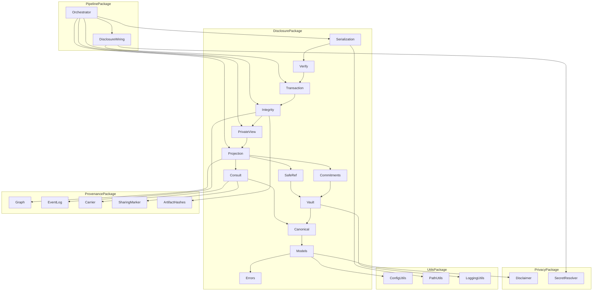
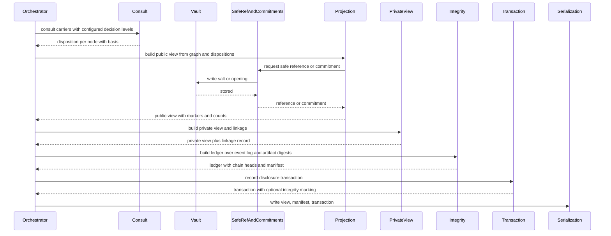
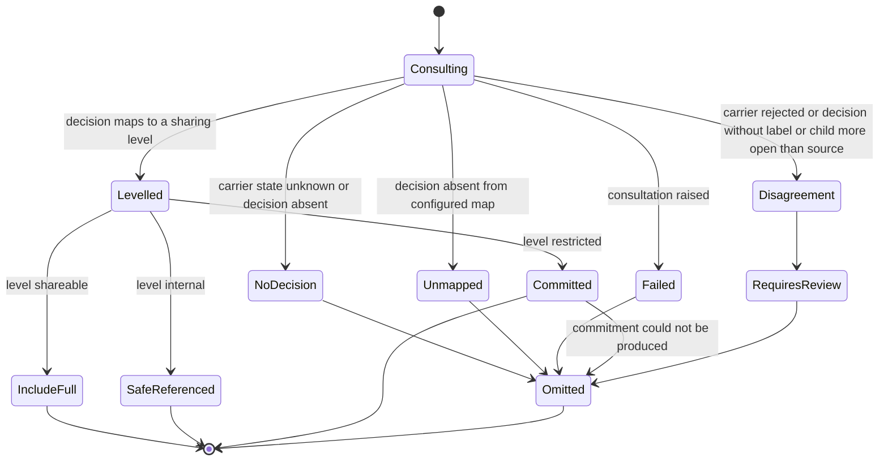
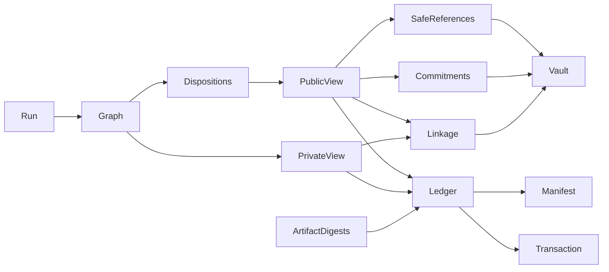

# Design Document — public-private-provenance

## Overview

**Purpose**: This feature turns one provenance graph into two coherent views. It introduces `src/disclosure/`, a package sitting above both completed upstream subsystems, containing: a consultation module that reads the privacy carrier and derives a per-node public disposition; a private vault holding reference salts, commitment openings, pseudonym mappings, and raw anchors behind an access-logged boundary; safe-reference and commitment construction; a public-view projector whose every omission is an explicit marker; a private view plus the auditable linkage between the two; an ordered append-only integrity ledger with a verification manifest usable outside the runtime; and a disclosure transaction record tying the private chain head to the public chain head.

**Users**: Institutional reviewers, external evaluators, and data stewards consume the public view and the verification manifest outside the runtime; an authorized operator consumes the private view and the vault. The direct software consumers are `src/pipeline/` (the sole integration point), `reviewer-ui` (renders public versus private status side by side), and any future proof-system spec.

**Impact**: A completed run currently produces exactly one view of everything and no integrity marker of any kind — hashing exists only for cache invalidation. After this feature an operator who has configured a vault can additionally produce a public provenance view, an integrity manifest covering the run's artifacts, and a disclosure transaction. Nothing existing changes shape: the graph is read-only input, no artifact is rewritten, and with `disclosure.enabled: false` the run behaves exactly as it does today.

### Goals

- One graph, two views, with every difference between them explicit and counted.
- Disposition derived by **consulting** the privacy carrier, never by judging content — enforced by the same source-level test both upstreams use.
- Restricted evidence represented by references that reveal nothing without the vault, and by commitments that bind to exactly what they stand for.
- Tamper-**evidence** over an ordered run history, verifiable outside the runtime with nothing but the artifacts and a standard hash implementation.
- Every integrity artifact stating, as data, what it proves and what it does not.

### Non-Goals

- Sensitivity classification, policy evaluation, and disclosure decisions — `privacy-core`.
- Redaction, pseudonymization, minimization, date-shifting transforms — `privacy-transformations`.
- Graph construction, node identity, chain validation, completeness — `provenance-core`.
- Run artifacts, audit packages, interoperable export, fidelity reporting, and the run-level sharing marking and its decision-to-level map — `provenance-audit-export`.
- Merkle inclusion proofs, zero-knowledge proofs, asymmetric signing, at-rest vault encryption, identity-provider integration, and any legal or compliance conclusion. Each is named in the artifacts as absent rather than left to inference.

## Boundary Commitments

### This Spec Owns

- The **consultation half** of prov R12.1: reading `PrivacyCarrier` and deriving a `NodeDisposition`. The carrier structure belongs to `provenance-core` and its population to `privacy-core`; this spec claims neither.
- The level-to-disposition table and its fail-closed default. It does **not** own the decision-to-level map, which `provenance-audit-export` owns and this spec reads.
- The enumerated privacy-versus-provenance disagreement conditions and the requires-review disposition.
- The public provenance view, its omission markers, its reduction counts, and its restricted-evidence-exists indicator.
- The private provenance view and the private-to-public linkage record.
- Safe references, commitments, their scheme identities, and their canonicalization rule.
- The vault: the `VaultStore` protocol, the shipped file-backed store, the location refusal rule, the append-only access log, and the **ingest of the surrogate handoff artifact** produced by `privacy-transformations` into `pseudonym_mapping` entries. It owns the reading, the storage, and the access control; it does **not** own the artifact's schema, which `privacy-transformations` pins as its producer.
- The integrity ledger (ordered, chained, over core's event-log projection), the verification manifest, and the verification procedure.
- The disclosure transaction record, the `TransactionSigner` protocol, and the shipped symmetric signer.
- The proof-artifact slot and the scheme-version compatibility rule.
- The `ProofSemantics` record attached to every integrity artifact.
- The `disclosure` configuration block and the `src/disclosure` dependency-direction rules.

### Out of Boundary

- Producing, altering, or re-deciding a `DisclosureDecision`; reading or branching on `PrivacyCarrier.label`.
- Defining a second decision-to-level map, a second sharing marking, or a second per-artifact digest scheme.
- Mutating the provenance graph, or altering the contents of any artifact `provenance-audit-export` writes.
- Recomputing document, configuration, schema, or artifact-file fingerprints. All are referenced.
- Maintaining a second ordering of run events; the chain follows `project_event_log` order.
- Any change to `src/quality_control/`, `src/agents/`, `src/pdf_extractor/`, `src/text_processing/`, `src/provenance/`, or `src/privacy/`.
- Authoring a second anti-overclaiming statement; `DISCLAIMER_TEXT` is embedded verbatim from `privacy-core`.
- Holding, revealing, or persisting key material. Signing keys stay behind an injected signer built by `pipeline`.

### Allowed Dependencies

- `src/disclosure/` may import **only** `src/utils/`, `src/provenance/` (including `src/provenance/export/`), `src/privacy/`, and the Python standard library. The single permitted `privacy` import is `DISCLAIMER_TEXT` in `disclosure/models.py`; no module imports `privacy.secrets`.
- `src/pipeline/` is the sole integration point and the only caller.
- `provenance`, `privacy`, `agents`, `pdf_extractor`, `quality_control`, and `text_processing` must **not** import `disclosure`.
- `src/disclosure/` must **not** import `privacy_transformations`, and `privacy_transformations` must not import `disclosure`. The surrogate handoff crosses **as a file, not as a call**: `privacy-transformations` writes a run-scoped `surrogate_handoff.json` against a schema it pins and versions, and `VaultService` ingests it by path. **A file-based handoff with a versioned schema needs no import edge in either direction** — the schema version is the whole compatibility contract, which is why neither spec's Allowed Dependencies list is widened. The consumer never links against the producer; it validates `schema_version` and `producer` and fails closed on a mismatch.
- No new third-party dependency. `hashlib`, `hmac`, `secrets`, `json`, `os`, `pathlib`, `datetime`, `importlib`, and `threading` only.

### Revalidation Triggers

- Any change to `PrivacyCarrier` field names or its "opaque, never interpreted" rule — breaks consultation.
- Any change to `provenance.sharing.decision_levels` semantics or to `SharingLevel` members — breaks disposition derivation.
- Any change to `project_event_log` ordering or `ProvenanceEvent` fields — breaks the integrity ledger.
- Adding a member to `NodeDisposition`, or adding a disagreement condition.
- A major bump of `PUBLIC_VIEW_SCHEMA_VERSION`, `INTEGRITY_MANIFEST_SCHEMA_VERSION`, or `TRANSACTION_SCHEMA_VERSION` — breaks every reader, including `reviewer-ui` and external verifiers.
- Any change to `COMMITMENT_SCHEME_ID`, `SAFE_REF_SCHEME_ID`, or `LEDGER_SCHEME_ID`, or to the canonicalization rule — invalidates verification of previously exported artifacts.
- Any change to the vault location refusal rule or to the `VaultStore` protocol.
- Any change by `privacy-transformations` to `SURROGATE_HANDOFF_SCHEMA_VERSION`, to the `surrogate_handoff.json` field set, or to that artifact's filename or location — breaks `VaultService`'s pseudonym-mapping ingest. A matching trigger is recorded on that spec's side, so a schema change on either side fires revalidation of both.
- Any change to the `src/disclosure` dependency-direction rules.

## Architecture

### Existing Architecture Analysis

Four upstream facts determine this design.

| Existing fact | Location | Consequence |
|---|---|---|
| `privacy` imports `provenance` (in `carrier.py`); `provenance` must not import `privacy` | both designs' Allowed Dependencies | A module needing both must sit **above** both — hence a new top-level package |
| `derive_sharing_marking()` already maps a carrier decision to a `SharingLevel` from `provenance.sharing.decision_levels`, fail-closed to `restricted`, and never reads `.label` | `provenance/export/sharing.py` | This spec consumes that map and adds only level-to-disposition; it introduces no second mapping and no second default |
| `project_event_log(graph)` is a pure, totally ordered projection with no clock | `provenance/projection.py` | The integrity chain orders itself from that projection, satisfying "no second ordering" |
| `ArtifactFileHash` digests and the run's document/config/schema fingerprints already exist | `provenance/export/reproducibility.py`, `ManifestIdentity` via core | The ledger chains **over** existing digests rather than recomputing them |

Constraints preserved unchanged: no global mutation, config loaded once and passed explicitly; shared dataclasses owned by one module per package; run-scoped output paths; closed `Literal` vocabularies; AST-enforced dependency direction; `_shared_paper_prefix` untouched — this subsystem runs after extraction completes and issues no model call.

### Architecture Pattern & Boundary Map

Selected pattern: **leaf-above-leaves projection package**. The core knows nothing about PDFs, models, or policies; it accepts a graph, a carrier-derived level map, and a vault, and emits views and integrity artifacts. `pipeline` performs all wiring and owns the only credential-touching component.



**Architecture Integration**

- **Dependency direction** (exhaustive; every module appears exactly once): `utils + provenance + provenance.export + privacy → disclosure.errors → disclosure.models → disclosure.canonical → disclosure.consult → disclosure.vault → disclosure.safe_ref → disclosure.commitments → disclosure.projection → disclosure.private_view → disclosure.integrity → disclosure.transaction → disclosure.verify → disclosure.serialization`. Each module imports only from modules to its left. `errors` precedes `models` because record construction raises typed errors. `canonical` precedes everything that hashes, so exactly one byte-canonicalization exists. `vault` precedes `safe_ref` and `commitments` because both write opening material before emitting a value. `integrity` follows `private_view` because the ledger covers both views. `pipeline` sits above all of it and is the only caller.
- **Domain boundaries**: *consultation* (consult) is separate from *private storage* (vault) which is separate from *reference construction* (safe_ref, commitments) which is separate from *view generation* (projection, private_view) which is separate from *integrity* (canonical, integrity, transaction, verify) which is separate from *persistence* (serialization). These are the four boundary candidates named in the brief and they are the parallel-safe task seams.
- **Existing patterns preserved**: single-module ownership of shared dataclasses; closed `Literal` vocabularies; pluggable strategies by fully-qualified class path (mirrors `text_processor.class` and the three privacy registries); explicit config passing; run-scoped output paths via `resolve_run_output_path`; source-level inertness tests mirroring both upstreams'.
- **New components rationale**: every module maps to exactly one requirement group; none exists speculatively. `verify.py` is separate from `integrity.py` because verification must be runnable against artifacts on disk with no graph in memory — that separation is what makes Requirement 7 testable.

### Technology Stack

| Layer | Choice / Version | Role in Feature | Notes |
|-------|------------------|-----------------|-------|
| Runtime | Python 3.12.x | Package language | Matches repo pin |
| Domain model | `dataclasses` (frozen) + `typing.Literal` + `typing.Protocol` | Records, closed vocabularies, `VaultStore`/`TransactionSigner`/`AuthorizationCheck` | `from __future__ import annotations` throughout |
| Hashing | `hashlib` — `sha256` (default), `sha3_256`, `blake2b` | Fingerprints, safe references, commitments, ledger entries | MD5 and SHA-1 are excluded by construction; `blake3` dropped as a third-party dependency |
| Salting | `secrets.token_bytes` | Per-run and per-commitment salts | Salts live in the vault only |
| Integrity marking | `hmac` (stdlib) | Symmetric transaction marking | Not third-party verifiable; recorded as such in the artifact |
| Persistence | `json` (stdlib) → `outputs/run_<ts>/public/`; vault to an operator-supplied path | View, manifest, transaction; vault entries and access log | Canonical JSON; atomic temp-then-replace, mirroring `save_manifest` |
| Plugin loading | `importlib` | `VaultStore` and `TransactionSigner` providers | Same mechanism as the existing class-path hooks |
| Config | `configs/config.yaml` top-level `disclosure:` block | Enable flag, dispositions, vault, integrity, transaction | Registered in `_ALL_KNOWN_TOP_LEVEL_KEYS` |
| Tests | pytest + Hypothesis | Unit, property, AST boundary, text-scan tests | Hypothesis for reference determinism and opacity |

No new third-party dependency is introduced.

## File Structure Plan

### Directory Structure

```
src/disclosure/
├── __init__.py          # Public surface; re-exports models, projection, integrity, verify entry points
├── errors.py            # DisclosureError root; FailClosedDisclosureError and its subclasses
├── models.py            # Every closed vocabulary and every shared frozen record:
│                        # NodeDisposition, DispositionBasis, DisagreementKind, DispositionRecord,
│                        # SafeReference, Commitment, OmissionMarker, PublicNode, PublicView,
│                        # LinkageEntry, LinkageRecord, LedgerEntry, IntegrityLedger,
│                        # IntegrityManifest, DisclosureTransaction, ProofArtifact, ProofSemantics,
│                        # VerificationReport; imports DISCLAIMER_TEXT from privacy (sole privacy import)
├── canonical.py         # ALGORITHMS registry, canonical_bytes(), VOLATILE_FIELDS, digest()
├── consult.py           # consult_node(): PrivacyCarrier -> DispositionRecord; disagreement detection
├── vault.py             # VaultStore protocol, FileVaultStore, AuthorizationCheck, access log,
│                        # location refusal rule
├── safe_ref.py          # build_safe_reference(): salted, vault-backed, deterministic per run
├── commitments.py       # build_commitment(): salted-hash commitment; opening written before emission
├── projection.py        # build_public_view(): graph + dispositions -> PublicView with markers/counts
├── private_view.py      # build_private_view(), build_linkage(): authorized resolution + linkage record
├── integrity.py         # build_ledger() over project_event_log; verify_ledger(); build_manifest()
├── transaction.py       # TransactionSigner protocol, HmacTransactionSigner, build_transaction()
├── verify.py            # verify_export(): artifact-on-disk verification; proof-semantics reporting
└── serialization.py     # to_dict/from_dict/write/read for view, manifest, transaction; version guard
```

Registries and protocols live beside the component they serve, so the parallel tasks share no source file. The only shared file is `src/disclosure/__init__.py`, to which each task appends exactly one re-export line.

```
tests/src/disclosure/
├── test_disclosure_errors.py            # hierarchy; fail-closed base; no permissive path
├── test_disclosure_models.py            # vocabulary closure, frozen records, disclaimer embedded
├── test_disclosure_canonical.py         # algorithm registry, weak-algorithm exclusion, volatile exclusion
├── test_disclosure_consult.py           # each disposition, no-decision default, three disagreement kinds
├── test_disclosure_vault.py             # access logging, denial path, location refusal, missing config
├── test_disclosure_safe_ref.py          # determinism, opacity, vault dependence
├── test_disclosure_commitments.py       # binding, opening round-trip, write-before-emit, fallback
├── test_disclosure_projection.py        # markers not deletions, counts, relationships preserved
├── test_disclosure_private_view.py      # anchor resolution, linkage completeness, content-free linkage
├── test_disclosure_integrity.py         # chaining, first-divergence position, no recomputation, order reuse
├── test_disclosure_transaction.py       # roots, decision references, externally_verifiable, signing failure
├── test_disclosure_verify.py            # success, modified, absent artifact, non-performable check
├── test_disclosure_serialization.py     # round-trip, schema guard, unrecognized scheme
├── test_disclosure_import_isolation.py  # imports cleanly with pipeline/agents absent from sys.modules
└── test_disclosure_fail_closed.py       # cross-cutting: no path includes content without a disposition
```

```
tests/src/pipeline/
└── test_disclosure_wiring.py            # signer construction, disabled-run behavior, run-level reporting
```

```
tests/steering/
└── test_disclosure_no_overclaiming.py   # text scan: no compliance/certified/anonymized/merkle claims
```

### Modified Files

- `src/utils/config_utils.py` — add `_DISCLOSURE_DEFAULTS`, register `"disclosure"` in `_ALL_KNOWN_TOP_LEVEL_KEYS`, add `load_disclosure_config(config)`.
- `src/utils/path_utils.py` — add `PUBLIC_VIEW_DIR = resolve_run_output_path("public")`.
- `configs/config.yaml` — add the `disclosure:` block.
- `tests/test_dependency_directions.py` — add twelve `FORBIDDEN_PAIRS` entries plus one named test per pair, and the `disclosure`-may-import allowlist test.
- `src/pipeline/disclosure_wiring.py` — **new**. Builds the vault store, the authorization check, and the transaction signer (the only place a `SecretHandle` is touched on this path).
- `src/pipeline/orchestrator.py` — after `provenance-audit-export` has written its artifacts: consult, build both views, build the ledger and manifest, record the transaction, write the artifacts, and record the run-level disclosure state.

## System Flows

### Public view generation and integrity marking



Key decisions not visible in the diagram: opening material is written to the vault **before** the commitment value is emitted, so a vault failure blocks the commitment instead of orphaning it (11.3); the ledger is built after both views exist so it covers both chain heads; and the transaction is appended to the ledger as its final entry (8.7), which is why the ledger's chain head and the transaction are written in one atomic sequence.

### Node disposition derivation



Every path that is not `Levelled` terminates at `Omitted` or `RequiresReview`, and `RequiresReview` itself reduces to an omission marker in the emitted artifact while flagging the run. There is deliberately no edge from `NoDecision`, `Unmapped`, `Failed`, or `Disagreement` to any including state — that absence is Requirements 2.4 and 11.5 expressed as a state machine, and a test asserts the transition table contains no such edge.

## Requirements Traceability

| Requirement | Summary | Components | Interfaces | Flows |
|-------------|---------|------------|------------|-------|
| 1.1, 1.2, 1.3, 1.4, 1.5, 1.6, 1.7 | Two views from one graph; relationships preserved; anchors retained privately; explicit omission; reduction counts; graph unmodified; disabled state reported | PublicViewProjector, PrivateViewBuilder, DisclosureModels, PipelineIntegration | `build_public_view`, `build_private_view`, `PublicView`, `OmissionMarker` | Public view generation |
| 2.1, 2.2, 2.3, 2.4, 2.5, 2.6, 2.7, 2.8 | Consult carrier; reuse upstream level map; level-to-disposition; restrictive default; never read label; no decision made here; disagreement to review; supplier recorded | ConsultationService, DisclosureModels | `consult_node`, `DispositionRecord`, `LEVEL_DISPOSITIONS`, `DisagreementKind` | Node disposition derivation |
| 3.1, 3.2, 3.3, 3.4, 3.5, 3.6, 3.7 | Safe reference, commitment, or marker; unresolvable without vault; binding commitment; restricted-exists indicator; reveals nothing alone; deterministic per run; fallback on failure | SafeReferenceBuilder, CommitmentBuilder, PublicViewProjector | `build_safe_reference`, `build_commitment`, `SafeReference`, `Commitment` | Public view generation, Node disposition derivation |
| 4.1, 4.2, 4.3, 4.4, 4.5, 4.6 | Public-to-private link; transformation relationship preserved; auditable linkage; linkage fields; unlinked recorded; content-free | PrivateViewBuilder, DisclosureModels | `build_linkage`, `LinkageRecord`, `LinkageEntry` | Public view generation |
| 5.1, 5.2, 5.3, 5.4, 5.5, 5.6, 5.7, 5.8 | Mappings vault-only, including pseudonym mappings ingested from the producer's pinned handoff artifact; openings and anchors vault-only; access logged; denial path; export reveals nothing; location refusal; missing config; no unsupported protection claim | VaultService, DisclosureModels | `VaultStore`, `FileVaultStore`, `AuthorizationCheck`, `VaultAccessDeniedError`, `ingest_surrogate_handoff` | Public view generation |
| 6.1, 6.2, 6.3, 6.4, 6.5, 6.6, 6.7, 6.8 | Per-artifact fingerprints; chained history; divergence detection with position; reuse core ordering; reuse upstream digests; algorithm and canonicalization recorded; weak algorithms excluded; partial failure unverifiable | IntegrityLedgerService, Canonicalization | `build_ledger`, `verify_ledger`, `LedgerEntry`, `ALGORITHMS`, `canonical_bytes` | Public view generation |
| 7.1, 7.2, 7.3, 7.4, 7.5, 7.6 | Externally sufficient metadata; names algorithm, canonicalization, schema; success enumerates coverage; failure identifies position; absent artifact uncovered; non-performable checks stated | VerificationService, IntegrityLedgerService, Serialization | `build_manifest`, `verify_export`, `IntegrityManifest`, `VerificationReport` | Public view generation |
| 8.1, 8.2, 8.3, 8.4, 8.5, 8.6, 8.7 | Transaction with both roots; references decisions and profiles; optional marking with key version; external verifiability stated; no key material; signing failure reported; appended to ledger | TransactionService, DisclosureWiring | `build_transaction`, `TransactionSigner`, `HmacTransactionSigner`, `DisclosureTransaction` | Public view generation |
| 9.1, 9.2, 9.3, 9.4, 9.5, 9.6 | Forward-compatible structure; scheme id and version; empty slot reported; unrecognized scheme reported; namespaced extensions; no proof system shipped | DisclosureModels, Serialization | `ProofArtifact`, `LEDGER_SCHEME_ID`, `UnrecognizedSchemeError`, `extensions` | Public view generation |
| 10.1, 10.2, 10.3, 10.4, 10.5, 10.6 | Integrity is not privacy or compliance; proves and does-not-prove stated; upstream disclaimer embedded; no compliance-asserting artifact; mechanism framing; absence stated explicitly | ProofSemanticsModule, DisclosureModels, AntiOverclaimingCheck | `ProofSemantics`, `DISCLAIMER_TEXT`, repository text scan | Public view generation |
| 11.1, 11.2, 11.3, 11.4, 11.5, 11.6, 11.7 | Consultation failure restricted; undecidable omitted; vault failure excludes; integrity failure unverifiable; no permissive path; per-element isolation; no partial artifact | DisclosureErrors, ConsultationService, PublicViewProjector, VaultService, IntegrityLedgerService | `FailClosedDisclosureError`, disposition state table | Node disposition derivation |

## Components and Interfaces

| Component | Domain/Layer | Intent | Req Coverage | Key Dependencies (P0/P1) | Contracts |
|-----------|--------------|--------|--------------|--------------------------|-----------|
| DisclosureErrors | Definition | Typed hierarchy whose base means exclude, not warn | 11 | none | State |
| DisclosureModels | Definition | Every vocabulary, record, and schema constant | 1–10 | DisclosureErrors (P0), privacy `DISCLAIMER_TEXT` (P0) | State |
| Canonicalization | Definition | One byte-canonicalization and one algorithm registry | 6, 7 | DisclosureModels (P0) | Service, State |
| ConsultationService | Consultation | Carrier to disposition; disagreement detection | 2, 11 | Canonicalization (P0), core `PrivacyCarrier` (P0), export `SharingLevel` (P0) | Service |
| VaultService | Private storage | Protocol, file store, access log, location refusal | 5, 11 | Canonicalization (P0), PathUtils (P1) | Service, State |
| SafeReferenceBuilder | Reference | Deterministic, vault-backed opaque reference | 3 | VaultService (P0) | Service |
| CommitmentBuilder | Reference | Salted-hash commitment with vaulted opening | 3, 9 | VaultService (P0) | Service |
| PublicViewProjector | View | Public view with explicit markers and counts | 1, 3, 11 | ConsultationService (P0), SafeReferenceBuilder (P0), CommitmentBuilder (P0), core graph (P0) | Service |
| PrivateViewBuilder | View | Private view and the auditable linkage record | 1, 4 | PublicViewProjector (P0), VaultService (P1) | Service |
| IntegrityLedgerService | Integrity | Ordered chained ledger and verification manifest | 6, 7, 11 | PrivateViewBuilder (P0), core `project_event_log` (P0), export artifact digests (P1) | Service |
| TransactionService | Integrity | Disclosure transaction and optional symmetric marking | 8, 9 | IntegrityLedgerService (P0) | Service |
| VerificationService | Integrity | Verify artifacts on disk without the runtime | 7, 9 | TransactionService (P0), Serialization (P1) | Service |
| Serialization | Persistence | Canonical, atomic, version-guarded reader and writer | 1, 7, 9 | VerificationService (P0), PathUtils (P1) | Service, State |
| DisclosureWiring | Integration | Build vault store, authorization check, and signer | 5, 8 | VaultService (P0), TransactionService (P0), privacy `SecretResolver` (P0) | Service |
| PipelineIntegration | Integration | Lifecycle, ordering after export, run-level reporting | 1, 8, 11 | all disclosure components (P0) | Service |
| AntiOverclaimingCheck | Validation | Text scan over the strings this spec ships | 10 | privacy `PROHIBITED_CLAIM_TERMS` (P0) | Batch |

### Definition Layer

#### DisclosureErrors

| Field | Detail |
|-------|--------|
| Intent | Typed hierarchy in which the base class means "exclude from the public view", not "warn" |
| Requirements | 11.1, 11.2, 11.3, 11.4, 11.5 |

**Responsibilities & Constraints**
- `DisclosureError` is the root. `FailClosedDisclosureError` derives from it and is the base for every condition that must exclude: `ConsultationFailedError`, `DispositionUndecidedError`, `VaultUnavailableError`, `VaultAccessDeniedError`, `VaultLocationRefusedError`, `CommitmentUnavailableError`, `SigningUnavailableError`, `LedgerIncompleteError`, `UnrecognizedSchemeError`.
- Every error carries a `basis` naming a `DispositionBasis` or a manifest reason category, so an exclusion always reaches the artifact with a named reason rather than a free-text message. `errors.py` precedes `models.py`, so the attribute is annotated `str` at runtime and narrowed under `TYPE_CHECKING`; a conformance test asserts every raised basis is a vocabulary member.
- No error in this hierarchy is recoverable by including the element that raised it. The only permitted handling is to record, reduce that element, and continue with the others (11.6).

**Contracts**: State [x]

**Implementation Notes**
- Validation: an AST test asserts no module catches `FailClosedDisclosureError` and then constructs a `PublicNode` with content.

#### DisclosureModels

| Field | Detail |
|-------|--------|
| Intent | Single owner of every vocabulary, every shared record, and the three schema constants |
| Requirements | 1.4, 1.5, 2.3, 3.1, 4.4, 6.6, 8.1, 9.2, 9.3, 9.5, 10.2, 10.3 |

**Responsibilities & Constraints**
- **Ownership rule**: `models.py` owns every dataclass this package shares across modules, plus every closed vocabulary and the three schema constants. Exactly three modules outside it declare module-level data, and the list is exhaustive: `canonical.py` declares `ALGORITHMS` and `VOLATILE_FIELDS` (mappings, not dataclasses), `consult.py` declares `LEVEL_DISPOSITIONS` (a mapping), and `vault.py` declares `VaultEntry` (it carries store-local behavior). Nothing else declares a disclosure dataclass.
- All records are `@dataclass(frozen=True)`. A recorded disposition, commitment, or ledger entry is not revisable.
- Vocabularies are `Literal` unions. Adding a member is a Revalidation Trigger.
- `MOST_RESTRICTIVE_DISPOSITION = "omitted"`. No code path in this package produces a disposition more permissive than that in the absence of a mapped decision (2.4, 11.5).
- This module performs the single permitted `privacy` import: `DISCLAIMER_TEXT`. It authors no second statement (10.3).
- Every artifact-level record carries `extensions: Mapping[str, Any]` whose keys must match `x-<namespace>-<field>`; a non-conforming key is rejected at construction (9.5).

**Contracts**: State [x]

##### State Management

```python
from privacy.audit import DISCLAIMER_TEXT   # sole privacy import in this package

NodeDisposition = Literal["include_full", "safe_reference", "commitment",
                          "omitted", "requires_review"]
DispositionBasis = Literal[
    "decision_mapped", "no_decision", "unmapped_decision", "consultation_failed",
    "disagreement", "commitment_unavailable", "vault_unavailable", "disclosure_disabled",
]
DisagreementKind = Literal["carrier_rejected", "decision_without_label",
                           "child_more_permissive_than_source"]
LedgerSubjectKind = Literal["event", "artifact_file", "public_view",
                            "private_view", "transaction"]
HashAlgorithmId = Literal["sha256", "sha3_256", "blake2b"]
VerificationOutcome = Literal["verified", "failed", "uncovered", "not_performable"]

PUBLIC_VIEW_SCHEMA_ID: str = "evitrace/public-provenance-view"
PUBLIC_VIEW_SCHEMA_VERSION: str = "1.0.0"
INTEGRITY_MANIFEST_SCHEMA_ID: str = "evitrace/integrity-manifest"
INTEGRITY_MANIFEST_SCHEMA_VERSION: str = "1.0.0"
TRANSACTION_SCHEMA_ID: str = "evitrace/disclosure-transaction"
TRANSACTION_SCHEMA_VERSION: str = "1.0.0"
SAFE_REF_SCHEME_ID: str = "salted-ref-v1"
COMMITMENT_SCHEME_ID: str = "salted-hash-v1"
LEDGER_SCHEME_ID: str = "hash-chain-v1"
MOST_RESTRICTIVE_DISPOSITION: NodeDisposition = "omitted"

@dataclass(frozen=True)
class ProofSemantics:
    scheme_id: str
    scheme_version: str
    proves: tuple[str, ...]
    does_not_prove: tuple[str, ...]
    disclaimer: str = DISCLAIMER_TEXT

@dataclass(frozen=True)
class DispositionRecord:
    node_id: str
    disposition: NodeDisposition
    basis: DispositionBasis
    resolved_level: str | None          # SharingLevel from provenance.export, verbatim
    decision: str | None                # carrier decision string, verbatim
    supplied_by: str | None
    supplied_at: str | None
    disagreement: DisagreementKind | None = None

@dataclass(frozen=True)
class SafeReference:
    ref_id: str
    scheme_id: str
    scheme_version: str
    algorithm: HashAlgorithmId

@dataclass(frozen=True)
class Commitment:
    commitment_id: str
    scheme_id: str
    scheme_version: str
    algorithm: HashAlgorithmId
    canonicalization: str
    digest: str
    semantics: ProofSemantics

@dataclass(frozen=True)
class OmissionMarker:
    omitted_node_kind: str
    basis: DispositionBasis
    restricted_evidence_exists: bool
    detail: str | None = None           # non-content reason only

@dataclass(frozen=True)
class PublicNode:
    public_id: str                      # safe reference id, never a provenance node id
    node_kind: str
    disposition: NodeDisposition
    content: Mapping[str, Any] | None   # populated only for include_full
    reference: SafeReference | None
    commitment: Commitment | None
    omission: OmissionMarker | None
    extensions: Mapping[str, Any]

@dataclass(frozen=True)
class ReductionCounts:
    included: int
    safe_referenced: int
    committed: int
    omitted: int
    requires_review: int

@dataclass(frozen=True)
class PublicView:
    schema_id: str
    schema_version: str
    run_id: str
    nodes: tuple[PublicNode, ...]
    edges: tuple[Mapping[str, Any], ...]      # public ids only, kinds preserved
    counts: ReductionCounts
    restricted_evidence_exists: bool
    review_required: bool
    sharing_marking: Mapping[str, Any]        # consumed verbatim from provenance-audit-export
    semantics: ProofSemantics
    extensions: Mapping[str, Any]

@dataclass(frozen=True)
class LinkageEntry:
    public_id: str
    private_node_id: str
    disposition: NodeDisposition
    decision: str | None
    supplied_by: str | None

@dataclass(frozen=True)
class LinkageRecord:
    run_id: str
    entries: tuple[LinkageEntry, ...]
    unlinked: tuple[Mapping[str, str], ...]   # public_id -> reason
    semantics: ProofSemantics

@dataclass(frozen=True)
class LedgerEntry:
    sequence: int
    subject_kind: LedgerSubjectKind
    subject_id: str
    content_digest: str
    prev_entry_hash: str
    entry_hash: str

@dataclass(frozen=True)
class IntegrityLedger:
    scheme_id: str
    scheme_version: str
    algorithm: HashAlgorithmId
    canonicalization: str
    entries: tuple[LedgerEntry, ...]
    chain_head: str
    complete: bool
    incompletion_reason: str | None

@dataclass(frozen=True)
class ProofArtifact:
    proof_system: str
    statement_id: str
    payload_ref: str
    proves: tuple[str, ...]
    does_not_prove: tuple[str, ...]

@dataclass(frozen=True)
class IntegrityManifest:
    schema_id: str
    schema_version: str
    run_id: str
    ledger: IntegrityLedger
    covered_artifacts: Mapping[str, str]      # relative path -> digest, referenced not recomputed
    proofs: tuple[ProofArtifact, ...]         # empty tuple is a valid, reported state (9.3)
    non_performable_checks: tuple[str, ...]   # (7.6)
    semantics: ProofSemantics
    extensions: Mapping[str, Any]

@dataclass(frozen=True)
class DisclosureTransaction:
    schema_id: str
    schema_version: str
    transaction_id: str
    private_root: str
    public_root: str
    decision_ids: tuple[str, ...]
    policy_profile_ids: tuple[str, ...]
    created_at: str
    signature: str | None
    signature_scheme: str | None
    key_version: str | None
    externally_verifiable: bool               # False for the shipped symmetric scheme (8.4)
    proofs: tuple[ProofArtifact, ...]
    semantics: ProofSemantics
    extensions: Mapping[str, Any]

@dataclass(frozen=True)
class VerificationReport:
    outcome: VerificationOutcome
    covered: tuple[str, ...]
    uncovered: tuple[str, ...]
    first_divergence_sequence: int | None
    first_divergence_subject_id: str | None
    non_performable_checks: tuple[str, ...]
    semantics: ProofSemantics
```

- Preconditions: `node_id` values are provenance node identifiers; this package parses them and never constructs a competing scheme.
- Postconditions: records are hashable and comparable by value.
- Invariants: `PublicNode.content` is non-`None` only when `disposition == "include_full"`; no record other than `PublicNode.content` carries evidence text; no record carries a salt, an opening, or key material.

**Implementation Notes**
- Validation: a test enumerates each `Literal` union and asserts serializer round-trip for every member; a second test asserts `DISCLAIMER_TEXT` is imported rather than redefined, and that no string literal in the package duplicates it.
- Risks: vocabulary growth from `reviewer-ui` — mitigated by `extensions` and by listing additions as a Revalidation Trigger.

#### Canonicalization

| Field | Detail |
|-------|--------|
| Intent | One byte-canonicalization rule and one hash-algorithm registry for the whole package |
| Requirements | 6.6, 6.7, 7.2 |

**Responsibilities & Constraints**
- `ALGORITHMS: Mapping[HashAlgorithmId, Callable[[bytes], str]]` covering `sha256` (default), `sha3_256`, and `blake2b`. MD5 and SHA-1 are absent by construction, and a test asserts the registry contains no algorithm outside the declared set (6.7).
- `canonical_bytes(value)` produces a deterministic byte encoding: sorted keys, no insignificant whitespace, UTF-8, and declared `VOLATILE_FIELDS` excluded so an integrity marker is stable across runs whose only difference is a timestamp.
- `CANONICALIZATION_ID = "evitrace-canonical-json-v1"` is recorded on every artifact that hashes, so a verifier can reproduce the encoding (6.6, 7.2).
- Pure: no clock, no randomness, no filesystem access. Salt generation lives in `vault.py`, not here.

**Contracts**: Service [x] / State [x]

##### Service Interface

```python
ALGORITHMS: Mapping[HashAlgorithmId, Callable[[bytes], str]]
VOLATILE_FIELDS: frozenset[str]
CANONICALIZATION_ID: str

def canonical_bytes(value: Any) -> bytes: ...
def digest(value: Any, *, algorithm: HashAlgorithmId = "sha256") -> str: ...
def digest_bytes(data: bytes, *, algorithm: HashAlgorithmId = "sha256") -> str: ...
```

- Postconditions: `digest` is stable across processes and platforms for equal inputs.
- Invariants: two values differing only in a `VOLATILE_FIELDS` key produce the same digest.

**Implementation Notes**
- Validation: Hypothesis property tests for stability under key reordering and for volatile-field insensitivity.
- Risks: silently widening `VOLATILE_FIELDS` would weaken binding — mitigated by a test pinning the exact set.

### Consultation Layer

#### ConsultationService

| Field | Detail |
|-------|--------|
| Intent | Derive a per-node public disposition by consulting the privacy carrier — never by judging content |
| Requirements | 2.1, 2.2, 2.3, 2.4, 2.5, 2.6, 2.7, 2.8, 11.1, 11.2 |

**Responsibilities & Constraints**
- Reads only `PrivacyCarrier.state`, `.decision`, `.supplied_by`, and `.supplied_at`. It never reads, compares, or branches on `.label` (2.5), asserted by a source-level test identical in spirit to the ones `provenance-core` and `provenance-audit-export` already ship.
- **Reuses the upstream decision-to-level map.** `decision_levels` is passed in from `provenance.sharing.decision_levels` — the same mapping `derive_sharing_marking` consumes. This module defines no second mapping and no second fail-closed default (2.2).
- Adds exactly one new table: `LEVEL_DISPOSITIONS: Mapping[SharingLevel, NodeDisposition]`, defaulting to `shareable → include_full`, `internal → safe_reference`, `restricted → commitment`, overridable through `disclosure.public_view.level_dispositions` (2.3).
- Fail-closed rows: carrier state not `labeled` or decision absent ⇒ `omitted` with basis `no_decision`; decision present but absent from `decision_levels` ⇒ `omitted` with basis `unmapped_decision` and the decision recorded verbatim; any exception ⇒ `omitted` with basis `consultation_failed` (2.4, 11.1, 11.2).
- **Disagreement is enumerated, not inferred** (2.7). Exactly three conditions, each decidable from graph content alone: `carrier_rejected` (`state == "rejected"`); `decision_without_label` (a decision string is present while `state != "labeled"`); `child_more_permissive_than_source` (a node's resolved level is strictly more permissive than the resolved level of the `SourceNode` it belongs to). Any of them yields `requires_review`, records the kind, and sets the run's review flag.
- Records `supplied_by` and `supplied_at` verbatim on every `DispositionRecord` (2.8).
- Classifies nothing, evaluates no policy, and constructs no `DisclosureDecision` (2.6).

**Dependencies**
- Inbound: PublicViewProjector (P0)
- Outbound: Canonicalization (P0), core `PrivacyCarrier` (P0), export `SharingLevel` (P0)

**Contracts**: Service [x]

##### Service Interface

```python
LEVEL_DISPOSITIONS: Mapping[str, NodeDisposition]

def consult_node(node: ProvenanceNode, *, source_level: str | None,
                 decision_levels: Mapping[str, str],
                 level_dispositions: Mapping[str, NodeDisposition] = LEVEL_DISPOSITIONS
                 ) -> DispositionRecord: ...

def consult_graph(graph: ProvenanceGraph, *, decision_levels: Mapping[str, str],
                  level_dispositions: Mapping[str, NodeDisposition] = LEVEL_DISPOSITIONS
                  ) -> tuple[Mapping[str, DispositionRecord], bool]: ...
```

- Postconditions: `consult_node` is total — it always returns a record and never raises; `consult_graph` returns the per-node records plus the run-level review flag.
- Invariants: no branch in this module compares against a sensitivity label literal; no returned disposition is more permissive than `MOST_RESTRICTIVE_DISPOSITION` unless a decision resolved to a level.

**Implementation Notes**
- Validation: a table-driven test covers every state-machine row; a source test asserts the string `label` never appears as a carrier attribute access; a test asserts the transition table contains no edge from a fail-closed basis to an including disposition.
- Risks: a future contributor adding a "default level" configuration key — explicitly prohibited by 11.5 and covered by the fail-closed suite.

### Private Storage Layer

#### VaultService

| Field | Detail |
|-------|--------|
| Intent | Hold reference salts, commitment openings, pseudonym mappings, and raw anchors behind an access-logged boundary |
| Requirements | 5.1, 5.2, 5.3, 5.4, 5.5, 5.6, 5.7, 5.8, 11.3 |

**Where pseudonym mappings come from**

The `pseudonym_mapping` entry kind has exactly one producer, and it is named here so the entry kind is not an orphan: **`privacy-transformations`**, which derives surrogates and writes them to a run-scoped `surrogate_handoff.json` artifact under its own `SURROGATE_HANDOFF_SCHEMA_VERSION`. That spec pins the schema; this spec only reads it.

- `ingest_surrogate_handoff(path, *, run_id)` reads the artifact, validates `schema_version` (major must match this reader's expected major) and the `producer` literal, and writes one `pseudonym_mapping` vault entry per `(scope_id, key_version)` scope, keyed so a later authorized resolution can find it. It is called by `pipeline` during disclosure wiring, before any view is built.
- **No import edge exists or is needed in either direction.** `src/disclosure/` does not import `privacy_transformations`, and `privacy_transformations` does not import `disclosure`; the versioned file *is* the interface. Adding an import would violate both specs' Allowed Dependencies, and the schema version already provides everything an import would have given — a checkable contract that breaks loudly when either side changes.
- **Fail-closed on ingest** (11.3): a missing artifact, an unparseable one, an unrecognized `producer`, or a major-version mismatch yields zero ingested entries and a recorded reason. It never yields partially ingested entries and never silently proceeds as though the run had no surrogates.
- The artifact carries surrogates, categories, scope identifiers, key versions, and a `stability` declaration — never an original surface form. The vault is therefore establishing the *storage* half of a mapping whose resolvable half the producer deliberately never created. `stability` is `"run_scoped"`: the vault may persist these entries beyond the run, but it records that it did so on its own authority and asserts no cross-run surrogate stability on the producer's behalf.
- Ingested entries are subject to every rule below without exception: the location refusal rule, the access log, the authorization check, and the prohibition on any vault value reaching `outputs/`.

**Responsibilities & Constraints**
- `VaultStore` is a structural protocol so an operator can supply an encrypted or remote store. The shipped `FileVaultStore` writes JSON entries under an operator-configured directory.
- **Location refusal** (5.6): at construction, the resolved vault path is rejected if it lies inside the repository root or under `OUTPUT_DIR`, raising `VaultLocationRefusedError` naming the offending path. There is no fallback location; the run proceeds with disclosure disabled and that fact recorded.
- **Missing configuration** (5.7): with no vault path configured, `build_safe_reference` and `build_commitment` raise `VaultUnavailableError` rather than emitting a reference with no opening.
- **Access logging** (5.3, 5.4): every `resolve` call appends a record — reference identity, operator identity, timestamp, and outcome — to an append-only access log **before** returning, including on denial. `AuthorizationCheck` is an injected callable; this module records that a check occurred and its result, and integrates no identity provider.
- **Write-before-emit**: `put` returns only after the entry is durable. `safe_ref` and `commitments` call `put` before constructing the value they return, so a vault failure blocks the reference instead of orphaning it (11.3).
- **No unsupported protection claim** (5.8): the module docstring and the manifest's `non_performable_checks` state that the shipped store provides no at-rest encryption and no confidentiality control beyond filesystem permissions.
- Salts are generated here with `secrets.token_bytes` and never leave the store.
- **Concurrency**: appends and writes are serialized by a single `threading.Lock`.

**Dependencies**
- Inbound: SafeReferenceBuilder, CommitmentBuilder, PrivateViewBuilder (P0)
- Outbound: Canonicalization (P0), `utils.path_utils` (P1), `utils.logging_utils` (P2)

**Contracts**: Service [x] / State [x]

##### Service Interface

```python
VaultEntryKind = Literal["run_salt", "ref_salt", "commitment_opening",
                         "pseudonym_mapping", "raw_anchor"]

class AuthorizationCheck(Protocol):
    def __call__(self, *, operator_id: str, entry_key: str) -> bool: ...

class VaultStore(Protocol):
    def put(self, key: str, kind: VaultEntryKind, value: Mapping[str, Any]) -> None: ...
    def resolve(self, key: str, *, operator_id: str) -> Mapping[str, Any]: ...
    def has(self, key: str) -> bool: ...

class FileVaultStore:
    def __init__(self, path: Path, *, authorize: AuthorizationCheck,
                 access_log_path: Path) -> None: ...
    def new_salt(self, key: str, kind: VaultEntryKind) -> bytes: ...
    def access_records(self) -> tuple[Mapping[str, Any], ...]: ...

def load_vault_store(class_path: str | None, **kwargs: Any) -> VaultStore: ...

# Consumes the pinned surrogate handoff artifact written by privacy-transformations.
# Reads a path; imports nothing from that package.
SURROGATE_HANDOFF_PRODUCER: str = "privacy_transformations"
SURROGATE_HANDOFF_EXPECTED_MAJOR: int = 1

def ingest_surrogate_handoff(path: Path, *, vault: VaultStore,
                             run_id: str) -> "SurrogateIngestReport": ...

@dataclass(frozen=True)
class SurrogateIngestReport:
    ingested_scopes: int
    ingested_surrogates: int
    skipped_reason: str | None      # None on success; a named cause on any fail-closed path

class VaultUnavailableError(FailClosedDisclosureError): ...
class VaultAccessDeniedError(FailClosedDisclosureError): ...
class VaultLocationRefusedError(FailClosedDisclosureError): ...
```

- Preconditions: `path` is absolute and outside the repository and `OUTPUT_DIR`.
- Postconditions: `resolve` either returns the entry and logs a granted access, or raises and logs a denied access; it never returns partial content on denial.
- Invariants: no vault value is written into any artifact under `outputs/`; the access log is opened in append mode only.
- Errors: the three above, all fail-closed.

**Implementation Notes**
- Validation: tests construct a store under a temporary directory, assert refusal for a path under the repo root and under `OUTPUT_DIR`, assert a denied resolution returns nothing and still logs, and assert no test fixture writes a vault under the repository. Ingest is tested against a fixture handoff artifact matching the producer's pinned schema: a valid artifact yields one entry per scope; an absent file, a wrong `producer`, and a bumped major version each yield zero entries and a named reason; and a boundary test asserts `src/disclosure/` contains no import of `privacy_transformations`.
- Risks: operator vault loss makes commitments unopenable — stated in the manifest and the module docstring; backup is an operator responsibility.

#### SafeReferenceBuilder

| Field | Detail |
|-------|--------|
| Intent | Produce an opaque, deterministic, vault-backed stand-in for a node identifier |
| Requirements | 3.2, 3.5, 3.6, 5.1, 5.5 |

**Responsibilities & Constraints**
- `ref_id = "ref:" + digest(run_salt_bytes + node_id_bytes)[:32]` under the configured algorithm. The run salt is generated once per run and stored in the vault; without it the reference cannot be mapped back (3.2, 3.5).
- Deterministic within a run: repeated generation of the public view yields identical reference values (3.6).
- The mapping `ref_id → node_id` is written to the vault before the reference is returned (5.1).
- Emits `SAFE_REF_SCHEME_ID` and its version on every reference, so a future scheme can coexist (9.2).

**Contracts**: Service [x]

##### Service Interface

```python
def build_safe_reference(node_id: str, *, vault: VaultStore, run_id: str,
                         algorithm: HashAlgorithmId = "sha256") -> SafeReference: ...
def resolve_safe_reference(ref_id: str, *, vault: VaultStore,
                           operator_id: str) -> str: ...
```

- Postconditions: `resolve_safe_reference(build_safe_reference(n).ref_id) == n` for an authorized operator; an unauthorized one gets `VaultAccessDeniedError`.
- Invariants: `ref_id` contains no substring of `node_id`.

**Implementation Notes**
- Validation: a Hypothesis test asserts that for arbitrary node identifiers, `ref_id` contains no substring of the identifier of length four or more, and that two runs with different run salts produce different references for the same node.

#### CommitmentBuilder

| Field | Detail |
|-------|--------|
| Intent | Bind a public artifact to exact restricted content without disclosing it |
| Requirements | 3.3, 3.5, 3.7, 5.2, 9.2, 10.1, 10.2, 10.5 |

**Responsibilities & Constraints**
- `digest = digest_bytes(salt + canonical_bytes(content))` under `COMMITMENT_SCHEME_ID`. The salt is per-commitment, generated in the vault, and stored with the opening **before** the commitment is returned (3.3, 5.2).
- The salt is load-bearing, not decorative: an unsalted hash of a short clinical value is invertible by enumeration. A commitment produced without a salt is never emitted.
- If the vault is unavailable or the opening cannot be written, the builder raises `CommitmentUnavailableError`; the projector converts that to an `OmissionMarker` with basis `commitment_unavailable` and records the reason (3.7).
- Every commitment carries a `ProofSemantics` block stating `proves` = binding to the committed content given a later opening, and `does_not_prove` = confidentiality of the underlying content, correctness of the extraction, lawfulness of the disclosure, or identity of the producer (10.1, 10.2, 10.5).

**Contracts**: Service [x]

##### Service Interface

```python
def build_commitment(node_id: str, content: Mapping[str, Any], *, vault: VaultStore,
                     algorithm: HashAlgorithmId = "sha256") -> Commitment: ...
def open_commitment(commitment: Commitment, *, vault: VaultStore,
                    operator_id: str) -> Mapping[str, Any]: ...
def verify_commitment(commitment: Commitment, content: Mapping[str, Any],
                      salt: bytes) -> bool: ...

class CommitmentUnavailableError(FailClosedDisclosureError): ...
```

- Postconditions: `verify_commitment(c, content, salt)` is `True` exactly for the committed pair; the digest is stable across processes.
- Invariants: no `Commitment` field carries the salt, the opening, or any substring of the content.

**Implementation Notes**
- Validation: round-trip test for opening; a test asserts a changed byte of content fails verification; a test asserts a vault write failure produces no `Commitment` object at all.

### View Layer

#### PublicViewProjector

| Field | Detail |
|-------|--------|
| Intent | Project the graph into a public view whose every reduction is explicit and counted |
| Requirements | 1.1, 1.2, 1.4, 1.5, 1.6, 3.1, 3.4, 3.7, 11.2, 11.6, 11.7 |

**Responsibilities & Constraints**
- Reads the graph; never mutates it (1.6). The projector is a pure function of `(graph, dispositions, vault, config)` apart from the vault writes its reference builders perform.
- Preserves claim-to-evidence-to-source relationships by emitting the same edge kinds between public identifiers (1.2). Every edge endpoint is a `public_id`, never a provenance node identifier.
- **Omission is never deletion** (1.4, 3.1): an excluded node becomes a `PublicNode` whose `omission` is an `OmissionMarker` carrying the node kind, the basis, and `restricted_evidence_exists=True` when the basis indicates restricted material rather than a structural failure. This single mechanism satisfies prov R7.4 and priv R12.4 together.
- Sets `PublicView.restricted_evidence_exists` when any node was reduced to a safe reference, a commitment, or a restricted-basis omission (3.4).
- Computes `ReductionCounts` across the five dispositions (1.5).
- Carries the run-level `SharingMarking` produced by `provenance-audit-export` verbatim; it does not recompute or override it.
- Per-element isolation (11.6): a failure on one node reduces that node and is recorded; other nodes continue. A failure that prevents the view as a whole from being assembled raises and **no partial artifact is written** (11.7) — the serializer is never called with an incomplete view.
- Structural leakage is acknowledged: counts and marker positions disclose the shape of the private graph. That trade is recorded in the view's `ProofSemantics.does_not_prove` and in `research.md`.

**Contracts**: Service [x]

##### Service Interface

```python
def build_public_view(graph: ProvenanceGraph, *,
                      dispositions: Mapping[str, DispositionRecord],
                      vault: VaultStore, run_id: str,
                      sharing_marking: Mapping[str, Any],
                      algorithm: HashAlgorithmId = "sha256",
                      review_required: bool = False) -> PublicView: ...
```

- Postconditions: for every node in the graph there is exactly one `PublicNode`; `counts` sums to the node total; `content` is populated only for `include_full`.
- Invariants: no `public_id` equals a provenance node identifier; no omitted node's content appears anywhere in the returned view.

**Implementation Notes**
- Validation: a test asserts the serialized view contains no substring of the source text for any node not dispositioned `include_full`; a test asserts node count parity with the graph; a test asserts an assembly failure writes no file.

#### PrivateViewBuilder

| Field | Detail |
|-------|--------|
| Intent | Retain full anchor detail for authorized resolution and record the auditable public-to-private linkage |
| Requirements | 1.3, 4.1, 4.2, 4.3, 4.4, 4.5, 4.6 |

**Responsibilities & Constraints**
- The private view retains every `SourceAnchor` the graph carries, so an authorized operator can resolve an evidence reference back to page, span, and structural path (1.3). Anchors that must not sit in `outputs/` are written to the vault and referenced from the private view.
- `build_linkage` emits one `LinkageEntry` per public element, naming the public identifier, the private node identifier, the disposition applied, and the decision that authorized it (4.1, 4.4).
- Where a transformation was applied upstream, the linkage preserves the private-to-public relationship as recorded by the decision, without re-deriving what the transformation did (4.2).
- The linkage record carries no evidence text, no anchor, and no raw private identifier beyond the provenance node identifier itself, which is a content-free identifier (4.6). The record is written to the **vault**, not to `outputs/`, because it maps opaque public references back to node identities.
- A public element with no resolvable private counterpart is recorded in `unlinked` with a reason rather than emitted silently (4.5).

**Contracts**: Service [x]

##### Service Interface

```python
def build_private_view(graph: ProvenanceGraph, *, vault: VaultStore,
                       run_id: str) -> Mapping[str, Any]: ...
def build_linkage(view: PublicView, *, dispositions: Mapping[str, DispositionRecord],
                  run_id: str) -> LinkageRecord: ...
```

- Postconditions: every `PublicNode` appears in `entries` or in `unlinked`, never in both and never in neither.
- Invariants: `LinkageRecord` serialization contains no evidence text and no anchor field.

### Integrity Layer

#### IntegrityLedgerService

| Field | Detail |
|-------|--------|
| Intent | Produce an ordered, chained history over the run and the manifest that makes it externally checkable |
| Requirements | 6.1, 6.2, 6.3, 6.4, 6.5, 6.6, 6.8, 7.1, 7.2, 11.4 |

**Responsibilities & Constraints**
- **Ordering is borrowed, not invented** (6.4): entries follow `project_event_log(graph)` order for `event` subjects, then the covered artifact files, then the public view, the private view, and finally the transaction (8.7).
- **Chaining** (6.2): `entry_hash = digest(algorithm_id + str(sequence) + subject_id + content_digest + prev_entry_hash)`, with `prev_entry_hash = ""` for sequence 0. `chain_head` is the last entry's hash. It is named a chain head, never a Merkle root — the shipped scheme is a linear hash chain and offers no inclusion proofs.
- **Digest reuse** (6.5): artifact-file digests are taken from `provenance-audit-export`'s reproducibility metadata; document, configuration, and schema fingerprints come from core. This module computes a digest only for content that has none — the two views and the transaction.
- Records `algorithm` and `CANONICALIZATION_ID` on the ledger (6.6).
- **Partial failure** (6.8, 11.4): if any covered subject cannot be digested, the ledger is returned with `complete=False` and an `incompletion_reason`, and the run is reported **unverifiable**, never verified.
- `build_manifest` assembles the ledger, the covered-artifact map, the empty-but-declared `proofs` slot (9.3), the `non_performable_checks` list (7.6), and the `ProofSemantics` block.

**Contracts**: Service [x]

##### Service Interface

```python
def build_ledger(*, events: Sequence[ProvenanceEvent],
                 artifact_digests: Mapping[str, str],
                 public_view: PublicView, private_view: Mapping[str, Any],
                 algorithm: HashAlgorithmId = "sha256") -> IntegrityLedger: ...

def append_entry(ledger: IntegrityLedger, *, subject_kind: LedgerSubjectKind,
                 subject_id: str, content: Any) -> IntegrityLedger: ...

def verify_ledger(ledger: IntegrityLedger,
                  recomputed: Mapping[str, str]) -> VerificationReport: ...

def build_manifest(ledger: IntegrityLedger, *, run_id: str,
                   covered_artifacts: Mapping[str, str],
                   non_performable_checks: Sequence[str]) -> IntegrityManifest: ...

class LedgerIncompleteError(FailClosedDisclosureError): ...
```

- Postconditions: `verify_ledger` reports `verified` only when every entry rechains and every covered digest matches; otherwise it names the first divergent sequence and subject (6.3, 7.4).
- Invariants: `append_entry` returns a new ledger; no entry is ever rewritten.

**Implementation Notes**
- Validation: a test mutates one entry's `content_digest` and asserts the report names that exact sequence; a test asserts the ledger's event order equals `project_event_log` order; an AST test asserts this module computes no document, config, or artifact-file fingerprint of its own.
- Risks: the word "merkle" reappearing in prose or code and implying inclusion proofs — mitigated by the anti-overclaiming text scan.

#### TransactionService

| Field | Detail |
|-------|--------|
| Intent | Record the derivation of the public view from the private view and optionally integrity-mark it |
| Requirements | 8.1, 8.2, 8.3, 8.4, 8.5, 8.6, 8.7, 9.2 |

**Responsibilities & Constraints**
- Records `private_root` (the chain head over the private view and its events) and `public_root` (the chain head over the public view), together with the decision identifiers and policy profile identifiers that authorized the dispositions applied (8.1, 8.2).
- **Signing is optional and honestly labelled.** The shipped `HmacTransactionSigner` marks `canonical_bytes(transaction_without_signature)` with a symmetric key and records the non-secret `key_version`. `externally_verifiable` is set to `False` for it, because a party without the key cannot check the marking (8.3, 8.4). An asymmetric signer added later against the same protocol sets it to `True`.
- **No key material anywhere** (8.5): the signer receives an already-resolved marking callable from `pipeline`; nothing in `src/disclosure/` imports `privacy.secrets`, holds a `SecretHandle`, or calls `reveal()`. A test asserts both.
- If signing is enabled but the key cannot be obtained, `SigningUnavailableError` is raised; the transaction is not emitted as unsigned-but-apparently-signed, and the failure is reported (8.6).
- The finalized transaction is appended to the ledger as its last entry (8.7), so the manifest covers it.
- Carries `TRANSACTION_SCHEMA_ID`/`VERSION` and the scheme identity of the marking (9.2).

**Contracts**: Service [x]

##### Service Interface

```python
class TransactionSigner(Protocol):
    scheme_id: str
    externally_verifiable: bool
    key_version: str
    def mark(self, payload: bytes) -> str: ...

class HmacTransactionSigner:
    def __init__(self, *, mark_fn: Callable[[bytes], str], key_version: str) -> None: ...

def build_transaction(*, run_id: str, private_root: str, public_root: str,
                      decision_ids: Sequence[str], policy_profile_ids: Sequence[str],
                      created_at: str,
                      signer: TransactionSigner | None) -> DisclosureTransaction: ...

class SigningUnavailableError(FailClosedDisclosureError): ...
```

- Postconditions: with `signer=None`, `signature`, `signature_scheme`, and `key_version` are `None` and `externally_verifiable` is `False`; with a signer, all three are populated and `externally_verifiable` mirrors the signer's declared value.
- Invariants: no field of a `DisclosureTransaction` is derived from key material other than the marking itself.

#### VerificationService

| Field | Detail |
|-------|--------|
| Intent | Verify an exported set of artifacts with nothing but the artifacts and a standard hash implementation |
| Requirements | 7.1, 7.3, 7.4, 7.5, 7.6, 9.4 |

**Responsibilities & Constraints**
- Operates on files on disk. It takes a manifest path and a base directory and needs no graph, no vault, and no runtime state (7.1).
- Recomputes each covered artifact's digest under the manifest's declared algorithm and canonicalization, rechains the ledger, and reports the outcome with the covered set enumerated (7.3).
- A modified artifact yields `failed` with the artifact identified and the first divergent sequence named (7.4). An artifact named by the manifest but absent yields `uncovered` for that artifact rather than a verified verdict (7.5).
- Checks the manifest declares as `non_performable_checks` — signature verification under the symmetric scheme, and any proof system not shipped — are reported as `not_performable` rather than silently skipped (7.6).
- A manifest declaring an unrecognized `scheme_id` or a differing schema major version raises `UnrecognizedSchemeError` naming what was found and what is supported; it never partially interprets the artifact (9.4).

**Contracts**: Service [x]

##### Service Interface

```python
def verify_export(manifest_path: Path, *, base_dir: Path) -> VerificationReport: ...
class UnrecognizedSchemeError(FailClosedDisclosureError): ...
```

- Postconditions: the report is total — every covered path appears in `covered` or `uncovered`.
- Invariants: verification performs no write and opens no file outside `base_dir`.

### Persistence Layer

#### Serialization

| Field | Detail |
|-------|--------|
| Intent | Canonical, atomic, version-guarded reading and writing of the three artifacts |
| Requirements | 1.7, 7.2, 9.2, 9.3, 9.4, 9.5 |

**Responsibilities & Constraints**
- Writes `public_provenance_view.json`, `integrity_manifest.json`, and `disclosure_transaction.json` under `outputs/run_<ts>/public/`. The vault, the linkage record, and the private view's anchors are **not** written here.
- Uses `canonical_bytes` so a repeated write of an equal artifact is byte-identical; temp file then `os.replace`, mirroring `save_manifest`.
- Each artifact embeds its schema identity, schema version, scheme identities, and the `ProofSemantics` block, so it is interpretable without the runtime (7.2).
- Same major version ⇒ interpret, preserving unknown namespaced keys into `extensions` (9.5). Differing major ⇒ `UnrecognizedSchemeError` (9.4).
- An empty `proofs` slot is serialized as an explicit empty list with a note that no proof system is present (9.3, 9.6).

**Contracts**: Service [x] / State [x]

##### Service Interface

```python
def view_to_dict(view: PublicView) -> dict[str, Any]: ...
def view_from_dict(payload: Mapping[str, Any]) -> PublicView: ...
def manifest_to_dict(manifest: IntegrityManifest) -> dict[str, Any]: ...
def manifest_from_dict(payload: Mapping[str, Any]) -> IntegrityManifest: ...
def transaction_to_dict(tx: DisclosureTransaction) -> dict[str, Any]: ...
def transaction_from_dict(payload: Mapping[str, Any]) -> DisclosureTransaction: ...
def write_disclosure_artifacts(view: PublicView, manifest: IntegrityManifest,
                               tx: DisclosureTransaction | None,
                               directory: Path) -> tuple[Path, ...]: ...
```

- Postconditions: `view_from_dict(view_to_dict(v)) == v` including namespaced extensions; a repeated write of an equal artifact produces a byte-identical file.

### Integration Layer

#### DisclosureWiring

| Field | Detail |
|-------|--------|
| Intent | Build the vault store, the authorization check, and the transaction signer |
| Requirements | 5.6, 5.7, 8.3, 8.6 |

**Responsibilities & Constraints**
- The **only** place on this path where a `SecretHandle` is touched. It resolves the signing key through `privacy.secrets.SecretResolver`, closes over `hmac` marking, and hands `build_transaction` a `mark_fn` plus a `key_version`. `src/disclosure/` never sees the handle.
- Loads the `VaultStore` by class path, applying the location refusal rule at construction; when no vault path is configured it reports the condition and leaves disclosure disabled for the run.
- Contains no disposition logic, no projection, and no policy. It is wiring.

**Contracts**: Service [x]

##### Service Interface

```python
def build_vault(disclosure_config: Mapping[str, Any]) -> VaultStore | None: ...
def build_signer(disclosure_config: Mapping[str, Any], *,
                 secrets: SecretResolver) -> TransactionSigner | None: ...
```

#### PipelineIntegration

| Field | Detail |
|-------|--------|
| Intent | Sequence disclosure after export and report the run-level disclosure state |
| Requirements | 1.1, 1.7, 8.7, 11.6, 11.7 |

**Responsibilities & Constraints**
- Runs **after** `provenance-audit-export` has written its artifacts, because the ledger covers their digests and the public view carries their sharing marking. Ordering is explicit in `orchestrator.py`; no artifact of theirs is altered.
- Constructs the vault, the consultation inputs, and the signer once per run and passes them explicitly — no global, no module-level singleton.
- With `disclosure.enabled: false`, or with no vault configured, it produces no public artifact and records `disclosure_generated=False` with the reason, rather than reporting the run as shareable (1.7).
- An element-level failure reduces that element and continues; a whole-view failure writes nothing and is reported (11.6, 11.7). Disclosure failure never aborts extraction and never alters an existing output.

**Contracts**: Service [x]

**Implementation Notes**
- Validation: an end-to-end test over a fabricated graph asserts three artifacts are written, the manifest verifies against them, tampering with the view makes verification fail at the expected position, and a disabled run writes nothing while still recording the reason.

#### AntiOverclaimingCheck

| Field | Detail |
|-------|--------|
| Intent | Mechanically prevent this spec from shipping an overclaim |
| Requirements | 10.3, 10.4, 10.5, 10.6 |

**Responsibilities & Constraints**
- A **test**, not a runtime component, so it cannot be disabled by configuration.
- Scans exactly the strings this spec ships: `src/disclosure/` source, the `disclosure:` block of `configs/config.yaml`, and the three written artifacts. It consumes `PROHIBITED_CLAIM_TERMS` from `privacy.audit` rather than defining a second list, and adds this spec's own terms: `anonymized`, `de-identified`, `tamper-proof`, `merkle`, and `zero-knowledge` — each a claim the shipped design does not support.
- Asserts `DISCLAIMER_TEXT` is embedded in every written artifact and is imported, not duplicated (10.3).
- Asserts every `ProofSemantics` instance has a non-empty `does_not_prove` (10.2, 10.6).

**Contracts**: Batch [x]

## Data Models

### Domain Model

Aggregates: the **run** is the root; the **public view** and the **private view** are peer projections of one graph; the **ledger** covers both plus the exported artifact set; the **transaction** binds the two chain heads; the **vault** is a separate store outside the run output tree.



Invariants:
- Exactly one `PublicNode` exists per graph node; `ReductionCounts` sums to the graph's node count.
- `PublicNode.content` is populated only for `include_full`.
- Every safe reference and every commitment has vault material written before the value is emitted.
- The ledger's `event` entries appear in `project_event_log` order; the transaction is the last entry.
- `chain_head` recomputes from the entries; a mismatch is a verification failure, never a silent repair.
- No artifact under `outputs/` contains a salt, an opening, a raw anchor for a reduced node, or key material.

### Logical Data Model

| Entity | Key | Cardinality | Notes |
|---|---|---|---|
| DispositionRecord | `node_id` | 1 per graph node | Fail-closed; basis always recorded |
| SafeReference | `ref_id` | 1 per referenced node per run | `digest(run_salt + node_id)`; run-scoped |
| Commitment | `commitment_id` | 1 per committed node | `digest(salt + canonical content)`; opening in vault |
| PublicNode | `public_id` | 1 per graph node | Never a provenance node identifier |
| LinkageEntry | `public_id` | 1 per public node | Stored in the vault, not in `outputs/` |
| LedgerEntry | `sequence` | N per run | Chained; append-only |
| IntegrityManifest | `run_id` | 1 per run | References artifact digests, does not recompute them |
| DisclosureTransaction | `transaction_id` | 1 per public view generation | Last ledger entry |
| VaultEntry | `key` | N | Outside the repository and `OUTPUT_DIR` |

### Data Contracts & Integration

**Configuration (`configs/config.yaml`)**

```yaml
disclosure:
  enabled: false
  public_view:
    output_subdir: "public"
    level_dispositions:
      shareable: "include_full"
      internal: "safe_reference"
      restricted: "commitment"
  vault:
    path: null                    # absolute, outside the repo and outputs; no default
    store_class: null             # fully qualified VaultStore class path; null uses the file store
    operator_id: null
    access_log_filename: "vault_access.jsonl"
  integrity:
    algorithm: "sha256"           # sha256 | sha3_256 | blake2b
    write_manifest: true
  transaction:
    enabled: true
    sign: false
    secret_ref_id: "disclosure.signing_key"
```

Registered in `_ALL_KNOWN_TOP_LEVEL_KEYS`, defaults in `_DISCLOSURE_DEFAULTS`, read via `load_disclosure_config(config)`. Each key has exactly one consumer:

| Key | Consumer |
|---|---|
| `enabled` | PipelineIntegration — whether any disclosure artifact is produced |
| `public_view.output_subdir` | Serialization — run-scoped artifact directory |
| `public_view.level_dispositions` | ConsultationService — level-to-disposition table |
| `vault.path`, `vault.store_class`, `vault.operator_id`, `vault.access_log_filename` | DisclosureWiring and VaultService |
| `integrity.algorithm` | Canonicalization and IntegrityLedgerService |
| `integrity.write_manifest` | Serialization |
| `transaction.enabled`, `transaction.sign`, `transaction.secret_ref_id` | TransactionService and DisclosureWiring |

The decision-to-level mapping is **not** listed here. It is read from `provenance.sharing.decision_levels`, which `provenance-audit-export` owns.

**Inbound artifact — surrogate handoff (`outputs/run_<ts>/privacy/transformations/surrogate_handoff.json`)**

The one artifact this spec *reads* from another spec. It is produced by `privacy-transformations`, which owns and pins its schema under `SURROGATE_HANDOFF_SCHEMA_VERSION`; this spec reproduces nothing of it and redefines nothing in it. `VaultService.ingest_surrogate_handoff` consumes it into `pseudonym_mapping` entries.

| Aspect | Contract |
|---|---|
| Producer | `privacy-transformations`; asserted via the artifact's `producer` literal |
| Coupling | **File only.** No import edge in either direction — a versioned schema is the entire contract, so neither Allowed-Dependencies list is widened |
| Compatibility | Major of `schema_version` must match `SURROGATE_HANDOFF_EXPECTED_MAJOR`; a differing major is reported, never partially interpreted |
| Contents relied on | `scopes[].scope_id`, `scopes[].key_version`, `scopes[].entries[].category`, `scopes[].entries[].surrogate`, `stability` |
| Never present | Original surface forms, surrogate-to-original mappings, key material — the producer's schema has no field able to carry them |
| Absence | A missing or unreadable artifact is a recorded, fail-closed condition yielding zero entries — never treated as "this run had no surrogates" |
| Change control | Any change to the schema, filename, or location is a Revalidation Trigger on **both** specs |

The producer, not this spec, is the authority on the artifact's field set. Should the vault ever supply persisted key material — which would let the producer declare cross-run surrogate stability instead of `"run_scoped"` — that is a coordinated schema change across both specs, not an assumption either side may make unilaterally.

**Public view artifact (abbreviated)**

```json
{
  "schema_id": "evitrace/public-provenance-view",
  "schema_version": "1.0.0",
  "run_id": "run:...",
  "nodes": [
    {"public_id": "ref:...", "node_kind": "evidence", "disposition": "commitment",
     "content": null, "commitment": {"commitment_id": "cmt:...", "scheme_id": "salted-hash-v1",
     "algorithm": "sha256", "digest": "...", "canonicalization": "evitrace-canonical-json-v1"}},
    {"public_id": "ref:...", "node_kind": "evidence", "disposition": "omitted",
     "omission": {"omitted_node_kind": "evidence", "basis": "no_decision",
                  "restricted_evidence_exists": true}}
  ],
  "edges": [{"kind": "cites_evidence", "from_id": "ref:...", "to_id": "ref:..."}],
  "counts": {"included": 0, "safe_referenced": 3, "committed": 5, "omitted": 2,
             "requires_review": 0},
  "restricted_evidence_exists": true,
  "review_required": false,
  "sharing_marking": {"level": "restricted", "basis": "default_no_decision"},
  "semantics": {"scheme_id": "salted-hash-v1", "proves": ["..."], "does_not_prove": ["..."],
                "disclaimer": "..."}
}
```

**Compatibility rule**: readers accept any artifact whose major version matches the corresponding schema constant and whose `scheme_id` values are recognized; anything else is reported, never partially interpreted.

## Error Handling

### Error Strategy

Disclosure failures reduce the affected element and never widen it. A disclosure failure does not abort extraction and never alters an existing output. A failure that prevents an artifact from being assembled writes nothing at all.

| Category | Example | Response |
|---|---|---|
| Consultation failed | Carrier read raised | `omitted` with basis `consultation_failed` (11.1) |
| No decision | Carrier state `unknown` | `omitted` with basis `no_decision`; `restricted_evidence_exists` set (2.4) |
| Unmapped decision | Decision absent from `decision_levels` | `omitted` with basis `unmapped_decision`; decision recorded verbatim (2.4) |
| Disagreement | Carrier rejected, or child more open than its source | `requires_review`; run flagged; element reduced to a marker (2.7) |
| Vault unavailable | No vault path configured | `VaultUnavailableError`; no reference or commitment emitted (5.7, 11.3) |
| Vault location refused | Path under the repo or `outputs/` | `VaultLocationRefusedError` at construction; disclosure disabled for the run (5.6) |
| Vault access denied | Authorization check returned false | `VaultAccessDeniedError`; nothing returned; access logged (5.4) |
| Commitment unavailable | Opening could not be written | `OmissionMarker` with basis `commitment_unavailable` (3.7) |
| Ledger incomplete | A covered subject could not be digested | `complete=False` with reason; run reported unverifiable (6.8, 11.4) |
| Signing unavailable | Key not obtainable through the managed path | `SigningUnavailableError`; no transaction emitted as signed (8.6) |
| Unrecognized scheme | Artifact from a future scheme or major version | `UnrecognizedSchemeError`; no partial interpretation (9.4) |
| View assembly failed | Structural failure across the run | Nothing written; failure reported (11.7) |
| Disclosure disabled | `disclosure.enabled: false` | No artifact; run records `disclosure_generated=False` with reason (1.7) |

### Monitoring

All logging goes through `utils.logging_utils.get_logger(__name__)`; `print` is never used. One INFO line per run reports the reduction counts, the review flag, the chain head, and the artifact paths. Individual reductions are logged at DEBUG with the node identifier and the basis — never with content. No log line at any level contains evidence text, a salt, an opening, or key material.

## Testing Strategy

### Unit Tests

1. `consult_node` returns the documented disposition and basis for every row of the state machine, including `no_decision`, `unmapped_decision`, `consultation_failed`, and all three disagreement kinds (2.3, 2.4, 2.7, 11.1).
2. `build_safe_reference` is deterministic within a run, differs across run salts, and contains no substring of the node identifier of length four or more (3.2, 3.5, 3.6).
3. `build_commitment` binds — a single changed content byte fails `verify_commitment` — and writes the opening before returning; a vault write failure yields no `Commitment` object (3.3, 3.7, 5.2).
4. `build_public_view` emits one `PublicNode` per graph node, populates `content` only for `include_full`, and produces `ReductionCounts` that sum to the node total (1.2, 1.4, 1.5).
5. `verify_ledger` names the exact sequence and subject of a single mutated entry, and reports `complete=False` runs as unverifiable rather than verified (6.3, 6.8).
6. `build_transaction` with the shipped signer sets `externally_verifiable=False` and populates `key_version`; with signing enabled and no key it raises rather than emitting an apparently signed record (8.3, 8.4, 8.6).

### Integration Tests

1. End-to-end over a fabricated graph with a temporary vault: three artifacts written, `verify_export` reports `verified`, and the covered set enumerates every artifact (1.1, 7.1, 7.3).
2. Tampering with one byte of the written public view makes `verify_export` report `failed` and name the divergent position (6.3, 7.4).
3. Deleting a covered artifact makes `verify_export` report it `uncovered` rather than verified (7.5).
4. A graph with no privacy carriers anywhere produces a view in which every node is an omission marker with basis `no_decision`, `restricted_evidence_exists` is true, and no content appears (2.4, 3.4, 11.5).
5. A run with `disclosure.enabled: false` writes nothing under `outputs/run_*/public/` and records `disclosure_generated=False` with a reason (1.7).
6. A vault path resolving under the repository root or `OUTPUT_DIR` is refused at construction and disclosure is disabled for the run (5.6).
7. An authorized resolution returns the mapping and logs a granted access; an unauthorized one returns nothing, raises, and still logs a denied access (5.3, 5.4).
8. The linkage record covers every public element or lists it as unlinked, and its serialization contains no evidence text and no anchor (4.5, 4.6).

### Boundary and Regression Tests

1. AST dependency-direction tests for all twelve new pairs: `disclosure` must not import `pipeline`, `agents`, `pdf_extractor`, `quality_control`, or `text_processing`; and `provenance`, `privacy`, `agents`, `pdf_extractor`, `quality_control`, and `text_processing` must not import `disclosure`. Plus an allowlist test asserting the only `privacy` import under `src/disclosure/` is `DISCLAIMER_TEXT` in `models.py`.
2. No module under `src/disclosure/` reads, compares, or branches on the carrier's `label` field (2.5) — mirroring the identical guards in `provenance-core` and `provenance-audit-export`.
3. No module under `src/disclosure/` imports `privacy.secrets`, holds a `SecretHandle`, or calls `reveal()` (8.5).
4. No module under `src/disclosure/` computes a document, configuration, schema, or artifact-file fingerprint (6.5).
5. `src/disclosure/` imports cleanly with `pipeline`, `agents`, and `quality_control` absent from `sys.modules`, and performs no network access.
6. The algorithm registry contains exactly `sha256`, `sha3_256`, and `blake2b`, and no weak algorithm can be selected through configuration (6.7).
7. Anti-overclaiming scan over `src/disclosure/`, the `disclosure:` config block, and the three artifacts finds no compliance, certification, anonymization, tamper-proof, merkle, or zero-knowledge claim, and confirms `DISCLAIMER_TEXT` is imported rather than duplicated (10.3, 10.4, 10.6).
8. Every test fixture is synthetic: fabricated identifiers and lorem text, asserted by a fixture-content test. No fixture writes a vault inside the repository.

### Property Tests (Hypothesis)

1. For arbitrary node identifiers and run salts, a safe reference never contains a four-character-or-longer substring of the identifier, and equal inputs yield equal references (3.2, 3.6).
2. For arbitrary content mappings, `canonical_bytes` is invariant under key reordering and under changes confined to `VOLATILE_FIELDS`, and the commitment digest is stable across processes (6.6).
3. For arbitrary carrier states and decision maps, `consult_node` never returns a disposition more permissive than `MOST_RESTRICTIVE_DISPOSITION` unless the decision resolved to a level (2.4, 11.5).

## Security Considerations

- This subsystem provides **tamper-evidence**, not tamper-proofing: it detects modification of artifacts it covers, and it cannot prevent modification. Every manifest says so in its `does_not_prove` list.
- The shipped transaction marking is symmetric. It is an integrity marking checkable by a key holder, **not** a third-party-verifiable signature, and the artifact records `externally_verifiable: false` rather than leaving that to be inferred.
- Commitments are binding under the collision resistance of the configured algorithm and hiding only while their salt remains in the vault. They assert nothing about the correctness of an extraction or the lawfulness of a disclosure.
- Safe references and commitments are disclosure-control and integrity mechanisms. They are not a confidentiality guarantee for material a recipient already holds by another route.
- The public view discloses the **shape** of the private graph — how many elements were reduced and where. This is a deliberate trade for a trace that cannot silently understate itself, and it is recorded in the artifact and in `research.md`.
- The shipped vault store provides no at-rest encryption; filesystem permissions are its only control. An operator requiring more supplies their own `VaultStore`. No artifact claims otherwise.
- Vault storage never lands in the repository, in `outputs/`, or in any test fixture, and the location rule is enforced at construction rather than by convention.
- No key material, salt, opening, raw anchor, or evidence text enters any artifact written under `outputs/`, any log line, or any exported reference.
- Nothing this spec produces certifies, anonymizes, de-identifies, or approves anything. Every exported artifact carries the upstream statement distinguishing technical controls from legal compliance conclusions.
