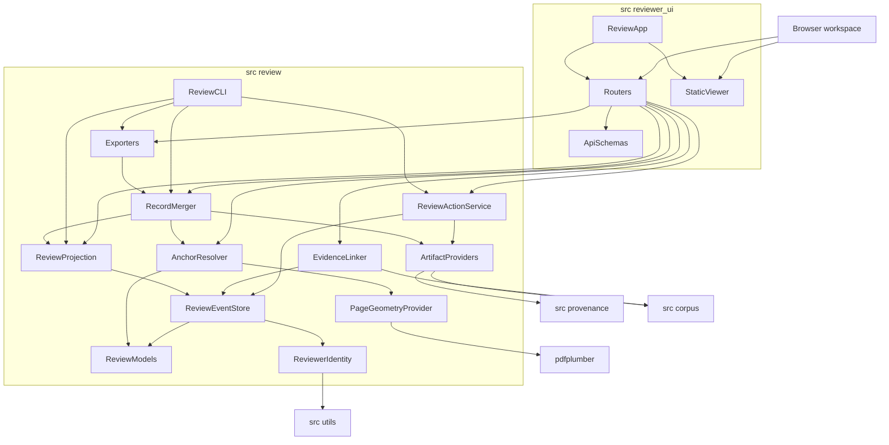
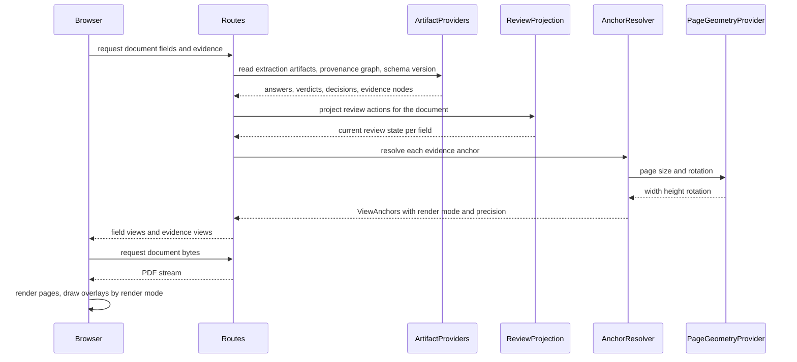
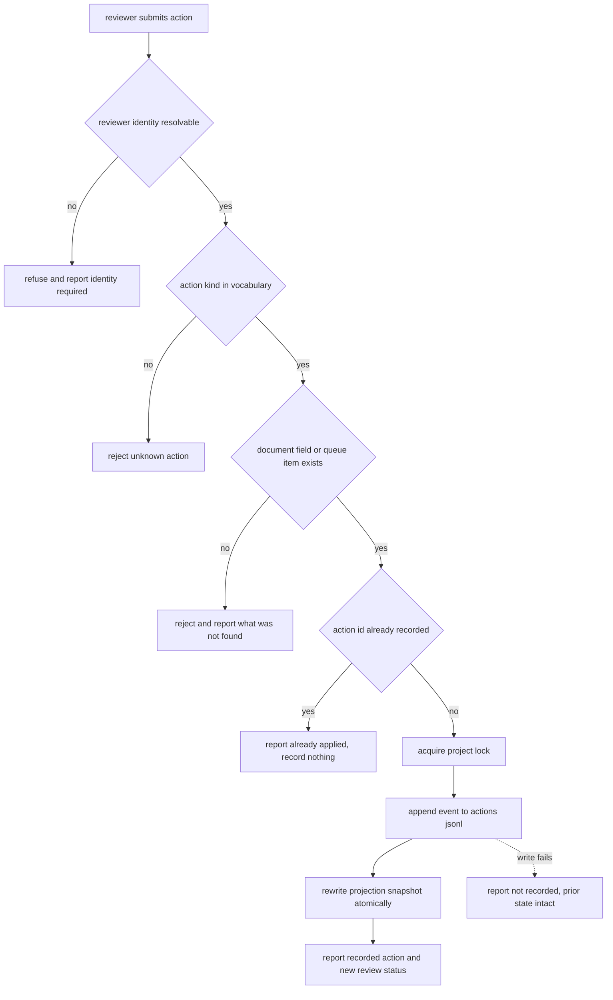
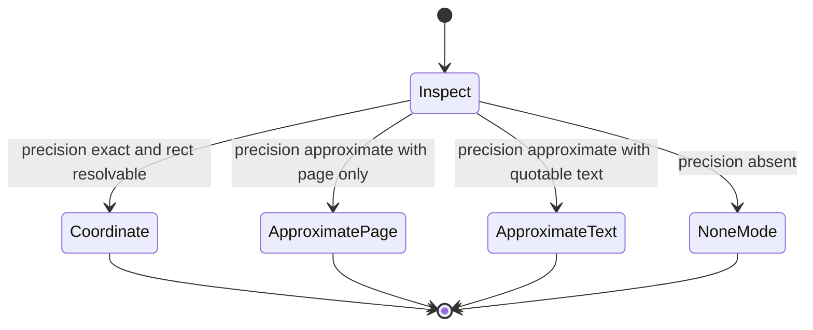
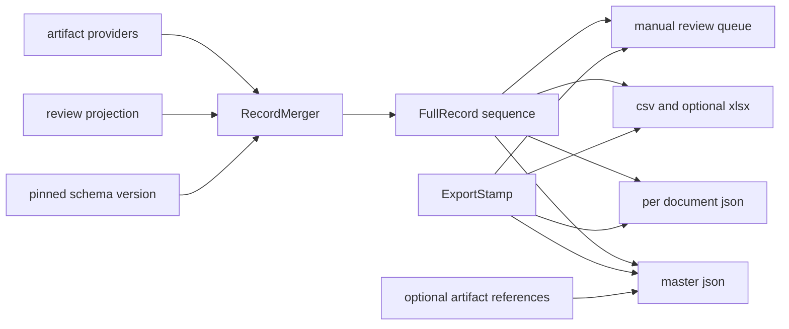
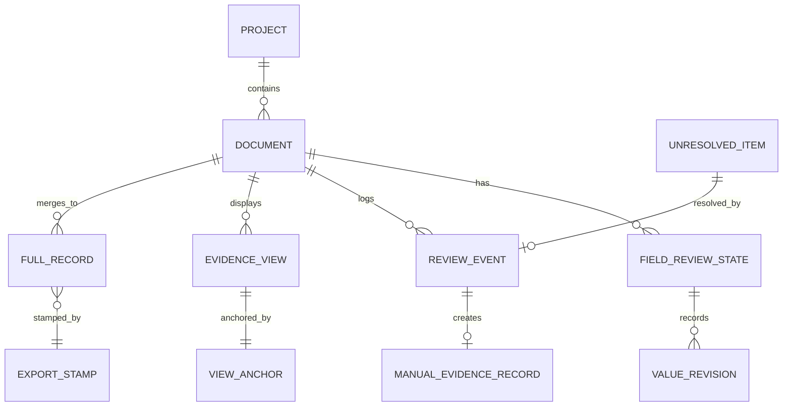

# Design Document — reviewer-ui

## Overview

**Purpose**: This feature gives human reviewers the surface they currently lack. It introduces two packages: `src/review/`, a headless review domain that owns the reviewer identity model, the append-only review action log and its projection, anchor-to-view resolution, manual and unresolved-evidence linking, the final merger from compact agent output to full records, and every exporter; and `src/reviewer_ui/`, a thin local web adapter that serves a browser workspace over that domain.

**Users**: evidence-synthesis reviewers verifying extracted values against the source paper, and operators who need the merged records and exports without ever opening a browser. The two audiences are served by the same domain package — the browser is one client of it, the command line is another.

**Impact**: today the only way to review an extracted value is to open `outputs/run_<ts>/<paper>.extracted.json` in a text editor and search the PDF by hand, and the only export is `csv_exporter.py`'s `field_name` → `extracted_value` flattening. This design adds the first browser-facing dependency stack in the repository, confined behind a new optional extra, and adds a merger and export layer that carries evidence, anchors, uncertainty, and review state. The extraction pipeline, the quality-control stages, `src/artifact_generation/`, and every existing artifact are **unmodified**.

### Goals

- A reviewer can open a document, see its evidence highlighted on the page, and accept, edit, reject, mark not reported, add evidence, or request re-extraction — by mouse or by keyboard.
- Every human action is attributed, timestamped, append-only, and replayable with the browser absent.
- The original model output survives every human correction.
- Approximate anchoring is rendered as approximate, never as pixel-accurate anchoring.
- The merger and the exporters run headlessly, with no web runtime and no display server installed.

### Non-Goals

- Producing or re-deriving evidence anchors, coordinates, or annotation artifacts. `src/artifact_generation/w3c_annotation.py` remains the sole producer; neither package here imports it.
- Defining evidence node identity, claim records, derivation records, or the provenance graph — `provenance-core`.
- Computing agreement statistics, cost figures, parser risk, verification verdicts, or adjudication outcomes — they are read and displayed as recorded.
- Running agents. "Request re-extraction" enqueues a request and never executes it.
- Authentication, authorisation, multi-tenancy, hosted deployment, live multi-reviewer collaboration, and concurrent-editor conflict resolution.
- Deciding what a viewer may see. Disclosure and redaction are decided by the privacy specs and rendered here.

## Boundary Commitments

### This Spec Owns

- The **reviewer identity model**: the reviewer identifier, the configured anonymized identifier, its project-scoped salt, and the rule that no action is recorded without an identity.
- The **review action vocabulary** (`ActionKind`), the **review status vocabulary**, the **`ReviewEvent` record**, the append-only action log (`<project>/review/actions.jsonl`), its pure projection to current review state, and the write-through projection snapshot. **This spec is the sole owner of all five**; no other spec defines, emits, or re-keys them.
- **Original-versus-edited preservation** and the full per-field edit history.
- **Anchor-to-view resolution**: converting a provenance `SourceAnchor` into a `ViewAnchor` carrying a render mode, a fractional rectangle, and the precision as supplied.
- **Manual evidence records** created by a reviewer, and the **interactive resolution** of items in the corpus unresolved-evidence queue (multiagent R20.6).
- The **re-extraction request queue** as recorded data.
- The **merger** from compact agent output plus schema version plus review state to `FullRecord`, and every **exporter** over that sequence: per-document JSON, master JSON, CSV, Excel, manual-review queue.
- The **export stamp** carrying schema version, model identities, parser identities, and pipeline configuration, taken verbatim from run records.
- The **local HTTP contract** and the static browser workspace, including highlight rendering, the inspection panel, the status timeline, filtering, and keyboard shortcuts.
- The `review` configuration block, the `ui` optional dependency extra, and the `src/review` / `src/reviewer_ui` dependency-direction rules.

### Out of Boundary

- Any annotation artifact. Manual and newly linked evidence is recorded as a **location-resolved evidence record**, structurally a candidate for the existing sole producer, never as JSON-LD.
- Evidence node identity, anchors, anchor precision, completeness, and validation findings — read from `provenance-core`, never computed or adjusted.
- Values, confidence, verification verdicts, adjudication outcomes, decision rules, quality-control issue codes, parser risk, and per-field decision records — read from the published `multiagent-extraction` artifacts, never recomputed or reinterpreted.
- Projects, admitted documents, document status vocabulary and transitions, status history, schema versions and their field definitions, imported-evidence origin metadata, and the unresolved-queue record shape — owned by `corpus-and-schema-builder`. This spec resolves and discards queue items through that package's service; it does not define the queue.
- `cost_report.json` and `run_manifest.json` content — owned by `cost-and-run-reporting`; rendered and referenced here only.
- The audit package format — `provenance-audit-export`.
- Agreement statistics — `agreement-statistics`.
- **Review timing, correction burden, time-saved, and usability metrics — `evaluation-harness`.** That spec derives its own `ReviewTimingEvent` from this spec's action log through an adapter it owns; it reconstructs interval timing from this spec's instant-stamped records and projects `ActionKind` onto its own narrower decision vocabulary. This spec emits no `ReviewTimingEvent`, records no start/end interval, records no session identifier, and records no usability rating. It is not required to adopt any shape `evaluation-harness` defines, and changes here are adapted to there, not the reverse — see the ownership split table in `evaluation-harness/design.md`.
- `src/pipeline/`, `src/quality_control/`, `src/pdf_extractor/`, `src/agents/`, `src/text_processing/`, and `src/artifact_generation/` are not modified by this spec.
- The existing `csv_exporter.py` is neither extended nor replaced; it keeps its current callers.

### Allowed Dependencies

- `src/review/` may import `src/utils/`, `src/provenance/`, `src/corpus/`, and the standard library. Nothing else.
- `src/reviewer_ui/` may import `src/review/`, `src/utils/`, `fastapi`, `uvicorn`, and the standard library. It may **not** import `provenance` or `corpus` directly; all domain access goes through `review`.
- `fastapi` and `uvicorn` are a new **optional** extra `ui`. `openpyxl` is the existing optional `imports` extra, lazily imported inside the exporter function body.
- Forbidden in both directions: `review` and `reviewer_ui` must not import `pipeline`, `quality_control`, `pdf_extractor`, `agents`, `text_processing`, or `artifact_generation`; and `pipeline`, `quality_control`, `pdf_extractor`, `agents`, `text_processing`, `corpus`, and `provenance` must not import `review` or `reviewer_ui`.
- No client package manager, no bundler, no lockfile, no runtime network access.

### Revalidation Triggers

- Any change to the published `multiagent-extraction` artifact shapes (`decisions.json`, `verdicts.json`, `verifications.json`, `answers.json`) or their paths — breaks `FileExtractionResultProvider`.
- Any change to `SourceAnchor`, `AnchorPrecision`, or `EvidenceNode.node_id` composition — breaks `AnchorResolver` and every evidence reference in `FullRecord`.
- Any change to the corpus status vocabulary, the `UnresolvedItem` shape, `AnnotationCandidate`, or `ExtractionField` — breaks the timeline, the linking surface, and the merger's field expansion.
- Any change to the `ReviewEvent` shape, the action vocabulary, or the review status vocabulary — breaks every recorded log, and breaks `evaluation-harness`'s `ReviewActionLogAdapter`, which reads `action_id`, `sequence`, `recorded_at`, `reviewer.reviewer_id`, `kind`, `target_kind`, `document_id`, `field_index`, `artifact_key`, and `schema_version_id` to reconstruct review timing. Adding an `ActionKind` member is specifically breaking: that adapter's projection table treats an unmapped kind as a hard error. Notify the consumer; this spec does not change to suit it.
- Any change to `FullRecord` or `ExportStamp` — breaks every downstream consumer of the exports.
- Promoting `fastapi`/`uvicorn` from the optional extra to a required dependency — violates Requirement 1.3.
- A vendored PDF.js version bump.

## Architecture

### Existing Architecture Analysis

| Existing element | Constraint it imposes | How this design responds |
|---|---|---|
| No web framework, no HTTP server, no static assets, no client toolchain anywhere in the repository | Every layer of the interface stack is a first | Stack chosen explicitly in `research.md` Decision 1; confined to one package behind one optional extra |
| PyMuPDF is AGPL and excluded from the default install (`pyproject.toml` `ocr` extra) | Server-side page rasterization is unavailable in the default install and undesirable in a browser-facing path | Rendering happens client-side in PDF.js (Apache-2.0); the server streams bytes and geometry only |
| `src/artifact_generation/w3c_annotation.py` documents itself as the only place annotation records are constructed | A second producer would contradict the module and the steering rules | Neither package imports `artifact_generation`; enforced by AST test |
| `tests/test_dependency_directions.py` enforces package edges by AST over `FORBIDDEN_PAIRS` | New package edges must be declared and tested | Fourteen new pairs plus an internal-direction test per package |
| `_parse_coords` in `evidence_index.py` yields `page` (1-based) and `[x, y, w, h]` in PDF points, top-left origin, first coordinate group only | Highlights are absolute-point rectangles that may cover only a span's first line | `PageGeometryProvider` converts to fractional rectangles; the first-box limitation is disclosed, not compensated for |
| `pdfplumber` is a core dependency; `fitz` is not | Page geometry must come from `pdfplumber` | `PageGeometryProvider` reads `page.width`, `page.height`, and rotation only — no text extraction, no rasterization |
| `corpus` owns the project directory and its lock/atomic-write patterns | A second persistence idiom would fracture the repository | Review records live in a `review/` subdirectory of the project directory and reuse the corpus lock and atomic-write helpers |
| `multiagent-extraction` writes plain JSON artifacts "queryable without the pipeline" | The workspace can read results without importing `pipeline` | `FileExtractionResultProvider` parses those artifacts through a `Protocol` |
| Config rejects unregistered top-level YAML keys (`_ALL_KNOWN_TOP_LEVEL_KEYS`) | A `review:` block breaks config loading unless registered | `review` registered; `load_review_config()` added |

### Architecture Pattern & Boundary Map

Selected pattern: **headless domain package with a thin adapter shell**. The domain knows nothing about HTTP; the adapter knows nothing about storage. The browser is a rendering client, not a source of truth.



**Architecture Integration**

- **Dependency direction inside `src/review/`** (imports flow strictly left to right, never upward): `errors` → `models` → `identity` → `geometry` → `anchors` → `sources` → `store` → `projection` → `actions` → `linking` → `merger` → `export.*` → `cli` → `__main__`. Inside `src/reviewer_ui/`: `schemas` → `deps` → `routes.*` → `app` → `__main__`.
- **Domain boundaries**: identity and storage (`identity`, `store`, `projection`), presentation geometry (`geometry`, `anchors`), upstream ingestion (`sources`), command handling (`actions`, `linking`), and output production (`merger`, `export`). These five are the parallel-safe task seams named in the brief.
- **Existing patterns preserved**: all shared dataclasses in one `models.py` per package (the `quality_control/models.py` convention); frozen dataclasses with `Literal` vocabularies; explicit config passing with no module-level mutation; optional dependencies imported inside function bodies; atomic temp-file writes plus a project lock; all logging through `utils.logging_utils.get_logger`, never `print`.
- **New components rationale**: each module below maps to exactly one requirement group. Three candidate components were removed during synthesis (a projection cache boundary, a pluggable highlight renderer, a live-update channel) and are recorded as rejected in `research.md`.
- **Steering compliance**: `review` registered in `_ALL_KNOWN_TOP_LEVEL_KEYS`; no new **required** runtime dependency; dependency-direction rules extended and tested; no PHI in any fixture or bundled sample.

> ### NOTE (informational — recorded, not acted on): identified decomposition seam
>
> **Status: not a decision. This spec is NOT split. Escalated to the user as a roadmap-level question.** Recorded here so the analysis is not lost if the question is revisited.
>
> A cross-spec review judged this spec the one genuine decomposition outlier in the roadmap: it carries **two independent seams**, not one feature.
>
> | Half | Contents | Dependencies | Nature |
> |---|---|---|---|
> | `src/review/` | merger, five exporters, reviewer identity, `ReviewEvent` + action log + projection, anchor-to-view resolution, R20.6 unresolved-evidence linking | `provenance`, `corpus`, `utils`, stdlib only | headless domain, no framework commitment |
> | `src/reviewer_ui/` | FastAPI + uvicorn + vendored PDF.js, HTTP contract, static browser workspace | `review` + the `ui` extra | the repository's **first web stack** |
>
> **Where the seam falls.** Exactly at `ReviewCLI` → `ReviewApp`. The interface between the halves is already clean and already tested: `review` never imports `reviewer_ui`, the domain knows nothing about HTTP, and the dependency-direction test asserts it. This design's own task list already splits at that same boundary, and the CLI is a first-class client of the domain rather than a test harness for it.
>
> **The argument for splitting.** The merger, the exporters, the action log, and the R20.6 linking are the parts other specs depend on — `evaluation-harness` reads the action log, and the exports are the deliverable operators actually need. None of them requires a browser. Splitting would let all of that ship and be validated **before any framework commitment is made**, which makes the FastAPI/uvicorn/PDF.js choice reversible rather than load-bearing from day one. It would also keep the repository's first web dependency isolated in a spec that can be deferred, re-scoped, or replaced without touching validated domain code.
>
> **The argument against.** The two halves are approved as one spec with one requirements set and one traceability matrix; splitting now would re-open requirements and tasks that are already agreed, and the seam being clean is itself evidence the current structure is not causing harm.
>
> **If the escalation resolves as "split"**: the boundary above is the split line verbatim, no interface redesign is required, and this spec's Boundary Commitments, dependency rules, and task list already partition along it.

### Technology Stack

| Layer | Choice / Version | Role in Feature | Notes |
|-------|------------------|-----------------|-------|
| Client rendering | PDF.js (vendored prebuilt, Apache-2.0) | Renders PDF pages and the text layer in the browser | No package manager, no bundler; version pinned in `VENDOR.md` |
| Client application | Hand-written ES modules + CSS, no build step | Highlight overlay, inspection panel, timeline, filters, shortcuts | Served as static files; no runtime network access |
| HTTP server | `fastapi` >= 0.115, `uvicorn` >= 0.30 — **new optional extra `ui`** | Typed JSON API and static file serving, loopback-bound | Imported only under `src/reviewer_ui/` |
| Domain | Python 3.12 frozen dataclasses + `typing.Protocol` | Review domain, merger, exporters | `from __future__ import annotations` throughout |
| Page geometry | `pdfplumber` >= 0.10 (core dep) | Page width, height, rotation for fractional-rectangle conversion | No rasterization, no text extraction |
| Persistence | JSONL append + atomic JSON snapshot on local disk | Action log, projection snapshot, manual evidence, re-extraction queue | Reuses the corpus lock and atomic-write helpers |
| Spreadsheet export | `openpyxl` >= 3.1 — existing optional extra `imports` | `.xlsx` review table | Lazy import inside the exporter function |
| Upstream ingestion | `src/provenance/` reader, `src/corpus/` services, published multiagent JSON | Anchors, projects/status/schema/queue, values and verdicts | Read-only in every case |
| Tests | pytest + Hypothesis | Unit, projection-property, boundary, and API tests | `fastapi.testclient` used only under `tests/src/reviewer_ui/` |

## File Structure Plan

### Directory Structure

```
src/review/
├── __init__.py              # public API re-exports only
├── errors.py                # ReviewError hierarchy + exit-code mapping
├── models.py                # ALL shared dataclasses and Literal vocabularies for this package
├── config.py                # ReviewConfig resolution over utils.config_utils
├── identity.py              # ReviewerIdentity: resolution, anonymization, project salt
├── geometry.py              # PageGeometryProvider: pdfplumber page dims/rotation, cached
├── anchors.py               # AnchorResolver: SourceAnchor -> ViewAnchor
├── sources.py               # Provider protocols, file-backed implementations, ArtifactProviderSet
├── store.py                 # ReviewEventStore: append-only JSONL, lock, snapshot IO
├── projection.py            # project_review(events) -> ReviewProjection (pure)
├── actions.py               # ReviewActionService: validate, attribute, record
├── linking.py               # EvidenceLinker: manual evidence + unresolved-queue resolution
├── merger.py                # RecordMerger: compact answers + schema + review -> FullRecord
├── export/
│   ├── __init__.py
│   ├── stamp.py             # ExportStamp assembly from run records
│   ├── json_export.py       # per-document JSON + master JSON
│   ├── table_export.py      # CSV always; Excel via lazy openpyxl
│   ├── queue_export.py      # manual-review queue export
│   └── artifacts.py         # optional artifact discovery and referencing
├── cli.py                   # argparse subcommand tree; error-to-exit-code mapping
└── __main__.py              # python -m review

src/reviewer_ui/
├── __init__.py              # create_app re-export only
├── deps.py                  # request-scoped construction of review services
├── schemas.py               # Pydantic DTOs for every request and response
├── views.py                 # FieldViewBuilder: compose FieldView from domain records
├── app.py                   # create_app(): routers, static mount, error envelope, bind guard
├── routes/
│   ├── __init__.py
│   ├── projects.py          # project list, corpus status rollup, artifacts
│   ├── documents.py         # document list/detail, status history, PDF byte streaming
│   ├── fields.py            # field views, filters, per-field history
│   ├── evidence.py          # evidence views and ViewAnchors for a document
│   ├── actions.py           # review action submission
│   ├── queue.py             # unresolved evidence queue: list, link, discard
│   ├── exports.py           # export triggering
│   └── meta.py              # keyboard shortcut map, workspace disclaimers
├── static/
│   ├── index.html
│   ├── app/
│   │   ├── main.js          # bootstrap and routing between views
│   │   ├── api.js           # fetch wrappers over the JSON API
│   │   ├── state.js         # client-side view state, no authority
│   │   ├── viewer.js        # PDF.js glue: page rendering and text layer
│   │   ├── highlights.js    # overlay drawing per ViewAnchor render mode
│   │   ├── panel.js         # inspection panel and uncertainty display
│   │   ├── timeline.js      # document status timeline and corpus rollup
│   │   ├── queue.js         # unresolved evidence linking surface
│   │   └── shortcuts.js     # keyboard shortcut binding and help overlay
│   ├── styles.css
│   └── vendor/pdfjs/        # vendored prebuilt PDF.js + LICENSE + VENDOR.md
└── __main__.py              # UiLauncher: run_server(), bind guard, address reporting
```

Review records inside an existing project directory (this spec adds only the `review/` subtree):

```
<projects_root>/<project_id>/review/
├── actions.jsonl            # append-only review event log (authoritative)
├── projection.json          # write-through derived snapshot (regenerable, never authoritative)
├── identity_salt.json       # project-scoped anonymization salt
├── manual_evidence.json     # human-created location-resolved evidence records
├── reextraction_queue.json  # recorded re-extraction requests
└── exports/                 # written export artifacts
```

```
tests/src/review/            # one module per source module, mirroring src/
tests/src/reviewer_ui/       # route tests via fastapi.testclient; skipped when fastapi absent
tests/steering/test_review_internal_direction.py
```

### Modified Files

- `src/utils/config_utils.py` — register `"review"` in `_ALL_KNOWN_TOP_LEVEL_KEYS`; add `load_review_config()` with env > yaml > default resolution.
- `src/utils/path_utils.py` — add a resolver for the project review directory and the export directory.
- `configs/config.yaml` — add the `review:` block with commented defaults.
- `pyproject.toml` — add the `ui = ["fastapi>=0.115", "uvicorn>=0.30"]` optional-dependency extra.
- `requirements.txt` — add a commented optional block for the `ui` extra beside the existing optional entries.
- `tests/test_dependency_directions.py` — append the fourteen new `FORBIDDEN_PAIRS` entries plus one named test per pair.

## System Flows

### Opening a document for review



Decisions not visible in the diagram: an artifact that cannot be read yields an `unavailable` entry naming the artifact rather than a default value (1.6, 9.6); anchors are rendered exactly as supplied and precision is never upgraded (2.5); and approximate text-search placement happens **in the browser text layer only**, is never persisted, and never returns to the server as an anchor.

### Recording a review action



The append is the commit point. The snapshot is derived: if the snapshot write fails after a successful append, the action **is** recorded and the snapshot is rebuilt from the log on next read. The reverse order would allow a reported action that was never durable.

### Highlight render mode selection



`Coordinate` degrades to `ApproximatePage` when the page geometry is unreadable or the page is rotated in a way the fractional projection cannot represent, and the reason travels on `ViewAnchor.geometry_note`. A degraded anchor is rendered and labelled as approximate; it is never rendered as exact (2.3). `NoneMode` renders no overlay and reports `missing_anchor_kinds` (2.4).

### Merge and export



The merger runs once per document; every exporter is a formatter over the same `FullRecord` sequence, which is why they cannot disagree with one another.

## Requirements Traceability

| Requirement | Summary | Components | Interfaces | Flows |
|-------------|---------|------------|------------|-------|
| 1.1, 1.2 | Local-only serving; loopback default with explicit opt-in | `ReviewApp`, `UiLauncher`, `ReviewConfig` | `create_app`, `run_server`, `load_review_config` | — |
| 1.3, 1.4 | Headless core unaffected; missing runtime reported by name | `ReviewCLI`, `UiLauncher`, `RecordMerger`, `Exporters` | `python -m review`, `python -m reviewer_ui` | — |
| 1.5 | Project-scoped operation | `ReviewApp`, `ArtifactProviders` | `create_app(project_id)` | Opening a document |
| 1.6 | Missing upstream artifact named, not silently completed | `ArtifactProviders`, `FieldView` | `ArtifactAvailability` | Opening a document |
| 1.7 | No network access needed to render or record | `StaticViewer`, `ReviewApp` | vendored assets, local file reads | — |
| 2.1 | Coordinate-derived highlight | `AnchorResolver`, `PageGeometryProvider`, `HighlightOverlay` | `resolve_anchor`, `ViewAnchor` | Highlight render mode |
| 2.2 | Approximate page or text-search fallback | `AnchorResolver`, `HighlightOverlay`, `PdfViewer` | `ViewAnchor.mode`, `search_text` | Highlight render mode |
| 2.3 | Approximate marked distinctly, never pixel-accurate | `HighlightOverlay`, `InspectionPanel` | `ViewAnchor.precision` | Highlight render mode |
| 2.4 | Anchor-absence reported, no invented highlight | `AnchorResolver`, `InspectionPanel` | `ViewAnchor.missing_anchor_kinds` | Highlight render mode |
| 2.5 | Anchors consumed, never recomputed | `AnchorResolver`, `ProvenanceArtifactProvider` | `read_graph` consumption | Opening a document |
| 2.6 | Missing document file degrades to values and text | `DocumentRoutes`, `PdfViewer` | document stream endpoint | Opening a document |
| 2.7 | Overlapping evidence individually selectable | `HighlightOverlay` | per-evidence overlay elements | — |
| 3.1, 3.2 | Field-to-evidence navigation across multiple locations | `PdfViewer`, `EvidenceRoutes` | evidence endpoint, `ViewAnchor` | Opening a document |
| 3.3 | Inspection panel content on highlight selection | `InspectionPanel`, `FieldRoutes` | `FieldView` | Opening a document |
| 3.4 | Field with no navigable evidence reports the reason | `InspectionPanel`, `AnchorResolver` | `FieldView.evidence_note` | — |
| 3.5, 3.6 | Keyboard shortcuts and in-workspace shortcut help | `KeyboardShortcuts`, `MetaRoutes` | shortcut map endpoint | — |
| 3.7 | Filtering with excluded count | `FieldRoutes`, `InspectionPanel` | field query parameters | — |
| 4.1, 4.8 | Closed action vocabulary; review status updated | `ReviewActionService`, `ReviewModels` | `record_action`, `ReviewActionKind` | Recording an action |
| 4.2, 4.3, 4.4 | Edit, reject, mark-not-reported payload rules | `ReviewActionService` | action payload validation | Recording an action |
| 4.5 | Re-extraction enqueued, never executed | `ReviewActionService` | `reextraction_queue.json` | Recording an action |
| 4.6 | Unknown target rejected, state unchanged | `ReviewActionService`, `ArtifactProviders` | target existence check | Recording an action |
| 4.7 | Idempotent action identifiers | `ReviewActionService`, `ReviewEventStore` | `action_id` deduplication | Recording an action |
| 5.1, 5.2, 5.3 | Original preserved; nothing overwritten; every intermediate retained | `ReviewEventStore`, `ReviewProjection` | append-only log, `FieldReviewState` | Recording an action |
| 5.4 | Field history reported | `ReviewProjection`, `FieldRoutes` | `field_history` | — |
| 5.5 | Reversion is a further action | `ReviewActionService` | `edit` with `reverts_action_id` | Recording an action |
| 5.6 | Both values shown and labelled | `InspectionPanel` | `FieldView.original_model_value` | — |
| 6.1, 6.2 | Manual evidence linked and origin-marked | `EvidenceLinker`, `ReviewModels` | `add_manual_evidence` | — |
| 6.3 | Unresolved queue presented with full context | `EvidenceLinker`, `QueueRoutes`, `QueueSurface` | `list_unresolved` | — |
| 6.4, 6.5 | Human resolution and discard recorded, never deleted | `EvidenceLinker` | `link_unresolved`, `discard_unresolved` | Recording an action |
| 6.6 | Location-resolved records only, no annotation artifact | `EvidenceLinker` | `ManualEvidenceRecord` | — |
| 6.7 | Invalid location rejected | `EvidenceLinker`, `PageGeometryProvider` | location validation | — |
| 7.1, 7.5 | Attributed, timestamped actions in one time representation | `ReviewerIdentity`, `ReviewEventStore` | `ReviewEvent` | Recording an action |
| 7.2, 7.3 | Configured anonymized identifier, stable across sessions | `ReviewerIdentity` | `resolve_reviewer`, `identity_salt.json` | — |
| 7.4 | No identity means no recorded action | `ReviewerIdentity`, `ReviewActionService` | `ReviewerIdentityRequiredError` | Recording an action |
| 7.6 | No credentials in records or exports | `ReviewEventStore`, `ExportStamp` | field allowlist | — |
| 8.1, 8.2 | Append-only log; replay reproduces displayed state | `ReviewEventStore`, `ReviewProjection` | `append`, `project_review` | Recording an action |
| 8.3 | Headless CLI for state, history, queue | `ReviewCLI` | `python -m review` subcommands | — |
| 8.4 | Uninterpretable event skipped and reported | `ReviewProjection` | `ProjectionAnomaly` | — |
| 8.5 | Concurrent writes cannot corrupt | `ReviewEventStore` | corpus `ProjectLock` reuse | Recording an action |
| 8.6, 8.7 | Records carry artifact and schema version; superseded records reported | `ReviewEventStore`, `ReviewProjection`, `RecordMerger` | `ReviewEvent.artifact_key` | Merge and export |
| 9.1, 9.4, 9.5 | Confidence, verification, parser risk, review state, criticality, manual-review state | `FieldViewBuilder`, `InspectionPanel` | `FieldView` | Opening a document |
| 9.2 | Model / imported / human evidence visually distinct | `HighlightOverlay`, `InspectionPanel`, `ReviewModels` | `EvidenceOrigin` | — |
| 9.3 | Anchor precision displayed | `InspectionPanel`, `AnchorResolver` | `ViewAnchor.precision` | Highlight render mode |
| 9.6 | Unavailable signals shown as unavailable | `FieldViewBuilder`, `ArtifactProviders` | `FieldView.unavailable` | Opening a document |
| 9.7 | Decision inputs shown as recorded | `FieldViewBuilder`, `ExtractionResultProvider` | `FieldView.decision` | Opening a document |
| 10.1, 10.6 | Document list with status and review progress | `TimelineView`, `DocumentRoutes`, `ReviewProjection` | `document_summaries` | — |
| 10.2, 10.4 | Chronological status history with failure reasons | `CorpusArtifactProvider`, `TimelineView` | `document_history` | — |
| 10.3 | Corpus rollup with failed and flagged identifiers | `CorpusArtifactProvider`, `ProjectRoutes` | `corpus_status` | — |
| 10.5 | Timeline derived, no vocabulary of its own | `CorpusArtifactProvider` | read-only consumption | — |
| 11.1, 11.2 | Compact output expanded to full records with required attributes | `RecordMerger`, `ReviewModels` | `merge_document`, `FullRecord` | Merge and export |
| 11.3 | Original and human value both carried | `RecordMerger`, `ReviewProjection` | `FullRecord.original_model_value` | Merge and export |
| 11.4 | Anchor precision carried, location not omitted | `RecordMerger`, `AnchorResolver` | `FullRecord.anchor_precisions` | Merge and export |
| 11.5, 11.6 | Unmapped fields and missing answers recorded, expansion continues | `RecordMerger` | `FullRecord.status_note` | Merge and export |
| 11.7 | Merger callable with no web runtime | `RecordMerger`, `ReviewCLI` | import isolation | — |
| 11.8 | Deterministic output | `RecordMerger` | documented ordering | Merge and export |
| 12.1, 12.2 | Per-document JSON and master JSON | `JsonExporter` | `export_document`, `export_master` | Merge and export |
| 12.3, 12.4, 12.5 | CSV always; Excel optional and named when absent | `TableExporter` | `export_table` | Merge and export |
| 12.6 | Manual-review queue export with reasons | `QueueExporter` | `export_manual_review_queue` | Merge and export |
| 12.7 | Failed export leaves prior file intact and reports | `Exporters`, `ReviewErrors` | atomic write, `ExportFailure` | Merge and export |
| 12.8 | Export callable headlessly | `ReviewCLI` | `review export` subcommands | — |
| 13.1, 13.3 | Optional artifacts presented or reported unavailable | `ArtifactCatalog`, `ProjectRoutes` | `discover`, `read_bytes` | — |
| 13.2, 13.7 | Artifacts presented as produced; referenced not regenerated | `ArtifactCatalog` | `ArtifactReference` | — |
| 13.4, 13.5, 13.6 | Export stamp taken from run records; unavailable recorded | `ExportStamp` | `build_stamp`, `StampedValue` | Merge and export |
| 14.1 | Per-document failure isolation | `RecordMerger`, `Exporters`, `ReviewApp` | `DocumentOutcome` | Merge and export |
| 14.2 | Unpersisted action not reported as recorded | `ReviewActionService`, `ReviewEventStore` | append-before-report ordering | Recording an action |
| 14.3, 14.4 | No truth or clinical claim; no synthesis generation | `MetaRoutes`, `InspectionPanel` | disclaimer payload | — |
| 14.5 | Disclosure rendered, never decided | `FieldViewBuilder` | pass-through of supplied labels | — |
| 14.6 | Rejections and failures logged as well as returned | all services | `utils.logging_utils` | — |
| 14.7 | No PHI, real patient data, or credentials in assets | test fixtures, bundled sample | fixture policy | — |

## Components and Interfaces

| Component | Domain/Layer | Intent | Req Coverage | Key Dependencies (P0/P1) | Contracts |
|-----------|--------------|--------|--------------|--------------------------|-----------|
| `ReviewModels` | Domain / definition | Single owner of every review dataclass and vocabulary | 4, 5, 6, 7, 9, 11 | none | State |
| `ReviewerIdentity` | Domain / definition | Resolve, anonymize, and require a reviewer identity | 7.1-7.5 | `utils.config_utils` (P0) | Service, State |
| `PageGeometryProvider` | Domain / geometry | Page width, height, rotation without rasterizing | 2.1, 6.7 | `pdfplumber` (P0) | Service |
| `AnchorResolver` | Domain / geometry | Provenance anchor to renderable `ViewAnchor` | 2.1-2.5, 9.3, 11.4 | `PageGeometryProvider` (P0), `ReviewModels` (P0) | Service |
| `ArtifactProviders` | Domain / ingestion | Read extraction, provenance, and corpus records; report what is missing | 1.5, 1.6, 9.6, 9.7, 10.2-10.5 | `provenance` (P0), `corpus` (P0) | Service |
| `ReviewEventStore` | Domain / persistence | Append-only action log, lock, snapshot IO | 5.1-5.3, 7.1, 8.1, 8.5, 8.6, 14.2 | `corpus` locking (P0), `ReviewModels` (P0) | Service, State |
| `ReviewProjection` | Domain / persistence | Pure projection of events to current review state | 5.3, 5.4, 8.2, 8.4, 8.7, 10.6 | `ReviewEventStore` (P0) | Service |
| `ReviewActionService` | Domain / command | Validate, attribute, and record review actions | 4.1-4.8, 5.5, 7.4, 14.2 | `ReviewEventStore` (P0), `ReviewerIdentity` (P0), `ArtifactProviders` (P1) | Service |
| `EvidenceLinker` | Domain / command | Manual evidence and unresolved-queue resolution | 6.1-6.7 | `corpus` queue (P0), `ReviewEventStore` (P0) | Service |
| `RecordMerger` | Domain / output | Expand compact answers into full records | 11.1-11.8, 8.7, 14.1 | `ArtifactProviders` (P0), `ReviewProjection` (P0), `AnchorResolver` (P0) | Service, Batch |
| `Exporters` | Domain / output | Format full records into JSON, tables, and queues | 12.1-12.8, 14.1 | `RecordMerger` (P0), `ExportStamp` (P0), `openpyxl` optional (P1) | Batch |
| `ExportStamp` | Domain / output | Stamp exports with run identities as recorded | 13.4-13.6, 7.6 | `ArtifactProviders` (P0) | Service, State |
| `ArtifactCatalog` | Domain / output | Discover, reference, and serve optional run artifacts unchanged | 13.1, 13.2, 13.3, 13.7 | `utils.path_utils` (P1), `ArtifactProviders` (P1) | Service |
| `ReviewCLI` | Domain / interface | Headless entry point with mapped exit codes | 1.3, 8.3, 11.7, 12.8 | all domain services (P0) | Service |
| `ReviewApp` | Web / adapter | FastAPI application, routers, static mount, bind guard | 1.1, 1.2, 1.5, 1.7, 14.1 | `fastapi` (P0), `review` (P0) | API |
| `ApiSchemas` | Web / adapter | Typed request and response DTOs | 3.3, 4.1, 9.1, 13.1 | `fastapi` (P0) | API |
| `FieldViewBuilder` | Web / adapter | Assemble a field's values, uncertainty, and decision inputs | 3.3, 3.4, 9.1-9.7, 14.5 | `ArtifactProviders` (P0), `ReviewProjection` (P0) | Service |
| `PdfViewer` | Client | Render pages and the text layer | 2.1, 2.2, 2.6, 3.1, 3.2 | vendored PDF.js (P0) | State |
| `HighlightOverlay` | Client | Draw and select highlights by render mode | 2.1-2.4, 2.7, 9.2 | `PdfViewer` (P0) | State |
| `InspectionPanel` | Client | Field detail, uncertainty, origin, both values | 3.3, 3.4, 5.6, 9.1-9.7, 14.3 | `ApiSchemas` (P0) | State |
| `TimelineView` | Client | Document list, status timeline, corpus rollup | 10.1-10.6 | `ApiSchemas` (P0) | State |
| `QueueSurface` | Client | Unresolved evidence linking surface | 6.3-6.5 | `ApiSchemas` (P0) | State |
| `KeyboardShortcuts` | Client | Shortcut binding and discoverable help | 3.5, 3.6 | `InspectionPanel` (P0) | State |
| `UiLauncher` | Web / interface | Start the server, report the address, guard the bind | 1.1, 1.2, 1.4 | `uvicorn` (P0) | Service |

### Domain — Definition Layer

#### ReviewModels

| Field | Detail |
|-------|--------|
| Intent | Single owner of every review record type and closed vocabulary |
| Requirements | 4.1, 4.8, 5.1, 6.2, 7.1, 9.2, 9.3, 11.2 |

**Responsibilities & Constraints**
- Every record is `@dataclass(frozen=True)`; every collection field is a tuple, so records are hashable and safe to share across request handlers.
- Vocabularies are `Literal` unions — closed by design. Adding a member is a Revalidation Trigger.
- No provenance, corpus, or multiagent type is redefined here. `SourceAnchor` and evidence identifiers come from `provenance`; `UnresolvedItem`, `DocumentStatus`, and `ExtractionField` come from `corpus`; extraction results arrive as review-local dataclasses built by `ArtifactProviders` from published JSON.
- `discard_evidence` targets a queue item rather than a field and is therefore not part of the field-action vocabulary constrained by 4.1; it is recorded in the same log with a queue target.
- A reversion is recorded as an `edit` carrying `reverts_action_id`, never as a deletion (5.5).

**Contracts**: State [x]

##### State Management

```python
ReviewActionKind = Literal["accept", "edit", "reject", "mark_not_reported",
                           "add_evidence", "link_evidence", "request_reextraction", "comment"]
QueueActionKind = Literal["discard_evidence"]
ActionKind = ReviewActionKind | QueueActionKind

ReviewStatus = Literal["unreviewed", "accepted", "edited", "rejected",
                       "not_reported", "reextraction_requested", "needs_attention"]
EvidenceOrigin = Literal["model", "imported", "human"]
AnchorRenderMode = Literal["coordinate", "approximate_page", "approximate_text", "none"]
AnchorPrecision = Literal["exact", "approximate", "absent"]   # mirrors provenance, never widened
TargetKind = Literal["field", "queue_item"]

@dataclass(frozen=True)
class ReviewerRef:
    reviewer_id: str                  # own id, or the anonymized id when configured
    anonymized: bool                  # (7.2)

@dataclass(frozen=True)
class ReviewEvent:
    """Owned solely by this spec. `evaluation-harness` reads this record to
    derive its own `ReviewTimingEvent`; that derivation adapts to this shape
    and this shape never adapts to it. Ten fields are load-bearing for that
    consumer — see the Revalidation Triggers."""
    action_id: str                    # caller-supplied idempotency key (4.7)
    sequence: int                     # assigned at append time, monotonic per project
    recorded_at: str                  # UTC ISO 8601 with offset (7.5)
    reviewer: ReviewerRef
    kind: ActionKind
    target_kind: TargetKind
    document_id: str | None
    field_index: int | None
    queue_item_id: str | None
    payload: Mapping[str, Any]        # kind-discriminated; see the action payload table
    comment: str | None
    reverts_action_id: str | None
    artifact_key: str | None          # extraction artifact reviewed against (8.6)
    schema_version_id: str | None     # schema version reviewed against (8.6)

@dataclass(frozen=True)
class ValueRevision:
    value: str | None
    reviewer: ReviewerRef
    recorded_at: str
    action_id: str
    reason: str | None

@dataclass(frozen=True)
class FieldReviewState:
    document_id: str
    field_index: int
    status: ReviewStatus
    original_model_value: str | None          # never mutated (5.1, 5.2)
    current_value: str | None
    revisions: tuple[ValueRevision, ...]      # (5.3, 5.4)
    manual_evidence_ids: tuple[str, ...]
    reextraction_requested: bool
    last_reviewer: ReviewerRef | None
    last_action_at: str | None
    comments: tuple[str, ...]
    superseded: bool                          # (8.7)

@dataclass(frozen=True)
class ProjectionAnomaly:
    sequence: int | None
    action_id: str | None
    reason: str                               # (8.4)

@dataclass(frozen=True)
class ReviewProjectionState:
    project_id: str
    fields: Mapping[tuple[str, int], FieldReviewState]
    queue_resolutions: Mapping[str, Mapping[str, Any]]
    reextraction_requests: tuple[Mapping[str, Any], ...]
    anomalies: tuple[ProjectionAnomaly, ...]
    last_sequence: int

@dataclass(frozen=True)
class ViewAnchor:
    mode: AnchorRenderMode
    precision: AnchorPrecision
    page_number: int | None                   # 1-based, as supplied
    rect: tuple[float, float, float, float] | None   # fractional, top-left origin
    search_text: str | None                   # for approximate_text placement (2.2)
    missing_anchor_kinds: tuple[str, ...]     # (2.4)
    geometry_note: str | None                 # degradation reason (2.3)

@dataclass(frozen=True)
class EvidenceView:
    evidence_id: str                          # provenance node id, verbatim
    local_id: str
    origin: EvidenceOrigin                    # (9.2)
    evidence_kind: str
    text: str
    anchor: ViewAnchor
    producing_backend: str | None
    cited_by_field_indices: tuple[int, ...]

@dataclass(frozen=True)
class ManualEvidenceRecord:
    evidence_id: str                          # "human:<document_id>#<digest>"
    document_id: str
    field_index: int
    text: str
    page_number: int | None
    char_span: tuple[int, int] | None
    paragraph_id: str | None
    note: str | None
    created_by: ReviewerRef
    created_at: str
    source_action_id: str

@dataclass(frozen=True)
class StampedValue:
    value: Any | None
    status: Literal["available", "unavailable"]
    reason: str | None

@dataclass(frozen=True)
class ExportStamp:
    run_id: StampedValue
    schema_version: StampedValue
    model_ids: StampedValue
    parser_versions: StampedValue
    pipeline_config: StampedValue
    generated_at: str
    exporter_version: str

@dataclass(frozen=True)
class FullRecord:
    document_id: str
    field_index: int
    field_name: str
    domain_group: str
    extracted_value: str | None
    current_value: str | None
    original_model_value: str | None
    is_human_edited: bool
    edited_by: ReviewerRef | None
    edited_at: str | None
    evidence_ids: tuple[str, ...]
    evidence_text: tuple[str, ...]
    evidence_origins: tuple[EvidenceOrigin, ...]
    page_numbers: tuple[int, ...]
    anchor_precisions: tuple[AnchorPrecision, ...]
    confidence: str | None
    verification_status: str | None
    review_status: ReviewStatus
    adjudication_outcome: str | None
    decision_rule: str | None
    qc_issue_codes: tuple[str, ...]
    parser_risk: str | None
    criticality: str | None
    provenance: Mapping[str, Any]             # run, source, claim ids and completeness
    unavailable: Mapping[str, str]            # signal -> reason (9.6, 13.6)
    status_note: str | None                   # unmapped / not_extracted reasons (11.5, 11.6)
```

Action payload contract, validated by `ReviewActionService`:

| Kind | Required payload | Resulting status |
|---|---|---|
| `accept` | — | `accepted` |
| `edit` | `value`, optional `reason`, optional `reverts_action_id` | `edited` |
| `reject` | `reason` | `rejected` |
| `mark_not_reported` | optional `reason` | `not_reported` |
| `add_evidence` | `text` plus at least one of `page_number`, `char_span`, `paragraph_id`, `note` | unchanged |
| `link_evidence` | `queue_item_id`, `document_id`, plus at least one location field | unchanged |
| `request_reextraction` | optional `reason` | `reextraction_requested` |
| `comment` | `comment` | unchanged |
| `discard_evidence` | `queue_item_id`, `reason` | not applicable |

**Implementation Notes**
- Validation: a test asserts every dataclass is frozen, every vocabulary round-trips through the serializer, and no field name collides with a `provenance` node field or a `corpus` record field.
- Risks: vocabulary growth pressure from `evaluation-harness`; mitigated by listing vocabulary additions as a Revalidation Trigger.

#### ReviewerIdentity

| Field | Detail |
|-------|--------|
| Intent | Resolve who is acting, anonymize when configured, and refuse to proceed without an identity |
| Requirements | 7.1, 7.2, 7.3, 7.4, 7.5 |

**Responsibilities & Constraints**
- Resolution order is `explicit argument` → `REVIEW_REVIEWER_ID` environment variable → `review.reviewer_id` configuration. No fallback to an operating-system user, a hostname, or a literal `"unknown"` (7.4).
- When `review.anonymize_reviewer` is true, the recorded identifier is `sha256(reviewer_id + project_salt).hexdigest()[:16]`, and `ReviewerRef.anonymized` is `True` (7.2, 7.3).
- The salt is generated once per project with `secrets.token_hex(16)` and stored in `review/identity_salt.json`; it is never regenerated, because regenerating it would break cross-session grouping.
- Timestamps are produced here in one representation — UTC ISO 8601 with an explicit `+00:00` offset — so every recorded action is comparable (7.5).
- This component is the documented boundary of the anonymization claim: it provides **pseudonymization**, not anonymity, and this design makes no compliance claim.

**Dependencies**
- Outbound: `utils.config_utils` (P0). External: `hashlib`, `secrets` (P2).

**Contracts**: Service [x] / State [x]

##### Service Interface

```python
class ReviewerIdentityRequiredError(ReviewError): ...

class ReviewerIdentity:
    def __init__(self, config: Mapping[str, Any], salt_path: Path) -> None: ...
    def resolve(self, reviewer_id: str | None = None) -> ReviewerRef: ...   # raises ReviewerIdentityRequiredError
    def now(self) -> str: ...                                               # UTC ISO 8601 with offset
```

- Preconditions: `salt_path`'s parent directory exists.
- Postconditions: `resolve` returns the same `ReviewerRef` for the same reviewer and project across processes.
- Invariants: no method returns a `ReviewerRef` with an empty `reviewer_id`.

**Implementation Notes**
- Validation: a test asserts the anonymized identifier is stable across two constructions and differs across two projects; a test asserts `resolve(None)` with no configuration raises rather than defaulting.
- Risks: a lost salt file makes prior pseudonyms ungroupable; the file is written atomically and never rewritten once present.

### Domain — Geometry Layer

#### PageGeometryProvider and AnchorResolver

| Field | Detail |
|-------|--------|
| Intent | Turn a provenance anchor into a renderable, resolution-independent view anchor without touching the document's content |
| Requirements | 2.1, 2.2, 2.3, 2.4, 2.5, 6.7, 9.3, 11.4 |

**Responsibilities & Constraints**
- `PageGeometryProvider` opens the PDF with `pdfplumber` and reads `width`, `height`, and rotation **only**. It never extracts text and never rasterizes. Geometry is cached per document for the process lifetime.
- `AnchorResolver` maps a provenance `SourceAnchor` to a `ViewAnchor` by the mode-selection rules in the state diagram. It **copies** `precision` from the anchor and never derives, upgrades, or downgrades it (2.5).
- Rectangle conversion: an anchor's `(x, y, w, h)` in PDF points with a top-left origin becomes `(x / page_width, y / page_height, w / page_width, h / page_height)`, clamped to `[0, 1]`. A rectangle whose clamped area is zero degrades to `approximate_page` with a `geometry_note`.
- A page rotation the fractional projection cannot represent, an unreadable page, or an out-of-range page number degrades to `approximate_page` with the reason on `geometry_note` — never to a wrong `coordinate` anchor (2.3).
- `precision == "absent"` yields `mode == "none"`, no rectangle, and `missing_anchor_kinds` copied verbatim from the anchor (2.4).
- `search_text` for `approximate_text` is the evidence text as recorded, truncated to a configured maximum. It is a **display hint for the client's text layer**; the resolver performs no search, and no result of a client search is ever persisted or returned as an anchor.
- `validate_location` checks a reviewer-supplied manual location against the document's page count and page geometry, and rejects a location outside them (6.7).

**Dependencies**
- Outbound: `ReviewModels` (P0). External: `pdfplumber` (P0).

**Contracts**: Service [x]

##### Service Interface

```python
@dataclass(frozen=True)
class PageGeometry:
    page_number: int
    width: float
    height: float
    rotation: int
    supported: bool
    reason: str | None

class PageGeometryProvider:
    def __init__(self, document_path_resolver: Callable[[str], Path | None]) -> None: ...
    def page_count(self, document_id: str) -> int | None: ...
    def geometry(self, document_id: str, page_number: int) -> PageGeometry | None: ...

class AnchorResolver:
    def __init__(self, geometry: PageGeometryProvider, *, max_search_text: int = 240) -> None: ...
    def resolve(self, document_id: str, anchor: Mapping[str, Any],
                evidence_text: str) -> ViewAnchor: ...
    def validate_location(self, document_id: str, *, page_number: int | None,
                          char_span: tuple[int, int] | None) -> tuple[bool, str | None]: ...
```

- Preconditions: `anchor` is a mapping in the shape produced by `provenance.models.SourceAnchor`; unknown keys are ignored, absent keys are not defaulted.
- Postconditions: `resolve` is total — a malformed anchor yields `mode == "none"` with a `geometry_note`, never an exception.
- Invariants: `ViewAnchor.precision` always equals the supplied anchor's precision; `mode == "coordinate"` implies `precision == "exact"` and `rect is not None`.

**Implementation Notes**
- Integration: `document_path_resolver` is supplied by `ArtifactProviders` so the resolver never learns the project directory layout.
- Validation: a table-driven test covering exact/approximate/absent anchors, a zero-area rectangle, an out-of-range page, a rotated page, and a missing document file.
- Risks: multi-line spans render as their first coordinate box only, because the upstream parser keeps one group. Disclosed, not compensated for — compensating would make this a second anchor producer.

### Domain — Ingestion Layer

#### ArtifactProviders

| Field | Detail |
|-------|--------|
| Intent | Read everything upstream produces, report what is missing, and invent nothing |
| Requirements | 1.5, 1.6, 9.6, 9.7, 10.2, 10.3, 10.4, 10.5 |

**Responsibilities & Constraints**
- Three protocols with file-backed implementations — `ExtractionResultProvider`, `ProvenanceProvider`, `CorpusProvider` — plus `ArtifactProviderSet`, the frozen container that bundles one instance of each and is the single argument every downstream service takes. Optional run artifacts are **not** discovered here; `ArtifactCatalog` owns that and lives in the output layer.
- `FileExtractionResultProvider` parses the published multiagent artifacts — `decisions.json`, `verdicts.json`, `verifications.json`, `answers.json` under the multiagent artifact directory — into review-local dataclasses. It **never imports `pipeline`**. When the multiagent layer is disabled or its artifacts are absent, it falls back to the single-extractor `<paper>.extracted.json` output and reports the richer signals as unavailable.
- Absent keys are reported as `unavailable` with a reason; they are **never** defaulted (9.6). Unknown keys are ignored rather than rejected, so a forward-compatible artifact still reads.
- `ProvenanceProvider` reads the provenance graph through `provenance.serialization.read_graph` and exposes evidence nodes, their anchors, claim-to-evidence edges, and the completeness state. It computes none of them.
- `CorpusProvider` wraps `corpus` services for the project record, document records, status history, corpus rollup, schema versions and field definitions, and the unresolved evidence queue. It defines no vocabulary of its own (10.5).
- Every provider returns `ArtifactAvailability` alongside its payload so a caller can distinguish "absent" from "empty" (1.6, 13.3).

**Dependencies**
- Outbound: `provenance` (P0), `corpus` (P0), `utils.path_utils` (P1).

**Contracts**: Service [x]

##### Service Interface

```python
@dataclass(frozen=True)
class ArtifactAvailability:
    available: bool
    reason: str | None
    path: str | None

@dataclass(frozen=True)
class ExtractedFieldResult:
    field_index: int
    value: str | None
    confidence: str | None
    evidence_ids: tuple[str, ...]
    quote: str | None
    verification_status: str | None
    adjudication_outcome: str | None
    decision_rule: str | None
    qc_issue_codes: tuple[str, ...]
    parser_risk: str | None
    manual_review_reason: str | None
    unavailable: Mapping[str, str]

class ExtractionResultProvider(Protocol):
    def artifact_key(self, document_id: str) -> str | None: ...
    def results(self, document_id: str) -> tuple[Mapping[int, ExtractedFieldResult], ArtifactAvailability]: ...

class ProvenanceProvider(Protocol):
    def evidence(self, document_id: str) -> tuple[Sequence[Mapping[str, Any]], ArtifactAvailability]: ...
    def claim_evidence_map(self, document_id: str) -> Mapping[int, tuple[str, ...]]: ...
    def completeness(self, document_id: str) -> Mapping[str, Any]: ...

class CorpusProvider(Protocol):
    def documents(self) -> Sequence[Mapping[str, Any]]: ...
    def document_history(self, document_id: str) -> Sequence[Mapping[str, Any]]: ...
    def corpus_status(self) -> Mapping[str, Any]: ...
    def schema_version_for(self, document_id: str) -> Mapping[str, Any] | None: ...
    def unresolved_items(self) -> Sequence[Mapping[str, Any]]: ...
    def document_path(self, document_id: str) -> Path | None: ...

@dataclass(frozen=True)
class ArtifactProviderSet:
    project_id: str
    extraction: ExtractionResultProvider
    provenance: ProvenanceProvider
    corpus: CorpusProvider
```

- Preconditions: the project exists and is readable.
- Postconditions: every provider returns a value plus an availability record; no provider raises for a missing artifact.
- Invariants: no provider writes, and none imports `pipeline`, `quality_control`, `agents`, `pdf_extractor`, or `artifact_generation`.

**Implementation Notes**
- Integration: `FileExtractionResultProvider` fixtures are literal dicts copied from the shapes documented in the `multiagent-extraction` design, so drift surfaces as a failing fixture test rather than as a wrong value on screen.
- Risks: artifact shape drift; mitigated by unknown-key tolerance, no-defaulting, and the fixture tests.

### Domain — Persistence Layer

#### ReviewEventStore and ReviewProjection

| Field | Detail |
|-------|--------|
| Intent | Record actions durably and append-only, and derive current state as a pure function of the log |
| Requirements | 5.1, 5.2, 5.3, 5.4, 7.1, 8.1, 8.2, 8.4, 8.5, 8.6, 8.7, 10.6, 14.2 |

**Responsibilities & Constraints**
- `actions.jsonl` is the sole authority. The store exposes `append` and `read_events` only; there is no update method and no delete method (8.1, 5.2).
- The append is the commit point. `projection.json` is a write-through derived snapshot written after a successful append; a snapshot write failure is logged and the snapshot is rebuilt from the log on next read. The snapshot is never treated as authoritative.
- A whole operation is guarded by one project lock, reusing `corpus`'s lock directory and atomic-write helpers rather than introducing a second mechanism (8.5).
- `append` assigns the monotonic `sequence`. An `action_id` already present in the log is not appended again and is reported as already applied (4.7).
- Every appended event carries the `artifact_key` and `schema_version_id` in force (8.6).
- `project_review` is a **pure function** of the event sequence: no clock, no filesystem, no randomness. Replaying the same log twice yields equal state (8.2).
- An event whose kind or payload cannot be interpreted is skipped, recorded as a `ProjectionAnomaly`, and the remaining events are still projected (8.4).
- A field whose events carry an `artifact_key` differing from the current one is marked `superseded`; its state is still projected and reported, never silently applied to current output (8.7).
- Value history: `original_model_value` is set once, from the first event that observes an extractor value, and never rewritten. Every `edit` appends a `ValueRevision` (5.1, 5.3).

**Dependencies**
- Outbound: `ReviewModels` (P0), `ReviewerIdentity` (P0), `corpus` locking and atomic writes (P0), `utils.logging_utils` (P2).

**Contracts**: Service [x] / State [x]

##### Service Interface

```python
class ReviewEventStore:
    def __init__(self, review_dir: Path, lock: "ProjectLock") -> None: ...
    def append(self, event: ReviewEvent) -> tuple[ReviewEvent, bool]: ...   # (stored_event, was_new)
    def read_events(self, *, document_id: str | None = None) -> tuple[ReviewEvent, ...]: ...
    def last_sequence(self) -> int: ...
    def write_snapshot(self, state: ReviewProjectionState) -> None: ...
    def read_snapshot(self) -> ReviewProjectionState | None: ...

def project_review(events: Sequence[ReviewEvent], *,
                   project_id: str,
                   extractor_values: Mapping[tuple[str, int], str | None] = {},
                   current_artifact_keys: Mapping[str, str] = {}) -> ReviewProjectionState: ...
```

- Preconditions: `append` is called inside a held lock; `event.action_id` is non-empty.
- Postconditions: `read_events` returns events in append order; `project_review(read_events()) == read_snapshot()` whenever the snapshot is current.
- Invariants: no recorded event's bytes change after append; `sequence` is strictly increasing.
- Errors: `ReviewPersistenceError` on append failure — the caller must not report the action as recorded (14.2).

**Implementation Notes**
- Validation: a Hypothesis property test that projecting an arbitrary valid event sequence twice yields equal state and that no projection mutates its input; an integration test that a truncated final JSONL line is reported as an anomaly rather than aborting the projection.
- Risks: projection cost on long logs; bounded by the snapshot and by per-document event filtering.

### Domain — Command Layer

#### ReviewActionService

| Field | Detail |
|-------|--------|
| Intent | Turn a submitted action into a validated, attributed, durable event |
| Requirements | 4.1-4.8, 5.5, 7.1, 7.4, 14.2, 14.6 |

**Responsibilities & Constraints**
- Validates the action kind against the closed vocabulary and the payload against the action payload table; anything else is rejected (4.1).
- Resolves the reviewer through `ReviewerIdentity` **before** validating anything else, so an unattributable action is never partially processed (7.4).
- Verifies that the named document, field index, and evidence identifiers exist, using `ArtifactProviders`; a missing target is rejected with the missing item named and no state change (4.6).
- `request_reextraction` appends the event and records the request in `reextraction_queue.json`. It calls no agent, no client, and no pipeline function (4.5).
- After a successful append it recomputes and writes the projection snapshot, then returns the new `FieldReviewState` including the updated `ReviewStatus` (4.8).
- Every rejection is logged at WARNING in addition to being returned (14.6).

**Contracts**: Service [x]

##### Service Interface

```python
@dataclass(frozen=True)
class ActionResult:
    recorded: bool
    already_applied: bool
    event: ReviewEvent | None
    field_state: FieldReviewState | None
    rejection: str | None

class ReviewActionService:
    def __init__(self, store: ReviewEventStore, identity: ReviewerIdentity,
                 sources: "ArtifactProviderSet", lock: "ProjectLock") -> None: ...
    def record(self, *, action_id: str, kind: ActionKind, document_id: str | None,
               field_index: int | None, payload: Mapping[str, Any],
               comment: str | None = None, reviewer_id: str | None = None) -> ActionResult: ...
    def field_history(self, document_id: str, field_index: int) -> tuple[ValueRevision, ...]: ...
```

- Postconditions: `recorded is True` implies the event is durable in `actions.jsonl`; `recorded is False` implies the log is byte-identical to its prior contents.
- Invariants: this service never mutates an extractor artifact and never writes outside the project's `review/` directory.

**Implementation Notes**
- Validation: one test per action kind for the happy path and for each rejection path; a test that submitting the same `action_id` twice appends once and reports `already_applied`.
- Risks: a reviewer racing themselves in two tabs — the lock serializes appends and `action_id` deduplication makes a replayed submission harmless.

#### EvidenceLinker

| Field | Detail |
|-------|--------|
| Intent | Let a reviewer attach evidence the system missed and place evidence the matcher could not |
| Requirements | 6.1-6.7 |

**Responsibilities & Constraints**
- `add_manual_evidence` requires at least one of page number, character span, paragraph identifier, or note (6.1); the location is validated through `AnchorResolver.validate_location` (6.7); the record is written to `manual_evidence.json` with `origin = "human"` (6.2).
- `link_unresolved` records the resolution through the corpus `UnresolvedEvidenceQueue.resolve`, passing the reviewer identity, so the queue records `resolution_source = "manual"` (6.4). It appends a `link_evidence` event to the review log in the same locked operation, so the review record and the queue record cannot diverge.
- `discard_unresolved` calls the queue's `discard`, which retains the item in a discarded state; nothing is deleted (6.5).
- Produces `ManualEvidenceRecord` values only. It constructs no annotation record and imports no annotation module (6.6).
- `list_unresolved` returns each queued item with its source, target field, snippet, hints, failure reason, and best partial matches exactly as the queue stores them (6.3).

**Contracts**: Service [x] / State [x]

##### Service Interface

```python
class EvidenceLinker:
    def __init__(self, store: ReviewEventStore, identity: ReviewerIdentity,
                 anchors: AnchorResolver, corpus_queue: "UnresolvedEvidenceQueue",
                 review_dir: Path, lock: "ProjectLock") -> None: ...
    def list_unresolved(self, *, status: str = "unresolved") -> tuple[Mapping[str, Any], ...]: ...
    def add_manual_evidence(self, *, action_id: str, document_id: str, field_index: int,
                            text: str, page_number: int | None = None,
                            char_span: tuple[int, int] | None = None,
                            paragraph_id: str | None = None, note: str | None = None,
                            reviewer_id: str | None = None) -> ManualEvidenceRecord: ...
    def link_unresolved(self, *, action_id: str, item_id: str, document_id: str,
                        page_number: int | None = None,
                        char_span: tuple[int, int] | None = None,
                        paragraph_id: str | None = None,
                        reviewer_id: str | None = None) -> Mapping[str, Any]: ...
    def discard_unresolved(self, *, action_id: str, item_id: str, reason: str,
                           reviewer_id: str | None = None) -> Mapping[str, Any]: ...
    def manual_evidence(self, document_id: str) -> tuple[ManualEvidenceRecord, ...]: ...
```

- Postconditions: a rejected location leaves both the review log and the corpus queue unchanged.
- Invariants: `EvidenceLinker` writes to the corpus queue **only** through the queue's own service methods.

**Implementation Notes**
- Risks: the corpus queue and the review log are two files under one lock; both writes happen inside a single lock acquisition, and a failure after the queue write is reported with the queue's state named so the divergence is visible rather than hidden.

### Domain — Output Layer

#### RecordMerger

| Field | Detail |
|-------|--------|
| Intent | Expand compact agent output into full records, once, for every consumer |
| Requirements | 8.7, 11.1-11.8, 14.1 |

**Responsibilities & Constraints**
- Iterates the **pinned schema version's** field definitions, not the answer set, so a field defined but never answered still produces a record marked not extracted with the recorded reason (11.6).
- An answer referencing a field absent from the pinned version produces a record with `status_note = "unmapped_field"` and expansion continues (11.5).
- Populates every attribute multiagent R21.2 names, plus anchor precision (11.4), evidence origin, criticality, parser risk, quality-control issue codes, the adjudication outcome, and the decision rule as recorded.
- Carries `original_model_value`, `current_value`, `is_human_edited`, `edited_by`, and `edited_at` from the review projection (11.3).
- Marks records whose review state is `superseded` so a review performed against a prior artifact is visible in the output (8.7).
- Every unavailable signal is recorded in `unavailable` with a reason; no signal is defaulted (9.6).
- Deterministic: records are ordered by field ordinal then field index; every tuple field is ordered by its documented key. Two invocations over identical inputs produce equal records (11.8).
- Imports nothing from `reviewer_ui` and is importable with `fastapi` absent (11.7).
- A failure while merging one document is captured into a `DocumentOutcome` and the remaining documents still merge (14.1).

**Contracts**: Service [x] / Batch [x]

##### Service Interface

```python
@dataclass(frozen=True)
class DocumentOutcome:
    document_id: str
    merged: bool
    record_count: int
    failure_reason: str | None

@dataclass(frozen=True)
class MergeResult:
    records: Mapping[str, tuple[FullRecord, ...]]
    outcomes: tuple[DocumentOutcome, ...]
    stamp: ExportStamp

class RecordMerger:
    def __init__(self, sources: "ArtifactProviderSet", anchors: AnchorResolver,
                 projection: ReviewProjectionState) -> None: ...
    def merge_document(self, document_id: str) -> tuple[FullRecord, ...]: ...
    def merge_project(self, document_ids: Sequence[str] | None = None) -> MergeResult: ...
```

- Preconditions: a pinned schema version resolves for each document; if it does not, the document's outcome records the reason and no records are emitted for it.
- Postconditions: `merge_project` never raises; `len(records[doc])` equals the pinned version's field count plus any unmapped answers.
- Invariants: the merger reads review state and never writes it.

**Implementation Notes**
- Validation: a determinism test (two merges compare equal), a not-extracted-field test, an unmapped-answer test, an approximate-anchor test, and an import-isolation test with `fastapi` removed from `sys.modules`.
- Risks: schema-version drift between the run pin and the current head; the pin is authoritative and the head is ignored.

#### Exporters, ExportStamp, and ArtifactCatalog

| Field | Detail |
|-------|--------|
| Intent | Format the full-record sequence into the artifacts a synthesis workflow consumes, stamped with what produced them |
| Requirements | 7.6, 12.1-12.8, 13.1-13.7, 14.1 |

**Responsibilities & Constraints**
- Every exporter consumes `MergeResult` and writes through the atomic temp-file-then-replace helper, so a failed write leaves the previous file intact (12.7).
- `JsonExporter` writes `<document_id>.review.json` per document (12.1) and `review_master.json` across the project (12.2); the master file embeds the `ExportStamp` and the `ArtifactReference` list (13.1).
- `TableExporter` always writes `review_table.csv` (12.3). `.xlsx` is written only when `openpyxl` imports successfully **inside the function body**; absence raises `OptionalDependencyMissingError` naming the package and the extra, writes no partial workbook, and leaves the CSV and JSON exports written (12.4, 12.5).
- `QueueExporter` writes every field whose review status is `unreviewed`, `needs_attention`, or `reextraction_requested`, or whose adjudication outcome is manual review, each with the reason it is queued (12.6).
- `ExportStamp.build_stamp` reads the run's recorded identities — schema version from the corpus run pin, model identities and pipeline configuration from the run reproducibility record, parser identities from the run record — and wraps each in a `StampedValue`. It derives, recomputes, and infers nothing (13.5); an unavailable identity is recorded with a reason and the export is still written (13.6).
- The stamp writes an allowlisted set of configuration keys and never copies a key whose name matches a credential pattern (7.6).
- `ArtifactCatalog` references or copies existing artifacts; it never generates a substitute and never reformats a figure (13.2, 13.7). An absent artifact is reported unavailable with a reason, distinct from an artifact present with no findings (13.3).
- A per-document export failure is recorded and the remaining documents still export (14.1).

**Contracts**: Batch [x] / Service [x] / State [x]

##### Batch / Job Contract

- Trigger: `python -m review export ...` or a POST to the export endpoint.
- Input / validation: a `MergeResult` and a target directory; the directory is created if absent.
- Output / destination: under `<project>/review/exports/` — `<document_id>.review.json`, `review_master.json`, `review_table.csv`, optional `review_table.xlsx`, `manual_review_queue.json`, `manual_review_queue.csv`.
- Idempotency & recovery: re-exporting identical inputs produces byte-identical files; a failure names the output that failed and leaves every other output written.

##### Service Interface

```python
@dataclass(frozen=True)
class ArtifactReference:
    kind: Literal["qc_report", "agreement_report", "cost_report", "audit_package"]
    availability: ArtifactAvailability
    media_type: str

class ArtifactCatalog:
    def discover(self, run_dir: Path) -> tuple[ArtifactReference, ...]: ...
    def read_bytes(self, reference: ArtifactReference) -> bytes | None: ...

def build_stamp(sources: "ArtifactProviderSet", *, generated_at: str) -> ExportStamp: ...

class JsonExporter:
    def export_document(self, result: MergeResult, document_id: str, out_dir: Path) -> Path: ...
    def export_master(self, result: MergeResult, out_dir: Path,
                      artifacts: Sequence[ArtifactReference] = ()) -> Path: ...

class TableExporter:
    COLUMNS: ClassVar[tuple[str, ...]]
    def export_csv(self, result: MergeResult, out_dir: Path) -> Path: ...
    def export_xlsx(self, result: MergeResult, out_dir: Path) -> Path: ...   # raises OptionalDependencyMissingError

class QueueExporter:
    def export_manual_review_queue(self, result: MergeResult, out_dir: Path) -> tuple[Path, Path]: ...
```

**Implementation Notes**
- Integration: `TableExporter.COLUMNS` is the single column contract shared by the CSV and the workbook, so the two cannot diverge.
- Validation: a test asserting the workbook and the CSV carry identical rows; a test with `openpyxl` mocked absent asserting the named error and that the CSV still exists; a test asserting no credential-shaped key reaches the stamp.
- Risks: a very large master JSON on a big corpus; documented, and per-document JSON remains the streaming-friendly option.

#### ReviewCLI

| Field | Detail |
|-------|--------|
| Intent | Expose the whole domain headlessly with meaningful exit codes |
| Requirements | 1.3, 8.3, 11.7, 12.8, 14.6 |

**Responsibilities & Constraints**
- Subcommand tree: `state show`, `history show`, `queue list|link|discard`, `action record`, `merge run`, `export json|table|queue|all`, `artifacts list`, plus global `--project` and `--config`.
- Output is JSON on stdout by default with a `--format table` alternative; diagnostics go to the logger, never to `print`.
- Every `ReviewError` subclass maps to a distinct non-zero exit code; unexpected exceptions map to a generic code after being logged with a traceback.
- Importing `review.cli` must not import `fastapi`, `uvicorn`, or any client asset — this is what makes 1.3 and 12.8 mechanically checkable.

**Contracts**: Service [x]

```python
def build_parser() -> argparse.ArgumentParser: ...
def main(argv: Sequence[str] | None = None) -> int: ...
```

### Web Adapter Layer

#### ReviewApp, ApiSchemas, and FieldViewBuilder

| Field | Detail |
|-------|--------|
| Intent | Expose the domain over a typed local HTTP contract and assemble the field view the workspace renders |
| Requirements | 1.1, 1.2, 1.5, 1.6, 1.7, 3.3, 3.4, 3.7, 9.1-9.7, 13.1, 14.1, 14.3, 14.5 |

**Responsibilities & Constraints**
- `create_app(project_id, config)` builds the FastAPI application, mounts the routers and the static directory, installs a uniform error envelope, and returns it. `run_server` binds to `review.host` (default `127.0.0.1`); a non-loopback host is refused unless `review.allow_non_loopback` is explicitly true, and the refusal names the setting (1.2).
- Every response body is a declared Pydantic model. `Any`-typed payloads are permitted only where the body is a verbatim pass-through of an upstream artifact, and those fields are named `raw_*` so the pass-through is visible.
- `FieldViewBuilder` composes `ExtractedFieldResult`, the review projection, the schema field definition, and the evidence views into a `FieldView`, carrying confidence, verification status, parser risk, review status, criticality, manual-review reason, quality-control issue codes, and the adjudication outcome as recorded (9.1, 9.4, 9.5, 9.7). Unavailable signals appear in `unavailable`, never as defaults (9.6).
- Disclosure and redaction labels supplied by upstream artifacts are passed through unmodified; the builder makes no such decision (14.5).
- `/api/meta` returns the keyboard shortcut map (3.6) and the workspace disclaimers stating that acceptance records a human decision and is not a correctness or clinical claim (14.3).
- The application serves only local files and issues no outbound request (1.7).
- An error rendering or projecting one document returns that document's error in its own payload and does not fail the session (14.1).

**Contracts**: API [x] / Service [x]

##### API Contract

| Method | Endpoint | Request | Response | Errors |
|--------|----------|---------|----------|--------|
| GET | `/api/project` | — | `ProjectSummary` incl. corpus rollup | 404, 500 |
| GET | `/api/documents` | filters | `DocumentSummary[]` with status and review progress | 500 |
| GET | `/api/documents/{document_id}` | — | `DocumentDetail` incl. status history | 404, 500 |
| GET | `/api/documents/{document_id}/file` | — | `application/pdf` byte stream | 404, 500 |
| GET | `/api/documents/{document_id}/fields` | `status`, `confidence`, `verification`, `criticality` | `FieldListResponse` with `excluded_count` | 404, 500 |
| GET | `/api/documents/{document_id}/fields/{field_index}/history` | — | `ValueRevision[]` | 404, 500 |
| GET | `/api/documents/{document_id}/evidence` | — | `EvidenceView[]` with `ViewAnchor` | 404, 500 |
| POST | `/api/documents/{document_id}/actions` | `ActionRequest` | `ActionResponse` | 400, 404, 409, 422, 500 |
| GET | `/api/queue/unresolved` | `status` | `UnresolvedItemView[]` | 500 |
| POST | `/api/queue/{item_id}/link` | `LinkRequest` | `QueueItemResponse` | 400, 404, 422, 500 |
| POST | `/api/queue/{item_id}/discard` | `DiscardRequest` | `QueueItemResponse` | 400, 404, 500 |
| GET | `/api/artifacts` | — | `ArtifactReference[]` | 500 |
| GET | `/api/artifacts/{kind}` | — | artifact bytes as produced | 404, 500 |
| POST | `/api/exports` | `ExportRequest` | `ExportResponse` with written paths | 400, 422, 500 |
| GET | `/api/meta` | — | shortcut map and disclaimers | — |

Error envelope for every non-2xx response: `{"code": str, "message": str, "details": object | null}`. `409` is reserved for an already-applied `action_id`; `422` for a payload that fails the action payload table.

**Implementation Notes**
- Integration: `deps.py` constructs the domain services once per application and injects them per request, so no route constructs a store or a lock itself.
- Validation: route tests through `fastapi.testclient`, skipped with a clear marker when `fastapi` is not installed, so the default test suite passes in a permissive install.
- Risks: the DTO layer drifting from the domain dataclasses; mitigated by building every DTO from its domain counterpart in one adapter function per type, tested field-by-field.

#### Client components — PdfViewer, HighlightOverlay, InspectionPanel, TimelineView, QueueSurface, KeyboardShortcuts

These are presentation components introducing no new boundary; they are summarized in the component table and share one base contract.

**Base contract** — every client view module exports `mount(root: Element, api: ApiClient, state: ViewState): void` and `update(state: ViewState): void`, and holds no authoritative state: the server's projection is the only source of truth, refetched after every recorded action.

**Implementation Notes**
- `PdfViewer` renders pages through the vendored PDF.js and always builds the text layer, because the text layer is what makes `approximate_text` placement and reviewer text selection possible.
- `HighlightOverlay` draws one absolutely-positioned element per `EvidenceView`, sized from `ViewAnchor.rect` multiplied by the rendered page box. Each render mode has a distinct visual treatment plus a textual label, so approximation is never conveyed by colour alone (2.3). Overlapping highlights remain individually selectable because each is its own element with its own hit target (2.7). Evidence origin — model, imported, human — is a second, orthogonal visual channel plus a text label (9.2).
- `InspectionPanel` shows both the original model value and the current human value whenever they differ, labelling which is which (5.6), and renders every uncertainty signal including the "unavailable" state (9.1, 9.3, 9.6).
- `TimelineView` renders the document list, the per-document chronological status history with failure reasons, the corpus rollup, and the count of unreviewed fields per document (10.1-10.6).
- `QueueSurface` renders each unresolved item with its full recorded context and offers link and discard, which post to the queue endpoints (6.3-6.5).
- `KeyboardShortcuts` binds accept, edit, reject, next field, and previous field, and renders a discoverable help overlay listing every binding it received from `/api/meta` (3.5, 3.6). Bindings are suppressed while a text input holds focus so editing a value never triggers a review action.

## Data Models

### Domain Model



- **Aggregate root**: the project. Every review write is scoped to one project and serialized by that project's lock.
- **Invariants**: `actions.jsonl` is append-only and `sequence` strictly increases; `FieldReviewState.original_model_value` is written once and never rewritten; a `FullRecord` exists for every field of the pinned schema version; `ViewAnchor.precision` always equals the supplying anchor's precision; a `ManualEvidenceRecord` always carries at least one location or note.

### Logical Data Model

| Entity | Natural key | Key attributes | Referential rules |
|---|---|---|---|
| `ReviewEvent` | `action_id` | `sequence`, `recorded_at`, `reviewer`, `kind`, target, `payload`, `artifact_key`, `schema_version_id` | append-only JSONL; never rewritten |
| `FieldReviewState` | `(document_id, field_index)` | `status`, `original_model_value`, `current_value`, `revisions`, `superseded` | derived; never stored authoritatively |
| `ManualEvidenceRecord` | `evidence_id` | `text`, location fields, `created_by`, `created_at`, `source_action_id` | `document_id` must be in the corpus |
| `ViewAnchor` | `(evidence_id)` | `mode`, `precision`, `page_number`, `rect`, `missing_anchor_kinds` | derived per request; never persisted |
| `FullRecord` | `(document_id, field_index)` | see interface above | one per pinned-schema field plus unmapped answers |
| `ExportStamp` | `(run_id, generated_at)` | five `StampedValue` entries | values taken verbatim from run records |
| `ArtifactReference` | `kind` | `availability`, `media_type` | references only; content never regenerated |

**Consistency & Integrity**
- Transaction boundary is one project-lock acquisition; a recorded action and its snapshot rewrite complete together or the snapshot is rebuilt on next read.
- Temporal: the action log is append-only; `FieldReviewState` is a projection; exports are regenerable from the log plus upstream artifacts.
- Cascading: removing the `review/` subtree removes all review state and nothing else; no upstream artifact references review state.

### Data Contracts & Integration

- **Consumed from `provenance-core`**: `read_graph`, evidence nodes, `SourceAnchor` including `precision` and `missing`, claim-to-evidence edges, completeness state. Read-only.
- **Consumed from `corpus-and-schema-builder`**: `ProjectRecord`, `DocumentRecord`, status history and rollup, `SchemaVersion` and `ExtractionField`, `UnresolvedEvidenceQueue` including `resolve` and `discard`, `ProjectLock`, atomic write helpers.
- **Consumed from `multiagent-extraction`**: `decisions.json`, `verdicts.json`, `verifications.json`, `answers.json` as published JSON, read through `FileExtractionResultProvider`. Falls back to `<paper>.extracted.json` when absent.
- **Consumed from `cost-and-run-reporting`**: `cost_report.json` and `run_manifest.json` — referenced, served, and read for stamped identities; never recomputed or reformatted.
- **Produced for `evaluation-harness`**: the review action log with per-action reviewer, timestamp, and kind, from which reviewer timing, correction burden, and manual-review rate are derived by that spec.
- **Produced for reviewers and downstream analysis**: per-document JSON, master JSON, CSV, optional XLSX, and manual-review queues, each carrying an `ExportStamp`.
- **Configuration** (`configs/config.yaml`, new top-level `review` block, registered in `_ALL_KNOWN_TOP_LEVEL_KEYS`):

```yaml
review:
  enabled: true
  host: "127.0.0.1"
  port: 8765
  allow_non_loopback: false
  reviewer_id: null            # env: REVIEW_REVIEWER_ID
  anonymize_reviewer: false
  max_search_text: 240
  max_highlights_per_page: 200
  export_subdir: "exports"
  snapshot_projection: true
```

Each key has exactly one consumer: `host`/`port`/`allow_non_loopback` → `UiLauncher`; `reviewer_id`/`anonymize_reviewer` → `ReviewerIdentity`; `max_search_text` → `AnchorResolver`; `max_highlights_per_page` → `EvidenceRoutes`; `export_subdir` → `Exporters`; `snapshot_projection` → `ReviewEventStore`; `enabled` → `ReviewApp` and `ReviewCLI`.

## Error Handling

### Error Strategy

All failures are typed exceptions rooted at `ReviewError` carrying a stable machine-readable `code`, a message naming the offending item, and optional structured `details`. Domain services raise; the CLI maps to exit codes and the web adapter maps to the HTTP error envelope. Per-item problems are **outcomes**, not exceptions: a bad field never aborts a document and a bad document never aborts a project.

### Error Categories and Responses

| Category | Examples | Response | Exit / HTTP |
|---|---|---|---|
| Identity | `ReviewerIdentityRequiredError` | Action refused, nothing recorded (7.4) | 2 / 400 |
| Input | `DocumentNotFoundError`, `FieldNotFoundError`, `QueueItemNotFoundError`, `InvalidLocationError`, `UnknownActionKindError` | Rejected with the missing or invalid item named; state unchanged (4.6, 6.7) | 2 / 404 or 422 |
| Idempotency | action id already recorded | Reported as already applied; nothing appended (4.7) | 0 / 409 |
| Persistence | `ReviewPersistenceError`, `ProjectLockedError` | Action reported **not** recorded; prior state intact (14.2) | 4 / 500 |
| Projection | `ProjectionAnomaly` (not an exception) | Offending event skipped and reported; remaining events projected (8.4) | 0 / 200 with anomalies |
| Artifact | absent extraction, provenance, corpus, or optional artifact | Reported unavailable with a reason; never defaulted (1.6, 9.6, 13.3) | 0 / 200 with availability |
| Export | `ExportWriteError` | Failing output named; prior file intact; other outputs written (12.7) | 3 / 500 |
| Environment | `OptionalDependencyMissingError` (`openpyxl`, `fastapi`, `uvicorn`) | Names the package and the extra to install (1.4, 12.5) | 5 / 503 |
| Unexpected | anything else | Logged with traceback, generic failure reported | 1 / 500 |

### Monitoring

Every service obtains its logger through `utils.logging_utils.get_logger(__name__)`; `print` appears nowhere in library code. WARNING is emitted for each rejected action, each failed export, each unavailable artifact, each projection anomaly, and each superseded review record (14.6). INFO covers server start with the bound address, recorded actions, merge summaries, and export summaries. DEBUG covers per-anchor resolution decisions. No credential, token, or model-provider key is ever logged or stored (7.6).

## Testing Strategy

Tests mirror `src/` under `tests/src/review/` and `tests/src/reviewer_ui/`, named `test_<module-or-feature>_<aspect>.py`. Every `reviewer_ui` test module skips cleanly when `fastapi` is absent, so the default permissive install runs green.

### Unit Tests

1. `test_review_identity_anonymization.py` — the anonymized identifier is stable across constructions and differs across projects; `resolve(None)` with no configured identity raises rather than defaulting; timestamps carry an explicit UTC offset (7.2-7.5).
2. `test_review_anchors_render_mode.py` — table-driven over exact, approximate-with-page, approximate-with-text, and absent anchors, plus zero-area rectangle, out-of-range page, rotated page, and missing document file; asserts `precision` is copied verbatim and that a degraded anchor never reports `coordinate` (2.1-2.5, 9.3).
3. `test_review_actions_payloads.py` — one accepted and one rejected case per action kind; unknown kind, unknown document, unknown field, and unknown queue item each reject with state unchanged; a repeated `action_id` appends once (4.1-4.8).
4. `test_review_projection_history.py` — original value is set once and never rewritten; multiple edits retain every intermediate revision with reviewer, timestamp, and reason; a revert is an additional event (5.1-5.5).
5. `test_review_sources_availability.py` — an absent multiagent artifact reports unavailable and falls back to the single-extractor output; an absent signal appears in `unavailable` rather than as a default; unknown artifact keys are tolerated (1.6, 9.6, 9.7).
6. `test_review_merger_expansion.py` — a field with no answer emits a not-extracted record; an answer for an unknown field emits an unmapped record; approximate anchors carry their precision; two merges compare equal (11.1-11.6, 11.8).
7. `test_review_export_stamp.py` — identities are copied verbatim from run records; an absent identity is stamped unavailable with a reason and the export is still written; no credential-shaped key reaches the stamp (7.6, 13.4-13.6).

### Integration Tests

1. `test_review_action_roundtrip.py` — record an action, restart the store, replay the log, and assert the projection equals what was displayed; assert the snapshot is rebuilt when deleted (8.1, 8.2).
2. `test_review_linking_queue.py` — link an unresolved item and assert both the corpus queue records a manual resolution and the review log records the event; discard retains the item; an invalid location leaves both unchanged (6.3-6.5, 6.7).
3. `test_review_export_formats.py` — a merged project writes per-document JSON, master JSON, CSV, and both queue exports; with `openpyxl` mocked absent the workbook raises the named error while the CSV remains written; a forced write failure leaves the prior file intact (12.1-12.7).
4. `test_review_cli_entrypoints.py` — each subcommand runs through `main(argv)`; success returns 0 and each error class returns its mapped code; importing `review.cli` leaves `fastapi` and `uvicorn` out of `sys.modules` (1.3, 8.3, 11.7, 12.8).
5. `test_reviewer_ui_routes.py` — every endpoint in the API table returns its declared model for a fixture project; a missing document file still returns field and evidence payloads; an already-applied action returns 409; a payload violating the action table returns 422 (1.6, 2.6, 3.3, 3.7, 4.7).
6. `test_reviewer_ui_bind_guard.py` — a non-loopback host is refused unless explicitly allowed, and the refusal names the setting; the launcher reports the bound address (1.1, 1.2).
7. `test_review_timeline.py` — the document list carries status and unreviewed-field counts, the detail view carries chronological history with failure reasons, and the rollup carries failed and flagged identifiers, all derived from corpus records without a local vocabulary (10.1-10.6).

### Boundary and Regression Tests

1. `tests/test_dependency_directions.py` — fourteen new pairs: `review` and `reviewer_ui` must not import `pipeline`, `quality_control`, `pdf_extractor`, `agents`, `text_processing`, or `artifact_generation`; and `pipeline`, `quality_control`, `pdf_extractor`, `agents`, `text_processing`, `corpus`, and `provenance` must not import `review` or `reviewer_ui`. Plus: `review` must not import `fastapi`, `uvicorn`, or `reviewer_ui`.
2. `tests/steering/test_review_internal_direction.py` — AST assertion of the declared intra-package module order for both packages.
3. `test_review_no_annotation_producer.py` — no module under either package imports `artifact_generation`, and no module constructs an annotation record or a JSON-LD document (Out of Boundary).
4. `test_review_headless_import.py` — `review.merger`, `review.export`, and `review.cli` import cleanly with `fastapi`, `uvicorn`, and `openpyxl` removed from `sys.modules` (1.3, 11.7, 12.8).
5. `test_review_logging_surface.py` — rejections, failed exports, unavailable artifacts, projection anomalies, and superseded records each emit a WARNING; no module under either package calls `print` (14.6).
6. `test_review_client_assets.py` — `index.html` and every module under `static/app/` reference only same-origin relative paths; no absolute external URL appears in any client asset; the vendored directory carries its LICENSE and `VENDOR.md` (1.7).

### Property Tests (Hypothesis)

1. Projecting an arbitrary valid event sequence twice yields equal state, and projection never mutates its input (8.2).
2. Fractional rectangle conversion is monotonic and always lands within `[0, 1]` for arbitrary in-page rectangles and page sizes (2.1).
3. `merge_project` over arbitrary well-formed inputs never raises, and every pinned-schema field appears exactly once in the output (11.6, 11.8).

Every fixture is synthetic: generated minimal PDFs, invented field names, fabricated snippets, and invented reviewer identifiers. No PHI, no real patient data, no credentials, and no bundled real paper (14.7).

## Security Considerations

- The server binds to loopback by default and refuses any other interface without an explicit configuration opt-in that names itself in the refusal. There is no authentication layer, which is exactly why non-loopback binding is gated rather than merely defaulted.
- The client loads no remote asset and makes no cross-origin request; PDF.js is vendored and served from the same origin, so a compromised CDN is not part of the threat model.
- Document bytes are streamed from paths resolved through the corpus provider only; a document identifier is never joined into a path directly, so an identifier cannot traverse the filesystem.
- Reviewer anonymization is **pseudonymization**: the digest is re-identifiable by anyone holding both the salt and a candidate identifier. This is stated in the design, in the workspace, and in `research.md`; no anonymity or compliance claim is made.
- No credential, token, or model-provider key is written into a review record, a projection, an export, or a stamp; the stamp copies an allowlisted configuration subset and skips credential-shaped keys.
- The workspace renders disclosure and redaction outcomes as supplied and makes no disclosure decision; where a privacy view is in force, it is the upstream decision that determines what reaches this layer.
- The workspace states that acceptance records a human decision and is neither a correctness claim nor a clinical recommendation, and it generates no synthesis or recommendation from the evidence it displays.
