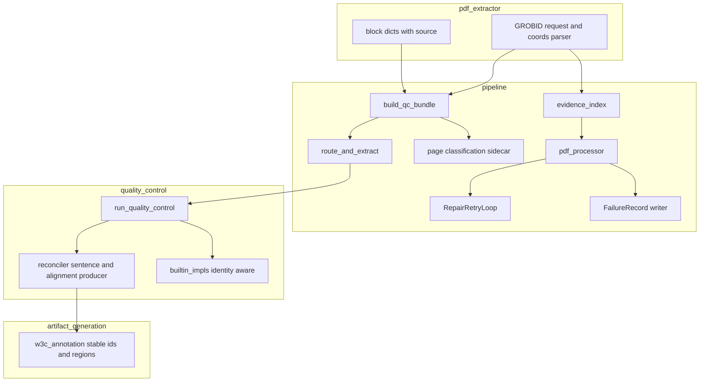
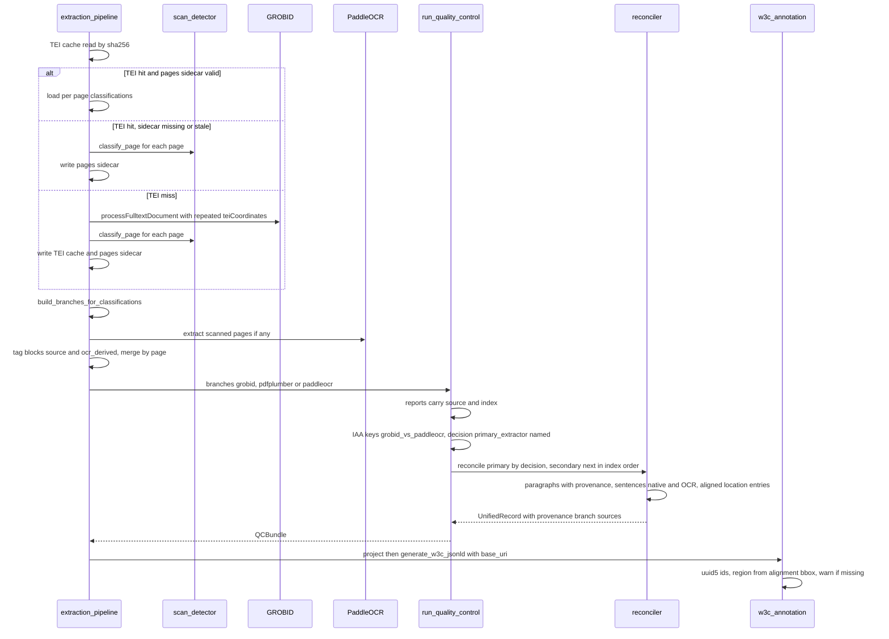
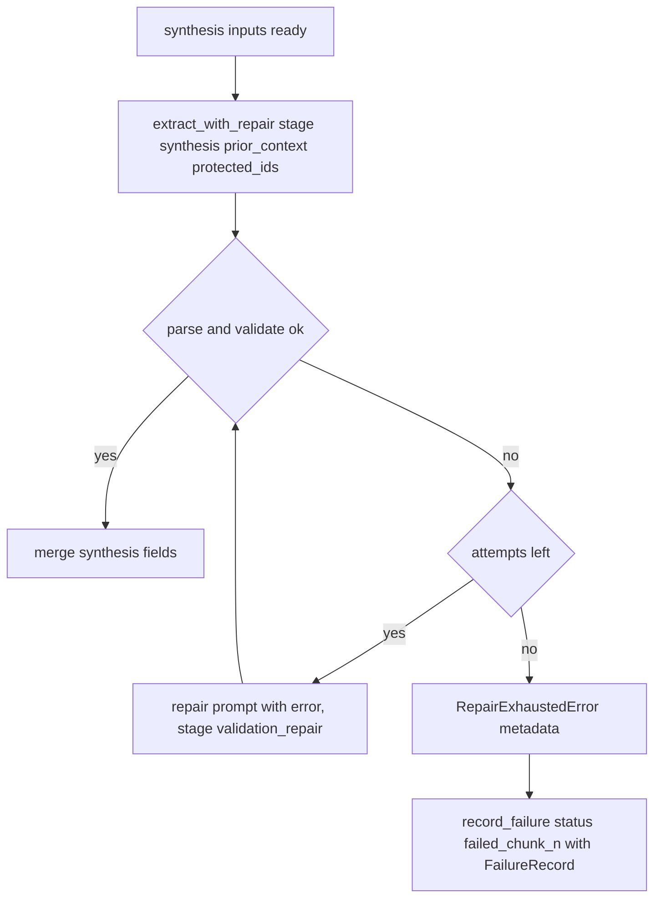

# Technical Design — risk-remediation

## Overview

**Purpose**: This spec repairs eleven defects in already-shipped EviTrace behaviour so that a completed run is auditable end to end: the adjudication stage actually drives reconciliation, OCR-derived text is marked and located as such, annotation identifiers are reproducible, a malformed synthesis response is repaired rather than fatal, re-runs classify pages the same way as first runs, figure and table evidence is attributed to a real section, quality-control extension points enforce their contracts, extractors are named in agreement output, evidence selection covers the paper, and evidence items carry a page.

**Users**: Reviewers auditing extraction provenance in the output artefacts; operators running and re-running the pipeline; developers extending quality control.

**Impact**: Changes behaviour inside four existing packages (`pipeline`, `quality_control`, `artifact_generation`, `pdf_extractor`) without adding modules or altering dependency direction. Output shapes gain keys (never lose them); three config keys are added under existing sections; two config defaults change; the persisted GROBID cache gains a sidecar file. Requirement 8 is already implemented and is recorded here only for traceability.

### Goals
- Every acceptance criterion 1.1–11.6 is realised by a named component in this document and verifiable by a test derived from it.
- Defects are fixed at their single root cause; where several requirements share a root (extractor identity → branch selection → OCR provenance) the fix is made once and reused.
- Existing test suites keep passing except where they encode the defect (enumerated in Testing Strategy).

### Non-Goals
- New pipeline stages, extraction backends, extraction-map changes, CLI changes (requirements boundary).
- Re-tuning token-budget thresholds established by `token-efficient-extraction`.
- Wiring or deleting the dead `rater.observe` path; implementing the documented-but-absent PyMuPDF OCR cross-validation; indexing `<back><div type="annex">` text; fixing `TextProcessor`/`SentenceSegment`. Each is recorded for the roadmap in `research.md`.

## Boundary Commitments

### This Spec Owns
- **Extractor identity propagation**: the `source` string from `Candidate` to `QualityReport`, IAA pairwise keys, adjudication `primary_extractor`, reconciler branch roles, block dicts, paragraph dicts, sentence dicts, and the `ocr_derived` boolean derived from it.
- **Sentence production and sentence location**: `reconciler.reconcile()` is the sole producer of `semantic.sentences` and of the positionally aligned `alignment.sentence_to_char_range` entries (page, offsets, bbox).
- **Annotation identity and region selection** in `artifact_generation/w3c_annotation.py`.
- **Synthesis-stage repair** and the manifest **failure record shape** for extraction chunks, synthesis and the final output write.
- **Page-classification persistence** (`{digest}.pages.json`) and a single routing function for cache-hit and cache-miss paths in `extraction_pipeline.py`.
- **Figure/table section attribution, dedupe, page coordinates and evidence-coverage measurement** in `evidence_index.py`; the canonical TEI `coords` parser in `pdf_extractor/extraction/GROBID.py` and its mirror in `quality_control.py`.
- Config keys `retry.max_repair_attempts`, `extraction.min_evidence_coverage_ratio`, the canonical values of `extraction.max_evidence_items_per_chunk` / `max_evidence_chars_per_chunk`, and their documentation.

### Out of Boundary
- `Candidate`, `UnifiedRecord`, `SemanticLayer`, `StructuralLayer`, `DocumentAlignment`, `AlignmentRecord` **dataclass field sets** — unchanged. New information travels in the dict payloads those layers already hold.
- `structure_schema.json`, `final_output_schema.json`, `agent_schema.json`, `extraction_map.json` — unchanged (R1 forbids a schema change; the others are untouched).
- The `_shared_paper_prefix` prompt-cache prefix — unchanged; R5 adds nothing to the shared prefix.
- Scan-detection heuristics (`scan_detector.classify_page`) — reused, not modified.
- The evidence-index disk cache format (`*.evidence.json`) — unchanged; coverage stats are computed at selection time in `pdf_processor`, not cached.

### Allowed Dependencies
- Existing directions only: `pipeline → {quality_control, pdf_extractor, agents, artifact_generation, utils}`; `quality_control → {text_processing, utils}`; `artifact_generation → {quality_control.models}`; `pdf_extractor → {utils}`. `tests/test_dependency_directions.py` remains the enforcement.
- Standard library only for new behaviour (`uuid.uuid5`, `hashlib.sha256`, `json`, `xml.etree`).
- `requests` (already a dependency) list-valued form fields for repeated `teiCoordinates`.

### Revalidation Triggers
- Any change to the sentence dict keys (`text`, `page_index`, `ocr_derived`, `source`) or to the positional alignment between `semantic.sentences` and `alignment.sentence_to_char_range` — revalidate `w3c_annotation.project()` and every consumer of `content["annotations"]`.
- Any change to the `FailureRecord` shape or to manifest `status` vocabulary — revalidate `pdf_processor._load_completed_result`, `src/pipeline/README.md`, `tests/src/quality_control/test_qc_pipeline_integration.py`.
- Any change to `{digest}.pages.json` version or fields — bump `version`, revalidate the hit-path routing test.
- Any change to the `coords` grammar — revalidate both parsers via the cross-agreement test.
- Any change to branch `source` names in `extraction_pipeline.py` — revalidate D1 fallback behaviour and the `OCR_SOURCES` set.

## Architecture

### Existing Architecture Analysis
The per-PDF flow is `build_qc_bundle()` → `run_quality_control()` → `reconcile()` → `project()`/`generate_w3c_jsonld()` → evidence index → chunk extraction → synthesis → `_save_pdf_output()`. The defects sit at the seams between these steps, where information is dropped: branch names not carried into reports; the decision not read by the caller that assigns branch roles; block origin lost at merge; sentence location keyed by text; the cache-hit branch bypassing routing; the figure loop reading loop-carried state; coordinates requested in a form GROBID ignores. No new seam is introduced; each existing seam is made to carry the information it already should.

### Architecture Pattern & Boundary Map



**Implementation sequencing** (binding for task generation)
1. ExtractorIdentity (R9) → BranchRoleSelector (R2) → BlockProvenance, SentenceProducer, SentenceLocation, RegionSelector (R4): each depends on the previous seam carrying a real name/flag.
2. CoordsParser + GrobidRequest (R11) → FigureAttribution (R7, needs real pages) → EvidenceCoverage + Config (R10).
3. Independent, any order: AnnotationIdentity (R3, after SentenceLocation for `occurrence`), SynthesisRepair + FailureRecorder (R5, R1.4), PageClassificationCache + RoutingUnifier (R6).
4. Migration test pair last, once every component exists.

**Architecture Integration**
- Selected pattern: *repair in place at the owning seam*; one function per seam owns the corrected behaviour.
- Domain boundaries: `pipeline` decides *meaning* (which sources are OCR, which stage failed, what coverage threshold applies); `quality_control` *propagates* keys without interpreting them; `artifact_generation` *consumes* `semantic` + `alignment` only.
- Existing patterns preserved: config loaded once and passed; module-level patch seams in `extraction_pipeline`; lazy heavy imports; ABC-based extension points; single schema-validator owners.
- Steering compliance: no new top-level config keys; no new modules; dependency directions unchanged.

### Technology Stack

| Layer | Choice / Version | Role in Feature | Notes |
|-------|------------------|-----------------|-------|
| Runtime | Python 3.12 (pinned) | all changes | stdlib `uuid.uuid5`, `hashlib`, `json`, `xml.etree` |
| External service | GROBID 0.8.2 (`lfoppiano/grobid:0.8.2-crf`) | TEI structure and `coords` grammar this design targets | real output checked in under `tests/fixtures/grobid_tei/` |
| HTTP | `requests` (existing) | repeated multipart fields for `teiCoordinates` | list value under `data=` |
| Storage | filesystem, `tei_cache_dir` | `{digest}.pages.json` sidecar | same key as TEI cache |

## File Structure Plan

### Directory Structure
No new directories or modules in `src/`. New test fixtures and test files only.

```
src/
├── pipeline/
│   ├── extraction_pipeline.py     # block source tagging; sidecar read/write; single routing function; base_uri at annotation call
│   ├── evidence_index.py          # citation-based figure attribution; single figure loop; coords via GROBID parser; select_paper_evidence + stats
│   └── pdf_processor.py           # extract_with_repair extension; synthesis via repair; FailureRecord; coverage record; aligned defaults
├── pdf_extractor/extraction/
│   ├── GROBID.py                  # teiCoordinates as repeated fields; parse_tei_coords (canonical)
│   └── schemas.py                 # BlockDict gains optional source / ocr_derived keys (TypedDict, total=False)
├── quality_control/
│   ├── quality_control.py         # report source/index; decision-driven branch roles; branch source provenance; _page_from_tei_coords (hoisted) grammar; sentence loop removed
│   ├── reconciler.py              # paragraph provenance; sentence production (native + OCR); aligned per-sentence location entries
│   └── builtin_impls/
│       ├── inter_rater_report.py  # empty-name fallback
│       └── adjudication_decision.py
├── artifact_generation/
│   └── w3c_annotation.py          # uuid5 ids; zip sentences with alignment entries; bbox from alignment; warning path
└── utils/
    └── config_utils.py            # retry.max_repair_attempts, extraction.min_evidence_coverage_ratio, 30000 default
configs/
├── config.yaml                    # max_evidence_chars_per_chunk 30000; new keys
└── README.md                      # evidence budget + retry docs reconciled
tests/
├── fixtures/grobid_tei/           # three real GROBID 0.8.2 TEI files + README (already added)
├── test_migration_risk_remediation_bug_condition.py    # post-fix state per requirement
├── test_migration_risk_remediation_preservation.py     # behaviour that must not regress
└── src/...                        # per-module tests listed in Testing Strategy
```

### Modified Files
- `src/pipeline/extraction_pipeline.py` — tag every block with `source`/`ocr_derived` when native/scanned lists are built; add `_page_class_cache_read/_write`; extract `_build_branches_for_classifications`; pass `base_uri` to `generate_w3c_jsonld`.
- `src/pipeline/evidence_index.py` — `_figure_section_map`, per-div `section_path` reset, single `./figure` loop, `parse_tei_coords` import, sentence page inherited from `<p>`, `select_paper_evidence` + `EvidenceSelectionStats`.
- `src/pipeline/pdf_processor.py` — `extract_with_repair` new keyword params; synthesis routed through it; `_record_failure`; `retry.max_repair_attempts` plumbed; coverage recorded; fallback defaults aligned; manifest write under lock.
- `src/pdf_extractor/extraction/GROBID.py` — repeated `teiCoordinates`; `parse_tei_coords`; `_parse_coords` delegates to it.
- `src/pdf_extractor/extraction/schemas.py` — optional keys documented on `BlockDict`.
- `src/quality_control/quality_control.py` — `source=`/`index=` at report construction; `_pdf_reconciler_fn` role selection; provenance branch sources; remove fallback sentence loop; hoist `_page_from_coords` closure to module-level `_page_from_tei_coords` with the GROBID grammar.
- `src/quality_control/reconciler.py` — `_build_semantic_layer` copies provenance; new `_build_sentences`; `_compute_sentence_to_char_range` per sentence with cursor and page/bbox.
- `src/quality_control/builtin_impls/{inter_rater_report,adjudication_decision}.py` — `getattr(x, "extractor", "") or str(i)`.
- `src/artifact_generation/w3c_annotation.py` — ids, zipped location entries, region from alignment, warning.
- `src/utils/config_utils.py`, `configs/config.yaml`, `configs/README.md` — keys and defaults.
- `src/pipeline/README.md` — manifest failure record documented.
- `src/quality_control/models.py` — **already changed** (Requirement 8, `ABC` bases); no further edits.

## System Flows

### Per-PDF flow after the change (mixed native + scanned PDF)



Flow-level decisions: the sidecar is consulted only on a TEI hit; a hit with scanned pages runs OCR exactly as a miss would (6.4). The classification hash guards against stale sidecars after a config change.

### Synthesis repair flow



## Requirements Traceability

| Requirement | Summary | Components | Interfaces | Flows |
|---|---|---|---|---|
| 1.1 | domain_group accepted in map-produced form | FinalOutputGate (existing) | `FinalOutputValidator.validate` | — |
| 1.2 | output written when all fields valid | FinalOutputGate | `_save_pdf_output` | — |
| 1.3 | rejection logged with field identity | FinalOutputGate | `format_error` | — |
| 1.4 | no silent skipped write | FinalOutputGate + FailureRecorder | `_record_failure(stage="output_write")` | — |
| 2.1 | primary content from adjudicated branch | BranchRoleSelector | `_pdf_reconciler_fn` | per-PDF |
| 2.2 | distinct secondary | BranchRoleSelector | same | per-PDF |
| 2.3 | deterministic fallback + warning | BranchRoleSelector | same | per-PDF |
| 2.4 | rationale in output | BranchRoleSelector | provenance keys | — |
| 3.1 | identical ids on re-run | AnnotationIdentity | `_annotation_id` | — |
| 3.2 | distinct ids for distinct text/page/occurrence | AnnotationIdentity | same | — |
| 3.3 | duplicate text → distinct ids | AnnotationIdentity + SentenceLocation | occurrence counter | — |
| 3.4 | no time/path/randomness | AnnotationIdentity | `uuid5` inputs | — |
| 4.1 | per-block origin preserved | BlockProvenance | `BlockDict.source/ocr_derived` | per-PDF |
| 4.2 | scanned block → OCR sentence | SentenceProducer | `_build_sentences` | per-PDF |
| 4.3 | native sentence not OCR; offsets not regressed | SentenceProducer + SentenceLocation | `_compute_sentence_to_char_range` | — |
| 4.4 | mixed docs carry both markings | SentenceProducer | sentence dict | per-PDF |
| 4.5 | region from the sentence's own block | RegionSelector | alignment `bbox` | — |
| 4.6 | alignment carries region info | SentenceLocation | location entry | — |
| 4.7 | warning when region missing, continue | RegionSelector | logger WARNING | — |
| 4.8 | end-to-end marking matches | all of R4 | `content["annotations"]` | per-PDF |
| 4.9 | OCR sentence source exists | SentenceProducer | `_build_sentences` | per-PDF |
| 5.1 | synthesis repaired like chunks | SynthesisRepair | `extract_with_repair(stage="synthesis")` | synthesis |
| 5.2 | repaired response used | SynthesisRepair | same | synthesis |
| 5.3 | exhaustion → manifest with diagnostics | FailureRecorder | `FailureRecord` | synthesis |
| 5.4 | same limits and shape | SynthesisRepair + FailureRecorder + Config | `retry.max_repair_attempts` | — |
| 6.1 | classify on cache hit | PageClassificationCache | `_page_class_cache_read` | per-PDF |
| 6.2 | no all-native label for scanned | RoutingUnifier | `_build_branches_for_classifications` | per-PDF |
| 6.3 | persist classification | PageClassificationCache | `_page_class_cache_write` | per-PDF |
| 6.4 | identical routing on reuse | RoutingUnifier | same function both paths | per-PDF |
| 6.5 | log error, all-native default | PageClassificationCache | fallback branch | per-PDF |
| 6.6 | no page re-read when both cached | PageClassificationCache | sidecar hit | per-PDF |
| 7.1 | figure → first citing section | FigureAttribution | `_figure_section_map` | — |
| 7.2 | table → first citing section | FigureAttribution | same | — |
| 7.3 | not all same section | FigureAttribution | same | — |
| 7.4 | neutral fallback, per-div reset | FigureAttribution | `section_path` reset | — |
| 7.5 | one item per figure/table | FigureAttribution | single `./figure` loop | — |
| 8.1–8.3 | ABC enforcement | QCContractEnforcement (done) | `models.py` | — |
| 9.1 | pairwise keyed by source names | ExtractorIdentity | `InterRaterReport.compute` | — |
| 9.2 | primary is a source name | ExtractorIdentity | `AdjudicationDecision.adjudicate` | — |
| 9.3 | report carries source | ExtractorIdentity | `_build_local_metrics_report` | — |
| 9.4 | no positional-only identity | ExtractorIdentity | same | — |
| 9.5 | documented fallback when name missing | ExtractorIdentity | `or str(i)` | — |
| 10.1 | ≥60% of substantive text at defaults | EvidenceCoverage + Config | `select_paper_evidence` | — |
| 10.2 | budget enforcement still applies | EvidenceCoverage (existing token_budget) | unchanged | — |
| 10.3 | docs agree with values | Config | `config.yaml`, `README.md`, `config_utils` | — |
| 10.4 | shortfall recorded | EvidenceCoverage | manifest `evidence_coverage` | — |
| 10.5 | ranking/pruning retained | EvidenceCoverage | unchanged loop | — |
| 11.1 | coords requested correctly | GrobidRequest | list-valued `teiCoordinates` | — |
| 11.2 | GROBID grammar parsed | CoordsParser | `parse_tei_coords` | — |
| 11.3 | sentence inherits `<p>` page | CoordsParser (evidence_index) | `_build_items_from_tei` | — |
| 11.4 | figure/table page carried | CoordsParser + FigureAttribution | item `page` | — |
| 11.5 | absent/malformed → unknown, continue | CoordsParser | `None` return | — |
| 11.6 | fixtures use real format | Fixtures | `tests/fixtures/grobid_tei/` | — |

## Components and Interfaces

| Component | Domain/Layer | Intent | Req Coverage | Key Dependencies (P0/P1) | Contracts |
|---|---|---|---|---|---|
| ExtractorIdentity | quality_control | populate and key by `source` | 9.1–9.5 | Candidate (P0) | Service |
| BranchRoleSelector | quality_control | choose primary/secondary from decision | 2.1–2.4 | ExtractorIdentity (P0), reconcile (P0) | Service |
| BlockProvenance | pipeline / pdf_extractor | tag blocks with origin | 4.1 | BlockDict (P0) | State |
| SentenceProducer | quality_control | sole producer of sentences (native + OCR) | 4.2–4.4, 4.9 | TextProcessor (P0), BlockProvenance (P0) | Service |
| SentenceLocation | quality_control | per-sentence page/offset/bbox entries | 3.3, 4.3, 4.6 | SentenceProducer (P0) | State |
| RegionSelector | artifact_generation | selector from alignment entry, warn if missing | 4.5, 4.7, 4.8 | SentenceLocation (P0) | Service |
| AnnotationIdentity | artifact_generation | deterministic ids | 3.1–3.4 | SentenceLocation (P1) | Service |
| SynthesisRepair | pipeline | synthesis through repair loop | 5.1, 5.2, 5.4 | RepairRetryLoop (P0), token_budget (P0) | Service |
| FailureRecorder | pipeline | one manifest failure shape | 1.4, 5.3, 5.4 | manifest (P0) | State |
| PageClassificationCache | pipeline | sidecar read/write/validate | 6.1, 6.3, 6.5, 6.6 | scan_detector (P1), tei cache (P0) | State |
| RoutingUnifier | pipeline | one branch-building function for both paths | 6.2, 6.4 | PageClassificationCache (P0), backends (P0) | Service |
| FigureAttribution | pipeline | citation-based section, dedupe | 7.1–7.5, 11.4 | CoordsParser (P1) | Service |
| CoordsParser | pdf_extractor (+ mirror) | GROBID `coords` grammar | 11.2, 11.3, 11.5 | — | Service |
| GrobidRequest | pdf_extractor | repeated `teiCoordinates` | 11.1 | requests (P0) | API |
| EvidenceCoverage | pipeline | per-paper selection stats + shortfall record | 10.1, 10.4, 10.5 | evidence_index (P0), manifest (P1) | Service |
| Config | utils / configs | keys, defaults, docs | 5.4, 10.3 | config_utils (P0) | State |
| QCContractEnforcement | quality_control | ABC bases | 8.1–8.3 | — | done |

### quality_control

#### ExtractorIdentity

| Field | Detail |
|---|---|
| Intent | Every quality report knows which branch it rates; IAA and adjudication key on that name |
| Requirements | 9.1, 9.2, 9.3, 9.4, 9.5 |

**Responsibilities & Constraints**
- `_build_local_metrics_report` constructs `ExtractionCoverageReport(..., source=branch.source, index=branch_index)`.
- `InterRaterReport.compute` and `AdjudicationDecision.adjudicate` resolve a name as `getattr(r, "extractor", "") or str(i)`; the documented fallback identifier is the zero-based report position as a string.
- Invariant: for N reports with distinct sources, `pairwise` has exactly `N·(N−1)/2` keys of the form `f"{a}_vs_{b}"`.

**Dependencies** — Inbound: `run_quality_control` (P0). Outbound: none new.

**Contracts**: Service [x]

##### Service Interface
```python
def _build_local_metrics_report(branch: Candidate, branches: list[Candidate], branch_index: int,
                                config: dict, text_processor) -> ExtractionCoverageReport
# Postcondition: result.source == branch.source and result.index == branch_index
```

**Implementation Notes**
- Integration: two keyword arguments at one construction site; two `or str(i)` edits. `rater.observe` is left as is.
- Validation: pipeline-level test asserts pairwise keys and `primary_extractor ∈ {branch sources}`; unit test for empty-name fallback.
- Risks: none material.

#### BranchRoleSelector

| Field | Detail |
|---|---|
| Intent | Reconciliation follows the adjudication decision, with a deterministic, logged fallback |
| Requirements | 2.1, 2.2, 2.3, 2.4 |

**Responsibilities & Constraints**
- Lives in `_pdf_reconciler_fn(decision, all_branches, cfg)`; `reconcile()` signature unchanged.
- Primary = first branch (in `index` order) with `extractor == decision.primary_extractor`; if none, primary = `all_branches[0]` and a WARNING is logged: `"adjudicated primary extractor %r not among branches %r; falling back to index order"`.
- Secondary = first branch in index order that `is not primary`; `None` only when a single branch exists.
- Provenance gains `primary_branch_source: str`, `secondary_branch_source: str | None`, `branch_selection: "adjudicated" | "fallback_index_order"` beside the existing `adjudication_decisions` (which already carries `rationale`, satisfying 2.4 once 9.2 holds).

**Dependencies** — Inbound: `run_quality_control` (P0). Outbound: `reconciler.reconcile` (P0), `_build_reconciler_artifact` (P0).

**Contracts**: Service [x]

##### Service Interface
```python
def _select_branch_roles(decision: AdjudicationRules, all_branches: list[Candidate]
                         ) -> tuple[Candidate | None, Candidate | None, str]
# Returns (primary, secondary, selection_mode). Preconditions: all_branches sorted by index.
# Postconditions: primary is not None iff all_branches; secondary is not primary.
```

**Implementation Notes**
- Integration: replaces the hard-coded `"grobid"` / `{"pdfplumber","pymupdf"}` lookups. On mixed/scanned runs the `paddleocr` branch now becomes secondary, so `structural.blocks` is populated — this is the shared fix for 2.x and 4.5.
- Validation: tests for adjudicated match, fallback with warning text, single-branch case, `structural.blocks` non-empty with a `paddleocr` secondary.
- Risks: if adjudication ever prefers a non-GROBID branch, the semantic layer is built from that branch's blocks. That is the requirement's intent (2.1).

#### SentenceProducer

| Field | Detail |
|---|---|
| Intent | `reconcile()` is the sole producer of `semantic.sentences`, for native paragraphs and OCR blocks alike |
| Requirements | 4.2, 4.3, 4.4, 4.9 |

**Responsibilities & Constraints**
- `_build_semantic_layer(primary_blocks)` copies `ocr_derived` (default `False`) and `source` (default `""`) from each block onto its paragraph dict, alongside the existing `block_index`.
- `_build_sentences(semantic, secondary_blocks, text_processor) -> list[dict]`:
  1. for each paragraph in order, `text_processor.tokenize_sentences(text)` → sentence dicts `{"text", "page_index", "ocr_derived", "source"}` copied from the paragraph;
  2. for each secondary block with `ocr_derived is True` whose `page_index` has **no** primary paragraph text, tokenize the block text into sentence dicts with `ocr_derived=True`, `source=block["source"]`, and remember the block (for bbox) for SentenceLocation;
  3. blocks are visited in page order; within a page primary sentences precede OCR sentences.
- **Document text rule**: `reconcile()` builds `full_text` from the primary blocks **plus** the text of every secondary block that step 2 uses (OCR blocks on pages with no primary text), concatenated in page order; `content["exact_text"]` and the derived segments use that same `full_text`. OCR sentences are therefore searchable by SentenceLocation's cursor exactly like native ones, and a miss remains a genuine anomaly (flagged), not the normal case.
- **All-scanned document**: when the only branch is `paddleocr`, BranchRoleSelector makes it primary; its blocks carry `ocr_derived=True`, so step 1 already yields OCR sentences and `exact_text` is non-empty. Step 2 then contributes nothing. This case is an explicit test, not a side effect.
- When `text_processor is None`, `sentences` stays `[]` (current behaviour for callers that pass none).
- The fallback loop in `quality_control.py:623-638` is removed.

**Dependencies** — Inbound: `reconcile` (P0). Outbound: `TextProcessor.tokenize_sentences` (P0), BlockProvenance keys (P0).

**Contracts**: Service [x]

##### Service Interface
```python
def _build_sentences(semantic: SemanticLayer, secondary_blocks: list[dict],
                     text_processor: TextProcessor | None) -> tuple[list[dict], list[dict | None]]
# Returns (sentences, source_block_per_sentence). len(sentences) == len(source_block_per_sentence).
# Postcondition: every sentence has keys text, page_index, ocr_derived, source.
```

**Implementation Notes**
- Integration: called inside `reconcile()` after the semantic layer is built and before alignment; `quality_control._pdf_reconciler_fn` no longer post-processes sentences.
- Validation: native-only preservation test (identical texts and pages before/after); mixed fixture yields both markings (4.4); all-scanned fixture yields OCR sentences only (4.9) and non-empty `exact_text`.
- Risks: reconciler is core code; covered by the existing reconciler suite plus the migration preservation file.

#### SentenceLocation

| Field | Detail |
|---|---|
| Intent | One location entry per sentence, positionally aligned, carrying page, char offsets and (for OCR) bbox |
| Requirements | 3.3, 4.3, 4.6 |

**Responsibilities & Constraints**
- `_compute_sentence_to_char_range(sentences: list[dict], full_text: str, source_blocks: list[dict | None], reconciliation_flags: list) -> list[dict]` — one entry per sentence, same order.
- Entry shape: `{"sentence": str, "start": int, "end": int, "page_index": int, "ocr_derived": bool, "bbox": [x0,y0,x1,y1] | None, "occurrence": int}`.
- Offsets are found with a monotonic cursor (`full_text.find(text, cursor)`), so repeated text yields distinct, increasing ranges; a miss records `start=end=-1` and a `reconciliation_flags` entry (the existing flag path), never a silent `0,0`.
- `occurrence` = zero-based count of prior sentences with identical text in the document.
- `bbox` is copied from the source block's `block_bbox` when present (PaddleOCR blocks have one; GROBID blocks have `None`).

**Contracts**: State [x]

##### State Management
- State model: list in `DocumentAlignment.sentence_to_char_range`, invariant `len == len(semantic.sentences)`.
- Persistence: serialised with the unified record as today; not schema-validated.

**Implementation Notes**
- Integration: `reconcile()` replaces the paragraph-text call at `:443-447`.
- Validation: duplicate-sentence fixture → distinct ranges and occurrences 0,1; multi-sentence paragraph → per-sentence ranges (the 4.3 defect); OCR sentence → `bbox` present.
- Risks: consumers that assumed text-keyed lookup — only `w3c_annotation.project()`, updated in RegionSelector.

### artifact_generation

#### RegionSelector

| Field | Detail |
|---|---|
| Intent | Build selectors from the sentence's own location entry; warn and continue when a region is missing |
| Requirements | 4.5, 4.7, 4.8 |

**Responsibilities & Constraints**
- `project(unified, base_uri="")` zips `semantic.sentences` with `alignment.sentence_to_char_range`; reads nothing from `structural`.
- Native sentence: `TextPositionSelector` from `start/end` when `start >= 0`; otherwise `TextQuoteSelector` only.
- OCR sentence with `bbox`: `FragmentSelector` `{"page": page_index, "xywh": "x,y,w,h"}` from that bbox.
- OCR sentence without `bbox`: `logger.warning("no region for OCR sentence on page %d: %.60r", page_index, text)`; record emitted with `TextQuoteSelector` only and `ocr_derived=True`; processing continues.
- `AnnotationRecord` gains `occurrence: int = 0` and `document_id: str = ""` (dataclass in this module — owned here, not in `quality_control.models`).

**Contracts**: Service [x]

##### Service Interface
```python
def project(unified: Any, base_uri: str = "") -> list[AnnotationRecord]
# Precondition: len(unified.alignment.sentence_to_char_range) == len(unified.semantic.sentences)
#               (if alignment is None or lengths differ, fall back to quote selectors and log once)
```

**Implementation Notes**
- Integration: `extraction_pipeline.py:587-595` passes `base_uri=f"urn:evitrace:document:{pdf_name}"`.
- Validation: update `test_w3c_annotation.py` FragmentSelector tests to use alignment bbox; add warning test with `caplog`; end-to-end test (4.8) through `build_qc_bundle` with mocked backends asserting body `ocr_derived` equals sentence `ocr_derived` for every annotation.
- Risks: hand-built test records in `test_w3c_annotation.py` construct `unified.structural` for regions — they change to alignment entries.

#### AnnotationIdentity

| Field | Detail |
|---|---|
| Intent | Reproducible, collision-resistant annotation ids |
| Requirements | 3.1, 3.2, 3.3, 3.4 |

**Responsibilities & Constraints**
- `_ANNO_NAMESPACE = uuid.uuid5(uuid.NAMESPACE_URL, "urn:evitrace:anno")` (module constant).
- `_annotation_id(document_source: str, page_index: int, occurrence: int, text: str) -> str` returns `f"urn:evitrace:anno:{uuid.uuid5(_ANNO_NAMESPACE, f'{document_source}\x1f{page_index}\x1f{occurrence}\x1f{text}')}"`.
- `document_source` is `base_uri` when given, else `"urn:evitrace:document"` (existing default) — the call site now always passes a paper-scoped `base_uri`, removing cross-paper collisions.
- No wall-clock, path, or random input.

**Contracts**: Service [x]

**Implementation Notes**
- Validation: same record twice → identical ids; two papers, same text → different ids; duplicate sentence → different ids; regex tests at `test_w3c_annotation.py:273-291` change the version nibble from `4` to `5`.

### pipeline

#### BlockProvenance

| Field | Detail |
|---|---|
| Intent | Every block says which extractor produced it and whether it is OCR |
| Requirements | 4.1 |

**Responsibilities & Constraints**
- `schemas.BlockDict` documents two optional keys: `source: str`, `ocr_derived: bool` (TypedDict `total=False` extension; `validate_blocks` unchanged).
- `extraction_pipeline._tag_blocks(blocks, source, ocr_derived) -> list[dict]` sets both keys; called when `native_blocks` (`source="pdfplumber"`, `False`) and `scanned_blocks` (`source="paddleocr"`, `True`) are built, and on the all-native and cache-hit pdfplumber lists.
- `OCR_SOURCES: frozenset[str] = frozenset({"paddleocr"})` is a module constant in `extraction_pipeline.py` — the single place that knows which sources are OCR. `quality_control` never consults it; it reads the boolean.
- GROBID-derived blocks (built inside `quality_control._extract_tei_payload`) default to `ocr_derived=False`, `source="grobid"`.

**Contracts**: State [x]

**Implementation Notes**
- Validation: `test_page_routing.py::test_merged_results_preserve_page_order` extended to assert per-block `source`/`ocr_derived`; `_make_block` helpers unaffected (keys optional).

#### SynthesisRepair

| Field | Detail |
|---|---|
| Intent | Synthesis gets the same repair loop as extraction chunks without losing its three synthesis-only inputs |
| Requirements | 5.1, 5.2, 5.4 |

**Contracts**: Service [x]

##### Service Interface
```python
async def extract_with_repair(self, chunk_num: int, source: str, fields: list[dict],
                              semaphore: asyncio.Semaphore, *,
                              valid_location_ids: set[str], expected_indices: list[int], pdf_name: str,
                              prior_context: list[dict] | None = None,
                              stage: str = "extraction_chunk",
                              protected_evidence_ids: set[str] | None = None) -> list[dict]
# stage selects the token budget for the initial call and is forwarded to extract_chunk;
# repair attempts keep stage="validation_repair". prior_context is passed on every call
# and its JSON length is included in the budget estimate. protected_evidence_ids is passed
# to _check_and_mitigate_budget. Defaults reproduce current behaviour exactly.
```
- Synthesis call site becomes `await repair_loop.extract_with_repair(synthesis_chunk, synthesis_source, effective_synthesis_fields, api_semaphore, valid_location_ids=..., expected_indices=..., pdf_name=pdf_name, prior_context=compact_prior_context, stage="synthesis", protected_evidence_ids=protected_evidence_ids)`; the separate `_check_and_mitigate_budget` + raw `extract_chunk` + single `validate_chunk_output` are removed.
- `RepairRetryLoop(max_repair_attempts=openai_config["max_repair_attempts"], ...)` in `process_pdf`; `_run_parallel_chunks` receives the same instance.

**Implementation Notes**
- Integration: `load_openai_config()` returns `max_repair_attempts` from `retry.max_repair_attempts` (default 2; env override `OPENAI_MAX_REPAIR_ATTEMPTS` follows the existing env > yaml > default rule).
- Validation: malformed-then-valid synthesis response → repaired result used and `prior_context` present on both calls; exhaustion → `failed_chunk_{n}` with `FailureRecord`; existing `TestExtractWithRepair` unchanged (defaults); `test_pdf_processor_helpers.py:482-485,589-599` still see synthesis as the third `extract_chunk` call with `prior_context` kwarg.
- Risks: double mitigation is avoided because the initial call uses `stage` once and repair uses `validation_repair` once, as chunks do today.

#### FailureRecorder

| Field | Detail |
|---|---|
| Intent | One manifest failure shape for chunks, synthesis and the output write |
| Requirements | 1.4, 5.3, 5.4 |

**Contracts**: State [x]

##### State Management
```python
FailureRecord = dict  # {"stage": "extraction_chunk"|"synthesis"|"output_write"|"schema_validation",
                      #  "chunk": int | None, "error_type": str, "last_error": str, "attempts": int}
def _record_failure(manifest: dict, pdf_name: str, *, status: str, failures: list[FailureRecord]) -> None
# writes manifest[pdf_name] = {"status": status, "error": failures[-1]["last_error"], "failures": failures}
# plus, for status == "failed_chunks", "failed_chunks": [f["chunk"] for f in failures]  (compatibility)
```
- Status vocabulary is unchanged: `failed_chunks`, `failed_chunk_{n}`, `failed_schema_validation`, `failed_qc_pipeline`; one new value, `failed_output_write`.
- **Single path.** `_save_pdf_output(pdf_name, fields, normalizer=None) -> tuple[bool, FailureRecord | None]` stays synchronous, **never touches the manifest**, and does not catch I/O errors: it returns `(True, None)` on success and `(False, record)` when validation fails (`stage="schema_validation"`, `last_error` = the joined error strings). `_atomic_write_json` errors propagate unchanged. The `manifest` parameter is removed.
- `process_pdf` wraps the call: on `(False, record)` it calls `_record_failure(status="failed_schema_validation", failures=[record])` under `manifest_lock`; on an exception it calls `_record_failure(status="failed_output_write", failures=[FailureRecord(stage="output_write", ...)])` under `manifest_lock` and re-raises, so `orchestrator.py:146-149` still logs it as today. Tests adapting: `test_pdf_processor_helpers.py:98-209`, `test_final_output_validator_properties.py:235`, `test_atomic_write_properties.py`.

**Implementation Notes**
- Validation: `test_qc_pipeline_integration.py::EXPECTED_STATUSES` extended; `src/pipeline/README.md` documents the record; `pdf_processor._load_completed_result` (`pdf_processor.py:984-991`), `manifest.is_stale`, `manifest._is_output_valid` verified insensitive to added keys.

#### PageClassificationCache

| Field | Detail |
|---|---|
| Intent | Persist per-page classification beside the TEI cache and reuse it on hits |
| Requirements | 6.1, 6.3, 6.5, 6.6 |

**Contracts**: State [x]

##### State Management
- File: `tei_cache_dir / f"{digest}.pages.json"`; written whenever classifications are computed (miss path, or hit path recompute).
- Payload: `{"version": 1, "scan_detection_config_hash": str, "pages": [{"page_index": int, "is_native": bool, "triggered_stages": list[str], "stage_values": dict}]}`.
- `scan_detection_config_hash = sha256(json.dumps(qc_config["quality_control"]["scan_detection"], sort_keys=True))`.
- `_page_class_cache_read(digest, cache_dir, config_hash) -> list[PageScanClassification] | None` returns `None` on absence, JSON error, version mismatch, or hash mismatch (each logged at INFO with the reason).
- `_page_class_cache_write(classifications, digest, cache_dir, config_hash) -> None`; no-op when `cache_dir` is `None`.
- On a hit with a valid sidecar no page is opened for classification (6.6); pdfplumber's text extraction still runs, as it does today.
- Hit-path decision: sidecar valid → use; else if `fitz` importable → run `scan_detector.classify_page` per page and write sidecar; else → `logger.error(...)` and all-native default (6.5). The existing `fitz`-missing fallback on the miss path is unchanged.

**Implementation Notes**
- Integration: both helpers are module-level in `extraction_pipeline.py` so tests can patch `pipeline.extraction_pipeline._page_class_cache_read/_write` alongside the existing seams.
- Validation: first-ever cache-hit tests: hit + valid sidecar with scanned pages → OCR invoked and routing reasons match a miss run byte-for-byte (6.4); hit + no sidecar → classification computed and sidecar written; hit + stale hash → recompute; hit + unreadable + no fitz → error log + all-native.

#### RoutingUnifier

| Field | Detail |
|---|---|
| Intent | One function turns classifications into branches and routing results, used by both cache paths |
| Requirements | 6.2, 6.4 |

**Contracts**: Service [x]

##### Service Interface
```python
def _build_branches_for_classifications(pdf_path: Path, tei_xml: str, plumber_blocks: list[dict],
                                        classifications: list[PageScanClassification], qc_config: dict,
                                        *, from_cache: bool) -> tuple[list[Candidate], list[PageRoutingResult]]
# Encapsulates today's lines ~360-547: native/scanned index sets, OCR extraction when scanned pages
# exist and ocr=true, block tagging (BlockProvenance), merge by page, Candidate naming, routing results.
# Postcondition: output is a pure function of its inputs (no dependence on from_cache except logging).
```

**Implementation Notes**
- Validation: property test — same inputs with `from_cache` True/False produce equal branches and routing results.
- Risks: refactor of the largest function in the pipeline; mitigated by the existing routing suites, which all go through `build_qc_bundle`.

#### FigureAttribution

| Field | Detail |
|---|---|
| Intent | Attribute figures and tables to the first citing section; one item each; real page |
| Requirements | 7.1, 7.2, 7.3, 7.4, 7.5, 11.4 |

**Contracts**: Service [x]

##### Service Interface
```python
def _figure_section_map(body: ET.Element) -> dict[str, str]
# For each body <div> in document order with head text H (or "body" if no head), for each
# <ref type="figure"|"table" target="#id"> within it, map id -> H if id not already mapped.
def _section_heading(div: ET.Element) -> str   # head text or "body"; never inherited
```
- In `_build_items_from_tei`: `section_path = _section_heading(div)` at the top of each div iteration (7.4); after the div loop, iterate `body.findall(f"./{_NS}figure")` once: `xml_id = fig.get("{xml}id")`, `section = section_by_id.get(xml_id, "body")`; if `fig.get("type") == "table"` emit one `T` item (text = caption + row text, `xpath` from the figure's `xml:id`, score `_section_score(section)+10`), else one `F` item (`+5`); the separate `.//table` loop is removed (7.5). `page` from `parse_tei_coords(fig.get("coords"))` (11.4).
- `_section_score("body") == 0` by construction (no boost/penalty substring matches).

**Implementation Notes**
- Validation: real fixtures — `arxiv_2003.10218`: 10 F + 3 T items, ≥2 distinct sections, `tab_0` attributed to its citing section; `biorxiv`: 7 F (caption-less dropped as today), uncited → `"body"`; hand-built head-less div → `"body"` for its sentences; existing nested-figure fixtures still produce items (they have no `<ref>`, so `"body"`).
- Risks: sentence items in a head-less div change section from the inherited heading to `"body"` — intended (7.4).

#### CoordsParser

| Field | Detail |
|---|---|
| Intent | Parse GROBID's real `coords` grammar; one canonical implementation plus a dependency-safe mirror |
| Requirements | 11.2, 11.3, 11.5 |

**Contracts**: Service [x]

##### Service Interface
```python
# src/pdf_extractor/extraction/GROBID.py
@dataclass(frozen=True)
class CoordBox: page: int; x: float; y: float; w: float; h: float   # page is 1-indexed as emitted
def parse_tei_coords(coords: str | None) -> list[CoordBox]
# Grammar: boxes separated by ";", each "page,x,y,w,h"; whitespace tolerated; any malformed box
# → return [] (11.5). Never raises.
def _parse_coords(coords_str) -> tuple[int, tuple[float,float,float,float]] | None
# Retained; now delegates: first box's page-1 and the union of boxes on that page as (x0,y0,x1,y1).

# src/pipeline/evidence_index.py
_parse_coords(coords) -> {"page": int | None, "coords": [x0,y0,x1,y1] | None}   # via parse_tei_coords; page stays 1-based (as today)
# sentence page: sent coords if present else parent <p> coords (11.3)

# src/quality_control/quality_control.py (mirror; may not import pdf_extractor)
def _page_from_tei_coords(coords: str) -> int   # MODULE-LEVEL (today a closure inside _extract_tei_payload,
                                               # quality_control.py:214-224 — hoisted so it is testable);
                                               # same grammar; first box page-1; 0 on absence/malformed
```

**Implementation Notes**
- Validation: cross-agreement test feeds identical strings (single box, multi box, malformed, empty, fixture-derived) to `parse_tei_coords` and `_page_from_tei_coords` and asserts equal pages; fixture tests use `tests/fixtures/grobid_tei/*.tei.xml` (11.6) and assert `page is not None` for figures with coords.
- Risks: `quality_control` metrics that assumed page 0 for all GROBID blocks now see real pages — `extraction_coverage_ratio` per-page maths is exercised by the integration test.

#### GrobidRequest

| Field | Detail |
|---|---|
| Intent | Request coordinates in the form GROBID accepts |
| Requirements | 11.1 |

**Contracts**: API [x]

##### API Contract
| Method | Endpoint | Request | Response | Errors |
|---|---|---|---|---|
| POST multipart | `/api/processFulltextDocument` | `input` file; `teiCoordinates` **repeated** for each of `p, figure, formula, head, biblStruct` (list value under `data=`); other fields unchanged | TEI XML with `coords` on requested elements | existing retry/timeout handling |

**Implementation Notes**
- Validation: unit test asserts the `data` passed to `requests.post` has `teiCoordinates == ["p","figure","formula","head","biblStruct"]`; a `slow` test (skipped unless `GROBID_URL` is set) posts a fixture PDF and asserts `coords` count > 0.

#### EvidenceCoverage

| Field | Detail |
|---|---|
| Intent | Measure what share of a paper's substantive text the (paper-level) selection covers and record shortfalls |
| Requirements | 10.1, 10.4, 10.5 |

**Contracts**: Service [x]

##### Service Interface
```python
@dataclass(frozen=True)
class EvidenceSelectionStats:
    total_items: int; substantive_chars: int; selected_items: int; selected_chars: int
    @property
    def coverage_ratio(self) -> float   # selected_chars / substantive_chars, 0.0 when denominator is 0

def select_paper_evidence(bundle: EvidenceBundle, all_fields: list[dict], *, max_items: int, max_chars: int
                          ) -> tuple[list[dict], EvidenceSelectionStats]
# substantive_chars = sum(len(item["text"]) for item in bundle.evidence_items if item.get("section_path") != "Metadata")
# Selection loop unchanged (10.5). build_paper_evidence_package(...) -> str wraps this and serialises.
```
- **Binding cap.** Measured on the three real fixtures (non-Metadata items), mean item length is 171–193 chars, so `max_evidence_items_per_chunk: 150` binds at ≈26–29 k chars before a 30 000-char cap does. The design keeps 150 (it is what makes the ranker prune, 10.5) and raises only the char cap; coverage on the fixtures at 150/30 000 was estimated at biorxiv 82 %, plosone 62 %, arxiv 30 % (a 97 k-char paper, outside 10.1's premise); *measured during implementation (9.1, 2026-09-22) with the real ranker: 0.946 / 0.699 / 0.311 — the ranker prefers longer sentences, and the char cap, not the item cap, binds on plosone and arxiv.* The config comment (10.3) must state which cap binds conditionally — the item cap on papers with short sentences, the 30 000-char cap otherwise — with the measured coverage figures *(superseded wording "item cap is the binding constraint" corrected at 9.3, 2026-09-22)*.
- **10.1 fixture is pinned**: `tests/fixtures/grobid_tei/biorxiv_2020.03.24.004655.tei.xml` (≈31 k substantive chars, 183 items) at default config must yield `coverage_ratio >= 0.6`. A synthetic bundle may be used additionally only with item texts ≥ 150 chars.
- Naming: the keys keep their historical `*_per_chunk` names for compatibility; the selection is one paper-level package (`build_paper_evidence_package`), and all prose in code/docs says "per paper".
- `pdf_processor` records `manifest[pdf_name]["evidence_coverage"] = {"ratio", "selected_chars", "substantive_chars", "below_threshold"}` on completion and logs WARNING when `ratio < min_evidence_coverage_ratio` (10.4).

**Implementation Notes**
- Validation: biorxiv real fixture at defaults → `coverage_ratio >= 0.6` (10.1); property test that `selected_chars <= max_chars` and `selected_items <= max_items` still holds; manifest entry present and `below_threshold` correct.

### utils / configs

#### Config

| Field | Detail |
|---|---|
| Intent | New keys, canonical defaults, documentation that agrees with values |
| Requirements | 5.4, 10.3 |

- `configs/config.yaml`: `retry.max_repair_attempts: 2`; `extraction.max_evidence_chars_per_chunk: 30000` (comment already says so); `extraction.min_evidence_coverage_ratio: 0.6` with a comment stating the coverage rationale (10.3).
- `src/utils/config_utils.py`: `load_openai_config()` returns `max_repair_attempts` (env `OPENAI_MAX_REPAIR_ATTEMPTS`) and `min_evidence_coverage_ratio` (env `OPENAI_MIN_EVIDENCE_COVERAGE_RATIO`); `max_evidence_chars_per_chunk` default stays 30000. No new top-level keys.
- `src/pipeline/pdf_processor.py:1181-1182`: fallback defaults aligned to 150 / 30000.
- `configs/README.md`: evidence budgets 150 / 30000; new `retry.max_repair_attempts`; a `token_budgets` subsection; `.kiro/steering/config.md` updated (its `extraction` block currently shows 250 / 60000).

### quality_control (done)

#### QCContractEnforcement
Implemented 2026-09-21; see `CHANGELOG.md`. Requirements 8.1–8.3 are covered by `tests/src/quality_control/test_qc_models.py::test_*abc*`. No further work.

## Data Models

### Domain Model
- **Provenance chain** (value objects, all dicts): `Block{source, ocr_derived, …}` → `Paragraph{block_index, source, ocr_derived, …}` → `Sentence{text, page_index, ocr_derived, source}` ↔ `LocationEntry{sentence, start, end, page_index, ocr_derived, bbox, occurrence}` (1:1 by position) → `AnnotationRecord{…, occurrence, document_id}`.
- **Failure record** (value object): `FailureRecord{stage, chunk, error_type, last_error, attempts}`; aggregate root is the manifest entry keyed by `pdf_name`.
- **Page classification sidecar** (aggregate keyed by PDF sha256): `{version, scan_detection_config_hash, pages[]}`.
- **Evidence selection stats** (value object): `EvidenceSelectionStats`.

Invariants: `len(alignment.sentence_to_char_range) == len(semantic.sentences)`; a sentence with `ocr_derived=True` came from a block with `ocr_derived=True`; sidecar `pages[].page_index` covers every page pdfplumber returned.

### Logical Data Model
- Manifest entry (JSON object): existing `status`; new optional `error: str`, `failures: FailureRecord[]`, `evidence_coverage: {ratio: float, selected_chars: int, substantive_chars: int, below_threshold: bool}`; `failed_chunks: int[]` retained for `failed_chunks` status.
- Sidecar file: as in PageClassificationCache; `version` integer for forward changes.
- W3C annotation `id`: `urn:evitrace:anno:<uuid5>`; `target.source`: `urn:evitrace:document:<pdf_name>`.

### Data Contracts & Integration
- `content["provenance"]` gains `primary_branch_source`, `secondary_branch_source`, `branch_selection`.
- Block dicts gain optional `source`, `ocr_derived` — additive; `validate_blocks` unchanged.
- No JSON Schema file changes.

## Error Handling

### Error Strategy
- **Fail loud where the operator must act**: manifest `failures[]` with stage and last error for chunk exhaustion, synthesis exhaustion, schema validation, output write.
- **Degrade where a run can still produce value**: unmatched adjudicated extractor → index-order fallback + WARNING; missing OCR region → WARNING, quote-only selector; sidecar unreadable → INFO reason + recompute; sidecar unrecoverable → ERROR + all-native; malformed coords → `[]`/unknown page.
- **Never silent**: every skipped write, fallback, or degraded path logs at WARNING or above with the identity needed to find it (pdf_name, page, sentence prefix, extractor name).

### Error Categories and Responses
- Input/content errors (malformed TEI coords, caption-less figure, empty OCR text) → item skipped or page unknown, indexing continues.
- LLM response errors (parse/schema failure at synthesis) → repair loop → `RepairExhaustedError` → `FailureRecord`.
- I/O errors (sidecar write, output write) → logged; sidecar write failure never fails the run; output write failure records `failed_output_write` then re-raises.

### Monitoring
- New log lines: branch selection mode per PDF (INFO), OCR sentences produced per page (DEBUG), sidecar hit/miss/stale (INFO), coverage ratio per paper (INFO; WARNING below threshold), synthesis repair attempts (INFO, existing telemetry collector receives `stage="synthesis"`).

## Testing Strategy

### Unit Tests
- `tests/src/quality_control/test_quality_control_pipeline.py`: reports carry `source`/`index`; pairwise keys `grobid_vs_paddleocr`; `primary_extractor` is a branch name; empty-name fallback `"0_vs_1"` (9.x); role selection adjudicated / fallback with warning text / single branch (2.x); `structural.blocks` populated with `paddleocr` secondary.
- `tests/src/quality_control/test_quality_control_reconciler.py`: `_build_sentences` native-only preservation, mixed markings (4.2–4.4, 4.9); per-sentence ranges with cursor, duplicate occurrences, `bbox` on OCR entries, miss → `-1` + flag (4.3, 4.6, 3.3).
- `tests/src/pdf_extractor/test_w3c_annotation.py`: uuid5 determinism/distinctness/cross-paper (3.x); FragmentSelector from alignment bbox; warning on missing bbox via `caplog` (4.5, 4.7); regex version nibble updated.
- `tests/src/pipeline/test_repair_retry.py`: `extract_with_repair` with `stage="synthesis"`, `prior_context`, `protected_evidence_ids` forwarded; defaults unchanged (5.1, 5.2).
- `tests/src/pipeline/test_pdf_processor_helpers.py`: malformed synthesis repaired; exhaustion → `failed_chunk_{n}` + `failures[]`; `_record_failure` shapes; `failed_output_write`; manifest write under lock (1.4, 5.3, 5.4).
- `tests/src/pipeline/test_page_routing.py` (+ properties): sidecar read/write/version/hash; hit-with-scanned runs OCR; hit vs miss routing equality (6.x); per-block `source`/`ocr_derived` (4.1).
- `tests/src/pipeline/test_pipeline_evidence_index.py`: real-fixture attribution counts and distinct sections; single item per table; head-less div and uncited → `"body"`; `parse_tei_coords` grammar and cross-agreement with `_page_from_tei_coords`; sentence page inherited from `<p>`; `select_paper_evidence` stats and 60 % at defaults (7.x, 10.x, 11.2–11.6).
- `tests/src/pdf_extractor/test_grobid*.py`: repeated `teiCoordinates` in posted `data` (11.1).
- `tests/src/utils/` (existing config test module, e.g. `test_quality_control_config.py`): new keys, env overrides, defaults (5.4, 10.3).

### Integration Tests
- `build_qc_bundle` mixed PDF with mocked backends → annotations whose body `ocr_derived` matches sentence `ocr_derived` for every record (4.8), non-empty `structural.blocks`, provenance branch sources present.
- `build_qc_bundle` twice on the same mixed PDF (miss then hit) → identical branches and routing results (6.4).
- `process_pdf` with one malformed synthesis response → output written from repaired synthesis; manifest `complete` with `evidence_coverage` (5.2, 10.4).
- `tests/test_dependency_directions.py` — unchanged, must pass.

### Migration / Regression Pair (per `.kiro/steering/testing.md`)
- `tests/test_migration_risk_remediation_bug_condition.py` — one sub-check per requirement that fails on `a57294d` and passes after: `primary_extractor != ""`; `pairwise` has 3 keys for 3 branches; `structural.blocks` non-empty with `paddleocr`; annotation ids stable across two runs; OCR sentence exists for scanned fixture; FragmentSelector uses own bbox; synthesis repaired; sidecar written; figure items with ≥2 sections on the arXiv fixture; one item per table; coverage ≥ 0.6 at defaults; `parse_tei_coords` on a real string returns a page.
- `tests/test_migration_risk_remediation_preservation.py` — native-only document: sentence texts/pages identical, `reconcile()` direct-call tests unchanged, `FinalOutputValidator` behaviour unchanged, `failed_chunks` key still present, existing `test_w3c_annotation` selectors for native sentences unchanged.

### Tests that must change (encode the defect)
- `tests/src/pdf_extractor/test_w3c_annotation.py:273-291` uuid4 regex; FragmentSelector tests that construct `structural.blocks` instead of alignment entries.
- `tests/src/pipeline/test_token_efficiency_regression.py:150-153` mirror constant `10_000` → `30_000`; `tests/src/pipeline/test_orchestrator_concurrency.py:31-32` 250/60000 → 150/30000.
- `tests/src/quality_control/test_qc_pipeline_integration.py:185` `EXPECTED_STATUSES`.
- Hand-built TEI fixtures in `test_pipeline_evidence_index.py`/`test_evidence_index_stability.py` keep working (they gain `"body"` attribution and real-format coords where they assert pages).

## Performance & Scalability
- Cache-hit runs on mixed PDFs now run OCR for scanned pages; this restores correctness and costs what a first run costs for those pages only. Native-only hits are unchanged.
- `uuid5` and the citation map are O(n) over sentences/refs; negligible.
- Raising `max_evidence_chars_per_chunk` to 30 000 adds ≈5 000 tokens per chunk at most, well inside the 100 000 `extraction_chunk` budget (10.2).

## Migration Strategy
- **Sidecar introduction**: first run after upgrade on a TEI-cache hit finds no sidecar → recomputes classification and writes it; no cache invalidation required. Operators may delete `*.pages.json` freely.
- **Manifest**: existing entries remain valid; new keys are optional. `_load_completed_result` reads only `status`.
- **Annotation ids**: change from uuid4 to uuid5 on the next run; nothing persisted keys on the old ids.
- **Config**: new keys have defaults; existing `config.yaml` files without them keep working. The `max_evidence_chars_per_chunk` change is a default change and is recorded in `CHANGELOG.md`.

## Supporting References
- `research.md` — verification evidence, GROBID probe results, decisions D1–D8.
- `tests/fixtures/grobid_tei/README.md` — fixture provenance and request parameters.
