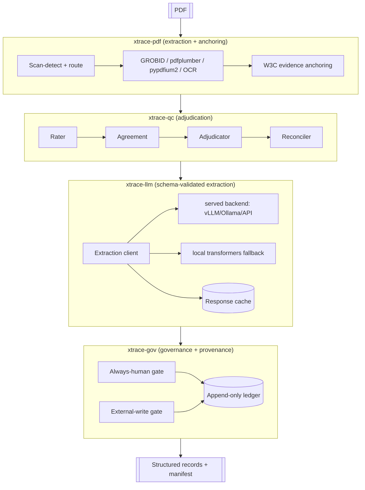

# Design — Evidence-Traceability Toolkit (`xtrace`)

**Status:** Draft (Phase 1 — Design)
**Traces:** `requirements.md`
**Language:** English

---

## 1. Architecture overview

`xtrace` is a four-layer pipeline. Each layer is an installable package with a
strict, test-enforced dependency direction: **data flows up, imports flow down,
and no lower layer knows about a higher one.**



**Dependency direction (enforced by `test_dependency_directions.py`):**
`xtrace-gov` → may use all · `xtrace-llm` → `xtrace-pdf` types + `xtrace-qc`
contracts · `xtrace-qc` → nothing in the family · `xtrace-pdf` → nothing in the
family.

## 2. Core data contracts (Pydantic v2)

A single shared `xtrace-core` module (tiny, dependency-free) holds the contracts
every layer speaks, so packages depend on **types**, not on each other's code.

```python
class EvidenceAnchor(BaseModel):        # the 6-key schema, unchanged from EviTrace
    found_sentence: str | None
    page_index: int | None
    prefix: str | None
    suffix: str | None
    block_bbox: tuple | None
    span_bboxes: list[dict] | None

class ExtractedField(BaseModel):
    key: str
    value: str | None
    confidence: Literal["h", "m", "l", "nr"] | float
    evidence: EvidenceAnchor
    provenance: dict                     # model, prompt hash, chunk ids

class QCRecord(BaseModel):
    field_key: str
    checks: list[VerificationResult]     # each: check_name, status, score, evidence
    agreement: float | None              # named statistic (Krippendorff α)
    adjudicated_status: Literal["pass", "flag", "fail"]

class ProvenanceEntry(BaseModel):
    ts: str; actor: str; stage: str
    subject_id: str; action: str; payload_hash: str; outcome: str
```

## 3. Package designs

### 3.1 `xtrace-pdf`

- **Backends** (each wraps one library, lazy-imported, zero cross-imports):
  `grobid` (TEI, HTTP), `pdfplumber` (structural blocks + font), `pypdfium2`
  (text/bbox/raster — the permissive PyMuPDF replacement), `paddleocr`/
  `tesseract` (OCR extra), `pymupdf` (AGPL, `ocr` extra only, as cross-check).
- **Routing brain** (`build_bundle`): scan-detect per page → route native →
  GROBID+pdfplumber, scanned → OCR. This logic moves *into* the package (in
  EviTrace it lived in `pipeline/`).
- **Anchoring** (`matchers.LexicalMatcher` + `SemanticMatcher`): two-pass exact
  match (whitespace → punctuation-insensitive) with `difflib` span recovery and
  cross-page overlap handling; semantic FAISS fallback (extra). Emits
  `EvidenceAnchor`.
- **Interface:** `extract(pdf_path, config) -> Bundle{ full_text, page_texts,
  blocks, tei, anchors }`.

### 3.2 `xtrace-qc`

- **Generic engine** `run_pipeline(bundle, stages)` over a mutable `QCBundle`;
  `run_quality_control` is the PDF-specific adapter.
- **Stages** are injectable callables: `Rater` (coverage heuristics),
  `Agreement` (Krippendorff α over rater verdicts), `Adjudicator` (weighted
  composite → pass/flag/fail), `Reconciler` (builds unified record + semantic/
  structural layers + char-level trace).
- **Checks** (tiered): Tier-1 coverage heuristics (always), Tier-2 source-text
  presence (injected matcher), Tier-3 semantic verification (injected embedding
  callable, `semantic` extra).
- **Concerns**: duck-typed strategies (text-fidelity via edit distance,
  section-verification, table/figure merge), each with a default impl.
- **No** first-party imports except `xtrace-core` types.

### 3.3 `xtrace-llm`

```
schema.py     # Pydantic extraction models (per extraction map)
client.py     # instructor(LiteLLM(...)) -> validated object; bounded repair
backends/
  served.py   # default path: vLLM / Ollama / hosted API (OpenAI-compatible)
  local.py    # fallback: transformers batched generation (from pdm)
cache.py      # diskcache-backed, key = (model, prompt_hash, item)
```

- **One interface:** `extract(evidence_bundle, schema) -> ExtractedRecord`.
- **Routing:** LiteLLM selects provider; instructor enforces the Pydantic
  schema and drives the repair retry loop; both hosted and served-local models
  travel the same code path. Raw `transformers` is used only when no
  OpenAI-compatible endpoint is available.
- **Prompting:** cache-stable shared prefix; input built strictly from the
  anchored evidence bundle (R-LLM-7). Prompt hashed for provenance.
- **Failure handling:** `FailedCall` records; never silently dropped.

### 3.4 `xtrace-gov`

- **Ledger:** SQLite (queryable) with JSONL export; append-only; one
  `ProvenanceEntry` per decision.
- **Always-human gate:** config-driven closed category set (e.g.
  `privacy_sensitive`, `low_confidence`, `first_time_entity`); matching items
  become review records; fail-closed if policy missing (R-GOV-3).
- **External-write gate:** single audited path (submit → resolve → rollback)
  with an idempotency ledger; default executor is a no-op staging executor.
- **Review CLI** (`Typer` + `Rich`): list queue, show item + evidence, approve/
  reject → writes actor + outcome to the ledger.

## 4. End-to-end flow

1. `xtrace-pdf.extract` → evidence bundle (text, anchors, TEI).
2. `xtrace-llm.extract` → `ExtractedRecord` (schema-validated, per field
   evidence + provenance), cached.
3. `xtrace-qc.run_quality_control` → `QCRecord` per field + flag CSV.
4. `xtrace-gov`: log all decisions; route always-human/flagged fields to review;
   auto-commit the rest; write reproducibility manifest.
5. Output: structured records (JSON/CSV) + W3C annotations + manifest + ledger.

## 5. Cross-cutting design

- **Config:** `pydantic-settings` + YAML; extraction map + agent schema as JSON.
- **Extras isolation:** `[ocr]`, `[semantic]`, `[local]`, `[all]`; heavy/copyleft
  deps never in a default `dependencies` list.
- **Reproducibility:** manifest writer (git SHA, platform, seeds, resolved
  config, per-file SHA-256, pinned-vs-installed diff) — ported from pdm.
- **Idempotency/resume:** content-addressed caches (TEI, embeddings, LLM
  responses) + per-PDF manifest; re-runs are no-ops on unchanged inputs.
- **Errors:** structured exceptions; degrade-not-crash on optional-backend
  absence (R-PDF-3); fail-closed on governance-policy absence (R-GOV-3).

## 6. Testing strategy

- Unit + Hypothesis property tests per package (house standard).
- `test_dependency_directions.py` per package (import-boundary guard).
- Golden-file tests for anchoring (bbox/prefix/suffix stability).
- A no-optional-deps CI job proving the permissive default install works.

## 7. Open design questions

- Whether `xtrace-core` is a real package or a thin shared module vendored into
  each package (leaning: real, tiny package to avoid version skew).
- Whether reconciler's char-level trace stays mandatory or becomes a concern.
- Serving strategy default: vLLM vs Ollama as the documented local path.
